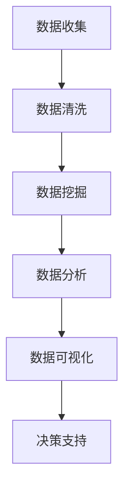
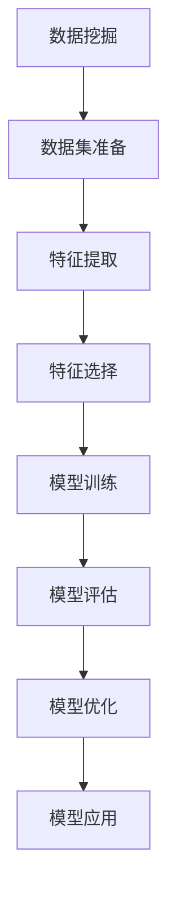
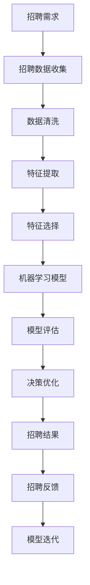

                 

# 基于大数据的招聘数据能分析与应用

> 关键词：大数据, 招聘数据, 数据分析, 数据挖掘, 人工智能

## 1. 背景介绍

### 1.1 问题由来
随着互联网技术的发展和普及，大数据分析已经逐渐成为企业决策的重要依据之一。在招聘领域，大数据分析同样具有重要意义。通过大数据分析，企业可以深入了解应聘者的背景、技能、素质等，从而更准确地匹配岗位需求，提升招聘效率和质量。

在传统的招聘流程中，企业往往依赖于人工简历筛选、面试等手段来确定合适的人选。然而，这些方法不仅效率低下，还存在主观偏见，难以全面准确地评估候选人的实际能力和潜力。而基于大数据的招聘数据能分析，可以借助机器学习、数据挖掘等技术，对海量的招聘数据进行深入分析，挖掘出有价值的信息，为招聘决策提供科学依据。

### 1.2 问题核心关键点
基于大数据的招聘数据能分析，主要关注以下几个核心关键点：
- 数据收集：如何从招聘网站、社交媒体、内部系统等多个渠道收集大量高质量的招聘数据。
- 数据预处理：如何对收集到的数据进行清洗、去重、归一化等处理，提取有用的特征。
- 模型构建：如何选择合适的机器学习模型或算法，对招聘数据进行建模分析。
- 结果评估：如何对模型预测结果进行评估，确保模型的准确性和可靠性。
- 应用部署：如何将模型集成到招聘系统中，提升招聘效率和质量。

### 1.3 问题研究意义
基于大数据的招聘数据能分析，对于企业招聘管理具有重要意义：
- 提升招聘效率：通过机器学习算法，可以快速筛选出符合岗位需求的候选人，减少招聘时间和成本。
- 优化招聘质量：通过数据分析，可以更全面准确地评估候选人的实际能力和潜力，提高招聘成功率。
- 提升人力资源管理水平：通过深入分析招聘数据，可以发现招聘流程中存在的问题，优化招聘策略，提升企业的人力资源管理水平。
- 增强市场竞争力：通过大数据分析，可以洞察市场动态，优化招聘策略，提升企业市场竞争力。
- 推动企业数字化转型：基于大数据的分析技术，是企业数字化转型的重要组成部分，有助于企业实现智能化、自动化、精准化管理。

## 2. 核心概念与联系

### 2.1 核心概念概述

为了更好地理解基于大数据的招聘数据能分析，本节将介绍几个密切相关的核心概念：

- **大数据分析**：指通过对大规模数据进行收集、清洗、分析和挖掘，提取有价值的信息，以支持决策和优化管理的过程。
- **招聘数据**：指与招聘相关的各种数据，包括应聘者简历、面试记录、招聘需求、员工离职数据等。
- **数据挖掘**：指从大量数据中挖掘出隐藏的模式、关系、趋势等，以发现新的知识。
- **机器学习**：指让计算机通过学习历史数据，自动改进算法的性能，解决复杂问题。
- **人工智能**：指通过模拟人类的智能行为，使计算机具备理解、学习、推理等能力。

这些核心概念之间的逻辑关系可以通过以下Mermaid流程图来展示：


这个流程图展示了大数据招聘数据能分析的核心概念及其之间的关系：

1. 大数据分析从数据收集开始，对数据进行清洗和挖掘，提取有价值的信息。
2. 机器学习算法在数据挖掘的基础上进行建模分析，形成预测模型。
3. 人工智能技术赋予模型智能推理和优化能力，提升分析结果的准确性和可靠性。
4. 最终，这些分析结果应用于招聘决策，提升招聘效率和质量。

### 2.2 概念间的关系

这些核心概念之间存在着紧密的联系，形成了招聘数据能分析的完整生态系统。下面我们通过几个Mermaid流程图来展示这些概念之间的关系。

#### 2.2.1 大数据分析的流程



这个流程图展示了大数据分析的基本流程，包括数据收集、清洗、挖掘、分析和可视化等步骤。

#### 2.2.2 数据挖掘与机器学习的关系



这个流程图展示了数据挖掘与机器学习之间的关系。数据挖掘通过特征提取、选择和训练，形成预测模型，然后对模型进行评估和优化，最后应用于实际问题。

#### 2.2.3 人工智能在招聘数据分析中的应用


这个流程图展示了人工智能在招聘数据分析中的应用。通过预处理、模型训练和推理，形成优化决策，提升招聘质量。

### 2.3 核心概念的整体架构

最后，我们用一个综合的流程图来展示这些核心概念在大数据招聘数据能分析过程中的整体架构：



这个综合流程图展示了从招聘需求到模型迭代的完整流程，包括数据收集、预处理、建模、评估、优化和反馈等环节。

## 3. 核心算法原理 & 具体操作步骤
### 3.1 算法原理概述

基于大数据的招聘数据能分析，本质上是通过机器学习和数据挖掘算法，对招聘数据进行建模分析，以挖掘出有价值的信息，为招聘决策提供科学依据。其核心算法原理包括以下几个步骤：

1. **数据收集**：从招聘网站、社交媒体、内部系统等多个渠道收集大量的招聘数据，包括应聘者的基本信息、简历、面试记录、公司需求等。

2. **数据预处理**：对收集到的数据进行清洗、去重、归一化等处理，提取有用的特征，如应聘者的学历、工作经历、技能、年龄等。

3. **模型构建**：选择合适的机器学习模型或算法，对招聘数据进行建模分析，如线性回归、决策树、随机森林、神经网络等。

4. **结果评估**：对模型预测结果进行评估，确保模型的准确性和可靠性，常用的评估指标包括精度、召回率、F1分数等。

5. **应用部署**：将模型集成到招聘系统中，提升招聘效率和质量，如自动筛选简历、推荐候选人等。

### 3.2 算法步骤详解

以下是基于大数据的招聘数据能分析的具体操作步骤：

**Step 1: 数据收集**

- **招聘网站**：通过爬虫技术从招聘网站如智联招聘、前程无忧、BOSS直聘等收集大量招聘数据。
- **社交媒体**：从LinkedIn、微博等社交平台收集应聘者的简历、招聘需求等信息。
- **内部系统**：从企业的HR管理系统、招聘平台等内部系统，收集应聘者的基本信息、面试记录、招聘需求等数据。

**Step 2: 数据预处理**

- **数据清洗**：去除重复、无效数据，处理缺失值、异常值等。
- **数据归一化**：对不同类型的数据进行归一化处理，如将年龄转化为数值型数据，将学历、技能等分类数据编码。
- **特征提取**：提取有用的特征，如应聘者的学历、工作经历、技能、年龄等。
- **特征选择**：选择对招聘结果有重要影响的特征，去除冗余特征，提高模型效率。

**Step 3: 模型构建**

- **选择模型**：根据具体任务选择合适的机器学习模型或算法，如线性回归、决策树、随机森林、神经网络等。
- **数据划分**：将数据集划分为训练集、验证集和测试集，进行模型训练、调参和评估。
- **模型训练**：使用训练集对模型进行训练，调整模型参数，提升模型精度。
- **模型评估**：在验证集上评估模型性能，选择最优模型。

**Step 4: 结果评估**

- **评估指标**：选择适合的评估指标，如精度、召回率、F1分数等。
- **结果分析**：分析模型预测结果，发现模型的不足之处，进行优化。
- **模型优化**：通过调整模型参数、增加特征等方式，优化模型性能。

**Step 5: 应用部署**

- **集成到系统**：将模型集成到招聘系统中，如自动筛选简历、推荐候选人等。
- **数据更新**：定期更新模型参数和特征，保持模型时效性。
- **系统优化**：优化系统性能，提高响应速度，提升用户体验。

### 3.3 算法优缺点

基于大数据的招聘数据能分析具有以下优点：
1. **高效性**：可以快速处理大量数据，筛选出符合岗位需求的候选人。
2. **准确性**：通过数据挖掘和机器学习算法，能够更全面准确地评估候选人的实际能力和潜力。
3. **可扩展性**：能够根据企业需求，灵活调整模型和算法，适应不同的招聘场景。
4. **成本低**：相比传统的人工筛选，能够降低招聘成本，提升招聘效率。

同时，该方法也存在一些缺点：
1. **数据质量依赖**：模型效果依赖于数据质量，如果数据存在噪声、缺失等问题，会影响模型性能。
2. **模型复杂度高**：需要大量的数据和计算资源，模型复杂度高，难以解释和调试。
3. **算法风险**：算法模型存在潜在的偏差和误差，需要多次迭代和优化。
4. **隐私问题**：收集和使用数据时，需要注意隐私保护和数据安全。

### 3.4 算法应用领域

基于大数据的招聘数据能分析，已经在多个领域得到了广泛应用，例如：

- **招聘流程优化**：通过数据分析，优化招聘流程，提升招聘效率和质量。
- **人才储备管理**：通过预测模型，分析企业人才需求，优化人才储备策略。
- **薪酬体系优化**：通过数据分析，发现薪酬结构问题，优化薪酬体系，提升员工满意度。
- **员工流失预测**：通过预测模型，分析员工流失因素，优化管理策略，降低员工流失率。
- **招聘渠道优化**：通过数据分析，评估招聘渠道效果，优化招聘渠道策略，提升招聘效果。

除了这些传统应用场景，基于大数据的招聘数据能分析还在不断拓展应用领域，如人才职业发展规划、员工绩效评估、企业人才结构分析等，为企业的人力资源管理提供了更全面的支持。

## 4. 数学模型和公式 & 详细讲解 & 举例说明
### 4.1 数学模型构建

基于大数据的招聘数据能分析，通常采用以下数学模型进行建模：

1. **线性回归模型**：用于预测应聘者的薪资水平、面试通过率等连续型变量。
2. **决策树模型**：用于分类预测应聘者的工作类型、岗位匹配度等分类变量。
3. **随机森林模型**：用于提升模型精度和鲁棒性，通过集成多个决策树进行预测。
4. **神经网络模型**：用于复杂的招聘数据分析，通过多层网络结构提取特征，提升预测精度。

以线性回归模型为例，其数学模型为：

$$y = \beta_0 + \beta_1x_1 + \beta_2x_2 + ... + \beta_nx_n + \epsilon$$

其中，$y$表示预测目标，$x_1, x_2, ..., x_n$表示特征变量，$\beta_0, \beta_1, \beta_2, ..., \beta_n$表示回归系数，$\epsilon$表示随机误差项。

### 4.2 公式推导过程

以下以线性回归模型为例，推导其公式推导过程：

假设有一组训练数据$(x_i, y_i)$，$i=1,2,...,n$，其中$x_i$表示特征向量，$y_i$表示目标值。目标是找到一个线性函数$f(x) = \beta_0 + \beta_1x_1 + \beta_2x_2 + ... + \beta_nx_n$，使得预测值$f(x)$与真实值$y$的误差最小化。

最小化误差的目标函数为：

$$\min_{\beta_0, \beta_1, ..., \beta_n} \sum_{i=1}^n(y_i - f(x_i))^2$$

根据最小二乘法的原理，可以得到回归系数的求解公式：

$$\beta_k = \frac{\sum_{i=1}^n(x_{ik}y_i - \bar{x}_k\bar{y})}{\sum_{i=1}^n(x_{ik}^2 - \bar{x}_k^2)} \qquad (k = 0, 1, ..., n)$$

其中，$\bar{x}_k$和$\bar{y}$表示特征和目标的均值，$x_{ik}$表示特征向量的第$k$个元素。

### 4.3 案例分析与讲解

以招聘薪资预测为例，假设企业有如下数据：

| 应聘者编号 | 学历 | 工作年限 | 面试结果 | 薪资水平 |
| --- | --- | --- | --- | --- |
| 1 | 本科 | 3 | 通过 | 10k |
| 2 | 硕士 | 2 | 通过 | 15k |
| 3 | 本科 | 5 | 未通过 | 8k |
| ... | ... | ... | ... | ... |

假设我们想要预测应聘者的薪资水平，可以根据以上数据构建线性回归模型：

$$y = \beta_0 + \beta_1x_1 + \beta_2x_2 + \epsilon$$

其中，$x_1$表示学历，$x_2$表示工作年限，$\epsilon$表示随机误差项。

通过最小二乘法求解回归系数$\beta_0$和$\beta_1$，可以构建预测模型，并对新应聘者的薪资水平进行预测。

## 5. 项目实践：代码实例和详细解释说明
### 5.1 开发环境搭建

在进行招聘数据分析实践前，我们需要准备好开发环境。以下是使用Python进行Pandas、NumPy、Scikit-learn等库的开发环境配置流程：

1. 安装Anaconda：从官网下载并安装Anaconda，用于创建独立的Python环境。

2. 创建并激活虚拟环境：
```bash
conda create -n data-env python=3.8 
conda activate data-env
```

3. 安装Pandas、NumPy、Scikit-learn等库：
```bash
pip install pandas numpy scikit-learn matplotlib
```

4. 安装各类工具包：
```bash
pip install tqdm jupyter notebook ipython
```

完成上述步骤后，即可在`data-env`环境中开始招聘数据分析实践。

### 5.2 源代码详细实现

下面我们以招聘薪资预测为例，给出使用Scikit-learn库对数据进行线性回归分析的Python代码实现。

```python
import pandas as pd
from sklearn.linear_model import LinearRegression
from sklearn.model_selection import train_test_split
from sklearn.metrics import mean_squared_error

# 加载数据集
data = pd.read_csv('salary_data.csv')

# 提取特征和目标变量
X = data[['学历', '工作年限']]
y = data['薪资水平']

# 划分训练集和测试集
X_train, X_test, y_train, y_test = train_test_split(X, y, test_size=0.2, random_state=42)

# 构建线性回归模型
model = LinearRegression()

# 训练模型
model.fit(X_train, y_train)

# 预测测试集
y_pred = model.predict(X_test)

# 计算评估指标
mse = mean_squared_error(y_test, y_pred)
rmse = mse ** 0.5
print(f'RMSE: {rmse:.2f}')
```

以上代码实现了对招聘薪资数据的线性回归分析，具体步骤如下：

1. 加载数据集，提取特征和目标变量。
2. 划分训练集和测试集。
3. 构建线性回归模型，并使用训练集进行拟合。
4. 使用测试集进行预测，并计算评估指标。

### 5.3 代码解读与分析

让我们再详细解读一下关键代码的实现细节：

**数据加载**：
```python
data = pd.read_csv('salary_data.csv')
```

- 使用Pandas库加载CSV格式的数据集。

**特征提取**：
```python
X = data[['学历', '工作年限']]
y = data['薪资水平']
```

- 提取应聘者的学历和工作年限作为特征，薪资水平作为目标变量。

**模型构建和训练**：
```python
from sklearn.linear_model import LinearRegression
model = LinearRegression()
model.fit(X_train, y_train)
```

- 使用Scikit-learn库构建线性回归模型，并使用训练集进行拟合。

**预测和评估**：
```python
y_pred = model.predict(X_test)
mse = mean_squared_error(y_test, y_pred)
rmse = mse ** 0.5
print(f'RMSE: {rmse:.2f}')
```

- 使用测试集进行预测，并计算均方误差（MSE）和均方根误差（RMSE）作为评估指标。

以上代码实现了一个简单的招聘薪资预测模型，展示了如何使用Scikit-learn库进行数据处理、模型构建、训练和评估。实际应用中，还需要对模型进行更多的调参和优化，才能得到更好的预测效果。

### 5.4 运行结果展示

假设在上述数据集上训练的模型，在测试集上的RMSE为1000元，则表示模型预测的平均误差为1000元。如果这个误差能够接受，则说明模型能够较好地预测应聘者的薪资水平，可以进行进一步的优化和应用。

## 6. 实际应用场景
### 6.1 智能招聘系统

基于大数据的招聘数据能分析，可以广泛应用于智能招聘系统的构建。传统的招聘系统往往依赖于人工简历筛选、面试等手段，效率低下，且存在主观偏见。而使用数据分析技术，可以自动分析应聘者的背景、技能、素质等，快速筛选出符合岗位需求的候选人，提升招聘效率和质量。

在技术实现上，可以收集企业内部的历史招聘数据，结合行业标准，构建招聘数据能分析模型。模型能够自动分析简历，提取有用的特征，进行多维度评估，筛选出最合适的候选人。对于新申请的简历，系统可以自动推送给合适的面试官，提升面试效率。

### 6.2 企业人才储备管理

企业的人才储备管理是一个复杂且耗时的过程。通过招聘数据分析，企业可以更准确地预测人才需求，优化人才储备策略，提升企业的人力资源管理水平。

具体而言，企业可以收集历史招聘数据，结合市场动态和行业需求，构建预测模型。模型能够预测未来的人才需求，帮助企业提前招聘和储备人才，降低招聘成本。同时，通过数据分析，企业还可以发现人才流失的因素，优化人才管理策略，降低员工流失率。

### 6.3 薪酬体系优化

薪酬体系是企业人力资源管理的重要组成部分。通过招聘数据分析，企业可以发现薪酬结构存在的问题，优化薪酬体系，提升员工满意度。

具体而言，企业可以收集历史招聘数据，构建薪资预测模型。模型能够预测应聘者的薪资水平，帮助企业建立公平、合理的薪酬体系，吸引和留住优秀人才。同时，通过数据分析，企业还可以发现薪资结构对员工工作满意度和流失率的影响，优化薪酬策略。

### 6.4 员工流失预测

员工流失是企业人力资源管理中的重要问题。通过招聘数据分析，企业可以预测员工流失的风险，优化管理策略，降低员工流失率。

具体而言，企业可以收集历史员工流失数据，构建预测模型。模型能够预测员工流失的风险，帮助企业提前采取措施，减少员工流失。同时，通过数据分析，企业还可以发现员工流失的原因，优化管理策略，提升员工满意度和留任率。

### 6.5 招聘渠道优化

招聘渠道是企业招聘效果的重要因素。通过招聘数据分析，企业可以评估不同招聘渠道的效果，优化招聘渠道策略，提升招聘效果。

具体而言，企业可以收集历史招聘数据，构建渠道效果评估模型。模型能够评估不同渠道的招聘效果，帮助企业选择最有效的招聘渠道，降低招聘成本，提升招聘效率。

## 7. 工具和资源推荐
### 7.1 学习资源推荐

为了帮助开发者系统掌握基于大数据的招聘数据能分析的理论基础和实践技巧，这里推荐一些优质的学习资源：

1. **《Python数据分析实战》**：一本系统介绍Python数据分析的书籍，涵盖数据清洗、数据可视化、统计分析等内容。

2. **《数据科学与机器学习实战》**：一本介绍数据科学和机器学习的书籍，涵盖数据挖掘、模型构建、评估等。

3. **Coursera《机器学习》课程**：由斯坦福大学开设的机器学习课程，有Lecture视频和配套作业，带你入门机器学习基础。

4. **Kaggle竞赛**：Kaggle平台上有大量的数据分析和机器学习竞赛，通过参与竞赛可以积累实战经验。

5. **GitHub项目**：在GitHub上Star、Fork数最多的数据分析和机器学习项目，往往代表了该技术领域的发展趋势和最佳实践，值得去学习和贡献。

通过对这些资源的学习实践，相信你一定能够快速掌握基于大数据的招聘数据能分析的精髓，并用于解决实际的招聘问题。

### 7.2 开发工具推荐

高效的开发离不开优秀的工具支持。以下是几款用于招聘数据分析开发的常用工具：

1. **Python**：基于Python的开源数据分析工具，支持Pandas、NumPy、Scikit-learn等库，适合快速迭代研究。

2. **R语言**：基于R的开源数据分析工具，支持ggplot2、dplyr、caret等库，适合数据可视化和建模分析。

3. **Tableau**：商业化的数据可视化工具，支持快速构建交互式数据报表和可视化图表，方便数据分析结果的展示。

4. **Power BI**：微软推出的商业化BI工具，支持数据联接、可视化、报表生成等，适合企业级的数据分析应用。

5. **Jupyter Notebook**：开源的交互式编程环境，支持Python、R等语言，适合数据处理、建模分析和结果展示。

合理利用这些工具，可以显著提升招聘数据分析任务的开发效率，加快创新迭代的步伐。

### 7.3 相关论文推荐

基于大数据的招聘数据能分析领域的研究进展如下：

1. **《基于大数据的招聘数据分析与优化研究》**：介绍了大数据在招聘分析中的应用，包括数据收集、预处理、建模和评估等。

2. **《机器学习在招聘数据分析中的应用》**：介绍了机器学习算法在招聘数据分析中的应用，包括回归模型、分类模型、聚类模型等。

3. **《招聘数据分析中的数据挖掘技术》**：介绍了数据挖掘技术在招聘数据分析中的应用，包括特征提取、关联规则挖掘、文本挖掘等。

4. **《大数据在企业人力资源管理中的应用》**：介绍了大数据技术在企业人力资源管理中的应用，包括招聘数据分析、员工流失预测、薪酬体系优化等。

这些论文代表了大数据分析在招聘领域的研究进展。通过学习这些前沿成果，可以帮助研究者把握学科前进方向，激发更多的创新灵感。

除上述资源外，还有一些值得关注的前沿资源，帮助开发者紧跟招聘数据分析技术的最新进展，例如：

1. **arXiv论文预印本**：人工智能领域最新研究成果的发布平台，包括大量尚未发表的前沿工作，学习前沿技术的必读资源。

2. **业界技术博客**：如领英、微软Research Asia等顶尖实验室的官方博客，第一时间分享他们的最新研究成果和洞见。

3. **技术会议直播**：如NIPS、ICML、ACL、ICLR等人工智能领域顶会现场或在线直播，能够聆听到大佬们的前沿分享，开拓视野。

4. **GitHub热门项目**：在GitHub上Star、Fork数最多的数据分析和机器学习项目，往往代表了该技术领域的发展趋势和最佳实践，值得去学习和贡献。

5. **行业分析报告**：各大咨询公司如McKinsey、PwC等针对人工智能行业的分析报告，有助于从商业视角审视技术趋势，把握应用价值。

总之，对于基于大数据的招聘数据分析技术的学习和实践，需要开发者保持开放的心态和持续学习的意愿。多关注前沿资讯，多动手实践，多思考总结，必将收获满满的成长收益。

## 8. 总结：未来发展趋势与挑战

### 8.1 总结

本文对基于大数据的招聘数据能分析方法进行了全面系统的介绍。首先阐述了大数据分析在招聘领域的应用背景和意义，明确了基于数据分析的招聘决策的优势和价值。其次，从原理到实践，详细讲解了招聘数据分析的数学模型和算法步骤，给出了招聘薪资预测的代码实例。同时，本文还广泛探讨了数据分析在招聘流程优化、人才储备管理、薪酬体系优化、员工流失预测等方面的应用，展示了数据分析技术在人力资源管理中的巨大潜力。最后，本文精选了数据分析的各类学习资源和工具推荐，力求为读者提供全方位的技术指引。

通过本文的系统梳理，可以看到，基于大数据的招聘数据分析方法在招聘管理中具有重要的实际应用价值，通过数据分析技术，企业可以提升招聘效率和质量，优化人力资源管理，提升市场竞争力。未来，随着大数据和机器学习技术的发展，招聘数据分析将更加智能化、自动化，进一步提升招聘管理水平。

### 8.2 未来发展趋势

