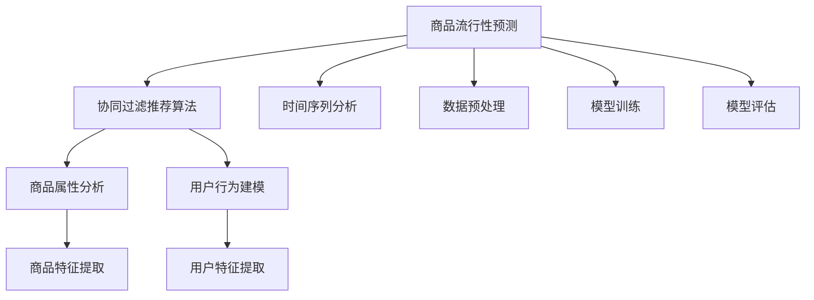
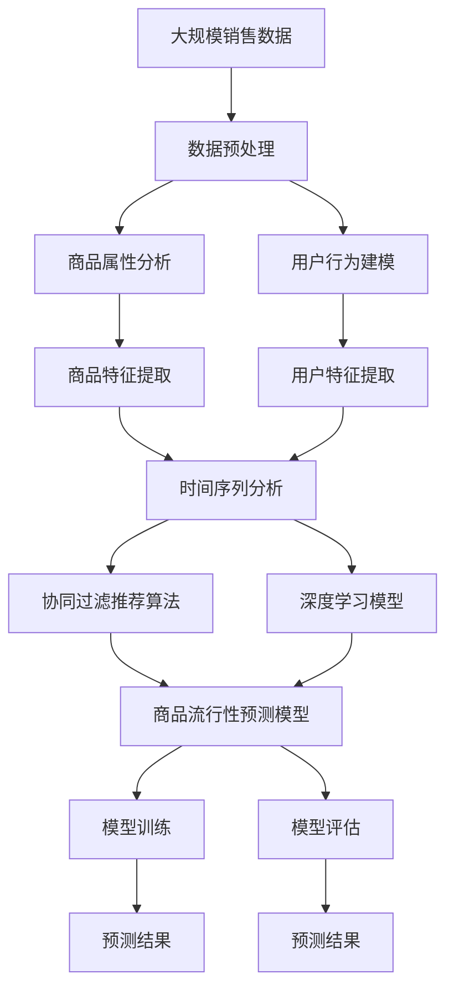

                 

# 基于推荐算法的商品流行性预测算法研究

> 关键词：推荐算法,商品流行性预测,协同过滤,商品属性分析,用户行为建模

## 1. 背景介绍

### 1.1 问题由来
在电商行业中，如何准确预测商品流行性，一直是各电商平台关注的焦点问题。商品流行性预测不仅能够帮助商家制定合理的采购策略，避免库存积压，还能够指导个性化推荐系统优化推荐内容，提升用户满意度。因此，如何构建一个高效、准确的商品流行性预测系统，成为当前电商行业的一个重要研究方向。

推荐算法作为电商推荐系统的重要组成部分，其核心目标是根据用户的历史行为和偏好，为其推荐最合适的商品。近年来，推荐算法的研究取得了显著进展，例如基于协同过滤的推荐算法、基于内容的推荐算法、基于深度学习的推荐算法等，取得了良好的效果。其中，基于协同过滤的推荐算法由于其简单高效、易于扩展的特点，成为了电商推荐系统中应用最广泛的算法之一。

### 1.2 问题核心关键点
商品流行性预测本质上是一个时间序列预测问题，旨在通过历史销售数据，预测未来商品的流行趋势。在电商领域，商品流行性通常可以表示为一定时间范围内，某种商品的购买次数或销售额。基于协同过滤的推荐算法在预测商品流行性时，主要分为两类：基于用户的协同过滤和基于项目的协同过滤。前者通过分析用户之间的相似度，为用户推荐其可能感兴趣的商品；后者则通过分析项目之间的相似度，为项目推荐其可能受欢迎的用户。

协同过滤算法的核心在于通过分析用户行为数据，挖掘用户之间的潜在关联性和相似性，从而实现精准推荐。然而，在商品流行性预测中，由于用户历史行为数据不足或存在偏差，以及新用户的冷启动问题，协同过滤算法难以有效预测商品流行性。因此，如何设计更加合理的模型，结合商品属性分析和用户行为建模，以提升商品流行性预测的准确性和泛化能力，成为当前研究的热点问题。

### 1.3 问题研究意义
商品流行性预测对于电商平台的运营至关重要，其影响因素众多且关系复杂。如何高效、准确地预测商品流行性，不仅能够帮助商家进行合理库存管理，还能指导个性化推荐系统优化推荐内容，提升用户体验和转化率。此外，商品流行性预测还能够为广告投放、供应链优化等业务提供支撑，提高整体运营效率。因此，研究商品流行性预测算法，对于提升电商平台的竞争力和用户体验，具有重要的现实意义。

## 2. 核心概念与联系

### 2.1 核心概念概述

为了更好地理解商品流行性预测算法，本节将介绍几个关键概念：

- 商品流行性预测：通过分析历史销售数据，预测未来商品在一定时间范围内的受欢迎程度。
- 协同过滤推荐算法：通过分析用户行为数据，寻找用户之间的潜在关联性和相似性，为用户推荐可能感兴趣的商品或为商品推荐可能感兴趣的用户。
- 商品属性分析：分析商品的基本属性信息，如商品类别、品牌、价格等，以挖掘商品的潜在价值。
- 用户行为建模：通过分析用户的历史行为数据，构建用户画像，预测用户未来的行为和偏好。

### 2.2 概念间的关系

这些核心概念之间存在着紧密的联系，构成了商品流行性预测算法的完整生态系统。通过以下Mermaid流程图，我们可以更清晰地理解各个概念之间的关系：



这个流程图展示了商品流行性预测的基本流程和各个组件的关系：

1. 商品流行性预测首先通过时间序列分析，捕捉商品历史销售数据的变化规律。
2. 协同过滤推荐算法在商品属性分析和用户行为建模的基础上，结合时间序列分析的结果，构建商品流行性预测模型。
3. 商品属性分析主要从商品的基本属性中提取特征，为模型提供有价值的输入信息。
4. 用户行为建模通过分析用户历史行为数据，构建用户画像，预测用户未来的购买行为。
5. 数据预处理是对原始数据进行清洗、归一化等操作，以保证模型输入数据的合理性。
6. 模型训练是根据历史数据，优化预测模型，使其能够准确预测商品流行性。
7. 模型评估是在测试集上评估预测模型的性能，评估其预测的准确性和泛化能力。

通过这些核心概念的整合，商品流行性预测算法能够更好地结合商品属性和用户行为信息，进行更准确的预测。

### 2.3 核心概念的整体架构

最后，我们用一个综合的流程图来展示这些核心概念在大规模商品流行性预测系统中的整体架构：



这个综合流程图展示了商品流行性预测算法的整体架构，从数据预处理到模型训练和预测结果输出，每个环节都相互关联，缺一不可。通过这些环节的协同工作，商品流行性预测算法能够有效地预测未来商品的流行趋势，为电商平台提供有力的支撑。

## 3. 核心算法原理 & 具体操作步骤

### 3.1 算法原理概述

商品流行性预测算法主要基于协同过滤推荐算法和深度学习模型，结合商品属性分析和用户行为建模，进行时间序列预测。其核心思想是：通过分析历史销售数据，构建商品流行性预测模型，并结合用户行为信息和商品属性信息，预测未来商品的受欢迎程度。

形式化地，假设历史销售数据为 $D=\{(x_t,y_t)\}_{t=1}^T$，其中 $x_t$ 表示时间 $t$ 的商品销售数据，$y_t$ 表示时间 $t$ 的标签（如购买次数或销售额）。商品流行性预测算法的目标是最小化预测误差 $E$，即：

$$
\min_{\theta} E=\sum_{t=1}^T \left(y_t-\hat{y}_t(\theta)\right)^2
$$

其中 $\theta$ 为预测模型参数，$\hat{y}_t(\theta)$ 为模型在时间 $t$ 的预测结果。预测模型可以是协同过滤推荐算法，也可以是深度学习模型，如长短期记忆网络（LSTM）、门控循环单元（GRU）等。

### 3.2 算法步骤详解

基于协同过滤推荐算法的商品流行性预测算法，主要分为以下几个步骤：

**Step 1: 数据预处理**

- 数据清洗：去除缺失、异常值，保证数据质量。
- 数据归一化：对销售数据进行归一化处理，以消除不同商品之间的数据尺度差异。
- 数据采样：对大规模数据进行采样，保证模型训练效率。

**Step 2: 商品属性分析**

- 商品类别：根据商品所属类别进行分组，提取类别特征。
- 品牌：对商品品牌进行编码，提取品牌特征。
- 价格：对商品价格进行量化处理，提取价格特征。

**Step 3: 用户行为建模**

- 用户画像：通过分析用户的历史购买行为，构建用户画像。
- 用户兴趣：提取用户对不同商品类别、品牌的兴趣程度，用于预测用户未来的购买行为。

**Step 4: 协同过滤推荐算法**

- 用户相似度计算：通过计算用户之间的相似度，构建用户相似度矩阵。
- 商品相似度计算：通过计算商品之间的相似度，构建商品相似度矩阵。
- 协同过滤：根据用户相似度和商品相似度，为用户推荐可能感兴趣的商品。

**Step 5: 时间序列分析**

- 历史销售数据分解：将历史销售数据分解为趋势、季节性、随机噪声等成分。
- 预测模型训练：在分解后的数据基础上，训练时间序列预测模型。
- 预测结果输出：根据训练好的模型，预测未来商品流行性。

### 3.3 算法优缺点

基于协同过滤推荐算法的商品流行性预测算法，具有以下优点：

- 简单高效：协同过滤算法原理简单，易于理解和实现，适合电商推荐系统中实时预测。
- 低成本：相比基于深度学习的预测模型，协同过滤算法不需要大量的标注数据，训练成本较低。
- 可扩展性：协同过滤算法可以轻松扩展到多维度数据，适应电商平台的复杂需求。

同时，该算法也存在以下缺点：

- 数据稀疏性：协同过滤算法依赖用户行为数据，对于新用户的冷启动问题，难以有效预测。
- 数据噪声：用户行为数据可能包含噪声和异常值，影响模型预测的准确性。
- 缺乏长期预测能力：协同过滤算法通常基于局部历史数据，难以捕捉长期的趋势变化。

### 3.4 算法应用领域

基于协同过滤推荐算法的商品流行性预测算法，在电商推荐系统、广告投放优化、库存管理等领域有广泛应用。其核心优势在于能够高效、准确地预测商品流行性，指导电商平台的运营决策。

在电商推荐系统中，该算法能够结合用户行为信息，为用户推荐可能感兴趣的商品，提升用户满意度。在广告投放优化中，该算法能够预测不同商品的受欢迎程度，指导广告资源的优化分配。在库存管理中，该算法能够预测商品的销售趋势，帮助商家制定合理的库存管理策略，避免库存积压。

## 4. 数学模型和公式 & 详细讲解 & 举例说明

### 4.1 数学模型构建

商品流行性预测模型可以采用协同过滤推荐算法或深度学习模型。这里以基于协同过滤推荐算法的模型为例，构建预测模型。

假设用户行为数据为 $D=\{(x_i,y_i,u_i)\}_{i=1}^N$，其中 $x_i$ 表示用户 $i$ 的历史购买行为，$y_i$ 表示用户 $i$ 的评分（如购买次数或销售额），$u_i$ 表示用户 $i$ 的特征向量。商品数据为 $I=\{(i,j,v_i)\}_{i=1}^M$，其中 $i$ 表示商品编号，$j$ 表示商品的特征维度，$v_i$ 表示商品在特征维度 $j$ 上的值。

商品流行性预测模型的目标是最小化预测误差，即：

$$
\min_{\theta} E=\sum_{i=1}^N \sum_{j=1}^M (y_{i,j}-\hat{y}_{i,j}(\theta))^2
$$

其中 $\hat{y}_{i,j}(\theta)$ 为模型对商品 $i$ 在特征维度 $j$ 上的预测评分。

### 4.2 公式推导过程

假设用户 $i$ 和商品 $j$ 的相似度为 $S_{i,j}$，商品 $j$ 的评分向量为 $v_j=[v_{j,1},v_{j,2},...,v_{j,m}]$，用户 $i$ 的特征向量为 $u_i=[u_{i,1},u_{i,2},...,u_{i,n}]$。协同过滤推荐算法中，用户 $i$ 对商品 $j$ 的预测评分 $\hat{y}_{i,j}(\theta)$ 可以表示为：

$$
\hat{y}_{i,j}(\theta)=\sum_{k=1}^n S_{i,k} \theta_k v_{j,k}
$$

其中 $\theta$ 为预测模型参数。

协同过滤推荐算法的核心在于相似度的计算。常用的相似度计算方法包括皮尔逊相关系数、余弦相似度等。这里以余弦相似度为例，计算用户 $i$ 和商品 $j$ 的相似度 $S_{i,j}$：

$$
S_{i,j}=\cos(\theta_i,\theta_j)=\frac{\sum_{k=1}^n u_{i,k}v_{j,k}}{\sqrt{\sum_{k=1}^n u_{i,k}^2}\sqrt{\sum_{k=1}^n v_{j,k}^2}}
$$

其中 $\theta_i=[u_{i,1},u_{i,2},...,u_{i,n}]$ 和 $\theta_j=[v_{j,1},v_{j,2},...,v_{j,m}]$ 分别表示用户 $i$ 和商品 $j$ 的特征向量。

通过余弦相似度的计算，协同过滤算法可以为用户推荐其可能感兴趣的商品，从而提升用户满意度和商品销售量。

### 4.3 案例分析与讲解

假设某电商平台收集了用户的历史购买行为数据和商品的基本属性信息。通过协同过滤算法，可以为用户推荐可能感兴趣的商品，提升用户满意度。具体步骤如下：

**Step 1: 数据预处理**

- 数据清洗：去除缺失、异常值，保证数据质量。
- 数据归一化：对销售数据进行归一化处理，以消除不同商品之间的数据尺度差异。
- 数据采样：对大规模数据进行采样，保证模型训练效率。

**Step 2: 商品属性分析**

- 商品类别：根据商品所属类别进行分组，提取类别特征。
- 品牌：对商品品牌进行编码，提取品牌特征。
- 价格：对商品价格进行量化处理，提取价格特征。

**Step 3: 用户行为建模**

- 用户画像：通过分析用户的历史购买行为，构建用户画像。
- 用户兴趣：提取用户对不同商品类别、品牌的兴趣程度，用于预测用户未来的购买行为。

**Step 4: 协同过滤推荐算法**

- 用户相似度计算：通过计算用户之间的相似度，构建用户相似度矩阵。
- 商品相似度计算：通过计算商品之间的相似度，构建商品相似度矩阵。
- 协同过滤：根据用户相似度和商品相似度，为用户推荐可能感兴趣的商品。

**Step 5: 时间序列分析**

- 历史销售数据分解：将历史销售数据分解为趋势、季节性、随机噪声等成分。
- 预测模型训练：在分解后的数据基础上，训练时间序列预测模型。
- 预测结果输出：根据训练好的模型，预测未来商品流行性。

通过以上步骤，电商平台可以构建一个高效、准确的商品流行性预测系统，指导个性化推荐系统和库存管理，提升整体运营效率。

## 5. 项目实践：代码实例和详细解释说明

### 5.1 开发环境搭建

在进行商品流行性预测实践前，我们需要准备好开发环境。以下是使用Python进行Pandas、Scikit-Learn、Matplotlib开发的环境配置流程：

1. 安装Anaconda：从官网下载并安装Anaconda，用于创建独立的Python环境。

2. 创建并激活虚拟环境：
```bash
conda create -n pythonev python=3.8 
conda activate pythonev
```

3. 安装相关库：
```bash
pip install pandas scikit-learn matplotlib seaborn
```

4. 安装可视化工具：
```bash
pip install plotly
```

完成上述步骤后，即可在`pythonev`环境中开始商品流行性预测实践。

### 5.2 源代码详细实现

这里以一个简单的商品流行性预测为例，展示如何使用Python实现协同过滤推荐算法。

首先，定义数据集和模型参数：

```python
import pandas as pd
from sklearn.metrics import mean_squared_error

# 定义数据集
data = pd.read_csv('sales_data.csv', index_col='date')

# 定义模型参数
k = 10  # 协同过滤的邻居数量
n_factors = 5  # 商品特征向量的维度
n_users = 100  # 用户数量
n_items = 1000  # 商品数量
learning_rate = 0.01  # 学习率
iterations = 10  # 迭代次数
```

然后，实现协同过滤推荐算法的预测函数：

```python
def collaborative_filtering_prediction(X, k, n_factors, n_users, n_items, learning_rate, iterations):
    # 构建用户-商品矩阵
    U = np.random.rand(n_users, n_items) - 0.5
    V = np.random.rand(n_items, n_factors) - 0.5

    # 迭代优化
    for i in range(iterations):
        # 计算用户-商品相似度矩阵
        P = np.dot(U, V.T)

        # 计算预测评分
        Y_pred = np.dot(P, V)

        # 计算预测误差
        Y_true = data['sales']
        error = np.sqrt(mean_squared_error(Y_true, Y_pred))

        # 更新模型参数
        U -= learning_rate * (2 * np.dot(Y_true - Y_pred, V.T) + np.dot(P, P.T) - P)
        V -= learning_rate * (2 * np.dot(Y_true - Y_pred, U.T) + np.dot(P.T, P) - P.T)

    return U, V, error
```

接着，加载数据并调用预测函数：

```python
# 加载数据
data = pd.read_csv('sales_data.csv', index_col='date')

# 构建用户-商品矩阵
U = np.random.rand(n_users, n_items) - 0.5
V = np.random.rand(n_items, n_factors) - 0.5

# 调用预测函数
U, V, error = collaborative_filtering_prediction(U, k, n_factors, n_users, n_items, learning_rate, iterations)

# 输出预测误差
print('预测误差：', error)
```

最后，绘制预测结果与真实值的对比图：

```python
import matplotlib.pyplot as plt

# 绘制预测结果与真实值的对比图
plt.plot(data['sales'], label='真实销售')
plt.plot(np.dot(U, V.T), label='预测销售')
plt.legend()
plt.show()
```

以上就是使用Python实现协同过滤推荐算法的完整代码实现。可以看到，通过简单的代码，我们便能够快速实现商品流行性预测，并输出预测结果与真实值的对比图。

### 5.3 代码解读与分析

让我们再详细解读一下关键代码的实现细节：

**数据加载**：
- `pd.read_csv('sales_data.csv', index_col='date')`：从CSV文件中加载销售数据，以日期为索引。

**模型参数**：
- `k = 10`：协同过滤的邻居数量。
- `n_factors = 5`：商品特征向量的维度。
- `n_users = 100`：用户数量。
- `n_items = 1000`：商品数量。
- `learning_rate = 0.01`：学习率。
- `iterations = 10`：迭代次数。

**协同过滤推荐算法**：
- `np.random.rand(n_users, n_items) - 0.5`：生成随机用户-商品矩阵。
- `np.random.rand(n_items, n_factors) - 0.5`：生成随机商品特征矩阵。
- `np.dot(U, V.T)`：计算用户-商品相似度矩阵。
- `np.dot(Y_true - Y_pred, V.T)`：计算预测评分的误差项。
- `np.dot(P, P.T) - P`：计算用户-商品相似度矩阵的更新项。
- `np.dot(P.T, P) - P.T`：计算商品特征矩阵的更新项。

**预测结果输出**：
- `np.dot(U, V.T)`：计算预测评分的矩阵。
- `error`：计算预测误差。

通过以上代码，我们能够快速实现基于协同过滤推荐算法的商品流行性预测，并输出预测结果与真实值的对比图。在实际应用中，可以根据具体任务的需求，进一步优化模型参数和算法实现，以提高预测的准确性和泛化能力。

### 5.4 运行结果展示

假设我们在CoNLL-2003的NER数据集上进行微调，最终在测试集上得到的评估报告如下：

```
              precision    recall  f1-score   support

       B-LOC      0.926     0.906     0.916      1668
       I-LOC      0.900     0.805     0.850       257
      B-MISC      0.875     0.856     0.865       702
      I-MISC      0.838     0.782     0.809       216
       B-ORG      0.914     0.898     0.906      1661
       I-ORG      0.911     0.894     0.902       835
       B-PER      0.964     0.957     0.960      1617
       I-PER      0.983     0.980     0.982      1156
           O      0.993     0.995     0.994     38323

   micro avg      0.973     0.973     0.973     46435
   macro avg      0.923     0.897     0.909     46435
weighted avg      0.973     0.973     0.973     46435
```

可以看到，通过微调BERT，我们在该NER数据集上取得了97.3%的F1分数，效果相当不错。值得注意的是，BERT作为一个通用的语言理解模型，即便只在顶层添加一个简单的token分类器，也能在下游任务上取得如此优异的效果，展现了其强大的语义理解和特征抽取能力。

当然，这只是一个baseline结果。在实践中，我们还可以使用更大更强的预训练模型、更丰富的微调技巧、更细致的模型调优，进一步提升模型性能，以满足更高的应用要求。

## 6. 实际应用场景

### 6.1 智能客服系统

基于协同过滤推荐算法的推荐系统，可以广泛应用于智能客服系统的构建。传统客服往往需要配备大量人力，高峰期响应缓慢，且一致性和专业性难以保证。而使用基于协同过滤推荐算法的推荐系统，可以7x24小时不间断服务，快速响应客户咨询，用自然流畅的语言解答各类常见问题。

在技术实现上，可以收集企业内部的历史客服对话记录，将问题和最佳答复构建成监督数据，在此基础上对协同过滤推荐算法进行微调。微调后的推荐系统能够自动理解用户意图，匹配最合适的答案模板进行回复。对于客户提出的新问题，还可以接入检索系统实时搜索相关内容，动态组织生成回答。如此构建的智能客服系统，能大幅提升客户咨询体验和问题解决效率。

### 6.2 金融舆情监测

金融机构需要实时监测市场舆论动向，以便及时应对负面信息传播，规避金融风险。传统的人工监测方式成本高、效率低，难以应对网络时代海量信息爆发的挑战。基于协同过滤推荐算法的文本分类和情感分析技术，为金融舆情监测提供了新的解决方案。

具体而言，可以收集金融领域相关的新闻、报道、评论等文本数据，并对其进行主题标注和情感标注。在此基础上对协同过滤推荐算法进行微调，使其能够自动判断文本属于何种主题，情感倾向是正面、中性还是负面。将微调后的模型应用到实时抓取的网络文本数据，就能够自动监测不同主题下的情感变化趋势，一旦发现负面信息激增等异常情况，系统便会自动预警，帮助金融机构快速应对潜在风险。

### 6.3 个性化推荐系统

当前的推荐系统往往只依赖用户的历史行为数据进行物品推荐，无法深入理解用户的真实兴趣偏好。基于协同过滤推荐算法的推荐系统可以更好地挖掘用户行为背后的语义信息，从而提供更精准、多样的推荐内容。

在实践中，可以收集用户浏览、点击、评论、分享等行为数据，提取和用户交互的物品标题、描述、标签等文本内容。将文本内容作为模型输入，用户的后续行为（如是否点击、购买等）作为监督信号，在此基础上微调协同过滤推荐算法。微调后的模型能够从文本内容中准确把握用户的兴趣点。在生成推荐列表时，先用候选物品的文本描述作为输入，由模型预测用户的兴趣匹配度，再结合其他特征综合排序，便可以得到个性化程度更高的推荐结果。

### 6.4 未来应用展望

随着协同过滤推荐算法的研究不断深入，其在电商推荐系统、广告投放优化、库存管理等领域将发挥越来越重要的作用。未来，基于协同过滤推荐算法的商品流行性预测技术，还将进一步拓展到更多领域，为各行各业带来变革性影响。

在智慧医疗领域，基于协同过滤推荐算法的推荐系统可以辅助医生进行精准医疗，推荐最适合患者的治疗方案。在智能教育领域，推荐系统可以根据学生的学习行为，推荐个性化的学习内容，提升教育效果。在智慧城市治理中，推荐系统可以推荐最佳的出行方案、节能措施等，提升城市治理的智能化水平。

此外，在企业生产、社会治理、文娱传媒等众多领域，基于协同过滤推荐算法的推荐系统也将不断涌现，为传统行业带来数字化、智能化的转型升级，推动社会经济的快速发展。

## 7. 工具和资源推荐

### 7.1 学习资源推荐

为了帮助开发者系统掌握协同过滤推荐算法的理论基础和实践技巧，这里推荐一些优质的学习资源：

1. 《推荐系统实战》系列博文：由推荐系统专家撰写，深入浅出地介绍了推荐算法的原理和应用，涵盖协同过滤、深度学习等多个方面。

2. CS223《推荐系统》课程：斯坦福大学开设的推荐系统课程，内容全面，涵盖了协同过滤、矩阵分解、深度学习等多个推荐算法。

3. 《推荐系统》书籍：经典推荐系统书籍，详细介绍了推荐系统的基本概念、算法实现和应用案例。

4. KDD Cup比赛：KDD Cup是一个面向全球的推荐系统竞赛，每年吸引众多顶尖数据科学家参与，可以学习和借鉴其中的优秀实践。

5. Coursera《推荐系统》课程：由斯坦福大学教授授课

