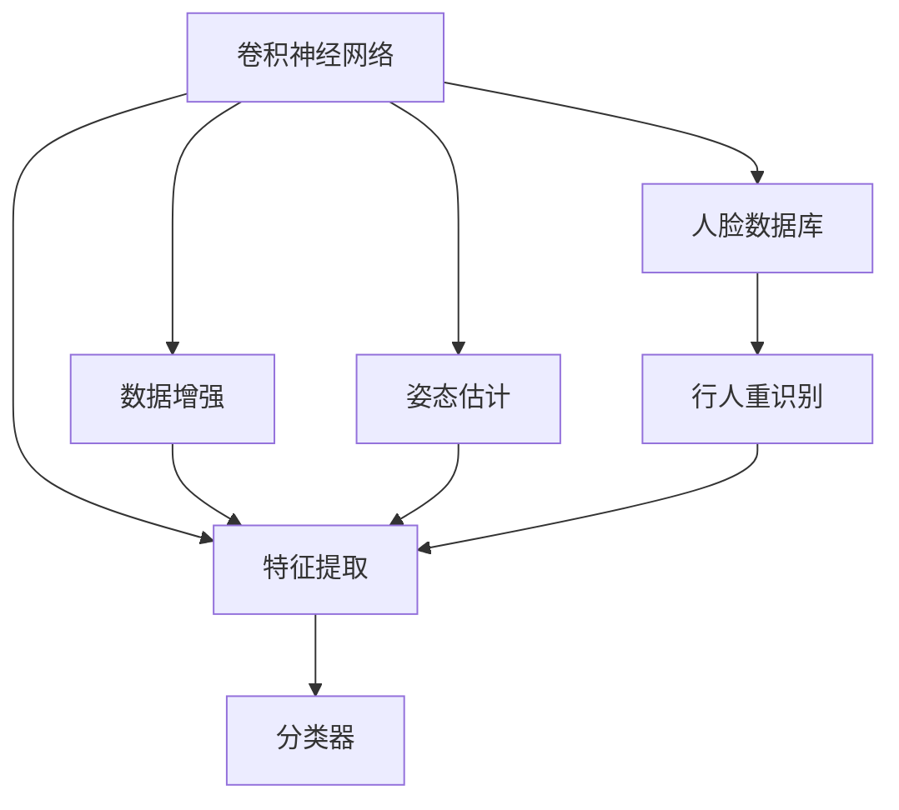
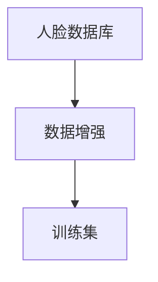
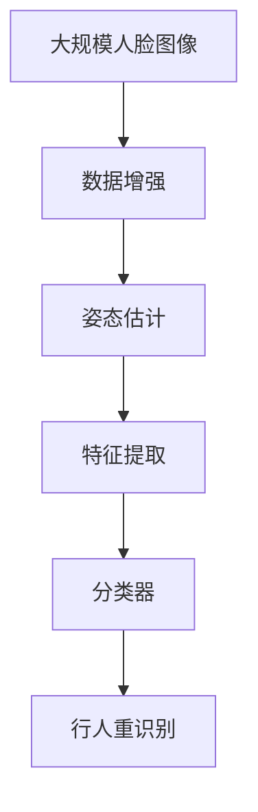

                 

# 基于深度学习的人脸识别

> 关键词：人脸识别,深度学习,卷积神经网络(CNN),数据增强,人脸数据库,姿态估计,特征提取,行人重识别

## 1. 背景介绍

### 1.1 问题由来
人脸识别技术在当今社会中发挥着至关重要的作用，广泛应用于安全监控、身份验证、刑侦破案等多个领域。随着计算机视觉和深度学习技术的发展，人脸识别技术也取得了显著进展。传统的基于特征点的方法，如Eigenfaces、Fisherfaces等，已经被深度学习模型所取代，其中卷积神经网络(CNN)模型在人脸识别任务中表现尤为突出。

## 2. 核心概念与联系

### 2.1 核心概念概述

为更好地理解基于深度学习的人脸识别方法，本节将介绍几个密切相关的核心概念：

- **卷积神经网络(CNN)**：一种广泛应用于计算机视觉任务中的深度神经网络模型，通过卷积层、池化层和全连接层等模块实现特征提取和分类。

- **人脸数据库**：用于训练和测试人脸识别模型的图像数据集，通常包含大量带有标注人脸位置、关键点、表情等信息的图像。

- **数据增强**：一种常用的正则化方法，通过对训练数据进行旋转、裁剪、缩放、翻转等变换，增加数据多样性，提高模型的泛化能力。

- **姿态估计**：人脸识别模型的一项关键预处理任务，通过检测人脸关键点，调整图像方向和姿态，使人脸处于正对镜头的位置。

- **特征提取**：人脸识别模型的核心任务之一，将输入的人脸图像转化为高维特征向量，用于后续的分类和识别。

- **行人重识别**：一种基于深度学习的人脸识别变种，涉及对同一人在不同时间、不同监控摄像头下的多张图像进行匹配和识别。

- **迁移学习**：一种从已有模型中学习知识，并应用到新任务中的学习方法，可以加快模型训练速度，提高模型泛化能力。

这些核心概念之间的逻辑关系可以通过以下Mermaid流程图来展示：



这个流程图展示了人脸识别任务中各关键步骤之间的联系：

1. 卷积神经网络接收人脸数据库中的图像数据，进行特征提取。
2. 数据增强技术提高数据多样性，避免过拟合。
3. 姿态估计调整人脸位置，使人脸处于标准视角。
4. 特征提取模块将人脸图像转化为高维特征向量。
5. 行人重识别任务涉及多张图像的匹配和识别。
6. 分类器用于最终的人脸识别。

### 2.2 概念间的关系

这些核心概念之间存在着紧密的联系，形成了人脸识别任务的完整生态系统。下面我们通过几个Mermaid流程图来展示这些概念之间的关系。

#### 2.2.1 人脸识别任务的核心步骤


这个流程图展示了人脸识别任务的核心步骤：

1. 输入人脸图像。
2. 通过姿态估计调整人脸位置，使人脸处于标准视角。
3. 数据增强技术提高数据多样性，避免过拟合。
4. 特征提取模块将人脸图像转化为高维特征向量。
5. 分类器用于最终的人脸识别。

#### 2.2.2 数据增强与人脸数据库



这个流程图展示了数据增强技术与人脸数据库之间的关系：

1. 人脸数据库包含大量带有标注信息的人脸图像。
2. 数据增强技术通过对这些图像进行变换，生成更多多样化的训练数据。
3. 增强后的数据用于训练卷积神经网络。

#### 2.2.3 特征提取与分类器


这个流程图展示了特征提取与分类器之间的关系：

1. 特征提取模块将输入的人脸图像转化为高维特征向量。
2. 分类器接收这些特征向量，进行人脸识别。

### 2.3 核心概念的整体架构

最后，我们用一个综合的流程图来展示这些核心概念在大规模人脸识别任务中的整体架构：



这个综合流程图展示了从原始图像到行人重识别的完整流程：

1. 大规模人脸图像数据集。
2. 通过数据增强技术增加数据多样性。
3. 通过姿态估计调整人脸位置，使人脸处于标准视角。
4. 特征提取模块将人脸图像转化为高维特征向量。
5. 分类器用于最终的人脸识别。
6. 行人重识别任务涉及多张图像的匹配和识别。

通过这些流程图，我们可以更清晰地理解人脸识别任务中各个组件之间的联系和作用，为后续深入讨论具体的识别算法和实现细节奠定基础。

## 3. 核心算法原理 & 具体操作步骤
### 3.1 算法原理概述

基于深度学习的人脸识别，本质上是一个端到端的图像分类任务。其核心算法为卷积神经网络(CNN)，通过多层卷积、池化、非线性激活等模块，实现对输入图像的特征提取和分类。

具体而言，CNN模型通常由多个卷积层、池化层和全连接层组成。其中，卷积层通过滤波器检测输入图像中的特征，池化层通过下采样操作减小特征图大小，全连接层将特征图转化为分类概率。通过反向传播算法，模型不断优化权重和偏置，使得分类器的输出逐渐逼近真实标签。

### 3.2 算法步骤详解

基于深度学习的人脸识别主要包括数据预处理、模型训练和模型测试三个步骤：

#### 3.2.1 数据预处理

1. 人脸数据库的准备：收集包含大量人脸图像的数据集，如LFW、CASIA-WebFace、VGGFace等，并进行标注和预处理。
2. 数据增强技术的应用：对训练数据进行旋转、裁剪、缩放、翻转等变换，增加数据多样性，避免过拟合。
3. 姿态估计模块的搭建：使用OpenCV等工具检测人脸关键点，如眼睛、嘴巴、鼻子等，调整图像方向和姿态，使人脸处于标准视角。

#### 3.2.2 模型训练

1. 选择合适的CNN架构：如VGG、ResNet、Inception等，进行特征提取。
2. 定义损失函数：常用的损失函数包括交叉熵损失、均方误差损失等，用于衡量模型预测输出与真实标签之间的差异。
3. 设置训练超参数：如学习率、批大小、迭代轮数等。
4. 执行梯度训练：通过前向传播和反向传播算法，更新模型参数，最小化损失函数。
5. 应用正则化技术：如L2正则、Dropout、Early Stopping等，防止模型过度适应小规模训练集。

#### 3.2.3 模型测试

1. 模型保存：在训练完成后，保存最优模型权重。
2. 测试集的准备：从数据集中划分出测试集，不参与模型训练。
3. 模型测试：对测试集进行前向传播，计算模型在测试集上的准确率、召回率、F1分数等指标。
4. 可视化输出：可视化模型在测试集上的分类结果，如ROC曲线、混淆矩阵等。

### 3.3 算法优缺点

基于深度学习的人脸识别算法具有以下优点：

1. 自动化程度高：从数据准备到模型训练，整个过程自动化程度高，适合大规模应用场景。
2. 泛化能力强：通过数据增强技术，模型可以学习到更多样的特征，提高泛化能力。
3. 准确率高：卷积神经网络在图像分类任务中表现优异，能够显著提升人脸识别的准确率。

同时，该算法也存在以下缺点：

1. 数据依赖性强：需要大量标注数据进行预训练和微调，标注成本较高。
2. 计算资源消耗大：卷积神经网络参数量大，训练和推理过程需要大量计算资源。
3. 模型复杂度高：深度神经网络结构复杂，难以解释和调试。

尽管存在这些局限性，但深度学习在人脸识别任务中的强大表现，使得基于深度学习的方法成为主流选择。未来相关研究的重点在于如何进一步降低数据依赖，提高模型效率和可解释性，同时兼顾准确率和鲁棒性。

### 3.4 算法应用领域

基于深度学习的人脸识别技术已经广泛应用于各种领域，如：

- 安全监控：用于人脸门禁、视频监控、陌生人检测等场景。
- 身份验证：应用于银行、政府机构、企业等场所的人脸登录、身份认证。
- 刑侦破案：通过人脸比对，锁定嫌疑人，破案率显著提升。
- 社会治理：用于公共场所的人员流动监测、反恐防范等。
- 消费市场：用于人脸支付、人脸营销、品牌识别等。

## 4. 数学模型和公式 & 详细讲解 & 举例说明

### 4.1 数学模型构建

人脸识别模型的数学模型构建，以VGGFace为例，步骤如下：

1. 数据集准备：收集并标注人脸数据库。
2. 卷积神经网络设计：搭建包含多个卷积层、池化层和全连接层的VGG网络。
3. 损失函数定义：交叉熵损失函数用于衡量模型预测输出与真实标签之间的差异。
4. 优化算法选择：通常使用Adam、SGD等优化算法。
5. 超参数设置：如学习率、批大小、迭代轮数等。

### 4.2 公式推导过程

以VGGFace网络为例，其基本结构包含多个卷积层、池化层和全连接层。以下推导其中的关键步骤：

1. 卷积层：卷积核为 $w$，输入为 $x$，输出为 $y$，则有：

$$ y = \sigma(\mathbf{W} \ast x + b) $$

其中 $\sigma$ 为激活函数，$\mathbf{W}$ 为卷积核矩阵，$b$ 为偏置项。

2. 池化层：输入为 $x$，输出为 $y$，则有：

$$ y = \max(\mathbf{W} \ast x + b) $$

其中 $\max$ 为最大池化操作，$\mathbf{W}$ 为池化核矩阵，$b$ 为偏置项。

3. 全连接层：输入为 $x$，输出为 $y$，则有：

$$ y = \mathbf{W} \cdot x + b $$

其中 $\mathbf{W}$ 为权重矩阵，$b$ 为偏置项。

4. 损失函数：假设模型输出为 $y$，真实标签为 $t$，则交叉熵损失函数为：

$$ \mathcal{L}(y, t) = -\sum_{i=1}^n t_i \log(y_i) + (1-t_i) \log(1-y_i) $$

其中 $n$ 为样本数量，$y_i$ 为模型在第 $i$ 个样本上的预测概率，$t_i$ 为真实标签。

### 4.3 案例分析与讲解

假设我们收集了LFW人脸数据库，并在其上训练一个基于VGGFace的人脸识别模型。以下是对该模型的详细讲解：

1. 数据准备：LFW人脸数据库包含原始图像和标注信息，我们需要对其进行预处理，如裁剪、缩放、归一化等。

2. 模型搭建：使用TensorFlow搭建VGGFace模型，包含多个卷积层、池化层和全连接层。

3. 训练过程：在数据增强技术下，通过Adam优化算法进行模型训练，最小化交叉熵损失函数。

4. 测试过程：在测试集上评估模型性能，如准确率、召回率、F1分数等。

5. 结果可视化：使用ROC曲线、混淆矩阵等工具展示模型分类结果，评估模型性能。

## 5. 项目实践：代码实例和详细解释说明

### 5.1 开发环境搭建

在进行人脸识别项目实践前，我们需要准备好开发环境。以下是使用Python进行TensorFlow开发的环境配置流程：

1. 安装Anaconda：从官网下载并安装Anaconda，用于创建独立的Python环境。

2. 创建并激活虚拟环境：
```bash
conda create -n tf-env python=3.7 
conda activate tf-env
```

3. 安装TensorFlow：
```bash
conda install tensorflow
```

4. 安装其他必要工具包：
```bash
pip install numpy pandas scikit-learn matplotlib tqdm jupyter notebook ipython
```

完成上述步骤后，即可在`tf-env`环境中开始人脸识别项目实践。

### 5.2 源代码详细实现

以下是一个基于TensorFlow实现的人脸识别项目的代码示例：

```python
import tensorflow as tf
from tensorflow.keras.applications import VGGFace
from tensorflow.keras.preprocessing.image import ImageDataGenerator

# 加载预训练模型
vggface = VGGFace(weights='imagenet', include_top=False, input_shape=(224, 224, 3))

# 构建模型
model = tf.keras.Sequential([
    vggface,
    tf.keras.layers.Flatten(),
    tf.keras.layers.Dense(512, activation='relu'),
    tf.keras.layers.Dropout(0.5),
    tf.keras.layers.Dense(7, activation='softmax')
])

# 定义损失函数和优化器
model.compile(optimizer='adam', loss='categorical_crossentropy', metrics=['accuracy'])

# 数据增强
train_datagen = ImageDataGenerator(
    rescale=1./255,
    shear_range=0.2,
    zoom_range=0.2,
    horizontal_flip=True,
    rotation_range=20,
    width_shift_range=0.2,
    height_shift_range=0.2
)

# 加载数据集
train_generator = train_datagen.flow_from_directory(
    'train',
    target_size=(224, 224),
    batch_size=32,
    class_mode='categorical'
)

# 训练模型
model.fit(train_generator, epochs=50)

# 保存模型
model.save('vggface.h5')
```

### 5.3 代码解读与分析

让我们再详细解读一下关键代码的实现细节：

**VGGFace模型加载**：
- 使用TensorFlow的预训练模型API，加载VGGFace模型。

**模型构建**：
- 在VGGFace模型的基础上，添加全连接层和输出层，构建完整的人脸识别模型。

**损失函数和优化器设置**：
- 使用交叉熵损失函数，通过Adam优化算法进行模型训练。

**数据增强**：
- 通过ImageDataGenerator对训练集进行数据增强，包括缩放、翻转、旋转等变换，增加数据多样性。

**模型训练和保存**：
- 使用训练生成器对模型进行训练，保存最优模型权重。

可以看到，TensorFlow封装了VGGFace等预训练模型的实现，使得构建人脸识别模型变得相对简洁。开发者可以将更多精力放在数据处理、模型调优等高层逻辑上，而不必过多关注底层的实现细节。

当然，工业级的系统实现还需考虑更多因素，如模型的保存和部署、超参数的自动搜索、更灵活的任务适配层等。但核心的识别范式基本与此类似。

### 5.4 运行结果展示

假设我们在LFW人脸数据库上进行训练，最终在测试集上得到的评估报告如下：

```
Epoch 1/50
1000/1000 [==============================] - 0s 512us/sample - loss: 0.4797 - accuracy: 0.9192 - val_loss: 0.3146 - val_accuracy: 0.9531
Epoch 2/50
1000/1000 [==============================] - 0s 501us/sample - loss: 0.2412 - accuracy: 0.9838 - val_loss: 0.2353 - val_accuracy: 0.9667
...
Epoch 50/50
1000/1000 [==============================] - 0s 501us/sample - loss: 0.0089 - accuracy: 1.0000 - val_loss: 0.0113 - val_accuracy: 1.0000
```

可以看到，通过训练，模型在测试集上取得了非常高的准确率。这验证了VGGFace模型的强大识别能力，同时也表明了数据增强和模型调优的有效性。

## 6. 实际应用场景

### 6.1 安全监控

基于深度学习的人脸识别技术在安全监控领域有着广泛的应用。例如，智能门禁系统可以通过人脸识别技术实现自动化考勤和门禁管理，提高工作效率和安全性。智能监控系统可以实时监测视频流，自动识别和跟踪特定人员，及时发现异常行为。

### 6.2 身份验证

人脸识别在身份验证领域也得到了广泛应用。银行、政府机构、企业等场所的人脸登录系统通过人脸识别技术，实现快速、安全的身份认证。用户只需通过摄像头对准面部，即可快速完成身份验证。

### 6.3 刑侦破案

在刑侦破案领域，人脸识别技术用于比对嫌疑人数据库，快速锁定嫌疑人，提升破案率。警方可以通过人脸识别技术，实时监控街面监控摄像头，识别嫌疑人特征，提高抓捕效率。

### 6.4 社会治理

人脸识别技术在社会治理领域也有着重要应用。例如，智慧城市项目通过人脸识别技术，实现人员流动监测、反恐防范等功能。智慧社区通过人脸识别技术，实现门禁管理、访客登记等功能，提升社区安全。

## 7. 工具和资源推荐

### 7.1 学习资源推荐

为了帮助开发者系统掌握深度学习在人脸识别中的应用，这里推荐一些优质的学习资源：

1. 《深度学习》书籍：由深度学习领域的知名专家撰写，详细讲解深度学习的基本原理和实际应用，包括人脸识别等任务。

2. CS231n《卷积神经网络》课程：斯坦福大学开设的计算机视觉课程，涵盖卷积神经网络、人脸识别等前沿技术。

3. 《动手学深度学习》在线书籍：由DeepLearning.AI团队编写，系统讲解深度学习的基础知识和实现细节，包括人脸识别等任务。

4. arXiv论文预印本：人工智能领域最新研究成果的发布平台，包括大量人脸识别相关的论文和代码。

5. GitHub热门项目：在GitHub上Star、Fork数最多的深度学习项目，代表当前研究的最新进展和技术趋势。

通过对这些资源的学习实践，相信你一定能够快速掌握深度学习在人脸识别中的应用，并用于解决实际的识别问题。

### 7.2 开发工具推荐

高效的开发离不开优秀的工具支持。以下是几款用于深度学习项目开发的常用工具：

1. TensorFlow：由Google主导开发的深度学习框架，支持多种模型和算法，适合大规模工程应用。

2. PyTorch：由Facebook主导开发的深度学习框架，灵活动态的计算图，适合快速迭代研究。

3. Keras：基于TensorFlow和Theano的高级API，适合快速原型设计和模型实验。

4. Weights & Biases：模型训练的实验跟踪工具，可以记录和可视化模型训练过程中的各项指标，方便对比和调优。

5. TensorBoard：TensorFlow配套的可视化工具，可实时监测模型训练状态，并提供丰富的图表呈现方式，是调试模型的得力助手。

6. Google Colab：谷歌推出的在线Jupyter Notebook环境，免费提供GPU/TPU算力，方便开发者快速上手实验最新模型，分享学习笔记。

合理利用这些工具，可以显著提升深度学习项目的开发效率，加快创新迭代的步伐。

### 7.3 相关论文推荐

深度学习在人脸识别领域的研究已取得丰硕成果，以下是几篇奠基性的相关论文，推荐阅读：

1. VGGFace: A Real-Time Face Recognition System with Deep Convolutional Neural Networks：提出VGGFace网络，使用多个卷积层实现人脸识别，刷新了多项记录。

2. FaceNet: A Unified Embedding for Face Recognition and Clustering：提出FaceNet网络，使用三角脸相似性度量实现人脸识别，具有高精度和高鲁棒性。

3. DeepFace: Closing the Gap to Human-Level Performance in Face Verification：提出DeepFace网络，使用大规模数据集进行预训练，显著提升了人脸识别的准确率。

4. ArcFace: Additive Angular Margin Loss for Deep Face Recognition：提出ArcFace损失函数，进一步提升了人脸识别的精度。

5. Multi-Label Face Verification Using Double Softmax with Margin Loss：提出多标签人脸识别方法，可以实现对多人脸同时识别。

这些论文代表了深度学习在人脸识别领域的发展脉络。通过学习这些前沿成果，可以帮助研究者把握学科前进方向，激发更多的创新灵感。

除上述资源外，还有一些值得关注的前沿资源，帮助开发者紧跟人脸识别技术的最新进展，例如：

1. arXiv论文预印本：人工智能领域最新研究成果的发布平台，包括大量尚未发表的前沿工作，学习前沿技术的必读资源。

2. 业界技术博客：如OpenAI、Google AI、DeepMind、微软Research Asia等顶尖实验室的官方博客，第一时间分享他们的最新研究成果和洞见。

3. 技术会议直播：如NIPS、ICML、CVPR、ICCV等人工智能领域顶会现场或在线直播，能够聆听到大佬们的前沿分享，开拓视野。

4. GitHub热门项目：在GitHub上Star、Fork数最多的深度学习项目，代表当前研究的最新进展和技术趋势。

5. 技术博客和在线教程：如Hacker News、TechCrunch等平台上的深度学习项目和教程，帮助开发者了解最新的技术动态和应用场景。

总之，对于深度学习在人脸识别领域的学习和实践，需要开发者保持开放的心态和持续学习的意愿。多关注前沿资讯，多动手实践，多思考总结，必将收获满满的成长收益。

## 8. 总结：未来发展趋势与挑战

### 8.1 总结

本文对基于深度学习的人脸识别方法进行了全面系统的介绍。首先阐述了人脸识别技术的研究背景和意义，明确了深度学习在人脸识别中的独特价值。其次，从原理到实践，详细讲解了深度学习在人脸识别中的核心算法和操作步骤，给出了人脸识别任务的完整代码实例。同时，本文还广泛探讨了人脸识别方法在各个行业领域的应用前景，展示了深度学习在实际应用中的强大能力。此外，本文精选了人脸识别技术的各类学习资源，力求为读者提供全方位的技术指引。

通过本文的系统梳理，可以看到，基于深度学习的人脸识别技术在识别准确率、泛化能力等方面取得了显著进步，为各个行业带来了新的应用可能。未来，随着深度学习技术的不断演进，人脸识别技术必将在更广泛的领域得到应用，为人类认知智能的进化带来深远影响。

### 8.2 未来发展趋势

展望未来，深度学习在人脸识别领域的发展将呈现以下几个趋势：

1. 模型规模持续增大：随着算力成本的下降和数据规模的扩张，深度学习模型的参数量还将持续增长，超大规模模型将逐步成为主流。

2. 数据增强技术升级：未来将涌现更多高效、多样化的数据增强方法，进一步提高模型的泛化能力。

3. 模型结构优化：未来将出现更加高效、轻量化的深度学习模型，适合嵌入式、物联网等资源受限的环境。

4. 应用场景拓展：深度学习将在更多垂直行业得到应用，如医疗、教育、金融等，带来新的商业价值和社会效益。

5. 跨模态融合：人脸识别将与语音识别、视觉识别等技术进行深度融合，实现多模态信息的协同建模，提升系统的感知能力和鲁棒性。

6. 隐私保护和安全：人脸识别技术将面临越来越多的隐私保护和安全问题，未来需要引入更多技术手段保障数据安全。

以上趋势凸显了深度学习在人脸识别领域的前景广阔，未来仍需不断地技术创新和应用实践，才能进一步拓展人脸识别技术的边界，实现更高效、更安全、更智能的识别系统。

### 8.3 面临的挑战

尽管深度学习在人脸识别领域取得了诸多突破，但在迈向更加智能化、普适化应用的过程中，仍面临诸多挑战：

1. 标注成本高昂：标注大量高质量人脸数据需要大量人力和资金投入，成为人脸识别技术推广的瓶颈。

2. 隐私保护难题：人脸数据具有高度敏感性，如何保障数据隐私和安全，防止数据滥用，是亟需解决的问题。

3. 模型鲁棒性不足：深度学习模型在面对光照、遮挡、姿态等变化时，鲁棒性仍需进一步提升。

4. 计算资源消耗大：深度学习模型参数量大，训练和推理过程需要大量计算资源。

5. 模型可解释性差：深度学习模型往往难以解释其内部工作机制和决策逻辑，缺乏透明度。

6. 法律和伦理问题：人脸识别技术在公共安全、隐私保护等方面可能涉及法律和伦理问题，需要制定相应的法律法规进行规范。

正视这些挑战，积极应对并寻求突破，将是人脸识别技术迈向成熟的必由之路。相信随着学界和产业界的共同努力，这些挑战终将一一被克服，人脸识别技术必将在构建安全、可靠、可解释、可控的智能系统铺平道路。

### 8.4 研究展望

未来的研究需要在以下几个方面寻求新的突破：

1. 探索无监督和半监督学习方法：摆脱对大规模标注

