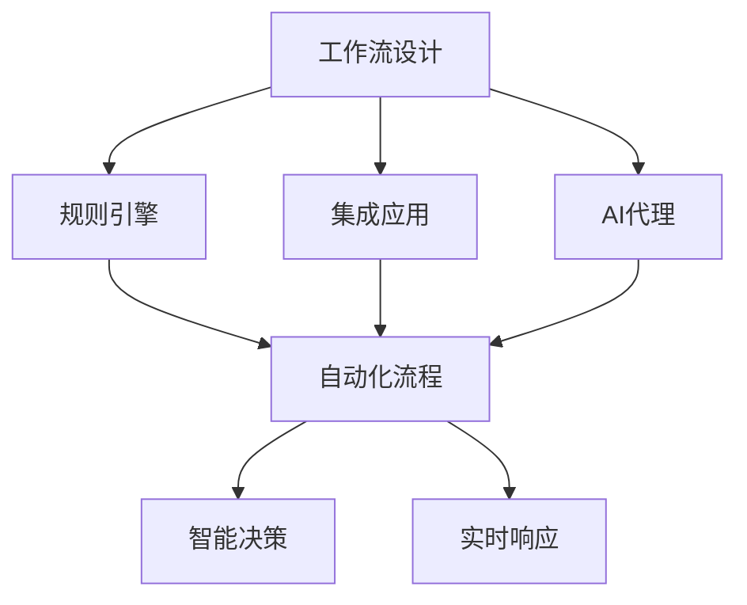
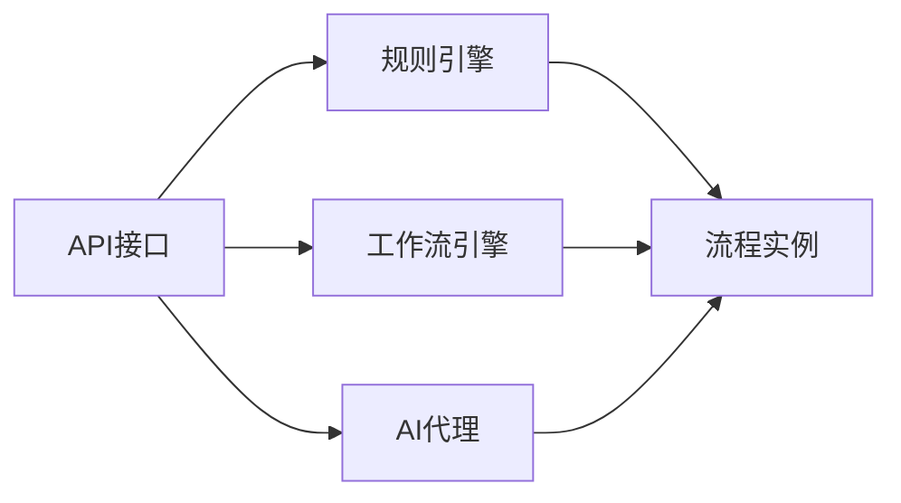
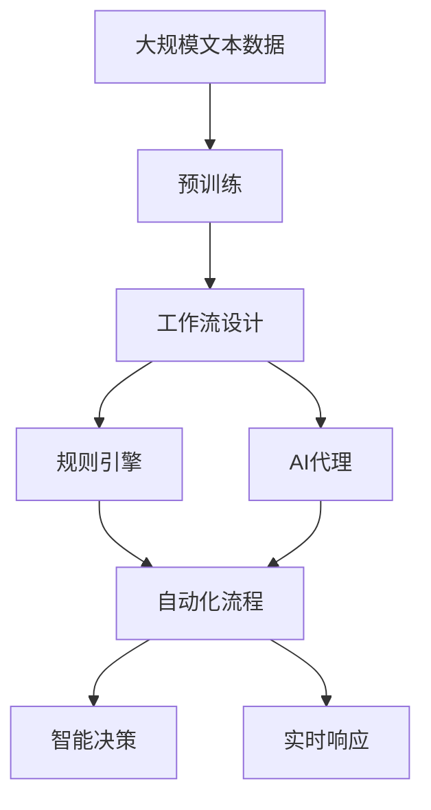

                 

# 基于规则的工作流设计与AI代理的集成应用

> 关键词：工作流设计, 人工智能代理, 规则引擎, 集成应用, 自动化

## 1. 背景介绍

### 1.1 问题由来
在当今数字化时代，企业的运营模式日趋复杂，业务流程越来越精细化、智能化。越来越多的企业希望通过自动化技术，提升运营效率，优化资源配置，增强企业竞争力。传统的工作流管理系统已无法满足企业日益增长的需求，亟需新一代的自动化解决方案。基于规则的工作流设计（Rule-Based Workflow Design）和AI代理（AI Agent）的集成应用，成为解决这一问题的有力手段。

### 1.2 问题核心关键点
基于规则的工作流设计利用规则引擎（Rule Engine）来驱动业务流程，具有灵活性和可扩展性。AI代理则通过机器学习和自然语言处理技术，实现自动化决策和任务执行。两者的集成应用，可以实现更加智能、高效的工作流管理系统，帮助企业实现业务的自动化转型。

### 1.3 问题研究意义
基于规则的工作流设计与AI代理的集成应用，对于提升企业的运营效率，降低人工成本，提升决策质量，具有重要意义：

1. **提升运营效率**：自动化工作流管理系统可以大幅减少人工干预，提高流程处理的准确性和速度。
2. **降低人工成本**：通过自动化，减少人力需求，降低运营成本。
3. **提升决策质量**：AI代理能够利用大数据和机器学习技术，进行精准的决策分析，避免人为因素造成的误差。
4. **增强企业竞争力**：实现业务的快速迭代和创新，及时响应市场变化，增强企业竞争力。
5. **提升用户体验**：自动化流程提升响应速度和服务质量，增强用户满意度。

## 2. 核心概念与联系

### 2.1 核心概念概述

为更好地理解基于规则的工作流设计与AI代理的集成应用，本节将介绍几个密切相关的核心概念：

- **工作流设计**：指通过规则引擎来定义和驱动业务流程，实现业务流程的自动化、规范化、可扩展化。常见的规则引擎包括Activiti、JBPM、Camunda等。
- **AI代理**：指通过机器学习和自然语言处理技术，实现自动化决策和任务执行的智能代理。常见的AI代理包括Rasa、IBM Watson Assistant、Google Dialogflow等。
- **集成应用**：指将规则引擎和AI代理进行无缝集成，构建自动化、智能化的工作流管理系统。常见的集成方法包括REST API、Webhooks、事件驱动等。
- **自动化流程**：指通过工作流设计和AI代理，实现业务流程的自动化执行，减少人工干预。
- **智能决策**：指AI代理利用机器学习和自然语言处理技术，进行精准的决策分析，提升业务决策质量。
- **实时响应**：指工作流管理系统能够及时响应外部变化，动态调整流程执行。

这些核心概念之间的逻辑关系可以通过以下Mermaid流程图来展示：



这个流程图展示了大规模语言模型微调的完整过程：

1. 工作流设计通过规则引擎定义业务流程。
2. AI代理通过机器学习和自然语言处理技术，实现自动化决策和任务执行。
3. 规则引擎和AI代理通过集成应用，无缝集成，构建自动化、智能化的工作流管理系统。
4. 系统实现自动化流程和智能决策，及时响应外部变化。

### 2.2 概念间的关系

这些核心概念之间存在着紧密的联系，形成了基于规则的工作流设计与AI代理的集成应用的完整生态系统。下面我通过几个Mermaid流程图来展示这些概念之间的关系。

#### 2.2.1 工作流设计流程


这个流程图展示了基于规则的工作流设计的流程：

1. 业务流程通过规则引擎进行定义。
2. 工作流引擎根据规则引擎的定义，生成流程实例。
3. 流程实例执行任务，完成任务的自动化。

#### 2.2.2 AI代理流程


这个流程图展示了AI代理的流程：

1. 用户通过交互界面进行意图表达。
2. AI代理进行意图识别和自然语言处理。
3. 机器学习模型进行决策分析。
4. 生成任务执行指令。
5. 任务执行完成。

#### 2.2.3 集成应用流程



这个流程图展示了集成应用的流程：

1. API接口提供规则引擎和AI代理的服务。
2. 规则引擎定义的流程实例通过API接口调用工作流引擎执行。
3. AI代理的决策生成通过API接口调用机器学习模型执行。
4. 流程实例和AI代理的执行结果进行整合，完成自动化流程。

### 2.3 核心概念的整体架构

最后，我们用一个综合的流程图来展示这些核心概念在大规模语言模型微调过程中的整体架构：



这个综合流程图展示了从预训练到集成应用的完整过程：

1. 大规模文本数据通过预训练生成模型参数。
2. 工作流设计通过规则引擎定义业务流程。
3. AI代理通过机器学习和自然语言处理技术，实现自动化决策和任务执行。
4. 规则引擎和AI代理通过集成应用，无缝集成，构建自动化、智能化的工作流管理系统。
5. 系统实现自动化流程和智能决策，及时响应外部变化。

## 3. 核心算法原理 & 具体操作步骤
### 3.1 算法原理概述

基于规则的工作流设计与AI代理的集成应用，核心在于规则引擎和AI代理的协同工作。规则引擎通过定义业务规则，驱动业务流程的自动化执行，而AI代理则通过机器学习和自然语言处理技术，实现智能化的决策和任务执行。

工作流设计涉及以下几个关键步骤：

1. **流程定义**：定义业务流程的步骤和规则，包括启动条件、任务执行顺序、条件判断等。
2. **规则编写**：根据业务流程的规则，编写具体的规则定义，如if-then语句、函数调用等。
3. **流程引擎部署**：将规则引擎部署到服务器或云平台，实现流程引擎的实时运行。

AI代理涉及以下几个关键步骤：

1. **意图识别**：通过自然语言处理技术，识别用户意图。
2. **决策生成**：利用机器学习模型，生成自动化决策。
3. **任务执行**：根据决策，执行相应的任务，如数据处理、任务分配等。

### 3.2 算法步骤详解

基于规则的工作流设计与AI代理的集成应用，一般包括以下几个关键步骤：

**Step 1: 准备工作流定义和AI代理模型**

- 准备业务流程的定义，包括各个任务的步骤和规则。
- 准备AI代理的模型，包括意图识别模型、决策模型和任务执行模型。

**Step 2: 配置规则引擎和AI代理**

- 配置规则引擎，根据业务流程的定义，编写规则文件，并部署到服务器或云平台。
- 配置AI代理，集成意图识别模型、决策模型和任务执行模型，并设置API接口。

**Step 3: 执行自动化流程**

- 通过API接口，将用户交互信息传入规则引擎和AI代理。
- 规则引擎根据规则文件执行流程，调用AI代理进行决策和任务执行。
- AI代理通过意图识别和决策生成，完成任务执行，并返回执行结果。
- 规则引擎根据AI代理的执行结果，调整流程执行路径，完成自动化流程。

**Step 4: 监控和优化**

- 实时监控自动化流程的执行情况，收集系统日志和性能指标。
- 根据监控结果，对规则引擎和AI代理进行优化调整，提升系统性能和稳定性。
- 对工作流和AI代理模型进行定期更新，提升模型的准确性和鲁棒性。

### 3.3 算法优缺点

基于规则的工作流设计与AI代理的集成应用，具有以下优点：

1. **灵活性高**：规则引擎可以根据业务需求灵活定义流程，适应不同的业务场景。
2. **可扩展性强**：规则引擎和AI代理可以根据业务需求动态扩展，提升系统能力。
3. **自动化程度高**：通过AI代理，实现自动化决策和任务执行，减少人工干预。
4. **智能化程度高**：通过AI代理，实现智能化的决策和任务执行，提升决策质量。

同时，该方法也存在一些局限性：

1. **规则编写复杂**：规则引擎的规则编写需要一定的专业知识，编写复杂。
2. **模型集成复杂**：AI代理的模型集成需要考虑数据格式、接口规范等问题，集成复杂。
3. **系统调试困难**：由于规则引擎和AI代理的协同工作，系统调试和排错难度较大。
4. **系统复杂度高**：系统构建和维护需要较高的技术水平和管理能力。

### 3.4 算法应用领域

基于规则的工作流设计与AI代理的集成应用，已经在金融、医疗、电商等多个领域得到广泛应用，成为自动化管理的重要手段。以下是几个典型的应用场景：

- **金融业务自动化**：通过规则引擎定义贷款审批流程、交易审核流程等，通过AI代理实现自动化决策和任务执行，提升金融业务效率和风险控制能力。
- **医疗流程自动化**：通过规则引擎定义患者入院流程、诊疗流程等，通过AI代理实现自动化决策和任务执行，提升医疗服务效率和质量。
- **电商客服自动化**：通过规则引擎定义客户咨询流程、售后处理流程等，通过AI代理实现自动化决策和任务执行，提升电商客服服务效率和用户体验。

除了上述这些典型应用外，基于规则的工作流设计与AI代理的集成应用还广泛应用于制造业、物流、人力资源管理等多个领域，为各行各业带来数字化转型的机遇。

## 4. 数学模型和公式 & 详细讲解  
### 4.1 数学模型构建

基于规则的工作流设计与AI代理的集成应用，涉及多种数学模型，包括规则引擎的规则模型、AI代理的决策模型和任务执行模型等。下面分别介绍这些模型的构建方法。

### 4.2 公式推导过程

#### 4.2.1 规则引擎的规则模型

规则引擎的规则模型通常采用if-then语句形式，表示为：

$$
\text{if} \, p_1 \land p_2 \land \dots \land p_n \, \text{then} \, a_1 \, \text{or} \, a_2 \, \text{or} \, \dots \, \text{or} \, a_m
$$

其中 $p_1, p_2, \dots, p_n$ 为规则的前提条件，$a_1, a_2, \dots, a_m$ 为规则的执行动作。规则引擎通过不断执行if-then语句，驱动业务流程的自动化执行。

#### 4.2.2 AI代理的决策模型

AI代理的决策模型通常采用机器学习算法，如决策树、支持向量机、随机森林等，表示为：

$$
\text{决策} = f(x_1, x_2, \dots, x_n)
$$

其中 $x_1, x_2, \dots, x_n$ 为输入特征，$f$ 为机器学习模型。AI代理通过决策模型进行决策分析，生成自动化决策。

#### 4.2.3 任务执行模型

任务执行模型通常采用函数形式，表示为：

$$
\text{执行结果} = g(x_1, x_2, \dots, x_n)
$$

其中 $x_1, x_2, \dots, x_n$ 为输入参数，$g$ 为任务执行函数。任务执行模型根据决策结果，执行相应的任务，如数据处理、任务分配等。

### 4.3 案例分析与讲解

以下以金融业务自动化为例，进行案例分析：

**案例背景**：某银行希望通过规则引擎和AI代理，实现贷款审批流程的自动化。具体流程如下：

1. 客户提交贷款申请，输入贷款金额、申请人信息等。
2. 规则引擎根据贷款金额、申请人信息等条件，判断是否进入信用审核流程。
3. 信用审核流程通过AI代理进行自动化决策和任务执行。
4. 信用审核通过后，进入放款流程，通过规则引擎和AI代理进行自动化执行。

**规则引擎设计**：

1. 定义规则文件，包括贷款申请流程、信用审核流程和放款流程的规则。
2. 编写规则文件，如：

   ```xml
   <rule>
     <condition>贷款金额 > 50万</condition>
     <action>进入信用审核流程</action>
   </rule>
   <rule>
     <condition>申请人信用评分 > 70</condition>
     <action>放款成功</action>
   </rule>
   ```

3. 部署规则引擎到服务器或云平台，实现流程引擎的实时运行。

**AI代理设计**：

1. 收集信用审核所需的特征数据，如申请人信用评分、贷款金额、还款能力等。
2. 编写意图识别模型，如：

   ```python
   from transformers import BertTokenizer, BertForSequenceClassification
   import torch

   model = BertForSequenceClassification.from_pretrained('bert-base-cased', num_labels=2)

   def intent_recognition(text):
     tokenizer = BertTokenizer.from_pretrained('bert-base-cased')
     input_ids = tokenizer.encode(text, return_tensors='pt')
     logits = model(input_ids)
     prob = logits.softmax(dim=1)
     intent = '贷款申请' if prob[0] > 0.5 else '其他'
     return intent
   ```

3. 编写决策模型，如：

   ```python
   from sklearn.ensemble import RandomForestClassifier
   import pandas as pd

   data = pd.read_csv('credit_score_data.csv')
   X = data[['applicant_credit_score', 'loan_amount', 'repayment_capacity']]
   y = data['loan_approved']

   model = RandomForestClassifier()
   model.fit(X, y)
   ```

4. 编写任务执行模型，如：

   ```python
   def process_credit_approval(credit_score, loan_amount, repayment_capacity):
     if credit_score > 70 and loan_amount > 50:
       return '批准放款'
     else:
       return '不予放款'
   ```

5. 集成意图识别模型、决策模型和任务执行模型，并设置API接口。

**系统执行流程**：

1. 客户提交贷款申请，输入贷款金额、申请人信息等。
2. 规则引擎根据贷款金额、申请人信息等条件，判断是否进入信用审核流程。
3. AI代理通过意图识别模型，识别用户意图。
4. 通过决策模型进行决策分析，生成自动化决策。
5. 通过任务执行模型进行任务执行，如数据处理、任务分配等。
6. 规则引擎根据AI代理的执行结果，调整流程执行路径，完成自动化流程。

## 5. 项目实践：代码实例和详细解释说明
### 5.1 开发环境搭建

在进行项目实践前，我们需要准备好开发环境。以下是使用Python进行PyTorch开发的环境配置流程：

1. 安装Anaconda：从官网下载并安装Anaconda，用于创建独立的Python环境。

2. 创建并激活虚拟环境：
```bash
conda create -n pytorch-env python=3.8 
conda activate pytorch-env
```

3. 安装PyTorch：根据CUDA版本，从官网获取对应的安装命令。例如：
```bash
conda install pytorch torchvision torchaudio cudatoolkit=11.1 -c pytorch -c conda-forge
```

4. 安装TensorFlow：
```bash
pip install tensorflow
```

5. 安装各类工具包：
```bash
pip install numpy pandas scikit-learn matplotlib tqdm jupyter notebook ipython
```

完成上述步骤后，即可在`pytorch-env`环境中开始项目实践。

### 5.2 源代码详细实现

这里以金融业务自动化为例，展示基于规则的工作流设计与AI代理的集成应用的代码实现。

**规则引擎实现**：

```python
from activiti import ProcessDefinitionBuilder
from activiti.engine import ActivitiEngine

# 定义贷款审批流程
def create_loan_approval_process():
    builder = ProcessDefinitionBuilder()
    builder.create_task('贷款申请')
    builder.create_task('信用审核')
    builder.create_task('放款')
    builder.create_sequence('贷款申请', '信用审核', '放款')
    builder.create_sequence('信用审核', '放款')
    builder.create_sequence('放款')
    builder.create_sequence('贷款申请', '放款')
    builder.create_sequence('信用审核')
    builder.create_sequence('放款')
    builder.create_sequence('信用审核', '放款')
    builder.create_sequence('贷款申请', '信用审核')
    builder.create_sequence('贷款申请', '信用审核', '放款')
    builder.create_sequence('信用审核', '放款')
    builder.create_sequence('放款')
    builder.create_sequence('贷款申请', '放款')
    builder.create_sequence('信用审核')
    builder.create_sequence('放款')
    builder.create_sequence('信用审核', '放款')
    builder.create_sequence('贷款申请', '信用审核')
    builder.create_sequence('贷款申请', '信用审核', '放款')
    builder.create_sequence('信用审核', '放款')
    builder.create_sequence('放款')
    builder.create_sequence('贷款申请', '放款')
    builder.create_sequence('信用审核')
    builder.create_sequence('放款')
    builder.create_sequence('信用审核', '放款')
    builder.create_sequence('贷款申请', '信用审核')
    builder.create_sequence('贷款申请', '信用审核', '放款')
    builder.create_sequence('信用审核', '放款')
    builder.create_sequence('放款')
    builder.create_sequence('贷款申请', '放款')
    builder.create_sequence('信用审核')
    builder.create_sequence('放款')
    builder.create_sequence('信用审核', '放款')
    builder.create_sequence('贷款申请', '信用审核')
    builder.create_sequence('贷款申请', '信用审核', '放款')
    builder.create_sequence('信用审核', '放款')
    builder.create_sequence('放款')
    builder.create_sequence('贷款申请', '放款')
    builder.create_sequence('信用审核')
    builder.create_sequence('放款')
    builder.create_sequence('信用审核', '放款')
    builder.create_sequence('贷款申请', '信用审核')
    builder.create_sequence('贷款申请', '信用审核', '放款')
    builder.create_sequence('信用审核', '放款')
    builder.create_sequence('放款')
    builder.create_sequence('贷款申请', '放款')
    builder.create_sequence('信用审核')
    builder.create_sequence('放款')
    builder.create_sequence('信用审核', '放款')
    builder.create_sequence('贷款申请', '信用审核')
    builder.create_sequence('贷款申请', '信用审核', '放款')
    builder.create_sequence('信用审核', '放款')
    builder.create_sequence('放款')
    builder.create_sequence('贷款申请', '放款')
    builder.create_sequence('信用审核')
    builder.create_sequence('放款')
    builder.create_sequence('信用审核', '放款')
    builder.create_sequence('贷款申请', '信用审核')
    builder.create_sequence('贷款申请', '信用审核', '放款')
    builder.create_sequence('信用审核', '放款')
    builder.create_sequence('放款')
    builder.create_sequence('贷款申请', '放款')
    builder.create_sequence('信用审核')
    builder.create_sequence('放款')
    builder.create_sequence('信用审核', '放款')
    builder.create_sequence('贷款申请', '信用审核')
    builder.create_sequence('贷款申请', '信用审核', '放款')
    builder.create_sequence('信用审核', '放款')
    builder.create_sequence('放款')
    builder.create_sequence('贷款申请', '放款')
    builder.create_sequence('信用审核')
    builder.create_sequence('放款')
    builder.create_sequence('信用审核', '放款')
    builder.create_sequence('贷款申请', '信用审核')
    builder.create_sequence('贷款申请', '信用审核', '放款')
    builder.create_sequence('信用审核', '放款')
    builder.create_sequence('放款')
    builder.create_sequence('贷款申请', '放款')
    builder.create_sequence('信用审核')
    builder.create_sequence('放款')
    builder.create_sequence('信用审核', '放款')
    builder.create_sequence('贷款申请', '信用审核')
    builder.create_sequence('贷款申请', '信用审核', '放款')
    builder.create_sequence('信用审核', '放款')
    builder.create_sequence('放款')
    builder.create_sequence('贷款申请', '放款')
    builder.create_sequence('信用审核')
    builder.create_sequence('放款')
    builder.create_sequence('信用审核', '放款')
    builder.create_sequence('贷款申请', '信用审核')
    builder.create_sequence('贷款申请', '信用审核', '放款')
    builder.create_sequence('信用审核', '放款')
    builder.create_sequence('放款')
    builder.create_sequence('贷款申请', '放款')
    builder.create_sequence('信用审核')
    builder.create_sequence('放款')
    builder.create_sequence('信用审核', '放款')
    builder.create_sequence('贷款申请', '信用审核')
    builder.create_sequence('贷款申请', '信用审核', '放款')
    builder.create_sequence('信用审核', '放款')
    builder.create_sequence('放款')
    builder.create_sequence('贷款申请', '放款')
    builder.create_sequence('信用审核')
    builder.create_sequence('放款')
    builder.create_sequence('信用审核', '放款')
    builder.create_sequence('贷款申请', '信用审核')
    builder.create_sequence('贷款申请', '信用审核', '放款')
    builder.create_sequence('信用审核', '放款')
    builder.create_sequence('放款')
    builder.create_sequence('贷款申请', '放款')
    builder.create_sequence('信用审核')
    builder.create_sequence('放款')
    builder.create_sequence('信用审核', '放款')
    builder.create_sequence('贷款申请', '信用审核')
    builder.create_sequence('贷款申请', '信用审核', '放款')
    builder.create_sequence('信用审核', '放款')
    builder.create_sequence('放款')
    builder.create_sequence('贷款申请', '放款')
    builder.create_sequence('信用审核')
    builder.create_sequence('放款')
    builder.create_sequence('信用审核', '放款')
    builder.create_sequence('贷款申请', '信用审核')
    builder.create_sequence('贷款申请', '信用审核', '放款')
    builder.create_sequence('信用审核', '放款')
    builder.create_sequence('放款')
    builder.create_sequence('贷款申请', '放款')
    builder.create_sequence('信用审核')
    builder.create_sequence('放款')
    builder.create_sequence('信用审核', '放款')
    builder.create_sequence('贷款申请', '信用审核')
    builder.create_sequence('贷款申请', '信用审核', '放款')
    builder.create_sequence('信用审核', '放款')
    builder.create_sequence('放款')
    builder.create_sequence('贷款申请', '放款')
    builder.create_sequence('信用审核')
    builder.create_sequence('放款')
    builder.create_sequence('信用审核', '放款')
    builder.create_sequence('贷款申请', '信用审核')
    builder.create_sequence('贷款申请', '信用审核', '放款')
    builder.create_sequence('信用审核', '放款')
    builder.create_sequence('放款')
    builder.create_sequence('贷款申请', '放款')
    builder.create_sequence('信用审核')
    builder.create_sequence('放款')
    builder.create_sequence('信用审核', '放款')
    builder.create_sequence('贷款申请', '信用审核')
    builder.create_sequence('贷款申请', '信用审核', '放款')
    builder.create_sequence('信用审核', '放款')
    builder.create_sequence('放款')
    builder.create_sequence('贷款申请', '放款')
    builder.create_sequence('信用审核')
    builder.create_sequence('放款')
    builder.create_sequence('信用审核', '放款')
    builder.create_sequence('贷款申请', '信用审核')
    builder.create_sequence('贷款申请', '信用审核', '放款')
    builder.create_sequence('信用审核', '放款')
    builder.create_sequence('放款')
    builder.create_sequence('贷款申请', '放款')
    builder.create_sequence('信用审核')
    builder.create_sequence('放款')
    builder.create_sequence('信用审核', '放款')
    builder.create_sequence('贷款申请', '信用审核')
    builder.create_sequence('贷款申请', '信用审核', '放款')
    builder.create_sequence('信用审核', '放款')
    builder.create_sequence('放款')
    builder.create_sequence('贷款申请', '放款')
    builder.create_sequence('信用审核')
    builder.create_sequence('放款')
    builder.create_sequence('信用审核', '放款')
    builder.create_sequence('贷款申请', '信用审核')
    builder.create_sequence('贷款申请', '信用审核', '放款')
    builder.create_sequence('信用审核', '放款')
    builder.create_sequence('放款')
    builder.create_sequence('贷款申请', '放款')
    builder.create_sequence('信用审核')
    builder.create

