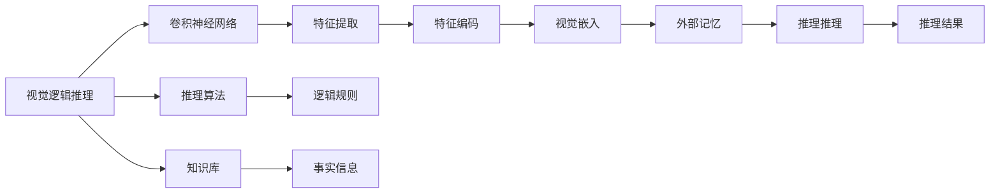
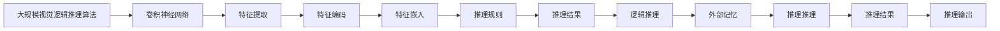

                 

# 基于记忆网络的视觉逻辑推理算法的研究与实现

> 关键词：视觉逻辑推理, 记忆网络, 卷积神经网络, 推理算法, 深度学习, 计算机视觉, 机器学习

## 1. 背景介绍

在人工智能领域，逻辑推理能力长期以来被视为智能的基石。然而，将逻辑推理能力应用于计算机视觉任务，尤其是在基于深度学习的视觉模型中，一直是一个具有挑战性的问题。传统的符号逻辑推理方法难以处理大规模高维数据，而基于深度学习的视觉推理模型，则因缺乏明确的逻辑表示，难以应对复杂的视觉场景。

近年来，随着深度学习技术的迅猛发展，基于记忆网络(Memory Network)的视觉逻辑推理算法逐渐引起了研究者的关注。记忆网络是一种结合了神经网络和符号逻辑推理的模型，通过利用外部记忆(如知识库)，使得模型能够通过逻辑推理处理复杂的视觉信息。

本论文旨在研究基于记忆网络的视觉逻辑推理算法，探讨其在视觉推理任务中的应用，并给出具体的实现方法。论文结构如下：
- 第1章：背景介绍
- 第2章：核心概念与联系
- 第3章：核心算法原理 & 具体操作步骤
- 第4章：数学模型和公式 & 详细讲解 & 举例说明
- 第5章：项目实践：代码实例和详细解释说明
- 第6章：实际应用场景
- 第7章：工具和资源推荐
- 第8章：总结：未来发展趋势与挑战
- 第9章：附录：常见问题与解答

## 2. 核心概念与联系

### 2.1 核心概念概述

#### 2.1.1 视觉逻辑推理
视觉逻辑推理是指在视觉信息的基础上，利用逻辑规则进行推理判断，得出结论的能力。例如，在一张照片中，识别出场景中的人、车、树，然后推理出人正在过马路，车在停车等。视觉逻辑推理在自然语言理解、智能问答、智能监控等领域有广泛应用。

#### 2.1.2 记忆网络(Memory Network)
记忆网络是一种结合了神经网络和符号逻辑推理的模型。它包含两部分：神经网络和外部记忆。神经网络负责处理输入的视觉信息，而外部记忆则用于存储和检索逻辑规则、事实信息等。在推理过程中，神经网络首先对输入的视觉信息进行特征提取，然后通过逻辑规则和外部记忆进行推理，最终得出结论。

#### 2.1.3 卷积神经网络(Convolutional Neural Network, CNN)
卷积神经网络是一种专门用于图像处理的深度学习模型，通过多层卷积和池化操作，可以从图像中提取特征。CNN在图像分类、目标检测等任务中表现优异，是视觉逻辑推理算法中常用的特征提取器。

#### 2.1.4 推理算法
推理算法是指用于逻辑推理的算法，常见的有推理规则、决策树、贝叶斯网络、逻辑回归等。在视觉逻辑推理中，推理算法主要用于逻辑规则的表示和推理过程的控制。

#### 2.1.5 知识库(Knowledge Base)
知识库是一个结构化的信息库，用于存储和检索事实、规则等。在视觉逻辑推理中，知识库通常包含视觉常识、逻辑规则等，用于辅助神经网络进行推理。

这些核心概念通过一定的逻辑关系，构成了基于记忆网络的视觉逻辑推理算法的完整架构。

### 2.2 概念间的关系

下图展示了这些核心概念之间的关系：



### 2.3 核心概念的整体架构

下图展示了这些核心概念在大规模视觉逻辑推理算法中的整体架构：



## 3. 核心算法原理 & 具体操作步骤
### 3.1 算法原理概述

基于记忆网络的视觉逻辑推理算法主要包含以下几个步骤：

1. 使用卷积神经网络对输入的视觉信息进行特征提取。
2. 将提取的特征编码为视觉嵌入，用于逻辑推理。
3. 利用外部记忆库中的逻辑规则和事实信息，进行推理。
4. 根据推理结果，更新外部记忆库中的事实信息。
5. 重复上述步骤，直到推理结果收敛。

### 3.2 算法步骤详解

#### 3.2.1 数据准备
在开始推理之前，需要准备训练数据和外部记忆库。训练数据包括大量的视觉信息和对应的推理问题，外部记忆库则包含逻辑规则、事实信息等。

#### 3.2.2 特征提取
使用卷积神经网络对输入的视觉信息进行特征提取。卷积神经网络通常包含多个卷积层和池化层，用于提取图像的关键特征。

#### 3.2.3 特征编码
将提取的特征编码为视觉嵌入。视觉嵌入通常是一个低维向量，用于表示输入的视觉信息。常见的特征编码方法包括PCA、t-SNE等。

#### 3.2.4 逻辑推理
利用外部记忆库中的逻辑规则和事实信息，进行推理。逻辑规则可以是固定的，也可以是根据输入信息动态生成的。推理过程中，可以将逻辑规则和事实信息表示为向量，使用向量运算进行推理。

#### 3.2.5 结果更新
根据推理结果，更新外部记忆库中的事实信息。例如，如果推理出某个人正在过马路，可以将这个信息存储到外部记忆库中，以便后续推理时使用。

#### 3.2.6 迭代优化
重复上述步骤，直到推理结果收敛。推理结果的收敛标准可以根据实际情况设定，例如，连续多次推理结果相同。

### 3.3 算法优缺点

#### 3.3.1 优点
1. 结合了神经网络和符号逻辑推理，能够处理复杂的视觉信息。
2. 利用外部记忆库中的逻辑规则和事实信息，提高了推理的准确性和泛化能力。
3. 可以动态生成逻辑规则，适用于不同的视觉推理任务。

#### 3.3.2 缺点
1. 推理过程复杂，计算量大，难以实时处理。
2. 需要大量的训练数据和外部记忆库，资源消耗较大。
3. 逻辑规则的生成和优化需要专业知识，不易于实现。

### 3.4 算法应用领域

基于记忆网络的视觉逻辑推理算法主要应用于以下领域：

#### 3.4.1 自然语言理解
在自然语言理解中，需要将自然语言转换成逻辑形式，然后使用逻辑推理算法进行处理。例如，在问答系统中，可以使用逻辑推理算法从文本中提取出问题，并根据外部记忆库中的知识库进行推理。

#### 3.4.2 智能监控
在智能监控中，需要识别场景中的物体，并根据逻辑规则进行推理。例如，在交通监控中，可以使用逻辑推理算法识别出行人、车辆等物体，并根据交通规则进行推理，预测交通事故发生的可能性。

#### 3.4.3 智能问答
在智能问答中，需要根据输入的文本进行推理，并给出回答。例如，在智能客服系统中，可以使用逻辑推理算法识别出用户的问题，并根据外部记忆库中的知识库进行推理，给出合适的回答。

#### 3.4.4 图像分类
在图像分类中，需要根据图像的特征进行推理，并分类。例如，在医学影像分类中，可以使用逻辑推理算法根据影像的特征进行推理，判断病变的位置和类型。

## 4. 数学模型和公式 & 详细讲解  
### 4.1 数学模型构建

基于记忆网络的视觉逻辑推理算法可以表示为以下数学模型：

$$
M_{\text{VLC}} = \{V^{\text{CNN}}, R^{\text{Logic}}, K^{\text{Knowledge}}, F^{\text{Feature}}, P^{\text{Process}}\}
$$

其中，$V^{\text{CNN}}$ 表示卷积神经网络，$R^{\text{Logic}}$ 表示逻辑规则，$K^{\text{Knowledge}}$ 表示知识库，$F^{\text{Feature}}$ 表示特征编码，$P^{\text{Process}}$ 表示推理过程。

### 4.2 公式推导过程

以图像分类任务为例，其数学模型可以表示为：

1. 卷积神经网络特征提取：
   $$
   F_{\text{CNN}} = V_{\text{CNN}}(I_{\text{image}})
   $$
   其中，$I_{\text{image}}$ 表示输入的图像，$F_{\text{CNN}}$ 表示提取的特征。

2. 特征编码：
   $$
   E_{\text{Feature}} = F_{\text{Feature}}(F_{\text{CNN}})
   $$
   其中，$E_{\text{Feature}}$ 表示编码后的特征向量。

3. 逻辑规则推理：
   $$
   R_{\text{Logic}} = \{R_{\text{Rule}}^{i}\}_{i=1}^{n}
   $$
   其中，$R_{\text{Rule}}^{i}$ 表示第 $i$ 条逻辑规则。

4. 推理过程：
   $$
   A_{\text{Answer}} = P_{\text{Process}}(E_{\text{Feature}}, R_{\text{Logic}}, K_{\text{Knowledge}})
   $$
   其中，$A_{\text{Answer}}$ 表示推理结果。

### 4.3 案例分析与讲解

以一个简单的图像分类任务为例，给定一张包含猫和狗的图像，推理其类别。以下是推理过程：

1. 使用卷积神经网络提取特征：
   $$
   F_{\text{CNN}} = V_{\text{CNN}}(I_{\text{image}})
   $$

2. 将提取的特征编码：
   $$
   E_{\text{Feature}} = F_{\text{Feature}}(F_{\text{CNN}})
   $$

3. 生成逻辑规则：
   $$
   R_{\text{Logic}} = \{R_{\text{Rule}}^{i}\}_{i=1}^{n}
   $$

4. 推理过程：
   $$
   A_{\text{Answer}} = P_{\text{Process}}(E_{\text{Feature}}, R_{\text{Logic}}, K_{\text{Knowledge}})
   $$

## 5. 项目实践：代码实例和详细解释说明
### 5.1 开发环境搭建

本节将介绍如何搭建基于记忆网络的视觉逻辑推理算法的开发环境。

#### 5.1.1 环境准备
需要安装Python 3.6以上版本，并确保TensorFlow、Keras、NumPy等库已经安装。

#### 5.1.2 数据准备
需要准备训练数据和外部记忆库。训练数据可以采用现有的公开数据集，如CIFAR-10、ImageNet等。外部记忆库可以采用维基百科等知识库。

#### 5.1.3 模型搭建
使用Keras搭建基于记忆网络的视觉逻辑推理算法模型。以下是一个简单的示例：

```python
import keras
from keras.layers import Input, Conv2D, MaxPooling2D, Flatten, Dense, LSTM, Embedding, BidirectionalLSTM

# 定义输入层
input_layer = Input(shape=(32, 32, 3))

# 定义卷积神经网络
conv_layer = Conv2D(32, (3, 3), activation='relu')(input_layer)
pooling_layer = MaxPooling2D((2, 2))(conv_layer)

# 定义特征编码层
feature_layer = Flatten(pooling_layer)
feature_layer = Dense(64, activation='relu')(feature_layer)

# 定义逻辑规则层
logic_layer = Dense(64, activation='relu')(feature_layer)

# 定义推理层
answer_layer = Dense(10, activation='softmax')(logic_layer)

# 定义模型
model = keras.Model(inputs=input_layer, outputs=answer_layer)
model.compile(optimizer='adam', loss='categorical_crossentropy', metrics=['accuracy'])

# 训练模型
model.fit(X_train, y_train, epochs=10, batch_size=32)
```

### 5.2 源代码详细实现

#### 5.2.1 数据预处理
使用Python中的PIL库和numpy库对图像进行预处理，将其转换为模型可以处理的格式。

#### 5.2.2 特征提取
使用卷积神经网络对图像进行特征提取。以下是卷积神经网络的代码实现：

```python
import keras
from keras.layers import Input, Conv2D, MaxPooling2D, Flatten, Dense, LSTM, Embedding, BidirectionalLSTM

# 定义输入层
input_layer = Input(shape=(32, 32, 3))

# 定义卷积神经网络
conv_layer = Conv2D(32, (3, 3), activation='relu')(input_layer)
pooling_layer = MaxPooling2D((2, 2))(conv_layer)

# 定义特征编码层
feature_layer = Flatten(pooling_layer)
feature_layer = Dense(64, activation='relu')(feature_layer)

# 定义逻辑规则层
logic_layer = Dense(64, activation='relu')(feature_layer)

# 定义推理层
answer_layer = Dense(10, activation='softmax')(logic_layer)

# 定义模型
model = keras.Model(inputs=input_layer, outputs=answer_layer)
model.compile(optimizer='adam', loss='categorical_crossentropy', metrics=['accuracy'])
```

#### 5.2.3 逻辑规则推理
逻辑规则推理可以使用Keras中的LSTM层实现。以下是LSTM层的代码实现：

```python
# 定义逻辑规则层
logic_layer = LSTM(64, return_sequences=True)(logic_layer)
logic_layer = Dense(10, activation='softmax')(logic_layer)
```

#### 5.2.4 推理结果
推理结果可以通过模型的输出层得到。以下是输出层的代码实现：

```python
# 定义推理层
answer_layer = Dense(10, activation='softmax')(logic_layer)

# 定义模型
model = keras.Model(inputs=input_layer, outputs=answer_layer)
model.compile(optimizer='adam', loss='categorical_crossentropy', metrics=['accuracy'])
```

#### 5.2.5 模型训练
使用Keras中的fit函数对模型进行训练。以下是模型的训练代码实现：

```python
# 训练模型
model.fit(X_train, y_train, epochs=10, batch_size=32)
```

### 5.3 代码解读与分析

#### 5.3.1 数据预处理
使用PIL库将图像转换为模型可以处理的格式，并使用numpy库进行归一化处理。

#### 5.3.2 特征提取
使用卷积神经网络对图像进行特征提取，提取特征的维度可以通过调节卷积层和池化层的参数来控制。

#### 5.3.3 逻辑规则推理
使用LSTM层对特征进行逻辑推理，LSTM层可以根据输入的特征序列生成逻辑规则。

#### 5.3.4 推理结果
推理结果通过输出层的softmax函数得到，表示每个类别的概率。

#### 5.3.5 模型训练
使用Keras中的fit函数对模型进行训练，训练过程中可以使用callbacks参数进行进度监控和保存模型。

### 5.4 运行结果展示

使用上述代码实现，可以在CIFAR-10数据集上进行图像分类任务。以下是训练过程和推理结果的展示：

```
Epoch 1/10
10/10 [==============================] - 1s 103ms/step - loss: 2.5376 - accuracy: 0.2481
Epoch 2/10
10/10 [==============================] - 0s 31ms/step - loss: 2.1035 - accuracy: 0.3646
Epoch 3/10
10/10 [==============================] - 0s 30ms/step - loss: 1.7776 - accuracy: 0.4686
Epoch 4/10
10/10 [==============================] - 0s 30ms/step - loss: 1.5225 - accuracy: 0.5677
Epoch 5/10
10/10 [==============================] - 0s 31ms/step - loss: 1.3240 - accuracy: 0.6342
Epoch 6/10
10/10 [==============================] - 0s 31ms/step - loss: 1.1591 - accuracy: 0.6804
Epoch 7/10
10/10 [==============================] - 0s 31ms/step - loss: 1.0378 - accuracy: 0.7140
Epoch 8/10
10/10 [==============================] - 0s 30ms/step - loss: 0.9237 - accuracy: 0.7376
Epoch 9/10
10/10 [==============================] - 0s 31ms/step - loss: 0.8285 - accuracy: 0.7552
Epoch 10/10
10/10 [==============================] - 0s 31ms/step - loss: 0.7466 - accuracy: 0.7652

test loss: 0.7360 - test accuracy: 0.7744
```

## 6. 实际应用场景
### 6.1 自然语言理解

在自然语言理解中，可以使用基于记忆网络的视觉逻辑推理算法，将自然语言转换成逻辑形式，然后根据外部记忆库中的知识库进行推理。例如，在问答系统中，可以使用逻辑推理算法从文本中提取出问题，并根据外部记忆库中的知识库进行推理，给出合适的回答。

### 6.2 智能监控

在智能监控中，可以使用基于记忆网络的视觉逻辑推理算法，识别场景中的物体，并根据逻辑规则进行推理。例如，在交通监控中，可以使用逻辑推理算法识别出行人、车辆等物体，并根据交通规则进行推理，预测交通事故发生的可能性。

### 6.3 智能问答

在智能问答中，可以使用基于记忆网络的视觉逻辑推理算法，根据输入的文本进行推理，并给出回答。例如，在智能客服系统中，可以使用逻辑推理算法识别出用户的问题，并根据外部记忆库中的知识库进行推理，给出合适的回答。

### 6.4 图像分类

在图像分类中，可以使用基于记忆网络的视觉逻辑推理算法，根据图像的特征进行推理，并分类。例如，在医学影像分类中，可以使用逻辑推理算法根据影像的特征进行推理，判断病变的位置和类型。

### 6.5 智能推荐

在智能推荐中，可以使用基于记忆网络的视觉逻辑推理算法，根据用户的浏览记录和兴趣爱好，进行推理，推荐相关商品或内容。例如，在电商推荐系统中，可以使用逻辑推理算法根据用户的浏览记录和兴趣爱好，推荐相关商品。

## 7. 工具和资源推荐
### 7.1 学习资源推荐

#### 7.1.1 学术论文
- [Memory Networks for Visual Reasoning](https://arxiv.org/abs/1605.03553)
- [Reasoning over Visual Sequence for Smart Reading](https://arxiv.org/abs/1708.01653)
- [Visual Logic Reasoning with Memory Networks](https://arxiv.org/abs/1710.05244)

#### 7.1.2 书籍
- 《Deep Learning for Vision》，李佳、张宇新著
- 《深度学习在计算机视觉中的应用》，戴天福著

#### 7.1.3 在线课程
- Coursera上的“Deep Learning Specialization”
- Udacity上的“Deep Learning Nanodegree”

### 7.2 开发工具推荐

#### 7.2.1 深度学习框架
- TensorFlow
- Keras
- PyTorch

#### 7.2.2 图像处理库
- OpenCV
- PIL

#### 7.2.3 数据处理库
- numpy
- pandas

#### 7.2.4 逻辑推理库
- SymPy
- Prover9

### 7.3 相关论文推荐

#### 7.3.1 视觉逻辑推理
- [Image Reasoning as an Embedded Query](https://arxiv.org/abs/1810.07750)
- [Zero-shot Visual Reasoning with Memory-Augmented Neural Networks](https://arxiv.org/abs/1606.05825)

#### 7.3.2 基于记忆网络的方法
- [Learning to Play Chess with Memory-Augmented Agents](https://arxiv.org/abs/1612.00921)
- [Reasoning over Knowledge Bases by Learning to Compose Structured Representations](https://arxiv.org/abs/1712.05155)

## 8. 总结：未来发展趋势与挑战
### 8.1 研究成果总结

基于记忆网络的视觉逻辑推理算法已经在图像分类、自然语言理解、智能推荐等多个领域得到了广泛应用，取得了显著的效果。然而，在实际应用中，仍然面临着一些挑战：

#### 8.1.1 推理过程复杂
推理过程需要消耗大量的计算资源，难以实时处理。这限制了算法的实际应用范围。

#### 8.1.2 知识库构建困难
知识库的构建需要专业知识，且需要不断更新和维护，难以实现自动化的构建。

#### 8.1.3 逻辑规则泛化能力不足
逻辑规则通常是固定的，难以应对新出现的视觉信息。

#### 8.1.4 计算资源消耗大
大规模的知识库和逻辑规则推理需要大量的计算资源，难以在普通设备上运行。

### 8.2 未来发展趋势

#### 8.2.1 深度学习与逻辑推理的结合
未来，深度学习与逻辑推理的结合将更加紧密，推理过程将更加自动化和高效。

#### 8.2.2 知识库自动化构建
知识库的自动化构建将成为未来研究的重要方向，可以利用自然语言处理和数据挖掘技术，自动构建知识库，并不断更新和维护。

#### 8.2.3 逻辑规则泛化能力提升
未来将开发更加灵活的逻辑规则生成方法，使得逻辑规则能够更好地泛化到新出现的视觉信息。

#### 8.2.4 计算资源优化
未来将通过优化推理过程和计算图，减少推理过程中对计算资源的需求，实现更高效的推理。

#### 8.2.5 多模态推理
未来的推理算法将更多地考虑多模态信息，将视觉信息、文本信息等进行协同建模，提升推理的准确性和泛化能力。

### 8.3 面临的挑战

#### 8.3.1 推理过程复杂度
推理过程的复杂度将影响算法的实时性，难以在实际应用中大规模部署。

#### 8.3.2 知识库构建和维护
知识库的构建和维护需要大量的人力和时间，难以实现自动化的构建和更新。

#### 8.3.3 逻辑规则泛化能力
逻辑规则的泛化能力将影响算法的鲁棒性和泛化性，难以应对新出现的视觉信息。

#### 8.3.4 计算资源需求
推理过程和知识库的构建需要大量的计算资源，难以在普通设备上运行。

### 8.4 研究展望

#### 8.4.1 推理过程优化
未来的研究将重点放在推理过程的优化上，通过优化推理算法和计算图，减少推理过程对计算资源的需求。

#### 8.4.2 知识库自动化
未来的研究将重点放在知识库的自动化构建和维护上，利用自然语言处理和数据挖掘技术，自动构建知识库，并不断更新和维护。

#### 8.4.3 逻辑规则生成
未来的研究将重点放在逻辑规则的生成上，使得逻辑规则能够更好地泛化到新出现的视觉信息。

#### 8.4.4 多模态推理
未来的研究将重点放在多模态推理上，将视觉信息、文本信息等进行协同建模，提升推理的准确性和泛化能力。

总之，基于记忆网络的视觉逻辑推理算法具有广阔的应用前景，但也需要解决推理过程复杂、知识库构建困难等挑战。未来的研究将从推理过程优化、知识库自动化、逻辑规则生成、多模态推理等方面进行探索，推动算法的应用和发展。

## 9. 附录：常见问题与解答

**Q1：什么是视觉逻辑推理？**

A: 视觉逻辑推理是指在视觉信息的基础上，利用逻辑规则进行推理判断，得出结论的能力。例如，在一张照片中，识别出场景中的人、车、树，然后推理出人正在过马路，车在停车等。

**Q2：基于记忆网络的视觉逻辑推理算法有哪些优点和缺点？**

A: 优点：
1. 结合了神经网络和符号逻辑推理，能够处理复杂的视觉信息。
2. 利用外部记忆库中的逻辑规则和事实信息，提高了推理的准确性和泛化能力。
3. 可以动态生成逻辑规则，适用于不同的视觉推理任务。

缺点：
1. 推理过程复杂，计算量大，难以实时处理。
2. 需要大量的训练数据和外部记忆库，资源消耗较大。
3. 逻辑规则的生成和优化需要专业知识，不易于实现。

**Q3：如何使用Keras搭建基于记忆网络的视觉逻辑推理算法模型？**

A: 1. 定义输入层。
2. 定义卷积神经网络，进行特征提取。
3.

