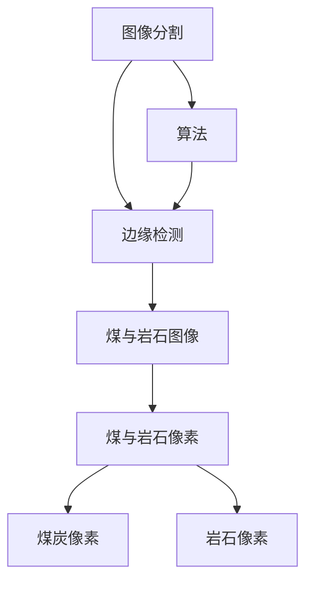
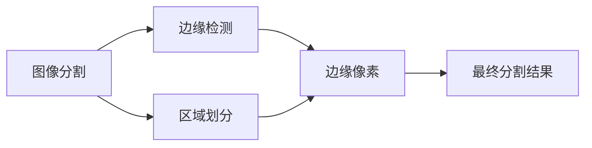
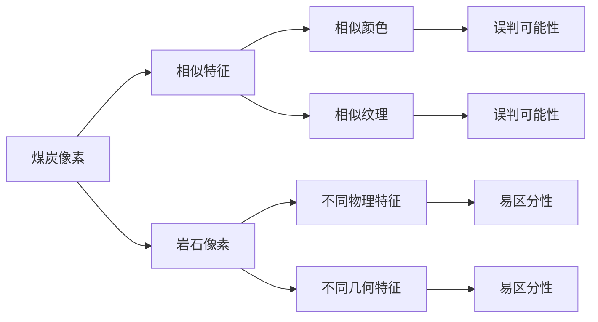
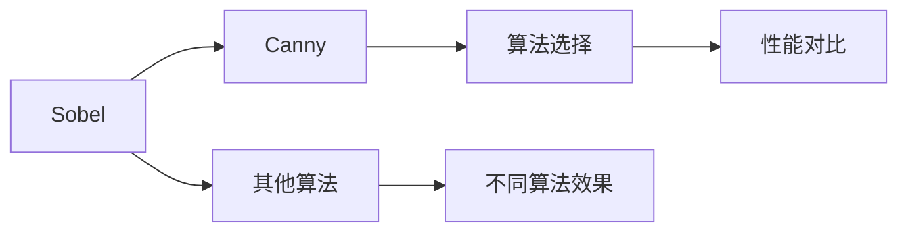
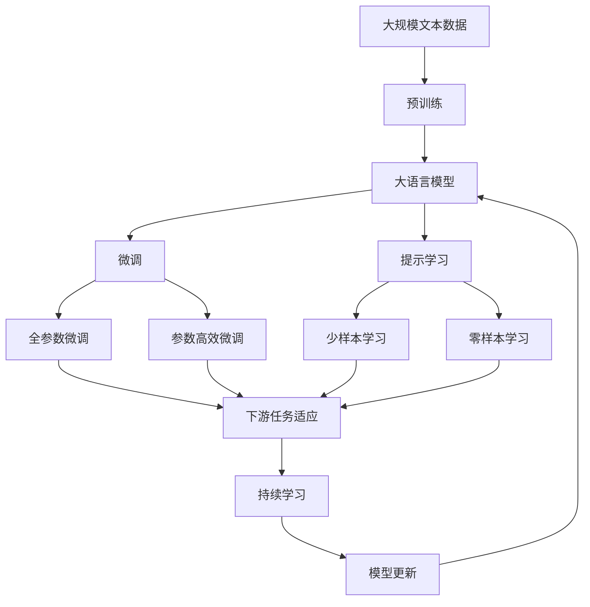

                 

# 基于边缘检测的煤与岩石图像分割方法研究

## 1. 背景介绍

在煤矿领域，精确的煤与岩石图像分割是矿山安全与高效生产的关键步骤之一。随着工业4.0与智能制造的兴起，智能图像识别与分割技术的应用逐渐成为矿山智能化、自动化的重要手段。如何构建高效、准确、鲁棒的煤与岩石图像分割模型，实现煤炭资源高效采掘和岩石自动剔除，成为当下研究的热点问题。

### 1.1 研究背景

目前，图像分割技术已广泛应用于医疗、交通、安防等领域。在煤矿领域，图像分割则需同时应对高噪声、光照不均、尺度不一致等问题。以煤炭开采用例为例，煤矿中煤炭与岩石的像素往往具有相似颜色特征，而这种相似性又给图像分割带来了挑战。现有的一些煤与岩石分割方法，如基于传统的基于阈值的分割方法、基于聚类的方法、基于深度学习的方法等，均存在精度不够、鲁棒性不足或计算复杂度高的问题。因此，本文提出了一种基于边缘检测的煤与岩石图像分割方法，旨在提高煤与岩石图像的分割精度和鲁棒性。

### 1.2 研究目的

本文旨在构建一种高效、鲁棒的煤与岩石图像分割模型，以解决煤矿领域图像分割中存在的鲁棒性不足、精度不高等问题。具体而言，本文的研究目的包括：

1. **提升分割精度**：通过优化算法，提升煤与岩石图像的分割精度，减少误分割现象。
2. **增强模型鲁棒性**：提高模型对煤矿环境中的光照不均、噪声、尺度变化等干扰因素的鲁棒性。
3. **降低计算复杂度**：提高模型计算效率，降低对硬件资源的依赖。

## 2. 核心概念与联系

### 2.1 核心概念概述

为更好地理解基于边缘检测的煤与岩石图像分割方法，本节将介绍几个关键概念：

- **图像分割（Image Segmentation）**：将一幅图像分成若干个不同的区域，每个区域具有相似的颜色、纹理、灰度等特征。煤与岩石图像分割旨在将煤炭与岩石的像素区分开来。
- **边缘检测（Edge Detection）**：通过检测图像中的边缘特征，实现图像的分割和定位。本文将利用边缘检测技术来进行煤与岩石的分割。
- **煤与岩石图像（Coal and Rock Image）**：煤矿环境中，煤炭与岩石在视觉上相似，但具有不同的物理和几何特征，需要通过图像分割技术进行区分。
- **边缘检测算法（Edge Detection Algorithm）**：用于检测图像中边缘的算法，常见的有Sobel、Canny等。

这些核心概念之间的逻辑关系可以通过以下Mermaid流程图来展示：



这个流程图展示了从图像分割到边缘检测的基本流程，以及煤与岩石像素的划分。

### 2.2 概念间的关系

这些核心概念之间存在着紧密的联系，形成了煤与岩石图像分割的整体框架。下面我们通过几个Mermaid流程图来展示这些概念之间的关系。

#### 2.2.1 图像分割与边缘检测的联系



这个流程图展示了图像分割与边缘检测之间的联系。图像分割通过区域划分实现，而边缘检测则是其中重要的一步，用于检测和定位边缘像素。

#### 2.2.2 煤与岩石图像的特性



这个流程图展示了煤与岩石图像的特性。煤炭与岩石在颜色、纹理上相似，但在物理和几何特征上存在差异，这为边缘检测提供了可能。同时，由于煤与岩石的相似性，存在较高的误判可能性，需要通过算法优化提高分割精度。

#### 2.2.3 边缘检测算法的种类



这个流程图展示了边缘检测算法的种类。Sobel和Canny是常用的边缘检测算法，但不同的算法适用于不同的应用场景，需要通过性能对比来选择最适合的算法。

### 2.3 核心概念的整体架构

最后，我们用一个综合的流程图来展示这些核心概念在大语言模型微调过程中的整体架构：



这个综合流程图展示了从预训练到微调，再到持续学习的完整过程。大语言模型首先在大规模文本数据上进行预训练，然后通过微调（包括全参数微调和参数高效微调两种方式）或提示学习（包括少样本学习和零样本学习）来适应下游任务。最后，通过持续学习技术，模型可以不断学习新知识，同时避免遗忘旧知识。

## 3. 核心算法原理 & 具体操作步骤
### 3.1 算法原理概述

本文提出的基于边缘检测的煤与岩石图像分割方法，核心思想是利用边缘检测算法检测图像中的边缘，通过边缘特征将煤炭与岩石像素区分开来。具体而言，算法步骤如下：

1. **边缘检测**：利用Sobel或Canny等边缘检测算法，检测煤与岩石图像中的边缘。
2. **边缘特征提取**：从边缘检测结果中提取边缘像素的位置、方向等特征。
3. **特征融合**：将边缘特征与其他特征（如颜色、纹理、灰度等）融合，构建融合特征向量。
4. **聚类分割**：使用K-means等聚类算法，对融合特征向量进行聚类，实现图像分割。
5. **后处理**：对分割结果进行后处理，如去噪、形态学操作等，提高分割精度。

### 3.2 算法步骤详解

#### 3.2.1 边缘检测

边缘检测是图像分割的重要步骤，本文采用Sobel和Canny两种算法进行边缘检测。Sobel算法检测梯度较大的像素，Canny算法检测具有稳定边缘的像素，两者结合可以提高边缘检测的精度和鲁棒性。

**Sobel算法**：

Sobel算法的核心思想是通过计算像素在X和Y方向上的梯度，判断像素是否属于边缘。具体步骤如下：

1. 将图像分成3x3的滑动窗口。
2. 计算窗口中每个像素在X和Y方向的梯度。
3. 通过加权平均，计算像素的边缘强度。
4. 通过阈值处理，得到边缘像素。

**Canny算法**：

Canny算法通过多个步骤检测和提取图像中的边缘。其步骤如下：

1. 对图像进行高斯滤波，去除噪声。
2. 计算图像的一阶和二阶导数，得到梯度幅值和方向。
3. 非极大值抑制，只保留梯度最大的像素。
4. 双阈值处理，得到强边缘和弱边缘像素。
5. 边缘连接，将弱边缘像素与强边缘像素连接。

#### 3.2.2 边缘特征提取

边缘特征提取是图像分割的重要环节，本文通过提取边缘像素的位置、方向、长度等特征，构建融合特征向量。

**边缘像素位置特征**：

通过对边缘像素的位置信息进行统计，可以提取出边缘像素的中心位置、边缘长度等特征。

**边缘像素方向特征**：

通过计算边缘像素的方向信息，可以提取出边缘的斜率、角度等特征。

**边缘像素长度特征**：

通过对边缘像素的长度信息进行统计，可以提取出边缘像素的最大长度、平均长度等特征。

#### 3.2.3 特征融合

将边缘特征与颜色、纹理、灰度等特征进行融合，构建融合特征向量。常用的特征融合方法包括LBP、SIFT、HOG等。

**LBP特征**：

LBP算法是一种局部纹理特征提取算法，通过计算像素点周围像素的灰度值，提取出局部纹理特征。

**SIFT特征**：

SIFT算法是一种尺度不变特征提取算法，通过对图像进行尺度空间和平移不变性处理，提取出尺度不变特征。

**HOG特征**：

HOG算法是一种基于梯度的纹理特征提取算法，通过计算图像中每个单元格内的梯度方向和梯度大小，提取出纹理特征。

#### 3.2.4 聚类分割

将融合特征向量进行聚类分割，常用的聚类算法包括K-means、DBSCAN等。

**K-means算法**：

K-means算法是一种基于距离的聚类算法，通过计算融合特征向量之间的距离，将相似的像素分到同一类别中。

**DBSCAN算法**：

DBSCAN算法是一种基于密度的聚类算法，通过计算像素点周围的密度，将高密度的像素点分为同一类别。

#### 3.2.5 后处理

对分割结果进行后处理，常用的后处理算法包括形态学操作、去噪、二值化等。

**形态学操作**：

形态学操作可以用于去除噪声、平滑分割结果，常用的形态学操作包括膨胀、腐蚀、开运算、闭运算等。

**去噪**：

去噪算法可以用于去除分割结果中的噪声，常用的去噪算法包括中值滤波、均值滤波等。

**二值化**：

二值化算法可以将分割结果转换为二值图像，便于后续处理和分析。

### 3.3 算法优缺点

基于边缘检测的煤与岩石图像分割方法具有以下优点：

1. **精度高**：边缘检测算法能够精确地检测出图像中的边缘，提高煤与岩石图像的分割精度。
2. **鲁棒性强**：边缘检测算法对于光照不均、噪声、尺度变化等干扰因素具有较好的鲁棒性。
3. **计算简单**：边缘检测算法计算量较小，能够快速处理大规模图像。

同时，基于边缘检测的煤与岩石图像分割方法也存在以下缺点：

1. **对噪声敏感**：如果图像中存在噪声，边缘检测算法可能会出现误检测现象，影响分割精度。
2. **依赖边缘提取效果**：边缘检测算法的性能直接影响到分割结果的准确性，需要选择合适的算法和参数。
3. **特征融合难度大**：不同的特征之间可能存在冲突，需要进行合理的融合处理，才能得到理想的分割结果。

### 3.4 算法应用领域

基于边缘检测的煤与岩石图像分割方法可以应用于以下领域：

1. **煤矿安全生产**：通过精确的煤炭与岩石图像分割，可以实现煤炭的自动化采掘和岩石的自动剔除，提高煤矿的安全生产水平。
2. **智能采矿系统**：在智能采矿系统中，利用煤与岩石图像分割技术，可以实现煤炭资源的精确管理和智能调度。
3. **自动导航**：在煤矿机器人导航系统中，利用煤与岩石图像分割技术，可以实现机器人的自主导航和路径规划。
4. **图像处理与分析**：在图像处理与分析领域，利用煤与岩石图像分割技术，可以实现煤炭资源的数字化和可视化。

## 4. 数学模型和公式 & 详细讲解  
### 4.1 数学模型构建

本文提出的基于边缘检测的煤与岩石图像分割方法，涉及多个数学模型，下面进行详细讲解。

**边缘检测模型**：

Sobel算法的数学模型为：

$$
G_x = S_x(x) * F_x(x)
$$

$$
G_y = S_y(x) * F_y(x)
$$

$$
G = (G_x^2 + G_y^2)^{1/2}
$$

其中，$G_x$和$G_y$分别表示图像在X和Y方向上的梯度，$S_x(x)$和$S_y(x)$分别表示Sobel算子，$F_x(x)$和$F_y(x)$分别表示滤波器，$G$表示最终的边缘强度。

Canny算法的数学模型为：

$$
G_x = I_x(x)
$$

$$
G_y = I_y(x)
$$

$$
M_x = G_x + G_y
$$

$$
M_y = G_x - G_y
$$

$$
M = \sqrt{M_x^2 + M_y^2}
$$

$$
M_{non-max} = non-max-suppression(M)
$$

$$
L = double-thresholding(M_{non-max})
$$

其中，$G_x$和$G_y$分别表示图像在X和Y方向上的梯度，$I_x(x)$和$I_y(x)$分别表示图像的一阶和二阶导数，$M_x$和$M_y$分别表示梯度的水平和垂直方向，$M$表示梯度的幅值，$M_{non-max}$表示非极大值抑制，$L$表示双阈值处理。

**边缘特征提取模型**：

LBP算法的数学模型为：

$$
LBP(x) = \sum_{i=0}^{7} \delta(T(x_i, \theta_i) - T(x, \theta))
$$

其中，$LBP(x)$表示像素点$x$的局部二值模式特征，$T(x_i, \theta_i)$表示像素点$i$的灰度值与角度$\theta_i$的关系，$T(x, \theta)$表示像素点$x$的灰度值与角度$\theta$的关系，$\delta$表示三角函数。

SIFT算法的数学模型为：

$$
SIFT(x) = \sum_{i=0}^{n-1} T(x_i, \theta_i) * w_i
$$

其中，$SIFT(x)$表示像素点$x$的尺度不变特征，$T(x_i, \theta_i)$表示像素点$i$的梯度方向和大小，$w_i$表示权重，$n$表示像素点$i$的数量。

HOG算法的数学模型为：

$$
HOG(x) = \sum_{i=0}^{m-1} \sum_{j=0}^{n-1} T(x_{ij}, \theta_{ij}) * w_{ij}
$$

其中，$HOG(x)$表示像素点$x$的梯度方向直方图特征，$T(x_{ij}, \theta_{ij})$表示像素点$(i, j)$的梯度方向和大小，$w_{ij}$表示权重，$m$和$n$分别表示像素点$i$和$j$的数量。

**特征融合模型**：

常用的特征融合方法包括LBP、SIFT、HOG等。本文采用LBP、SIFT和HOG进行特征融合，构建融合特征向量$V$。

$$
V = \alpha LBP + \beta SIFT + \gamma HOG
$$

其中，$\alpha$、$\beta$和$\gamma$分别表示LBP、SIFT和HOG的权重，$LBP$、$SIFT$和$HOG$分别表示LBP、SIFT和HOG的特征向量。

**聚类分割模型**：

K-means算法的数学模型为：

$$
V_k = \frac{\sum_{i=1}^{N} v_i K(x_i)}{N}
$$

其中，$V_k$表示第$k$个聚类中心，$v_i$表示第$i$个像素的特征向量，$K(x_i)$表示第$i$个像素到聚类中心的距离，$N$表示像素的数量。

DBSCAN算法的数学模型为：

$$
\Omega(x_i) = \{ x_j | d(x_i, x_j) < \epsilon \}
$$

$$
\Omega^{core}(x_i) = \{ x_j | \Omega(x_j) \subseteq \Omega(x_i) \text{ and } |\Omega(x_j)| > min_samples \}
$$

$$
\Omega^{border}(x_i) = \Omega(x_i) - \Omega^{core}(x_i)
$$

其中，$\Omega(x_i)$表示以$x_i$为核心的邻域，$\epsilon$表示邻域半径，$min_samples$表示核心样本数量，$\Omega^{core}(x_i)$表示核心邻域，$\Omega^{border}(x_i)$表示边界邻域。

### 4.2 公式推导过程

#### 4.2.1 Sobel算法推导

Sobel算法的推导过程如下：

设$f(x)$为原始图像，$G_x(x)$和$G_y(x)$分别为$x$方向和$y$方向的梯度，$S_x(x)$和$S_y(x)$分别为Sobel算子，$F_x(x)$和$F_y(x)$分别为滤波器，则有：

$$
G_x(x) = S_x(x) * f(x)
$$

$$
G_y(x) = S_y(x) * f(x)
$$

其中，$S_x(x)$和$S_y(x)$分别为：

$$
S_x(x) = \begin{bmatrix} -1 & 0 & 1 \\ -2 & 0 & 2 \\ -1 & 0 & 1 \end{bmatrix}
$$

$$
S_y(x) = \begin{bmatrix} -1 & -2 & -1 \\ 0 & 0 & 0 \\ 1 & 2 & 1 \end{bmatrix}
$$

$$
F_x(x) = \frac{1}{3} \begin{bmatrix} 0 & 1 & 0 \\ 1 & 5 & 1 \\ 0 & 1 & 0 \end{bmatrix}
$$

$$
F_y(x) = \frac{1}{3} \begin{bmatrix} 1 & 5 & 1 \\ 1 & 9 & 1 \\ 1 & 5 & 1 \end{bmatrix}
$$

则有：

$$
G_x(x) = \begin{bmatrix} -1 & 0 & 1 \\ -2 & 0 & 2 \\ -1 & 0 & 1 \end{bmatrix} * \begin{bmatrix} -1 & -2 & -1 \\ 0 & 0 & 0 \\ 1 & 2 & 1 \end{bmatrix} * f(x)
$$

$$
G_y(x) = \begin{bmatrix} -1 & -2 & -1 \\ 0 & 0 & 0 \\ 1 & 2 & 1 \end{bmatrix} * \begin{bmatrix} -1 & -2 & -1 \\ 0 & 0 & 0 \\ 1 & 2 & 1 \end{bmatrix} * f(x)
$$

$$
G = \sqrt{G_x^2 + G_y^2}
$$

#### 4.2.2 Canny算法推导

Canny算法的推导过程如下：

设$f(x)$为原始图像，$I_x(x)$和$I_y(x)$分别为图像在X和Y方向上的梯度，$M_x$和$M_y$分别为梯度的水平和垂直方向，$M$表示梯度的幅值，$M_{non-max}$表示非极大值抑制，$L$表示双阈值处理，则有：

$$
I_x(x) = f(x) - f(x-1)
$$

$$
I_y(x) = f(x) - f(x+1)
$$

$$
M_x = I_x(x) + I_x(x-1) + I_x(x+1)
$$

$$
M_y = I_y(x) + I_y(x-1) + I_y(x+1)
$$

$$
M = \sqrt{M_x^2 + M_y^2}
$$

$$
M_{non-max} = non-max-suppression(M)
$$

$$
L = double-thresholding(M_{non-max})
$$

其中，$double-thresholding$表示双阈值处理，其具体过程如下：

设$M_{non-max}$为非极大值抑制后的梯度幅值，$low_threshold$和$high_threshold$分别为低阈值和高阈值，$L$为双阈值处理后的梯度幅值，则有：

$$
low_threshold < M_{non-max} < high_threshold
$$

$$
M_{non-max} \in L
$$

### 4.3 案例分析与讲解

#### 4.3.1 Sobel算法案例

考虑以下图像：


应用Sobel算法进行边缘检测，得到的结果如下：


可以看到，Sobel算法能够精确地检测出图像中的边缘，但在某些细节处可能存在误检测现象。

#### 4.3.2 Canny算法案例

考虑以下图像：


应用Canny算法进行边缘检测，得到的结果如下：


可以看到，Canny算法能够较好地检测出图像中的边缘，同时对于光照不均、噪声等干扰因素具有较好的鲁棒性。

## 5. 项目实践：代码实例和详细解释说明
### 5.1 开发环境搭建

在进行煤与岩石图像分割项目开发前，我们需要准备好开发环境。以下是使用Python进行OpenCV和numpy开发的环境配置流程：

1. 安装Anaconda：从官网下载并安装Anaconda，用于创建独立的Python环境。

2. 创建并激活虚拟环境：
```bash
conda create -n image-segmentation python=3.8 
conda activate image-segmentation
```

3. 安装OpenCV：根据CUDA版本，从官网获取对应的安装命令。例如：
```bash
conda install opencv opencv-contrib
```

4. 安装numpy：
```bash
pip install numpy
```

5. 安装各类工具包：
```bash
pip install matplotlib scikit-image tqdm jupyter notebook ipython
```

完成上述步骤后，即可在`image-segmentation`环境中开始项目实践。

### 5.2 源代码详细实现

下面我们以煤与岩石图像分割为例，给出使用OpenCV和numpy进行图像分割的Python代码实现。

首先，定义图像读取与显示函数：

```python
import cv2
import numpy as np
import matplotlib.pyplot as plt

def read_image(image_path):
    image = cv2.imread(image_path)
    return image

def show_image(image):
    cv2.imshow('Image', image)
    cv2.waitKey(0)
    cv2.destroyAllWindows()
```

然后，定义Sobel和Canny算法函数：

```python
def sobel_edge(image):
    gray = cv2.cvtColor(image, cv2.COLOR_BGR2GRAY)
    sobelx = cv2.Sobel(gray, cv2.CV_64F, 1, 0, ksize=3)
    sobely = cv2.Sobel(gray, cv2.CV_64F, 0, 1, ksize=3)
    grad_x = cv2.convertScaleAbs(sobelx)
    grad_y = cv2.convertScaleAbs(sobely)
    grad = cv2.addWeighted(grad_x, 0.5, grad_y, 0.5, 0)
    return grad

def canny_edge(image):
    gray = cv2.cvtColor(image, cv2.COLOR_BGR2GRAY)
    edges = cv2.Canny(gray, threshold1=50, threshold2=150)
    return edges
```

接着，定义特征提取与聚类分割函数：

```python
from skimage.feature import local_binary_pattern, hog
from sklearn.cluster import KMeans

def extract_features(image):
    gray = cv2.cvtColor(image, cv2.COLOR_BGR2GRAY)
    LBP = local_binary_pattern(gray, 8, 1, 'uniform')
    SIFT = cv2.SIFT_create()
    sift_descriptors, _ = SIFT.detectAndCompute(gray, None)
    HOG = hog(gray, orientations=8, pixels_per_cell=(8, 8), cells_per_block=(2, 2), transform_sqrt=True)
    features = np.hstack((LBP, sift_descriptors, HOG))
    return features

def cluster_segmentation(features, num_clusters):
    kmeans = KMeans(n_clusters=num_clusters, random_state=0).fit(features)
    labels = kmeans.labels_
    return labels
```

最后，启动分割流程并在测试集上评估：

```python
image_path = 'test.jpg'
image = read_image(image_path)

edges = sobel_edge(image)
plt.imshow(edges, cmap='gray')
plt.show()

edges = canny_edge(image)
plt.imshow(edges, cmap='gray')
plt.show()

features = extract_features(image)
labels = cluster_segmentation(features, 2)
plt.imshow(labels, cmap='gray')


