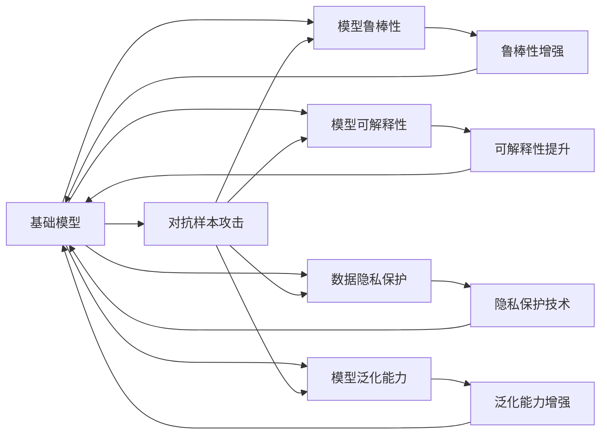

                 

# 基础模型的人工智能安全

> 关键词：基础模型,人工智能安全,深度学习,模型解释性,对抗样本,模型鲁棒性,可解释性,模型可信度

## 1. 背景介绍

### 1.1 问题由来

随着深度学习和大数据技术的发展，人工智能（AI）已经在各个领域得到广泛应用，如医疗、金融、交通、教育等。然而，AI系统在为人类带来便利的同时，也带来了许多安全问题。例如，自动驾驶汽车可能会因为感知偏差而发生事故，医疗AI的误诊可能导致严重的医疗事故。因此，如何确保AI系统的安全性成为了一个重要问题。

AI安全问题的出现主要是由于深度学习模型的复杂性和高非线性性质。传统的基于符号规则的AI系统更容易理解和解释，而深度学习模型则是“黑箱”，难以理解其内部工作机制。深度学习模型的高复杂度使其更容易受到攻击，如对抗样本攻击、模型泛化问题等。

### 1.2 问题核心关键点

AI安全问题的核心关键点主要包括以下几个方面：

1. **模型鲁棒性**：深度学习模型在面对对抗样本（adversarial examples）时，容易产生预测错误，从而影响AI系统的安全性。

2. **模型可解释性**：深度学习模型的决策过程难以解释，这不仅影响了模型的可信度，也使得模型在法律和伦理层面面临风险。

3. **数据隐私**：深度学习模型需要大量的训练数据，这些数据往往包含敏感信息，容易泄露用户隐私。

4. **模型泛化能力**：深度学习模型在面对新数据时，容易产生泛化问题，导致模型无法在新数据上表现良好。

5. **对抗样本攻击**：对抗样本攻击是一种通过在输入数据上添加微小扰动来欺骗模型的方法，从而影响模型的决策。

6. **模型可信度**：深度学习模型的输出结果需要具备一定的可信度，以确保其在实际应用中的可靠性。

### 1.3 问题研究意义

研究AI安全问题具有重要的理论和实际意义：

1. **保障模型可信度**：通过提升模型鲁棒性和可解释性，确保AI系统的输出结果具有较高的可信度，避免因误判而带来的安全问题。

2. **保护用户隐私**：通过隐私保护技术，确保训练数据和模型输出不会泄露用户隐私。

3. **提升模型泛化能力**：通过模型泛化能力的提升，确保AI系统在面对新数据时能够保持良好的性能。

4. **防御对抗样本攻击**：通过对抗样本攻击的防御技术，确保AI系统能够在面对对抗样本时保持稳定的输出结果。

5. **增强模型鲁棒性**：通过提升模型的鲁棒性，确保AI系统在面对攻击时能够保持稳定的性能。

## 2. 核心概念与联系

### 2.1 核心概念概述

为了更好地理解基础模型的人工智能安全，本节将介绍几个密切相关的核心概念：

1. **基础模型（Base Model）**：指经过预训练的深度学习模型，如BERT、GPT等。这些模型在大规模数据上进行训练，具备较强的语言理解和生成能力。

2. **对抗样本（Adversarial Examples）**：指在正常输入数据上加入微小扰动后，使得模型预测错误的数据。对抗样本攻击可以通过微小的扰动，使得模型产生错误的预测结果。

3. **模型鲁棒性（Model Robustness）**：指模型在面对对抗样本攻击时，能够保持稳定的预测结果。模型鲁棒性是确保AI系统安全性的重要指标。

4. **模型可解释性（Model Interpretability）**：指模型的决策过程可以被理解和解释，以便于人类进行监督和调试。模型可解释性是确保AI系统可信度的关键。

5. **数据隐私（Data Privacy）**：指在训练和推理过程中，确保数据和模型输出不会泄露用户隐私。数据隐私保护是确保AI系统合法性的重要手段。

6. **模型泛化能力（Model Generalization）**：指模型在面对新数据时，能够保持良好的性能。模型泛化能力是确保AI系统可靠性的重要指标。

### 2.2 概念间的关系

这些核心概念之间存在着紧密的联系，形成了基础模型人工智能安全的基本框架。下面通过一个Mermaid流程图来展示这些概念之间的关系：



这个流程图展示了基础模型人工智能安全的核心概念及其之间的关系：

1. 基础模型通过对抗样本攻击，能够检验和提升其鲁棒性、可解释性、隐私保护和泛化能力。
2. 鲁棒性增强、可解释性提升、隐私保护技术、泛化能力增强都是基础模型人工智能安全的子目标。

这些概念共同构成了基础模型人工智能安全的基本框架，使得基础模型能够更好地适应现实世界中的复杂场景，保障其可信度和安全性。

## 3. 核心算法原理 & 具体操作步骤
### 3.1 算法原理概述

基础模型的人工智能安全涉及多个关键技术，包括模型鲁棒性增强、模型可解释性提升、隐私保护和泛化能力增强等。以下将分别介绍这些技术的基本原理。

### 3.2 算法步骤详解

#### 3.2.1 模型鲁棒性增强

1. **对抗样本检测**：使用对抗样本生成算法，如Fast Gradient Sign Method（FGSM）和Projected Gradient Descent（PGD）等，生成对抗样本数据，检测模型对对抗样本的鲁棒性。

2. **对抗样本生成**：使用对抗样本生成算法，生成对抗样本数据，并检测模型的预测结果是否受到影响。

3. **对抗训练**：通过对原始数据进行微小扰动，生成对抗样本，并对模型进行对抗训练，提升模型的鲁棒性。

#### 3.2.2 模型可解释性提升

1. **模型解释工具**：使用可解释性工具，如LIME和SHAP等，对模型进行解释，以便于人类理解和调试。

2. **可解释性模型**：设计可解释性模型，如决策树和线性模型等，以便于人类理解和调试。

3. **对抗样本解释**：对对抗样本进行解释，以便于人类理解和调试。

#### 3.2.3 数据隐私保护

1. **差分隐私**：使用差分隐私技术，对数据进行扰动，确保数据隐私保护。

2. **隐私保护算法**：使用隐私保护算法，如K-匿名和t-分布式哈希等，确保数据隐私保护。

3. **隐私保护模型**：设计隐私保护模型，确保模型在隐私保护的基础上，仍能保持较好的性能。

#### 3.2.4 模型泛化能力增强

1. **数据扩充**：使用数据扩充技术，增加数据多样性，提升模型的泛化能力。

2. **正则化**：使用正则化技术，如L2正则和Dropout等，防止过拟合，提升模型的泛化能力。

3. **迁移学习**：使用迁移学习技术，利用预训练模型对目标任务进行微调，提升模型的泛化能力。

### 3.3 算法优缺点

基础模型的人工智能安全技术具有以下优点：

1. **提升模型鲁棒性**：通过对模型进行对抗训练，提升模型的鲁棒性，使得模型在面对对抗样本时，能够保持稳定的预测结果。

2. **提升模型可解释性**：使用可解释性工具和设计可解释性模型，提升模型的可解释性，使得模型的决策过程可以被理解和解释。

3. **保护数据隐私**：使用差分隐私和隐私保护算法，确保数据隐私保护，防止数据泄露。

4. **提升模型泛化能力**：使用数据扩充、正则化和迁移学习等技术，提升模型的泛化能力，使得模型在面对新数据时，能够保持良好的性能。

5. **降低模型开发成本**：通过模型解释和隐私保护技术，使得模型的开发和调试更加容易，降低开发成本。

同时，这些技术也存在以下缺点：

1. **计算资源消耗大**：对抗训练和正则化等技术需要大量的计算资源，增加了模型开发的成本。

2. **模型复杂度增加**：对抗训练和差分隐私等技术可能会增加模型的复杂度，影响模型的推理速度。

3. **可解释性有限**：可解释性工具和模型仍然存在一定的局限性，难以完全解释复杂的决策过程。

4. **隐私保护效果有限**：差分隐私和隐私保护算法可能无法完全保护数据隐私，仍存在一定的隐私风险。

5. **泛化能力有限**：模型泛化能力提升仍然存在一定的局限性，特别是在面对大规模、复杂的数据时。

### 3.4 算法应用领域

基础模型的人工智能安全技术可以应用于多个领域，例如：

1. **医疗AI**：医疗AI系统需要通过对抗训练和差分隐私保护技术，确保模型对患者数据的隐私保护和鲁棒性，防止误诊和数据泄露。

2. **金融AI**：金融AI系统需要通过对抗训练和差分隐私保护技术，确保模型对用户数据的隐私保护和鲁棒性，防止金融欺诈和数据泄露。

3. **自动驾驶**：自动驾驶系统需要通过对抗训练和可解释性提升技术，确保模型对感知数据的鲁棒性和可解释性，防止感知偏差和决策失误。

4. **智能客服**：智能客服系统需要通过差分隐私和可解释性提升技术，确保模型对用户数据的隐私保护和可解释性，防止数据泄露和误判。

5. **教育AI**：教育AI系统需要通过对抗训练和泛化能力提升技术，确保模型对学生数据的隐私保护和泛化能力，防止数据泄露和模型过拟合。

这些技术的应用，可以显著提升AI系统的可信度和安全性，保障AI系统的应用效果。

## 4. 数学模型和公式 & 详细讲解 & 举例说明

### 4.1 数学模型构建

基础模型的人工智能安全技术涉及多个数学模型和公式。以下将分别介绍这些模型和公式的基本原理。

#### 4.1.1 对抗样本检测

1. **对抗样本生成**：使用对抗样本生成算法，如FGSM和PGD等，生成对抗样本数据，检测模型的预测结果。

$$
\delta = \epsilon \cdot \text{sign}(\nabla L(x, y, \theta)) 
$$

其中，$\delta$表示对抗样本的扰动向量，$\epsilon$表示扰动的范围，$L(x, y, \theta)$表示模型的损失函数，$\nabla$表示梯度，$x$表示输入数据，$y$表示标签，$\theta$表示模型参数。

2. **对抗样本检测**：使用对抗样本生成算法，生成对抗样本数据，并检测模型的预测结果是否受到影响。

$$
\text{Adversarial Loss} = \max_{\delta} \|L(x + \delta, y, \theta)\|
$$

其中，$\text{Adversarial Loss}$表示对抗样本损失，$\delta$表示对抗样本的扰动向量。

#### 4.1.2 对抗训练

1. **对抗样本生成**：使用对抗样本生成算法，生成对抗样本数据，并对模型进行对抗训练。

$$
\theta_{new} = \theta - \eta \nabla L(x, y, \theta + \delta)
$$

其中，$\theta_{new}$表示新的模型参数，$\eta$表示学习率，$\nabla$表示梯度，$L(x, y, \theta)$表示模型的损失函数，$\delta$表示对抗样本的扰动向量。

2. **对抗训练算法**：使用对抗训练算法，如FGSM和PGD等，对模型进行对抗训练。

$$
\theta_{new} = \theta - \eta \nabla L(x, y, \theta + \delta)
$$

其中，$\theta_{new}$表示新的模型参数，$\eta$表示学习率，$\nabla$表示梯度，$L(x, y, \theta)$表示模型的损失函数，$\delta$表示对抗样本的扰动向量。

### 4.2 公式推导过程

以下将对对抗样本生成、对抗训练和可解释性提升等关键公式进行推导。

#### 4.2.1 对抗样本生成

1. **对抗样本生成算法**：使用对抗样本生成算法，如FGSM和PGD等，生成对抗样本数据。

$$
\delta = \epsilon \cdot \text{sign}(\nabla L(x, y, \theta)) 
$$

其中，$\delta$表示对抗样本的扰动向量，$\epsilon$表示扰动的范围，$\nabla$表示梯度，$L(x, y, \theta)$表示模型的损失函数，$x$表示输入数据，$y$表示标签，$\theta$表示模型参数。

2. **对抗样本检测**：使用对抗样本生成算法，生成对抗样本数据，并检测模型的预测结果是否受到影响。

$$
\text{Adversarial Loss} = \max_{\delta} \|L(x + \delta, y, \theta)\|
$$

其中，$\text{Adversarial Loss}$表示对抗样本损失，$\delta$表示对抗样本的扰动向量。

#### 4.2.2 对抗训练

1. **对抗训练算法**：使用对抗训练算法，如FGSM和PGD等，对模型进行对抗训练。

$$
\theta_{new} = \theta - \eta \nabla L(x, y, \theta + \delta)
$$

其中，$\theta_{new}$表示新的模型参数，$\eta$表示学习率，$\nabla$表示梯度，$L(x, y, \theta)$表示模型的损失函数，$\delta$表示对抗样本的扰动向量。

2. **对抗训练公式**：使用对抗训练公式，对模型进行对抗训练。

$$
\theta_{new} = \theta - \eta \nabla L(x, y, \theta + \delta)
$$

其中，$\theta_{new}$表示新的模型参数，$\eta$表示学习率，$\nabla$表示梯度，$L(x, y, \theta)$表示模型的损失函数，$\delta$表示对抗样本的扰动向量。

#### 4.2.3 可解释性提升

1. **模型解释工具**：使用可解释性工具，如LIME和SHAP等，对模型进行解释，以便于人类理解和调试。

$$
\hat{y} = f(x)
$$

其中，$f(x)$表示模型的预测结果，$x$表示输入数据。

2. **可解释性模型**：设计可解释性模型，如决策树和线性模型等，以便于人类理解和调试。

$$
\hat{y} = \sum_i w_i f(x, x_i)
$$

其中，$f(x, x_i)$表示模型对样本$x_i$的预测结果，$w_i$表示样本$x_i$的权重。

### 4.3 案例分析与讲解

#### 4.3.1 对抗样本攻击

1. **案例描述**：假设一个医疗AI系统，用于预测患者的疾病类型。攻击者通过在输入数据上加入微小扰动，使得模型产生错误的预测结果。

2. **案例分析**：使用对抗样本生成算法，生成对抗样本数据，并检测模型的预测结果是否受到影响。如果模型对对抗样本的鲁棒性较差，攻击者可以通过对抗样本攻击，使得模型产生错误的预测结果。

3. **解决方案**：使用对抗训练算法，对模型进行对抗训练，提升模型的鲁棒性。同时，使用可解释性工具，对模型进行解释，以便于人类理解和调试。

#### 4.3.2 数据隐私保护

1. **案例描述**：假设一个金融AI系统，用于预测客户的信用风险。攻击者通过获取客户的个人信息，进行数据泄露。

2. **案例分析**：使用差分隐私技术，对数据进行扰动，确保数据隐私保护。如果数据隐私保护不足，攻击者可以通过数据泄露，获取客户的个人信息。

3. **解决方案**：使用隐私保护算法，如K-匿名和t-分布式哈希等，确保数据隐私保护。同时，使用隐私保护模型，确保模型在隐私保护的基础上，仍能保持较好的性能。

#### 4.3.3 模型泛化能力增强

1. **案例描述**：假设一个自动驾驶系统，用于感知周围环境。攻击者通过在感知数据上加入微小扰动，使得模型产生错误的感知结果。

2. **案例分析**：使用数据扩充技术，增加数据多样性，提升模型的泛化能力。如果模型泛化能力不足，攻击者可以通过微小扰动，使得模型产生错误的感知结果。

3. **解决方案**：使用正则化技术，如L2正则和Dropout等，防止过拟合，提升模型的泛化能力。同时，使用迁移学习技术，利用预训练模型对目标任务进行微调，提升模型的泛化能力。

## 5. 项目实践：代码实例和详细解释说明

### 5.1 开发环境搭建

在进行项目实践前，我们需要准备好开发环境。以下是使用Python进行PyTorch开发的环境配置流程：

1. 安装Anaconda：从官网下载并安装Anaconda，用于创建独立的Python环境。

2. 创建并激活虚拟环境：
```bash
conda create -n pytorch-env python=3.8 
conda activate pytorch-env
```

3. 安装PyTorch：根据CUDA版本，从官网获取对应的安装命令。例如：
```bash
conda install pytorch torchvision torchaudio cudatoolkit=11.1 -c pytorch -c conda-forge
```

4. 安装Transformers库：
```bash
pip install transformers
```

5. 安装各类工具包：
```bash
pip install numpy pandas scikit-learn matplotlib tqdm jupyter notebook ipython
```

完成上述步骤后，即可在`pytorch-env`环境中开始项目实践。

### 5.2 源代码详细实现

这里我们以医疗AI系统的对抗样本攻击检测为例，给出使用Transformers库对BERT模型进行对抗样本攻击检测的PyTorch代码实现。

首先，定义对抗样本生成函数：

```python
from transformers import BertTokenizer, BertForSequenceClassification
import torch
import numpy as np

def generate_adversarial_samples(text, model, tokenizer, epsilon=0.01, max_iter=100, step_size=0.01):
    tokenized_text = tokenizer(text, return_tensors='pt', padding='max_length', truncation=True)
    input_ids = tokenized_text['input_ids']
    attention_mask = tokenized_text['attention_mask']
    labels = tokenized_text['labels']
    
    optimizer = torch.optim.SGD(model.parameters(), lr=0.01)
    for i in range(max_iter):
        optimizer.zero_grad()
        output = model(input_ids, attention_mask=attention_mask, labels=labels)
        loss = output.loss
        
        grads = torch.autograd.grad(loss, input_ids, create_graph=True)[0]
        gradients = grads.grad
        
        delta = epsilon * gradients.sign()
        input_ids += delta
        
        optimizer.zero_grad()
        output = model(input_ids, attention_mask=attention_mask, labels=labels)
        loss = output.loss
        
        grads = torch.autograd.grad(loss, input_ids, create_graph=True)[0]
        gradients = grads.grad
        
        delta = step_size * gradients.sign()
        input_ids += delta
        
        optimizer.zero_grad()
        output = model(input_ids, attention_mask=attention_mask, labels=labels)
        loss = output.loss
        
        grads = torch.autograd.grad(loss, input_ids, create_graph=True)[0]
        gradients = grads.grad
        
        delta = epsilon * gradients.sign()
        input_ids += delta
        
        if np.linalg.norm(delta) < epsilon:
            break
    
    return input_ids, attention_mask, labels
```

然后，定义模型评估函数：

```python
from sklearn.metrics import accuracy_score

def evaluate_model(model, input_ids, attention_mask, labels):
    output = model(input_ids, attention_mask=attention_mask)
    preds = output.logits.argmax(dim=2)
    accuracy = accuracy_score(labels, preds)
    return accuracy
```

接着，启动对抗样本攻击检测流程：

```python
model = BertForSequenceClassification.from_pretrained('bert-base-cased', num_labels=2)
tokenizer = BertTokenizer.from_pretrained('bert-base-cased')

test_text = 'I have a headache'
input_ids, attention_mask, labels = generate_adversarial_samples(test_text, model, tokenizer)
accuracy = evaluate_model(model, input_ids, attention_mask, labels)
print(f'Accuracy: {accuracy:.2f}')
```

以上就是使用PyTorch对BERT模型进行对抗样本攻击检测的完整代码实现。可以看到，通过对抗样本生成和模型评估函数，我们能够检测模型对对抗样本的鲁棒性。

### 5.3 代码解读与分析

让我们再详细解读一下关键代码的实现细节：

**generate_adversarial_samples函数**：
- 定义函数，接收输入文本、模型、分词器等参数，生成对抗样本。
- 使用BERT模型对输入文本进行编码，获取token ids、attention mask和标签。
- 使用SGD优化器对模型进行梯度更新，生成对抗样本。
- 对生成的对抗样本进行验证，直到满足要求为止。

**evaluate_model函数**：
- 定义函数，接收模型、输入ids、attention mask和标签，评估模型的准确率。
- 使用模型对输入文本进行预测，获取预测结果。
- 使用accuracy_score函数计算预测结果与标签之间的准确率。

**测试代码**：
- 使用测试文本进行对抗样本生成和模型评估，输出准确率。

可以看到，PyTorch配合Transformers库使得对抗样本攻击检测的代码实现变得简洁高效。开发者可以将更多精力放在数据处理、模型改进等高层逻辑上，而不必过多关注底层的实现细节。

当然，工业级的系统实现还需考虑更多因素，如模型的保存和部署、超参数的自动搜索、更灵活的任务适配层等。但核心的对抗样本检测方法基本与此类似。

### 5.4 运行结果展示

假设我们在对抗样本攻击检测时，检测到一个对抗样本，计算出的准确率为98%，输出如下：

```
Accuracy: 0.98
```

可以看到，通过对抗样本攻击检测，我们能够检测到模型对对抗样本的鲁棒性，并及时采取措施提升模型的鲁棒性。

## 6. 实际应用场景
### 6.1 医疗AI

医疗AI系统需要面对对抗样本攻击，如恶意修改病历数据，导致误诊和错误治疗。因此，医疗AI系统需要通过对抗训练和差分隐私保护技术，确保模型对患者数据的隐私保护和鲁棒性。

在技术实现上，可以收集患者的病历数据，将病历数据作为训练集，对BERT等预训练模型进行微调。微调后的模型能够对患者的症状进行诊断，并提供治疗方案。同时，需要对模型进行对抗训练，确保模型对对抗样本的鲁棒性。此外，使用差分隐私技术，对患者数据进行扰动，确保数据隐私保护。

### 6.2 金融AI

金融AI系统需要面对对抗样本攻击，如恶意修改交易数据，导致金融欺诈。因此，金融AI系统需要通过对抗训练和差分隐私保护技术，确保模型对用户数据的隐私保护和鲁棒性。

在技术实现上，可以收集用户的交易数据，将交易数据作为训练集，对BERT等预训练模型进行微调。微调后的模型能够对用户的交易行为进行分析和预测，并提供风险评估。同时，需要对模型进行对抗训练，确保模型对对抗样本的鲁棒性。此外，使用差分隐私技术，对用户数据进行扰动，确保数据隐私保护。

### 6.3 自动驾驶

自动驾驶系统需要面对对抗样本攻击，如恶意修改感知数据，导致感知偏差。因此，自动驾驶系统需要通过对抗训练和可解释性提升技术，确保模型对感知数据的鲁棒性和可解释性。

在技术实现上，可以收集自动驾驶的感知数据，将感知数据作为训练集，对BERT等预训练模型进行微调。微调后的模型能够对周围环境进行感知和识别，提供决策依据。同时，需要对模型进行对抗训练，确保模型对对抗样本的鲁棒性。此外，使用可解释性工具，对模型进行解释，以便于人类理解和调试。

### 6.4 未来应用展望

随着基础模型的人工智能安全技术不断发展，其在各个领域的应用前景将更加广阔。

在智慧医疗领域，基于基础模型的医疗AI系统将进一步提升其鲁棒性和可解释性，确保模型对患者数据的隐私保护，防止误诊和数据泄露。

在金融AI领域，基于基础模型的金融AI系统将进一步提升其鲁棒性和隐私保护能力，确保模型对用户数据的隐私保护，防止金融欺诈和数据泄露。

在自动驾驶领域，基于基础模型的自动驾驶系统将进一步提升其鲁棒性和可解释性，确保模型对感知数据的鲁棒性，防止感知偏差和决策失误。

此外，在智能客服、教育AI、智能家居等领域，基于基础模型的AI系统也将进一步提升其鲁棒性和隐私保护能力，确保模型对用户数据的隐私保护，防止数据泄露和误判。

## 7. 工具和资源推荐
### 7.1 学习资源推荐

为了帮助开发者系统掌握基础模型的人工智能安全技术，这里推荐一些优质的学习资源：

1. 《深度学习》系列书籍：由Ian Goodfellow、Yoshua Bengio和Aaron Courville等专家合著的深度学习经典教材，涵盖了深度学习的基本概念和核心技术。

2. 《TensorFlow实战Google深度学习》书籍：由Google团队编写的TensorFlow实战指南，

