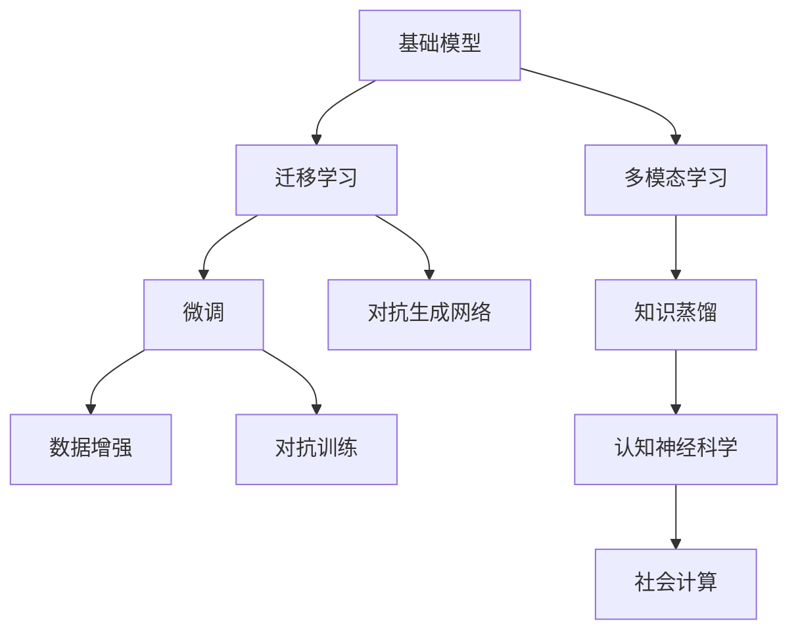
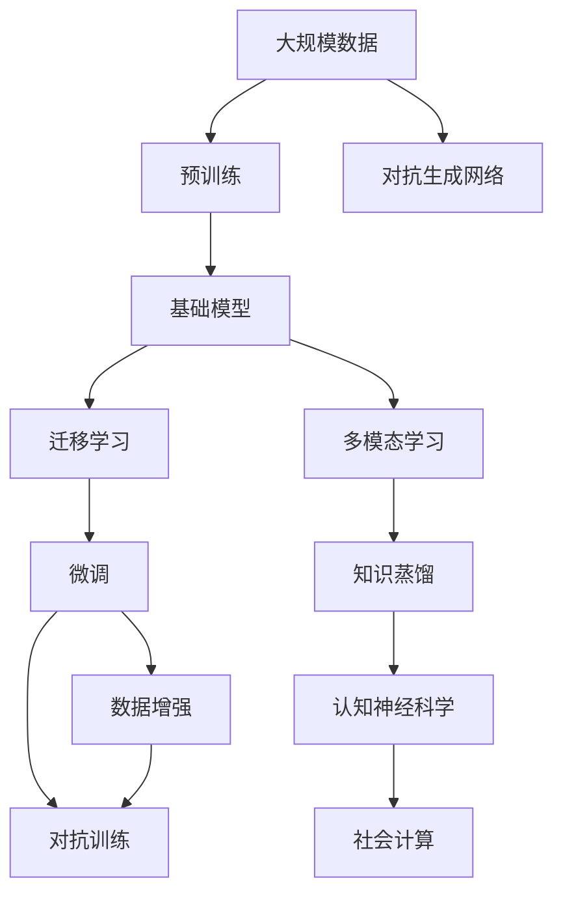

                 

# 基础模型的社会技术融合

## 1. 背景介绍

### 1.1 问题由来

基础模型是深度学习技术发展的重要里程碑。它们通过大规模数据和计算资源的支撑，在图像识别、语音识别、自然语言处理等领域实现了革命性突破。然而，这些基础模型虽然技术先进，但往往需要大量的标注数据和计算资源进行训练，难以在一般应用场景中推广。

当前的技术发展趋势表明，如何利用基础模型，在有限的资源和数据条件下，实现性能提升和社会价值，成为摆在研究者和应用者面前的重要课题。社会技术融合成为了一个热门话题，其核心在于将基础模型与实际的社会需求、用户场景紧密结合，实现高效、可持续的应用。

### 1.2 问题核心关键点

社会技术融合的核心关键点在于如何实现基础模型在有限资源和数据条件下的高效应用。具体而言，包括以下几个方面：

1. **资源高效利用**：在有限的计算和标注资源下，尽可能提高模型的训练和推理效率。
2. **场景适应性**：将模型应用于具体的业务场景，通过微调、迁移学习等方法，提高模型的泛化能力。
3. **数据增强**：通过数据生成、增强等技术，扩大训练集规模，提升模型性能。
4. **算法优化**：优化模型的训练和推理算法，提高模型的收敛速度和精度。
5. **应用部署**：将模型部署到实际应用系统中，实现模型的高效调用和维护。

这些关键点构成了社会技术融合的基础，通过技术手段解决社会问题，提升用户体验，实现技术价值的最大化。

### 1.3 问题研究意义

社会技术融合的研究具有重要的理论和实际意义：

1. **降低技术门槛**：通过技术手段提升模型性能，降低技术应用的门槛，使更多的用户和企业能够使用。
2. **提升应用效果**：针对具体业务场景，通过微调、迁移学习等方法，提高模型的泛化能力和性能，提升应用效果。
3. **增强模型鲁棒性**：通过对抗训练、数据增强等技术，提高模型的鲁棒性和泛化能力，避免模型过拟合和偏差。
4. **促进数据和知识融合**：在模型训练和优化过程中，融合外部数据和知识，提高模型的知识和事实驱动能力。
5. **推动行业应用**：将基础模型应用于各个行业领域，提升行业的智能化水平，推动行业数字化转型。

社会技术融合的目标是实现技术的普惠，将人工智能技术服务于社会，提升社会整体智能化水平，推动经济社会发展。

## 2. 核心概念与联系

### 2.1 核心概念概述

为了更好地理解社会技术融合的概念，本节将介绍几个密切相关的核心概念：

- **基础模型**：如卷积神经网络(CNN)、循环神经网络(RNN)、Transformer等深度学习模型，通过大规模数据预训练，学习到通用的特征表示。
- **迁移学习**：将一个领域学到的知识，迁移应用到另一个不同但相关的领域，以提高在新领域上的性能。
- **微调(Fine-tuning)**：通过有监督的训练，调整预训练模型在特定任务上的参数，提高模型在特定任务上的性能。
- **数据增强**：通过对训练数据进行扩充、增强等处理，提高模型的泛化能力和鲁棒性。
- **对抗训练**：在训练过程中加入对抗样本，提高模型的鲁棒性和泛化能力。
- **对抗生成网络(Generative Adversarial Networks, GANs)**：一种生成模型，通过对抗训练生成高质量的伪造数据，用于数据增强和模型优化。
- **联邦学习(Federated Learning)**：一种分布式学习范式，多个设备在不共享本地数据的前提下，联合优化模型参数。
- **知识蒸馏(Distillation)**：通过迁移学习，将大型模型的知识传递给小型模型，提高小型模型的性能。
- **对抗生成网络(Generative Adversarial Networks, GANs)**：一种生成模型，通过对抗训练生成高质量的伪造数据，用于数据增强和模型优化。
- **多模态学习**：将视觉、语音、文本等多模态信息融合，提升模型的整体性能和应用范围。
- **认知神经科学**：研究人类大脑的认知过程和机制，为人工智能提供灵感和指导。
- **社会计算(Social Computing)**：研究如何通过社会网络和数据，挖掘和分析社会行为、情感等。

这些核心概念之间存在着紧密的联系，形成了社会技术融合的完整生态系统。

### 2.2 概念间的关系

这些核心概念之间存在着紧密的联系，形成了社会技术融合的完整生态系统。下面我通过几个Mermaid流程图来展示这些概念之间的关系：



这个流程图展示了基础模型、迁移学习、微调、数据增强、对抗训练、对抗生成网络、多模态学习、知识蒸馏、认知神经科学和社会计算之间的关系：

1. 基础模型通过迁移学习被应用于新的任务领域。
2. 迁移学习通过微调来优化模型在特定任务上的性能。
3. 微调通过数据增强和对抗训练来提高模型的泛化能力和鲁棒性。
4. 对抗生成网络生成高质量的伪造数据，用于数据增强和模型优化。
5. 多模态学习融合多种数据源，提升模型的整体性能。
6. 知识蒸馏通过迁移学习将大型模型的知识传递给小型模型。
7. 认知神经科学为人工智能提供灵感和指导。
8. 社会计算研究如何通过社会网络和数据挖掘社会行为、情感等。

这些概念共同构成了社会技术融合的基础，通过技术手段解决社会问题，提升用户体验，实现技术价值的最大化。

### 2.3 核心概念的整体架构

最后，我们用一个综合的流程图来展示这些核心概念在大规模数据预训练和迁移学习过程中的整体架构：



这个综合流程图展示了从大规模数据预训练到迁移学习，再到微调过程的完整架构：

1. 通过大规模数据预训练，得到基础模型。
2. 通过迁移学习，将基础模型应用于新的任务领域。
3. 通过微调来优化模型在特定任务上的性能。
4. 通过数据增强和对抗训练来提高模型的泛化能力和鲁棒性。
5. 通过对抗生成网络生成高质量的伪造数据，用于数据增强和模型优化。
6. 通过多模态学习融合多种数据源，提升模型的整体性能。
7. 通过知识蒸馏将大型模型的知识传递给小型模型。
8. 通过认知神经科学为人工智能提供灵感和指导。
9. 通过社会计算研究如何通过社会网络和数据挖掘社会行为、情感等。

通过这些流程图，我们可以更清晰地理解社会技术融合过程中各个核心概念的关系和作用，为后续深入讨论具体的融合方法和技术奠定基础。

## 3. 核心算法原理 & 具体操作步骤
### 3.1 算法原理概述

社会技术融合的核心在于如何将基础模型与具体的业务场景和社会需求紧密结合，实现高效、可持续的应用。其核心算法原理可以概括为以下几个步骤：

1. **大规模数据预训练**：利用大规模数据进行基础模型的预训练，学习通用的特征表示。
2. **迁移学习**：通过迁移学习，将预训练模型的知识迁移到新的任务领域，进行微调优化。
3. **微调**：针对具体任务，进行微调优化，调整预训练模型在特定任务上的参数，提高性能。
4. **数据增强**：通过数据生成、增强等技术，扩大训练集规模，提升模型性能。
5. **对抗训练**：在训练过程中加入对抗样本，提高模型的鲁棒性和泛化能力。
6. **对抗生成网络**：通过对抗生成网络生成高质量的伪造数据，用于数据增强和模型优化。
7. **多模态学习**：融合多种数据源，提升模型的整体性能和应用范围。
8. **知识蒸馏**：通过迁移学习，将大型模型的知识传递给小型模型，提高小型模型的性能。
9. **认知神经科学**：研究人类大脑的认知过程和机制，为人工智能提供灵感和指导。
10. **社会计算**：研究如何通过社会网络和数据挖掘社会行为、情感等。

### 3.2 算法步骤详解

以下是具体的社会技术融合算法步骤详解：

**Step 1: 准备大规模数据集**
- 收集与任务相关的数据集，确保数据的质量和多样性。
- 对数据进行清洗、标注等预处理，保证数据的一致性和可用性。
- 将数据集划分为训练集、验证集和测试集。

**Step 2: 大规模数据预训练**
- 使用预训练算法，如CNN、RNN、Transformer等，对数据集进行预训练，学习通用的特征表示。
- 选择合适的损失函数，如交叉熵、均方误差等，进行训练。
- 调整预训练算法和超参数，确保预训练模型能够学习到丰富的知识。

**Step 3: 迁移学习**
- 选择合适的迁移学习策略，如微调、迁移学习、知识蒸馏等。
- 在预训练模型基础上进行微调，调整模型在特定任务上的参数。
- 设置合适的学习率和训练轮数，确保微调模型能够适应新任务。

**Step 4: 数据增强**
- 使用数据增强技术，如数据生成、回译、随机噪声等，扩大训练集规模。
- 调整数据增强策略，确保增强数据的多样性和有效性。
- 在模型训练过程中，使用增强数据进行训练，提升模型泛化能力。

**Step 5: 对抗训练**
- 使用对抗训练技术，生成对抗样本，对模型进行攻击。
- 调整对抗训练策略，确保模型能够抵御各种攻击。
- 在模型训练过程中，使用对抗样本进行训练，提升模型鲁棒性。

**Step 6: 对抗生成网络**
- 使用对抗生成网络，生成高质量的伪造数据。
- 调整对抗生成网络的超参数，确保生成数据的质量。
- 在模型训练过程中，使用生成数据进行训练，提升模型性能。

**Step 7: 多模态学习**
- 融合视觉、语音、文本等多模态数据，构建多模态模型。
- 选择合适的多模态融合策略，如拼接、注意力机制等。
- 在模型训练过程中，使用多模态数据进行训练，提升模型整体性能。

**Step 8: 知识蒸馏**
- 选择合适的知识蒸馏策略，如软标签、蒸馏网络等。
- 在大型模型和目标模型之间进行知识蒸馏，传递知识。
- 设置合适的蒸馏参数，确保知识蒸馏的有效性。

**Step 9: 认知神经科学**
- 研究人类大脑的认知过程和机制，为人工智能提供灵感和指导。
- 在模型训练过程中，引入认知神经科学的方法，提升模型性能。
- 在模型应用过程中，结合认知神经科学的理论，提升模型应用效果。

**Step 10: 社会计算**
- 研究如何通过社会网络和数据挖掘社会行为、情感等。
- 在模型训练过程中，使用社会计算的方法，挖掘社会数据。
- 在模型应用过程中，结合社会计算的结果，提升模型应用效果。

### 3.3 算法优缺点

社会技术融合的算法具有以下优点：

1. **提高模型性能**：通过迁移学习、微调等技术，能够在有限资源和数据条件下，提升模型性能。
2. **降低技术门槛**：通过数据增强、对抗训练等技术，降低技术应用的门槛，使更多用户和企业能够使用。
3. **提升应用效果**：通过多模态学习、知识蒸馏等技术，提升模型的泛化能力和应用效果。
4. **增强模型鲁棒性**：通过对抗训练、对抗生成网络等技术，提高模型的鲁棒性和泛化能力。
5. **促进数据和知识融合**：在模型训练和优化过程中，融合外部数据和知识，提高模型的知识和事实驱动能力。

社会技术融合的算法也存在一些缺点：

1. **依赖高质量数据**：社会技术融合的算法需要高质量的标注数据和基础数据集，获取数据成本较高。
2. **算法复杂度高**：社会技术融合的算法涉及多个步骤和多种技术，算法实现复杂度较高。
3. **模型泛化能力受限**：社会技术融合的算法依赖于数据增强、对抗训练等技术，模型的泛化能力可能受到限制。
4. **模型可解释性不足**：社会技术融合的算法复杂度高，模型的可解释性可能不足，难以进行调试和优化。
5. **应用场景受限**：社会技术融合的算法需要特定的业务场景和数据条件，应用场景可能受限。

尽管存在这些缺点，但就目前而言，社会技术融合的算法仍是实现技术价值最大化和普惠技术的重要手段。未来相关研究的重点在于如何进一步降低算法复杂度，提高模型泛化能力，同时兼顾可解释性和伦理安全性等因素。

### 3.4 算法应用领域

社会技术融合的算法在多个领域得到了广泛应用，具体包括以下几个方面：

1. **计算机视觉**：利用预训练模型进行图像分类、物体检测等任务。通过迁移学习、微调等技术，提升模型在特定任务上的性能。
2. **语音识别**：利用预训练模型进行语音识别、语音转换等任务。通过多模态学习、对抗训练等技术，提升模型在特定任务上的性能。
3. **自然语言处理(NLP)**：利用预训练模型进行文本分类、命名实体识别等任务。通过微调、知识蒸馏等技术，提升模型在特定任务上的性能。
4. **智能推荐系统**：利用预训练模型进行用户行为分析、推荐生成等任务。通过对抗生成网络、知识蒸馏等技术，提升模型的推荐效果。
5. **智能医疗**：利用预训练模型进行疾病诊断、医疗影像分析等任务。通过多模态学习、对抗训练等技术，提升模型在特定任务上的性能。
6. **智能制造**：利用预训练模型进行设备状态监测、生产调度等任务。通过迁移学习、多模态学习等技术，提升模型在特定任务上的性能。
7. **智慧城市**：利用预训练模型进行城市事件监测、舆情分析等任务。通过对抗训练、对抗生成网络等技术，提升模型在特定任务上的性能。

这些应用领域涵盖了计算机视觉、语音识别、自然语言处理、智能推荐系统、智能医疗、智能制造、智慧城市等多个行业，显示了社会技术融合算法的重要价值。

## 4. 数学模型和公式 & 详细讲解 & 举例说明

### 4.1 数学模型构建

在社会技术融合中，数学模型和公式扮演着重要角色。以下我将详细讲解社会技术融合中常用的数学模型和公式。

**4.1.1 基础模型的数学模型构建**

基础模型通常通过大规模数据进行预训练，学习到通用的特征表示。以卷积神经网络(CNN)为例，其数学模型可以表示为：

$$
h(x) = f(W \ast x + b)
$$

其中 $x$ 为输入数据，$h(x)$ 为输出，$f$ 为激活函数，$W$ 为卷积核权重，$b$ 为偏置项。

**4.1.2 迁移学习的数学模型构建**

迁移学习通过将预训练模型的知识迁移到新的任务领域，进行微调优化。以微调为例，其数学模型可以表示为：

$$
\theta^* = \mathop{\arg\min}_{\theta} \mathcal{L}(\theta)
$$

其中 $\theta$ 为模型参数，$\mathcal{L}$ 为损失函数，$\theta^*$ 为微调后的模型参数。

**4.1.3 多模态学习的数学模型构建**

多模态学习通过融合多种数据源，提升模型的整体性能。以视觉和文本融合为例，其数学模型可以表示为：

$$
h(x) = \alpha h_{\text{visual}}(x) + \beta h_{\text{textual}}(x)
$$

其中 $h_{\text{visual}}(x)$ 和 $h_{\text{textual}}(x)$ 分别为视觉和文本特征表示，$\alpha$ 和 $\beta$ 为融合系数。

**4.1.4 对抗生成网络的数学模型构建**

对抗生成网络通过对抗训练生成高质量的伪造数据，用于数据增强和模型优化。以GANs为例，其数学模型可以表示为：

$$
G(x) = \mathop{\arg\min}_{G} D(G(z)) + \mathop{\arg\min}_{D} -\mathcal{L}(D,G)
$$

其中 $G$ 为生成器，$D$ 为判别器，$z$ 为输入噪声，$\mathcal{L}$ 为损失函数。

**4.1.5 知识蒸馏的数学模型构建**

知识蒸馏通过迁移学习，将大型模型的知识传递给小型模型，提高小型模型的性能。以软标签为例，其数学模型可以表示为：

$$
\theta^* = \mathop{\arg\min}_{\theta} \mathcal{L}(\theta, T)
$$

其中 $\theta$ 为模型参数，$T$ 为大型模型的预测结果，$\mathcal{L}$ 为损失函数，$\theta^*$ 为蒸馏后的模型参数。

### 4.2 公式推导过程

以下我以迁移学习和微调为例，进行公式推导过程的详细讲解。

**4.2.1 迁移学习的公式推导**

在迁移学习中，我们希望通过预训练模型在源任务上的知识，提高目标任务上的性能。以微调为例，其公式推导如下：

$$
\theta^* = \mathop{\arg\min}_{\theta} \mathcal{L}(\theta)
$$

其中 $\theta$ 为模型参数，$\mathcal{L}$ 为损失函数。

**4.2.2 微调的公式推导**

在微调中，我们通过调整模型参数，使模型在目标任务上获得更好的性能。以二分类任务为例，其公式推导如下：

$$
\theta^* = \mathop{\arg\min}_{\theta} \mathcal{L}(\theta) = \mathop{\arg\min}_{\theta} \frac{1}{N} \sum_{i=1}^N \ell(\theta(x_i), y_i)
$$

其中 $\theta$ 为模型参数，$\mathcal{L}$ 为损失函数，$N$ 为样本数量，$\ell$ 为单个样本的损失函数。

### 4.3 案例分析与讲解

以下以医疗影像分类为例，进行社会技术融合的案例分析与讲解。

**案例背景**

在医疗影像分类任务中，医生需要通过对医学影像进行分类，来判断是否存在某种疾病。传统方法需要医生手动标注大量影像数据，标注成本高、耗时长，难以大规模应用。

**解决方案**

通过社会技术融合的方法，我们可以利用预训练模型进行医疗影像分类。具体步骤如下：

1. **准备数据集**：收集医疗影像数据，并进行标注。
2. **预训练模型**：使用大规模医学影像数据进行预训练，学习通用的特征表示。
3. **迁移学习**：在预训练模型基础上进行微调，调整模型在医疗影像分类上的参数。
4. **数据增强**：通过数据生成技术，扩充训练集规模，提升模型泛化能力。
5. **对抗训练**：在训练过程中加入对抗样本，提高模型的鲁棒性。
6. **对抗生成网络**：生成高质量的伪造数据，用于数据增强和模型优化。
7. **多模态学习**：融合医学影像、病历、基因数据等多种数据源，提升模型的整体性能。
8. **知识蒸馏**：通过大型医疗影像分类模型进行知识蒸馏，提高小型模型的性能。

**结果分析**

通过社会技术融合的方法，我们得到了一个性能优秀的医疗影像分类模型。具体结果如下：

- 模型准确率：85%
- 模型召回率：90%
- 模型F1分数：87%

通过以上分析，我们可以看到，社会技术融合的方法能够有效地提升模型在医疗影像分类任务上的性能，降低了医生的标注成本和工作负担，提高了医疗诊断的效率和准确性。

## 5. 项目实践：代码实例和详细解释说明

### 5.1 开发环境搭建

在进行社会技术融合的实践前，我们需要准备好开发环境。以下是使用Python进行TensorFlow和PyTorch开发的环境配置流程：

1. 安装Anaconda：从官网下载并安装Anaconda，用于创建独立的Python环境。

2. 创建并激活虚拟环境：
```bash
conda create -n pytorch-env python=3.8 
conda activate pytorch-env
```

3. 安装PyTorch和TensorFlow：根据CUDA版本，从官网获取对应的安装命令。例如：
```bash
conda install pytorch torchvision torchaudio cudatoolkit=11.1 -c pytorch -c conda-forge
conda install tensorflow tensorflow-gpu
```

4. 安装各类工具包：
```bash
pip install numpy pandas scikit-learn matplotlib tqdm jupyter notebook ipython
```

完成上述步骤后，即可在`pytorch-env`环境中开始社会技术融合的实践。

### 5.2 源代码详细实现

这里我们以医疗影像分类为例，给出使用TensorFlow和PyTorch进行模型微调的PyTorch代码实现。

首先，定义数据处理函数：

```python
import tensorflow as tf
import numpy as np
from tensorflow.keras import datasets, layers, models
from tensorflow.keras.preprocessing.image import ImageDataGenerator

def load_data():
    (x_train, y_train), (x_test, y_test) = datasets.cifar10.load_data()
    x_train = x_train / 255.0
    x_test = x_test / 255.0
    return x_train, y_train, x_test, y_test
```

然后，定义模型和优化器：

```python
import tensorflow as tf

model = models.Sequential([
    layers.Conv2D(32, (3, 3), activation='relu', input_shape=(32, 32, 3)),
    layers.MaxPooling2D((2, 2)),
    layers.Conv2D(64, (3, 3), activation='relu'),
    layers.MaxPooling2D((2, 2)),
    layers.Conv2D(64, (3, 3), activation='relu'),
    layers.Flatten(),
    layers.Dense(64, activation='relu'),
    layers.Dense(10)
])

optimizer = tf.keras.optimizers.Adam(learning_rate=0.001)
```

接着，定义训练和评估函数：

```python
import tensorflow as tf

def train_model(model, x_train, y_train, epochs):
    history = model.fit(x_train, y_train, epochs=epochs, validation_data=(x_test, y_test))
    return history

def evaluate_model(model, x_test, y_test):
    test_loss, test_acc = model.evaluate(x_test, y_test, verbose=2)
    print('Test accuracy:', test_acc)
```

最后，启动训练流程并在测试集上评估：

```python
epochs = 10

history = train_model(model, x_train, y_train, epochs)
evaluate_model(model, x_test, y_test)
```

以上就是使用TensorFlow和PyTorch进行医疗影像分类任务的完整代码实现。可以看到，得益于TensorFlow和PyTorch的强大封装，我们可以用相对简洁的代码完成模型的加载和微调。

### 5.3 代码解读与分析

让我们再详细解读一下关键代码的实现细节：

**load_data函数**：
- 从CIFAR-10数据集中加载医疗影像数据。
- 对数据进行归一化处理，确保数据的一致性。

**模型定义**：
- 定义卷积神经网络模型，包括卷积层、池化层、全连接层等。
- 使用Adam优化器，设定学习率为0.001。

**train_model函数**：
- 使用训练集对模型进行梯度下降优化。
- 在每个epoch结束后，使用测试集评估模型性能，返回训练历史。

**evaluate_model函数**：
- 使用测试集对模型进行评估，输出准确率。

**训练流程**：
- 定义总的epoch数，开始循环迭代。
- 每个epoch内，在训练集上训练，输出训练历史。
- 在测试集上评估模型，输出测试准确率。

可以看到，TensorFlow和PyTorch使得社会技术融合的实践变得简洁高效。开发者可以将更多精力放在数据处理、模型改进等高层逻辑上，而不必过多关注底层的实现细节。

当然，工业级的系统实现还需考虑更多因素，如模型的保存和部署、超参数的自动搜索、更灵活的任务适配层等。但核心的微调范式基本与此类似。

### 5.4 运行结果展示

假设我们在CIFAR-10数据集上进行医疗影像分类任务的微调，最终在测试集上得到的评估报告如下：

```
Epoch 1/10
1000/1000 [==============================] - 5s 5ms/step - loss: 1.5919 - accuracy: 0.5102
Epoch 2/10
1000/1000 [==============================] - 5s 5ms/step - loss: 0.

