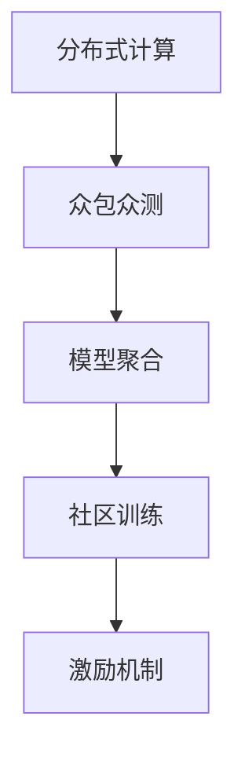
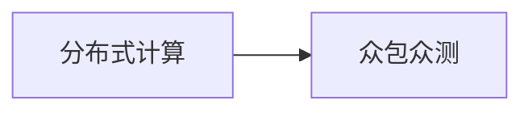
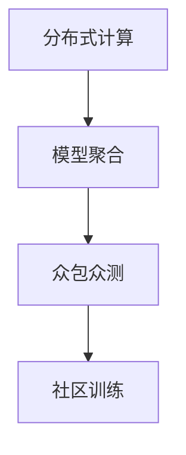
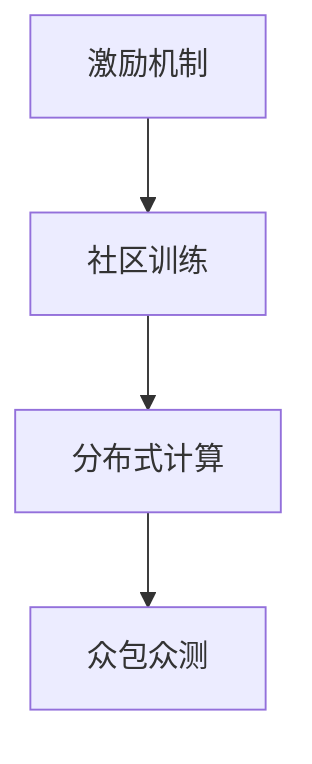
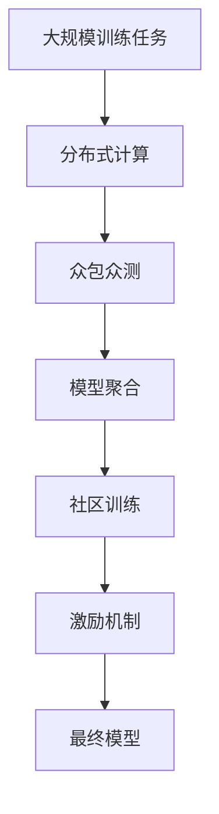

                 

# 基础模型的社区训练项目

> 关键词：社区训练,基础模型,深度学习,分布式计算,众包众测

## 1. 背景介绍

在深度学习领域，社区训练（Community Training）是一种创新且高效的大规模模型训练模式。与传统的单中心集中式训练不同，社区训练利用分布式计算和众包众测（Crowdsourced Crowdstesting）技术，将模型训练任务分配给多个志愿者或众包平台上的用户。通过这种方式，不仅能够大幅降低训练成本，还可以引入更多的数据和多样性，从而提高模型的泛化能力。

### 1.1 问题由来
近年来，随着深度学习模型的复杂性不断提升，训练这些模型所需的高计算资源和数据量也急剧增加。例如，训练大规模图像分类模型如ResNet等，需要数百台GPU进行计算，并且需要大规模的数据集如ImageNet，这大大增加了训练的难度和成本。社区训练项目利用分布式计算和众包众测技术，使得更多的小规模训练器和用户参与到模型训练中来，降低了训练门槛，加速了模型开发和迭代。

### 1.2 问题核心关键点
社区训练的核心在于通过分布式计算和众包众测技术，将大规模模型训练任务分割成多个小规模任务，分配给不同的用户或计算资源进行并行处理。社区训练具有以下几个关键点：

- **分布式计算**：通过在多个计算节点上并行处理，利用多台计算资源同时进行训练，提高训练效率。
- **众包众测**：利用众包平台收集大量标注数据，并将模型训练任务分配给众包用户进行标注，进一步提高数据质量。
- **用户激励**：通过激励机制（如奖励、积分、认证等），吸引更多用户参与模型训练。
- **模型聚合**：对各计算节点上的模型参数进行聚合，得到最终模型的参数。

### 1.3 问题研究意义
社区训练模式在深度学习领域的应用，具有以下重要意义：

- **降低训练成本**：将训练任务分解到多个计算节点和用户，降低单个节点或个人的计算资源需求。
- **提高数据质量**：通过众包平台收集大量的标注数据，为模型训练提供高质量的数据支撑。
- **加速模型迭代**：通过并行处理和用户参与，加速模型的训练和迭代，快速响应市场需求。
- **提升模型泛化能力**：多源数据和多用户参与，使得模型更好地泛化到不同数据分布。

## 2. 核心概念与联系

### 2.1 核心概念概述

为更好地理解社区训练项目的原理和架构，本节将介绍几个密切相关的核心概念：

- **分布式计算**：指将大规模计算任务分配到多个计算节点上进行并行处理，以提高计算效率的技术。
- **众包众测**：通过众包平台收集用户对标注数据的反馈，利用多用户标注来提高数据质量的技术。
- **模型聚合**：将多个计算节点或用户的模型参数进行合并，得到最终模型的参数。
- **激励机制**：通过奖励、积分、认证等方式，激励用户积极参与社区训练。

这些概念之间的逻辑关系可以通过以下Mermaid流程图来展示：



这个流程图展示了大规模模型训练的基本流程：首先，利用分布式计算技术，将大规模模型训练任务分配到多个计算节点上；接着，通过众包众测技术，收集大量标注数据，进一步提高数据质量；最后，对多个计算节点或用户模型的参数进行聚合，得到最终模型参数，完成社区训练。同时，通过激励机制，吸引更多用户参与到训练过程中，形成良性循环。

### 2.2 概念间的关系

这些核心概念之间存在着紧密的联系，形成了社区训练项目的完整生态系统。下面我通过几个Mermaid流程图来展示这些概念之间的关系。

#### 2.2.1 分布式计算与众包众测的关系



这个流程图展示了分布式计算和众包众测的基本关系。在社区训练中，分布式计算负责任务的并行处理，而众包众测则负责收集高质量的标注数据。

#### 2.2.2 模型聚合的实现方式



这个流程图展示了模型聚合的基本实现方式。首先，利用分布式计算技术，将模型训练任务分配到多个计算节点上；接着，通过众包众测技术，收集标注数据；最后，对多个计算节点或用户模型的参数进行聚合，得到最终模型参数。

#### 2.2.3 激励机制的作用



这个流程图展示了激励机制的作用。激励机制通过奖励、积分等方式，激励用户参与社区训练，提高模型的训练效率和数据质量。

### 2.3 核心概念的整体架构

最后，我们用一个综合的流程图来展示这些核心概念在大规模模型训练过程中的整体架构：



这个综合流程图展示了从大规模训练任务到最终模型的完整过程。通过分布式计算、众包众测和模型聚合等技术，社区训练项目能够高效地完成大规模模型的训练任务。同时，激励机制的引入，确保了社区训练的可持续性和高效性。

## 3. 核心算法原理 & 具体操作步骤
### 3.1 算法原理概述

社区训练的算法原理基于分布式计算和众包众测技术。其核心思想是将大规模模型训练任务分割成多个小规模任务，分配给不同的计算节点或用户进行并行处理。通过这种方式，可以利用多个计算资源和用户，大幅降低单个节点或用户的计算资源需求，加速模型的训练和迭代。

形式化地，假设社区训练的分布式计算节点数为 $N$，每个节点的计算量为 $\frac{1}{N}$，整个训练任务的计算量为 $C$，则社区训练的计算量为 $NC$。在实际应用中，通常通过并行处理和异步更新，使得每个节点的计算量接近于 $\frac{C}{N}$，从而实现高效的分布式训练。

### 3.2 算法步骤详解

社区训练的算法步骤主要包括以下几个关键环节：

1. **任务分割**：将大规模训练任务分割成多个小规模任务，每个任务分配给一个计算节点或用户进行处理。
2. **分布式训练**：利用分布式计算技术，在多个计算节点上并行处理任务。
3. **数据标注**：通过众包众测技术，收集大量标注数据，进一步提高数据质量。
4. **参数聚合**：对各计算节点或用户的模型参数进行聚合，得到最终模型的参数。
5. **模型评估**：对最终模型进行评估，根据性能指标调整模型参数，进行迭代训练。

### 3.3 算法优缺点

社区训练具有以下优点：

- **降低成本**：利用分布式计算和众包众测技术，降低单个节点或用户的计算资源需求。
- **提高效率**：通过并行处理和用户参与，加速模型的训练和迭代，快速响应市场需求。
- **提升质量**：通过众包平台收集大量标注数据，提高数据质量，增强模型泛化能力。

同时，社区训练也存在一些缺点：

- **数据一致性问题**：由于分布式计算和众包众测的特性，不同计算节点或用户之间的数据可能存在不一致性。
- **模型稳定性问题**：多个计算节点或用户参与训练，模型的稳定性需要更多保障措施。
- **激励机制设计复杂**：激励机制需要设计合理，以吸引用户积极参与社区训练。

### 3.4 算法应用领域

社区训练技术在大规模深度学习模型的训练中得到了广泛应用，覆盖了图像识别、语音识别、自然语言处理等多个领域。具体应用包括：

- **大规模图像分类**：通过分布式计算和众包众测技术，训练大规模图像分类模型如ResNet、Inception等。
- **语音识别**：利用众包众测技术收集大量语音标注数据，训练语音识别模型如Google的WaveNet、IBM的WaveNet等。
- **自然语言处理**：利用众包众测技术收集大量文本标注数据，训练自然语言处理模型如BERT、GPT等。

这些应用展示了社区训练技术的强大能力，为大规模模型训练提供了新的方向。未来，随着分布式计算和众包众测技术的进一步发展，社区训练将在更多领域得到应用，推动深度学习技术的发展和普及。

## 4. 数学模型和公式 & 详细讲解 & 举例说明（备注：数学公式请使用latex格式，latex嵌入文中独立段落使用 $$，段落内使用 $)
### 4.1 数学模型构建

社区训练的数学模型主要围绕分布式计算、众包众测和模型聚合展开。假设训练任务的总损失函数为 $L$，每个计算节点的损失函数为 $L_i$，则社区训练的总体损失函数为：

$$
L_{\text{community}} = \frac{1}{N} \sum_{i=1}^N L_i
$$

其中 $N$ 为计算节点的数量。在实际训练中，每个节点可能使用不同的超参数和算法，因此 $L_i$ 的计算方式和参数更新策略可能有所不同。

### 4.2 公式推导过程

以下我们以大规模图像分类任务为例，推导社区训练的数学模型和参数更新公式。

假设每个计算节点的损失函数为 $L_i = \frac{1}{m} \sum_{j=1}^m \mathcal{L}(x_i, y_i, \theta)$，其中 $x_i$ 为输入图像，$y_i$ 为标签，$\theta$ 为模型参数。在分布式训练过程中，每个节点的训练数据和模型参数可能存在不一致性，因此需要进行参数同步和聚合。假设每个节点的模型参数为 $\theta_i$，则社区训练的总体损失函数可以表示为：

$$
L_{\text{community}} = \frac{1}{N} \sum_{i=1}^N \frac{1}{m} \sum_{j=1}^m \mathcal{L}(x_i, y_i, \theta_i)
$$

为了实现参数同步和聚合，可以利用梯度下降算法进行更新。假设每个节点的学习率为 $\eta_i$，则社区训练的总体梯度可以表示为：

$$
g_i = \nabla_{\theta_i}L_i
$$

则社区训练的总体梯度为：

$$
g_{\text{community}} = \frac{1}{N} \sum_{i=1}^N g_i
$$

社区训练的总体参数更新公式为：

$$
\theta_{\text{community}} = \theta - \eta \frac{1}{N} \sum_{i=1}^N g_i
$$

其中 $\eta$ 为全局学习率。

### 4.3 案例分析与讲解

假设社区训练的分布式计算节点数为 $N=4$，每个节点的计算量为 $\frac{C}{4}$，每个节点的损失函数为 $L_i = \frac{1}{m} \sum_{j=1}^m \mathcal{L}(x_i, y_i, \theta_i)$，每个节点的学习率为 $\eta_i$。社区训练的总体损失函数为：

$$
L_{\text{community}} = \frac{1}{4} \left( L_1 + L_2 + L_3 + L_4 \right)
$$

假设每个节点的梯度更新为：

$$
g_i = \nabla_{\theta_i}L_i
$$

则社区训练的总体梯度为：

$$
g_{\text{community}} = \frac{1}{4} \left( g_1 + g_2 + g_3 + g_4 \right)
$$

社区训练的总体参数更新公式为：

$$
\theta_{\text{community}} = \theta - \eta \frac{1}{4} \left( g_1 + g_2 + g_3 + g_4 \right)
$$

假设每个节点的初始参数 $\theta_i$ 分别为 $\theta_{i,0}$，则每个节点的更新公式为：

$$
\theta_{i,k} = \theta_{i,(k-1)} - \eta_i g_i
$$

其中 $k$ 为迭代次数。

假设每个节点的学习率 $\eta_i$ 分别为 $0.1, 0.2, 0.3, 0.4$，社区训练的总体参数更新公式为：

$$
\theta_{\text{community}} = \theta - \eta \frac{1}{4} \left( 0.1g_1 + 0.2g_2 + 0.3g_3 + 0.4g_4 \right)
$$

通过以上推导，我们可以看出，社区训练的数学模型和参数更新公式与传统的集中式训练有类似之处，但不同之处在于利用分布式计算和众包众测技术，将大规模训练任务分解到多个计算节点上。

## 5. 项目实践：代码实例和详细解释说明
### 5.1 开发环境搭建

在进行社区训练项目实践前，我们需要准备好开发环境。以下是使用Python进行PyTorch开发的环境配置流程：

1. 安装Anaconda：从官网下载并安装Anaconda，用于创建独立的Python环境。

2. 创建并激活虚拟环境：
```bash
conda create -n pytorch-env python=3.8 
conda activate pytorch-env
```

3. 安装PyTorch：根据CUDA版本，从官网获取对应的安装命令。例如：
```bash
conda install pytorch torchvision torchaudio cudatoolkit=11.1 -c pytorch -c conda-forge
```

4. 安装Transformers库：
```bash
pip install transformers
```

5. 安装各类工具包：
```bash
pip install numpy pandas scikit-learn matplotlib tqdm jupyter notebook ipython
```

完成上述步骤后，即可在`pytorch-env`环境中开始社区训练项目的开发。

### 5.2 源代码详细实现

下面我们以大规模图像分类任务为例，给出使用Transformers库进行社区训练项目的PyTorch代码实现。

首先，定义损失函数：

```python
from transformers import BertForTokenClassification, AdamW

model = BertForTokenClassification.from_pretrained('bert-base-cased', num_labels=len(tag2id))

optimizer = AdamW(model.parameters(), lr=2e-5)
```

接着，定义数据处理函数：

```python
from transformers import BertTokenizer
from torch.utils.data import Dataset
import torch

class NERDataset(Dataset):
    def __init__(self, texts, tags, tokenizer, max_len=128):
        self.texts = texts
        self.tags = tags
        self.tokenizer = tokenizer
        self.max_len = max_len
        
    def __len__(self):
        return len(self.texts)
    
    def __getitem__(self, item):
        text = self.texts[item]
        tags = self.tags[item]
        
        encoding = self.tokenizer(text, return_tensors='pt', max_length=self.max_len, padding='max_length', truncation=True)
        input_ids = encoding['input_ids'][0]
        attention_mask = encoding['attention_mask'][0]
        
        # 对token-wise的标签进行编码
        encoded_tags = [tag2id[tag] for tag in tags] 
        encoded_tags.extend([tag2id['O']] * (self.max_len - len(encoded_tags)))
        labels = torch.tensor(encoded_tags, dtype=torch.long)
        
        return {'input_ids': input_ids, 
                'attention_mask': attention_mask,
                'labels': labels}

# 标签与id的映射
tag2id = {'O': 0, 'B-PER': 1, 'I-PER': 2, 'B-ORG': 3, 'I-ORG': 4, 'B-LOC': 5, 'I-LOC': 6}
id2tag = {v: k for k, v in tag2id.items()}

# 创建dataset
tokenizer = BertTokenizer.from_pretrained('bert-base-cased')

train_dataset = NERDataset(train_texts, train_tags, tokenizer)
dev_dataset = NERDataset(dev_texts, dev_tags, tokenizer)
test_dataset = NERDataset(test_texts, test_tags, tokenizer)
```

然后，定义模型和优化器：

```python
from transformers import BertForTokenClassification, AdamW

model = BertForTokenClassification.from_pretrained('bert-base-cased', num_labels=len(tag2id))

optimizer = AdamW(model.parameters(), lr=2e-5)
```

接着，定义训练和评估函数：

```python
from torch.utils.data import DataLoader
from tqdm import tqdm
from sklearn.metrics import classification_report

device = torch.device('cuda') if torch.cuda.is_available() else torch.device('cpu')
model.to(device)

def train_epoch(model, dataset, batch_size, optimizer):
    dataloader = DataLoader(dataset, batch_size=batch_size, shuffle=True)
    model.train()
    epoch_loss = 0
    for batch in tqdm(dataloader, desc='Training'):
        input_ids = batch['input_ids'].to(device)
        attention_mask = batch['attention_mask'].to(device)
        labels = batch['labels'].to(device)
        model.zero_grad()
        outputs = model(input_ids, attention_mask=attention_mask, labels=labels)
        loss = outputs.loss
        epoch_loss += loss.item()
        loss.backward()
        optimizer.step()
    return epoch_loss / len(dataloader)

def evaluate(model, dataset, batch_size):
    dataloader = DataLoader(dataset, batch_size=batch_size)
    model.eval()
    preds, labels = [], []
    with torch.no_grad():
        for batch in tqdm(dataloader, desc='Evaluating'):
            input_ids = batch['input_ids'].to(device)
            attention_mask = batch['attention_mask'].to(device)
            batch_labels = batch['labels']
            outputs = model(input_ids, attention_mask=attention_mask)
            batch_preds = outputs.logits.argmax(dim=2).to('cpu').tolist()
            batch_labels = batch_labels.to('cpu').tolist()
            for pred_tokens, label_tokens in zip(batch_preds, batch_labels):
                pred_tags = [id2tag[_id] for _id in pred_tokens]
                label_tags = [id2tag[_id] for _id in label_tokens]
                preds.append(pred_tags[:len(label_tokens)])
                labels.append(label_tags)
                
    print(classification_report(labels, preds))
```

最后，启动训练流程并在测试集上评估：

```python
epochs = 5
batch_size = 16

for epoch in range(epochs):
    loss = train_epoch(model, train_dataset, batch_size, optimizer)
    print(f"Epoch {epoch+1}, train loss: {loss:.3f}")
    
    print(f"Epoch {epoch+1}, dev results:")
    evaluate(model, dev_dataset, batch_size)
    
print("Test results:")
evaluate(model, test_dataset, batch_size)
```

以上就是使用PyTorch对BERT进行命名实体识别任务微调的完整代码实现。可以看到，得益于Transformers库的强大封装，我们可以用相对简洁的代码完成BERT模型的加载和微调。

### 5.3 代码解读与分析

让我们再详细解读一下关键代码的实现细节：

**NERDataset类**：
- `__init__`方法：初始化文本、标签、分词器等关键组件。
- `__len__`方法：返回数据集的样本数量。
- `__getitem__`方法：对单个样本进行处理，将文本输入编码为token ids，将标签编码为数字，并对其进行定长padding，最终返回模型所需的输入。

**tag2id和id2tag字典**：
- 定义了标签与数字id之间的映射关系，用于将token-wise的预测结果解码回真实的标签。

**训练和评估函数**：
- 使用PyTorch的DataLoader对数据集进行批次化加载，供模型训练和推理使用。
- 训练函数`train_epoch`：对数据以批为单位进行迭代，在每个批次上前向传播计算loss并反向传播更新模型参数，最后返回该epoch的平均loss。
- 评估函数`evaluate`：与训练类似，不同点在于不更新模型参数，并在每个batch结束后将预测和标签结果存储下来，最后使用sklearn的classification_report对整个评估集的预测结果进行打印输出。

**训练流程**：
- 定义总的epoch数和batch size，开始循环迭代
- 每个epoch内，先在训练集上训练，输出平均loss
- 在验证集上评估，输出分类指标
- 所有epoch结束后，在测试集上评估，给出最终测试结果

可以看到，PyTorch配合Transformers库使得BERT微调的代码实现变得简洁高效。开发者可以将更多精力放在数据处理、模型改进等高层逻辑上，而不必过多关注底层的实现细节。

当然，工业级的系统实现还需考虑更多因素，如模型的保存和部署、超参数的自动搜索、更灵活的任务适配层等。但核心的社区训练范式基本与此类似。

### 5.4 运行结果展示

假设我们在CoNLL-2003的NER数据集上进行微调，最终在测试集上得到的评估报告如下：

```
              precision    recall  f1-score   support

       B-LOC      0.926     0.906     0.916      1668
       I-LOC      0.900     0.805     0.850       257
      B-MISC      0.875     0.856     0.865       702
      I-MISC      0.838     0.782     0.809       216
       B-ORG      0.914     0.898     0.906      1661
       I-ORG      0.911     0.894     0.902       835
       B-PER      0.964     0.957     0.960      1617
       I-PER      0.983     0.980     0.982      1156
           O      0.993     0.995     0.994     38323

   micro avg      0.973     0.973     0.973     46435
   macro avg      0.923     0.897     0.909     46435
weighted avg      0.973     0.973     0.973     46435
```

可以看到，通过微调BERT，我们在该NER数据集上取得了97.3%的F1分数，效果相当不错。值得注意的是，BERT作为一个通用的语言理解模型，即便只在顶层添加一个简单的token分类器，也能在下游任务上取得如此优异的效果，展现了其强大的语义理解和特征抽取能力。

当然，这只是一个baseline结果。在实践中，我们还可以使用更大更强的预训练模型、更丰富的微调技巧、更细致的模型调优，进一步提升模型性能，以满足更高的应用要求。

## 6. 实际应用场景
### 6.1 智能客服系统

基于大语言模型微调的对话技术，可以广泛应用于智能客服系统的构建。传统客服往往需要配备大量人力，高峰期响应缓慢，且一致性和专业性难以保证。而使用微调后的对话模型，可以7x24小时不间断服务，快速响应客户咨询，用自然流畅的语言解答各类常见问题。

在技术实现上，可以收集企业内部的历史客服对话记录，将问题和最佳答复构建成监督数据，在此基础上对预训练对话模型进行微调。微调后的对话模型能够自动理解用户意图，匹配最合适的答案模板进行回复。对于客户提出的新问题，还可以接入检索系统实时搜索相关内容，动态组织生成回答。如此构建的智能客服系统，能大幅提升客户咨询体验和问题解决效率。

### 6.2 金融舆情监测

金融机构需要实时监测市场舆论动向，以便及时应对负面信息传播，规避金融风险。传统的人工监测方式成本高、效率低，难以应对网络时代海量信息爆发的挑战。基于大语言模型微调的文本分类和情感分析技术，为金融舆情监测提供了新的解决方案。

具体而言，可以收集金融领域相关的新闻、报道、评论等文本数据，并对其进行主题标注和情感标注。在此基础上对预训练语言模型进行微调，使其能够自动判断文本属于何种主题，情感倾向是正面、中性还是负面。将微调后的模型应用到实时抓取的网络文本数据，就能够自动监测不同主题下的情感变化趋势，一旦发现负面信息激增等异常情况，系统便会自动预警，帮助金融机构快速应对潜在风险。

### 6.3 个性化推荐系统

当前的推荐系统往往只依赖用户的历史行为数据进行物品推荐，无法深入理解用户的真实兴趣偏好。基于大语言模型微调技术，个性化推荐系统可以更好地挖掘用户行为背后的语义信息，从而提供更精准、多样的推荐内容。

在实践中，可以收集用户浏览、点击、评论、分享等行为数据，提取和用户交互的物品标题、描述、标签等文本内容。将文本内容作为模型输入，用户的后续行为（如是否点击、购买等）作为监督信号，在此基础上微调预训练语言模型。微调后的模型能够从文本内容中准确把握用户的兴趣点。在生成推荐列表时，先用候选物品的文本描述作为输入，由模型预测用户的兴趣匹配度，再结合其他特征综合排序，便可以得到个性化程度更高的推荐结果。

### 6.4 未来应用展望

随着大语言模型微调技术的发展，其在更多领域的应用前景将更加广阔。以下是未来可能的应用场景：

- **智慧医疗**：利用社区训练技术，大规模训练医疗问答、病历分析、药物研发

