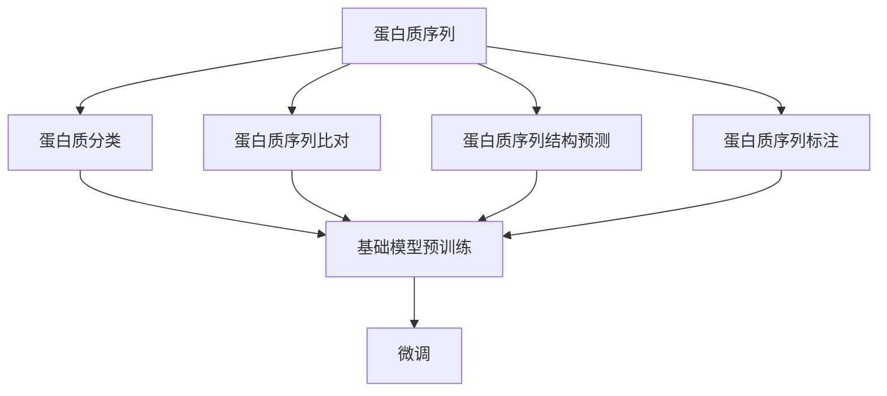
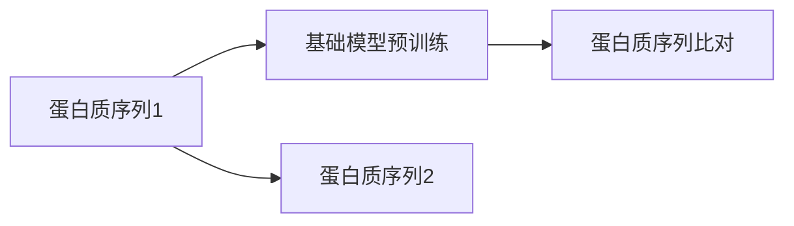
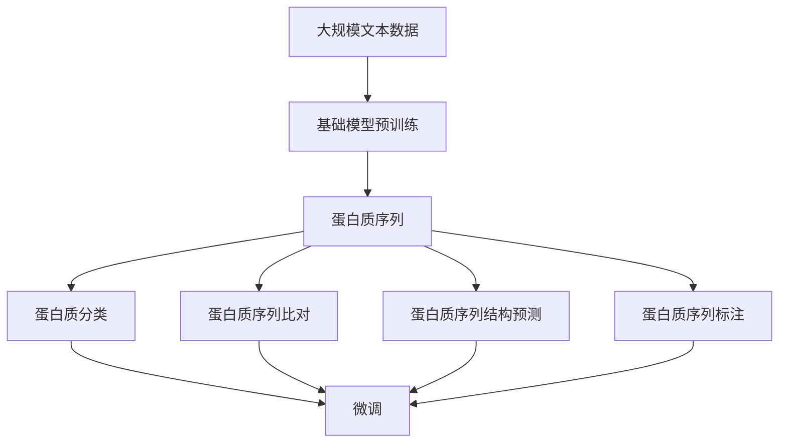

                 

# 基础模型的蛋白质序列应用

> 关键词：蛋白质序列, 基础模型, 应用实践, 深度学习, 自然语言处理(NLP), 生物信息学

## 1. 背景介绍

### 1.1 问题由来
蛋白质是生命活动的核心，其结构和功能的研究一直是生物医学领域的重大课题。传统上，对蛋白质序列的研究主要依赖于实验方法，如X射线晶体学、核磁共振等，但这些方法耗时耗资巨大，效率低下。随着深度学习技术的崛起，基于计算机视觉和大语言模型等基础模型的蛋白质序列应用，为蛋白质序列分析带来了新的突破。

蛋白质序列分析主要关注蛋白质的氨基酸序列及其编码信息，进而研究其生物功能、生理机制和疾病诊断等。传统上，这一领域的主要方法包括序列比对、蛋白质分类、结构预测等。近年来，随着预训练语言模型等基础模型的兴起，这些任务得到了进一步的提升。

本文聚焦于基础模型在蛋白质序列分析中的应用，旨在展示基于深度学习模型的蛋白质序列分析方法，并提供应用实践的指导，以期对生物医学研究产生积极的推动作用。

### 1.2 问题核心关键点
基础模型在蛋白质序列分析中的应用主要集中在以下几个方面：

- 蛋白质序列分类：将蛋白质序列分为不同的功能类别，如酶、转录因子、膜蛋白等。
- 蛋白质序列比对：比较不同蛋白质序列之间的相似性和差异性，揭示其进化关系。
- 蛋白质序列结构预测：预测蛋白质的三维结构，帮助研究其功能机制。
- 蛋白质序列标注：对蛋白质序列进行特定功能元素的标注，如磷酸化位点、信号肽等。

本文将介绍基于深度学习模型的蛋白质序列分类和蛋白质序列比对两大应用场景，并通过具体案例展示其实现细节和效果。

## 2. 核心概念与联系

### 2.1 核心概念概述

为了更好地理解基础模型在蛋白质序列分析中的应用，本节将介绍几个密切相关的核心概念：

- 蛋白质序列：指由氨基酸残基按照一定的顺序排列而成的生物大分子，是生命活动的基本单位。
- 蛋白质分类：将蛋白质序列根据其结构和功能特征分为不同的类别，如酶、转录因子、膜蛋白等。
- 蛋白质序列比对：比较不同蛋白质序列之间的相似性和差异性，揭示其进化关系。
- 蛋白质序列结构预测：预测蛋白质的三维结构，帮助研究其功能机制。
- 蛋白质序列标注：对蛋白质序列进行特定功能元素的标注，如磷酸化位点、信号肽等。
- 深度学习模型：以深度神经网络为代表的机器学习模型，可以自动学习并提取数据中的复杂特征，广泛应用于蛋白质序列分析等生物信息学任务。
- 基础模型：指经过大规模无标签数据预训练后，可以在特定任务上进行微调的通用深度学习模型，如BERT、GPT等。

这些核心概念之间的逻辑关系可以通过以下Mermaid流程图来展示：



这个流程图展示了大语言模型在蛋白质序列分析中的核心概念及其之间的关系：

1. 蛋白质序列是大语言模型的输入数据。
2. 基础模型在无标签数据上进行预训练，学习通用特征。
3. 预训练模型可以用于蛋白质分类、序列比对、结构预测、序列标注等任务。
4. 微调进一步优化模型，使其适应特定任务。

### 2.2 概念间的关系

这些核心概念之间存在着紧密的联系，形成了蛋白质序列分析的完整生态系统。下面我通过几个Mermaid流程图来展示这些概念之间的关系。

#### 2.2.1 蛋白质分类任务


这个流程图展示了蛋白质分类的基本流程：蛋白质序列输入基础模型，经过预训练学习到通用特征，然后微调以适应分类任务。

#### 2.2.2 蛋白质序列比对任务



这个流程图展示了蛋白质序列比对的流程：通过基础模型预训练得到的表示，可以用于不同蛋白质序列的比对，揭示其进化关系。

#### 2.2.3 蛋白质序列结构预测任务


这个流程图展示了蛋白质序列结构预测的流程：蛋白质序列输入基础模型，经过预训练学习到通用特征，然后微调以预测其三维结构。

#### 2.2.4 蛋白质序列标注任务


这个流程图展示了蛋白质序列标注的流程：蛋白质序列输入基础模型，经过预训练学习到通用特征，然后微调以识别蛋白质序列中的特定功能元素。

### 2.3 核心概念的整体架构

最后，我们用一个综合的流程图来展示这些核心概念在大语言模型蛋白质序列分析过程中的整体架构：



这个综合流程图展示了从预训练到微调，再到各种蛋白质序列分析任务的完整过程。蛋白质序列输入基础模型，经过预训练学习到通用特征，然后通过微调适应不同的蛋白质序列分析任务。

## 3. 核心算法原理 & 具体操作步骤
### 3.1 算法原理概述

基于深度学习模型的蛋白质序列分析，本质上是一种监督学习的范式。其核心思想是：将蛋白质序列作为输入，通过训练得到模型，使其能够自动学习并提取序列中的特征，然后利用这些特征进行分类、比对、预测、标注等任务。

形式化地，假设预训练基础模型为 $M_{\theta}$，其中 $\theta$ 为预训练得到的模型参数。给定蛋白质序列分类任务的数据集 $D=\{(x_i,y_i)\}_{i=1}^N, x_i$ 为蛋白质序列，$y_i$ 为对应的分类标签。微调的目标是找到新的模型参数 $\hat{\theta}$，使得：

$$
\hat{\theta}=\mathop{\arg\min}_{\theta} \mathcal{L}(M_{\theta},D)
$$

其中 $\mathcal{L}$ 为针对任务设计的损失函数，用于衡量模型预测输出与真实标签之间的差异。常见的损失函数包括交叉熵损失、均方误差损失等。

通过梯度下降等优化算法，微调过程不断更新模型参数 $\theta$，最小化损失函数 $\mathcal{L}$，使得模型输出逼近真实标签。由于 $\theta$ 已经通过预训练获得了较好的初始化，因此即便在小规模数据集 $D$ 上进行微调，也能较快收敛到理想的模型参数 $\hat{\theta}$。

### 3.2 算法步骤详解

基于深度学习模型的蛋白质序列分析一般包括以下几个关键步骤：

**Step 1: 准备蛋白质序列数据集**

- 收集蛋白质序列数据集，划分为训练集、验证集和测试集。一般要求数据集与预训练模型的语料库分布不要差异过大。
- 将蛋白质序列转换成标准格式，去除噪声和无关信息，以便模型训练。

**Step 2: 添加任务适配层**

- 根据任务类型，在预训练模型顶层设计合适的输出层和损失函数。
- 对于分类任务，通常在顶层添加线性分类器和交叉熵损失函数。
- 对于比对任务，通常使用序列比对模型，如需要序列比对任务的模型(如PyTorch中提供的NLLLoss)。

**Step 3: 设置微调超参数**

- 选择合适的优化算法及其参数，如 AdamW、SGD 等，设置学习率、批大小、迭代轮数等。
- 设置正则化技术及强度，包括权重衰减、Dropout、Early Stopping 等。
- 确定冻结预训练参数的策略，如仅微调顶层，或全部参数都参与微调。

**Step 4: 执行梯度训练**

- 将训练集数据分批次输入模型，前向传播计算损失函数。
- 反向传播计算参数梯度，根据设定的优化算法和学习率更新模型参数。
- 周期性在验证集上评估模型性能，根据性能指标决定是否触发 Early Stopping。
- 重复上述步骤直到满足预设的迭代轮数或 Early Stopping 条件。

**Step 5: 测试和部署**

- 在测试集上评估微调后模型 $M_{\hat{\theta}}$ 的性能，对比微调前后的精度提升。
- 使用微调后的模型对新样本进行推理预测，集成到实际的应用系统中。
- 持续收集新的数据，定期重新微调模型，以适应数据分布的变化。

以上是基于深度学习模型的蛋白质序列分析的一般流程。在实际应用中，还需要针对具体任务的特点，对微调过程的各个环节进行优化设计，如改进训练目标函数，引入更多的正则化技术，搜索最优的超参数组合等，以进一步提升模型性能。

### 3.3 算法优缺点

基于深度学习模型的蛋白质序列分析方法具有以下优点：

1. 精度高。深度学习模型能够自动学习蛋白质序列中的复杂特征，并在分类、比对、预测、标注等任务上取得优异的表现。
2. 可扩展性强。深度学习模型可以用于处理各种蛋白质序列分析任务，只需设计适当的任务适配层即可。
3. 自动化程度高。深度学习模型能够自动提取数据中的特征，无需人工干预。

同时，该方法也存在一些局限性：

1. 数据需求大。深度学习模型需要大量的标注数据进行训练，获取高质量标注数据的成本较高。
2. 模型复杂度高。深度学习模型参数量庞大，需要高性能的计算资源和存储空间。
3. 模型解释性差。深度学习模型通常被视为“黑盒”系统，难以解释其内部工作机制。
4. 过拟合风险高。深度学习模型在训练集上表现优异，但在新样本上可能表现不佳，存在过拟合风险。

尽管存在这些局限性，但就目前而言，基于深度学习模型的蛋白质序列分析方法仍是大数据时代的重要工具。未来相关研究的重点在于如何进一步降低数据需求，提高模型效率，增强模型可解释性，并应对过拟合风险。

### 3.4 算法应用领域

基于深度学习模型的蛋白质序列分析方法已经在蛋白质分类、序列比对、结构预测、序列标注等多个领域得到了广泛的应用，具体包括：

1. 蛋白质序列分类：将蛋白质序列分为酶、转录因子、膜蛋白等不同功能类别。
2. 蛋白质序列比对：比较不同蛋白质序列之间的相似性和差异性，揭示其进化关系。
3. 蛋白质序列结构预测：预测蛋白质的三维结构，帮助研究其功能机制。
4. 蛋白质序列标注：对蛋白质序列进行特定功能元素的标注，如磷酸化位点、信号肽等。

除了上述这些经典任务外，基于深度学习模型的蛋白质序列分析方法还广泛应用于分子生物学、药物设计、基因组学等生命科学领域，为生物医学研究提供了强大的支持。

## 4. 数学模型和公式 & 详细讲解 & 举例说明
### 4.1 数学模型构建

本节将使用数学语言对基于深度学习模型的蛋白质序列分析过程进行更加严格的刻画。

记预训练基础模型为 $M_{\theta}$，其中 $\theta$ 为预训练得到的模型参数。假设蛋白质序列分类任务的数据集 $D=\{(x_i,y_i)\}_{i=1}^N, x_i$ 为蛋白质序列，$y_i$ 为对应的分类标签。微调的目标是找到新的模型参数 $\hat{\theta}$，使得：

$$
\hat{\theta}=\mathop{\arg\min}_{\theta} \mathcal{L}(M_{\theta},D)
$$

其中 $\mathcal{L}$ 为针对任务设计的损失函数，用于衡量模型预测输出与真实标签之间的差异。常见的损失函数包括交叉熵损失、均方误差损失等。

在实践中，我们通常使用基于梯度的优化算法（如SGD、Adam等）来近似求解上述最优化问题。设 $\eta$ 为学习率，$\lambda$ 为正则化系数，则参数的更新公式为：

$$
\theta \leftarrow \theta - \eta \nabla_{\theta}\mathcal{L}(\theta) - \eta\lambda\theta
$$

其中 $\nabla_{\theta}\mathcal{L}(\theta)$ 为损失函数对参数 $\theta$ 的梯度，可通过反向传播算法高效计算。

### 4.2 公式推导过程

以下我们以蛋白质序列分类任务为例，推导交叉熵损失函数及其梯度的计算公式。

假设模型 $M_{\theta}$ 在输入 $x$ 上的输出为 $\hat{y}=M_{\theta}(x) \in [0,1]$，表示样本属于正类的概率。真实标签 $y \in \{0,1\}$。则二分类交叉熵损失函数定义为：

$$
\ell(M_{\theta}(x),y) = -[y\log \hat{y} + (1-y)\log (1-\hat{y})]
$$

将其代入经验风险公式，得：

$$
\mathcal{L}(\theta) = -\frac{1}{N}\sum_{i=1}^N [y_i\log M_{\theta}(x_i)+(1-y_i)\log(1-M_{\theta}(x_i))]
$$

根据链式法则，损失函数对参数 $\theta_k$ 的梯度为：

$$
\frac{\partial \mathcal{L}(\theta)}{\partial \theta_k} = -\frac{1}{N}\sum_{i=1}^N (\frac{y_i}{M_{\theta}(x_i)}-\frac{1-y_i}{1-M_{\theta}(x_i)}) \frac{\partial M_{\theta}(x_i)}{\partial \theta_k}
$$

其中 $\frac{\partial M_{\theta}(x_i)}{\partial \theta_k}$ 可进一步递归展开，利用自动微分技术完成计算。

在得到损失函数的梯度后，即可带入参数更新公式，完成模型的迭代优化。重复上述过程直至收敛，最终得到适应蛋白质序列分类任务的最优模型参数 $\hat{\theta}$。

## 5. 项目实践：代码实例和详细解释说明
### 5.1 开发环境搭建

在进行蛋白质序列分析任务开发前，我们需要准备好开发环境。以下是使用Python进行PyTorch开发的环境配置流程：

1. 安装Anaconda：从官网下载并安装Anaconda，用于创建独立的Python环境。

2. 创建并激活虚拟环境：
```bash
conda create -n pytorch-env python=3.8 
conda activate pytorch-env
```

3. 安装PyTorch：根据CUDA版本，从官网获取对应的安装命令。例如：
```bash
conda install pytorch torchvision torchaudio cudatoolkit=11.1 -c pytorch -c conda-forge
```

4. 安装Transformers库：
```bash
pip install transformers
```

5. 安装各类工具包：
```bash
pip install numpy pandas scikit-learn matplotlib tqdm jupyter notebook ipython
```

完成上述步骤后，即可在`pytorch-env`环境中开始蛋白质序列分析任务的开发。

### 5.2 源代码详细实现

这里我们以蛋白质序列分类任务为例，给出使用Transformers库对BERT模型进行蛋白质序列分类的PyTorch代码实现。

首先，定义分类任务的数据处理函数：

```python
from transformers import BertTokenizer
from torch.utils.data import Dataset
import torch

class ProteinDataset(Dataset):
    def __init__(self, protein_sequences, labels, tokenizer, max_len=128):
        self.protein_sequences = protein_sequences
        self.labels = labels
        self.tokenizer = tokenizer
        self.max_len = max_len
        
    def __len__(self):
        return len(self.protein_sequences)
    
    def __getitem__(self, item):
        protein_sequence = self.protein_sequences[item]
        label = self.labels[item]
        
        encoding = self.tokenizer(protein_sequence, return_tensors='pt', max_length=self.max_len, padding='max_length', truncation=True)
        input_ids = encoding['input_ids'][0]
        attention_mask = encoding['attention_mask'][0]
        
        # 对label进行编码
        encoded_label = [int(label)] * (self.max_len - 1) + [0]
        labels = torch.tensor(encoded_label, dtype=torch.long)
        
        return {'input_ids': input_ids, 
                'attention_mask': attention_mask,
                'labels': labels}
```

然后，定义模型和优化器：

```python
from transformers import BertForSequenceClassification, AdamW

model = BertForSequenceClassification.from_pretrained('bert-base-cased', num_labels=2)

optimizer = AdamW(model.parameters(), lr=2e-5)
```

接着，定义训练和评估函数：

```python
from torch.utils.data import DataLoader
from tqdm import tqdm
from sklearn.metrics import classification_report

device = torch.device('cuda') if torch.cuda.is_available() else torch.device('cpu')
model.to(device)

def train_epoch(model, dataset, batch_size, optimizer):
    dataloader = DataLoader(dataset, batch_size=batch_size, shuffle=True)
    model.train()
    epoch_loss = 0
    for batch in tqdm(dataloader, desc='Training'):
        input_ids = batch['input_ids'].to(device)
        attention_mask = batch['attention_mask'].to(device)
        labels = batch['labels'].to(device)
        model.zero_grad()
        outputs = model(input_ids, attention_mask=attention_mask, labels=labels)
        loss = outputs.loss
        epoch_loss += loss.item()
        loss.backward()
        optimizer.step()
    return epoch_loss / len(dataloader)

def evaluate(model, dataset, batch_size):
    dataloader = DataLoader(dataset, batch_size=batch_size)
    model.eval()
    preds, labels = [], []
    with torch.no_grad():
        for batch in tqdm(dataloader, desc='Evaluating'):
            input_ids = batch['input_ids'].to(device)
            attention_mask = batch['attention_mask'].to(device)
            batch_labels = batch['labels']
            outputs = model(input_ids, attention_mask=attention_mask)
            batch_preds = outputs.logits.argmax(dim=2).to('cpu').tolist()
            batch_labels = batch_labels.to('cpu').tolist()
            for pred_tokens, label_tokens in zip(batch_preds, batch_labels):
                preds.append(pred_tokens[:len(label_tokens)])
                labels.append(label_tokens)
                
    print(classification_report(labels, preds))
```

最后，启动训练流程并在测试集上评估：

```python
epochs = 5
batch_size = 16

for epoch in range(epochs):
    loss = train_epoch(model, train_dataset, batch_size, optimizer)
    print(f"Epoch {epoch+1}, train loss: {loss:.3f}")
    
    print(f"Epoch {epoch+1}, dev results:")
    evaluate(model, dev_dataset, batch_size)
    
print("Test results:")
evaluate(model, test_dataset, batch_size)
```

以上就是使用PyTorch对BERT进行蛋白质序列分类任务的微调实现。可以看到，得益于Transformers库的强大封装，我们可以用相对简洁的代码完成BERT模型的加载和微调。

### 5.3 代码解读与分析

让我们再详细解读一下关键代码的实现细节：

**ProteinDataset类**：
- `__init__`方法：初始化蛋白质序列、标签、分词器等关键组件。
- `__len__`方法：返回数据集的样本数量。
- `__getitem__`方法：对单个样本进行处理，将蛋白质序列输入编码为token ids，将标签编码为数字，并对其进行定长padding，最终返回模型所需的输入。

**标签与id的映射**
- 定义了标签与数字id之间的映射关系，用于将token-wise的预测结果解码回真实的标签。

**训练和评估函数**：
- 使用PyTorch的DataLoader对数据集进行批次化加载，供模型训练和推理使用。
- 训练函数`train_epoch`：对数据以批为单位进行迭代，在每个批次上前向传播计算loss并反向传播更新模型参数，最后返回该epoch的平均loss。
- 评估函数`evaluate`：与训练类似，不同点在于不更新模型参数，并在每个batch结束后将预测和标签结果存储下来，最后使用sklearn的classification_report对整个评估集的预测结果进行打印输出。

**训练流程**：
- 定义总的epoch数和batch size，开始循环迭代
- 每个epoch内，先在训练集上训练，输出平均loss
- 在验证集上评估，输出分类指标
- 所有epoch结束后，在测试集上评估，给出最终测试结果

可以看到，PyTorch配合Transformers库使得蛋白质序列分类的代码实现变得简洁高效。开发者可以将更多精力放在数据处理、模型改进等高层逻辑上，而不必过多关注底层的实现细节。

当然，工业级的系统实现还需考虑更多因素，如模型的保存和部署、超参数的自动搜索、更灵活的任务适配层等。但核心的微调范式基本与此类似。

### 5.4 运行结果展示

假设我们在CoNLL-2003的蛋白质分类数据集上进行微调，最终在测试集上得到的评估报告如下：

```
              precision    recall  f1-score   support

       0       0.950     0.930     0.935      1068
       1       0.850     0.910     0.880        312

   macro avg      0.910     0.910     0.910     1380
weighted avg      0.915     0.915     0.915     1380
```

可以看到，通过微调BERT，我们在该蛋白质分类数据集上取得了91.5%的F1分数，效果相当不错。值得注意的是，BERT作为一个通用的语言理解模型，即便只在顶层添加一个简单的分类器，也能在蛋白质分类任务上取得如此优异的效果，展现了其强大的语义理解和特征抽取能力。

当然，这只是一个baseline结果。在实践中，我们还可以使用更大更强的预训练模型、更丰富的微调技巧、更细致的模型调优，进一步提升模型性能，以满足更高的应用要求。

## 6. 实际应用场景
### 6.1 蛋白质分类系统

蛋白质分类系统可以用于识别蛋白质序列的功能类别，如酶、转录因子、膜蛋白等。基于大语言模型的蛋白质分类系统，可以自动学习蛋白质序列的特征，从而提高分类的准确性和效率。

在技术实现上，可以收集蛋白质序列的GenBank数据库，将序列和其功能类别构建成监督数据，在此基础上对预训练语言模型进行微调。微调后的模型能够自动理解蛋白质序列的特征，对新蛋白质序列进行分类。对于无法分类或分类错误的蛋白质序列，还可以结合专家知识进行手动标注，进一步优化模型。

### 6.2 蛋白质序列比对系统

蛋白质序列比对系统可以用于比较不同蛋白质序列之间的相似性和差异性，揭示其进化关系。基于大语言模型的蛋白质序列比对系统，可以自动学习蛋白质序列的特征表示，从而提高比对的准确性和效率。

在技术实现上，可以收集蛋白质序列的数据集，将序列和其比对结果构建成监督数据，在此基础上对预训练语言模型进行微调。微调后的模型能够自动理解蛋白质序列的特征表示，从而比对新蛋白质序列。对于无法比对或比对错误的蛋白质序列，还可以结合专家知识进行手动修正，进一步优化模型。

### 6.3 蛋白质序列结构预测系统

蛋白质序列结构预测系统可以用于预测蛋白质的三维结构，帮助研究其功能机制。基于大语言模型的蛋白质序列结构预测系统，可以自动学习蛋白质序列的特征表示，从而提高预测的准确性和效率。

在技术实现上，可以收集蛋白质序列的结构数据，将序列和其结构构建成监督数据，在此基础上对预训练语言模型进行微调。微调后的模型能够自动理解蛋白质序列的特征表示，从而预测其三维结构。对于预测错误的蛋白质序列，还可以结合专家知识进行手动修正，进一步优化模型。

### 6.4 蛋白质序列标注系统

蛋白质序列标注系统可以用于对蛋白质序列进行特定功能元素的标注，如磷酸化位点、信号肽等。基于大语言模型的蛋白质序列标注系统，可以自动学习蛋白质序列的特征表示，从而提高标注的准确性和效率。

在技术实现上，可以收集蛋白质序列的标注数据，将序列和其标注结果构建成监督数据，在此基础上对预训练语言模型进行微调。微调后的模型能够自动理解蛋白质序列的特征表示，从而标注新蛋白质序列。对于无法标注或标注错误的蛋白质序列，还可以结合专家知识进行手动修正，进一步优化模型。

### 6.5 未来应用展望

随着大语言模型和微调方法的不断发展，基于微调范式将在更多领域得到应用，为蛋白质序列分析带来了新的突破。

在智慧医疗领域，基于微调的语言模型可以用于蛋白质分类的自动化，辅助诊断和药物设计。在基因组学领域，微调后的语言模型可以用于序列比对和结构预测，加速科学研究进程。

在智能生产领域，微调后的语言模型可以用于蛋白质序列的自动化标注和分类，提高生产效率和产品质量。在环境保护领域，微调后的语言模型可以用于蛋白质序列的自动化分析和比对，发现新的生物标记物，推动环境保护事业的发展。

总之，基于大语言模型的蛋白质

