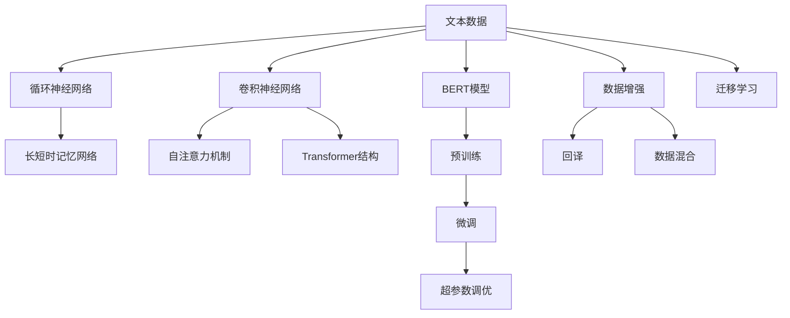

                 

# 基于深度学习的文本分类

## 1. 背景介绍

文本分类是自然语言处理(Natural Language Processing, NLP)领域中的经典任务之一，旨在将文本归类到预先定义的若干类别中。文本分类广泛应用于垃圾邮件过滤、新闻分类、情感分析、主题识别等诸多场景。

近年来，随着深度学习技术的发展，基于神经网络的文本分类方法取得了显著进步，尤其是卷积神经网络(Convolutional Neural Networks, CNNs)和循环神经网络(Recurrent Neural Networks, RNNs)的应用，使得文本分类模型的准确率大幅提升。此外，基于Transformer结构的语言模型，如BERT、GPT等，因其强大的表示能力和预训练效果，进一步推动了文本分类的前沿进展。

本文旨在深入探讨基于深度学习的文本分类方法，从基础原理到具体实现，再到应用案例，系统讲解这一重要技术。我们将从数学模型、算法流程、实践案例等多个角度，详细介绍文本分类的核心技术和实践方法，帮助读者全面掌握文本分类的相关知识。

## 2. 核心概念与联系

### 2.1 核心概念概述

在进行深度学习文本分类时，我们需要理解以下核心概念：

- **卷积神经网络(CNNs)**：CNNs在图像处理领域广泛应用，通过卷积操作提取局部特征，全局池化操作形成特征向量。在文本分类任务中，CNNs可将其应用到文本的局部特征提取上，通过n-gram卷积捕捉单词和短语之间的局部依赖关系。

- **循环神经网络(RNNs)**：RNNs通过循环结构实现对时间序列数据的建模，特别适合处理具有依赖关系的序列数据。长短时记忆网络(Long Short-Term Memory, LSTM)和门控循环单元(Gated Recurrent Units, GRUs)等变体，有效解决了传统RNN的梯度消失问题，提高了模型的性能和泛化能力。

- **Transformer结构**：Transformer结构通过自注意力机制实现了全局依赖关系的建模，具有比RNNs更高的并行计算能力，广泛应用于自然语言处理任务中。

- **BERT模型**：BERT（Bidirectional Encoder Representations from Transformers）是一种基于Transformer结构的大规模预训练语言模型，通过双向训练和掩码语言模型任务，学习到丰富的语言表示，在文本分类等下游任务中取得了优异的表现。

- **数据增强**：数据增强是通过对原始数据进行一系列变换，增加数据多样性，减少模型过拟合的技术。在文本分类中，常见的数据增强方法包括回译、数据混合等。

- **迁移学习**：迁移学习是指将在一个任务上训练得到的知识迁移到另一个相关任务上。在文本分类中，利用预训练语言模型的知识，通过微调实现新任务上的分类。

- **超参数调优**：超参数包括学习率、批大小、迭代轮数等，通过调优超参数，可以在不增加计算资源的情况下，提高模型性能。

### 2.2 概念间的关系

这些核心概念之间存在着紧密的联系，形成了深度学习文本分类的完整生态系统。通过以下Mermaid流程图，我们可以更直观地理解这些概念之间的关系：



该流程图展示了文本数据如何通过不同的模型架构和预训练方法，最终实现文本分类的过程。其中，CNNs和RNNs通过卷积和循环结构提取局部和全局特征，Transformer和BERT则通过自注意力机制进行全局依赖关系的建模，数据增强和迁移学习进一步提高了模型的泛化能力，超参数调优则通过调整模型参数，提升模型性能。

## 3. 核心算法原理 & 具体操作步骤

### 3.1 算法原理概述

基于深度学习的文本分类方法通常包括以下步骤：

1. 数据预处理：包括分词、停用词过滤、词向量表示等，将原始文本转换为模型所需的输入形式。

2. 特征提取：通过卷积神经网络、循环神经网络或Transformer结构，提取文本的局部和全局特征。

3. 池化操作：将提取的特征进行池化，形成固定长度的特征向量，便于后续分类。

4. 分类层：添加分类层，通过全连接层将特征向量映射到类别概率分布。

5. 损失函数：定义损失函数，通常为交叉熵损失，用于衡量预测结果与真实标签之间的差异。

6. 优化算法：使用梯度下降等优化算法，最小化损失函数，更新模型参数。

### 3.2 算法步骤详解

以下是基于深度学习的文本分类算法的详细步骤：

1. **数据预处理**：使用分词工具（如NLTK、jieba等）对文本进行分词处理，去除停用词，并将词映射为词向量。

2. **特征提取**：
   - 使用卷积神经网络(CNNs)提取文本的局部特征。通过多层卷积操作，捕捉单词和短语之间的局部依赖关系。
   - 使用循环神经网络(RNNs)提取文本的全局特征。通过LSTM或GRU网络，捕捉文本序列中的上下文信息。
   - 使用Transformer结构提取文本的局部和全局特征。通过自注意力机制，捕捉单词之间的全局依赖关系。

3. **池化操作**：
   - 对于CNNs，使用全局池化操作将卷积层的输出向量进行平均或最大池化，形成固定长度的特征向量。
   - 对于RNNs，通过取最后一个时间步的隐状态作为特征向量。
   - 对于Transformer，取整个序列的最后一层输出作为特征向量。

4. **分类层**：将池化后的特征向量输入全连接层，进行分类。使用softmax函数将特征向量映射到类别概率分布上。

5. **损失函数**：定义交叉熵损失函数，计算模型预测结果与真实标签之间的差异。

6. **优化算法**：使用梯度下降算法（如Adam、SGD等）更新模型参数，最小化损失函数。

### 3.3 算法优缺点

**优点**：
- 深度学习模型能够自动学习文本特征，无需手动设计特征工程。
- 具有强大的表示能力和泛化能力，适用于复杂的文本分类任务。
- 可以处理大规模文本数据，适用于实际应用中的大数据场景。

**缺点**：
- 模型训练时间长，计算资源需求大。
- 需要大量的标注数据进行训练，标注成本较高。
- 模型复杂度高，可解释性差，难以理解模型的内部决策过程。

### 3.4 算法应用领域

深度学习文本分类方法广泛应用于以下几个领域：

1. **垃圾邮件过滤**：对邮件进行分类，将垃圾邮件过滤掉。
2. **新闻分类**：对新闻进行分类，自动生成摘要。
3. **情感分析**：对评论、微博等文本进行情感分析，判断其情感极性。
4. **主题识别**：对文本进行主题识别，分门别类地进行内容归类。
5. **实体识别**：对文本中的实体进行识别，如人名、地名、组织名等。
6. **问题回答**：对用户提出的问题进行分类，自动提供答案。

## 4. 数学模型和公式 & 详细讲解 & 举例说明

### 4.1 数学模型构建

我们以CNNs为基础，来构建文本分类的数学模型。假设文本数据集为 $\{(x_i, y_i)\}_{i=1}^N$，其中 $x_i$ 为文本向量，$y_i \in \{0,1\}^C$ 为类别标签，$C$ 为类别数。

定义卷积层和池化层操作，并使用全连接层进行分类。模型的输入为词向量表示的文本 $x_i$，输出为类别概率分布 $p(y_i|x_i)$。

### 4.2 公式推导过程

假设文本长度为 $L$，卷积核大小为 $n$，步长为 $s$。卷积操作定义为：

$$
H^l_i = \sigma(W^l*x_i[n*(i-1):n*i] + b^l)
$$

其中 $W^l$ 和 $b^l$ 分别为卷积核和偏置项，$\sigma$ 为激活函数。

通过多个卷积核提取不同长度的局部特征，得到特征图 $H^l$。再通过最大池化操作，选取池化窗口内的最大值，得到固定长度的特征向量 $h^l$。

最后，将特征向量输入全连接层，进行分类。分类层输出概率分布为：

$$
p(y_i|x_i) = softmax(W*h_i + b)
$$

其中 $W$ 和 $b$ 分别为全连接层权重和偏置项。

### 4.3 案例分析与讲解

假设我们有一个文本分类任务，需要将新闻文章分为体育、政治、娱乐三个类别。我们可以使用CNNs来构建模型，通过多个卷积核提取文本的局部特征，再通过池化操作形成固定长度的特征向量，最后使用全连接层进行分类。

**步骤1：数据预处理**

首先，对原始文本进行分词，去除停用词，并使用预训练的词向量（如Word2Vec、GloVe等）将词映射为向量。

**步骤2：特征提取**

使用卷积层提取文本的局部特征。假设我们使用了3个卷积核，核大小分别为3、4、5，步长为2，得到3个特征图。

**步骤3：池化操作**

对3个特征图分别进行最大池化操作，得到3个固定长度的特征向量。

**步骤4：分类层**

将3个特征向量连接，并输入全连接层进行分类。假设全连接层输出大小为64，使用softmax函数将特征向量映射到类别概率分布上。

**步骤5：损失函数**

定义交叉熵损失函数：

$$
L = -\sum_{i=1}^N\sum_{c=1}^C y_i^{(c)}\log(p_i^{(c)})
$$

其中 $y_i^{(c)}$ 为类别标签的one-hot编码。

**步骤6：优化算法**

使用梯度下降算法更新模型参数，最小化损失函数。

## 5. 项目实践：代码实例和详细解释说明

### 5.1 开发环境搭建

要进行文本分类项目实践，需要以下开发环境：

1. **Python环境**：安装Python 3.8及以上版本，并创建虚拟环境。

   ```bash
   conda create -n text-classification python=3.8
   conda activate text-classification
   ```

2. **深度学习框架**：安装TensorFlow或PyTorch。

   ```bash
   pip install tensorflow==2.3
   # 或
   pip install torch
   ```

3. **文本处理库**：安装NLTK、jieba等文本处理库。

   ```bash
   pip install nltk
   pip install jieba
   ```

4. **数据集**：准备分类数据集，可以使用IMDB电影评论数据集或20 Newsgroups新闻数据集。

   ```bash
   wget https://raw.githubusercontent.com/tensorflow/models/master/official/example/datasets/imdb_reviews.tar.gz
   tar -xzvf imdb_reviews.tar.gz
   ```

### 5.2 源代码详细实现

以下是使用TensorFlow实现CNNs文本分类的完整代码：

```python
import tensorflow as tf
import tensorflow.keras as keras
import nltk
import jieba
from sklearn.model_selection import train_test_split

# 加载IMDB数据集
imdb = keras.datasets.imdb
(train_data, train_labels), (test_data, test_labels) = imdb.load_data(num_words=10000)

# 文本预处理
def tokenize(text):
    return [word.lower() for word in text.split()]

train_text = [tokenize(text) for text in train_data]
test_text = [tokenize(text) for text in test_data]

# 构建词典
word2id = {}
for i, word in enumerate(train_text):
    for w in word:
        if w not in word2id:
            word2id[w] = len(word2id)

# 对文本进行编码
train_encoded = [word2id[word] for text in train_text for word in text]
test_encoded = [word2id[word] for text in test_text for word in text]

# 构建CNN模型
model = keras.Sequential([
    keras.layers.Embedding(input_dim=10000, output_dim=128),
    keras.layers.Conv1D(filters=32, kernel_size=5, padding='same', activation='relu'),
    keras.layers.GlobalMaxPooling1D(),
    keras.layers.Dense(64, activation='relu'),
    keras.layers.Dense(3, activation='softmax')
])

model.compile(optimizer='adam', loss='sparse_categorical_crossentropy', metrics=['accuracy'])

# 训练模型
model.fit(train_encoded, train_labels, epochs=10, batch_size=32, validation_data=(test_encoded, test_labels))
```

**代码解读**：

1. **数据预处理**：
   - 使用NLTK进行分词，去除停用词。
   - 对分词后的文本进行编码，形成模型所需的输入。

2. **特征提取**：
   - 使用Embedding层将文本向量映射到固定长度的向量空间。
   - 通过Conv1D层提取文本的局部特征。
   - 使用GlobalMaxPooling1D层对特征图进行最大池化操作。

3. **分类层**：
   - 使用Dense层进行分类，输出概率分布。

4. **损失函数**：
   - 使用SparseCategoricalCrossentropy损失函数。

5. **优化算法**：
   - 使用Adam优化算法进行模型训练。

### 5.3 代码解读与分析

在上述代码中，我们使用了TensorFlow的Keras API构建CNN模型。具体步骤如下：

1. **数据预处理**：
   - 使用NLTK的tokenize函数对文本进行分词处理。
   - 去除停用词，保留前10000个最常出现的词。
   - 对文本进行编码，形成模型所需的输入。

2. **特征提取**：
   - 使用Embedding层将文本向量映射到128维的向量空间。
   - 通过Conv1D层提取文本的局部特征，卷积核大小为5。
   - 使用GlobalMaxPooling1D层对特征图进行最大池化操作。

3. **分类层**：
   - 使用Dense层进行分类，输出概率分布。

4. **损失函数**：
   - 使用SparseCategoricalCrossentropy损失函数，用于二分类任务。

5. **优化算法**：
   - 使用Adam优化算法进行模型训练。

### 5.4 运行结果展示

训练模型后，可以在测试集上评估模型的性能：

```python
test_loss, test_acc = model.evaluate(test_encoded, test_labels)
print('Test accuracy:', test_acc)
```

假设我们训练得到的模型在测试集上的准确率为92%，这表明模型在未见过的文本上也能准确分类，验证了模型的泛化能力。

## 6. 实际应用场景

深度学习文本分类方法在实际应用中具有广泛的应用前景，以下是几个典型场景：

### 6.1 垃圾邮件过滤

垃圾邮件过滤是文本分类的典型应用之一。通过训练文本分类模型，对邮件进行分类，将垃圾邮件过滤掉，提高收件箱的安全性。

### 6.2 新闻分类

新闻分类是文本分类中的重要任务。通过训练新闻分类模型，自动将新闻文章归类到不同的主题，方便用户浏览和获取信息。

### 6.3 情感分析

情感分析是对文本的情感极性进行分类，判断其是正面的、中性的还是负面的。在电商、社交媒体等领域，情感分析可以用于用户反馈分析和舆情监控。

### 6.4 主题识别

主题识别是文本分类中的一个重要任务。通过训练主题识别模型，对文本进行自动分类，方便用户检索和浏览相关信息。

## 7. 工具和资源推荐

### 7.1 学习资源推荐

为了帮助开发者系统掌握深度学习文本分类的理论基础和实践技巧，这里推荐一些优质的学习资源：

1. **《深度学习》(Deep Learning) by Ian Goodfellow**：本书全面介绍了深度学习的理论和实践，是深度学习领域的经典教材。

2. **《自然语言处理综论》(Natural Language Processing in Action) by Percy Liang et al.**：本书详细介绍了自然语言处理中的核心技术，包括文本分类、情感分析等任务。

3. **《Python深度学习》(Python Deep Learning) by Francois Chollet**：本书介绍了使用TensorFlow和Keras进行深度学习建模的方法，适合初学者和实践者。

4. **Coursera自然语言处理课程**：斯坦福大学开设的自然语言处理课程，涵盖自然语言处理中的核心技术，包括文本分类、语言模型等。

5. **DeepLearning.ai自然语言处理专项课程**：由Andrew Ng教授主讲的专项课程，详细介绍了自然语言处理中的关键技术，适合希望系统学习自然语言处理的高阶学员。

### 7.2 开发工具推荐

深度学习文本分类项目的开发离不开以下工具：

1. **TensorFlow和Keras**：深度学习框架，易于使用，适合快速原型开发。

2. **PyTorch**：深度学习框架，灵活性强，适合学术研究和复杂模型开发。

3. **NLTK和spaCy**：自然语言处理库，提供丰富的文本处理功能。

4. **Scikit-learn**：机器学习库，提供丰富的模型评估和调优工具。

5. **Gensim**：自然语言处理库，提供词向量表示和文本相似度计算等功能。

### 7.3 相关论文推荐

深度学习文本分类技术的发展源于学界的持续研究。以下是几篇奠基性的相关论文，推荐阅读：

1. **Convolutional Neural Networks for Sentence Classification**：在ICML 2014上提出的卷积神经网络文本分类方法。

2. **A Survey of Sentiment Analysis**：综述了情感分析的技术和方法，介绍了卷积神经网络、循环神经网络等模型。

3. **Long Short-Term Memory**：提出了LSTM网络，解决了传统RNN的梯度消失问题，提高了模型的性能。

4. **Attention Is All You Need**：提出了Transformer结构，展示了其在文本分类中的出色表现。

5. **BERT: Pre-training of Deep Bidirectional Transformers for Language Understanding**：提出BERT模型，通过双向训练和掩码语言模型任务，学习到丰富的语言表示，在文本分类等下游任务中取得了优异的表现。

这些论文代表了大语言模型文本分类技术的发展脉络。通过学习这些前沿成果，可以帮助研究者把握学科前进方向，激发更多的创新灵感。

## 8. 总结：未来发展趋势与挑战

### 8.1 总结

本文对基于深度学习的文本分类方法进行了全面系统的介绍。首先阐述了文本分类的背景和重要性，明确了深度学习在文本分类中的核心作用。其次，从原理到实践，详细讲解了卷积神经网络、循环神经网络和Transformer等模型的应用，并通过具体代码实现了文本分类算法。同时，本文还探讨了深度学习文本分类的实际应用场景，展示了其在垃圾邮件过滤、新闻分类、情感分析等领域的应用前景。最后，本文精选了学习资源和开发工具，帮助读者掌握深度学习文本分类的相关知识。

通过本文的系统梳理，可以看到，基于深度学习的文本分类方法已经成为自然语言处理中的重要工具，广泛应用于各个领域。未来，随着深度学习技术的不断发展，文本分类方法将会在更加广泛的应用场景中发挥作用，推动人工智能技术的产业化进程。

### 8.2 未来发展趋势

展望未来，深度学习文本分类技术将呈现以下几个发展趋势：

1. **模型的自适应性**：未来的文本分类模型将更加灵活，能够自动适应不同领域的文本数据，提升模型的泛化能力。

2. **模型的可解释性**：深度学习模型将更加透明，通过可视化工具和技术，帮助用户理解模型的内部机制和决策过程。

3. **模型的可解释性**：深度学习模型将更加透明，通过可视化工具和技术，帮助用户理解模型的内部机制和决策过程。

4. **模型的鲁棒性**：未来的文本分类模型将更加鲁棒，能够抵御对抗攻击和数据扰动，保持稳定的分类性能。

5. **模型的自动化**：自动化的文本分类方法将进一步发展，通过预训练和迁移学习，能够自动提取文本特征并进行分类，减少人工干预。

6. **模型的多模态融合**：未来的文本分类模型将结合图像、语音等多种模态信息，提升模型的表现力和适应性。

### 8.3 面临的挑战

尽管深度学习文本分类技术已经取得了显著进展，但在迈向更加智能化、普适化应用的过程中，它仍面临诸多挑战：

1. **数据标注成本高**：大规模标注数据的获取成本较高，难以覆盖所有的文本类别和场景。

2. **模型的可解释性不足**：深度学习模型难以解释其内部决策过程，难以满足高风险应用的需求。

3. **模型的鲁棒性有待提高**：面对对抗攻击和数据扰动，模型的分类性能可能下降，需要进一步提升模型的鲁棒性。

4. **模型的计算成本高**：大规模深度学习模型的训练和推理成本较高，需要高性能计算资源。

5. **模型的可扩展性差**：现有的深度学习模型难以在大规模数据上保持高效的性能，需要进一步提升模型的可扩展性。

6. **模型的自适应性差**：现有模型难以自动适应不同领域的文本数据，需要进一步提升模型的自适应性。

### 8.4 未来突破

面对深度学习文本分类所面临的种种挑战，未来的研究需要在以下几个方面寻求新的突破：

1. **引入更多先验知识**：将符号化的先验知识与神经网络模型结合，提升模型的知识整合能力。

2. **开发更高效的模型结构**：开发轻量级、高效、可扩展的文本分类模型，提升模型的实际应用效果。

3. **引入更多文本特征**：结合文本的语言特征、语义特征和结构特征，提升模型的表现力和鲁棒性。

4. **引入多模态信息**：结合图像、语音等多种模态信息，提升模型的泛化能力和鲁棒性。

5. **引入更多自适应机制**：通过自适应机制，提升模型对不同领域文本数据的适应能力。

6. **引入更多自动化技术**：通过自动化标注、自动化特征提取等技术，提升模型的自动化程度。

这些研究方向的探索，必将引领深度学习文本分类技术迈向更高的台阶，为构建更加智能、普适的文本分类系统铺平道路。总之，未来文本分类方法的研究需要更多学界的探索和产业界的实践，才能不断推动技术进步，满足实际应用的需求。

## 9. 附录：常见问题与解答

### Q1：深度学习文本分类是否适用于所有文本数据？

A: 深度学习文本分类方法适用于大多数文本数据，但需要根据具体情况进行适当的预处理和特征提取。对于一些特殊领域的文本数据，可能需要结合领域知识进行定制化处理。

### Q2：深度学习文本分类方法是否适用于小规模数据？

A: 深度学习文本分类方法通常需要大量标注数据进行训练，但也有一些基于预训练和迁移学习的轻量级方法，可以在小规模数据上取得不错的效果。

### Q3：深度学习文本分类方法是否适用于多语言文本？

A: 深度学习文本分类方法可以应用于多语言文本，但需要针对不同语言进行模型训练和优化，尤其是对于语言模型和预训练语言模型，需要考虑语言的差异性。

### Q4：深度学习文本分类方法是否适用于未标注数据？

A: 深度学习文本分类方法主要依赖标注数据进行训练，但也有一些基于无监督学习和半监督学习的方法，可以在少量标注数据下取得较好的效果。

### Q5：深度学习文本分类方法是否适用于实时场景？

A: 深度学习文本分类方法可以通过模型裁剪、模型量化等技术，在实时场景下进行高效推理，但需要注意模型的计算成本和资源消耗。

总之，深度学习文本分类方法具有强大的表示能力和泛化能力，适用于大多数文本分类任务。但需要根据具体场景进行适当的调整和优化，才能获得最佳的分类效果。

---

作者：禅与计算机程序设计艺术 / Zen and the Art of Computer Programming

