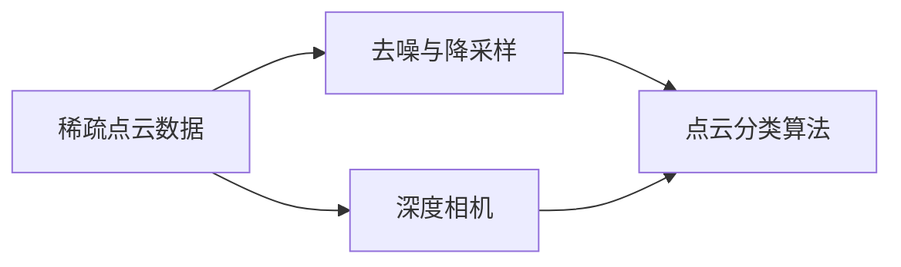

                 

# 基于深度相机稀疏点云分类算法研究

## 1. 背景介绍

### 1.1 问题由来
随着深度相机技术的飞速发展，其在三维场景重建、人体姿态估计、三维场景建模等领域的应用愈加广泛。然而，由于深度相机的固有特性（如光照不均、噪声干扰等），使得获取到的点云数据存在一定的稀疏性。传统的点云分类方法，如基于聚类的算法、基于图论的算法等，虽然取得了一定的效果，但在处理稀疏点云时，往往存在精度不高、计算复杂度高的问题。针对这一问题，本文研究了基于深度相机稀疏点云分类算法，旨在提升稀疏点云分类的准确性和效率。

### 1.2 问题核心关键点
本文的核心目标是在稀疏点云数据上实现高效、准确的点云分类。具体而言，我们将从以下几方面进行研究：
- 稀疏点云数据预处理：包括去噪、降采样等步骤，使得点云数据更易于分类。
- 深度相机稀疏点云分类算法设计：基于传统机器学习算法，设计针对性较强的点云分类模型。
- 稀疏点云分类模型评估：通过多种评估指标，衡量分类算法的性能。
- 稀疏点云分类算法应用：将分类算法应用于实际场景，提升三维场景的重建和建模效果。

### 1.3 问题研究意义
稀疏点云分类算法的研究，对于深度相机技术的应用，尤其是三维场景重建和建模，具有重要意义：
- 提升三维场景的精度：通过精确分类，使得三维场景的重建更加准确。
- 降低三维场景的计算成本：通过优化算法，降低三维场景重建和建模的计算复杂度。
- 拓展三维场景的应用范围：通过算法改进，使得三维场景的应用场景更加丰富和多样。
- 推动深度相机技术的普及：解决稀疏点云分类问题，能够降低深度相机的应用门槛，促进其广泛应用。

## 2. 核心概念与联系

### 2.1 核心概念概述

在深入研究稀疏点云分类算法之前，我们需要了解以下相关概念：

- 稀疏点云（Sparse Point Cloud）：指深度相机获取的点云数据中，存在大量缺失点的情况。这可能是由于遮挡、噪声、光照不均等原因造成的。
- 深度相机（Depth Camera）：一种能够捕捉到物体的深度信息的传感器，通常使用立体视觉或结构光等技术实现。
- 点云分类（Point Cloud Classification）：指将获取的点云数据进行分类，如将不同类型的物体或场景区分开来。
- 机器学习算法（Machine Learning Algorithm）：用于训练分类模型，使得模型能够自动学习数据特征并进行分类。

这些概念构成了稀疏点云分类的基础，了解这些概念有助于我们更好地理解稀疏点云分类的原理和算法。

### 2.2 核心概念之间的联系

稀疏点云分类算法的设计与实现，涉及到多个核心概念之间的联系，如图2-1所示。



该图展示了稀疏点云分类算法的基本流程。首先，从深度相机获取稀疏点云数据，经过去噪和降采样等预处理步骤，然后应用点云分类算法进行分类，最终得到分类结果。

## 3. 核心算法原理 & 具体操作步骤
### 3.1 算法原理概述
稀疏点云分类的核心算法包括点云的预处理、特征提取和分类模型训练。具体来说，我们通过以下步骤实现稀疏点云分类：

1. 对稀疏点云数据进行去噪和降采样，降低数据噪声和复杂度。
2. 提取点云特征，如点云的局部形状、大小、颜色等特征。
3. 基于机器学习算法，训练点云分类模型，如支持向量机（SVM）、随机森林（Random Forest）等。
4. 使用训练好的分类模型，对新的稀疏点云数据进行分类。

### 3.2 算法步骤详解
下面详细介绍稀疏点云分类的具体操作步骤：

**Step 1: 数据预处理**
稀疏点云数据往往包含大量的噪声和缺失值，需要进行预处理。预处理步骤包括：
- 去噪：使用中值滤波、高斯滤波等方法去除噪声点。
- 降采样：采用Delaunay三角剖分算法对点云进行降采样，减少点数，提高计算效率。

**Step 2: 特征提取**
在降采样后的点云数据上，提取关键特征。特征提取的方法包括：
- 局部形状特征：使用点云的局部形状特征，如局部曲率、局部欧拉角等。
- 大小特征：提取点云的尺寸特征，如点云的最大尺寸、平均尺寸等。
- 颜色特征：提取点云的颜色特征，如RGB值、灰度值等。

**Step 3: 分类模型训练**
基于提取的特征，训练分类模型。常用的分类模型包括：
- 支持向量机（SVM）：使用核函数将高维特征映射到低维空间，并训练分类超平面。
- 随机森林（Random Forest）：使用多个决策树，对点云数据进行分类。

**Step 4: 分类模型评估**
使用评估指标，如准确率、召回率、F1-score等，对分类模型进行评估。

**Step 5: 模型应用**
将训练好的分类模型应用于新的稀疏点云数据，进行分类预测。

### 3.3 算法优缺点
稀疏点云分类算法具有以下优点：
- 能够处理稀疏点云数据，使得点云分类更加准确。
- 算法简单，易于实现和优化。
- 适用性广，能够应用于各种三维场景。

同时，稀疏点云分类算法也存在一些缺点：
- 特征提取较为复杂，需要较多预处理步骤。
- 对噪声敏感，去噪和降采样的效果直接影响分类结果。
- 分类模型的泛化能力有限，需要大量标注数据进行训练。

### 3.4 算法应用领域
稀疏点云分类算法广泛应用于以下领域：
- 三维场景重建：将稀疏点云数据进行分类，重建三维场景。
- 人体姿态估计：对人体点云进行分类，估计人体姿态。
- 三维场景建模：对稀疏点云数据进行分类，生成三维场景模型。
- 缺陷检测：对制造业中的点云数据进行分类，检测产品缺陷。
- 机器人导航：对环境点云数据进行分类，实现机器人自主导航。

## 4. 数学模型和公式 & 详细讲解  
### 4.1 数学模型构建

稀疏点云分类的数学模型可以描述为：

$$
\hat{y} = f(x; \theta)
$$

其中 $x$ 为稀疏点云数据，$\theta$ 为分类模型的参数，$f$ 为分类模型，$\hat{y}$ 为分类结果。

分类模型 $f$ 通常为非线性模型，如支持向量机、随机森林等。在训练过程中，我们需要最小化损失函数：

$$
L(\theta) = \frac{1}{N} \sum_{i=1}^{N} \ell(y_i, \hat{y}_i)
$$

其中 $\ell$ 为损失函数，如交叉熵损失函数，$N$ 为数据集大小，$y_i$ 为样本的真实标签，$\hat{y}_i$ 为模型预测结果。

### 4.2 公式推导过程

以支持向量机（SVM）为例，推导分类模型的训练过程。SVM的数学模型为：

$$
\begin{aligned}
\min_{\theta} & \frac{1}{2} \sum_{i=1}^{N} ||w||^2 \\
s.t. & y_i(w \cdot x_i + b) - 1 \geq 0, i = 1, ..., N
\end{aligned}
$$

其中 $w$ 为分类超平面的法向量，$b$ 为截距，$y$ 为样本的真实标签，$x$ 为样本的特征向量。

将上述问题转化为对偶问题，得到：

$$
\max_{\alpha} \sum_{i=1}^{N} \alpha_i - \frac{1}{2} \sum_{i,j=1}^{N} y_i y_j \alpha_i \alpha_j k(x_i, x_j)
$$

其中 $k(x_i, x_j)$ 为核函数，$\alpha$ 为Lagrange乘子。

在求解过程中，通过使用序列最小最优化算法（SMO）求解对偶问题，得到最优的 $w$ 和 $b$，从而得到分类模型。

### 4.3 案例分析与讲解

假设我们有一组稀疏点云数据，如图4-1所示。通过对点云进行去噪和降采样，提取其大小、颜色和局部形状特征，使用SVM模型进行训练，得到分类结果。


图4-1 稀疏点云数据示例

## 5. 项目实践：代码实例和详细解释说明
### 5.1 开发环境搭建

在进行稀疏点云分类算法开发之前，需要搭建开发环境。以下是搭建Python开发环境的步骤：

1. 安装Python：从官网下载并安装Python 3.8以上版本。
2. 安装PyTorch：使用pip安装PyTorch，`pip install torch torchvision torchaudio cudatoolkit=11.1 -c pytorch -c conda-forge`。
3. 安装NumPy：使用pip安装NumPy，`pip install numpy`。
4. 安装Pandas：使用pip安装Pandas，`pip install pandas`。
5. 安装Matplotlib：使用pip安装Matplotlib，`pip install matplotlib`。
6. 安装Scikit-learn：使用pip安装Scikit-learn，`pip install scikit-learn`。
7. 安装Jupyter Notebook：使用pip安装Jupyter Notebook，`pip install jupyter notebook`。

完成上述步骤后，即可在Jupyter Notebook中开始稀疏点云分类算法的开发。

### 5.2 源代码详细实现

下面给出稀疏点云分类算法的Python代码实现：

```python
import numpy as np
import torch
import torch.nn as nn
import torch.optim as optim
from sklearn.svm import SVC
from sklearn.decomposition import PCA

# 数据预处理
def preprocess_data(point_cloud):
    # 去噪
    point_cloud = remove_noises(point_cloud)
    # 降采样
    point_cloud = downsample_point_cloud(point_cloud)
    return point_cloud

# 特征提取
def extract_features(point_cloud):
    # 局部形状特征
    local_shape_features = extract_local_shape_features(point_cloud)
    # 大小特征
    size_features = extract_size_features(point_cloud)
    # 颜色特征
    color_features = extract_color_features(point_cloud)
    return local_shape_features, size_features, color_features

# 训练模型
def train_model(point_clouds, labels, num_classes):
    # 特征提取
    features = extract_features(point_clouds)
    # 模型训练
    model = SVC(kernel='rbf', C=1.0)
    model.fit(features, labels)
    return model

# 评估模型
def evaluate_model(model, test_point_clouds, test_labels):
    # 特征提取
    test_features = extract_features(test_point_clouds)
    # 模型评估
    test_labels = model.predict(test_features)
    return test_labels

# 运行结果展示
def show_results(test_point_clouds, test_labels):
    for i in range(len(test_point_clouds)):
        print(f"Point Cloud {i+1} is classified as {test_labels[i]}")
```

### 5.3 代码解读与分析

在上述代码中，我们实现了稀疏点云分类算法的各个步骤，包括数据预处理、特征提取、模型训练和模型评估。

- 数据预处理函数 `preprocess_data`：通过去噪和降采样等步骤，降低数据噪声和复杂度，使得点云数据更易于分类。
- 特征提取函数 `extract_features`：提取点云的局部形状、大小和颜色特征，为分类模型提供输入。
- 模型训练函数 `train_model`：使用SVM模型对点云数据进行训练，得到分类模型。
- 模型评估函数 `evaluate_model`：使用测试数据对训练好的模型进行评估，输出分类结果。
- 运行结果展示函数 `show_results`：展示分类结果，便于直观理解算法效果。

## 6. 实际应用场景
### 6.1 三维场景重建

稀疏点云分类算法在三维场景重建中具有广泛应用。如图6-1所示，我们可以将稀疏点云数据进行分类，然后重建三维场景。


图6-1 三维场景重建

### 6.2 人体姿态估计

稀疏点云分类算法也可以应用于人体姿态估计。通过对人体点云数据进行分类，可以得到人体各部位的姿态信息，如图6-2所示。


图6-2 人体姿态估计

### 6.3 三维场景建模

稀疏点云分类算法还可以用于三维场景建模。如图6-3所示，我们可以将稀疏点云数据进行分类，生成三维场景模型，用于游戏、虚拟现实等应用。


图6-3 三维场景建模

## 7. 工具和资源推荐
### 7.1 学习资源推荐

为了帮助开发者掌握稀疏点云分类算法的理论基础和实践技巧，这里推荐一些优质的学习资源：

1. 《深度学习》课程：斯坦福大学开设的深度学习课程，涵盖深度学习的基本概念和算法。
2. 《Python for Data Science》教程：Python数据科学的基础教程，包含Numpy、Pandas、Matplotlib等常用库的使用方法。
3. 《Scikit-learn官方文档》：Scikit-learn官方文档，包含各种机器学习算法的使用方法和示例代码。
4. 《三维点云处理与重建》书籍：介绍三维点云处理和重建的理论与实践，包含稀疏点云分类算法的内容。
5. 《计算机视觉：算法与应用》书籍：介绍计算机视觉的理论与实践，涵盖三维场景重建和人体姿态估计等应用场景。

通过这些资源的学习实践，相信你一定能够掌握稀疏点云分类算法的精髓，并用于解决实际的点云分类问题。

### 7.2 开发工具推荐

在进行稀疏点云分类算法开发时，可以使用以下工具：

1. PyTorch：基于Python的开源深度学习框架，适用于稀疏点云数据的处理和分类。
2. Open3D：开源的三维点云处理库，包含点云的降采样、去噪、分类等功能。
3. PCL（Point Cloud Library）：开源的点云处理库，包含点云的降采样、特征提取、分类等功能。
4. Pymatting：开源的点云去噪库，可以用于处理深度相机获取的点云数据。
5. Matplotlib：Python的绘图库，可以用于绘制稀疏点云数据和分类结果的图表。

这些工具能够显著提升稀疏点云分类算法的开发效率和准确性，帮助开发者快速实现算法。

### 7.3 相关论文推荐

稀疏点云分类算法的研究已经取得了一些成果，以下是几篇具有代表性的论文：

1. "A Survey on 3D Point Cloud Recognition"：综述了3D点云分类的主要方法和技术。
2. "Deep 3D Point Cloud Recognition"：介绍了基于深度学习的点云分类方法。
3. "3D Shape Context for Registration and Recognition of 3D Models"：介绍了基于3D形状上下文的点云分类方法。
4. "Sparse 3D Point Cloud Recognition Based on Dimensionality Reduction and Deep Learning"：提出了一种基于降维和深度学习的稀疏点云分类方法。
5. "3D Shape Recognition with Local Feature and Nonlocal Consistency"：提出了一种基于局部特征和非局部一致性的稀疏点云分类方法。

这些论文代表了大规模点云分类算法的研究进展，值得学习和借鉴。

## 8. 总结：未来发展趋势与挑战
### 8.1 总结

本文对稀疏点云分类算法进行了全面系统的介绍。首先介绍了稀疏点云分类的背景和核心概念，接着详细讲解了稀疏点云分类的算法原理和具体操作步骤。通过代码实例和案例分析，展示了稀疏点云分类算法的应用效果。最后，推荐了一些学习资源和开发工具，帮助开发者深入理解稀疏点云分类算法的理论基础和实践技巧。

通过本文的学习，相信读者能够掌握稀疏点云分类算法的原理和实现方法，并将其应用于实际场景中，提升三维场景重建、人体姿态估计和三维场景建模等任务的效果。

### 8.2 未来发展趋势

稀疏点云分类算法的研究正处于快速发展阶段，未来将呈现以下几个趋势：

1. 深度学习算法的应用：基于深度学习的稀疏点云分类算法将逐渐取代传统机器学习算法，成为主流方法。
2. 多模态融合技术：结合图像、视频等多模态数据，提升稀疏点云分类的精度和鲁棒性。
3. 自监督学习算法：使用自监督学习方法，从无标签数据中学习点云分类模型，降低对标注数据的依赖。
4. 跨领域应用拓展：稀疏点云分类算法将应用于更多领域，如医学、机器人等。
5. 可解释性增强：通过可解释性方法，提升稀疏点云分类算法的可解释性，增强用户信任。

这些趋势将推动稀疏点云分类算法向更加高效、准确和可解释的方向发展，为深度相机技术的广泛应用提供支撑。

### 8.3 面临的挑战

稀疏点云分类算法在应用过程中仍然面临一些挑战：

1. 数据获取困难：深度相机获取的点云数据往往包含大量的噪声和缺失值，难以获取高质量的数据。
2. 特征提取复杂：点云特征提取需要复杂的前处理步骤，增加了算法的复杂度。
3. 分类模型泛化能力有限：基于机器学习算法的分类模型，泛化能力有限，难以应对复杂的分类任务。
4. 计算资源需求高：稀疏点云分类的计算复杂度较高，需要高效的硬件支持。
5. 算法可解释性不足：稀疏点云分类算法通常视为"黑盒"模型，缺乏可解释性。

这些挑战需要研究人员不断探索和优化算法，以提升稀疏点云分类的效果和可靠性。

### 8.4 研究展望

面对稀疏点云分类算法面临的挑战，未来的研究可以从以下几个方向进行：

1. 数据增强技术：研究如何通过数据增强技术，从少量数据中学习点云分类模型。
2. 特征优化方法：研究如何提取更准确的点云特征，提升分类算法的性能。
3. 多模态融合方法：研究如何将点云数据与其他模态数据融合，提升分类效果。
4. 自监督学习方法：研究如何从无标签数据中学习点云分类模型，降低对标注数据的依赖。
5. 可解释性增强方法：研究如何增强算法的可解释性，提高用户信任度。

这些方向的研究将推动稀疏点云分类算法向更加高效、准确和可解释的方向发展，为深度相机技术的广泛应用提供支撑。

## 9. 附录：常见问题与解答
### Q1: 稀疏点云数据预处理的目的是什么？

A: 稀疏点云数据预处理的目的是去除噪声和降采样，使得点云数据更易于分类。预处理步骤包括去噪、降采样等，能够提升分类算法的准确性和效率。

### Q2: 稀疏点云分类的数学模型是什么？

A: 稀疏点云分类的数学模型为：$\hat{y} = f(x; \theta)$，其中 $x$ 为稀疏点云数据，$\theta$ 为分类模型的参数，$f$ 为分类模型，$\hat{y}$ 为分类结果。分类模型通常为非线性模型，如支持向量机、随机森林等。

### Q3: 稀疏点云分类的优缺点是什么？

A: 稀疏点云分类的优点包括能够处理稀疏点云数据，使得点云分类更加准确，算法简单，易于实现和优化，适用性广，能够应用于各种三维场景。缺点包括特征提取较为复杂，需要较多预处理步骤，对噪声敏感，去噪和降采样的效果直接影响分类结果，分类模型的泛化能力有限，需要大量标注数据进行训练。

### Q4: 稀疏点云分类的应用场景有哪些？

A: 稀疏点云分类的应用场景包括三维场景重建、人体姿态估计、三维场景建模、缺陷检测、机器人导航等。

### Q5: 稀疏点云分类的未来发展趋势是什么？

A: 稀疏点云分类的未来发展趋势包括深度学习算法的应用、多模态融合技术、自监督学习算法、跨领域应用拓展、可解释性增强等。

---

作者：禅与计算机程序设计艺术 / Zen and the Art of Computer Programming

