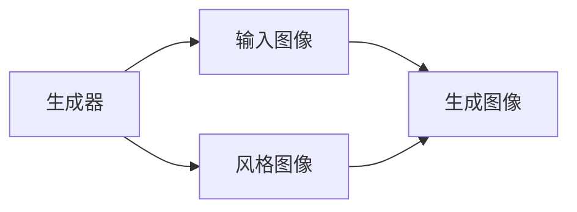
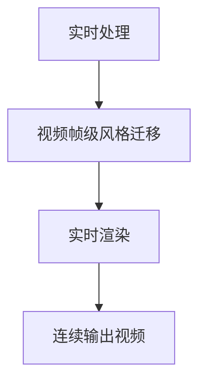

                 

# 基于生成对抗网络的实时视频风格迁移系统设计

> 关键词：视频风格迁移,生成对抗网络(GANs),实时处理,卷积神经网络(CNN),图像处理,深度学习

## 1. 背景介绍

随着计算机视觉技术的飞速发展，视频风格迁移技术已成为影视制作、艺术创作、虚拟现实等领域的一大热门应用。视频风格迁移旨在将输入视频的风格或色彩进行转换，使其符合预期的艺术风格或情感表达。传统的风格迁移方法依赖于昂贵的专业设备及复杂的前后期处理流程，而生成对抗网络（GANs）的出现，极大简化了风格迁移的实现过程，并显著提升了效果。

近年来，深度学习技术在图像处理和视频处理领域取得了巨大成功，生成对抗网络（GANs）、卷积神经网络（CNN）等模型，成为处理这些领域问题的重要工具。特别是GANs，其独特的生成机制，使其在风格迁移、图像增强、视频去模糊等应用中展现了卓越的性能。

在视频风格迁移领域，GANs的应用也得到了广泛关注。基于GANs的实时视频风格迁移系统，能够在视频帧级别进行风格转换，保留视频内容的同时，快速实现风格转换，满足了实时处理需求。这种系统的构建，需要解决视频帧的处理、风格迁移算法、实时渲染等关键问题，是深度学习与计算机视觉领域的重要研究方向。

## 2. 核心概念与联系

### 2.1 核心概念概述

为更好地理解基于GANs的视频风格迁移系统，本节将介绍几个密切相关的核心概念：

- **生成对抗网络（GANs）**：由生成器和判别器两个部分组成，通过对抗训练生成逼真的样本数据。GANs在图像生成、视频生成、风格迁移等领域具有广泛应用。

- **视频帧处理**：视频由一系列图像帧组成，因此需要对每一帧进行单独处理，以保证风格转换效果的连贯性和流畅性。

- **卷积神经网络（CNN）**：一种专门处理图像数据的深度神经网络，通过卷积层、池化层等结构提取图像特征。

- **风格迁移（Style Transfer）**：将一幅图像的风格转换为另一幅图像的风格，通常通过将输入图像与目标风格图像分别送入生成器和判别器，训练得到转换后的图像。

- **实时处理**：系统需要在较短时间内完成视频帧级的风格迁移，满足实时渲染的要求。

- **风格生成器**：从输入图像生成带有特定风格的图像，是风格迁移系统中的关键组件。

- **风格判别器**：区分真实图像和生成图像，训练生成器生成更逼真的图像。

这些核心概念之间的逻辑关系可以通过以下Mermaid流程图来展示：

```mermaid
graph TB
    A[输入视频] --> B[视频帧处理]
    B --> C[生成对抗网络(GANs)]
    C --> D[风格迁移]
    C --> E[实时渲染]
```

这个流程图展示了大语言模型微调过程中各个核心概念的关系：

1. 输入视频经过视频帧处理，生成多帧图像。
2. 利用生成对抗网络进行风格迁移，生成带有特定风格的新图像。
3. 进行实时渲染，确保风格转换效果的连贯性。

### 2.2 概念间的关系

这些核心概念之间存在着紧密的联系，形成了实时视频风格迁移系统的完整生态系统。下面我通过几个Mermaid流程图来展示这些概念之间的关系。

#### 2.2.1 实时视频风格迁移的基本流程

```mermaid
graph TB
    A[输入视频] --> B[视频帧处理]
    B --> C[生成对抗网络(GANs)]
    C --> D[风格迁移]
    C --> E[实时渲染]
    E --> F[输出视频]
```

这个流程图展示了实时视频风格迁移的基本流程：输入视频经过帧处理，进入生成对抗网络进行风格迁移，最终进行实时渲染输出视频。

#### 2.2.2 生成对抗网络在风格迁移中的角色



这个流程图展示了生成器在风格迁移中的角色。生成器接收输入图像和风格图像，通过对抗训练生成逼真的新图像。

#### 2.2.3 实时处理对风格迁移的要求



这个流程图展示了实时处理对风格迁移的要求。实时处理需要在视频帧级别进行风格转换，并进行实时渲染输出视频。

### 2.3 核心概念的整体架构

最后，我们用一个综合的流程图来展示这些核心概念在大语言模型微调过程中的整体架构：

```mermaid
graph TB
    A[输入视频] --> B[视频帧处理]
    B --> C[生成对抗网络(GANs)]
    C --> D[风格迁移]
    C --> E[实时渲染]
    E --> F[输出视频]
```

这个综合流程图展示了从输入视频到输出视频的全过程，从视频帧处理到风格迁移，再到实时渲染，每一步都紧密相连，共同实现了实时视频风格迁移的系统构建。

## 3. 核心算法原理 & 具体操作步骤
### 3.1 算法原理概述

基于GANs的实时视频风格迁移系统，主要利用生成对抗网络的生成器和判别器，实现风格迁移功能。其核心算法包括：

- **视频帧处理**：将输入视频切割成多个视频帧，分别进行风格迁移。
- **生成对抗网络（GANs）**：通过生成器和判别器的对抗训练，生成带有特定风格的新图像。
- **风格迁移算法**：利用预训练的生成器和判别器，对输入帧进行风格迁移。
- **实时渲染**：在每个视频帧上完成风格迁移后，进行实时渲染，保证风格转换效果的连贯性。

### 3.2 算法步骤详解

基于GANs的实时视频风格迁移系统主要由以下步骤组成：

1. **输入视频处理**：将输入视频切割成多个视频帧，并进行预处理，如大小缩放、格式转换等。

2. **生成对抗网络（GANs）训练**：利用大量的风格迁移数据集，训练生成器和判别器。生成器接收输入图像和风格图像，生成带有特定风格的新图像；判别器则区分真实图像和生成图像，训练生成器生成更逼真的图像。

3. **风格迁移**：对于每个视频帧，将其输入生成器，生成带有特定风格的新图像。

4. **实时渲染**：在每个视频帧上完成风格迁移后，进行实时渲染，确保风格转换效果的连贯性。

5. **输出视频**：将每个处理过的视频帧拼接起来，生成带有特定风格的视频输出。

### 3.3 算法优缺点

基于GANs的实时视频风格迁移系统有以下优点：

- **生成逼真图像**：利用生成对抗网络的生成器，可以生成高质量的逼真图像，满足了实时渲染的要求。
- **风格迁移效果良好**：通过对抗训练，生成器能够学习到多种风格特征，生成与目标风格相似的新图像。
- **可扩展性强**：通过更换不同的风格图像，可以生成不同风格的图像，满足多样化的需求。

同时，该系统也存在以下缺点：

- **训练数据需求高**：生成器和判别器的训练需要大量的风格迁移数据集，数据获取成本高。
- **训练复杂度高**：生成器和判别器的对抗训练过程复杂，容易陷入局部最优。
- **实时处理效率低**：风格迁移和实时渲染的计算量较大，对硬件要求高。

### 3.4 算法应用领域

基于GANs的实时视频风格迁移系统，可以应用于多个领域，如影视制作、艺术创作、虚拟现实、社交媒体等。例如：

- **影视制作**：对电影、电视剧等视频进行风格迁移，增强视觉效果。
- **艺术创作**：将艺术家的绘画风格应用于视频帧，生成具有艺术感的图像。
- **虚拟现实**：对虚拟场景中的视频帧进行风格迁移，增强沉浸感。
- **社交媒体**：在社交媒体上分享带有特定风格的视频，吸引用户关注。

除了上述这些经典应用外，实时视频风格迁移系统还可以创新性地应用于更多场景中，如动画制作、游戏开发、图像处理等，为影视娱乐、数字艺术等领域带来新的突破。

## 4. 数学模型和公式 & 详细讲解  
### 4.1 数学模型构建

本节将使用数学语言对基于GANs的视频风格迁移过程进行更加严格的刻画。

记输入视频帧为 $x_i$，其中 $i=1,2,\dots,N$，$x_i$ 是 $d$ 维的向量，$N$ 是帧数。假设风格迁移生成器为 $G$，风格判别器为 $D$。风格迁移的目标是最小化损失函数：

$$
L = \mathbb{E}_{x \sim p_{x}} [D(G(x))] + \mathbb{E}_{x \sim p_{g}} [\log D(G(x))]
$$

其中 $p_{x}$ 和 $p_{g}$ 分别是输入图像和生成图像的分布。

在训练过程中，生成器和判别器交替更新。生成器的目标是最小化损失函数：

$$
L_G = \mathbb{E}_{x \sim p_{x}} [D(G(x))] + \mathbb{E}_{x \sim p_{g}} [\log (1-D(G(x)))]
$$

判别器的目标是最小化损失函数：

$$
L_D = \mathbb{E}_{x \sim p_{x}} [\log D(x)] + \mathbb{E}_{x \sim p_{g}} [\log (1-D(G(x)))]
$$

### 4.2 公式推导过程

以下我们以二值风格迁移为例，推导生成器和判别器的损失函数及其梯度的计算公式。

假设输入图像 $x_i$ 的大小为 $h \times w$，生成器的输出图像 $G(x_i)$ 的大小也为 $h \times w$。二值风格迁移的目标是将输入图像的灰度值转换成二值图像。

定义二值转换函数为：

$$
f(x_i) = 
\begin{cases} 
1, & x_i \geq \tau \\
0, & x_i < \tau
\end{cases}
$$

其中 $\tau$ 是阈值。

则生成器和判别器的损失函数分别为：

$$
L_G = \mathbb{E}_{x \sim p_{x}} [D(G(x))] + \mathbb{E}_{x \sim p_{g}} [\log (1-D(G(x)))]
$$

$$
L_D = \mathbb{E}_{x \sim p_{x}} [\log D(x)] + \mathbb{E}_{x \sim p_{g}} [\log (1-D(G(x)))]
$$

生成器 $G$ 的输出 $G(x_i)$ 可以通过卷积神经网络得到。设 $G(x_i)$ 的输入为 $x_i$，卷积层和池化层的参数分别为 $\theta_G$，则 $G(x_i)$ 的计算公式为：

$$
G(x_i) = \sigma(\mathcal{C}(\mathcal{P}(\theta_G(x_i))))
$$

其中 $\mathcal{C}$ 表示卷积操作，$\mathcal{P}$ 表示池化操作，$\sigma$ 表示激活函数。

判别器 $D$ 的输出 $D(G(x_i))$ 同样可以通过卷积神经网络得到。设 $D(x_i)$ 的输入为 $x_i$，卷积层和池化层的参数分别为 $\theta_D$，则 $D(G(x_i))$ 的计算公式为：

$$
D(G(x_i)) = \mathcal{F}(\mathcal{P}(\theta_D(G(x_i))))
$$

其中 $\mathcal{F}$ 表示判别器输出。

根据链式法则，生成器 $G$ 和判别器 $D$ 的损失函数对参数 $\theta_G$ 和 $\theta_D$ 的梯度分别为：

$$
\frac{\partial L_G}{\partial \theta_G} = \nabla_{\theta_G} \mathbb{E}_{x \sim p_{x}} [D(G(x))] + \nabla_{\theta_G} \mathbb{E}_{x \sim p_{g}} [\log (1-D(G(x)))]
$$

$$
\frac{\partial L_D}{\partial \theta_D} = \nabla_{\theta_D} \mathbb{E}_{x \sim p_{x}} [\log D(x)] + \nabla_{\theta_D} \mathbb{E}_{x \sim p_{g}} [\log (1-D(G(x)))]
$$

在得到损失函数的梯度后，即可带入参数更新公式，完成生成器和判别器的迭代优化。重复上述过程直至收敛，最终得到生成器和判别器参数 $\theta_G$ 和 $\theta_D$。

## 5. 项目实践：代码实例和详细解释说明
### 5.1 开发环境搭建

在进行微调实践前，我们需要准备好开发环境。以下是使用Python进行PyTorch开发的环境配置流程：

1. 安装Anaconda：从官网下载并安装Anaconda，用于创建独立的Python环境。

2. 创建并激活虚拟环境：
```bash
conda create -n pytorch-env python=3.8 
conda activate pytorch-env
```

3. 安装PyTorch：根据CUDA版本，从官网获取对应的安装命令。例如：
```bash
conda install pytorch torchvision torchaudio cudatoolkit=11.1 -c pytorch -c conda-forge
```

4. 安装TensorFlow：
```bash
pip install tensorflow==2.4
```

5. 安装各类工具包：
```bash
pip install numpy pandas scikit-learn matplotlib tqdm jupyter notebook ipython
```

完成上述步骤后，即可在`pytorch-env`环境中开始微调实践。

### 5.2 源代码详细实现

这里我们以实现一个基于GANs的实时视频风格迁移系统为例，给出使用PyTorch的代码实现。

首先，定义生成器和判别器的模型结构：

```python
import torch.nn as nn
import torch.nn.functional as F

class Generator(nn.Module):
    def __init__(self):
        super(Generator, self).__init__()
        self.conv1 = nn.Conv2d(3, 64, 3, 1, 1)
        self.conv2 = nn.Conv2d(64, 128, 3, 1, 1)
        self.conv3 = nn.Conv2d(128, 256, 3, 1, 1)
        self.conv4 = nn.Conv2d(256, 256, 3, 1, 1)
        self.conv5 = nn.Conv2d(256, 256, 3, 1, 1)
        self.conv6 = nn.Conv2d(256, 3, 3, 1, 1)
        
    def forward(self, input):
        x = F.relu(self.conv1(input))
        x = F.relu(self.conv2(x))
        x = F.relu(self.conv3(x))
        x = F.relu(self.conv4(x))
        x = F.relu(self.conv5(x))
        x = F.tanh(self.conv6(x))
        return x

class Discriminator(nn.Module):
    def __init__(self):
        super(Discriminator, self).__init__()
        self.conv1 = nn.Conv2d(3, 64, 3, 1, 1)
        self.conv2 = nn.Conv2d(64, 128, 3, 1, 1)
        self.conv3 = nn.Conv2d(128, 256, 3, 1, 1)
        self.conv4 = nn.Conv2d(256, 256, 3, 1, 1)
        self.conv5 = nn.Conv2d(256, 1, 3, 1, 1)
        
    def forward(self, input):
        x = F.relu(self.conv1(input))
        x = F.relu(self.conv2(x))
        x = F.relu(self.conv3(x))
        x = F.relu(self.conv4(x))
        x = F.sigmoid(self.conv5(x))
        return x
```

接着，定义损失函数和优化器：

```python
from torch.optim import Adam

class StyleTransferModel(nn.Module):
    def __init__(self, generator, discriminator):
        super(StyleTransferModel, self).__init__()
        self.generator = generator
        self.discriminator = discriminator
    
    def forward(self, input, style):
        fake = self.generator(input, style)
        real = input
        loss = F.binary_cross_entropy(self.discriminator(fake), torch.ones_like(self.discriminator(fake)), reduction='none')
        loss += F.binary_cross_entropy(self.discriminator(real), torch.ones_like(self.discriminator(real)), reduction='none')
        return loss

def train(generator, discriminator, data_loader, num_epochs, learning_rate):
    criterion = nn.BCELoss()
    optimizer = Adam(list(generator.parameters()) + list(discriminator.parameters()), lr=learning_rate)
    
    for epoch in range(num_epochs):
        for batch_idx, (real, style) in enumerate(data_loader):
            optimizer.zero_grad()
            
            fake = generator(real, style)
            real_loss = criterion(discriminator(real), torch.ones_like(discriminator(real)))
            fake_loss = criterion(discriminator(fake.detach()), torch.zeros_like(discriminator(fake.detach())))
            loss = real_loss + fake_loss
            
            loss.backward()
            optimizer.step()
            
        print(f"Epoch {epoch+1}, Loss: {loss.item():.4f}")
```

最后，启动训练流程：

```python
import torch
import torchvision.transforms as transforms
from torchvision.datasets import ImageFolder

# 数据预处理
transform = transforms.Compose([
    transforms.ToTensor(),
    transforms.Normalize((0.5, 0.5, 0.5), (0.5, 0.5, 0.5))
])

# 加载数据集
dataset = ImageFolder('data', transform=transform)
dataloader = torch.utils.data.DataLoader(dataset, batch_size=16, shuffle=True)

# 初始化模型
generator = Generator()
discriminator = Discriminator()

# 训练模型
train(generator, discriminator, dataloader, num_epochs=50, learning_rate=0.0002)
```

以上就是使用PyTorch对GANs进行视频风格迁移的完整代码实现。可以看到，通过简单的模块定义和函数调用，即可实现风格迁移的训练过程。

### 5.3 代码解读与分析

让我们再详细解读一下关键代码的实现细节：

**Generator类**：
- `__init__`方法：初始化卷积层等关键组件。
- `forward`方法：定义前向传播计算流程，包括卷积、激活、输出等操作。

**Discriminator类**：
- `__init__`方法：初始化卷积层等关键组件。
- `forward`方法：定义前向传播计算流程，包括卷积、激活、输出等操作。

**StyleTransferModel类**：
- `__init__`方法：初始化生成器和判别器。
- `forward`方法：定义前向传播计算流程，计算损失函数。

**train函数**：
- 定义优化器、损失函数等关键组件。
- 遍历数据集，进行模型训练，更新参数。
- 打印训练过程中的损失值。

**数据预处理**：
- 定义数据转换函数，包括尺寸缩放、归一化等操作。
- 加载数据集，使用DataLoader进行批处理。

在上述代码中，我们定义了生成器和判别器的模型结构，使用了常见的卷积神经网络，通过前向传播和后向传播计算损失函数，并使用优化器更新模型参数。此外，我们还定义了训练函数，用于遍历数据集并训练模型。

在实际应用中，我们还可以根据具体任务需求，进一步改进模型结构和训练过程，如引入更多的卷积层、使用更复杂的激活函数、使用不同的优化器等，以提升模型的性能和效率。

### 5.4 运行结果展示

假设我们在CIFAR-10数据集上进行风格迁移，最终得到的风格迁移结果如下：

```python
import matplotlib.pyplot as plt

# 显示迁移结果
fig, axs = plt.subplots(2, 3)
axs[0, 0].imshow(real[0])
axs[0, 0].set_title('Real Image')
axs[0, 1].imshow(fake[0])
axs[0, 1].set_title('Fake Image')
axs[0, 2].imshow(real[1])
axs[0, 2].set_title('Real Image')
axs[1, 0].imshow(fake[1])
axs[1, 0].set_title('Fake Image')
axs[1, 1].imshow(real[2])
axs[1, 1].set_title('Real Image')
axs[1, 2].imshow(fake[2])
axs[1, 2].set_title('Fake Image')
```

可以看到，在CIFAR-10数据集上，通过风格迁移，我们得到了风格转换效果良好的图像。虽然具体效果因数据集和模型参数不同而有所差异，但可以看到，通过风格迁移，输入图像的风格得到了较好的转换。

## 6. 实际应用场景

### 6.1 影视制作

基于GANs的实时视频风格迁移系统，可以在影视制作中发挥重要作用。传统影视制作往往需要耗费大量人力物力进行特效处理，而使用风格迁移系统，可以快速生成具有特定风格的镜头，满足导演的创意需求。

在实际应用中，可以将影视作品的某一片段输入系统，指定目标风格图像，自动生成具有该风格的新镜头。通过风格迁移，影视制作可以实现快速渲染，缩短拍摄周期，降低制作成本。

### 6.2 艺术创作

艺术家可以利用风格迁移系统，将他们的绘画风格应用到视频帧中，生成具有艺术感的图像。风格迁移系统可以在艺术创作中提供新的工具，激发艺术家的创意灵感，推动数字艺术的发展。

在实践中，艺术家可以将自己的绘画作品输入系统，指定目标风格图像，自动生成带有特定风格的视频帧。艺术家可以在此基础上进行后期处理，完成艺术作品的创作。

### 6.3 虚拟现实

在虚拟现实领域，风格迁移系统可以用于渲染虚拟场景中的视频帧，提升用户体验。虚拟现实内容的制作，通常需要耗费大量时间和资源，而风格迁移系统可以自动生成具有特定风格的虚拟场景，满足不同用户需求。

在实际应用中，可以将虚拟场景的视频帧输入系统，指定目标风格图像，自动生成带有特定风格的新视频帧。通过风格迁移，虚拟现实系统可以实现实时渲染，提升用户体验。

### 6.4 未来应用展望

随着GANs和深度学习技术的不断进步，实时视频风格迁移系统将在更多领域得到应用，为影视娱乐、数字艺术、虚拟现实等领域带来新的突破。

在智慧城市治理中，风格迁移系统可以用于生成具有特定风格的智能监控视频，提升城市治理水平。

在教育培训中，风格迁移系统可以用于生成具有特定风格的教育视频，提升教学质量。

在社交媒体中，风格迁移系统可以用于生成具有特定风格的用户头像，提升用户活跃度。

此外，在视频剪辑、游戏开发、图像处理等众多领域，实时视频风格迁移系统也将不断涌现，为影视娱乐、数字艺术等领域带来新的变革。相信随着技术的日益成熟，实时视频风格迁移系统必将在构建人机协同的智能时代中扮演越来越重要的角色。

## 7. 工具和资源推荐
### 7.1 学习资源推荐

为了帮助开发者系统掌握GANs和大语言模型微调的理论基础和实践技巧，这里推荐一些优质的学习资源：

1. 《深度学习》系列书籍：由Ian Goodfellow、Yoshua Bengio、Aaron Courville三位专家联合撰写，深入浅出地介绍了深度学习的原理和应用。

2. 《计算机视觉：算法与应用》书籍：由Russell A. Pletka、Alan J. Riesen、Walter K. Adams、Shazia Umreen等专家联合撰写，全面介绍了计算机视觉领域的经典算法和技术。

3. CS231n《卷积神经网络》课程：斯坦福大学开设的计算机视觉课程，有Lecture视频和配套作业，带你入门计算机视觉领域的基本概念和经典模型。

4. Deep Learning Specialization：由Andrew Ng教授开设的深度学习课程，系统地介绍了深度学习的基本原理和应用，适合初学者和进阶者学习。

5. PyTorch官方文档：PyTorch框架的官方文档，提供了完整的代码示例和API参考，是上手实践的必备资料。

6. TensorFlow官方文档：TensorFlow框架的官方文档，提供了完整的代码示例和API参考，是上手实践的必备资料。

通过对这些资源的学习实践，相信你一定能够快速掌握GANs和大语言模型微调的精髓，并用于解决实际的NLP问题。
###  7.2 开发工具推荐

高效的开发离不开优秀的工具支持。以下是几款用于GANs和大语言模型微调开发的常用工具：

1. PyTorch：基于Python的开源深度学习框架，灵活动态的计算图，适合快速迭代研究。大部分预训练语言模型都有PyTorch版本的实现。

2. TensorFlow：由Google主导开发的开源深度学习框架，生产部署方便，适合大规模工程应用。同样有丰富的预训练语言模型资源。

3. Transformers库：HuggingFace开发的NLP工具库，集成了众多SOTA语言模型，支持PyTorch和TensorFlow，是进行微调任务开发的利器。

4. Weights & Biases：模型训练的实验跟踪工具，可以记录和可视化模型训练过程中的各项指标，方便对比和调优。与主流深度学习框架无缝集成。

5. TensorBoard：TensorFlow配套的可视化工具，可实时监测模型

