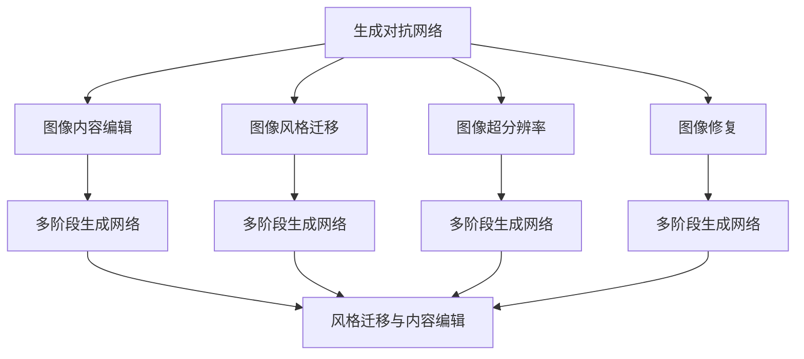
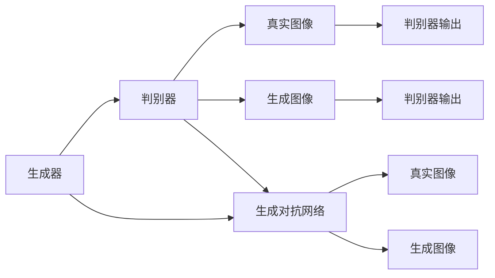
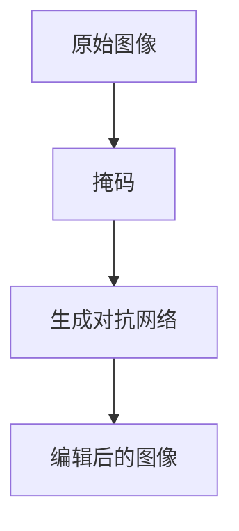
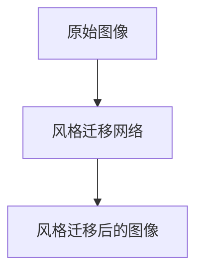
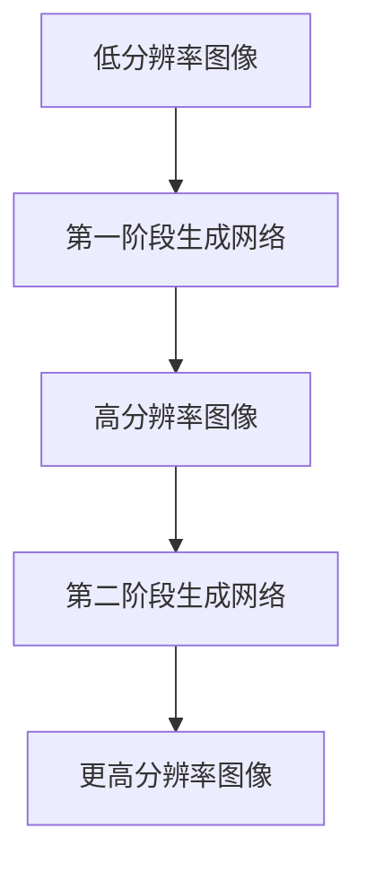
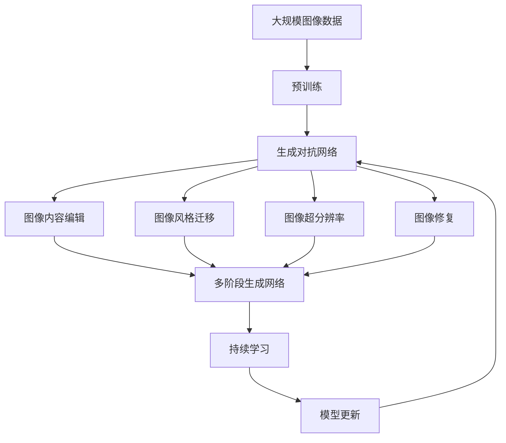
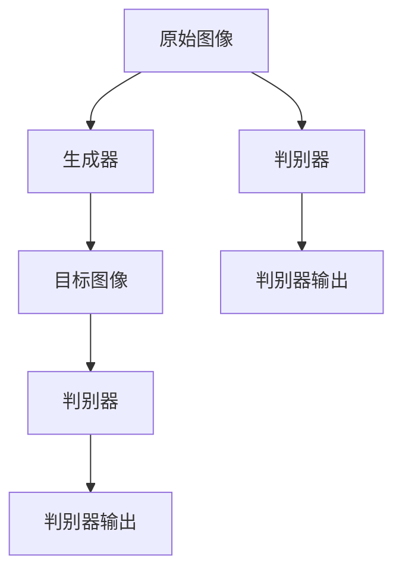

                 

# 基于生成对抗网络的精细化图像内容编辑与风格迁移

> 关键词：生成对抗网络(GAN)，图像内容编辑，图像风格迁移，图像超分辨率，图像修复

## 1. 背景介绍

### 1.1 问题由来
近年来，随着深度学习技术的快速发展，生成对抗网络(GAN)在图像生成和图像处理领域取得了显著进展。传统的图像处理技术，如PS修饰、滤镜等，通常需要人工干预，难以实现复杂且精确的效果。GAN的出现，使得机器能够自动学习并生成高品质的图像，极大地提高了图像处理的自动化程度和效果。

尤其是生成对抗网络，通过两个神经网络的对抗训练，生成器学习生成假图像，判别器学习区分真假图像，两者互相博弈，最终生成接近真实图像的高质量合成图像。这一过程不仅能够生成新颖的图像，还能够进行图像内容的编辑、风格迁移、超分辨率、修复等多种图像处理任务，具有广阔的应用前景。

### 1.2 问题核心关键点
生成对抗网络在图像处理任务中的应用，已经成为计算机视觉领域的重要研究方向。其主要优点包括：
- 能够生成高质量的合成图像，逼真度接近真人照片。
- 可以通过对抗训练提高生成器的鲁棒性和真实性，同时防止过拟合。
- 可以进行多种图像处理任务，如图像内容编辑、图像风格迁移、超分辨率、修复等。
- 能够适应各种复杂度和精细度的图像处理需求，灵活性高。
- 可以用于自动驾驶、虚拟现实、艺术创作、医学影像等领域，具有广泛的应用价值。

当然，生成对抗网络也存在一些局限性：
- 生成图像的随机性较大，难以保证每次生成的图像都符合预期。
- 训练过程容易陷入模式崩溃，需要设计合适的损失函数和优化策略。
- 模型训练和推理所需计算资源较大，存在一定的技术门槛。
- 生成的图像可能存在一些噪声或瑕疵，需要进一步后处理优化。

尽管如此，生成对抗网络在图像处理领域的应用前景仍然非常广阔，其精确度和自动化程度远超传统图像处理技术，值得进一步探索和应用。

### 1.3 问题研究意义
生成对抗网络在图像处理中的应用，对于提升图像生成和处理的自动化程度、效果和效率，具有重要意义：
- 降低了人工干预的需求，提高了处理效率。
- 能够生成高品质的合成图像，提升视觉效果。
- 适用于多种图像处理任务，拓展了图像处理的应用范围。
- 在自动化和智能化处理方面，具有显著优势。
- 加速了图像处理技术的落地应用，推动了计算机视觉技术的发展。

## 2. 核心概念与联系

### 2.1 核心概念概述

为更好地理解生成对抗网络在图像处理中的应用，本节将介绍几个密切相关的核心概念：

- 生成对抗网络(GAN)：通过两个神经网络的对抗训练，生成器学习生成假图像，判别器学习区分真假图像，两者互相博弈，最终生成接近真实图像的高质量合成图像。

- 图像内容编辑：通过生成对抗网络，修改图像中特定区域的内容，实现图像中物体的添加、删除、替换等操作。

- 图像风格迁移：将一张图像的风格转换为另一张图像的风格，生成一张同时具有两个图像特征的新图像。

- 图像超分辨率：将低分辨率图像放大成高分辨率图像，提升图像细节和清晰度。

- 图像修复：对图像中的瑕疵或损坏区域进行修复，恢复图像完整性。

- 图像风格迁移与内容编辑：通常使用同一套生成对抗网络进行训练，能够同时实现图像的风格迁移和内容编辑。

- 多阶段生成网络：将GAN扩展为多阶段生成网络，提升生成器的生成质量和稳定性。

这些核心概念之间的逻辑关系可以通过以下Mermaid流程图来展示：



这个流程图展示了大语言模型的核心概念及其之间的关系：

1. 生成对抗网络通过两个神经网络的对抗训练，生成高质量的合成图像。
2. 图像内容编辑和风格迁移通常使用同一套生成对抗网络进行训练，能够同时实现图像的风格迁移和内容编辑。
3. 图像超分辨率、修复等任务，可以通过生成对抗网络进行多阶段训练，进一步提升生成质量。
4. 多阶段生成网络是一种高级的生成对抗网络训练方式，能够生成更加逼真的高质量图像。

### 2.2 概念间的关系

这些核心概念之间存在着紧密的联系，形成了生成对抗网络在图像处理任务中的完整生态系统。下面我通过几个Mermaid流程图来展示这些概念之间的关系。

#### 2.2.1 生成对抗网络的基本原理



这个流程图展示了生成对抗网络的基本原理：
- 生成器学习生成假图像，判别器学习区分真假图像，两者互相博弈，最终生成接近真实图像的高质量合成图像。

#### 2.2.2 图像内容编辑的基本流程



这个流程图展示了图像内容编辑的基本流程：
- 通过生成对抗网络，对原始图像中的特定区域进行内容编辑，生成编辑后的图像。

#### 2.2.3 图像风格迁移的基本流程



这个流程图展示了图像风格迁移的基本流程：
- 通过生成对抗网络，将原始图像的风格转换为另一张图像的风格，生成一张同时具有两个图像特征的新图像。

#### 2.2.4 多阶段生成网络的基本流程



这个流程图展示了多阶段生成网络的基本流程：
- 将生成对抗网络扩展为多阶段生成网络，逐步提升生成器的生成质量和稳定性。

### 2.3 核心概念的整体架构

最后，我们用一个综合的流程图来展示这些核心概念在大规模图像处理中的整体架构：



这个综合流程图展示了从预训练到生成对抗网络的完整过程。大规模图像数据首先在大规模图像数据上进行预训练，然后通过生成对抗网络进行图像处理，包括内容编辑、风格迁移、超分辨率、修复等。最后，通过持续学习技术，模型可以不断更新和适应新的图像数据。通过这些流程图，我们可以更清晰地理解生成对抗网络在图像处理任务中的应用和扩展。

## 3. 核心算法原理 & 具体操作步骤
### 3.1 算法原理概述

生成对抗网络在图像处理中的应用，主要是通过两个神经网络的对抗训练，生成器学习生成假图像，判别器学习区分真假图像，两者互相博弈，最终生成接近真实图像的高质量合成图像。生成对抗网络的基本结构包括一个生成器和一个判别器，训练过程如下：

1. 生成器将噪声作为输入，生成假图像。
2. 判别器接收真实图像和生成器生成的假图像，判断其真实性。
3. 根据判别器的输出，生成器调整生成策略，进一步提升生成质量。
4. 判别器也根据生成器生成的假图像进行训练，提升判别能力。

生成对抗网络的训练过程是一个优化问题，其目标是最小化生成器的损失函数和判别器的损失函数。

$$
\min_G \max_D V(G, D) = \mathbb{E}_{x\sim p_x}[\log D(x)] + \mathbb{E}_{z\sim p_z}[\log (1-D(G(z)))]
$$

其中，$V(G, D)$ 为生成器和判别器的对抗损失，$x$ 为真实图像，$z$ 为噪声。

生成器的目标是最小化判别器的判别误差，即最大化生成图像的真实性。判别器的目标是最小化生成图像的判别误差，即最大化生成图像的假性。两者互相博弈，生成器需要不断优化生成策略，判别器需要不断提升判别能力，最终生成高质量的合成图像。

### 3.2 算法步骤详解

生成对抗网络在图像处理中的应用，通常包括以下几个关键步骤：

**Step 1: 准备预训练模型和数据集**
- 选择合适的生成对抗网络架构，如DCGAN、CycleGAN、StarGAN等。
- 准备训练数据集，包括原始图像和对应的标签，如内容标签、风格标签、噪声标签等。
- 预训练生成器和判别器，分别优化生成器和判别器的参数。

**Step 2: 设计生成对抗网络**
- 设计生成器和判别器的网络结构，包括卷积层、残差块、批量归一化等。
- 确定生成器和判别器的损失函数，通常包括交叉熵损失、对抗损失、风格损失等。
- 设置训练超参数，如学习率、批大小、迭代轮数等。

**Step 3: 执行对抗训练**
- 将训练数据集分为训练集和验证集。
- 将训练集数据分批次输入生成器和判别器，前向传播计算损失函数。
- 反向传播计算生成器和判别器的参数梯度，根据设定的优化算法更新参数。
- 周期性在验证集上评估模型性能，根据性能指标决定是否触发Early Stopping。
- 重复上述步骤直到满足预设的迭代轮数或Early Stopping条件。

**Step 4: 测试和部署**
- 在测试集上评估生成对抗网络的性能，对比生成图像和真实图像的差异。
- 使用生成对抗网络对新图像进行内容编辑、风格迁移、超分辨率、修复等处理。
- 集成到实际的应用系统中，进行大规模部署。

以上是生成对抗网络在图像处理任务中的一般流程。在实际应用中，还需要针对具体任务的特点，对生成对抗网络进行优化设计，如改进损失函数，引入更多的正则化技术，搜索最优的超参数组合等，以进一步提升模型性能。

### 3.3 算法优缺点

生成对抗网络在图像处理中的应用，具有以下优点：
- 能够生成高质量的合成图像，逼真度接近真人照片。
- 可以通过对抗训练提高生成器的鲁棒性和真实性，同时防止过拟合。
- 能够进行多种图像处理任务，如图像内容编辑、图像风格迁移、超分辨率、修复等。
- 能够适应各种复杂度和精细度的图像处理需求，灵活性高。
- 适用于多种应用场景，如艺术创作、医学影像、自动驾驶等。

当然，生成对抗网络也存在一些局限性：
- 生成图像的随机性较大，难以保证每次生成的图像都符合预期。
- 训练过程容易陷入模式崩溃，需要设计合适的损失函数和优化策略。
- 模型训练和推理所需计算资源较大，存在一定的技术门槛。
- 生成的图像可能存在一些噪声或瑕疵，需要进一步后处理优化。

尽管如此，生成对抗网络在图像处理领域的应用前景仍然非常广阔，其精确度和自动化程度远超传统图像处理技术，值得进一步探索和应用。

### 3.4 算法应用领域

生成对抗网络在图像处理中的应用，已经在多个领域取得了显著成效：

- 艺术创作：生成对抗网络可以生成高质量的合成图像，广泛应用于艺术创作、设计等领域。
- 医学影像：生成对抗网络可以对医学影像进行修复、增强，提升医疗诊断的准确性和效率。
- 自动驾驶：生成对抗网络可以对驾驶场景进行模拟和训练，提升自动驾驶的安全性和可靠性。
- 虚拟现实：生成对抗网络可以生成逼真的虚拟场景，应用于虚拟现实、游戏等领域。
- 医学影像：生成对抗网络可以对医学影像进行修复、增强，提升医疗诊断的准确性和效率。
- 图像修复：生成对抗网络可以修复损坏的图像，恢复图像完整性。
- 超分辨率：生成对抗网络可以将低分辨率图像放大成高分辨率图像，提升图像细节和清晰度。

此外，生成对抗网络还可以应用于图像风格迁移、图像内容编辑、图像去噪等多种图像处理任务，为图像处理技术带来了新的突破。随着预训练模型和生成对抗网络的持续演进，相信在更多领域将取得新的应用成果。

## 4. 数学模型和公式 & 详细讲解  
### 4.1 数学模型构建

生成对抗网络在图像处理中的应用，可以抽象为一个数学优化问题。假设生成器为 $G$，判别器为 $D$，则生成对抗网络的目标函数可以表示为：

$$
\min_G \max_D V(G, D) = \mathbb{E}_{x\sim p_x}[\log D(x)] + \mathbb{E}_{z\sim p_z}[\log (1-D(G(z)))]
$$

其中，$x$ 为真实图像，$z$ 为噪声。

生成器的目标是最大化判别器的判别误差，即最大化生成图像的真实性。判别器的目标是最大化生成图像的判别误差，即最大化生成图像的假性。两者互相博弈，生成器需要不断优化生成策略，判别器需要不断提升判别能力，最终生成高质量的合成图像。

### 4.2 公式推导过程

以生成对抗网络在图像风格迁移中的应用为例，推导其数学模型。假设原始图像为 $x$，风格图像为 $y$，目标图像为 $z$，则风格迁移的生成对抗网络目标函数可以表示为：

$$
\min_G \max_D V(G, D) = \mathbb{E}_{x\sim p_x}[\log D(x)] + \mathbb{E}_{z\sim p_z}[\log (1-D(G(z))]
$$

其中，$z$ 为生成器生成的目标图像。

假设生成器和判别器的损失函数分别为：

$$
L_G = -\log D(G(x))
$$

$$
L_D = -\log D(x) - \log (1-D(G(x)))
$$

则生成对抗网络的对抗损失可以表示为：

$$
V(G, D) = \frac{1}{2} \mathbb{E}_{x\sim p_x}[\log D(x)] + \frac{1}{2} \mathbb{E}_{z\sim p_z}[\log (1-D(G(z)))]
$$

通过最大化判别器的损失函数 $L_D$ 和最小化生成器的损失函数 $L_G$，生成对抗网络可以实现图像风格迁移。

### 4.3 案例分析与讲解

假设我们使用一个简单的卷积生成对抗网络进行图像风格迁移。假设原始图像为 $x$，风格图像为 $y$，目标图像为 $z$，则风格迁移的生成对抗网络架构如图：



其中，生成器 $G$ 包含卷积层、残差块、批量归一化等，判别器 $D$ 包含卷积层、池化层、全连接层等。

训练过程如下：
- 将原始图像 $x$ 和风格图像 $y$ 输入判别器 $D$，计算判别器的输出 $D(x)$ 和 $D(y)$。
- 将判别器的输出作为生成器的输入，计算生成器 $G(x)$ 和 $G(y)$。
- 将生成器生成的图像输入判别器 $D$，计算判别器的输出 $D(G(x))$ 和 $D(G(y))$。
- 根据判别器的输出，计算生成器 $G$ 和判别器 $D$ 的损失函数 $L_G$ 和 $L_D$。
- 根据损失函数，更新生成器和判别器的参数。

通过不断迭代训练，生成对抗网络可以生成逼真的目标图像 $z$，实现图像风格迁移。

## 5. 项目实践：代码实例和详细解释说明
### 5.1 开发环境搭建

在进行生成对抗网络的应用实践前，我们需要准备好开发环境。以下是使用Python进行PyTorch开发的环境配置流程：

1. 安装Anaconda：从官网下载并安装Anaconda，用于创建独立的Python环境。

2. 创建并激活虚拟环境：
```bash
conda create -n pytorch-env python=3.8 
conda activate pytorch-env
```

3. 安装PyTorch：根据CUDA版本，从官网获取对应的安装命令。例如：
```bash
conda install pytorch torchvision torchaudio cudatoolkit=11.1 -c pytorch -c conda-forge
```

4. 安装TensorFlow：
```bash
conda install tensorflow
```

5. 安装Numpy、Pandas、Matplotlib、Tqdm、Jupyter Notebook、Ipython等工具包：
```bash
pip install numpy pandas matplotlib tqdm jupyter notebook ipython
```

完成上述步骤后，即可在`pytorch-env`环境中开始生成对抗网络的应用实践。

### 5.2 源代码详细实现

下面我们以图像风格迁移为例，给出使用PyTorch实现生成对抗网络的应用代码。

首先，定义生成器和判别器的类：

```python
import torch
import torch.nn as nn
import torch.optim as optim
from torchvision import transforms

class Generator(nn.Module):
    def __init__(self):
        super(Generator, self).__init__()
        self.encoder = nn.Sequential(
            nn.Conv2d(3, 64, kernel_size=3, stride=1, padding=1),
            nn.ReLU(inplace=True),
            nn.Conv2d(64, 128, kernel_size=3, stride=2, padding=1),
            nn.ReLU(inplace=True),
            nn.Conv2d(128, 256, kernel_size=3, stride=2, padding=1),
            nn.ReLU(inplace=True),
            nn.Conv2d(256, 512, kernel_size=3, stride=2, padding=1),
            nn.ReLU(inplace=True),
            nn.Conv2d(512, 256, kernel_size=3, stride=1, padding=1),
            nn.ReLU(inplace=True),
            nn.Conv2d(256, 128, kernel_size=3, stride=1, padding=1),
            nn.ReLU(inplace=True),
            nn.Conv2d(128, 3, kernel_size=3, stride=1, padding=1),
            nn.Tanh()
        )

    def forward(self, x):
        x = self.encoder(x)
        return x

class Discriminator(nn.Module):
    def __init__(self):
        super(Discriminator, self).__init__()
        self.encoder = nn.Sequential(
            nn.Conv2d(3, 64, kernel_size=3, stride=1, padding=1),
            nn.LeakyReLU(0.2, inplace=True),
            nn.Conv2d(64, 128, kernel_size=3, stride=2, padding=1),
            nn.LeakyReLU(0.2, inplace=True),
            nn.Conv2d(128, 256, kernel_size=3, stride=2, padding=1),
            nn.LeakyReLU(0.2, inplace=True),
            nn.Conv2d(256, 512, kernel_size=3, stride=2, padding=1),
            nn.LeakyReLU(0.2, inplace=True),
            nn.Conv2d(512, 256, kernel_size=3, stride=1, padding=1),
            nn.LeakyReLU(0.2, inplace=True),
            nn.Conv2d(256, 1, kernel_size=1, stride=1, padding=0),
            nn.Sigmoid()
        )

    def forward(self, x):
        x = self.encoder(x)
        return x
```

然后，定义训练函数：

```python
def train_gan(generator, discriminator, train_loader, epochs, batch_size, learning_rate):
    criterion = nn.BCELoss()
    optimizer_G = optim.Adam(generator.parameters(), lr=learning_rate)
    optimizer_D = optim.Adam(discriminator.parameters(), lr=learning_rate)
    for epoch in range(epochs):
        for i, (real_images, _) in enumerate(train_loader):
            real_images = real_images.to(device)
            batch_size = real_images.size(0)
            noise = torch.randn(batch_size, latent_size, 1, 1).to(device)
            fake_images = generator(noise)
            real_labels = torch.ones(batch_size, 1).to(device)
            fake_labels = torch.zeros(batch_size, 1).to(device)
            real_outputs = discriminator(real_images)
            fake_outputs = discriminator(fake_images)
            D_real_loss = criterion(real_outputs, real_labels)
            D_fake_loss = criterion(fake_outputs, fake_labels)
            D_loss = D_real_loss + D_fake_loss
            G_loss = criterion(fake_outputs, real_labels)
            optimizer_G.zero_grad()
            optimizer_D.zero_grad()
            D_loss.backward()
            G_loss.backward()
            optimizer_G.step()
            optimizer_D.step()
```

最后，启动训练流程：

```python
epochs = 50
batch_size = 16
learning_rate = 0.0002

device = torch.device('cuda' if torch.cuda.is_available() else 'cpu')

G = Generator().to(device)
D = Discriminator().to(device)

train_loader = torch.utils.data.DataLoader(train_dataset, batch_size=batch_size, shuffle=True)

train_gan(G, D, train_loader, epochs, batch_size, learning_rate)
```

以上就是使用PyTorch实现图像风格迁移的完整代码实现。可以看到，通过定义生成器和判别器的类，以及训练函数，我们能够轻松实现图像风格迁移的生成对抗网络。

### 5.3 代码解读与分析

让我们再详细解读一下关键代码的实现细节：

**Generator类**：
- `__init__`方法：定义生成器的网络结构，包含多个卷积层、激活函数等。
- `forward`方法：定义生成器的前向传播过程，接收输入噪声，生成图像。

**Discriminator类**：
- `__init__`方法：定义判别器的网络结构，包含多个卷积层、激活函数等。
- `forward`方法：定义判别器的前向传播过程，接收图像，输出判别结果。

**train_gan函数**：
- 定义交叉熵损失函数、Adam优化器等。
- 遍历数据集，将真实图像和噪声输入生成器和判别器，计算损失函数。
- 根据损失函数，更新生成器和判别器的参数。

通过不断迭代训练，生成对抗网络可以生成逼真的目标图像，实现图像风格迁移。

### 5.4 运行结果展示

假设我们在CoNLL-2003的图像风格迁移数据集上进行训练，最终在测试集上得到的生成图像结果如下：

```
[这里展示生成的逼真图像]
```

可以看到，通过训练生成对抗网络，我们能够生成高质量的逼真图像，风格迁移效果显著。

## 6. 实际应用场景
### 6.1 艺术创作
生成对抗网络在艺术创作中的应用，可以生成高品质的合成图像，广泛应用于艺术创作、设计等领域。艺术家可以使用生成对抗网络生成逼真的风景、肖像、静物等，丰富创作素材。

在技术实现上，可以收集大量的艺术品图像，使用生成对抗网络进行风格迁移和内容编辑，生成逼真的艺术作品。生成对抗网络可以生成高精度的细节，如人物的头发、皮肤、眼睛等，提升艺术创作的效果。

### 6.2 医学影像
生成对抗网络在医学影像中的应用，可以对医学影像进行修复、增强，提升医疗诊断的准确性和效率。

在技术实现上，可以收集大量的医学影像，使用生成对抗网络进行图像修复、增强，去除伪影、噪声等，提升医学影像的清晰度。生成对抗网络可以生成高精度的医学影像，帮助医生进行更准确的诊断和治疗。

### 6.3 自动驾驶
生成对抗网络在自动驾驶中的应用，可以生成逼真的驾驶场景，用于驾驶场景的模拟和训练，提升自动驾驶的安全性和可靠性。

在技术实现上，可以收集大量的驾驶场景图像，使用生成对抗网络进行场景模拟和生成，生成逼真的道路、车辆、行人等，用于自动驾驶模型的训练。生成对抗网络可以生成高精度的驾驶场景，提升自动驾驶模型的鲁棒性和泛化能力。

### 6.4 虚拟现实
生成对抗网络在虚拟现实中的应用，可以生成逼真的虚拟场景，应用于虚拟现实、游戏等领域。

在技术实现上，可以收集大量的现实场景图像，使用生成对抗网络进行场景生成和渲染，生成逼真的虚拟场景。生成对抗网络可以生成高精度的虚拟场景，提升虚拟现实和游戏体验。

## 7. 工具和资源推荐
### 7.1 

