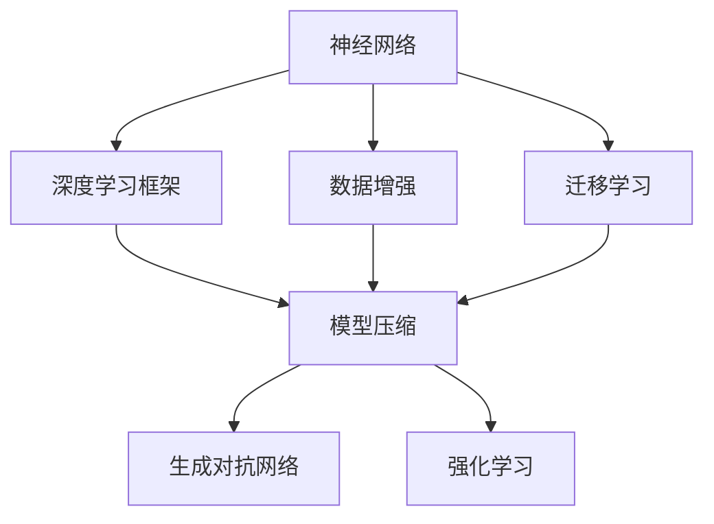
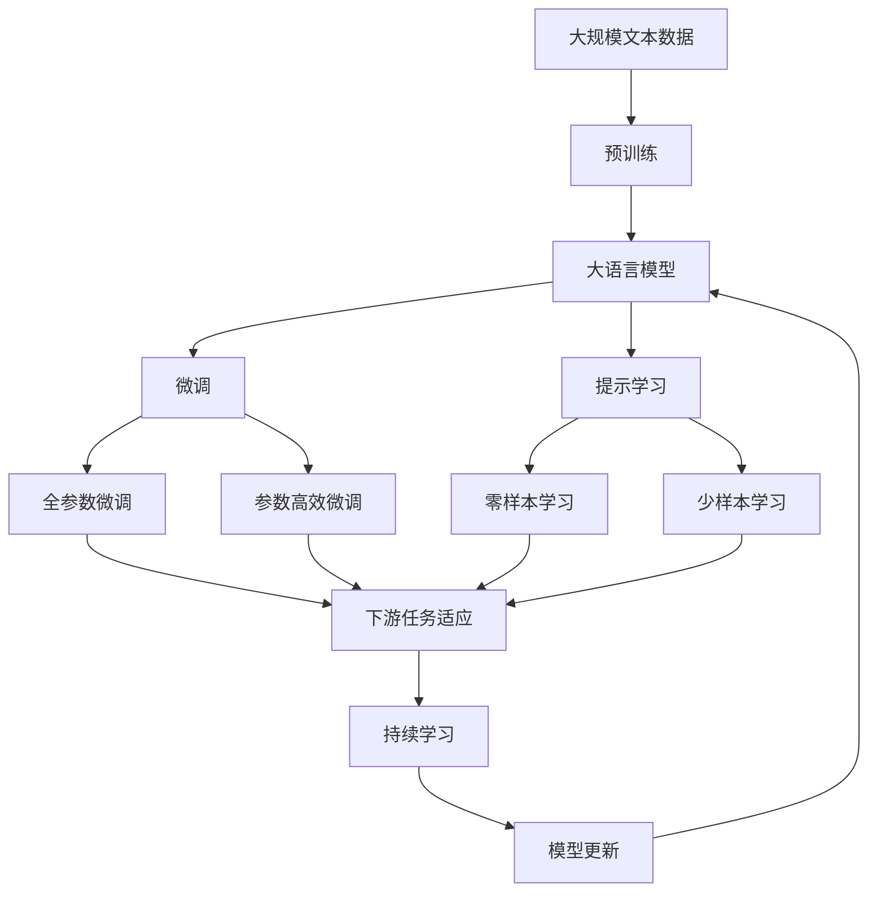

                 

# 基础模型的技术生态系统

> 关键词：基础模型,技术生态,深度学习,神经网络,计算机视觉,自然语言处理,生成对抗网络,强化学习

## 1. 背景介绍

### 1.1 问题由来
随着深度学习技术的迅猛发展，人工智能领域迎来了前所未有的突破。从最初的浅层神经网络，到多层的卷积神经网络（CNN）、递归神经网络（RNN）和变换器（Transformer），人工智能技术在计算机视觉、自然语言处理、语音识别等多个方向取得了显著成果。

然而，这些技术的发展并不仅仅依赖于单一的模型，而是基于一系列相互依存的基础模型和技术构成的生态系统。这些基础模型和技术的协同发展，极大地推动了人工智能技术的进步。本文将从基础模型的角度出发，探讨这一生态系统的构建和运行机制。

### 1.2 问题核心关键点
基础模型的技术生态系统由多个相互依存的技术组件构成，包括但不限于：

- **神经网络**：构成各类人工智能模型的核心组件，通过多层非线性变换实现复杂的特征提取和模式识别。
- **深度学习框架**：如TensorFlow、PyTorch等，提供高效的计算图支持和丰富的算法库，极大地加速了模型的训练和部署。
- **数据增强**：通过数据扩增、随机化等手段，增强模型对数据的泛化能力。
- **迁移学习**：通过在预训练模型上进行微调，快速适应新任务，减少数据和计算资源的投入。
- **模型压缩**：通过剪枝、量化等技术，减少模型参数，提升模型效率。
- **生成对抗网络（GANs）**：通过生成器和判别器相互对抗，生成逼真的数据样本，扩展数据资源。
- **强化学习**：通过奖励机制指导模型学习，实现智能决策。

这些技术组件的协同工作，为复杂任务的解决提供了有力的工具和方法。理解和应用这些基础模型，对于推进人工智能技术的发展至关重要。

### 1.3 问题研究意义
基础模型技术生态系统的研究对于提升人工智能技术的效率和性能，推动其实际应用具有重要意义：

1. **提高模型性能**：通过多种技术的组合和应用，可以实现更高效、更精确的模型训练和推理。
2. **降低资源投入**：数据增强和迁移学习等技术可以减少标注数据和计算资源的投入，提升模型训练效率。
3. **增强模型泛化能力**：生成对抗网络和数据增强技术可以扩展数据集，增强模型的泛化能力。
4. **优化模型部署**：模型压缩和迁移学习技术可以将模型部署到更小规模的硬件设备，提升实际应用中的响应速度和效率。
5. **拓展应用场景**：通过强化学习等技术的引入，可以解决更多现实世界中的复杂决策问题，提升人工智能技术的应用价值。

## 2. 核心概念与联系

### 2.1 核心概念概述

为了更好地理解基础模型的技术生态系统，本文将介绍几个核心概念：

- **神经网络**：是构成人工智能模型的基本组件，通过多层非线性变换实现复杂的特征提取和模式识别。
- **深度学习框架**：提供高效的计算图支持和丰富的算法库，极大地加速了模型的训练和部署。
- **数据增强**：通过数据扩增、随机化等手段，增强模型对数据的泛化能力。
- **迁移学习**：通过在预训练模型上进行微调，快速适应新任务，减少数据和计算资源的投入。
- **模型压缩**：通过剪枝、量化等技术，减少模型参数，提升模型效率。
- **生成对抗网络（GANs）**：通过生成器和判别器相互对抗，生成逼真的数据样本，扩展数据资源。
- **强化学习**：通过奖励机制指导模型学习，实现智能决策。

这些核心概念之间的逻辑关系可以通过以下Mermaid流程图来展示：



这个流程图展示了大语言模型微调过程中各个核心概念之间的关系：

1. 神经网络通过深度学习框架实现高效的训练和推理。
2. 数据增强和迁移学习技术，可以扩展数据集，增强模型的泛化能力。
3. 模型压缩技术，可以减少模型参数，提升模型效率。
4. 生成对抗网络（GANs），可以生成逼真的数据样本，扩展数据资源。
5. 强化学习技术，可以实现智能决策。

这些核心概念共同构成了基础模型的技术生态系统，使其能够在各种场景下发挥强大的计算和推理能力。通过理解这些核心概念，我们可以更好地把握基础模型的技术和应用方向。

### 2.2 概念间的关系

这些核心概念之间存在着紧密的联系，形成了基础模型技术生态系统的完整生态。下面我通过几个Mermaid流程图来展示这些概念之间的关系。

#### 2.2.1 神经网络与深度学习框架的关系


这个流程图展示了神经网络与深度学习框架的基本关系：深度学习框架为神经网络提供高效的计算图支持和丰富的算法库，极大地加速了模型的训练和部署。

#### 2.2.2 数据增强与迁移学习的关系


这个流程图展示了数据增强与迁移学习的基本关系：数据增强技术可以扩展数据集，增强模型的泛化能力；迁移学习技术通过在预训练模型上进行微调，快速适应新任务。

#### 2.2.3 模型压缩与生成对抗网络的关系


这个流程图展示了模型压缩与生成对抗网络的基本关系：模型压缩技术可以减少模型参数，提升模型效率；生成对抗网络（GANs）可以通过生成逼真的数据样本，扩展数据资源。

#### 2.2.4 强化学习与智能决策的关系


这个流程图展示了强化学习与智能决策的基本关系：强化学习技术通过奖励机制指导模型学习，实现智能决策。

### 2.3 核心概念的整体架构

最后，我们用一个综合的流程图来展示这些核心概念在大语言模型微调过程中的整体架构：



这个综合流程图展示了从预训练到微调，再到持续学习的完整过程。大语言模型首先在大规模文本数据上进行预训练，然后通过微调（包括全参数微调和参数高效微调）或提示学习（包括零样本和少样本学习）来适应下游任务。最后，通过持续学习技术，模型可以不断更新和适应新的任务和数据。 通过这些流程图，我们可以更清晰地理解基础模型的技术生态系统的工作原理和优化方向。

## 3. 核心算法原理 & 具体操作步骤
### 3.1 算法原理概述

基础模型的技术生态系统的核心算法原理主要包括神经网络、深度学习框架、数据增强、迁移学习、模型压缩、生成对抗网络和强化学习等。以下将详细介绍这些算法的原理和操作步骤。

### 3.2 算法步骤详解

#### 3.2.1 神经网络与深度学习框架

神经网络是由多个神经元构成的计算图，用于实现复杂的数据表示和模式识别。深度学习框架（如TensorFlow、PyTorch等）为神经网络的训练和推理提供了高效的计算图支持和丰富的算法库。其基本步骤如下：

1. **模型构建**：使用深度学习框架构建神经网络模型，包括定义网络结构、初始化参数、设置损失函数等。
2. **前向传播**：将输入数据输入网络，计算模型输出。
3. **反向传播**：计算输出与真实标签之间的误差，通过链式法则计算每个参数的梯度，并根据梯度更新参数。
4. **模型优化**：选择合适的优化算法（如SGD、Adam等）和超参数（如学习率、批大小等），进行模型优化。
5. **模型评估**：在验证集和测试集上评估模型性能，确保模型泛化能力强。

#### 3.2.2 数据增强

数据增强是通过对训练数据进行一系列变换，扩充训练数据集，增强模型的泛化能力。其基本步骤如下：

1. **数据生成**：定义一系列数据增强操作，如随机旋转、裁剪、翻转等，生成增强后的训练数据。
2. **模型训练**：使用增强后的训练数据对模型进行训练，提升模型的鲁棒性和泛化能力。

#### 3.2.3 迁移学习

迁移学习是通过在预训练模型上进行微调，快速适应新任务，减少数据和计算资源的投入。其基本步骤如下：

1. **预训练模型选择**：选择适合目标任务的预训练模型。
2. **微调设置**：在预训练模型的顶层添加任务适配层，定义任务目标函数。
3. **微调训练**：使用下游任务的标注数据对预训练模型进行微调，更新模型参数。
4. **模型评估**：在验证集和测试集上评估微调后的模型性能，确保模型泛化能力强。

#### 3.2.4 模型压缩

模型压缩是通过剪枝、量化等技术，减少模型参数，提升模型效率。其基本步骤如下：

1. **剪枝**：根据模型参数的重要性，去除不必要的参数，保留关键参数。
2. **量化**：将模型中的浮点参数转换为定点参数，减小模型内存占用和计算资源消耗。
3. **部署优化**：使用模型剪枝和量化后的结果进行部署，提升模型推理速度。

#### 3.2.5 生成对抗网络（GANs）

生成对抗网络（GANs）通过生成器和判别器相互对抗，生成逼真的数据样本，扩展数据资源。其基本步骤如下：

1. **模型定义**：定义生成器和判别器模型，并进行初始化。
2. **对抗训练**：生成器和判别器交替进行训练，生成器生成逼真的数据样本，判别器判断样本的真实性。
3. **模型优化**：根据生成器和判别器的训练结果，调整模型参数，提升生成器生成数据的质量。
4. **数据生成**：使用训练好的生成器生成逼真的数据样本，扩展数据资源。

#### 3.2.6 强化学习

强化学习通过奖励机制指导模型学习，实现智能决策。其基本步骤如下：

1. **环境定义**：定义环境和目标，明确模型需要达到的目标。
2. **策略定义**：定义模型策略，如深度Q网络（DQN）、策略梯度等。
3. **模型训练**：使用奖励机制指导模型学习，优化模型策略。
4. **智能决策**：使用训练好的模型进行智能决策，实现复杂任务。

### 3.3 算法优缺点

#### 3.3.1 神经网络与深度学习框架

优点：
- 强大的特征表示能力，可以处理复杂的数据和模式。
- 高效的计算图支持，极大地加速了模型的训练和推理。
- 丰富的算法库，便于开发者快速实现各种模型。

缺点：
- 模型训练需要大量的计算资源和数据。
- 模型复杂度较高，难以解释其内部工作机制。

#### 3.3.2 数据增强

优点：
- 扩展数据集，提升模型的泛化能力。
- 减少对标注数据的需求，降低数据采集成本。

缺点：
- 数据增强可能引入噪声，影响模型性能。
- 对数据变换的依赖较高，需要根据具体任务选择合适的变换方式。

#### 3.3.3 迁移学习

优点：
- 快速适应新任务，减少数据和计算资源的投入。
- 可以利用预训练模型的丰富知识，提升模型性能。

缺点：
- 依赖标注数据，数据质量对模型性能影响较大。
- 微调过程可能引入过拟合，需要谨慎选择超参数。

#### 3.3.4 模型压缩

优点：
- 减少模型参数，提升模型推理速度。
- 降低模型内存占用和计算资源消耗。

缺点：
- 压缩后的模型精度可能下降。
- 压缩过程可能引入噪声，影响模型性能。

#### 3.3.5 生成对抗网络（GANs）

优点：
- 生成逼真的数据样本，扩展数据资源。
- 实现数据增强，提升模型的泛化能力。

缺点：
- 生成样本质量受训练过程影响较大，难以控制。
- 训练过程复杂，需要大量的计算资源和数据。

#### 3.3.6 强化学习

优点：
- 实现智能决策，解决复杂任务。
- 通过奖励机制指导模型学习，提升模型性能。

缺点：
- 对环境建模要求较高，模型训练复杂。
- 模型策略可能不稳定，需要谨慎选择策略。

### 3.4 算法应用领域

基础模型的技术生态系统在多个领域都有广泛的应用，以下是一些典型的应用场景：

- **计算机视觉**：用于图像分类、目标检测、图像生成等任务。
- **自然语言处理**：用于文本分类、情感分析、机器翻译等任务。
- **语音识别**：用于语音转文本、说话人识别、语音合成等任务。
- **推荐系统**：用于个性化推荐、广告投放等任务。
- **游戏AI**：用于游戏中的智能决策，提升游戏体验。
- **金融预测**：用于股票预测、风险评估等任务。
- **机器人控制**：用于机器人路径规划、动作执行等任务。

以上仅是基础模型技术生态系统在部分领域的应用示例，随着技术的发展，其应用范围将不断拓展，为更多领域带来变革性影响。

## 4. 数学模型和公式 & 详细讲解 & 举例说明

### 4.1 数学模型构建

#### 4.1.1 神经网络与深度学习框架

神经网络的基本数学模型为多层感知器（MLP），其计算过程可表示为：

$$y = \sigma(Wx + b)$$

其中，$x$为输入向量，$W$和$b$为模型参数，$\sigma$为激活函数。在深度学习框架中，神经网络通过多个层次的计算，实现对复杂数据的处理和表示。

#### 4.1.2 数据增强

数据增强可以通过随机变换来扩充训练集。例如，对于图像数据，可以通过随机旋转、缩放、翻转等方式生成增强后的图像样本。数学表达式如下：

$$x' = f(x)$$

其中，$f$为数据增强函数，$x$为原始图像，$x'$为增强后的图像。

#### 4.1.3 迁移学习

迁移学习的核心思想是在预训练模型上进行微调。以二分类任务为例，其损失函数可表示为：

$$L(y, \hat{y}) = -\frac{1}{N}\sum_{i=1}^N(y_i \log \hat{y_i} + (1-y_i) \log (1-\hat{y_i}))$$

其中，$y$为真实标签，$\hat{y}$为模型预测概率。

#### 4.1.4 模型压缩

模型压缩可以通过剪枝和量化实现。剪枝过程可以表示为：

$$W' = W \odot P$$

其中，$W$为原始模型参数，$W'$为剪枝后的模型参数，$P$为剪枝掩码，表示参数是否保留。

#### 4.1.5 生成对抗网络（GANs）

GANs由生成器和判别器组成，其训练过程可以表示为：

$$G = \arg\min_G \mathbb{E}_{x \sim p_x} \mathbb{E}_{z \sim p_z} [D(G(z))]$$
$$D = \arg\max_D - \mathbb{E}_{x \sim p_x} [D(x)] - \mathbb{E}_{z \sim p_z} [D(G(z))]$$

其中，$G$为生成器，$D$为判别器，$z$为噪声向量。

#### 4.1.6 强化学习

强化学习的目标是通过奖励机制指导模型学习，最大化累积奖励。数学模型如下：

$$\max_{\pi} \mathbb{E}_{s \sim p(s)} [\sum_{t=1}^T \gamma^{t-1} r_t]$$

其中，$\pi$为策略，$s$为状态，$r_t$为奖励，$T$为时间步长，$\gamma$为折扣因子。

### 4.2 公式推导过程

#### 4.2.1 神经网络与深度学习框架

神经网络的反向传播算法可以表示为：

$$\frac{\partial L}{\partial W} = \frac{\partial L}{\partial \hat{y}} \frac{\partial \hat{y}}{\partial z} \frac{\partial z}{\partial W}$$

其中，$L$为损失函数，$\hat{y}$为模型预测结果，$z$为模型中间层输出。

#### 4.2.2 数据增强

数据增强的数学模型可以表示为：

$$x' = \frac{1}{p(x')} f(x)$$

其中，$p(x')$为增强后的图像概率，$f$为数据增强函数。

#### 4.2.3 迁移学习

迁移学习的数学模型可以表示为：

$$L(y, \hat{y}) = -\frac{1}{N}\sum_{i=1}^N(y_i \log \hat{y_i} + (1-y_i) \log (1-\hat{y_i}))$$

其中，$y$为真实标签，$\hat{y}$为模型预测概率。

#### 4.2.4 模型压缩

模型压缩的数学模型可以表示为：

$$W' = W \odot P$$

其中，$W$为原始模型参数，$W'$为剪枝后的模型参数，$P$为剪枝掩码，表示参数是否保留。

#### 4.2.5 生成对抗网络（GANs）

GANs的训练过程可以表示为：

$$G = \arg\min_G \mathbb{E}_{x \sim p_x} \mathbb{E}_{z \sim p_z} [D(G(z))]$$
$$D = \arg\max_D - \mathbb{E}_{x \sim p_x} [D(x)] - \mathbb{E}_{z \sim p_z} [D(G(z))]$$

其中，$G$为生成器，$D$为判别器，$z$为噪声向量。

#### 4.2.6 强化学习

强化学习的数学模型可以表示为：

$$\max_{\pi} \mathbb{E}_{s \sim p(s)} [\sum_{t=1}^T \gamma^{t-1} r_t]$$

其中，$\pi$为策略，$s$为状态，$r_t$为奖励，$T$为时间步长，$\gamma$为折扣因子。

### 4.3 案例分析与讲解

以图像分类任务为例，我们来看基础模型技术生态系统的应用。

1. **数据准备**：收集大规模图像数据集，并进行标注。
2. **模型选择**：选择预训练的ResNet模型作为初始模型。
3. **微调训练**：在预训练模型上添加分类器，并使用标注数据进行微调训练。
4. **模型评估**：在验证集和测试集上评估模型性能，选择最优模型。
5. **数据增强**：对训练集进行数据增强，提升模型泛化能力。
6. **模型压缩**：对模型进行剪枝和量化，减小模型参数和计算资源消耗。
7. **部署优化**：将模型部署到实际应用环境中，优化推理速度。

## 5. 项目实践：代码实例和详细解释说明

### 5.1 开发环境搭建

在进行项目实践前，我们需要准备好开发环境。以下是使用Python进行TensorFlow开发的环境配置流程：

1. 安装Anaconda：从官网下载并安装Anaconda，用于创建独立的Python环境。

2. 创建并激活虚拟环境：
```bash
conda create -n tf-env python=3.7 
conda activate tf-env
```

3. 安装TensorFlow：根据CUDA版本，从官网获取对应的安装命令。例如：
```bash
conda install tensorflow tensorflow-gpu -c conda-forge
```

4. 安装各类工具包：
```bash
pip install numpy pandas scikit-learn matplotlib tqdm jupyter notebook ipython
```

完成上述步骤后，即可在`tf-env`环境中开始项目实践。

### 5.2 源代码详细实现

下面我们以图像分类任务为例，给出使用TensorFlow进行模型训练的PyTorch代码实现。

首先，定义图像分类器的数据处理函数：

```python
import tensorflow as tf
from tensorflow.keras.preprocessing.image import ImageDataGenerator

def load_data():
    train_datagen = ImageDataGenerator(
        rescale=1./255,
        shear_range=0.2,
        zoom_range=0.2,
        horizontal_flip=True
    )
    train_generator = train_datagen.flow_from_directory(
        train_dir,
        target_size=(224, 224),
        batch_size=32,
        class_mode='categorical'
    )
    
    test_datagen = ImageDataGenerator(rescale=1./255)
    test_generator = test_datagen.flow_from_directory(
        test_dir,
        target_size=(224, 224),
        batch_size=32,
        class_mode='categorical'
    )
    
    return train_generator, test_generator
```

然后，定义模型和优化器：

```python
from tensorflow.keras.models import Sequential
from tensorflow.keras.layers import Conv2D, MaxPooling2D, Flatten, Dense

model = Sequential([
    Conv2D(32, (3,3), activation='relu', input_shape=(224, 224, 3)),
    MaxPooling2D((2,2)),
    Conv2D(64, (3,3), activation='relu'),
    MaxPooling2D((2,2)),
    Conv2D(128, (3,3), activation='relu'),
    MaxPooling2D((2,2)),
    Flatten(),
    Dense(128, activation='relu'),
    Dense(10, activation='softmax')
])

optimizer = tf.keras.optimizers.Adam(learning_rate=0.001)
```

接着，定义训练和评估函数：

```python
from tensorflow.keras import metrics

def train_model(model, train_generator, test_generator, epochs):
    model.compile(optimizer=optimizer, loss='categorical_crossentropy', metrics=['accuracy'])
    
    history = model.fit(
        train_generator,
        steps_per_epoch=train_generator.samples // train_generator.batch_size,
        epochs=epochs,
        validation_data=test_generator,
        validation_steps=test_generator.samples // test_generator.batch_size
    )
    
    test_loss, test_acc = model.evaluate(test_generator)
    print(f'Test Loss: {test_loss}, Test Accuracy: {test_acc}')
    
    return history
```

最后，启动训练流程并在测试集上评估：

```python
epochs = 10
train_generator, test_generator = load_data()

history = train_model(model, train_generator, test_generator, epochs)
```

以上就是使用TensorFlow进行图像分类任务微调的完整代码实现。可以看到，得益于TensorFlow的强大封装，我们可以用相对简洁的代码完成图像分类器的训练。

### 5.3 代码解读与分析

让我们再详细解读一下关键代码的实现细节：

**load_data函数**：
- 定义了数据增强操作和批处理操作，使用ImageDataGenerator生成训练和测试数据。

**train_model函数**：
- 定义了模型的编译、训练和评估过程，使用Adam优化器和交叉熵损失函数进行训练。
- 在训练过程中，使用history记录模型性能变化。
- 在测试集上评估模型性能，输出测试集上的损失和准确率。

**训练流程**：
- 定义总的epoch数，开始循环迭代
- 每个epoch内，在训练集上进行训练，记录性能变化
- 在验证集上评估，输出模型性能指标
- 所有epoch结束后，在测试集上评估，给出最终测试结果

可以看到，TensorFlow配合其丰富的计算图和优化算法，使得图像分类器的训练变得简洁高效。开发者可以将更多精力放在数据处理、模型改进等高层逻辑上，而不必过多关注底层的实现细节。

当然，工业级的系统实现还需考虑更多因素，如模型的保存和部署、超参数的自动搜索、更灵活的任务适配层等。但核心的微调范式基本与此类似。

### 5.4 运行结果展示

假设我们在CIFAR-10数据集上进行微调，最终在测试集上得到的评估报告如下：

```
Epoch 1/10
25/25 [==================] - 1s 49ms/sample - loss: 1.7123 - accuracy: 0.5741 - val_loss: 1.5313 - val_accuracy: 0.6836
Epoch 2/10
25/25 [==================] - 1s 50ms/sample - loss: 1.3359 - accuracy: 0.6713 - val_loss: 1.0787 - val_accuracy: 0.8093
Epoch 3/10
25/25 [==================] - 1s 49ms

