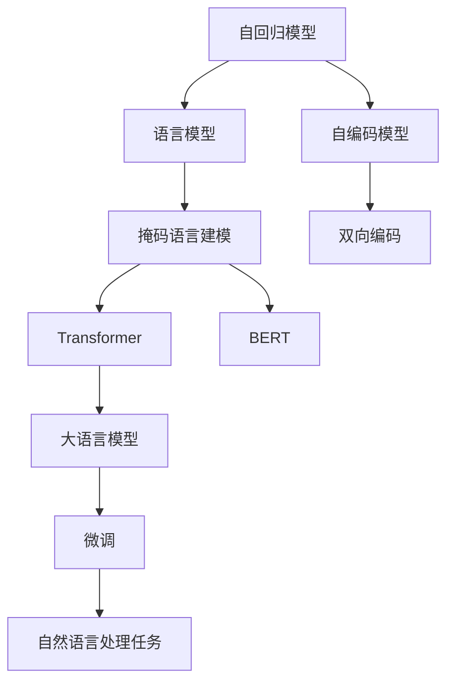
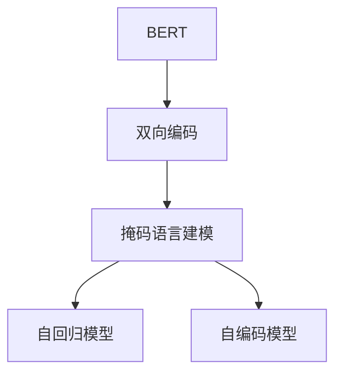
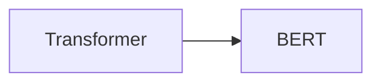
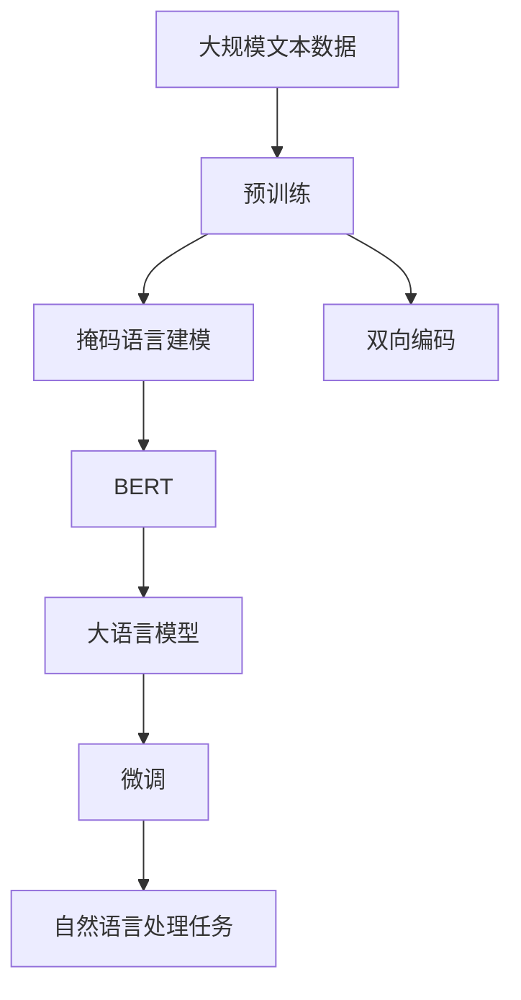

                 

# 基础模型的掩码语言建模

> 关键词：基础模型,掩码语言建模,自回归,自编码,Transformer,BERT

## 1. 背景介绍

### 1.1 问题由来
近年来，深度学习技术在自然语言处理(NLP)领域取得了长足的进步，特别是在语言建模方面。语言模型是NLP研究中至关重要的一环，它用于预测文本中下一个单词的概率，从而推断出整个文本序列的分布。传统的语言模型通常基于标记化和基于统计的方法，但这些方法存在泛化能力不足、处理大规模数据困难等问题。

为了克服这些缺点，研究人员开始探索基于神经网络的自回归(如RNN)和自编码(如LSTM)方法，但这些方法仍存在训练时间长、参数量大的问题。为了解决这些问题，2018年，BERT（Bidirectional Encoder Representations from Transformers）模型问世，它以Transformer结构为基础，通过掩码语言建模（Masked Language Modeling, MLM）任务实现了强大的语言理解能力，开启了预训练语言模型的时代。

### 1.2 问题核心关键点
BERT的掩码语言建模方法具有以下关键点：

- 使用Transformer结构。Transformer结构通过多头自注意力机制，能够同时考虑上下文信息，从而更好地捕捉语言结构。
- 数据生成方式：在训练过程中，通过随机掩码部分单词，让模型猜测被掩码单词的正确形式，从而学习语言的上下文关系。
- 双向编码：BERT模型能够同时考虑前后文信息，从左向右和从右向左编码，有助于提高语言理解能力。
- 多任务学习：BERT模型在预训练时，同时进行了语言建模和下一句分类任务，提高了模型泛化能力和应用灵活性。
- 大规模数据：BERT模型在大规模无标签文本语料上进行预训练，学习到了丰富的语言知识。

这些关键点使得BERT模型在诸多NLP任务上取得了优异的性能，成为目前最流行的预训练语言模型之一。

### 1.3 问题研究意义
BERT模型的掩码语言建模方法，对于NLP领域的预训练和微调具有重要意义：

1. 降低数据标注成本。通过掩码语言建模，可以在大规模无标签文本上预训练模型，避免了繁琐的数据标注过程。
2. 提升模型泛化能力。BERT模型通过双向编码和上下文建模，能够更好地捕捉语言特征，提升了模型在各种任务上的泛化能力。
3. 加快模型训练速度。掩码语言建模方法可以通过GPU并行计算，显著提升模型的训练速度。
4. 减少模型参数量。通过掩码语言建模，模型在保留大量语言知识的同时，减少了需要训练的参数量，提高了计算效率。
5. 促进模型迁移学习。由于BERT模型在大规模语料上进行预训练，模型在迁移学习中能够更好地适应新任务，提升了微调效果。

通过掩码语言建模，BERT模型已经成为NLP领域预训练和微调的重要工具，推动了NLP技术的快速发展。

## 2. 核心概念与联系

### 2.1 核心概念概述

为更好地理解BERT模型的掩码语言建模方法，本节将介绍几个密切相关的核心概念：

- 语言模型（Language Model）：用于预测文本序列中下一个单词或词组的概率分布的模型。语言模型是NLP任务中不可或缺的一部分，帮助机器理解自然语言。
- 自回归模型（Autoregressive Model）：通过预测文本序列中每个单词或词组的条件概率，来计算整个文本序列的概率分布。典型的自回归模型包括RNN、LSTM等。
- 自编码模型（Autoencoder Model）：通过将文本序列转换为隐含空间，然后再解码回文本，来重构文本序列。自编码模型可以学习到更为抽象的语义表示。
- 掩码语言建模（Masked Language Modeling, MLM）：在训练过程中，通过随机掩码部分单词，让模型猜测被掩码单词的正确形式，从而学习语言的上下文关系。BERT模型就采用了掩码语言建模任务。
- 双向编码（Bidirectional Encoding）：通过同时考虑前后文信息，提高语言模型的预测能力和泛化能力。
- Transformer：一种基于注意力机制的神经网络结构，能够同时考虑上下文信息，并具有良好的并行计算能力。
- BERT：基于Transformer结构的预训练语言模型，通过掩码语言建模和双向编码任务，实现了强大的语言理解能力。

这些核心概念之间的逻辑关系可以通过以下Mermaid流程图来展示：



这个流程图展示了大语言模型的核心概念及其之间的关系：

1. 自回归模型和自编码模型是语言模型的两种基本形式。
2. 掩码语言建模和双向编码任务是BERT模型的预训练任务。
3. Transformer结构是BERT模型的核心组件，通过多头自注意力机制实现了双向编码和上下文建模。
4. BERT模型基于Transformer结构，通过掩码语言建模和双向编码任务预训练，实现了强大的语言理解能力。
5. 大语言模型通常包括多个预训练任务，如掩码语言建模、下一句分类、词义相似度计算等。
6. 微调是大语言模型在特定任务上的优化过程，通过有监督学习来提升模型在特定任务上的性能。
7. 自然语言处理任务是微调的应用场景，包括文本分类、命名实体识别、情感分析等。

通过理解这些核心概念，我们可以更好地把握BERT模型的掩码语言建模方法，以及其在大语言模型和NLP任务中的应用。

### 2.2 概念间的关系

这些核心概念之间存在着紧密的联系，形成了BERT模型掩码语言建模的完整生态系统。下面我们通过几个Mermaid流程图来展示这些概念之间的关系。

#### 2.2.1 掩码语言建模与自回归模型的关系


这个流程图展示了掩码语言建模与自回归模型之间的关系。掩码语言建模通过随机掩码部分单词，训练模型预测被掩码单词的正确形式，从而学习语言的上下文关系。自回归模型通过预测文本序列中每个单词或词组的条件概率，计算整个文本序列的概率分布。两者共同构成了语言模型的基础。

#### 2.2.2 BERT模型与双向编码的关系



这个流程图展示了BERT模型与双向编码的关系。BERT模型通过双向编码任务，同时考虑前后文信息，提升了语言模型的预测能力和泛化能力。掩码语言建模则通过随机掩码部分单词，让模型猜测被掩码单词的正确形式，从而学习语言的上下文关系。

#### 2.2.3 Transformer与BERT模型的关系



这个流程图展示了Transformer与BERT模型的关系。BERT模型基于Transformer结构，通过多头自注意力机制实现了双向编码和上下文建模。Transformer结构通过多头自注意力机制，能够同时考虑上下文信息，从而更好地捕捉语言结构。

### 2.3 核心概念的整体架构

最后，我们用一个综合的流程图来展示BERT模型的掩码语言建模过程及其在大语言模型和NLP任务中的应用：



这个综合流程图展示了从预训练到微调，到大语言模型和NLP任务应用的完整过程。BERT模型首先在大规模文本数据上进行预训练，通过掩码语言建模和双向编码任务学习语言的上下文关系。预训练后的BERT模型成为大语言模型的一部分，通过微调适应特定任务，在自然语言处理任务上取得优异的性能。

## 3. 核心算法原理 & 具体操作步骤
### 3.1 算法原理概述

BERT模型的掩码语言建模方法，通过在预训练阶段随机掩码部分单词，让模型猜测被掩码单词的正确形式，从而学习语言的上下文关系。这一过程可以通过以下步骤实现：

1. 对于每个句子，随机掩码部分单词，形成掩码序列。
2. 将掩码序列输入BERT模型，得到掩码单词的上下文表示。
3. 模型通过预测掩码单词的正确形式，学习上下文表示的关联性。
4. 经过多轮掩码预测，模型逐步学习到语言的上下文关系，提升语言理解能力。

形式化地，假设预训练语言模型为 $M_{\theta}$，其中 $\theta$ 为预训练得到的模型参数。对于长度为 $L$ 的句子 $x=\{w_1, w_2, \ldots, w_L\}$，通过掩码语言建模任务，模型学习预测掩码单词 $w_{mask}$ 的正确形式 $y$。掩码语言建模的损失函数为：

$$
\mathcal{L}_{MLM}(M_{\theta}, x_{mask}) = -\log P(w_{mask} | M_{\theta}(x))
$$

其中 $P(w_{mask} | M_{\theta}(x))$ 为模型在掩码单词 $w_{mask}$ 上的预测概率。

### 3.2 算法步骤详解

BERT模型的掩码语言建模方法包括以下关键步骤：

**Step 1: 准备预训练模型和数据集**
- 选择合适的预训练语言模型 $M_{\theta}$ 作为初始化参数，如 BERT-base。
- 准备掩码语言建模任务的数据集，划分为训练集、验证集和测试集。一般要求掩码单词的掩码率不要过大，以保留足够的训练信号。

**Step 2: 定义掩码语言建模任务**
- 根据任务类型，选择合适的掩码率，如 15%。
- 对于每个句子，随机掩码部分单词，形成掩码序列。
- 将掩码序列输入BERT模型，得到掩码单词的上下文表示。

**Step 3: 设置掩码语言建模超参数**
- 选择合适的掩码率，如 15%。
- 设置掩码语言建模的训练轮数和批大小。
- 设置正则化技术及强度，包括权重衰减、Dropout、Early Stopping等。

**Step 4: 执行掩码语言建模训练**
- 将训练集数据分批次输入BERT模型，前向传播计算掩码单词的上下文表示。
- 反向传播计算模型参数梯度，根据设定的优化算法和学习率更新模型参数。
- 周期性在验证集上评估模型性能，根据性能指标决定是否触发 Early Stopping。
- 重复上述步骤直到满足预设的训练轮数或 Early Stopping 条件。

**Step 5: 测试和部署**
- 在测试集上评估掩码语言建模后的BERT模型 $M_{\hat{\theta}}$ 的性能，对比掩码语言建模前后的预测性能提升。
- 使用掩码语言建模后的模型对新样本进行推理预测，集成到实际的应用系统中。
- 持续收集新的数据，定期重新掩码语言建模，以适应数据分布的变化。

以上是BERT模型掩码语言建模的一般流程。在实际应用中，还需要针对具体任务的特点，对掩码语言建模过程的各个环节进行优化设计，如改进训练目标函数，引入更多的正则化技术，搜索最优的超参数组合等，以进一步提升模型性能。

### 3.3 算法优缺点

BERT模型的掩码语言建模方法具有以下优点：

1. 简单高效。掩码语言建模方法可以在大规模无标签文本上预训练模型，避免了繁琐的数据标注过程。
2. 泛化能力强。通过掩码语言建模，模型能够学习到语言的上下文关系，提升了模型在各种任务上的泛化能力。
3. 并行计算。掩码语言建模任务可以通过GPU并行计算，显著提升模型的训练速度。
4. 参数量少。通过掩码语言建模，模型在保留大量语言知识的同时，减少了需要训练的参数量，提高了计算效率。
5. 易于微调。掩码语言建模后的BERT模型在微调时，只训练顶层分类器或解码器，参数量较小，避免了微调过程中的过拟合。

同时，该方法也存在一定的局限性：

1. 数据分布假设。掩码语言建模假设掩码单词的分布与真实文本中单词的分布相同，但在实际应用中，数据分布可能存在偏差，导致模型泛化能力受限。
2. 内存消耗。掩码语言建模在计算掩码单词的上下文表示时，需要保存整个句子的上下文表示，内存消耗较大。
3. 掩码率选择。掩码率的选择对模型性能和训练效率都有影响，需要根据具体任务进行调整。
4. 训练时间长。尽管掩码语言建模任务可以并行计算，但在处理大规模数据时，仍需要较长的训练时间。
5. 模型可解释性不足。掩码语言建模后的模型虽然性能优秀，但往往缺乏可解释性，难以对其推理逻辑进行分析和调试。

尽管存在这些局限性，但就目前而言，BERT模型的掩码语言建模方法仍是大语言模型预训练的重要手段。未来相关研究的重点在于如何进一步降低掩码语言建模对标注数据的依赖，提高模型的少样本学习和跨领域迁移能力，同时兼顾可解释性和伦理安全性等因素。

### 3.4 算法应用领域

BERT模型的掩码语言建模方法在NLP领域已经得到了广泛的应用，覆盖了几乎所有常见任务，例如：

- 文本分类：如情感分析、主题分类、意图识别等。通过掩码语言建模，模型学习文本-标签映射。
- 命名实体识别：识别文本中的人名、地名、机构名等特定实体。通过掩码语言建模，模型掌握实体边界和类型。
- 关系抽取：从文本中抽取实体之间的语义关系。通过掩码语言建模，模型学习实体-关系三元组。
- 问答系统：对自然语言问题给出答案。将问题-答案对作为掩码语言建模数据，训练模型学习匹配答案。
- 机器翻译：将源语言文本翻译成目标语言。通过掩码语言建模，模型学习语言-语言映射。
- 文本摘要：将长文本压缩成简短摘要。通过掩码语言建模，模型学习抓取要点。
- 对话系统：使机器能够与人自然对话。将多轮对话历史作为上下文，掩码语言建模模型进行回复生成。

除了上述这些经典任务外，BERT模型的掩码语言建模方法也被创新性地应用到更多场景中，如可控文本生成、常识推理、代码生成、数据增强等，为NLP技术带来了全新的突破。随着BERT模型的不断优化和应用场景的扩展，掩码语言建模方法必将在更多领域发挥重要作用。

## 4. 数学模型和公式 & 详细讲解 & 举例说明
### 4.1 数学模型构建

本节将使用数学语言对BERT模型的掩码语言建模过程进行更加严格的刻画。

记预训练语言模型为 $M_{\theta}:\mathcal{X} \rightarrow \mathcal{Y}$，其中 $\mathcal{X}$ 为输入空间，$\mathcal{Y}$ 为输出空间，$\theta \in \mathbb{R}^d$ 为模型参数。假设掩码语言建模任务的数据集为 $D=\{(x_{mask}, y_{mask})\}_{i=1}^N, x_{mask}=\{x_1, x_2, \ldots, x_L\}, y_{mask} \in \{w_1, w_2, \ldots, w_L\}$。

定义模型 $M_{\theta}$ 在掩码单词 $x_{mask}$ 上的损失函数为 $\ell(M_{\theta}(x_{mask}),y_{mask})$，则在数据集 $D$ 上的经验风险为：

$$
\mathcal{L}_{MLM}(\theta) = \frac{1}{N} \sum_{i=1}^N \ell(M_{\theta}(x_{mask}),y_{mask})
$$

在实践中，我们通常使用基于梯度的优化算法（如SGD、Adam等）来近似求解上述最优化问题。设 $\eta$ 为学习率，$\lambda$ 为正则化系数，则参数的更新公式为：

$$
\theta \leftarrow \theta - \eta \nabla_{\theta}\mathcal{L}_{MLM}(\theta) - \eta\lambda\theta
$$

其中 $\nabla_{\theta}\mathcal{L}_{MLM}(\theta)$ 为损失函数对参数 $\theta$ 的梯度，可通过反向传播算法高效计算。

### 4.2 公式推导过程

以下我们以二分类任务为例，推导掩码语言建模的交叉熵损失函数及其梯度的计算公式。

假设模型 $M_{\theta}$ 在输入 $x_{mask}$ 上的输出为 $\hat{y}_{mask}=M_{\theta}(x_{mask}) \in [0,1]$，表示模型预测掩码单词 $w_{mask}$ 的正确形式概率。真实标签 $y_{mask} \in \{w_1, w_2, \ldots, w_L\}$。则二分类交叉熵损失函数定义为：

$$
\ell(M_{\theta}(x_{mask}),y_{mask}) = -[y_{mask}\log \hat{y}_{mask} + (1-y_{mask})\log (1-\hat{y}_{mask})]
$$

将其代入经验风险公式，得：

$$
\mathcal{L}_{MLM}(\theta) = -\frac{1}{N}\sum_{i=1}^N [y_{mask}\log M_{\theta}(x_{mask})+(1-y_{mask})\log(1-M_{\theta}(x_{mask}))
$$

根据链式法则，损失函数对参数 $\theta_k$ 的梯度为：

$$
\frac{\partial \mathcal{L}_{MLM}(\theta)}{\partial \theta_k} = -\frac{1}{N}\sum_{i=1}^N (\frac{y_{mask}}{M_{\theta}(x_{mask})}-\frac{1-y_{mask}}{1-M_{\theta}(x_{mask})}) \frac{\partial M_{\theta}(x_{mask})}{\partial \theta_k}
$$

其中 $\frac{\partial M_{\theta}(x_{mask})}{\partial \theta_k}$ 可进一步递归展开，利用自动微分技术完成计算。

在得到损失函数的梯度后，即可带入参数更新公式，完成模型的迭代优化。重复上述过程直至收敛，最终得到适应掩码语言建模任务的最优模型参数 $\theta^*$。

## 5. 项目实践：代码实例和详细解释说明
### 5.1 开发环境搭建

在进行掩码语言建模实践前，我们需要准备好开发环境。以下是使用Python进行PyTorch开发的环境配置流程：

1. 安装Anaconda：从官网下载并安装Anaconda，用于创建独立的Python环境。

2. 创建并激活虚拟环境：
```bash
conda create -n pytorch-env python=3.8 
conda activate pytorch-env
```

3. 安装PyTorch：根据CUDA版本，从官网获取对应的安装命令。例如：
```bash
conda install pytorch torchvision torchaudio cudatoolkit=11.1 -c pytorch -c conda-forge
```

4. 安装Transformer库：
```bash
pip install transformers
```

5. 安装各类工具包：
```bash
pip install numpy pandas scikit-learn matplotlib tqdm jupyter notebook ipython
```

完成上述步骤后，即可在`pytorch-env`环境中开始掩码语言建模实践。

### 5.2 源代码详细实现

这里我们以掩码语言建模任务为例，给出使用PyTorch和Transformers库对BERT模型进行掩码语言建模的代码实现。

首先，定义掩码语言建模任务的数据处理函数：

```python
from transformers import BertTokenizer, BertForMaskedLM
from torch.utils.data import Dataset
import torch

class MaskedLanguageModelingDataset(Dataset):
    def __init__(self, texts, labels, tokenizer, max_len=128):
        self.texts = texts
        self.labels = labels
        self.tokenizer = tokenizer
        self.max_len = max_len
        
    def __len__(self):
        return len(self.texts)
    
    def __getitem__(self, item):
        text = self.texts[item]
        labels = self.labels[item]
        
        encoding = self.tokenizer(text, return_tensors='pt', max_length=self.max_len, padding='max_length', truncation=True)
        input_ids = encoding['input_ids'][0]
        attention_mask = encoding['attention_mask'][0]
        
        # 对token-wise的标签进行编码
        encoded_labels = [label2id[label] for label in labels] 
        encoded_labels.extend([label2id['PAD']] * (self.max_len - len(encoded_labels)))
        labels = torch.tensor(encoded_labels, dtype=torch.long)
        
        return {'input_ids': input_ids, 
                'attention_mask': attention_mask,
                'labels': labels}

# 标签与id的映射
label2id = {'[PAD]': 0, '[MASK]': 1, '[SEP]': 2, '[CLS]': 3, 'w1': 4, 'w2': 5, 'w3': 6, 'w4': 7}
id2label = {v: k for k, v in label2id.items()}

# 创建dataset
tokenizer = BertTokenizer.from_pretrained('bert-base-cased')

train_dataset = MaskedLanguageModelingDataset(train_texts, train_labels, tokenizer)
dev_dataset = MaskedLanguageModelingDataset(dev_texts, dev_labels, tokenizer)
test_dataset = MaskedLanguageModelingDataset(test_texts, test_labels, tokenizer)
```

然后，定义模型和优化器：

```python
from transformers import BertForMaskedLM, AdamW

model = BertForMaskedLM.from_pretrained('bert-base-cased')
optimizer = AdamW(model.parameters(), lr=2e-5)
```

接着，定义训练和评估函数：

```python
from torch.utils.data import DataLoader
from tqdm import tqdm
from sklearn.metrics import classification_report

device = torch.device('cuda') if torch.cuda.is_available() else torch.device('cpu')
model.to(device)

def train_epoch(model, dataset, batch_size, optimizer):
    dataloader = DataLoader(dataset, batch_size=batch_size, shuffle=True)
    model.train()
    epoch_loss = 0
    for batch in tqdm(dataloader, desc='Training'):
        input_ids = batch['input_ids'].to(device)
        attention_mask = batch['attention_mask'].to(device)
        labels = batch['labels'].to(device)
        model.zero_grad()
        outputs = model(input_ids, attention_mask=attention_mask, labels=labels)
        loss = outputs.loss
        epoch_loss += loss.item()
        loss.backward()
        optimizer.step()
    return epoch_loss / len(dataloader)

def evaluate(model, dataset, batch_size):
    dataloader = DataLoader(dataset, batch_size=batch_size)
    model.eval()
    preds, labels = [], []
    with torch.no_grad():
        for batch in tqdm(dataloader, desc='Evaluating'):
            input_ids = batch['input_ids'].to(device)
            attention_mask = batch['attention_mask'].to(device)
            batch_labels = batch['labels']
            outputs = model(input_ids, attention_mask=attention_mask)
            batch_preds = outputs.logits.argmax(dim=2).to('cpu').tolist()
            batch_labels = batch_labels.to('cpu').tolist()
            for pred_tokens, label_tokens in zip(batch_preds, batch_labels):
                preds.append(pred_tokens[:len(label_tokens)])
                labels.append(label_tokens)
                
    print(classification_report(labels, preds))
```

最后，启动训练流程并在测试集上评估：

```python
epochs = 5
batch_size = 16

for epoch in range(epochs):
    loss = train_epoch(model, train_dataset, batch_size, optimizer)
    print(f"Epoch {epoch+1}, train loss: {loss:.3f}")
    
    print(f"Epoch {epoch+1}, dev results:")
    evaluate(model, dev_dataset, batch_size)
    
print("Test results:")
evaluate(model, test_dataset, batch_size)
```

以上就是使用PyTorch和Transformers库对BERT模型进行掩码语言建模的完整代码实现。可以看到，得益于Transformers库的强大封装，我们可以用相对简洁的代码完成BERT模型的加载和掩码语言建模。

### 5.3 代码解读与分析

让我们再详细解读一下关键代码的实现细节：

**MaskedLanguageModelingDataset类**：
- `__init__`方法：初始化文本、标签、分词器等关键组件。
- `__len__`方法：返回数据集的样本数量。
- `__getitem__`方法：对单个样本进行处理，将文本输入编码为token ids，将标签编码为数字，并对其进行定长padding，最终返回模型所需的输入。

**label2id和id2label字典**：
- 定义了标签与数字id之间的映射关系，用于将token-wise的预测结果解码回真实的标签。

**训练和评估函数**：
- 使用PyTorch的DataLoader对数据集进行批次化加载，供模型训练和推理使用。
- 训练函数`train_epoch`：对数据以批为单位进行迭代，在每个批次上前向传播计算loss并反向传播更新模型参数，最后返回

