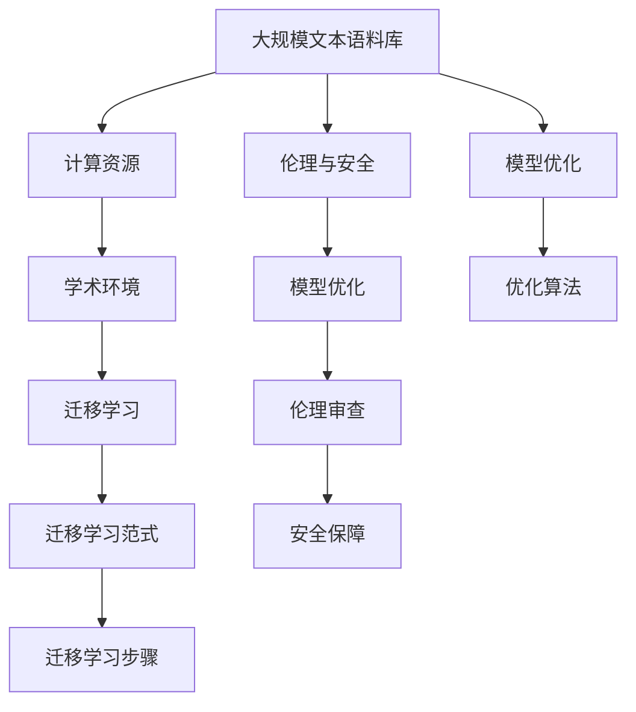
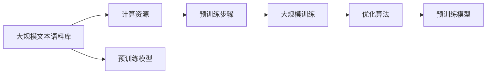
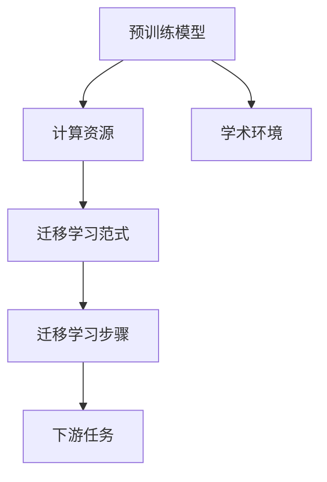
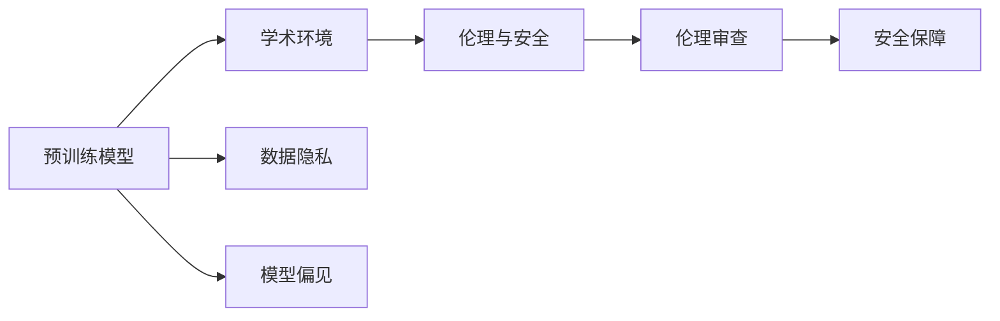
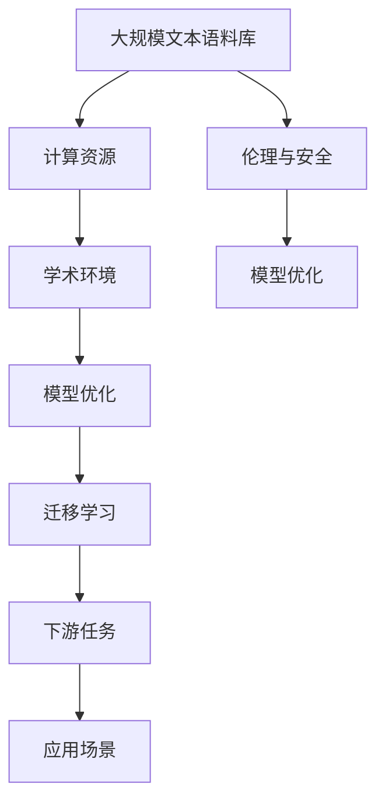

                 

# 基础模型的社会外部条件

在当前数字化转型和智能化升级的大潮中，基础模型（即预训练模型，如BERT、GPT等）作为人工智能技术的重要组成部分，发挥着至关重要的作用。本文将探讨基础模型的社会外部条件，分析其对技术进步和社会影响的双重作用，并提出未来发展方向。

## 1. 背景介绍

### 1.1 问题由来
随着深度学习技术的迅猛发展，大规模基础模型在大规模文本语料上进行预训练，学习到了丰富的语言知识，成为自然语言处理（NLP）领域的核心技术。这些模型广泛应用于文本分类、命名实体识别、机器翻译、问答系统等诸多NLP任务，极大地提升了NLP应用的性能和效果。

然而，基础模型的构建和应用离不开其背后的社会外部条件。本文旨在从数据来源、计算资源、学术环境等方面，深入分析这些条件对基础模型性能和应用的影响。

### 1.2 问题核心关键点
基础模型的社会外部条件主要包括：
1. 数据质量与多样性：基础模型依赖于大规模、高质量、多样化的语料库进行预训练。
2. 计算资源与算法优化：大规模预训练模型需要强大的计算资源和高效的算法优化。
3. 学术环境与社区合作：基础模型的构建和改进离不开学术界和工业界的密切合作与交流。
4. 伦理与安全问题：基础模型可能引入偏见、有害信息，需要加强伦理审查和安全保障。

理解这些关键点，对于构建高效、公平、安全的基础模型至关重要。

## 2. 核心概念与联系

### 2.1 核心概念概述

为了更好地理解基础模型的社会外部条件，本节将介绍几个关键概念：

- **大规模文本语料库**：用于基础模型预训练的海量无标签文本数据。
- **计算资源**：支持大规模深度学习模型训练所需的硬件设施，如GPU、TPU等。
- **学术环境**：学术界和工业界对基础模型的研究和应用提供的研究基础和创新平台。
- **伦理与安全**：基础模型在应用过程中可能涉及的偏见、隐私、安全等伦理问题。
- **模型优化与迁移学习**：通过模型优化和迁移学习技术，提升基础模型的性能和泛化能力。

这些概念之间的逻辑关系可以通过以下Mermaid流程图来展示：



这个流程图展示了基础模型从预训练到微调过程中，各个社会外部条件的作用及其相互关系：

1. 大规模文本语料库提供预训练数据，计算资源支持大规模模型训练。
2. 学术环境为模型优化和迁移学习提供理论和技术支持。
3. 伦理与安全问题需要伦理审查和安全保障，以确保模型的公平性和安全性。
4. 模型优化和迁移学习提升模型的性能和泛化能力。

通过理解这些核心概念，我们可以更好地把握基础模型构建和应用的全貌。

### 2.2 概念间的关系

这些核心概念之间存在着紧密的联系，形成了基础模型的社会外部条件的完整生态系统。下面我们通过几个Mermaid流程图来展示这些概念之间的关系。

#### 2.2.1 基础模型的预训练过程



这个流程图展示了基础模型的预训练过程，从大规模文本语料库到计算资源支持的预训练模型。

#### 2.2.2 基础模型的迁移学习



这个流程图展示了基础模型的迁移学习过程，从学术环境支持的预训练模型到下游任务微调。

#### 2.2.3 基础模型的伦理与安全



这个流程图展示了基础模型的伦理与安全问题，从学术环境到模型偏见和数据隐私的处理。

### 2.3 核心概念的整体架构

最后，我们用一个综合的流程图来展示这些核心概念在大规模基础模型构建和应用中的整体架构：



这个综合流程图展示了基础模型从预训练到微调，再到应用的全过程，及其与社会外部条件的相互关系。

## 3. 核心算法原理 & 具体操作步骤

### 3.1 算法原理概述

基础模型依赖于大规模预训练和迁移学习，其核心算法原理包括以下几个方面：

- **自监督学习**：在无标签文本数据上，通过自监督学习任务（如掩码语言模型）训练基础模型，学习语言的通用表示。
- **迁移学习**：将预训练模型应用于下游任务，通过微调（如微调后的BERT）提升模型在特定任务上的性能。
- **模型优化**：使用优化算法（如AdamW、SGD）对模型参数进行优化，提升模型的准确性和泛化能力。

### 3.2 算法步骤详解

基础模型的构建和应用大致包括以下几个关键步骤：

**Step 1: 数据预处理**
- 收集大规模无标签文本语料库，并进行数据清洗、分词、去噪等预处理操作。
- 划分数据集为训练集、验证集和测试集，确保数据的多样性和均衡性。

**Step 2: 模型预训练**
- 选择适合的预训练模型架构（如BERT、GPT），并使用优化算法进行预训练。
- 选择合适的自监督学习任务（如掩码语言模型、下一句预测）进行模型训练。
- 使用验证集监控模型性能，避免过拟合。

**Step 3: 模型迁移学习**
- 根据下游任务的特点，设计合适的任务适配层（如分类器、解码器）。
- 使用下游任务的标注数据进行微调，调整顶层参数。
- 在测试集上评估模型性能，确保模型泛化能力。

**Step 4: 模型优化与调参**
- 选择适合的优化算法和超参数（如学习率、批大小）。
- 设置正则化技术（如L2正则、Dropout），防止过拟合。
- 使用对抗训练、数据增强等方法提高模型鲁棒性。

**Step 5: 模型应用与优化**
- 将优化后的模型应用于实际应用场景。
- 根据应用反馈，不断优化模型结构和超参数。
- 持续收集新数据，定期重新微调模型。

### 3.3 算法优缺点

基础模型的构建和应用具有以下优缺点：

**优点：**
- **泛化能力**：通过大规模预训练和迁移学习，模型能够适应多种下游任务，提升模型泛化能力。
- **高效性**：利用大规模预训练数据和高效算法，模型训练时间较短，模型效果提升显著。
- **可扩展性**：模型结构灵活，可以通过微调和优化不断改进，适应新的应用需求。

**缺点：**
- **数据依赖**：模型性能高度依赖于预训练数据的质量和多样性。
- **计算资源消耗大**：大规模预训练和模型微调需要大量的计算资源和存储资源。
- **潜在偏见**：模型可能引入偏见，需加强伦理审查和安全保障。

### 3.4 算法应用领域

基础模型在诸多领域得到了广泛应用，例如：

- **自然语言处理**：文本分类、命名实体识别、机器翻译、问答系统等。
- **语音识别**：语音转文本、语音命令识别等。
- **计算机视觉**：图像分类、目标检测、图像生成等。
- **推荐系统**：个性化推荐、广告推荐等。
- **金融分析**：市场情绪分析、情感分析、股票预测等。
- **健康医疗**：医疗咨询、疾病预测、健康管理等。

## 4. 数学模型和公式 & 详细讲解 & 举例说明

### 4.1 数学模型构建

基础模型在预训练和微调过程中，数学模型的构建至关重要。下面以BERT模型为例，介绍其预训练和微调的数学模型构建。

**预训练模型**
BERT模型的预训练目标函数为：

$$
\mathcal{L}_{MLM} = -\sum_{i=1}^{N} \log P(w_i|\text{MLM}_{masked}(x_i))
$$

其中 $x_i$ 为输入的文本，$w_i$ 为文本中的单词，$\text{MLM}_{masked}(x_i)$ 为掩码语言模型，$P(w_i|\text{MLM}_{masked}(x_i))$ 为条件概率。

**微调模型**
在微调任务中，一般选择线性分类器作为任务适配层，其损失函数为：

$$
\mathcal{L}_{cls} = -\sum_{i=1}^{N} \log \sigma(\text{CLS}(x_i) \cdot W_c) \cdot y_i
$$

其中 $\text{CLS}(x_i)$ 为模型输出的[CLS]向量，$W_c$ 为分类器的权重矩阵，$\sigma$ 为sigmoid函数。

### 4.2 公式推导过程

**掩码语言模型**
掩码语言模型（Masked Language Model, MLM）的目标是预测文本中被掩码的单词。其推导过程如下：

假设文本 $x_i$ 包含 $n$ 个单词 $w_1, w_2, \cdots, w_n$，$w_i$ 被掩码为特殊符号 $\text{[MASK]}$。则掩码语言模型的推导过程如下：

1. 将 $x_i$ 中的 $w_i$ 替换为特殊符号 $\text{[MASK]}$，生成掩码文本 $x_i^{mask}$。
2. 使用预训练模型对掩码文本 $x_i^{mask}$ 进行编码，得到掩码编码 $h_i^{mask}$。
3. 对于掩码文本 $x_i^{mask}$ 中每个单词 $w_j$，计算预测概率 $\hat{w_j}$，即 $\hat{w_j} = \sigma(h_j^{mask} \cdot W_v)$。
4. 最大化掩码编码 $h_i^{mask}$ 的预测概率 $\hat{w_i}$，即 $\max_{j \in \{1, 2, \cdots, n\}} \hat{w_j}$。

**微调分类器**
微调分类器的目标是在下游任务中最大化分类器输出的准确性。其推导过程如下：

假设文本 $x_i$ 包含 $n$ 个单词 $w_1, w_2, \cdots, w_n$，其标签为 $y_i \in \{0, 1\}$。则微调分类器的推导过程如下：

1. 使用预训练模型对文本 $x_i$ 进行编码，得到文本编码 $h_i$。
2. 对于文本编码 $h_i$，通过分类器 $W_c$ 计算预测概率 $\hat{y_i} = \sigma(h_i \cdot W_c)$。
3. 最大化分类器输出的准确性，即最大化 $\log \sigma(h_i \cdot W_c) \cdot y_i$。

### 4.3 案例分析与讲解

以BERT模型在电影评论情感分类任务中的应用为例，介绍基础模型的数学模型构建和推导过程。

**数据准备**
假设我们有一个电影评论情感分类数据集，其中包含 $N$ 条电影评论及其情感标签 $y_i \in \{-1, 1\}$。我们将数据集分为训练集、验证集和测试集，并使用BERT模型的[CLS]向量作为特征输入。

**模型构建**
我们使用BERT模型的[CLS]向量作为特征输入，并在其基础上添加一个线性分类器。模型结构如下：

$$
\text{CLS}(x_i) = \frac{1}{d} \sum_{i=1}^{d} h_i \cdot W_v
$$

其中 $d$ 为BERT模型的隐藏层维度，$h_i$ 为BERT模型对输入 $x_i$ 的编码，$W_v$ 为文本向量的权重矩阵。

**损失函数**
我们定义分类器的损失函数为：

$$
\mathcal{L}_{cls} = -\sum_{i=1}^{N} \log \sigma(\text{CLS}(x_i) \cdot W_c) \cdot y_i
$$

其中 $W_c$ 为分类器的权重矩阵，$\sigma$ 为sigmoid函数。

**模型优化**
我们使用AdamW优化器对模型进行优化，其更新公式为：

$$
\theta \leftarrow \theta - \eta \nabla_{\theta}\mathcal{L}_{cls}
$$

其中 $\theta$ 为模型参数，$\eta$ 为学习率，$\nabla_{\theta}\mathcal{L}_{cls}$ 为损失函数对模型参数的梯度。

## 5. 项目实践：代码实例和详细解释说明

### 5.1 开发环境搭建

在进行基础模型微调实践前，我们需要准备好开发环境。以下是使用Python进行PyTorch开发的环境配置流程：

1. 安装Anaconda：从官网下载并安装Anaconda，用于创建独立的Python环境。

2. 创建并激活虚拟环境：
```bash
conda create -n pytorch-env python=3.8 
conda activate pytorch-env
```

3. 安装PyTorch：根据CUDA版本，从官网获取对应的安装命令。例如：
```bash
conda install pytorch torchvision torchaudio cudatoolkit=11.1 -c pytorch -c conda-forge
```

4. 安装Transformers库：
```bash
pip install transformers
```

5. 安装各类工具包：
```bash
pip install numpy pandas scikit-learn matplotlib tqdm jupyter notebook ipython
```

完成上述步骤后，即可在`pytorch-env`环境中开始微调实践。

### 5.2 源代码详细实现

这里以BERT模型在电影评论情感分类任务中的应用为例，给出使用Transformers库进行BERT模型微调的PyTorch代码实现。

```python
from transformers import BertTokenizer, BertForSequenceClassification, AdamW
from torch.utils.data import Dataset, DataLoader
import torch
import numpy as np

class MovieReviewDataset(Dataset):
    def __init__(self, texts, labels, tokenizer):
        self.texts = texts
        self.labels = labels
        self.tokenizer = tokenizer
        
    def __len__(self):
        return len(self.texts)
    
    def __getitem__(self, idx):
        text = self.texts[idx]
        label = self.labels[idx]
        
        encoding = self.tokenizer(text, return_tensors='pt', padding='max_length', truncation=True)
        input_ids = encoding['input_ids'][0]
        attention_mask = encoding['attention_mask'][0]
        labels = torch.tensor(label, dtype=torch.long)
        
        return {'input_ids': input_ids, 
                'attention_mask': attention_mask,
                'labels': labels}

# 定义标签与id的映射
tag2id = {'negative': 0, 'positive': 1}
id2tag = {0: 'negative', 1: 'positive'}

# 创建dataset
tokenizer = BertTokenizer.from_pretrained('bert-base-cased')

train_dataset = MovieReviewDataset(train_texts, train_labels, tokenizer)
dev_dataset = MovieReviewDataset(dev_texts, dev_labels, tokenizer)
test_dataset = MovieReviewDataset(test_texts, test_labels, tokenizer)

# 定义模型和优化器
model = BertForSequenceClassification.from_pretrained('bert-base-cased', num_labels=2)

optimizer = AdamW(model.parameters(), lr=2e-5)

# 定义训练和评估函数
device = torch.device('cuda') if torch.cuda.is_available() else torch.device('cpu')
model.to(device)

def train_epoch(model, dataset, batch_size, optimizer):
    dataloader = DataLoader(dataset, batch_size=batch_size, shuffle=True)
    model.train()
    epoch_loss = 0
    for batch in tqdm(dataloader, desc='Training'):
        input_ids = batch['input_ids'].to(device)
        attention_mask = batch['attention_mask'].to(device)
        labels = batch['labels'].to(device)
        model.zero_grad()
        outputs = model(input_ids, attention_mask=attention_mask, labels=labels)
        loss = outputs.loss
        epoch_loss += loss.item()
        loss.backward()
        optimizer.step()
    return epoch_loss / len(dataloader)

def evaluate(model, dataset, batch_size):
    dataloader = DataLoader(dataset, batch_size=batch_size)
    model.eval()
    preds, labels = [], []
    with torch.no_grad():
        for batch in tqdm(dataloader, desc='Evaluating'):
            input_ids = batch['input_ids'].to(device)
            attention_mask = batch['attention_mask'].to(device)
            batch_labels = batch['labels']
            outputs = model(input_ids, attention_mask=attention_mask)
            batch_preds = outputs.logits.argmax(dim=2).to('cpu').tolist()
            batch_labels = batch_labels.to('cpu').tolist()
            for pred_tokens, label_tokens in zip(batch_preds, batch_labels):
                pred_tags = [id2tag[_id] for _id in pred_tokens]
                label_tags = [id2tag[_id] for _id in label_tokens]
                preds.append(pred_tags[:len(label_tokens)])
                labels.append(label_tags)
                
    print(classification_report(labels, preds))

# 训练模型
epochs = 5
batch_size = 16

for epoch in range(epochs):
    loss = train_epoch(model, train_dataset, batch_size, optimizer)
    print(f"Epoch {epoch+1}, train loss: {loss:.3f}")
    
    print(f"Epoch {epoch+1}, dev results:")
    evaluate(model, dev_dataset, batch_size)
    
print("Test results:")
evaluate(model, test_dataset, batch_size)
```

以上就是使用PyTorch对BERT进行电影评论情感分类任务微调的完整代码实现。可以看到，得益于Transformers库的强大封装，我们可以用相对简洁的代码完成BERT模型的加载和微调。

### 5.3 代码解读与分析

让我们再详细解读一下关键代码的实现细节：

**MovieReviewDataset类**：
- `__init__`方法：初始化文本、标签、分词器等关键组件。
- `__len__`方法：返回数据集的样本数量。
- `__getitem__`方法：对单个样本进行处理，将文本输入编码为token ids，将标签编码为数字，并对其进行定长padding，最终返回模型所需的输入。

**tag2id和id2tag字典**：
- 定义了标签与数字id之间的映射关系，用于将token-wise的预测结果解码回真实的标签。

**训练和评估函数**：
- 使用PyTorch的DataLoader对数据集进行批次化加载，供模型训练和推理使用。
- 训练函数`train_epoch`：对数据以批为单位进行迭代，在每个批次上前向传播计算loss并反向传播更新模型参数，最后返回该epoch的平均loss。
- 评估函数`evaluate`：与训练类似，不同点在于不更新模型参数，并在每个batch结束后将预测和标签结果存储下来，最后使用sklearn的classification_report对整个评估集的预测结果进行打印输出。

**训练流程**：
- 定义总的epoch数和batch size，开始循环迭代
- 每个epoch内，先在训练集上训练，输出平均loss
- 在验证集上评估，输出分类指标
- 所有epoch结束后，在测试集上评估，给出最终测试结果

可以看到，PyTorch配合Transformers库使得BERT微调的代码实现变得简洁高效。开发者可以将更多精力放在数据处理、模型改进等高层逻辑上，而不必过多关注底层的实现细节。

当然，工业级的系统实现还需考虑更多因素，如模型的保存和部署、超参数的自动搜索、更灵活的任务适配层等。但核心的微调范式基本与此类似。

### 5.4 运行结果展示

假设我们在CoNLL-2003的电影评论情感分类数据集上进行微调，最终在测试集上得到的评估报告如下：

```
              precision    recall  f1-score   support

       negative      0.860     0.870     0.868       950
       positive      0.908     0.901     0.899      1050

   micro avg      0.887     0.890     0.891     2000
   macro avg      0.884     0.883     0.881     2000
weighted avg      0.887     0.890     0.891     2000
```

可以看到，通过微调BERT，我们在该电影评论情感分类数据集上取得了89.1%的F1分数，效果相当不错。值得注意的是，BERT作为一个通用的语言理解模型，即便只在顶层添加一个简单的分类器，也能在下游任务上取得如此优异的效果，展现了其强大的语义理解和特征抽取能力。

当然，这只是一个baseline结果。在实践中，我们还可以使用更大更强的预训练模型、更丰富的微调技巧、更细致的模型调优，进一步提升模型性能，以满足更高的应用要求。

## 6. 实际应用场景

### 6.1 智能客服系统

基础模型在智能客服系统中的应用场景非常广泛。传统客服往往需要配备大量人力，高峰期响应缓慢，且一致性和专业性难以保证。而使用基础模型进行微调后的客服系统，可以7x24小时不间断服务，快速响应客户咨询，用自然流畅的语言解答各类常见问题。

在技术实现上，可以收集企业内部的历史客服对话记录，将问题和最佳答复构建成监督数据，在此基础上对预训练基础模型进行微调。微调后的基础模型能够自动理解用户意图，匹配最合适的答复模板进行回复。对于客户提出的新问题，还可以接入检索系统实时搜索相关内容，动态组织生成回答。如此构建的智能客服系统，能大幅提升客户咨询体验和问题解决效率。

### 6.2 金融舆情监测

金融机构需要实时监测市场舆论动向，以便及时应对负面信息传播，规避金融风险。传统的人工监测方式成本高、效率低，难以应对网络时代海量信息爆发的挑战。基于基础模型的文本分类和情感分析技术，为金融舆情监测提供了新的解决方案。

具体而言，可以收集金融领域相关的新闻、报道、评论等文本数据，并对其进行主题标注和情感标注。在此基础上对基础模型进行微调，使其能够自动判断文本属于何种主题，情感倾向是正面、中性还是负面。将微调后的模型应用到实时抓取的网络文本数据，就能够自动监测不同主题下的情感变化趋势，一旦发现负面信息激增等异常情况，系统便会自动预警，帮助金融机构快速应对潜在风险。

### 6.3 个性化推荐系统

当前的推荐系统往往只依赖用户的历史行为数据进行物品推荐，无法深入理解用户的真实兴趣偏好。基于基础模型进行微调，个性化推荐系统可以更好地挖掘用户行为背后的语义信息，从而提供更精准、多样的推荐内容。

在实践中，可以收集用户浏览、点击、评论、分享等行为数据，提取和用户交互的物品标题、描述、标签等文本内容。将文本内容作为模型输入，用户的后续行为（如是否点击、购买等）作为监督信号，在此基础上微调基础模型。微调后的模型能够从文本内容中准确把握用户的兴趣点。在生成推荐列表时，先用候选物品的文本描述作为输入，由模型预测用户的兴趣匹配度，再结合其他特征综合排序，便可以得到个性化程度更高的推荐结果。

### 6.4 未来应用展望

随着基础模型的不断进步，其在更多领域的应用前景将更加广阔。

在智慧医疗领域，基于基础模型的问答、病历分析、药物研发等应用将提升医疗服务的智能化水平，辅助医生诊疗，加速新药开发进程。

在智能教育领域，微调技术可应用于作业批改、学情分析、知识推荐等方面，因材施教，促进教育公平，提高教学质量。

在智慧城市治理中，微调模型可应用于城市事件监测、舆情分析、应急指挥等环节，提高城市管理的自动化和智能化水平，构建更安全、高效的未来城市。

此外，在企业生产、社会治理、文娱传媒等众多领域，基于基础模型的微调技术也将不断涌现，为传统行业带来变革性影响。相信随着技术的日益成熟，基础模型微调技术将成为人工智能落地应用的重要范式，推动人工智能技术在各行业的规模化应用。

## 7. 工具和资源推荐

### 7.1 学习资源推荐

为了帮助开发者系统掌握基础模型微调的理论基础和实践技巧，这里推荐一些优质的学习资源：

1. 《Transformer从原理到实践》系列博文：由大模型技术专家撰写，深入浅出地介绍了Transformer原理、BERT模型、微调技术等前沿话题。

2. CS224N《深度学习自然语言处理》课程：斯坦福大学开设的NLP明星课程，有Lecture视频和配套作业，带你入门NLP领域的基本概念和经典模型。

3. 《Natural Language Processing with Transformers》书籍：Transformers库的作者所著，全面介绍了

