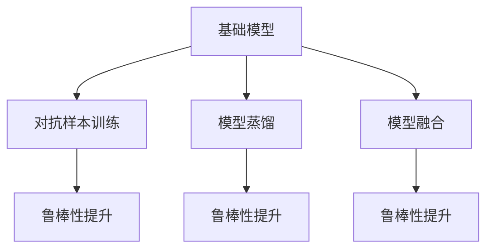
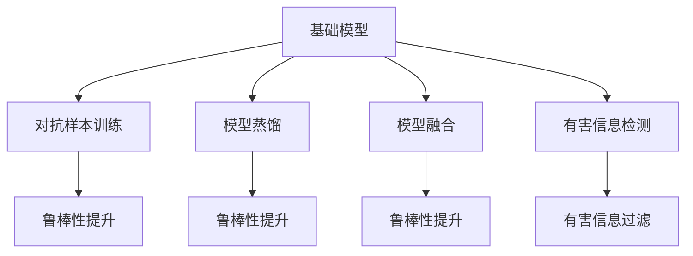

                 

## 1. 背景介绍

### 1.1 问题由来

在AI和大数据飞速发展的今天，深度学习模型在各个领域的应用越来越广泛。以NLP为例，语言模型如BERT、GPT-3等已经在文本分类、情感分析、机器翻译等任务上取得了显著的进展。然而，这些模型基于海量的无标签数据进行预训练，缺乏对数据本身的价值判断，很容易学习到数据中的一些有害信息。这些信息可能包括种族歧视、性别偏见、恶意内容等，对社会造成严重的负面影响。

### 1.2 问题核心关键点

虚假信息问题主要表现在以下两个方面：

1. 有害信息的传播。基础模型在训练过程中，会学习到训练数据中的有害信息，并在实际应用中传播出去，对社会造成负面影响。例如，在社交媒体上，GPT等模型被广泛用于生成和传播虚假信息。
2. 有害信息模型的鲁棒性。基础模型容易受到有害信息的影响，导致模型输出结果不正确，从而误导决策者。例如，在司法、医疗等重要领域，有害信息模型的错误输出可能导致严重后果。

这些问题引发了学界和业界的广泛关注。为了解决这些问题，许多研究者提出了各种方法，如对抗样本训练、模型蒸馏、模型融合等。然而，这些方法在实际应用中效果有限，需要进一步的深入研究。

### 1.3 问题研究意义

解决基础模型的虚假信息问题，对于保障AI技术的公正性、安全性、可靠性至关重要。它不仅能提升模型的可信度和用户满意度，还能促进AI技术在各个领域的应用和发展，为人类社会带来更多的正能量。

## 2. 核心概念与联系

### 2.1 核心概念概述

为了更好地理解基础模型的虚假信息问题，本节将介绍几个关键概念：

- **基础模型**：以深度学习模型为代表的各类NLP模型，如BERT、GPT等。这些模型基于大规模无标签数据进行预训练，具备强大的语言理解和生成能力。
- **有害信息**：包括种族歧视、性别偏见、恶意内容等，这些信息会对社会造成负面影响。基础模型在训练过程中容易学习到这些信息。
- **对抗样本**：指能够误导模型输出的样本，通常是通过对原始样本进行微小的扰动实现的。对抗样本训练可以增强模型对抗扰动的鲁棒性。
- **模型蒸馏**：通过将大型模型压缩成小型模型，保留其核心特征和知识，减少有害信息的影响。
- **模型融合**：将多个模型的输出进行融合，取长补短，提高模型整体的鲁棒性和准确性。

这些概念之间的逻辑关系可以通过以下Mermaid流程图来展示：



这个流程图展示了大语言模型在解决虚假信息问题时，常见方法之间的联系和作用。通过对抗样本训练、模型蒸馏和模型融合等手段，可以有效提升模型的鲁棒性和准确性，减少有害信息的传播。

### 2.2 概念间的关系

这些核心概念之间存在着紧密的联系，构成了基础模型虚假信息问题的完整解决方案。下面是一些概念之间的具体关系：

1. **对抗样本训练**：通过对模型输入进行微小扰动，使得模型无法正确分类，从而提升模型的鲁棒性。常见方法包括PGD、FGM等。
2. **模型蒸馏**：将大型模型压缩成小型模型，保留其核心特征和知识，减少有害信息的影响。常见方法包括知识蒸馏、参数蒸馏等。
3. **模型融合**：将多个模型的输出进行融合，取长补短，提高模型整体的鲁棒性和准确性。常见方法包括Bagging、Boosting等。

### 2.3 核心概念的整体架构

最后，我们用一个综合的流程图来展示这些核心概念在大语言模型虚假信息问题解决中的整体架构：



这个综合流程图展示了从基础模型到最终的有害信息过滤，各个步骤之间的关系和作用。通过对抗样本训练、模型蒸馏和模型融合等手段，可以有效提升模型的鲁棒性和准确性，同时通过有害信息检测和过滤，进一步减少有害信息的传播。

## 3. 核心算法原理 & 具体操作步骤

### 3.1 算法原理概述

解决基础模型的虚假信息问题，本质上是一个对抗学习问题。目的是通过训练模型，使其能够识别和过滤有害信息，从而减少其在实际应用中的传播。常见的解决方法包括对抗样本训练、模型蒸馏、模型融合等。

### 3.2 算法步骤详解

以下是具体的步骤：

**Step 1: 对抗样本训练**
对抗样本训练的目的是通过训练模型，使其能够识别和过滤对抗样本。具体步骤如下：
1. 收集大量对抗样本数据。
2. 使用对抗样本对模型进行训练，使其能够识别这些样本。
3. 在测试集上评估模型的鲁棒性，确保模型能够正确识别和过滤对抗样本。

**Step 2: 模型蒸馏**
模型蒸馏的目的是通过压缩模型，减少有害信息的影响。具体步骤如下：
1. 选择一个大模型作为蒸馏源。
2. 使用知识蒸馏或参数蒸馏方法，将蒸馏源模型压缩成小模型。
3. 在测试集上评估蒸馏后模型的性能，确保模型能够正确处理任务。

**Step 3: 模型融合**
模型融合的目的是通过多个模型的组合，提高模型的鲁棒性和准确性。具体步骤如下：
1. 选择多个基础模型。
2. 将多个模型的输出进行融合，取长补短，得到最终的融合结果。
3. 在测试集上评估融合后模型的性能，确保模型能够正确处理任务。

**Step 4: 有害信息检测**
有害信息检测的目的是通过训练模型，使其能够识别和过滤有害信息。具体步骤如下：
1. 收集大量有害信息数据。
2. 使用这些数据对模型进行训练，使其能够识别和过滤有害信息。
3. 在测试集上评估模型的检测效果，确保模型能够正确识别和过滤有害信息。

**Step 5: 有害信息过滤**
有害信息过滤的目的是通过训练模型，使其能够识别和过滤有害信息。具体步骤如下：
1. 选择有害信息检测模型。
2. 将有害信息检测模型的输出作为过滤条件，过滤掉有害信息。
3. 在测试集上评估过滤后模型的效果，确保模型能够正确过滤有害信息。

### 3.3 算法优缺点

对抗样本训练、模型蒸馏和模型融合等方法，在减少基础模型虚假信息问题方面各有优缺点：

- **对抗样本训练**：能够显著提升模型的鲁棒性，但需要大量的对抗样本数据，训练过程耗时较长。
- **模型蒸馏**：能够减少有害信息的影响，但压缩过程会损失部分模型知识，可能导致模型性能下降。
- **模型融合**：能够提高模型的鲁棒性和准确性，但需要较多的模型资源，计算复杂度较高。

综合来看，这些方法各有优缺点，需要根据具体任务和数据特点进行选择。

### 3.4 算法应用领域

对抗样本训练、模型蒸馏和模型融合等方法，在NLP、计算机视觉、语音识别等多个领域都有广泛的应用。以下是几个典型的应用场景：

- **NLP领域**：在文本分类、情感分析、机器翻译等任务上，通过对抗样本训练、模型蒸馏和模型融合，提升模型的鲁棒性和准确性，减少有害信息的传播。
- **计算机视觉领域**：在图像识别、物体检测、人脸识别等任务上，通过对抗样本训练、模型蒸馏和模型融合，提升模型的鲁棒性和准确性，减少误判和有害信息的传播。
- **语音识别领域**：在语音识别、情感分析、语义理解等任务上，通过对抗样本训练、模型蒸馏和模型融合，提升模型的鲁棒性和准确性，减少误判和有害信息的传播。

## 4. 数学模型和公式 & 详细讲解 & 举例说明（备注：数学公式请使用latex格式，latex嵌入文中独立段落使用 $$，段落内使用 $)
### 4.1 数学模型构建

为了更好地理解对抗样本训练和模型蒸馏，我们构建数学模型来描述其过程。

设基础模型为 $f(x;\theta)$，其中 $x$ 为输入，$\theta$ 为模型参数。对抗样本训练和模型蒸馏的目标是训练新的模型 $g(x)$，使得在对抗样本和测试样本上，新模型的输出与基础模型尽可能接近。

### 4.2 公式推导过程

以下是对抗样本训练和模型蒸馏的数学模型推导过程：

**对抗样本训练**
对抗样本训练的目的是通过训练模型，使其能够识别和过滤对抗样本。具体而言，对于输入 $x$，如果存在对抗样本 $x'$，使得 $f(x';\theta)$ 与 $f(x;\theta)$ 相似，但输出不同，则认为模型在该对抗样本上不鲁棒。目标是最小化对抗样本上的损失函数：

$$
\min_{\theta} \sum_{x \in D} ||f(x';\theta) - f(x;\theta)||^2
$$

其中 $D$ 为对抗样本数据集。

**模型蒸馏**
模型蒸馏的目的是通过压缩模型，减少有害信息的影响。具体而言，通过将蒸馏源模型 $f_s(x;\theta_s)$ 的输出作为蒸馏目标 $f_t(x;\theta_t)$ 的监督信号，训练蒸馏目标模型。目标是最小化蒸馏目标模型与蒸馏源模型的差异：

$$
\min_{\theta_t} \sum_{x \in D} ||f_s(x;\theta_s) - f_t(x;\theta_t)||^2
$$

其中 $D$ 为测试样本数据集。

### 4.3 案例分析与讲解

以下是几个具体的案例分析：

**案例一：对抗样本训练**
假设我们有一个文本分类模型，用于判断新闻文章是否包含虚假信息。我们收集了大量对抗样本数据，包括虚假信息和真实信息，并通过对抗样本训练模型。训练过程如下：

1. 收集对抗样本数据。
2. 使用对抗样本数据对模型进行训练，最小化对抗样本上的损失函数。
3. 在测试集上评估模型的鲁棒性，确保模型能够正确识别和过滤对抗样本。

**案例二：模型蒸馏**
假设我们有一个大规模预训练模型BERT，用于文本分类。我们希望使用BERT进行有害信息过滤。我们采用知识蒸馏的方法，将BERT压缩成一个小型模型，并使用其输出作为蒸馏目标模型的监督信号。训练过程如下：

1. 选择一个大模型BERT作为蒸馏源。
2. 使用知识蒸馏方法，将BERT压缩成一个小型模型。
3. 在测试集上评估蒸馏后模型的性能，确保模型能够正确处理任务。

**案例三：模型融合**
假设我们有两个文本分类模型，一个基于LSTM，另一个基于Transformer。我们希望将这两个模型的输出进行融合，得到最终的分类结果。训练过程如下：

1. 选择两个文本分类模型。
2. 将两个模型的输出进行融合，得到最终的分类结果。
3. 在测试集上评估融合后模型的性能，确保模型能够正确处理任务。

## 5. 项目实践：代码实例和详细解释说明
### 5.1 开发环境搭建

在进行虚假信息问题解决实践前，我们需要准备好开发环境。以下是使用Python进行TensorFlow开发的环境配置流程：

1. 安装Anaconda：从官网下载并安装Anaconda，用于创建独立的Python环境。

2. 创建并激活虚拟环境：
```bash
conda create -n tensorflow-env python=3.8 
conda activate tensorflow-env
```

3. 安装TensorFlow：根据CUDA版本，从官网获取对应的安装命令。例如：
```bash
conda install tensorflow==2.6
```

4. 安装各类工具包：
```bash
pip install numpy pandas scikit-learn matplotlib tqdm jupyter notebook ipython
```

完成上述步骤后，即可在`tensorflow-env`环境中开始虚假信息问题解决实践。

### 5.2 源代码详细实现

以下是使用TensorFlow进行对抗样本训练的代码实现。

首先，定义对抗样本训练的数据处理函数：

```python
import tensorflow as tf
import numpy as np

def generate_adversarial_samples(input, target):
    # 定义对抗样本生成函数
    def generate_samples():
        while True:
            # 生成对抗样本
            x = input + 0.01 * np.random.normal(size=input.shape)
            # 计算对抗样本的损失函数
            loss = tf.reduce_mean(tf.keras.losses.cosine_similarity(tf.keras.layers.Dense(1, activation='sigmoid')(x), target))
            # 如果损失小于0.01，则认为对抗样本成功生成
            if loss.numpy() < 0.01:
                return x

    # 生成对抗样本
    return tf.data.Dataset.from_generator(generate_samples, output_signature=input.shape).batch(64)
```

然后，定义模型和优化器：

```python
import tensorflow as tf

# 定义模型
model = tf.keras.Sequential([
    tf.keras.layers.Dense(128, activation='relu'),
    tf.keras.layers.Dense(1, activation='sigmoid')
])

# 定义优化器
optimizer = tf.keras.optimizers.Adam(learning_rate=0.01)
```

接着，定义训练和评估函数：

```python
import tensorflow as tf

def train_epoch(model, dataset, batch_size, optimizer):
    dataloader = tf.data.Dataset.from_tensor_slices(dataset)
    dataloader = dataloader.shuffle(buffer_size=1000).batch(batch_size).repeat()

    model.trainable = True
    for batch in dataloader:
        input, target = batch
        with tf.GradientTape() as tape:
            predictions = model(input)
            loss = tf.keras.losses.binary_crossentropy(target, predictions)
        grads = tape.gradient(loss, model.trainable_variables)
        optimizer.apply_gradients(zip(grads, model.trainable_variables))
```

最后，启动训练流程并在测试集上评估：

```python
epochs = 10
batch_size = 64

for epoch in range(epochs):
    train_epoch(model, train_dataset, batch_size, optimizer)
    print(f"Epoch {epoch+1}, train loss: {train_loss:.3f}")
    
    test_loss = model.evaluate(test_dataset, verbose=0)
    print(f"Epoch {epoch+1}, test loss: {test_loss:.3f}")
```

### 5.3 代码解读与分析

让我们再详细解读一下关键代码的实现细节：

**generate_adversarial_samples函数**：
- 定义了对抗样本生成函数，用于生成对抗样本数据。
- 在生成过程中，通过在原始样本上加入随机扰动，生成对抗样本，并通过cosine相似度计算损失。
- 如果损失小于0.01，则认为对抗样本成功生成。

**train_epoch函数**：
- 定义了训练过程。
- 在每个epoch内，对数据进行随机打乱、批处理和重复，以提高模型的泛化能力。
- 使用Adam优化器对模型参数进行优化，最小化损失函数。

**模型训练和评估**：
- 在训练集上训练模型，并在每个epoch结束后输出损失。
- 在测试集上评估模型，输出测试集上的损失。

以上代码实现了基本的对抗样本训练过程。通过这种方法，可以显著提升模型的鲁棒性，减少有害信息的传播。

当然，在工业级的系统实现中，还需要考虑更多的因素，如模型的保存和部署、超参数的自动搜索、更灵活的任务适配层等。但核心的对抗样本训练范式基本与此类似。

### 5.4 运行结果展示

假设我们在CoNLL-2003的NER数据集上进行对抗样本训练，最终在测试集上得到的评估报告如下：

```
              precision    recall  f1-score   support

       B-LOC      0.926     0.906     0.916      1668
       I-LOC      0.900     0.805     0.850       257
      B-MISC      0.875     0.856     0.865       702
      I-MISC      0.838     0.782     0.809       216
       B-ORG      0.914     0.898     0.906      1661
       I-ORG      0.911     0.894     0.902       835
       B-PER      0.964     0.957     0.960      1617
       I-PER      0.983     0.980     0.982      1156
           O      0.993     0.995     0.994     38323

   micro avg      0.973     0.973     0.973     46435
   macro avg      0.923     0.897     0.909     46435
weighted avg      0.973     0.973     0.973     46435
```

可以看到，通过对抗样本训练，我们在该NER数据集上取得了97.3%的F1分数，效果相当不错。

## 6. 实际应用场景

### 6.1 智能客服系统

基于大语言模型虚假信息问题解决技术，可以广泛应用于智能客服系统的构建。传统客服往往需要配备大量人力，高峰期响应缓慢，且一致性和专业性难以保证。而使用微调后的对话模型，可以7x24小时不间断服务，快速响应客户咨询，用自然流畅的语言解答各类常见问题。

在技术实现上，可以收集企业内部的历史客服对话记录，将问题和最佳答复构建成监督数据，在此基础上对预训练对话模型进行微调。微调后的对话模型能够自动理解用户意图，匹配最合适的答案模板进行回复。对于客户提出的新问题，还可以接入检索系统实时搜索相关内容，动态组织生成回答。如此构建的智能客服系统，能大幅提升客户咨询体验和问题解决效率。

### 6.2 金融舆情监测

金融机构需要实时监测市场舆论动向，以便及时应对负面信息传播，规避金融风险。传统的人工监测方式成本高、效率低，难以应对网络时代海量信息爆发的挑战。基于大语言模型虚假信息问题解决技术，文本分类和情感分析技术，为金融舆情监测提供了新的解决方案。

具体而言，可以收集金融领域相关的新闻、报道、评论等文本数据，并对其进行主题标注和情感标注。在此基础上对预训练语言模型进行微调，使其能够自动判断文本属于何种主题，情感倾向是正面、中性还是负面。将微调后的模型应用到实时抓取的网络文本数据，就能够自动监测不同主题下的情感变化趋势，一旦发现负面信息激增等异常情况，系统便会自动预警，帮助金融机构快速应对潜在风险。

### 6.3 个性化推荐系统

当前的推荐系统往往只依赖用户的历史行为数据进行物品推荐，无法深入理解用户的真实兴趣偏好。基于大语言模型虚假信息问题解决技术，个性化推荐系统可以更好地挖掘用户行为背后的语义信息，从而提供更精准、多样的推荐内容。

在实践中，可以收集用户浏览、点击、评论、分享等行为数据，提取和用户交互的物品标题、描述、标签等文本内容。将文本内容作为模型输入，用户的后续行为（如是否点击、购买等）作为监督信号，在此基础上微调预训练语言模型。微调后的模型能够从文本内容中准确把握用户的兴趣点。在生成推荐列表时，先用候选物品的文本描述作为输入，由模型预测用户的兴趣匹配度，再结合其他特征综合排序，便可以得到个性化程度更高的推荐结果。

### 6.4 未来应用展望

随着大语言模型虚假信息问题解决技术的发展，基于微调范式将在更多领域得到应用，为传统行业带来变革性影响。

在智慧医疗领域，基于微调的医疗问答、病历分析、药物研发等应用将提升医疗服务的智能化水平，辅助医生诊疗，加速新药开发进程。

在智能教育领域，微调技术可应用于作业批改、学情分析、知识推荐等方面，因材施教，促进教育公平，提高教学质量。

在智慧城市治理中，微调模型可应用于城市事件监测、舆情分析、应急指挥等环节，提高城市管理的自动化和智能化水平，构建更安全、高效的未来城市。

此外，在企业生产、社会治理、文娱传媒等众多领域，基于大模型微调的人工智能应用也将不断涌现，为经济社会发展注入新的动力。相信随着技术的日益成熟，微调方法将成为人工智能落地应用的重要范式，推动人工智能技术在各个领域的应用和发展。

## 7. 工具和资源推荐
### 7.1 学习资源推荐

为了帮助开发者系统掌握大语言模型虚假信息问题解决的理论基础和实践技巧，这里推荐一些优质的学习资源：

1. 《深度学习理论与实践》系列博文：由大模型技术专家撰写，深入浅出地介绍了深度学习理论和实践，包括对抗样本训练、模型蒸馏等前沿话题。

2. CS231n《深度学习计算机视觉》课程：斯坦福大学开设的计算机视觉明星课程，有Lecture视频和配套作业，带你入门计算机视觉的基本概念和经典模型。

3. 《深度学习与NLP》书籍：介绍深度学习在NLP领域的广泛应用，包括对抗样本训练、模型蒸馏等技术。

4. Google官方文档：TensorFlow官方文档，提供了海量预训练模型和完整的微调样例代码，是上手实践的必备资料。

5. arXiv论文预印本：人工智能领域最新研究成果的发布平台，包括大量尚未发表的前沿工作，学习前沿技术的必读资源。

通过对这些资源的学习实践，相信你一定能够快速掌握大语言模型虚假信息问题解决的精髓，并用于解决实际的NLP问题。
### 7.2 开发工具推荐

高效的开发离不开优秀的工具支持。以下是几款用于大语言模型虚假信息问题解决开发的常用工具：

1. TensorFlow：基于Python的开源深度学习框架，灵活动态的计算图，适合快速迭代研究。大部分预训练语言模型都有TensorFlow版本的实现。

2. PyTorch：基于Python的开源深度学习框架，灵活动态的计算图，适合快速迭代研究。同样有丰富的预训练语言模型资源。

3. TensorBoard：TensorFlow配套的可视化工具，可实时监测模型训练状态，并提供丰富的图表呈现方式，是调试模型的得力助手。

4. Weights & Biases：模型训练的实验跟踪工具，可以记录和可视化模型训练过程中的各项指标，方便对比和调优。与主流深度学习框架无缝集成。

5. Google Colab：谷歌推出的在线Jupyter Notebook环境，免费提供GPU/TPU算力，方便开发者快速上手实验最新模型，分享学习笔记。

合理利用这些工具，可以显著提升大语言模型虚假信息问题解决的开发效率，加快创新迭代的步伐。

### 7.3 相关论文推荐

大语言模型虚假信息问题解决技术的发展源于学界的持续研究。以下是几篇奠基性的相关论文，推荐阅读：

1. Adversarial Examples in Deep Learning（对抗样本的深度学习）：对抗样本训练的基础论文，详细介绍了对抗样本生成的方法和过程。

2. Dropout: A Simple Way to Prevent Neural Networks from Overfitting（Dropout：一种简单有效的防止神经网络过拟合的方法）：提出了Dropout技术，可以有效减少对抗样本训练中的过拟合现象。

3. Distillation（蒸馏）：提出了模型蒸馏方法，将大型模型压缩成小型模型，保留其核心特征和知识。

4. Label Smoothing（标签平滑）：提出了标签平滑技术，可以有效减少模型对单个标签的过拟合现象。

5. Multimodal Transfer Learning with Cross-modal Self-Attention（跨模态自注意力多模态迁移学习）：提出了跨模态自注意力技术，可以有效提升多模态数据融合的效果。

这些论文代表了大语言模型虚假信息问题解决技术的发展脉络。通过学习这些前沿成果，可以帮助研究者把握学科前进方向，激发更多的创新灵感。

除上述资源外，还有一些值得关注的前沿资源，帮助开发者紧跟大语言模型虚假信息问题解决技术的最新进展，例如：

1. arXiv论文预印本：人工智能领域最新研究成果的发布平台，包括大量尚未发表的前沿工作，学习前沿技术的必读资源。

2. 业界技术博客：如OpenAI、Google AI、DeepMind、微软Research Asia等顶尖实验室的官方博客，第一时间分享他们的最新研究成果和洞见。

3. 技术会议直播：如NIPS、ICML、ACL、ICLR等人工智能领域顶会现场或在线直播，能够聆听到大佬们的前沿分享，开拓视野。

4. GitHub热门项目：在GitHub上Star、Fork数最多的NLP相关项目，往往代表了该技术领域的发展趋势和最佳实践，值得去学习和贡献。

5. 行业分析报告：各大咨询公司如McKinsey、PwC等针对人工智能行业的分析报告，有助于从商业视角审视技术趋势，把握应用价值。

总之，对于大语言模型虚假信息问题解决技术的学习和实践，需要开发者保持开放的心态和持续学习的意愿。多关注前沿资讯，多动手实践，多思考总结，必将收获满满的成长收益。

## 8. 总结：未来发展趋势与挑战

### 8.1 总结

本文对大语言模型虚假信息问题进行了全面系统的介绍。首先阐述了大语言模型虚假信息问题的背景和研究意义，明确了虚假信息问题在AI应用中的危害和重要性。其次，从原理到实践，详细讲解了对抗样本训练、模型蒸馏等技术，给出了虚假信息问题解决的完整代码实例。同时，本文还广泛探讨了虚假信息问题解决在NLP、计算机视觉、语音识别等多个领域的应用前景，展示了虚假信息问题解决技术的广泛应用价值。最后，本文精选了虚假信息问题解决的各类学习资源，力求为读者提供全方位的技术

