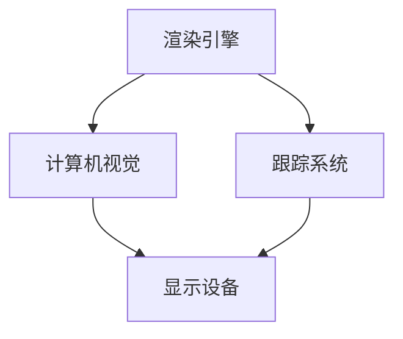
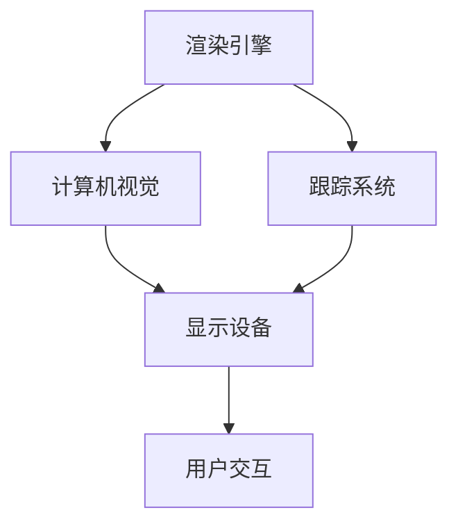
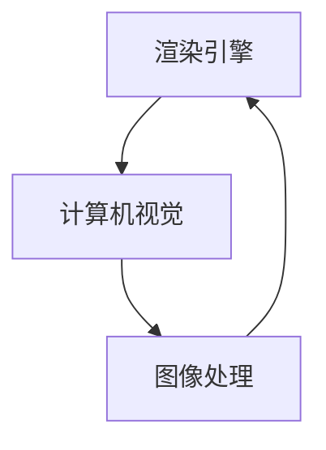
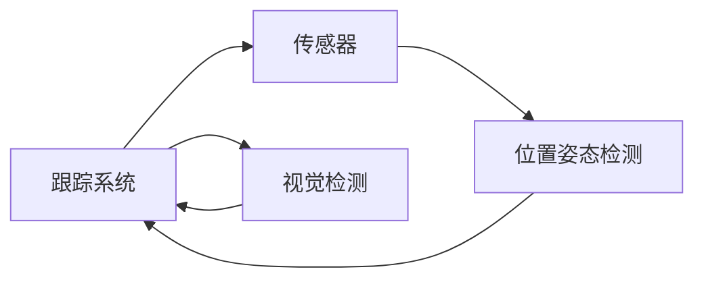
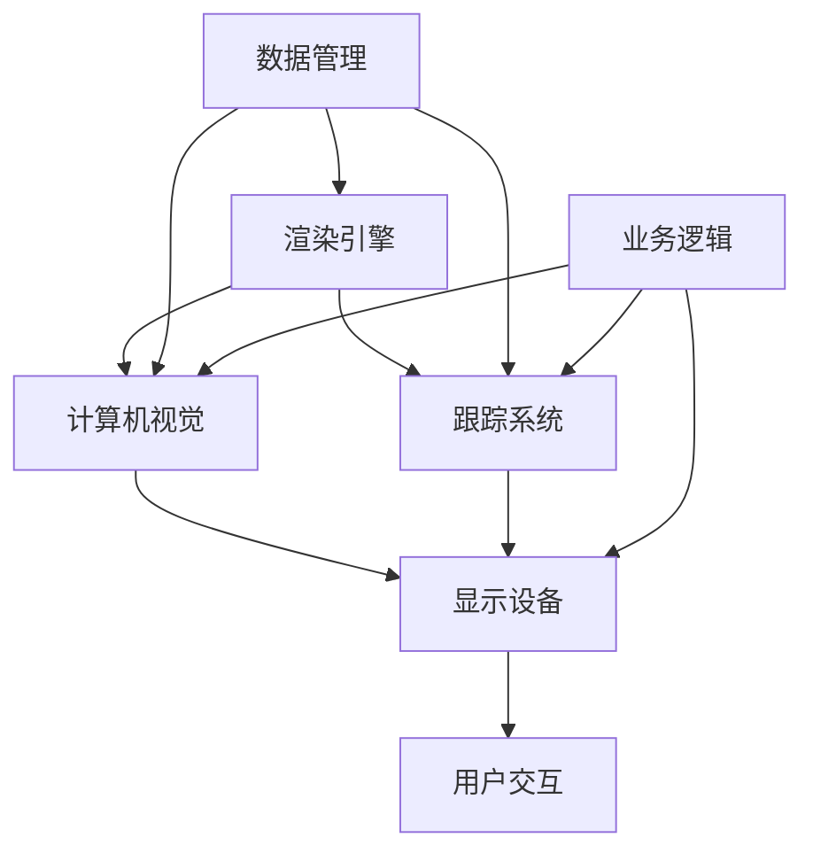

                 

## 1. 背景介绍

### 1.1 问题由来
增强现实（Augmented Reality, AR）技术将虚拟信息叠加在用户视野中，结合现实世界，创造新的交互体验。例如，通过智能手机或AR眼镜，可以看到街道上的实时导航指示，或者观看历史建筑的数字重现。AR技术广泛应用于娱乐、教育、设计、零售等多个领域，极大地扩展了人机交互的深度和广度。

然而，由于AR技术的复杂性，其在实际部署和应用过程中存在诸多技术难题。例如，如何高效地实时渲染大量3D内容？如何确保虚拟信息与现实世界的准确对齐？如何在保证交互流畅性的同时，提供良好的用户体验？这些问题驱动着AR领域的技术研究和应用探索。

### 1.2 问题核心关键点
AR技术主要涉及以下核心概念：
- 渲染引擎（Rendering Engine）：负责将3D场景渲染为2D图像。
- 计算机视觉（Computer Vision）：用于识别和跟踪现实世界中的对象。
- 跟踪系统（Tracking System）：通过传感器（如IMU、GPS、相机等）感知用户的位置和姿态。
- 显示设备（Display Device）：如AR眼镜、智能手机等，用于显示虚拟信息和用户交互界面。

这些问题点中，渲染引擎、计算机视觉和跟踪系统是关键，相互依赖，共同构成AR系统的核心技术栈。

### 1.3 问题研究意义
增强现实技术正在深刻改变人类的认知方式、互动方式和生活方式。其研究意义在于：
1. 提升用户交互体验。通过AR，人们可以在虚拟信息和现实世界之间自由切换，实现沉浸式体验。
2. 推动数字内容创作。AR技术将传统静态内容转换为动态交互式内容，为创意产业带来新机遇。
3. 扩展教育应用场景。通过AR，学生可以“亲身体验”历史事件或抽象概念，增强学习效果。
4. 助力零售营销。AR试穿、虚拟展示等功能，极大地提升了用户的购物体验。
5. 改善建筑设计。通过AR，设计师可以在真实场景中进行虚拟布局和展示。
6. 推动健康医疗。AR技术可以帮助患者通过虚拟导航进行康复训练，进行手术模拟等。

总之，AR技术的发展对于推动技术创新、经济转型、社会进步具有重要意义。

## 2. 核心概念与联系

### 2.1 核心概念概述

为更好地理解AR技术的核心组件和工作原理，本节将介绍几个关键概念：

- 渲染引擎：负责将3D场景转换为2D图像，是AR系统的关键组件。常用的渲染引擎有Unity、Unreal Engine等。
- 计算机视觉：用于实时检测、跟踪和识别现实世界中的对象，是AR系统实现虚拟信息与现实世界融合的基础。
- 跟踪系统：通过各种传感器，如IMU、GPS、相机等，实时感知用户的位置和姿态，是实现虚拟信息与用户交互的关键。
- 显示设备：AR眼镜、智能手机等，是AR系统将虚拟信息呈现给用户的界面。

这些核心概念之间的逻辑关系可以通过以下Mermaid流程图来展示：



这个流程图展示了大语言模型微调过程中各个核心概念的关系和作用：

1. 渲染引擎负责将3D场景转换为2D图像，为计算机视觉提供输入。
2. 计算机视觉用于实时检测和跟踪现实世界中的对象，辅助跟踪系统确定用户位置。
3. 跟踪系统通过传感器感知用户的位置和姿态，与计算机视觉协同工作，确保虚拟信息与现实世界的对齐。
4. 显示设备将渲染出的2D图像和虚拟信息呈现给用户，实现AR交互。

### 2.2 概念间的关系

这些核心概念之间存在着紧密的联系，形成了AR系统的完整技术栈。下面我们通过几个Mermaid流程图来展示这些概念之间的关系。

#### 2.2.1 AR系统的整体架构



这个流程图展示了AR系统的整体架构：

1. 渲染引擎负责渲染3D场景，生成2D图像。
2. 计算机视觉用于实时检测和跟踪现实世界中的对象，与跟踪系统协同工作。
3. 跟踪系统通过传感器感知用户位置，与计算机视觉协同工作，确保虚拟信息与现实世界对齐。
4. 显示设备将渲染出的图像和虚拟信息呈现给用户，用户通过交互设备与系统互动。

#### 2.2.2 渲染引擎与计算机视觉的互动



这个流程图展示了渲染引擎与计算机视觉的互动：

1. 渲染引擎将3D场景转换为2D图像，供计算机视觉处理。
2. 计算机视觉对图像进行对象检测、跟踪等操作，生成虚拟信息。
3. 图像处理模块对检测和跟踪结果进行校正，确保虚拟信息准确对齐。

#### 2.2.3 跟踪系统与计算机视觉的互动



这个流程图展示了跟踪系统与计算机视觉的互动：

1. 跟踪系统通过传感器感知用户的位置和姿态，输出传感器数据。
2. 位置姿态检测模块对传感器数据进行处理，确定用户位置和姿态。
3. 视觉检测模块对现实世界中的对象进行检测和跟踪，与位置姿态检测协同工作。

### 2.3 核心概念的整体架构

最后，我们用一个综合的流程图来展示这些核心概念在大语言模型微调过程中的整体架构：



这个综合流程图展示了AR系统的完整架构：

1. 渲染引擎负责渲染3D场景，生成2D图像。
2. 计算机视觉用于实时检测和跟踪现实世界中的对象，辅助跟踪系统确定用户位置。
3. 跟踪系统通过传感器感知用户的位置和姿态，与计算机视觉协同工作，确保虚拟信息与现实世界的对齐。
4. 显示设备将渲染出的图像和虚拟信息呈现给用户，用户通过交互设备与系统互动。
5. 数据管理模块负责数据存储、传输和优化，保证系统稳定运行。
6. 业务逻辑模块提供AR应用的具体功能，如导航、模拟等。

这些概念共同构成了AR系统的核心技术栈，为实现虚拟信息与现实世界的融合提供了坚实基础。

## 3. 核心算法原理 & 具体操作步骤
### 3.1 算法原理概述

增强现实技术的核心在于将虚拟信息与现实世界融合，生成高质量的AR体验。这涉及以下几个关键算法原理：

1. **3D渲染技术**：通过渲染引擎，将3D场景转换为2D图像。常用的渲染算法包括光栅化、物理渲染等。
2. **计算机视觉**：利用深度学习、SLAM等技术，实时检测和跟踪现实世界中的对象。常用的算法包括CNN、YOLO等。
3. **跟踪系统**：通过IMU、GPS、相机等传感器，实时感知用户的位置和姿态。常用的算法包括Kalman滤波、粒子滤波等。
4. **图像处理**：对渲染和检测结果进行校正，确保虚拟信息与现实世界对齐。常用的算法包括去畸变、图像融合等。

这些算法相互配合，共同实现了AR系统的核心功能。

### 3.2 算法步骤详解

以下是增强现实技术的主要算法步骤：

**Step 1: 3D场景建模**
- 使用3D建模软件创建3D场景模型。
- 根据场景需求，调整模型的细节和纹理。

**Step 2: 渲染引擎优化**
- 选择适合的渲染引擎，如Unity、Unreal Engine等。
- 优化渲染引擎参数，提高渲染速度和图像质量。
- 利用GPU加速技术，提升渲染性能。

**Step 3: 计算机视觉模型训练**
- 收集现实世界中的样本数据，标注对象类别和位置。
- 使用深度学习算法，训练计算机视觉模型。
- 在测试数据集上评估模型性能，调整参数。

**Step 4: 跟踪系统集成**
- 选择合适的跟踪传感器，如IMU、GPS、相机等。
- 集成跟踪系统到AR系统中，配置参数。
- 进行系统测试，调整传感器配置。

**Step 5: 显示设备适配**
- 选择适合的显示设备，如AR眼镜、智能手机等。
- 适配显示设备的渲染输出。
- 进行用户测试，优化显示效果。

**Step 6: 图像处理**
- 对渲染和检测结果进行校正，确保虚拟信息与现实世界对齐。
- 使用图像融合技术，将虚拟信息与现实场景融合。
- 进行用户测试，优化图像质量。

**Step 7: 用户交互设计**
- 设计用户交互界面，如菜单、按钮等。
- 进行用户测试，优化交互体验。

**Step 8: 系统集成与调试**
- 将各模块集成到AR系统中。
- 进行系统调试，优化性能。
- 进行用户测试，收集反馈。

**Step 9: 上线发布**
- 发布AR系统，提供给用户使用。
- 收集用户反馈，持续优化系统。

以上是AR技术的主要算法步骤，具体实现时需要根据具体需求进行调整和优化。

### 3.3 算法优缺点

增强现实技术在以下几个方面表现出色：

- **沉浸式体验**：通过将虚拟信息与现实世界融合，提供沉浸式的交互体验。
- **跨平台支持**：AR系统可以在不同的设备和平台上运行，如AR眼镜、智能手机等。
- **实时性高**：通过高效的渲染和跟踪算法，实现实时渲染和对象检测。

然而，AR技术也存在以下缺点：

- **计算资源需求高**：渲染3D场景和计算机视觉检测需要大量计算资源，对硬件要求较高。
- **数据需求量大**：构建高质量的AR应用需要大量的训练数据，获取和标注数据成本较高。
- **准确性有待提高**：在复杂环境或光照不足的情况下，跟踪系统和计算机视觉模型的准确性可能下降。
- **用户接受度不高**：用户对AR技术的接受度仍需提高，需通过教育和体验推广来增强用户信任感。

### 3.4 算法应用领域

增强现实技术已经在多个领域得到了广泛应用，包括但不限于：

- **游戏娱乐**：通过AR技术实现虚拟物品与现实场景的融合，提升游戏体验。
- **教育培训**：通过AR技术，实现虚拟场景和实物结合，提供沉浸式教学体验。
- **房地产**：通过AR技术，实现虚拟漫游和空间展示，提升房产展示效果。
- **医疗健康**：通过AR技术，实现手术模拟和康复训练，提高医疗水平。
- **工业制造**：通过AR技术，实现虚拟布局和设备监控，提升生产效率。
- **零售电商**：通过AR技术，实现虚拟试穿和产品展示，提升购物体验。

除了上述这些领域，AR技术还在广告、旅游、军事、娱乐等多个行业领域得到广泛应用，成为推动各行各业数字化转型的重要手段。

## 4. 数学模型和公式 & 详细讲解 & 举例说明

### 4.1 数学模型构建

增强现实技术的数学模型主要涉及以下几个方面：

- **3D渲染**：通过三维几何变换、光照模型等，生成高质量的2D图像。
- **计算机视觉**：利用深度学习模型，实现对象检测、跟踪等任务。
- **跟踪系统**：通过传感器数据，利用卡尔曼滤波、粒子滤波等算法，确定用户位置和姿态。

### 4.2 公式推导过程

以下是一些关键公式的推导过程：

**3D渲染**：
- 假设三维场景中的物体为$V(x,y,z)$，光源为$L(x',y',z')$，摄像机位置为$C(x_c,y_c,z_c)$，摄像头指向向量为$u(x_u,y_u,z_u)$，光照强度为$I$。
- 根据光照模型，计算物体表面反射光强度$L(v)$。
- 通过透视投影，将3D场景渲染为2D图像。

**计算机视觉**：
- 假设输入图像为$I(x,y)$，对象检测模型为$D(x,y)$。
- 通过卷积神经网络（CNN）进行特征提取，得到对象特征向量$F$。
- 利用分类器对$F$进行分类，得到对象类别$C$。

**跟踪系统**：
- 假设传感器数据为$S(x,y,z)$，传感器误差为$\epsilon$。
- 通过卡尔曼滤波器，更新用户位置和姿态估计值。
- 通过粒子滤波，确定用户位置和姿态的最大概率分布。

### 4.3 案例分析与讲解

假设我们在一个室内环境中，使用AR眼镜进行导航。AR眼镜的工作流程如下：

1. **传感器数据获取**：通过IMU、GPS和相机，获取用户位置和姿态数据。
2. **对象检测**：利用深度学习模型，检测和跟踪现实世界中的对象。
3. **跟踪系统**：通过卡尔曼滤波器，确定用户位置和姿态。
4. **渲染引擎**：将3D导航地图渲染为2D图像，叠加在用户视野中。
5. **图像处理**：对渲染结果进行校正，确保与现实世界对齐。
6. **显示设备**：将虚拟导航指示叠加在AR眼镜的显示屏上，显示给用户。

例如，当用户通过AR眼镜看到前方有一扇门时，系统会检测并识别门的位置，通过跟踪系统确定用户的位置和姿态，然后渲染引擎将虚拟导航指示（如箭头、文字等）叠加在用户视野中，指导用户前进。

## 5. 项目实践：代码实例和详细解释说明

### 5.1 开发环境搭建

在进行AR项目开发前，我们需要准备好开发环境。以下是使用C++和OpenGL进行AR开发的常见步骤：

1. **安装编译器**：安装Visual Studio或GCC等编译器，用于编译C++代码。
2. **安装OpenGL库**：安装OpenGL库和相关工具，用于3D渲染。
3. **安装GLFW库**：安装GLFW库，用于窗口管理。
4. **安装VTK库**：安装VTK库，用于3D场景建模和渲染。
5. **安装OpenCV库**：安装OpenCV库，用于计算机视觉任务。

完成上述步骤后，即可在VS或Linux等平台上进行AR开发。

### 5.2 源代码详细实现

以下是一个简单的AR项目示例，展示如何利用OpenGL和VTK进行3D渲染和计算机视觉任务的实现。

```cpp
#include <vtkGLNativeInterface.h>
#include <vtkSmartPointer.h>
#include <vtkPolyDataMapper.h>
#include <vtkActor.h>
#include <vtkRenderWindow.h>
#include <vtkRenderWindowInteractor.h>
#include <vtkRenderer.h>
#include <vtkPolyData.h>
#include <vtkSphereSource.h>
#include <vtkPolyData.h>
#include <vtkPolyDataMapper.h>
#include <vtkOpenGL2Renderer.h>

#include <vtkActor.h>
#include <vtkPolyDataMapper.h>
#include <vtkRenderWindow.h>
#include <vtkRenderWindowInteractor.h>
#include <vtkRenderer.h>
#include <vtkPolyData.h>
#include <vtkSphereSource.h>
#include <vtkPolyData.h>
#include <vtkPolyDataMapper.h>
#include <vtkOpenGL2Renderer.h>

int main()
{
    // 创建VTK窗口和渲染器
    vtkSmartPointer<vtkRenderer> renderer = vtkSmartPointer<vtkRenderer>();
    vtkSmartPointer<vtkRenderWindow> window = vtkSmartPointer<vtkRenderWindow>();
    window->SetRenderer(renderer);
    window->SetSize(640, 480);

    // 创建OpenGL2渲染器
    vtkSmartPointer<vtkOpenGL2Renderer> gl2Renderer = vtkSmartPointer<vtkOpenGL2Renderer>();
    renderer->SetRenderer(gl2Renderer);

    // 创建3D场景
    vtkSmartPointer<vtkSphereSource> sphereSource = vtkSmartPointer<vtkSphereSource>();
    sphereSource->SetRadius(1.0);
    sphereSource->Update();

    vtkSmartPointer<vtkPolyData> spherePolyData = vtkSmartPointer<vtkPolyData>();
    spherePolyData->SetData(sphereSource->GetOutput());

    vtkSmartPointer<vtkPolyDataMapper> sphereMapper = vtkSmartPointer<vtkPolyDataMapper>();
    sphereMapper->SetInputData(spherePolyData);

    vtkSmartPointer<vtkActor> sphereActor = vtkSmartPointer<vtkActor>();
    sphereActor->SetMapper(sphereMapper);

    renderer->AddActor(sphereActor);

    // 渲染窗口和交互器
    vtkSmartPointer<vtkRenderWindowInteractor> interactor = vtkSmartPointer<vtkRenderWindowInteractor>();
    interactor->SetRenderWindow(window);
    interactor->Enable();

    window->Render();
    window->Start();

    return 0;
}
```

### 5.3 代码解读与分析

让我们再详细解读一下关键代码的实现细节：

**VTK窗口和渲染器**：
- 首先，创建VTK窗口和渲染器，设置窗口大小为640x480。
- 创建OpenGL2渲染器，将渲染器设置为OpenGL2渲染器。

**3D场景创建**：
- 使用VTK的SphereSource类创建球体，并将其映射到场景中。
- 通过PolyDataMapper将球体转换为OpenGL可渲染的数据格式。
- 创建Actor，将球体添加到场景中。

**渲染窗口和交互器**：
- 创建VTK的RenderWindowInteractor，将其与渲染窗口关联。
- 设置交互器，使其能够响应鼠标和键盘操作。
- 启动渲染和交互循环，渲染窗口并等待用户交互。

### 5.4 运行结果展示

运行上述代码，可以观察到一个简单的球体在OpenGL窗口中的渲染效果。通过进一步的优化和扩展，可以实现更加复杂的3D场景和互动效果。

## 6. 实际应用场景
### 6.1 智能交互
智能交互是增强现实技术的重要应用领域，通过虚拟信息与现实世界的融合，提升人机交互的效率和体验。

例如，智能客服系统通过AR技术，将虚拟助手信息叠加在客服屏幕上，实现实时咨询和问题解答，提高了客户服务的响应速度和满意度。

### 6.2 教育和培训
AR技术在教育领域得到了广泛应用，通过虚拟实验和模拟，丰富了教学内容，提高了学习效果。

例如，AR手术模拟器通过虚拟手术场景，帮助医学生进行手术练习，提高了手术技能和应急反应能力。

### 6.3 娱乐和游戏
增强现实游戏通过虚拟物品与现实场景的融合，提供了全新的游戏体验，成为流行的娱乐方式。

例如，AR游戏《Pokémon GO》通过在现实世界中捕捉虚拟宝可梦，吸引了大量玩家参与。

### 6.4 健康医疗
AR技术在健康医疗领域也有广泛应用，通过虚拟导航和模拟，提高了诊疗效率和效果。

例如，AR辅助诊疗系统通过虚拟手术场景和实时导航，帮助医生进行复杂手术，提高了手术成功率和安全性。

### 6.5 工业制造
AR技术在工业制造领域也有重要应用，通过虚拟布局和设备监控，提高了生产效率和质量。

例如，AR维修助手通过虚拟设备信息和操作指导，提高了设备的维护和故障诊断效率。

### 6.6 零售电商
AR技术在零售电商领域也有广泛应用，通过虚拟试穿和产品展示，提升了用户体验和销售额。

例如，AR试衣镜通过虚拟试穿功能，帮助用户快速试穿衣物，提高了购物体验和满意度。

### 6.7 军事和安防
增强现实技术在军事和安防领域也有重要应用，通过虚拟模拟和场景监控，提高了安全保障和决策效率。

例如，AR作战指挥系统通过虚拟战场模拟，提高了指挥决策的准确性和效率。

## 7. 工具和资源推荐
### 7.1 学习资源推荐

为了帮助开发者系统掌握增强现实技术的原理和实践，这里推荐一些优质的学习资源：

1. **《增强现实技术与开发实战》**：全面介绍了增强现实技术的原理、算法和开发实践，适合初学者和实战开发者。
2. **Coursera《增强现实与虚拟现实》课程**：由斯坦福大学开设，涵盖了AR技术的核心概念和开发流程，适合在线学习。
3. **《Unity AR开发实战》**：通过Unity引擎，展示了AR应用的实际开发流程，适合Unity用户。
4. **ARToolKit和Vuforia**：提供开源的AR开发框架和工具，支持多种平台和设备，适合快速开发AR应用。
5. **ARKit和ARCore**：苹果和谷歌提供的AR开发框架，支持iOS和Android设备，适合进行AR应用的跨平台开发。

通过对这些资源的学习实践，相信你一定能够快速掌握增强现实技术的精髓，并用于解决实际的AR问题。

### 7.2 开发工具推荐

高效的开发离不开优秀的工具支持。以下是几款用于增强现实开发的常用工具：

1. **Unity和Unreal Engine**：流行的游戏引擎，支持AR应用的开发，提供了丰富的AR插件和组件。
2. **ARKit和ARCore**：苹果和谷歌提供的AR开发框架，支持iOS和Android设备，适合进行AR应用的跨平台开发。
3. **ARToolKit和Vuforia**：提供开源的AR开发框架和工具，支持多种平台和设备，适合快速开发AR应用。
4. **Google ARCore**：谷歌提供的AR开发框架，支持iOS和Android设备，支持实时环境理解和对象检测。
5. **Apple ARKit**：苹果提供的AR开发框架，支持iOS设备，提供了丰富的AR功能和组件。

合理利用这些工具，可以显著提升AR应用的开发效率，加快创新迭代的步伐。

### 7.3 相关论文推荐

增强现实技术的发展得益于学界的持续研究。以下是几篇奠基性的相关论文，推荐阅读：

1. **《ARML: An Augmented Reality Markup Language for Interaction Design and Modeling》**：提出ARML语言，用于设计和建模AR应用。
2. **《AR Toolkit for Fast Prototyping》**：介绍了ARToolKit的快速原型开发流程，展示了AR应用的实际开发方法。
3. **《Vuforia AR Development》**：介绍了Vuforia的AR开发工具和组件，展示了AR应用的实际开发过程。
4. **《Mobile Augmented Reality》**：综述了AR技术的发展历程和应用场景，提供了丰富的参考资料。
5. **《Augmented Reality in Construction》**：介绍了AR技术在建筑领域的应用，展示了AR技术在实际场景中的成功案例。

这些论文代表了大语言模型微调技术的发展脉络。通过学习这些前沿成果，可以帮助研究者把握学科前进方向，激发更多的创新灵感。

除上述资源外，还有一些值得关注的前沿资源，帮助开发者紧跟增强现实技术的最新进展，例如：

1. **arXiv论文预印本**：人工智能领域最新研究成果的发布平台，包括大量尚未发表的前沿工作，学习前沿技术的必读资源。
2. **业界技术博客**：如Unity、Unreal Engine、Apple、Google等顶尖实验室的官方博客，第一时间分享他们的最新研究成果和洞见。
3. **技术会议直播**：如SIGGRAPH、VRCon、ARCon等AR领域的顶会现场或在线直播，能够聆听到大佬们的前沿分享，开拓视野。
4. **GitHub热门项目**：在GitHub上Star、Fork数最多的AR相关项目，往往代表了该技术领域的发展趋势和最佳实践，值得去学习和贡献。
5. **行业分析报告**：各大咨询公司如McKinsey、PwC等针对AR行业的分析报告，有助于从商业视角审视技术趋势，把握应用价值。

总之，对于增强现实技术的学习和实践，需要开发者保持开放的心态和持续学习的意愿。多关注前沿资讯，多动手实践，多思考总结，必将收获满满的成长收益。

## 8. 总结：未来发展趋势与挑战

### 8.1 总结

本文对增强现实技术进行了全面系统的介绍。首先阐述了增强现实技术的背景和研究意义，明确了其在人机交互、教育培训、医疗健康等多个领域的应用前景。其次，从原理到实践，详细讲解了增强现实技术的核心算法和开发流程，给出了实际应用的代码实例。同时，本文还探讨了增强现实技术在智能交互、教育和培训、娱乐和游戏、健康医疗、工业制造、零售电商、军事和安防等多个领域的应用场景。最后，本文精选了增强现实技术的各类学习资源，力求为读者提供全方位的技术指引。

通过本文的系统梳理，可以看到，增强现实技术正在深刻改变人类的认知方式、互动方式和生活方式。其发展对于推动技术创新、经济转型、社会进步具有重要意义。

### 8.2 未来发展趋势

展望未来，增强现实技术将呈现以下几个发展趋势：

1. **硬件设备的普及**：随着AR眼镜、智能手机等硬件设备的普及，增强现实技术的应用场景将更加广泛。
2. **内容生态的丰富**：AR内容生态的不断丰富，将推动更多高质量的AR应用开发。
3. **技术融合的深入**：增强现实技术将与其他技术如VR、MR、AI等进行深度融合，实现更加沉浸和互动的体验。
4. **5G和边缘计算的支持**：5G和边缘计算技术的发展，将提升增强现实应用的实时性和交互性。
5. **跨平台和跨设备的互操作性

