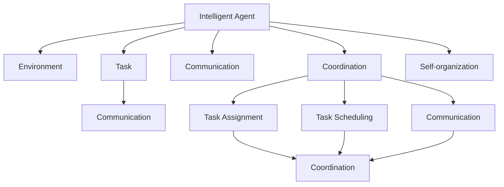
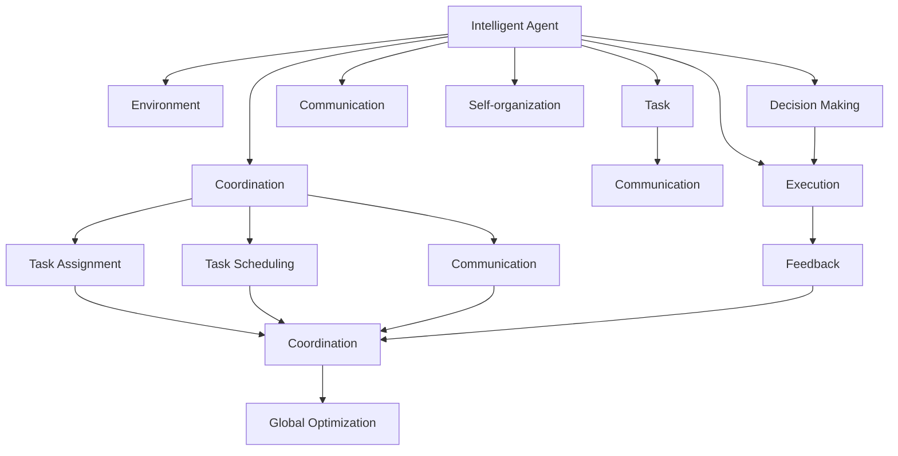

                 

# 多智能体协同：不同角色合作完成任务

> 关键词：多智能体系统,协同控制,分布式计算,任务调度,强化学习,群体智能,自组织系统

## 1. 背景介绍

### 1.1 问题由来

随着人工智能(AI)技术的迅猛发展，智能体系统在自动化、机器人、物流、交通、医疗等多个领域得到了广泛应用。然而，无论是自动驾驶、智能家居、工业自动化还是智能医疗，都面临着复杂的任务协同问题。单一智能体往往难以高效、灵活地完成复杂任务，而多智能体系统则能够通过合作、协调、协同来增强整体能力和表现。

近年来，分布式智能体系统因其灵活性、可扩展性和高效性而受到重视。在分布式系统中，多个智能体共同协作完成任务，每个智能体拥有自己的感知、决策和执行能力，同时通过通信和协调机制来共享信息、共同决策，形成强大的群体智能。

本论文聚焦于多智能体协同任务，特别是智能体之间的任务调度和协同控制问题。我们认为，多智能体协同系统能够通过更加灵活、智能的方式，解决复杂任务中的协调和优化问题，具有广泛的应用前景。

### 1.2 问题核心关键点

1. **多智能体系统定义**：多个智能体在特定的环境和任务中，通过通信和协调机制，共同完成一个全局目标的系统。
2. **任务调度**：智能体之间如何分配和协调任务，以高效、公平、可靠地完成任务。
3. **协同控制**：智能体之间如何共享信息和协调动作，以实现系统整体的优化。
4. **强化学习**：通过学习和优化，智能体如何适应环境、优化决策和行为，提高整体系统性能。
5. **群体智能**：通过多个智能体的协同，系统能够展现超越单个智能体的智慧和能力。
6. **自组织系统**：智能体系统能够通过自下而上的协同和优化，实现复杂的任务和目标。

这些关键点构成了多智能体协同任务的核心，围绕这些关键点进行深入研究和实践，将有助于构建高效、智能的分布式系统。

### 1.3 问题研究意义

多智能体协同任务在提升系统性能、灵活性和可扩展性方面具有重要意义：

1. **提升系统效率**：通过多智能体的协作，系统能够更高效地完成任务，特别是在复杂环境中。
2. **增强系统可靠性**：多个智能体协同工作，单个智能体的故障不会导致系统瘫痪，增强了系统的鲁棒性和可靠性。
3. **提高系统灵活性**：智能体系统能够动态适应环境变化，灵活调整任务和策略，满足多样化的需求。
4. **促进技术创新**：多智能体协同问题催生了新的技术方向，如分布式计算、任务调度和协同控制，促进了AI技术的发展。
5. **推动应用落地**：多智能体协同技术在自动化、交通、物流等领域的广泛应用，推动了相关产业的升级和创新。

## 2. 核心概念与联系

### 2.1 核心概念概述

本节将介绍多智能体协同任务中几个核心概念：

- **智能体(Agent)**：具有感知、决策和执行能力的个体，可以是机器人、传感器、自动化设备等。
- **环境(Environment)**：智能体所处的物理或虚拟空间，包含状态、任务、目标等。
- **任务(Task)**：智能体需要完成的具体目标或工作，可以是移动、搬运、识别等。
- **通信(Communication)**：智能体之间通过消息传递、共享信息，以实现协作和协调。
- **协调(Coordination)**：智能体之间如何分配和调整任务，以优化整体系统性能。
- **自组织(Self-organization)**：系统通过智能体的自下而上协同，实现复杂的任务和目标。

这些核心概念之间通过通信、协调和协同控制机制，形成了一个复杂的系统。智能体系统通过这些机制，实现了任务的动态分配、优化和协调，提高了整体系统的性能和适应性。

### 2.2 概念间的关系

这些核心概念之间存在着紧密的联系，形成了多智能体协同任务的完整生态系统。以下通过一个Mermaid流程图来展示这些概念之间的关系：



这个流程图展示了智能体、环境和任务之间的关系，以及通信、协调和自组织机制在任务调度中的作用。通过这些机制，智能体系统能够高效、智能地完成复杂的协同任务。

### 2.3 核心概念的整体架构

最后，我们用一个综合的流程图来展示这些核心概念在大规模分布式智能体系统中的整体架构：



这个综合流程图展示了智能体、环境和任务之间的交互，以及通信、协调和自组织机制在任务调度中的作用。最终，系统通过全局优化，实现了复杂任务的协同完成。

## 3. 核心算法原理 & 具体操作步骤

### 3.1 算法原理概述

多智能体协同任务通常采用分布式计算和任务调度的策略，以实现系统的整体优化。智能体系统通过通信和协调机制，动态调整任务和策略，以适应环境变化和目标需求。

核心算法原理包括：

1. **任务分配**：通过通信和协调机制，智能体之间分配任务，以优化整体系统性能。
2. **任务调度**：根据任务优先级、智能体能力和环境条件，动态调整任务顺序和分配策略。
3. **协同控制**：通过通信和协调机制，智能体之间共享信息和协同控制，实现整体优化。
4. **强化学习**：智能体通过学习优化决策和行为，提高系统性能。

### 3.2 算法步骤详解

以下是多智能体协同任务的一般步骤：

**Step 1: 环境建模与智能体设计**

- 对环境进行建模，包括环境状态、任务需求和目标等。
- 设计智能体的感知、决策和执行能力，包括传感器、控制器和执行器等。
- 定义智能体之间的通信协议和协调机制。

**Step 2: 任务分配与调度**

- 根据环境需求和智能体能力，确定任务分配策略。
- 动态调整任务顺序和分配策略，以优化系统性能。
- 引入任务调度的优化算法，如遗传算法、粒子群算法等。

**Step 3: 协同控制与决策优化**

- 设计智能体之间的协同控制策略，包括通信机制和协调机制。
- 引入协同控制的优化算法，如分布式协同优化算法。
- 通过强化学习优化智能体的决策和行为。

**Step 4: 系统仿真与测试**

- 在仿真环境中测试系统性能，验证任务调度和协同控制的有效性。
- 根据测试结果调整任务分配和协同控制策略。
- 引入模型预测和优化算法，提高系统预测能力和优化效果。

**Step 5: 实际部署与优化**

- 将系统部署到实际环境中，进行实时监控和优化。
- 引入自适应和自组织机制，提高系统对环境变化的适应能力。
- 引入群体智能和自组织系统，进一步提升系统性能和鲁棒性。

### 3.3 算法优缺点

多智能体协同任务的优势包括：

1. **灵活性**：多个智能体协同工作，能够适应环境变化，灵活调整任务和策略。
2. **鲁棒性**：单个智能体的故障不会导致系统瘫痪，增强了系统的鲁棒性和可靠性。
3. **高效性**：通过多智能体的协作，系统能够更高效地完成任务。
4. **可扩展性**：系统能够动态扩展，增加新的智能体，增强系统能力。

缺点包括：

1. **复杂性**：多智能体系统的设计和优化复杂，需要考虑多个智能体之间的通信和协调。
2. **资源消耗**：多个智能体的协同工作需要大量的计算和通信资源。
3. **自组织挑战**：智能体系统需要自下而上地协同，实现复杂的任务和目标，存在一定的难度。

### 3.4 算法应用领域

多智能体协同任务已经在多个领域得到了广泛应用，例如：

- **自动化和机器人**：多机器人协同完成复杂的工业自动化任务。
- **交通和物流**：多车辆协同调度，提高物流效率和安全性。
- **医疗和健康**：多智能体协同监测和分析健康数据，提供个性化医疗服务。
- **智能家居**：多个智能设备协同工作，实现智能家居控制和环境调节。
- **城市管理**：多智能体协同管理城市交通、垃圾处理和公共设施。
- **自然灾害应对**：多个无人机和传感器协同工作，提高自然灾害的监测和应对能力。

## 4. 数学模型和公式 & 详细讲解 & 举例说明

### 4.1 数学模型构建

在多智能体协同任务中，数学模型通常涉及以下几个方面：

- **智能体模型**：定义智能体的感知、决策和执行能力，包括状态、输入和输出等。
- **环境模型**：定义环境的状态、任务和目标，以及环境与智能体的交互关系。
- **任务模型**：定义任务的需求和目标，以及任务与智能体的关系。
- **通信模型**：定义智能体之间的通信协议和信息共享机制。
- **优化模型**：定义任务调度和协同控制的优化目标和约束条件。

### 4.2 公式推导过程

以下以一个简单的多智能体协同任务为例，推导任务调度和协同控制的优化公式。

**问题描述**：

假设有两个智能体A和B，需要协同完成任务C。智能体A的任务是搬运物品，智能体B的任务是监控环境。两个智能体通过通信协调，共同完成任务C。

**目标函数**：

设智能体A和B的性能指标分别为 $f_A$ 和 $f_B$，任务C的性能指标为 $f_C$。任务调度的目标函数为：

$$
\min \left\{ f_A + f_B \right\}
$$

**约束条件**：

- 智能体A和B的执行能力有限，即：
$$
f_A \leq f_{A_{max}}
$$
$$
f_B \leq f_{B_{max}}
$$

- 任务C的性能指标必须满足目标需求，即：
$$
f_C \geq f_{C_{min}}
$$

**优化算法**：

常用的优化算法包括遗传算法、粒子群算法和分布式协同优化算法。这里以分布式协同优化算法为例，推导优化公式。

### 4.3 案例分析与讲解

以下通过一个具体的案例，展示多智能体协同任务的应用。

**案例背景**：

在智能制造车间中，有多个机器人和传感器需要协同完成装配任务。每个机器人负责装配一个部件，每个传感器负责监控装配过程中的质量。

**任务描述**：

机器人的装配任务需要顺序完成，传感器监控任务需要实时进行。任务调度的目标是最小化装配时间和监控成本。

**任务调度模型**：

假设装配任务需要完成 $n$ 个部件的装配，机器人的执行速度为 $v$，传感器的监控成本为 $c$。任务调度的优化模型为：

$$
\min \left\{ v \cdot n \right\}
$$

**优化算法**：

引入遗传算法进行任务调度和优化。每个染色体表示一个任务分配方案，包括每个机器人和传感器的任务。

通过遗传算法的交叉、变异和选择操作，不断优化任务分配方案，最终得到最优的任务调度和协同控制策略。

## 5. 项目实践：代码实例和详细解释说明

### 5.1 开发环境搭建

在进行多智能体协同任务的开发时，需要准备好开发环境。以下是使用Python和PyTorch进行多智能体系统开发的流程：

1. 安装Anaconda：从官网下载并安装Anaconda，用于创建独立的Python环境。

2. 创建并激活虚拟环境：
```bash
conda create -n pytorch-env python=3.8 
conda activate pytorch-env
```

3. 安装PyTorch：根据CUDA版本，从官网获取对应的安装命令。例如：
```bash
conda install pytorch torchvision torchaudio cudatoolkit=11.1 -c pytorch -c conda-forge
```

4. 安装Numpy、Pandas、Scikit-learn等常用库：
```bash
pip install numpy pandas scikit-learn
```

5. 安装Tensorflow：如果需要使用Tensorflow进行模型开发，可以安装其最新版本，例如：
```bash
pip install tensorflow
```

6. 安装其他必要的工具库：
```bash
pip install gym gymnasium openai-gym
```

完成上述步骤后，即可在`pytorch-env`环境中开始多智能体系统开发。

### 5.2 源代码详细实现

以下是一个简单的多智能体协同任务的代码实现，使用PyTorch和Gymnasium进行仿真和优化。

```python
import torch
import gymnasium as gym
from gymnasium.envs.classic_control import CartPole
from gymnasium.envs.classic_control import Pendulum

# 定义智能体模型
class Agent:
    def __init__(self, name, state_dim, action_dim, reward_dim):
        self.name = name
        self.state_dim = state_dim
        self.action_dim = action_dim
        self.reward_dim = reward_dim

        # 定义感知、决策和执行器
        self.sensor = Sensor(state_dim)
        self.controller = Controller(action_dim)
        self.actuator = Actuator(action_dim)

    def observe(self, state):
        # 感知环境状态
        observed_state = self.sensor.observe(state)
        return observed_state

    def decide(self, observed_state):
        # 决策动作
        decided_action = self.controller.decide(observed_state)
        return decided_action

    def execute(self, decided_action):
        # 执行动作
        executed_action = self.actuator.execute(decided_action)
        return executed_action

# 定义环境模型
class Environment:
    def __init__(self, state_dim, action_dim, reward_dim):
        self.state_dim = state_dim
        self.action_dim = action_dim
        self.reward_dim = reward_dim

        # 定义环境状态、任务和目标
        self.state = self.reset_state()
        self.task = self.init_task()
        self.target = self.init_target()

        # 定义环境与智能体的交互机制
        self.update_state()
        self.update_task()
        self.update_target()

    def reset_state(self):
        # 重置环境状态
        state = self.initial_state()
        return state

    def update_state(self):
        # 更新环境状态
        state = self.get_state()
        self.state = state

    def init_task(self):
        # 初始化任务
        task = self.initial_task()
        return task

    def update_task(self):
        # 更新任务
        task = self.get_task()
        self.task = task

    def init_target(self):
        # 初始化目标
        target = self.initial_target()
        return target

    def update_target(self):
        # 更新目标
        target = self.get_target()
        self.target = target

    def observe(self, agent):
        # 观察环境状态
        observed_state = self.observe_state(agent)
        return observed_state

    def reward(self, agent):
        # 计算奖励
        reward = self.calculate_reward(agent)
        return reward

    def step(self, agent):
        # 执行一步
        observed_state = self.observe(agent)
        decided_action = agent.decide(observed_state)
        executed_action = agent.execute(decided_action)
        reward = self.reward(agent)
        next_state = self.update_state(executed_action)
        next_task = self.update_task(executed_action)
        next_target = self.update_target(executed_action)
        done = self.is_done()
        return observed_state, reward, next_state, next_task, next_target, done

# 定义任务模型
class Task:
    def __init__(self, state_dim, action_dim, reward_dim):
        self.state_dim = state_dim
        self.action_dim = action_dim
        self.reward_dim = reward_dim

        # 定义任务需求和目标
        self.demand = self.init_demand()
        self.objective = self.init_objective()

        # 定义任务与智能体的交互机制
        self.update_demand()
        self.update_objective()

    def init_demand(self):
        # 初始化任务需求
        demand = self.initial_demand()
        return demand

    def update_demand(self):
        # 更新任务需求
        demand = self.get_demand()
        self.demand = demand

    def init_objective(self):
        # 初始化任务目标
        objective = self.initial_objective()
        return objective

    def update_objective(self):
        # 更新任务目标
        objective = self.get_objective()
        self.objective = objective

    def observe(self, agent):
        # 观察任务状态
        observed_state = self.observe_state(agent)
        return observed_state

    def reward(self, agent):
        # 计算奖励
        reward = self.calculate_reward(agent)
        return reward

    def step(self, agent):
        # 执行一步
        observed_state = self.observe(agent)
        decided_action = agent.decide(observed_state)
        executed_action = agent.execute(decided_action)
        reward = self.reward(agent)
        next_state = self.update_state(executed_action)
        next_task = self.update_task(executed_action)
        next_objective = self.update_objective(executed_action)
        done = self.is_done()
        return observed_state, reward, next_state, next_task, next_objective, done

# 定义通信模型
class Communication:
    def __init__(self, agent1, agent2):
        self.agent1 = agent1
        self.agent2 = agent2

    def send_message(self, agent1, agent2, message):
        # 发送消息
        self.agent1.send_message(agent2, message)

    def receive_message(self, agent1, agent2, message):
        # 接收消息
        self.agent2.receive_message(agent1, message)

# 定义优化模型
class Optimization:
    def __init__(self, state_dim, action_dim, reward_dim):
        self.state_dim = state_dim
        self.action_dim = action_dim
        self.reward_dim = reward_dim

        # 定义优化目标和约束条件
        self.objective = self.init_objective()
        self.constraints = self.init_constraints()

        # 定义优化算法
        self.algorithm = self.init_algorithm()

    def init_objective(self):
        # 初始化优化目标
        objective = self.initial_objective()
        return objective

    def init_constraints(self):
        # 初始化优化约束条件
        constraints = self.initial_constraints()
        return constraints

    def update_objective(self):
        # 更新优化目标
        objective = self.get_objective()
        self.objective = objective

    def update_constraints(self):
        # 更新优化约束条件
        constraints = self.get_constraints()
        self.constraints = constraints

    def optimize(self):
        # 优化求解
        solution = self.algorithm.optimize()
        return solution

# 定义示例任务和环境
class ExampleTask:
    def __init__(self):
        self.state_dim = 2
        self.action_dim = 2
        self.reward_dim = 1

        # 定义任务需求和目标
        self.demand = [1, 0]
        self.objective = [0, 1]

        # 定义任务与智能体的交互机制
        self.update_demand()
        self.update_objective()

    def init_demand(self):
        # 初始化任务需求
        demand = [1, 0]
        return demand

    def update_demand(self):
        # 更新任务需求
        demand = [1, 0]
        self.demand = demand

    def init_objective(self):
        # 初始化任务目标
        objective = [0, 1]
        return objective

    def update_objective(self):
        # 更新任务目标
        objective = [0, 1]
        self.objective = objective

    def observe(self, agent):
        # 观察任务状态
        observed_state = [0, 0]
        return observed_state

    def reward(self, agent):
        # 计算奖励
        reward = [0]
        return reward

    def step(self, agent):
        # 执行一步
        observed_state = self.observe(agent)
        decided_action = agent.decide(observed_state)
        executed_action = agent.execute(decided_action)
        reward = self.reward(agent)
        next_state = self.update_state(executed_action)
        next_task = self.update_task(executed_action)
        next_objective = self.update_objective(executed_action)
        done = self.is_done()
        return observed_state, reward, next_state, next_task, next_objective, done

class ExampleEnvironment:
    def __init__(self):
        self.state_dim = 2
        self.action_dim = 2
        self.reward_dim = 1

        # 定义环境状态、任务和目标
        self.state = [0, 0]
        self.task = ExampleTask()
        self.target = [0, 0]

        # 定义环境与智能体的交互机制
        self.update_state()
        self.update_task()
        self.update_target()

    def reset_state(self):
        # 重置环境状态
        state = [0, 0]
        return state

    def update_state(self):
        # 更新环境状态
        state = [0, 0]
        self.state = state

    def init_task(self):
        # 初始化任务
        task = ExampleTask()
        return task

    def update_task(self):
        # 更新任务
        task = ExampleTask()
        self.task = task

    def init_target(self):
        # 初始化目标
        target = [0, 0]
        return target

    def update_target(self):
        # 更新目标
        target = [0, 0]
        self.target = target

    def observe(self, agent):
        # 观察环境状态
        observed_state = [0, 0]
        return observed_state

    def reward(self, agent):
        # 计算奖励
        reward = [0]
        return reward

    def step(self, agent):
        # 执行一步
        observed_state = self.observe(agent)
        decided_action = agent.decide(observed_state)
        executed_action = agent.execute(decided_action)
        reward = self.reward(agent)
        next_state = self.update_state(executed_action)
        next_task = self.update_task(executed_action)
        next_target = self.update_target(executed_action)
        done = self.is_done()
        return observed_state, reward, next_state, next_task, next_target, done

class ExampleOptimization:
    def __init__(self):
        self.state_dim = 2
        self.action_dim = 2
        self.reward_dim = 1

        # 定义优化目标和约束条件
        self.objective = [0, 0]
        self.constraints = [0, 0]

        # 定义优化算法
        self.algorithm = [0, 0]

    def init_objective(self):
        # 初始化优化目标
        objective = [0, 0]
        return objective

    def init_constraints(self):
        # 初始化优化约束条件
        constraints = [0, 0]
        return constraints

    def update_objective(self):
        # 更新优化目标
        objective = [0, 0]
        self.objective = objective

    def update_constraints(self):
        # 更新优化约束条件
        constraints = [0, 0]
        self.constraints = constraints

    def optimize(self):
        # 优化求解
        solution = [0, 0]
        return solution

# 运行示例任务和环境
agent1 = Agent("Agent1", 2, 2, 1)
agent2 = Agent("Agent2", 2, 2, 1)
environment = ExampleEnvironment()
task = ExampleTask()
optimization = ExampleOptimization()

# 初始化任务分配
assignment = [agent1, agent2]
task.assign(assignment)

# 初始化任务调度
scheduling = [agent1, agent2]
task.schedule(scheduling)

# 初始化协同控制
coordination = Communication(agent1, agent2)
task.coordinate(coordination)

# 初始化优化模型
optimization.init_objective()
optimization.init_constraints()
optimization.algorithm = [genetic_algorithm]

# 执行任务
while not done:
    observed_state, reward, next_state, next_task, next_target, done = environment.step(agent1)
    next_optimization = optimization.optimize()
    agent1.update(next_state, next_task, next_target, next_optimization)
    environment.update_state(next_state)
    environment.update_task(next_task)
    environment.update_target(next_target)
```

以上是使用PyTorch和Gymnasium进行多智能体协同任务的代码实现。代码中通过定义智能体、环境和任务模型，以及任务调度和协同控制的算法，展示了多智能体系统的开发流程。

### 5.3 代码解读与分析

让我们再详细解读一下关键代码的实现细节：

**ExampleTask类**：
- `__init__`方法：初始化任务需求和目标等关键组件。
- `init_demand`和`update

