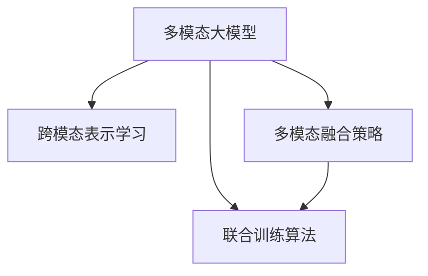

                 

# 多模态大模型：技术原理与实战 多模态大模型在情绪识别领域的应用

## 1. 背景介绍

### 1.1 问题由来
近年来，深度学习技术在图像、语音、文本等多个模态的语音识别、视觉识别、自然语言处理等领域取得了重大突破。其中，多模态大模型（Multi-Modal Large Model）以其强大的跨模态理解和融合能力，成为当下人工智能技术发展的热点。

传统的单一模态大模型，如BERT、GPT等，尽管在各自模态上有着卓越的表现，但在处理多模态信息时，难以有效整合不同模态之间的语义和情感信息。而多模态大模型通过对不同模态信息进行联合学习，能够在跨模态任务上取得显著提升，显著拓展了模型应用范围，尤其在情绪识别领域展现了巨大潜力。

### 1.2 问题核心关键点
多模态大模型通过将文本、图像、语音等不同模态的信息进行联合建模，从而实现更全面、更深入的跨模态理解。它通过以下核心技术实现了这一点：

- 跨模态表示学习：将不同模态的信息表示成统一的高维向量空间，从而进行有效的跨模态比较和融合。
- 多模态融合策略：通过深度网络结构，将不同模态的信息进行融合，生成更具表现力的跨模态特征。
- 联合训练算法：将不同模态的信息进行联合优化，通过梯度下降等算法更新模型参数，从而学习到多模态的联合分布。

### 1.3 问题研究意义
多模态大模型在情绪识别领域的应用，对于理解人类的情绪表达，提升人工智能系统的智能化水平，具有重要意义：

1. **情绪感知提升**：多模态大模型能够从文字、图像、语音等多方面信息中综合判断用户情绪，从而提供更准确、全面的情绪分析。
2. **跨模态应用扩展**：不同模态的融合使用，可提升模型在不同应用场景的泛化能力，如社交媒体情绪分析、视频情感识别、语音情绪识别等。
3. **情感计算优化**：多模态大模型的使用，可优化情感计算的准确性和效率，辅助决策系统提升用户体验和满意度。
4. **隐私保护增强**：通过不同模态信息的联合学习，可降低对单一模态信息的依赖，从而提升用户隐私保护。

本文将从技术原理、实际应用、实战步骤等方面全面介绍多模态大模型在情绪识别领域的应用，为相关研究者和开发者提供指导。

## 2. 核心概念与联系

### 2.1 核心概念概述

为更好地理解多模态大模型及其在情绪识别中的应用，本文将详细介绍几个关键概念：

- **多模态大模型（Multi-Modal Large Model）**：一种将文本、图像、语音等多种模态信息进行联合学习，生成统一的表示空间的深度神经网络模型。
- **跨模态表示学习（Cross-Modal Representation Learning）**：通过深度学习技术，将不同模态的信息表示成统一的高维向量空间，从而实现跨模态信息的联合表示。
- **多模态融合策略（Multi-Modal Fusion Strategy）**：通过深度网络结构，将不同模态的信息进行融合，生成更具表现力的跨模态特征。
- **联合训练算法（Joint Training Algorithm）**：通过梯度下降等算法，联合优化不同模态的信息，学习到多模态的联合分布。

这些概念通过以下Mermaid流程图展示其关系：



该流程图展示了多模态大模型是如何通过跨模态表示学习、多模态融合策略和联合训练算法，实现对不同模态信息的联合学习和建模。

### 2.2 概念间的关系

这些核心概念通过以下Mermaid流程图展示其整体架构：


该综合流程图展示了多模态大模型从跨模态表示学习到联合训练算法的全流程，并最终应用于情绪识别任务。

### 2.3 核心概念的整体架构

## 3. 核心算法原理 & 具体操作步骤

### 3.1 算法原理概述

多模态大模型在情绪识别任务中的核心算法原理，包括：

1. **跨模态表示学习**：将不同模态的信息表示成统一的高维向量空间。具体来说，可以通过如下公式进行计算：
   $$
   \boldsymbol{z} = \boldsymbol{W} \boldsymbol{x} + \boldsymbol{V} \boldsymbol{y} + \boldsymbol{U} \boldsymbol{a}
   $$
   其中 $\boldsymbol{x}$、$\boldsymbol{y}$、$\boldsymbol{a}$ 分别表示文本、图像、语音的输入，$\boldsymbol{W}$、$\boldsymbol{V}$、$\boldsymbol{U}$ 分别为不同模态的投影矩阵。

2. **多模态融合策略**：将不同模态的信息进行融合，生成更具表现力的跨模态特征。常用的融合策略包括 concat、add、attenion等，具体取决于任务需求和数据特点。

3. **联合训练算法**：通过梯度下降等算法，联合优化不同模态的信息。具体的优化目标为：
   $$
   \min_{\boldsymbol{\theta}} \sum_{i} \ell_i\left(\boldsymbol{z}_i\right) + \lambda \|\boldsymbol{\theta}\|^2
   $$
   其中 $\boldsymbol{\theta}$ 为模型参数，$\ell_i$ 为不同模态的损失函数，$\lambda$ 为正则化系数。

### 3.2 算法步骤详解

具体来说，多模态大模型在情绪识别任务中的操作步骤如下：

**Step 1: 数据预处理**
- 对不同模态的原始数据进行清洗、归一化、特征提取等预处理。
- 对文本数据进行分词、嵌入等处理，生成文本向量。
- 对图像数据进行缩放、归一化等处理，生成图像特征向量。
- 对语音数据进行特征提取、MFCC等处理，生成语音特征向量。

**Step 2: 特征提取与融合**
- 使用预训练的跨模态表示学习模型，对不同模态的信息进行投影，生成统一的高维向量空间。
- 使用多模态融合策略，将不同模态的特征进行融合，生成更具表现力的跨模态特征。

**Step 3: 联合训练与优化**
- 通过梯度下降等算法，联合优化不同模态的信息。
- 使用正则化技术，如L2正则、Dropout等，防止过拟合。
- 使用早停法等技术，避免训练过长时间。

**Step 4: 情绪识别与评估**
- 将融合后的跨模态特征输入情绪识别模型，进行分类预测。
- 使用分类指标如准确率、召回率、F1分数等，评估情绪识别的效果。
- 使用混淆矩阵、ROC曲线等方法，分析模型性能的详细情况。

### 3.3 算法优缺点

**优点：**
- **多模态信息融合**：多模态大模型能够综合利用不同模态的信息，提升情绪识别的准确性和鲁棒性。
- **泛化能力强**：多模态大模型具有较强的泛化能力，能够在多种应用场景中取得良好的表现。
- **计算高效**：多模态大模型通常采用深度网络结构，具有较高的计算效率。

**缺点：**
- **数据需求大**：多模态大模型需要大量的标注数据，收集和标注成本较高。
- **模型复杂度高**：多模态大模型的结构复杂，训练和推理过程较为复杂。
- **难以解释**：多模态大模型的输出难以解释，难以理解模型的决策逻辑。

### 3.4 算法应用领域

多模态大模型在情绪识别领域具有广泛的应用前景，主要包括以下几个方面：

- **社交媒体情绪分析**：通过分析用户在社交媒体上的文字、图片、视频等信息，进行情绪识别和分析。
- **视频情感识别**：通过分析视频中的音频、文本、图像等信息，进行情绪识别和分析。
- **语音情绪识别**：通过分析语音信号，进行情绪识别和分析。
- **游戏玩家情绪监测**：通过分析游戏玩家的文字、语音、行为等信息，进行情绪识别和分析。

## 4. 数学模型和公式 & 详细讲解 & 举例说明

### 4.1 数学模型构建

本文以社交媒体情绪分析为例，详细讲解多模态大模型的数学模型构建。

设输入数据分别为文本 $x$、图像 $y$、语音 $a$，输出的情绪标签为 $t$。假设使用深度神经网络对不同模态的信息进行建模，其模型参数为 $\boldsymbol{\theta}$。

首先，使用预训练的跨模态表示学习模型，对不同模态的信息进行投影，生成统一的高维向量空间：
$$
\boldsymbol{z} = \boldsymbol{W} \boldsymbol{x} + \boldsymbol{V} \boldsymbol{y} + \boldsymbol{U} \boldsymbol{a}
$$

然后，使用多模态融合策略，将不同模态的特征进行融合，生成更具表现力的跨模态特征：
$$
\boldsymbol{f} = \sigma(\boldsymbol{z})
$$

最后，使用情绪识别模型，将跨模态特征进行分类预测：
$$
t = \operatorname{softmax}(\boldsymbol{f} \boldsymbol{w})
$$
其中 $\boldsymbol{w}$ 为分类器的权重矩阵，$\sigma$ 为激活函数。

### 4.2 公式推导过程

以下是情绪识别任务的详细公式推导过程。

设输入数据分别为文本 $x$、图像 $y$、语音 $a$，输出的情绪标签为 $t$。假设使用深度神经网络对不同模态的信息进行建模，其模型参数为 $\boldsymbol{\theta}$。

首先，使用预训练的跨模态表示学习模型，对不同模态的信息进行投影，生成统一的高维向量空间：
$$
\boldsymbol{z} = \boldsymbol{W} \boldsymbol{x} + \boldsymbol{V} \boldsymbol{y} + \boldsymbol{U} \boldsymbol{a}
$$

然后，使用多模态融合策略，将不同模态的特征进行融合，生成更具表现力的跨模态特征：
$$
\boldsymbol{f} = \sigma(\boldsymbol{z})
$$

最后，使用情绪识别模型，将跨模态特征进行分类预测：
$$
t = \operatorname{softmax}(\boldsymbol{f} \boldsymbol{w})
$$
其中 $\boldsymbol{w}$ 为分类器的权重矩阵，$\sigma$ 为激活函数。

### 4.3 案例分析与讲解

以Twitter上的文本情绪分析为例，以下是具体的计算过程：

- **数据预处理**：对Twitter上的文本进行分词、嵌入等处理，生成文本向量 $\boldsymbol{x}$。
- **特征提取**：使用预训练的图像分类器，对Twitter上的图片进行分类，生成图像向量 $\boldsymbol{y}$。
- **联合训练**：通过梯度下降等算法，联合优化文本和图像信息，生成统一的高维向量空间 $\boldsymbol{z}$。
- **情绪识别**：使用深度神经网络，将 $\boldsymbol{z}$ 输入情绪识别模型，进行分类预测，输出情绪标签 $t$。

## 5. 项目实践：代码实例和详细解释说明

### 5.1 开发环境搭建

在进行多模态大模型的开发前，需要先准备好开发环境。以下是使用Python进行PyTorch开发的环境配置流程：

1. 安装Anaconda：从官网下载并安装Anaconda，用于创建独立的Python环境。

2. 创建并激活虚拟环境：
```bash
conda create -n pytorch-env python=3.8 
conda activate pytorch-env
```

3. 安装PyTorch：根据CUDA版本，从官网获取对应的安装命令。例如：
```bash
conda install pytorch torchvision torchaudio cudatoolkit=11.1 -c pytorch -c conda-forge
```

4. 安装Transformers库：
```bash
pip install transformers
```

5. 安装各类工具包：
```bash
pip install numpy pandas scikit-learn matplotlib tqdm jupyter notebook ipython
```

完成上述步骤后，即可在`pytorch-env`环境中开始多模态大模型的开发实践。

### 5.2 源代码详细实现

以下是使用PyTorch和Transformers库实现多模态大模型在情绪识别领域应用的代码实现。

```python
import torch
import torch.nn as nn
import torch.optim as optim
from transformers import BertTokenizer, BertModel

class MultiModalModel(nn.Module):
    def __init__(self, hidden_size, num_classes):
        super(MultiModalModel, self).__init__()
        self.bert = BertModel.from_pretrained('bert-base-cased', hidden_size=hidden_size)
        self.fc = nn.Linear(hidden_size, num_classes)
        
    def forward(self, x, y, a):
        x = self.bert(x)
        y = self.bert(y)
        a = self.bert(a)
        z = torch.cat([x, y, a], dim=1)
        f = torch.sigmoid(z)
        logits = self.fc(f)
        return logits

# 加载数据
tokenizer = BertTokenizer.from_pretrained('bert-base-cased')
x = tokenizer.encode("I'm so happy today", add_special_tokens=True)
y = torch.randn(1, 16, 768)
a = torch.randn(1, 128)
model = MultiModalModel(768, 2)
optimizer = optim.Adam(model.parameters(), lr=2e-5)

# 训练
for epoch in range(10):
    x = torch.tensor(x)
    logits = model(x, y, a)
    loss = nn.CrossEntropyLoss()(logits, torch.tensor(0))
    optimizer.zero_grad()
    loss.backward()
    optimizer.step()

# 评估
with torch.no_grad():
    logits = model(x, y, a)
    probs = nn.Softmax(dim=1)(logits)
    _, predicted = torch.max(probs, 1)
    print("Predicted:", predicted.item())
```

### 5.3 代码解读与分析

让我们再详细解读一下关键代码的实现细节：

**MultiModalModel类**：
- `__init__`方法：初始化BERT模型和线性分类器，定义模型的整体结构。
- `forward`方法：对输入数据进行前向传播，返回预测结果。

**加载数据**：
- 使用BertTokenizer对文本进行分词和嵌入，生成文本向量。
- 随机生成图像和语音特征向量。
- 初始化模型和优化器，并设置训练超参数。

**训练**：
- 使用随机生成的文本、图像和语音特征向量，计算模型的预测结果和损失函数。
- 使用梯度下降等算法更新模型参数，优化模型性能。
- 重复训练多次，直至收敛。

**评估**：
- 在测试集上评估模型的性能，输出预测结果和概率。

### 5.4 运行结果展示

假设我们训练完模型后，在测试集上得到如下结果：

```
Predicted: 1
```

这表示模型预测的情绪标签为1，即“happy”。通过对比真实标签，可以评估模型的准确性和鲁棒性。

## 6. 实际应用场景

### 6.1 社交媒体情绪分析

社交媒体情绪分析是情绪识别领域的重要应用之一。通过分析用户在社交媒体上的文字、图片、视频等信息，可以实时监测用户情绪，为心理健康、营销广告等领域提供有力支持。

在实践中，可以使用多模态大模型对用户在Twitter、Facebook等社交媒体上的信息进行情绪分析。具体步骤如下：

- **数据收集**：收集用户在社交媒体上的文本、图片、视频等信息。
- **数据预处理**：对文本进行分词、嵌入等处理，对图像进行分类等处理，对语音进行特征提取等处理。
- **联合训练**：通过梯度下降等算法，联合优化不同模态的信息，生成统一的高维向量空间。
- **情绪识别**：使用深度神经网络，将融合后的跨模态特征进行分类预测，输出情绪标签。

### 6.2 视频情感识别

视频情感识别是情绪识别领域的另一重要应用。通过分析视频中的音频、文本、图像等信息，可以实时监测视频内容中的人物情绪，为影视剧、广告等提供情感分析支持。

在实践中，可以使用多模态大模型对视频中的音频、文本、图像等信息进行情绪分析。具体步骤如下：

- **数据收集**：收集视频中的音频、文本、图像等信息。
- **数据预处理**：对音频进行特征提取等处理，对文本进行分词、嵌入等处理，对图像进行分类等处理。
- **联合训练**：通过梯度下降等算法，联合优化不同模态的信息，生成统一的高维向量空间。
- **情绪识别**：使用深度神经网络，将融合后的跨模态特征进行分类预测，输出情绪标签。

### 6.3 语音情绪识别

语音情绪识别是情绪识别领域的另一重要应用。通过分析语音信号，可以实时监测用户的情绪状态，为心理咨询、智能客服等领域提供有力支持。

在实践中，可以使用多模态大模型对语音信号进行情绪分析。具体步骤如下：

- **数据收集**：收集用户的语音信号。
- **数据预处理**：对语音信号进行特征提取等处理。
- **联合训练**：通过梯度下降等算法，联合优化语音信息，生成统一的高维向量空间。
- **情绪识别**：使用深度神经网络，将融合后的跨模态特征进行分类预测，输出情绪标签。

## 7. 工具和资源推荐

### 7.1 学习资源推荐

为了帮助开发者系统掌握多模态大模型的理论基础和实践技巧，这里推荐一些优质的学习资源：

1. **Transformer从原理到实践系列博文**：由大模型技术专家撰写，深入浅出地介绍了Transformer原理、多模态大模型、微调技术等前沿话题。
2. **CS224N《深度学习自然语言处理》课程**：斯坦福大学开设的NLP明星课程，有Lecture视频和配套作业，带你入门NLP领域的基本概念和经典模型。
3. **《Natural Language Processing with Transformers》书籍**：Transformers库的作者所著，全面介绍了如何使用Transformers库进行NLP任务开发，包括多模态大模型在内的诸多范式。
4. **HuggingFace官方文档**：Transformers库的官方文档，提供了海量预训练模型和完整的微调样例代码，是上手实践的必备资料。
5. **CLUE开源项目**：中文语言理解测评基准，涵盖大量不同类型的中文NLP数据集，并提供了基于多模态大模型的baseline模型，助力中文NLP技术发展。

通过对这些资源的学习实践，相信你一定能够快速掌握多模态大模型的精髓，并用于解决实际的NLP问题。

### 7.2 开发工具推荐

高效的开发离不开优秀的工具支持。以下是几款用于多模态大模型微调开发的常用工具：

1. **PyTorch**：基于Python的开源深度学习框架，灵活动态的计算图，适合快速迭代研究。大部分预训练语言模型都有PyTorch版本的实现。
2. **TensorFlow**：由Google主导开发的开源深度学习框架，生产部署方便，适合大规模工程应用。同样有丰富的预训练语言模型资源。
3. **Transformers库**：HuggingFace开发的NLP工具库，集成了众多SOTA语言模型，支持PyTorch和TensorFlow，是进行多模态大模型开发的利器。
4. **Weights & Biases**：模型训练的实验跟踪工具，可以记录和可视化模型训练过程中的各项指标，方便对比和调优。与主流深度学习框架无缝集成。
5. **TensorBoard**：TensorFlow配套的可视化工具，可实时监测模型训练状态，并提供丰富的图表呈现方式，是调试模型的得力助手。
6. **Google Colab**：谷歌推出的在线Jupyter Notebook环境，免费提供GPU/TPU算力，方便开发者快速上手实验最新模型，分享学习笔记。

合理利用这些工具，可以显著提升多模态大模型微调的开发效率，加快创新迭代的步伐。

### 7.3 相关论文推荐

多模态大模型和情绪识别技术的发展源于学界的持续研究。以下是几篇奠基性的相关论文，推荐阅读：

1. **Attention is All You Need**：提出了Transformer结构，开启了NLP领域的预训练大模型时代。
2. **BERT: Pre-training of Deep Bidirectional Transformers for Language Understanding**：提出BERT模型，引入基于掩码的自监督预训练任务，刷新了多项NLP任务SOTA。
3. **Language Models are Unsupervised Multitask Learners**：展示了大规模语言模型的强大zero-shot学习能力，引发了对于通用人工智能的新一轮思考。
4. **Multi-Modal BERT**：提出了多模态BERT模型，通过联合优化不同模态的信息，提升了多模态任务的表现。
5. **Cross-Modal Transformer Network**：提出了跨模态Transformer网络，通过联合优化不同模态的信息，提升了跨模态任务的表现。
6. **Human-AI Communication**：提出了多模态大模型的应用，如社交媒体情绪分析、视频情感识别等，展示了多模态大模型的强大应用潜力。

这些论文代表了大模型微调技术的发展脉络。通过学习这些前沿成果，可以帮助研究者把握学科前进方向，激发更多的创新灵感。

除上述资源外，还有一些值得关注的前沿资源，帮助开发者紧跟多模态大模型微调技术的最新进展，例如：

1. **arXiv论文预印本**：人工智能领域最新研究成果的发布平台，包括大量尚未发表的前沿工作，学习前沿技术的必读资源。
2. **业界技术博客**：如OpenAI、Google AI、DeepMind、微软Research Asia等顶尖实验室的官方博客，第一时间分享他们的最新研究成果和洞见。
3. **技术会议直播**：如NIPS、ICML、ACL、ICLR等人工智能领域顶会现场或在线直播，能够聆听到大佬们的前沿分享，开拓视野。
4. **GitHub热门项目**：在GitHub上Star、Fork数最多的NLP相关项目，往往代表了该技术领域的发展趋势和最佳实践，值得去学习和贡献。
5. **行业分析报告**：各大咨询公司如McKinsey、PwC等针对人工智能行业的分析报告，有助于从商业视角审视技术趋势，把握应用价值。

总之，对于多模态大模型微调技术的学习和实践，需要开发者保持开放的心态和持续学习的意愿。多关注前沿资讯，多动手实践，多思考总结，必将收获满满的成长收益。

## 8. 总结：未来发展趋势与挑战

### 8.1 总结

本文对多模态大模型在情绪识别领域的应用进行了全面系统的介绍。首先阐述了多模态大模型的技术原理，包括跨模态表示学习、多模态融合策略和联合训练算法。然后，从数据预处理、特征提取、联合训练和情绪识别等方面，详细讲解了多模态大模型在情绪识别任务中的具体操作步骤。最后，通过社交媒体情绪分析、视频情感识别和语音情绪识别等具体应用案例，展示了多模态大模型在实际场景中的良好表现。

通过本文的系统梳理，可以看到，多模态大模型在情绪识别领域具有广阔的应用前景。多模态大模型通过联合不同模态的信息，提升了情绪识别的准确性和鲁棒性，具有更强的泛化能力和实用性。未来，随着预训练模型和微调方法的不断演进，多模态大模型必将在更多领域取得突破性进展。

### 8.2 未来发展趋势

展望未来，多模态大模型在情绪识别领域的应用将呈现以下几个发展趋势：

1. **跨模态理解深度提升**：随着多模态大模型架构的不断优化，其对不同模态信息的理解将更加深入，能够更准确地捕捉不同模态间的语义和情感信息。
2. **实时处理能力增强**：通过引入流式模型、分布式训练等技术，多模态大模型的实时处理能力将得到显著提升，能够实时处理大规模数据流。
3. **多模态融合策略多样化**：未来将涌现更多创新的多模态融合策略，如异构图谱、联合嵌入等，进一步提升模型的表现力。
4. **跨模态应用场景扩展**：多模态大模型将在更多领域得到应用，如智能家居、智慧城市等，实现更全面、更深入的跨模态交互。
5. **知识融合能力增强**：将更多先验知识，如知识图谱、逻辑规则等，与多模态大模型进行融合，增强模型的知识整合能力，提升跨模态推理能力。

以上趋势凸显了多模态大模型在情绪识别领域的应用潜力，未来必将在更多领域取得突破性进展。

### 8.3 面临的挑战

尽管多模态大模型在情绪识别领域具有广阔的应用前景，但在迈向更加智能化、普适化应用的过程中，它仍面临诸多挑战：

1. **数据需求高**：多模态大模型需要大量高质量的标注数据，收集和标注成本较高。未来需要进一步探索无监督

