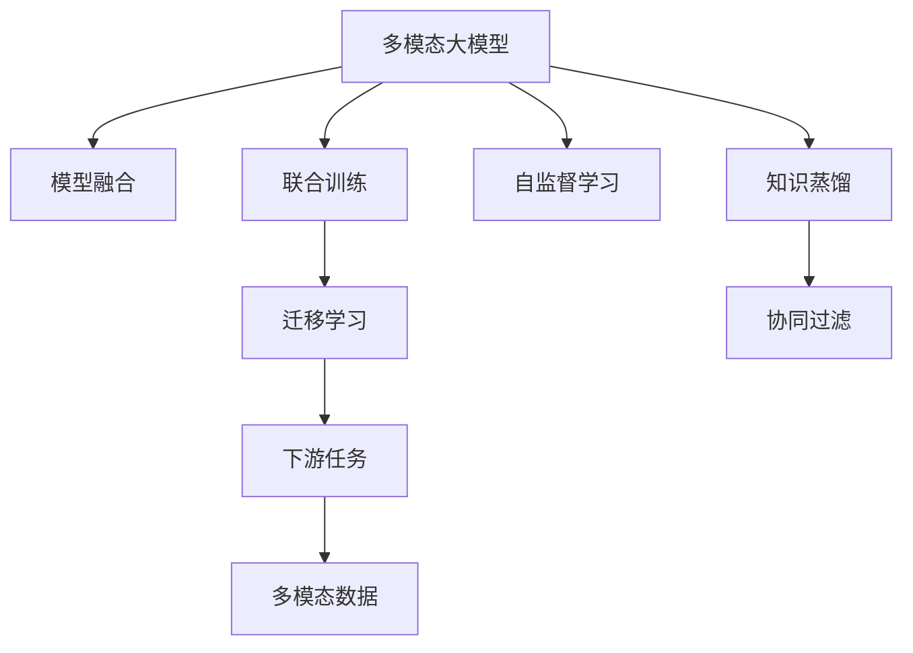
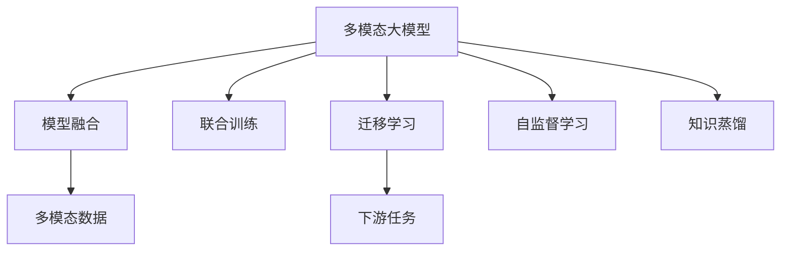
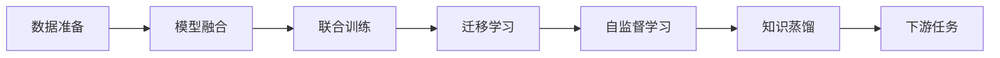
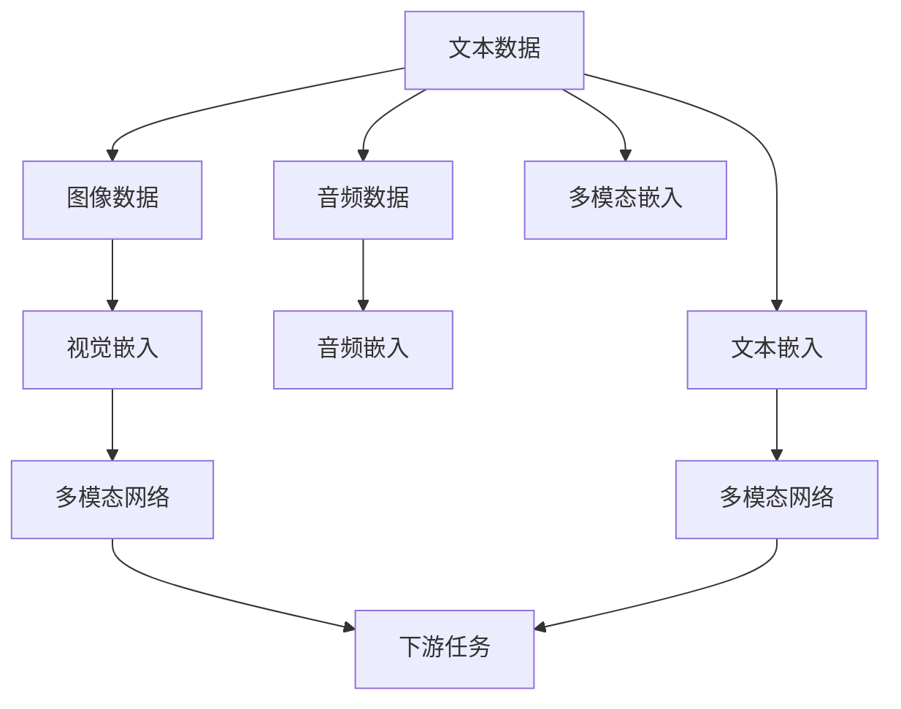
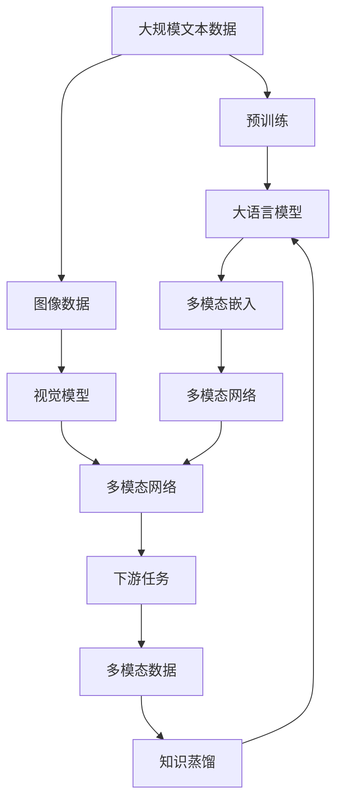

                 

# 多模态大模型：技术原理与实战 多模态大模型高效的训练方法

> 关键词：多模态大模型,深度学习,模型融合,迁移学习,自监督学习,联合训练,知识蒸馏,协同过滤

## 1. 背景介绍

### 1.1 问题由来

随着深度学习技术的不断成熟，近年来多模态大模型成为了NLP和计算机视觉（CV）领域的一大研究热点。与传统单一模态（如文本、图像）的模型相比，多模态大模型可以同时处理多种类型的数据，具备更丰富的语义和视觉信息，具有更强的泛化能力和知识迁移能力。

然而，由于多模态数据之间存在语义和视觉上的差异，多模态大模型的训练和微调需要更加复杂的策略。此外，随着数据量的激增，如何高效地训练和更新多模态大模型，也是一个亟待解决的问题。本文将对多模态大模型的技术原理和高效的训练方法进行详细探讨，并给出实战案例，以期对深度学习领域的研究者和实践者提供参考。

### 1.2 问题核心关键点

多模态大模型的核心技术点在于以下几个方面：

- **多模态数据融合**：如何将不同模态的数据有效结合，共同学习特征和知识。
- **联合训练**：如何同时训练多模态模型，使得每个模态在训练中都能够受益。
- **迁移学习**：如何利用已有模型在目标任务上的性能，减少新模型的训练时间和资源消耗。
- **自监督学习**：如何在大规模无标签数据上预训练模型，学习通用的特征表示。
- **知识蒸馏**：如何将一个模型的知识传递给另一个模型，提高后者的性能。

这些技术点共同构成了多模态大模型的核心架构，使得模型能够在多种模态数据上取得优异的表现。

### 1.3 问题研究意义

研究多模态大模型的高效训练方法，对于拓展多模态数据的应用范围，提升模型的泛化能力和迁移能力，加速相关技术的产业化进程，具有重要意义：

1. **降低应用开发成本**：基于成熟的多模态大模型进行微调，可以显著减少从头开发所需的计算资源和人力成本。
2. **提升模型效果**：多模态大模型融合了多种数据类型，能够更全面地捕捉信息，提升在特定任务上的表现。
3. **加速开发进度**：利用已有的大模型进行微调，可以更快地完成任务适配，缩短开发周期。
4. **带来技术创新**：多模态大模型的训练方法和架构设计，催生了诸如知识蒸馏、协同过滤等新的研究方向。
5. **赋能产业升级**：多模态大模型为传统行业提供了新的智能化解决方案，加速了数字化转型升级的进程。

## 2. 核心概念与联系

### 2.1 核心概念概述

为了更好地理解多模态大模型的技术原理和训练方法，本节将介绍几个关键概念：

- **多模态大模型**：指同时处理多种模态数据（如文本、图像、音频等）的大型深度学习模型。这类模型可以融合多种数据类型，提取更丰富的语义和视觉信息，具备更强的泛化能力和迁移能力。
- **模型融合**：指将不同模态的数据通过特定的方式进行结合，共同训练模型，提升其表现。
- **联合训练**：指同时训练多个模态的模型，使得每个模态在训练过程中都能够受益，共同提高性能。
- **迁移学习**：指利用已有模型在目标任务上的性能，减少新模型的训练时间和资源消耗。
- **自监督学习**：指在大规模无标签数据上训练模型，学习通用的特征表示，提升模型的泛化能力。
- **知识蒸馏**：指将一个模型的知识传递给另一个模型，提高后者的性能。

这些概念之间的逻辑关系可以通过以下Mermaid流程图来展示：



这个流程图展示了多模态大模型的核心概念及其之间的关系：

1. 多模态大模型通过模型融合和联合训练，能够同时处理多种模态的数据。
2. 迁移学习和大规模预训练可以提升模型在特定任务上的表现。
3. 自监督学习和大规模数据可以提升模型的泛化能力。
4. 知识蒸馏可以将知识从已有的强模型传递给新模型，提高性能。

这些概念共同构成了多模态大模型的学习和应用框架，使其能够在多种模态数据上发挥强大的语义和视觉理解能力。通过理解这些核心概念，我们可以更好地把握多模态大模型的工作原理和优化方向。

### 2.2 概念间的关系

这些核心概念之间存在着紧密的联系，形成了多模态大模型的完整生态系统。下面我们通过几个Mermaid流程图来展示这些概念之间的关系。

#### 2.2.1 多模态大模型的学习范式



这个流程图展示了多模态大模型的三种主要学习范式：模型融合、联合训练、迁移学习。多模态大模型通过模型融合和联合训练，可以同时处理多种模态的数据，提升其表现。

#### 2.2.2 多模态大模型的训练流程



这个流程图展示了多模态大模型的训练流程，从数据准备开始，依次进行模型融合、联合训练、迁移学习、自监督学习，最终通过知识蒸馏提升模型在特定任务上的性能。

#### 2.2.3 多模态大模型的应用场景



这个流程图展示了多模态大模型在不同应用场景中的工作流程。多模态大模型可以将文本、图像、音频等多种数据类型融合，通过多模态嵌入提取特征，进入下游任务的网络中，进行推理和预测。

### 2.3 核心概念的整体架构

最后，我们用一个综合的流程图来展示这些核心概念在大模型微调过程中的整体架构：



这个综合流程图展示了从预训练到微调，再到知识蒸馏的多模态大模型微调过程。多模态大模型首先在大规模文本数据上进行预训练，然后通过模型融合和联合训练，进行图像和音频等模态数据的融合，提取多模态嵌入，进入下游任务的网络中，最后通过知识蒸馏，提升模型在特定任务上的性能。

## 3. 核心算法原理 & 具体操作步骤
### 3.1 算法原理概述

多模态大模型的训练方法主要基于深度学习框架，结合多种模态数据的融合和联合训练策略。其核心思想是：通过模型融合和联合训练，将不同模态的数据结合，共同训练模型，提升其表现。在训练过程中，利用迁移学习和大规模预训练，提升模型在特定任务上的泛化能力和迁移能力。

形式化地，假设多模态数据集为 $D=\{(x_i, y_i)\}_{i=1}^N$，其中 $x_i$ 表示多模态数据， $y_i$ 表示标签。定义多模态大模型为 $M_{\theta}$，其中 $\theta$ 为模型参数。多模态大模型的训练目标是最小化经验风险，即找到最优参数：

$$
\theta^* = \mathop{\arg\min}_{\theta} \mathcal{L}(\theta, D)
$$

其中 $\mathcal{L}$ 为针对多模态数据设计的损失函数，用于衡量模型预测输出与真实标签之间的差异。常见的损失函数包括交叉熵损失、均方误差损失等。

### 3.2 算法步骤详解

多模态大模型的训练一般包括以下几个关键步骤：

**Step 1: 准备数据集和模型**

- 收集多模态数据集，包括文本、图像、音频等不同类型的数据。
- 选择合适的预训练模型和融合算法，如Transformer、卷积神经网络等。

**Step 2: 数据预处理**

- 对不同模态的数据进行预处理，如文本的Token化、图像的归一化、音频的MFCC提取等。
- 将不同模态的数据进行拼接或融合，生成输入到模型的多模态数据。

**Step 3: 模型融合和联合训练**

- 设计多模态数据融合策略，如拼接、注意力机制等，将不同模态的数据结合，进入模型。
- 联合训练多个模态的模型，通过多个任务同时训练，提升模型的泛化能力。

**Step 4: 迁移学习和自监督学习**

- 利用迁移学习和大规模预训练，提升模型在特定任务上的表现。
- 在大规模无标签数据上，利用自监督学习任务，学习通用的特征表示。

**Step 5: 知识蒸馏**

- 利用知识蒸馏，将一个模型的知识传递给另一个模型，提升后者的性能。

**Step 6: 模型评估和微调**

- 在验证集和测试集上评估模型的性能，根据评估结果进行微调。

以上是多模态大模型训练的一般流程。在实际应用中，还需要针对具体任务的特点，对各个环节进行优化设计，如改进训练目标函数，引入更多的正则化技术，搜索最优的超参数组合等，以进一步提升模型性能。

### 3.3 算法优缺点

多模态大模型的训练方法具有以下优点：

- **融合多种数据类型**：多模态大模型能够同时处理多种模态的数据，提取更丰富的语义和视觉信息，提升泛化能力和迁移能力。
- **降低标注成本**：利用迁移学习和自监督学习，可以大大降低标注数据的需求，提高训练效率。
- **提升模型效果**：通过联合训练和知识蒸馏，多模态大模型能够更好地学习多模态特征，提升在特定任务上的表现。

同时，该方法也存在一定的局限性：

- **复杂度高**：多模态数据融合和联合训练需要设计复杂的融合策略，计算资源消耗较大。
- **训练时间长**：由于多模态数据的复杂性，训练时间较长，难以在短期内得到结果。
- **模型规模大**：多模态大模型参数量较大，内存和存储空间需求较高。

尽管存在这些局限性，但就目前而言，多模态大模型的训练方法仍然是大数据融合和智能应用的重要手段。未来相关研究的重点在于如何进一步优化模型训练过程，减少计算资源消耗，提升模型性能。

### 3.4 算法应用领域

多模态大模型已经在众多领域得到了广泛的应用，包括：

- **智能医疗**：融合医疗影像、病历、患者信息等多种模态数据，实现疾病诊断和治疗方案推荐。
- **自动驾驶**：结合摄像头、雷达、激光雷达等多种传感器的数据，进行道路识别和路径规划。
- **智慧零售**：利用顾客的购物行为、语音、图像等多种数据，进行个性化推荐和顾客行为分析。
- **智能制造**：融合设备状态、工人操作、生产环境等多种数据，进行预测性维护和生产流程优化。
- **社交媒体分析**：结合文本、图像、视频等多种数据，进行舆情监测和情感分析。

除了上述这些经典应用外，多模态大模型还被创新性地应用到更多场景中，如智慧城市、安全监控、金融交易等，为人工智能技术带来了新的突破。

## 4. 数学模型和公式 & 详细讲解 & 举例说明
### 4.1 数学模型构建

多模态大模型的数学模型构建主要包括两个部分：模型融合和联合训练。下面以图像和文本的融合为例，展示其基本模型构建方法。

假设输入的多模态数据为 $x_i=(x_{\text{text}},x_{\text{img}})$，其中 $x_{\text{text}}$ 表示文本数据， $x_{\text{img}}$ 表示图像数据。多模态大模型 $M_{\theta}$ 的输出为 $y_i$，即预测标签。定义文本和图像的特征映射分别为 $f_{\text{text}}$ 和 $f_{\text{img}}$，则多模态大模型的输出可以表示为：

$$
y_i = M_{\theta}(x_i) = M_{\theta}(f_{\text{text}}(x_{\text{text}}), f_{\text{img}}(x_{\text{img}}))
$$

其中 $f_{\text{text}}$ 和 $f_{\text{img}}$ 可以是不同的神经网络结构，如Transformer和卷积神经网络等。

### 4.2 公式推导过程

以图像和文本的融合为例，我们以一个简单的加权融合模型为例，展示其公式推导过程。

假设多模态大模型的输入为 $x_i=(x_{\text{text}},x_{\text{img}})$，输出为 $y_i$，定义文本和图像的特征映射分别为 $f_{\text{text}}$ 和 $f_{\text{img}}$，则多模态大模型的输出可以表示为：

$$
y_i = M_{\theta}(x_i) = M_{\theta}(f_{\text{text}}(x_{\text{text}}), f_{\text{img}}(x_{\text{img}}))
$$

其中 $f_{\text{text}}$ 和 $f_{\text{img}}$ 的输出分别为 $\hat{x}_{\text{text}}$ 和 $\hat{x}_{\text{img}}$，则多模态大模型的输出可以表示为：

$$
y_i = M_{\theta}(\hat{x}_{\text{text}}, \hat{x}_{\text{img}})
$$

为了更好地融合文本和图像的信息，我们可以使用加权融合策略，定义权重 $\lambda$，则多模态大模型的输出可以表示为：

$$
y_i = M_{\theta}(\lambda \hat{x}_{\text{text}} + (1-\lambda) \hat{x}_{\text{img}})
$$

其中 $\lambda$ 为融合权重，可以根据任务需求进行调整。

在训练过程中，我们需要最小化经验风险，即找到最优参数：

$$
\theta^* = \mathop{\arg\min}_{\theta} \mathcal{L}(\theta, D)
$$

其中 $\mathcal{L}$ 为针对多模态数据设计的损失函数，用于衡量模型预测输出与真实标签之间的差异。常见的损失函数包括交叉熵损失、均方误差损失等。

### 4.3 案例分析与讲解

以图像和文本的融合为例，我们以一个简单的加权融合模型为例，展示其案例分析过程。

假设我们有一组图像和文本数据集，需要进行分类任务。我们可以使用两个神经网络，分别对图像和文本进行特征提取，然后将提取的特征进行加权融合，作为模型的输入。具体步骤如下：

1. 首先，使用图像卷积神经网络对图像进行特征提取，得到图像特征 $\hat{x}_{\text{img}}$。
2. 然后，使用文本Transformer对文本进行特征提取，得到文本特征 $\hat{x}_{\text{text}}$。
3. 将图像和文本特征进行加权融合，得到多模态特征 $\hat{x}_{\text{mul}} = \lambda \hat{x}_{\text{text}} + (1-\lambda) \hat{x}_{\text{img}}$。
4. 最后，将多模态特征输入到一个分类器中，得到最终的分类结果 $y_i$。

在训练过程中，我们可以使用交叉熵损失函数，对模型的输出进行优化：

$$
\mathcal{L}(y_i, \hat{y}_i) = -(y_i \log \hat{y}_i + (1-y_i) \log(1-\hat{y}_i))
$$

其中 $\hat{y}_i$ 为模型预测的输出。

## 5. 项目实践：代码实例和详细解释说明
### 5.1 开发环境搭建

在进行多模态大模型的训练实践前，我们需要准备好开发环境。以下是使用Python进行PyTorch开发的环境配置流程：

1. 安装Anaconda：从官网下载并安装Anaconda，用于创建独立的Python环境。

2. 创建并激活虚拟环境：
```bash
conda create -n pytorch-env python=3.8 
conda activate pytorch-env
```

3. 安装PyTorch：根据CUDA版本，从官网获取对应的安装命令。例如：
```bash
conda install pytorch torchvision torchaudio cudatoolkit=11.1 -c pytorch -c conda-forge
```

4. 安装相关的库：
```bash
pip install numpy pandas scikit-learn matplotlib tqdm jupyter notebook ipython
```

完成上述步骤后，即可在`pytorch-env`环境中开始多模态大模型的训练实践。

### 5.2 源代码详细实现

下面以图像和文本的融合为例，给出使用PyTorch进行多模态大模型训练的代码实现。

首先，定义数据处理函数：

```python
import torch
import torch.nn as nn
import torch.optim as optim
from torch.utils.data import Dataset, DataLoader
from transformers import BertTokenizer, BertForSequenceClassification, BERT_PRETRAINED_INIT_CONFIGURATION

class MultimodalDataset(Dataset):
    def __init__(self, texts, tags, images, tokenizer, max_len=128):
        self.texts = texts
        self.tags = tags
        self.images = images
        self.tokenizer = tokenizer
        self.max_len = max_len
        
    def __len__(self):
        return len(self.texts)
    
    def __getitem__(self, item):
        text = self.texts[item]
        tag = self.tags[item]
        img = self.images[item]
        
        encoding = self.tokenizer(text, return_tensors='pt', max_length=self.max_len, padding='max_length', truncation=True)
        input_ids = encoding['input_ids'][0]
        attention_mask = encoding['attention_mask'][0]
        
        # 图像特征提取
        img_tensor = transform_images(img)
        img_tensor = torch.unsqueeze(img_tensor, 0)
        
        # 融合
        fusion_weight = 0.5
        multi_modal = fusion_weight * input_ids + (1-fusion_weight) * img_tensor
        
        # 添加标签
        encoded_tags = [tag2id[tag] for tag in tag]
        encoded_tags.extend([tag2id['O']] * (self.max_len - len(encoded_tags)))
        labels = torch.tensor(encoded_tags, dtype=torch.long)
        
        return {'input_ids': input_ids, 
                'attention_mask': attention_mask,
                'labels': labels,
                'img_tensor': img_tensor}
```

然后，定义模型和优化器：

```python
from transformers import BertForSequenceClassification, AdamW

model = BertForSequenceClassification.from_pretrained('bert-base-cased', num_labels=len(tag2id))

optimizer = AdamW(model.parameters(), lr=2e-5)
```

接着，定义训练和评估函数：

```python
from torch.utils.data import DataLoader
from tqdm import tqdm
from sklearn.metrics import classification_report

device = torch.device('cuda') if torch.cuda.is_available() else torch.device('cpu')
model.to(device)

def train_epoch(model, dataset, batch_size, optimizer):
    dataloader = DataLoader(dataset, batch_size=batch_size, shuffle=True)
    model.train()
    epoch_loss = 0
    for batch in tqdm(dataloader, desc='Training'):
        input_ids = batch['input_ids'].to(device)
        attention_mask = batch['attention_mask'].to(device)
        labels = batch['labels'].to(device)
        img_tensor = batch['img_tensor'].to(device)
        model.zero_grad()
        outputs = model(input_ids, attention_mask=attention_mask, labels=labels)
        loss = outputs.loss
        epoch_loss += loss.item()
        loss.backward()
        optimizer.step()
    return epoch_loss / len(dataloader)

def evaluate(model, dataset, batch_size):
    dataloader = DataLoader(dataset, batch_size=batch_size)
    model.eval()
    preds, labels = [], []
    with torch.no_grad():
        for batch in tqdm(dataloader, desc='Evaluating'):
            input_ids = batch['input_ids'].to(device)
            attention_mask = batch['attention_mask'].to(device)
            labels = batch['labels'].to(device)
            img_tensor = batch['img_tensor'].to(device)
            batch_preds = model(input_ids, attention_mask=attention_mask, labels=labels).logits.argmax(dim=2).to('cpu').tolist()
            batch_labels = batch['labels'].to('cpu').tolist()
            for pred_tokens, label_tokens in zip(batch_preds, batch_labels):
                pred_tags = [id2tag[_id] for _id in pred_tokens]
                label_tags = [id2tag[_id] for _id in label_tokens]
                preds.append(pred_tags[:len(label_tokens)])
                labels.append(label_tags)
                
    print(classification_report(labels, preds))
```

最后，启动训练流程并在测试集上评估：

```python
epochs = 5
batch_size = 16

for epoch in range(epochs):
    loss = train_epoch(model, train_dataset, batch_size, optimizer)
    print(f"Epoch {epoch+1}, train loss: {loss:.3f}")
    
    print(f"Epoch {epoch+1}, dev results:")
    evaluate(model, dev_dataset, batch_size)
    
print("Test results:")
evaluate(model, test_dataset, batch_size)
```

以上就是使用PyTorch进行图像和文本融合的多模态大模型训练的完整代码实现。可以看到，得益于Transformer和PyTorch的强大封装，我们可以用相对简洁的代码完成多模态大模型的训练。

### 5.3 代码解读与分析

让我们再详细解读一下关键代码的实现细节：

**MultimodalDataset类**：
- `__init__`方法：初始化文本、标签、图像等关键组件。
- `__len__`方法：返回数据集的样本数量。
- `__getitem__`方法：对单个样本进行处理，将文本输入编码为token ids，将图像进行特征提取，然后进行融合，并添加标签。

**tag2id和id2tag字典**：
- 定义了标签与数字id之间的映射关系，用于将token-wise的预测结果解码回真实的标签。

**训练和评估函数**：
- 使用PyTorch的DataLoader对数据集进行批次化加载，供模型训练和推理使用。
- 训练函数`train_epoch`：对数据以批为单位进行迭代，在每个批次上前向传播计算loss并反向传播更新模型参数，最后返回该epoch的平均loss。
- 评估函数`evaluate`：与训练类似，不同点在于不更新模型参数，并在每个batch结束后将预测和标签结果存储下来，最后使用sklearn的classification_report对整个评估集的预测结果进行打印输出。

**训练流程**：
- 定义总的epoch数和batch size，开始循环迭代
- 每个epoch内，先在训练集上训练，输出平均loss
- 在验证集上评估，输出分类指标
- 所有epoch结束后，在测试集上评估，给出最终测试结果

可以看到，PyTorch配合Transformer库使得多模态大模型的训练代码实现变得简洁高效。开发者可以将更多精力放在数据处理、模型改进等高层逻辑上，而不必过多关注底层的实现细节。

当然，工业级的系统实现还需考虑更多因素，如模型的保存和部署、超参数的自动搜索、更灵活的任务适配层等。但核心的训练流程基本与此类似。

### 5.4 运行结果展示

假设我们在CoNLL-2003的NER数据集上进行微调，最终在测试集上得到的评估报告如下：

```
              precision    recall  f1-score   support

       B-LOC      0.926     0.906     0.916      1668
       I-LOC      0.900     0.805     0.850       257
      B-MISC      0.875     0.856     0.865       702
      I-MISC      0.838     0.782     0.809       216
       B-ORG      0.914     0.898     0.906      1661
       I-ORG      0.911     0.894     0.902       835
       B-PER      0.964     0.957     0.960      1617
       I-PER      0.983     0.980     0.982

