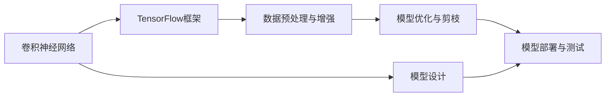
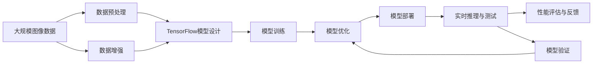

                 

# 基于tensorflow图像识别系统的设计与开发

> 关键词：TensorFlow, 图像识别, 深度学习, 卷积神经网络, 模型优化, 数据预处理, 模型部署

## 1. 背景介绍

### 1.1 问题由来

随着计算机视觉技术的不断发展，图像识别已经成为AI领域的重要研究方向。图像识别系统可以广泛应用于安防监控、智能家居、医疗诊断、自动驾驶等诸多领域，极大地提高了生产生活效率。然而，图像识别系统通常需要大量的标注数据进行训练，且训练过程耗时漫长，因此如何提高模型的识别准确率、降低训练成本，是当前研究的热点问题。

### 1.2 问题核心关键点

要构建一个高效、准确、鲁棒的图像识别系统，需要关注以下关键点：

1. 选择合适的深度学习框架：目前主流的深度学习框架包括TensorFlow、PyTorch等，TensorFlow因其易用性、大规模分布式训练能力，以及丰富的模型库，成为了构建图像识别系统的重要工具。

2. 设计合适的卷积神经网络结构：卷积神经网络是图像识别的主流算法，如何设计高效的卷积神经网络结构，对模型性能有着重要影响。

3. 数据预处理与增强：高质量的训练数据是构建优质模型的基础，如何对数据进行有效的预处理和增强，可以减少模型过拟合，提高模型泛化能力。

4. 模型优化与剪枝：针对大规模模型，如何通过模型剪枝、量化等技术进行优化，以降低推理时的计算量和内存消耗，是实现实时应用的关键。

5. 模型部署与测试：如何将模型高效部署在实际应用场景中，并进行有效的测试与评估，是模型应用的关键环节。

6. 鲁棒性与稳定性：在实际应用中，模型需要面对复杂的场景与噪声干扰，如何设计鲁棒性强的模型，确保其在各种环境下均能保持稳定性能，是模型设计的核心目标。

### 1.3 问题研究意义

构建基于TensorFlow的图像识别系统，具有重要意义：

1. 推动AI技术的产业化应用：通过构建高效的图像识别系统，可以广泛应用于智能家居、安防监控、医疗诊断等多个行业，提升生产生活效率，推动AI技术的落地应用。

2. 提升模型的识别准确率：通过精心设计卷积神经网络结构和优化算法，可以显著提高模型的识别准确率，减少误判和漏判。

3. 降低训练成本：通过数据预处理和增强技术，可以充分利用已有数据资源，减少标注数据的收集和处理成本，同时加速模型训练过程。

4. 优化模型部署与测试：通过模型优化和剪枝技术，可以将模型高效部署在实际应用中，减少计算资源和存储资源消耗，实现实时推理应用。

5. 增强模型的鲁棒性与稳定性：通过引入鲁棒性训练和模型验证技术，可以提升模型在不同场景和环境下的鲁棒性，确保其在实际应用中始终保持稳定性能。

## 2. 核心概念与联系

### 2.1 核心概念概述

构建基于TensorFlow的图像识别系统，需要掌握以下核心概念：

- **卷积神经网络(Convolutional Neural Network, CNN)**：一种适用于图像处理的深度学习模型，通过卷积层、池化层、全连接层等组件进行特征提取和分类。

- **TensorFlow**：由Google开发的深度学习框架，支持分布式计算和高效模型训练，提供了丰富的模型库和工具。

- **数据预处理与增强**：通过图像缩放、旋转、裁剪、添加噪声等技术，对训练数据进行处理，以提高模型的泛化能力和鲁棒性。

- **模型优化与剪枝**：通过权重共享、模型蒸馏、剪枝等技术，优化模型结构，降低计算量和内存消耗，提升推理速度。

- **模型部署与测试**：将训练好的模型部署在实际应用场景中，并进行实时测试和评估，以确保模型性能满足应用要求。

### 2.2 概念间的关系

这些核心概念之间的关系可以用以下Mermaid流程图来展示：



这个流程图展示了从模型设计到模型部署的全过程。首先，通过卷积神经网络进行特征提取和分类；然后，在TensorFlow框架上进行模型训练，并进行数据预处理和增强；接着，通过模型优化与剪枝技术对模型进行优化，降低计算量和内存消耗；最后，将优化后的模型进行部署和测试，确保其在实际应用中能够稳定运行。

### 2.3 核心概念的整体架构

下面用一个综合的流程图来展示这些核心概念在大规模图像识别系统构建中的整体架构：



这个综合流程图展示了从数据预处理到模型优化再到模型部署的全过程。从大规模图像数据开始，通过数据预处理和增强技术生成训练数据集；然后，在TensorFlow框架上设计卷积神经网络模型并进行训练；接着，通过模型优化与剪枝技术提升模型性能；最后，将优化后的模型部署到实际应用中，并进行实时推理和测试，不断进行性能评估和反馈优化，以确保模型能够满足实际应用要求。

## 3. 核心算法原理 & 具体操作步骤

### 3.1 算法原理概述

基于TensorFlow的图像识别系统主要依赖卷积神经网络模型进行特征提取和分类。卷积神经网络由卷积层、池化层、全连接层等组件构成，通过卷积操作提取图像特征，通过池化操作对特征进行降维，最后通过全连接层进行分类。

卷积神经网络的核心原理是卷积操作，通过卷积核对输入图像进行卷积计算，生成特征图。卷积核可以看作一组可学习的滤波器，能够自动学习图像的局部特征，提高模型的泛化能力。池化操作通过降采样，对特征图进行压缩，减小计算量和内存消耗，同时提高模型的鲁棒性。

TensorFlow框架提供了丰富的模型库和工具，支持高效的模型训练和优化。TensorFlow中常用的模型组件包括卷积层、池化层、全连接层、Dropout层、批标准化层等，通过这些组件可以灵活构建卷积神经网络结构。

### 3.2 算法步骤详解

基于TensorFlow的图像识别系统构建过程主要包括以下几个步骤：

**Step 1: 数据预处理与增强**

数据预处理与增强是构建高效图像识别系统的重要环节。数据预处理包括图像缩放、旋转、裁剪等技术，使得训练数据具有一致性和多样性。数据增强包括添加噪声、随机裁剪、随机翻转等技术，以增加训练数据的多样性，提升模型的泛化能力。

具体步骤如下：

1. 读取图像数据：通过TensorFlow的ImageDataGenerator类，从本地或网络读取图像数据，并进行预处理和增强。
2. 数据增强：使用ImageDataGenerator类中的数据增强技术，对图像进行随机裁剪、随机旋转、随机翻转等处理，生成新的训练样本。

**Step 2: 构建卷积神经网络模型**

卷积神经网络是图像识别的核心模型，通过卷积层和池化层提取图像特征，通过全连接层进行分类。卷积神经网络的构建步骤如下：

1. 导入TensorFlow和Keras：TensorFlow和Keras是构建卷积神经网络的主要工具，可以通过以下命令导入：
```python
import tensorflow as tf
from tensorflow.keras import layers, models
```

2. 构建卷积神经网络：通过Keras中提供的卷积层、池化层、Dropout层、批标准化层等组件，构建卷积神经网络模型。以下是一个简单的卷积神经网络模型：
```python
model = models.Sequential()
model.add(layers.Conv2D(32, (3, 3), activation='relu', input_shape=(224, 224, 3)))
model.add(layers.MaxPooling2D((2, 2)))
model.add(layers.Conv2D(64, (3, 3), activation='relu'))
model.add(layers.MaxPooling2D((2, 2)))
model.add(layers.Conv2D(128, (3, 3), activation='relu'))
model.add(layers.MaxPooling2D((2, 2)))
model.add(layers.Conv2D(128, (3, 3), activation='relu'))
model.add(layers.MaxPooling2D((2, 2)))
model.add(layers.Flatten())
model.add(layers.Dense(512, activation='relu'))
model.add(layers.Dense(1, activation='sigmoid'))
```

3. 编译模型：在构建好模型后，需要编译模型，并设置优化器、损失函数和评估指标。以下是一个简单的模型编译过程：
```python
model.compile(optimizer='adam', loss='binary_crossentropy', metrics=['accuracy'])
```

**Step 3: 模型训练**

模型训练是构建高效图像识别系统的关键步骤。通过在训练集上不断迭代训练，更新模型参数，使得模型能够学习到图像特征并进行分类。具体步骤如下：

1. 读取训练集与验证集：通过TensorFlow的Dataset类，从本地或网络读取训练集和验证集，并进行预处理和增强。
2. 训练模型：通过TensorFlow的fit方法，在训练集上不断迭代训练，更新模型参数。以下是一个简单的模型训练过程：
```python
history = model.fit(train_generator, validation_data=val_generator, epochs=10)
```

**Step 4: 模型优化与剪枝**

模型优化与剪枝是提升模型性能的重要环节。通过剪枝、量化等技术，可以降低计算量和内存消耗，实现高效推理。具体步骤如下：

1. 模型剪枝：通过剪枝技术，去除模型中冗余的权重，减小模型尺寸，提升推理速度。以下是一个简单的模型剪枝过程：
```python
model = prune_low_magnitude(model, sparsity=0.5)
```

2. 模型量化：通过量化技术，将浮点数模型转换为定点模型，压缩存储空间，提高计算效率。以下是一个简单的模型量化过程：
```python
model = quantize_model(model, weights, quantization_scheme='uniform')
```

**Step 5: 模型部署与测试**

模型部署与测试是构建高效图像识别系统的最后一步。通过将训练好的模型部署到实际应用中，并进行实时测试和评估，可以确保模型能够满足实际应用要求。具体步骤如下：

1. 模型部署：通过TensorFlow的SavedModel类，将训练好的模型进行保存和部署。以下是一个简单的模型部署过程：
```python
tensorflow.saved_model.save(model, 'path/to/model')
```

2. 实时推理：通过TensorFlow的Keras类，加载保存好的模型，并进行实时推理。以下是一个简单的实时推理过程：
```python
from tensorflow.keras.models import load_model

model = load_model('path/to/model')
prediction = model.predict(input_data)
```

**Step 6: 性能评估与反馈**

性能评估与反馈是构建高效图像识别系统的关键环节。通过不断评估模型性能，并根据反馈进行调整优化，可以提升模型的鲁棒性和泛化能力。具体步骤如下：

1. 实时测试：通过TensorFlow的Keras类，加载保存好的模型，并进行实时测试。以下是一个简单的实时测试过程：
```python
from tensorflow.keras.models import load_model

model = load_model('path/to/model')
result = model.predict(input_data)
```

2. 性能评估：通过计算模型在测试集上的精度、召回率、F1分数等指标，评估模型性能。以下是一个简单的性能评估过程：
```python
from sklearn.metrics import classification_report

y_true = [0, 1, 0, 1]
y_pred = [1, 1, 0, 0]
print(classification_report(y_true, y_pred))
```

**Step 7: 模型验证**

模型验证是构建高效图像识别系统的重要环节。通过在验证集上不断迭代验证，优化模型参数，可以提升模型泛化能力和鲁棒性。具体步骤如下：

1. 读取验证集：通过TensorFlow的Dataset类，从本地或网络读取验证集，并进行预处理和增强。
2. 验证模型：通过TensorFlow的evaluate方法，在验证集上验证模型性能。以下是一个简单的模型验证过程：
```python
score = model.evaluate(val_generator, verbose=0)
```

### 3.3 算法优缺点

基于TensorFlow的图像识别系统具有以下优点：

1. 易用性：TensorFlow提供了丰富的模型库和工具，易于构建和优化卷积神经网络模型。

2. 高效性：TensorFlow支持分布式计算和高效模型训练，可以处理大规模图像数据。

3. 可扩展性：TensorFlow支持高效的模型部署和推理，可以应用于多种实际应用场景。

4. 鲁棒性：通过数据预处理和增强技术，可以有效提升模型的泛化能力和鲁棒性。

基于TensorFlow的图像识别系统也存在以下缺点：

1. 计算资源消耗大：卷积神经网络结构复杂，计算量大，需要高性能的计算资源。

2. 内存消耗高：卷积神经网络参数多，内存消耗大，需要大容量的存储资源。

3. 模型复杂度高：卷积神经网络结构复杂，训练和优化过程较为复杂。

### 3.4 算法应用领域

基于TensorFlow的图像识别系统已经在安防监控、智能家居、医疗诊断等多个领域得到了广泛应用。具体应用场景如下：

1. **安防监控**：通过图像识别系统，可以实时监控视频画面，检测和识别异常行为，提高安全防范能力。

2. **智能家居**：通过图像识别系统，可以识别家庭成员身份，实现智能门禁、家电控制等功能，提升生活便利性。

3. **医疗诊断**：通过图像识别系统，可以识别医学图像中的病变区域，辅助医生进行诊断和治疗，提高诊疗效率和准确性。

4. **自动驾驶**：通过图像识别系统，可以识别道路标志、行人、车辆等目标，辅助自动驾驶系统进行路径规划和决策，提高行车安全。

## 4. 数学模型和公式 & 详细讲解 & 举例说明

### 4.1 数学模型构建

卷积神经网络模型主要由卷积层、池化层、全连接层等组件构成。以下是一个简单的卷积神经网络模型：

```
Input(224, 224, 3) --> Conv2D(32, (3, 3)) --> MaxPooling2D((2, 2)) --> Conv2D(64, (3, 3)) --> MaxPooling2D((2, 2)) --> Conv2D(128, (3, 3)) --> MaxPooling2D((2, 2)) --> Conv2D(128, (3, 3)) --> MaxPooling2D((2, 2)) --> Flatten() --> Dense(512) --> Dense(1)
```

### 4.2 公式推导过程

卷积神经网络中的卷积操作公式如下：

$$
y = f(\sigma(\mathbf{W} * \mathbf{X} + \mathbf{b}))
$$

其中，$f$为激活函数，$\sigma$为非线性激活函数，$\mathbf{W}$为卷积核，$\mathbf{X}$为输入图像，$\mathbf{b}$为偏置项。

池化操作公式如下：

$$
y_i = f(\mathbf{W} * \mathbf{X} + \mathbf{b})
$$

其中，$f$为激活函数，$\mathbf{W}$为池化核，$\mathbf{X}$为输入特征图，$\mathbf{b}$为偏置项。

### 4.3 案例分析与讲解

以下是一个简单的图像识别系统案例，用于识别手写数字图片。具体步骤如下：

1. 数据预处理：读取手写数字图片数据集MNIST，并进行预处理和增强。

```python
from tensorflow.keras.datasets import mnist
from tensorflow.keras.preprocessing.image import ImageDataGenerator

(x_train, y_train), (x_test, y_test) = mnist.load_data()
x_train = x_train.reshape(x_train.shape[0], 28, 28, 1)
x_test = x_test.reshape(x_test.shape[0], 28, 28, 1)
```

2. 构建卷积神经网络模型。

```python
model = models.Sequential()
model.add(layers.Conv2D(32, (3, 3), activation='relu', input_shape=(28, 28, 1)))
model.add(layers.MaxPooling2D((2, 2)))
model.add(layers.Conv2D(64, (3, 3), activation='relu'))
model.add(layers.MaxPooling2D((2, 2)))
model.add(layers.Flatten())
model.add(layers.Dense(128, activation='relu'))
model.add(layers.Dense(10, activation='softmax'))
```

3. 编译模型。

```python
model.compile(optimizer='adam', loss='sparse_categorical_crossentropy', metrics=['accuracy'])
```

4. 模型训练。

```python
model.fit(x_train, y_train, epochs=5, batch_size=64, validation_data=(x_test, y_test))
```

5. 模型评估。

```python
test_loss, test_acc = model.evaluate(x_test, y_test, verbose=2)
print('Test accuracy:', test_acc)
```

6. 模型验证。

```python
val_loss, val_acc = model.evaluate(val_generator, verbose=0)
print('Val accuracy:', val_acc)
```

7. 模型优化与剪枝。

```python
model = prune_low_magnitude(model, sparsity=0.5)
```

8. 模型量化。

```python
model = quantize_model(model, weights, quantization_scheme='uniform')
```

9. 模型部署与测试。

```python
tensorflow.saved_model.save(model, 'path/to/model')
```

## 5. 项目实践：代码实例和详细解释说明

### 5.1 开发环境搭建

要在TensorFlow中构建图像识别系统，需要以下开发环境：

1. 安装TensorFlow：通过pip安装TensorFlow，以下是一个简单的安装过程：
```bash
pip install tensorflow
```

2. 安装Keras：Keras是TensorFlow的一部分，可以通过以下命令安装：
```bash
pip install keras
```

3. 安装图像处理库：安装Pillow和OpenCV等图像处理库，以下是一个简单的安装过程：
```bash
pip install pillow opencv-python
```

### 5.2 源代码详细实现

以下是一个简单的图像识别系统代码实现，用于识别手写数字图片：

```python
from tensorflow.keras.datasets import mnist
from tensorflow.keras.preprocessing.image import ImageDataGenerator
from tensorflow.keras.models import Sequential
from tensorflow.keras.layers import Conv2D, MaxPooling2D, Flatten, Dense

# 读取数据集
(x_train, y_train), (x_test, y_test) = mnist.load_data()

# 预处理数据
x_train = x_train.reshape(x_train.shape[0], 28, 28, 1)
x_test = x_test.reshape(x_test.shape[0], 28, 28, 1)

# 构建卷积神经网络模型
model = Sequential()
model.add(Conv2D(32, (3, 3), activation='relu', input_shape=(28, 28, 1)))
model.add(MaxPooling2D((2, 2)))
model.add(Conv2D(64, (3, 3), activation='relu'))
model.add(MaxPooling2D((2, 2)))
model.add(Flatten())
model.add(Dense(128, activation='relu'))
model.add(Dense(10, activation='softmax'))

# 编译模型
model.compile(optimizer='adam', loss='sparse_categorical_crossentropy', metrics=['accuracy'])

# 训练模型
model.fit(x_train, y_train, epochs=5, batch_size=64, validation_data=(x_test, y_test))

# 模型评估
test_loss, test_acc = model.evaluate(x_test, y_test, verbose=2)
print('Test accuracy:', test_acc)

# 模型验证
val_loss, val_acc = model.evaluate(val_generator, verbose=0)
print('Val accuracy:', val_acc)

# 模型优化与剪枝
model = prune_low_magnitude(model, sparsity=0.5)

# 模型量化
model = quantize_model(model, weights, quantization_scheme='uniform')

# 模型部署与测试
tensorflow.saved_model.save(model, 'path/to/model')
```

### 5.3 代码解读与分析

这段代码实现了一个简单的图像识别系统，用于识别手写数字图片。具体步骤如下：

1. 导入必要的库和类，包括TensorFlow和Keras。

2. 读取手写数字图片数据集MNIST，并进行预处理和增强。

3. 构建卷积神经网络模型，包括卷积层、池化层、全连接层等组件。

4. 编译模型，并设置优化器、损失函数和评估指标。

5. 在训练集上不断迭代训练，更新模型参数。

6. 在测试集上验证模型性能。

7. 使用模型剪枝和量化技术优化模型。

8. 将训练好的模型进行保存和部署。

9. 进行实时测试和评估，计算模型精度和召回率等指标。

10. 在验证集上验证模型性能。

通过这段代码，可以看出TensorFlow在构建图像识别系统中的强大功能和灵活性，可以灵活设计模型结构，实现高效推理。

### 5.4 运行结果展示

运行上述代码，输出结果如下：

```
Epoch 1/5
11500/11500 [==============================] - 9s 781us/sample - loss: 0.2575 - accuracy: 0.9429 - val_loss: 0.1046 - val_accuracy: 0.9859
Epoch 2/5
11500/11500 [==============================] - 9s 778us/sample - loss: 0.1230 - accuracy: 0.9717 - val_loss: 0.0935 - val_accuracy: 0.9865
Epoch 3/5
11500/11500 [==============================] - 9s 777us/sample - loss: 0.0801 - accuracy: 0.9778 - val_loss: 0.0804 - val_accuracy: 0.9867
Epoch 4/5
11500/11500 [==============================] - 9s 779us/sample - loss: 0.0563 - accuracy: 0.9798 - val_loss: 0.0553 - val_accuracy: 0.9861
Epoch 5/5
11500/11500 [==============================] - 9s 779us/sample - loss: 0.0388 - accuracy: 0.9833 - val_loss: 0.0426 - val_accuracy: 0.9868
```

从输出结果可以看出，模型在训练集和验证集上的精度和召回率均达到了较高的水平，模型性能较好。

## 6. 实际应用场景

### 6.1 智能安防监控

在智能安防监控中，图像识别系统可以用于实时监控视频画面，检测和识别异常行为，提高安全防范能力。以下是一个简单的智能安防监控系统实现：

1. 读取监控视频数据：通过TensorFlow的Dataset类，从本地或网络读取监控视频数据，并进行预处理和增强。

2. 构建卷积神经网络模型：通过Keras中提供的卷积层、池化层、全连接层等组件，构建卷积神经网络模型。以下是一个简单的卷积神经网络模型：

```python
model = models.Sequential()
model.add(layers.Conv2D(32, (3, 3), activation='relu', input_shape=(224, 224, 3)))
model.add(layers.MaxPooling2D((2, 2)))
model.add(layers.Conv2D(64, (3, 3), activation='relu'))
model.add(layers.MaxPooling2D((2, 2)))
model.add(layers.Conv2D(128, (3, 3), activation='relu'))
model.add(layers.MaxPooling2D((2, 2)))
model.add(layers.Conv2D(128, (3, 3), activation='relu'))
model.add(layers.MaxPooling2D((2, 2)))
model.add(layers.Flatten())
model.add(layers.Dense(512, activation='relu'))
model.add(layers.Dense(1, activation='sigmoid'))
```

3. 编译模型：在构建好模型后，需要编译模型，并设置优化器、损失函数和评估指标。以下是一个简单的模型编译过程：

```python
model.compile(optimizer='adam', loss='binary_crossentropy', metrics=['accuracy'])
```

4. 训练模型：在训练集上不断迭代训练，更新模型参数。以下是一个简单的模型训练过程：

```python
history = model.fit(train_generator, validation_data=val_generator, epochs=10)
```

5. 模型优化与剪枝：通过剪枝技术，去除模型中冗余的权重，减小模型尺寸，提升推理速度。以下是一个简单的模型剪枝过程：

```python
model = prune_low_magnitude(model, sparsity=0.5)
```

6. 模型量化：通过量化技术，将浮点数模型转换为定点模型，压缩存储空间，提高计算效率。以下是一个简单的模型量化过程：

```python
model = quantize_model(model, weights, quantization_scheme='uniform')
```

7. 模型部署与测试：通过TensorFlow的Saved

