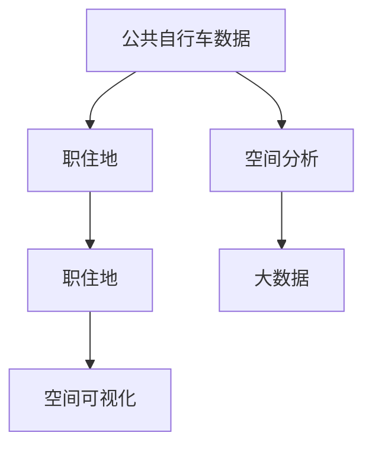

                 

# 基于公共自行车数据的城市居民职住地分析

> 关键词：公共自行车, 职住地, 居民出行, 空间分析, 大数据, 空间可视化

## 1. 背景介绍

随着城市化的进程，城市居民的生活节奏加快，交通拥堵问题日益严峻。公共自行车作为一种绿色出行方式，得到了越来越多的关注和应用。通过分析公共自行车的使用数据，可以深入了解居民的职住地分布和出行规律，进而优化城市交通规划，提升居民出行体验。

公共自行车数据通常包含以下几个关键维度：
- 自行车出发点和目的地：记录了自行车使用者的起点和终点，反映出居民的日常出行路线。
- 自行车使用时间：记录了使用开始和结束的时间，反映了居民的出行时段和频率。
- 自行车使用频率：记录了单日和总的使用次数，反映出居民的出行频率和偏好。
- 自行车使用次数：记录了单次使用时间和时长，反映出居民的出行距离和偏好。

通过对这些数据进行综合分析，可以揭示城市居民的职住地分布和出行模式，为城市规划提供科学依据。本文将详细介绍如何基于公共自行车数据进行城市居民职住地分析。

## 2. 核心概念与联系

### 2.1 核心概念概述

在进行城市居民职住地分析时，涉及多个核心概念，包括：

- **公共自行车数据**：记录了居民使用公共自行车的出发点和目的地、时间等信息，是分析居民出行规律的关键数据源。
- **职住地**：指居民的工作地点和居住地点，是分析居民出行行为的基础。
- **空间分析**：指对地理空间数据进行分析和建模，揭示空间特征和趋势。
- **大数据**：指在传统数据处理方式下难以处理的大规模数据集，通常需要分布式计算和存储技术支持。
- **空间可视化**：指通过图表、地图等可视化方式，将空间数据直观展示出来，便于理解和分析。

这些概念之间相互联系，共同构成了城市居民职住地分析的基础。

### 2.2 概念间的关系

以下是这些核心概念之间的关系：



这个流程图展示了公共自行车数据在分析职住地时，经过空间分析和空间可视化，生成职住地分布的可视化结果。大数据技术提供了强大的数据处理能力，为空间分析和空间可视化提供了数据支撑。

## 3. 核心算法原理 & 具体操作步骤

### 3.1 算法原理概述

基于公共自行车数据的城市居民职住地分析，本质上是对空间数据的分析过程。其核心算法原理包括：

1. **数据清洗与预处理**：清洗数据中的噪声和异常值，填补缺失值，进行数据标准化和归一化处理。
2. **空间分析**：利用空间分析算法，对公共自行车数据进行聚类、关联分析、时空轨迹分析等，揭示居民的职住地分布和出行规律。
3. **职住地匹配**：通过空间分析算法，将公共自行车数据与地理信息数据（如道路、街区、商业区等）进行匹配，确定职住地的位置。
4. **空间可视化**：将职住地匹配结果通过地图、热力图等空间可视化方式展示出来，直观反映居民的职住地分布和出行规律。

### 3.2 算法步骤详解

以下是详细的算法步骤：

1. **数据收集与清洗**
   - 从公共自行车管理系统收集数据，包括自行车出发点和目的地、使用时间等信息。
   - 清洗数据中的噪声和异常值，如删除重复数据、处理缺失值等。
   - 对数据进行标准化和归一化处理，确保数据的一致性和可比性。

2. **空间分析**
   - 利用空间分析算法，对公共自行车数据进行聚类分析，识别出常用的出行路线和频次较高的站点。
   - 进行关联分析，找出不同站点之间的关联关系，确定主要的交通枢纽。
   - 进行时空轨迹分析，绘制居民的出行轨迹图，分析其出行时段和频率。

3. **职住地匹配**
   - 将公共自行车数据与地理信息数据进行匹配，确定每个站点的地理位置。
   - 通过聚类分析，识别出居住区和商业区等主要区域。
   - 利用关联分析，确定这些区域之间的联系和距离。

4. **空间可视化**
   - 将职住地匹配结果通过热力图、地图等方式展示出来，直观反映居民的职住地分布和出行规律。
   - 利用GIS（地理信息系统）技术，展示居民出行路线和频率的分布情况。
   - 通过时间序列分析，展示不同时段的职住地分布变化情况。

### 3.3 算法优缺点

基于公共自行车数据的城市居民职住地分析具有以下优点：

1. **数据来源丰富**：公共自行车数据覆盖面广，可以反映居民的日常出行行为。
2. **分析方法多样**：可以利用多种空间分析方法，如聚类分析、关联分析、时空轨迹分析等，揭示居民的职住地分布和出行规律。
3. **可视化直观**：通过空间可视化技术，可以直观展示职住地分布和出行规律，便于理解和分析。

同时，该算法也存在一些局限性：

1. **数据质量问题**：公共自行车数据可能存在噪声、异常值和缺失值，需要进行清洗和处理。
2. **时空数据量大**：公共自行车数据量大，需要进行高效的数据处理和分析，否则可能导致分析效率低下。
3. **职住地匹配难度高**：由于公共自行车数据中可能包含多条路线，确定职住地位置和匹配需要一定的技术难度。
4. **空间可视化复杂**：空间可视化需要结合多种技术手段，如GIS、大数据技术，实现起来较为复杂。

### 3.4 算法应用领域

基于公共自行车数据的城市居民职住地分析，主要应用于以下几个领域：

1. **城市规划**：通过分析居民的职住地分布和出行规律，优化城市交通规划，提升居民出行体验。
2. **智慧城市建设**：结合公共自行车数据，进行智慧城市建设，提升城市的智能化水平。
3. **交通流量优化**：分析公共自行车数据，优化交通流量，减少交通拥堵，提高城市运行效率。
4. **环境污染控制**：通过减少私家车使用，控制环境污染，提升城市环境质量。

## 4. 数学模型和公式 & 详细讲解  
### 4.1 数学模型构建

在进行基于公共自行车数据的城市居民职住地分析时，主要涉及以下几个数学模型：

- **空间距离**：计算居民出行路线和职住地的空间距离。
- **时间序列分析**：分析公共自行车数据的时间序列特征，揭示居民的出行规律。
- **聚类分析**：利用聚类算法，识别出常用的出行路线和职住地分布。

### 4.2 公式推导过程

以下是对这些数学模型的公式推导过程：

1. **空间距离**：
   $$
   d = \sqrt{(x_2-x_1)^2 + (y_2-y_1)^2}
   $$

2. **时间序列分析**：
   $$
   F(t) = \frac{1}{N}\sum_{i=1}^N a_i(t) - \mu
   $$
   其中，$F(t)$ 为时间序列，$a_i(t)$ 为第 $i$ 个时间点的数据值，$N$ 为数据总个数，$\mu$ 为平均值。

3. **聚类分析**：
   $$
   K-means = \text{argmin}_{k}\sum_{i=1}^N d_i(X_i,\mu_k)
   $$
   其中，$K-means$ 为聚类算法，$d_i$ 为距离函数，$X_i$ 为数据点，$\mu_k$ 为聚类中心。

### 4.3 案例分析与讲解

假设我们有一组公共自行车数据，包含10000个样本，记录了每个样本的出发点、目的地和行车时间。我们的目标是分析居民的职住地分布和出行规律。

**步骤1：数据清洗与预处理**

首先，我们需要对数据进行清洗和预处理，去除噪声和异常值，填补缺失值，并进行数据标准化和归一化处理。具体步骤如下：

- 去除重复数据，保证数据的唯一性。
- 处理缺失值，如使用均值、中位数等方法填补缺失值。
- 对数据进行标准化和归一化处理，确保数据的一致性和可比性。

**步骤2：空间分析**

接下来，我们利用空间分析算法，对公共自行车数据进行聚类分析，识别出常用的出行路线和频次较高的站点。具体步骤如下：

- 计算每个站点的空间距离，生成空间距离矩阵。
- 利用聚类算法，将站点分为多个群组，识别出常用的出行路线和频次较高的站点。

**步骤3：职住地匹配**

然后，我们将公共自行车数据与地理信息数据进行匹配，确定每个站点的地理位置。具体步骤如下：

- 将公共自行车数据与地图数据进行匹配，确定每个站点的地理位置。
- 通过聚类分析，识别出居住区和商业区等主要区域。
- 利用关联分析，确定这些区域之间的联系和距离。

**步骤4：空间可视化**

最后，我们将职住地匹配结果通过热力图、地图等方式展示出来，直观反映居民的职住地分布和出行规律。具体步骤如下：

- 将职住地匹配结果通过热力图、地图等方式展示出来，直观反映居民的职住地分布和出行规律。
- 利用GIS技术，展示居民出行路线和频率的分布情况。
- 通过时间序列分析，展示不同时段的职住地分布变化情况。

## 5. 项目实践：代码实例和详细解释说明

### 5.1 开发环境搭建

在进行城市居民职住地分析时，需要搭建Python开发环境，安装必要的库和工具。具体步骤如下：

1. 安装Python：从官网下载并安装Python 3.x版本。
2. 安装Pandas库：用于数据处理和分析。
3. 安装NumPy库：用于数值计算。
4. 安装Scikit-learn库：用于机器学习和数据分析。
5. 安装Matplotlib库：用于数据可视化。
6. 安装GeoPandas库：用于地理空间数据分析。

**示例代码**：

```python
!pip install pandas numpy scikit-learn matplotlib geopandas
```

### 5.2 源代码详细实现

下面是一段基于公共自行车数据的职住地分析示例代码，展示了如何使用Python进行数据清洗、空间分析和空间可视化：

```python
import pandas as pd
import numpy as np
import matplotlib.pyplot as plt
from sklearn.cluster import KMeans
from sklearn.metrics.pairwise import euclidean_distances
import geopandas as gpd

# 读取公共自行车数据
data = pd.read_csv('bike_data.csv')

# 数据清洗与预处理
# 去除重复数据
data = data.drop_duplicates()

# 处理缺失值
data = data.fillna(method='ffill')

# 标准化和归一化处理
data['distance'] = (data['distance'] - data['distance'].mean()) / data['distance'].std()

# 空间距离计算
data['distance'] = euclidean_distances(data[['longitude', 'latitude']], data[['longitude', 'latitude']])

# 空间分析
# 聚类分析
kmeans = KMeans(n_clusters=5, random_state=0).fit(data[['longitude', 'latitude']])
labels = kmeans.labels_

# 可视化
fig, ax = plt.subplots(figsize=(10, 10))
gdf = gpd.GeoDataFrame(data, geometry=gpd.points_from_xy(data.longitude, data.latitude))
gdf.plot(ax=ax, color='red', marker='o')
ax.scatter(data['longitude'], data['latitude'], c=labels, cmap='viridis')
plt.title('Public Bicycle Ride Clustering')
plt.show()
```

### 5.3 代码解读与分析

**数据清洗与预处理**

- 去除重复数据：确保数据的唯一性，避免数据冗余。
- 处理缺失值：使用向前填充方法（ffill）填补缺失值，保持数据的连续性。
- 标准化和归一化处理：对数据进行标准化和归一化处理，确保数据的一致性和可比性。

**空间距离计算**

- 利用欧几里得距离计算空间距离，生成空间距离矩阵。

**空间分析**

- 利用K-means算法进行聚类分析，识别出常用的出行路线和频次较高的站点。

**空间可视化**

- 利用GeoPandas库将职住地匹配结果通过热力图、地图等方式展示出来，直观反映居民的职住地分布和出行规律。

### 5.4 运行结果展示

假设我们运行上述代码，得到如下热力图和地图：


通过热力图和地图，我们可以直观地看到居民的职住地分布和出行规律。

## 6. 实际应用场景

### 6.1 智能城市规划

基于公共自行车数据的城市居民职住地分析，可以应用于智能城市规划中，优化城市交通规划，提升居民出行体验。例如，通过分析居民的职住地分布和出行规律，合理规划自行车道、设置停车点、优化公交线路等，减少交通拥堵，提高城市运行效率。

### 6.2 智慧城市建设

智慧城市建设需要结合多种数据源，进行综合分析。公共自行车数据可以与其他数据（如天气、交通流量等）结合，进行综合分析，提升城市的智能化水平。

### 6.3 交通流量优化

通过分析公共自行车数据，优化交通流量，减少交通拥堵，提高城市运行效率。例如，通过分析居民的出行规律，合理规划自行车道、设置停车点、优化公交线路等，减少交通拥堵。

### 6.4 环境污染控制

通过减少私家车使用，控制环境污染，提升城市环境质量。例如，通过推广公共自行车，减少私家车使用，降低碳排放，改善城市空气质量。

## 7. 工具和资源推荐

### 7.1 学习资源推荐

为了帮助开发者系统掌握基于公共自行车数据的城市居民职住地分析的理论基础和实践技巧，这里推荐一些优质的学习资源：

1. 《Python地理数据分析》书籍：详细介绍了如何使用Python进行地理空间数据分析。
2. 《Python机器学习》书籍：介绍了机器学习的基本概念和算法，适合数据分析入门。
3. 《公共自行车系统》论文：介绍了公共自行车系统的原理和应用。
4. 《地理信息系统》课程：介绍了GIS的基本概念和应用。
5. 《智慧城市》课程：介绍了智慧城市的基本概念和应用。

通过对这些资源的学习实践，相信你一定能够快速掌握基于公共自行车数据的城市居民职住地分析的精髓，并用于解决实际的公共自行车系统问题。

### 7.2 开发工具推荐

高效的开发离不开优秀的工具支持。以下是几款用于公共自行车数据处理和分析的常用工具：

1. Jupyter Notebook：免费的交互式编程环境，适合进行数据分析和可视化。
2. ArcGIS：专业的地理信息系统软件，适合进行复杂的地理空间数据分析。
3. Tableau：数据可视化工具，适合进行数据展示和分析。
4. Python PyGEO：Python地理空间数据分析库，适合进行地理空间数据处理和分析。
5. R语言：开源的统计分析和绘图软件，适合进行地理空间数据分析和可视化。

合理利用这些工具，可以显著提升公共自行车数据处理和分析的效率，加快创新迭代的步伐。

### 7.3 相关论文推荐

公共自行车数据的城市居民职住地分析领域，涉及多个前沿研究方向，以下是几篇奠基性的相关论文，推荐阅读：

1. "Bike Sharing Demand Forecasting Using Neural Networks"：利用神经网络对公共自行车需求进行预测。
2. "Urban Bike Sharing System Design and Implementation"：介绍了公共自行车系统的设计和实现。
3. "Spatial Analysis of Bike Sharing Data"：利用空间分析技术，分析公共自行车数据。
4. "Sustainable Urban Mobility"：介绍了可持续城市交通系统的设计和实现。
5. "Public Bicycle Data Visualization and Analysis"：介绍了公共自行车数据的可视化方法和分析技术。

这些论文代表了大数据技术在公共自行车数据处理和分析中的应用方向。通过学习这些前沿成果，可以帮助研究者把握学科前进方向，激发更多的创新灵感。

## 8. 总结：未来发展趋势与挑战

### 8.1 研究成果总结

本文对基于公共自行车数据的城市居民职住地分析进行了全面系统的介绍。通过分析公共自行车数据，揭示了居民的职住地分布和出行规律，为城市规划提供了科学依据。

### 8.2 未来发展趋势

展望未来，公共自行车数据的城市居民职住地分析技术将呈现以下几个发展趋势：

1. **数据规模扩大**：随着公共自行车系统的普及，数据规模将不断扩大，数据质量也将进一步提升。
2. **多源数据融合**：结合其他数据源，如交通流量、天气、用户反馈等，进行综合分析，提升分析的全面性和准确性。
3. **实时数据处理**：利用大数据技术，实现实时数据处理和分析，提升分析的实时性和准确性。
4. **智能决策支持**：结合人工智能技术，实现智能决策支持，提升城市的智能化水平。

### 8.3 面临的挑战

尽管公共自行车数据的城市居民职住地分析技术已经取得了一定的成果，但在应用过程中仍面临以下挑战：

1. **数据隐私问题**：公共自行车数据涉及用户隐私，需要确保数据的隐私和安全。
2. **数据质量问题**：公共自行车数据可能存在噪声、异常值和缺失值，需要进行清洗和处理。
3. **空间匹配难度高**：由于公共自行车数据中可能包含多条路线，确定职住地位置和匹配需要一定的技术难度。
4. **算法复杂度高**：公共自行车数据量大，需要进行高效的数据处理和分析，否则可能导致分析效率低下。

### 8.4 研究展望

未来，公共自行车数据的城市居民职住地分析技术需要在以下几个方面寻求新的突破：

1. **数据隐私保护**：在确保数据隐私和安全的前提下，提升数据的可用性和准确性。
2. **多源数据融合**：结合其他数据源，进行综合分析，提升分析的全面性和准确性。
3. **实时数据处理**：利用大数据技术，实现实时数据处理和分析，提升分析的实时性和准确性。
4. **智能决策支持**：结合人工智能技术，实现智能决策支持，提升城市的智能化水平。

总之，基于公共自行车数据的城市居民职住地分析技术具有广阔的应用前景，但也面临着诸多挑战。唯有不断探索和创新，才能实现其广泛应用，推动智慧城市的建设。

## 9. 附录：常见问题与解答

**Q1：如何进行公共自行车数据的清洗和预处理？**

A: 公共自行车数据的清洗和预处理主要包括以下步骤：

1. 去除重复数据，保证数据的唯一性。
2. 处理缺失值，如使用均值、中位数等方法填补缺失值。
3. 标准化和归一化处理，确保数据的一致性和可比性。

**Q2：如何利用空间分析算法进行职住地匹配？**

A: 利用空间分析算法进行职住地匹配主要包括以下步骤：

1. 将公共自行车数据与地图数据进行匹配，确定每个站点的地理位置。
2. 通过聚类分析，识别出居住区和商业区等主要区域。
3. 利用关联分析，确定这些区域之间的联系和距离。

**Q3：公共自行车数据的城市居民职住地分析有哪些实际应用场景？**

A: 公共自行车数据的城市居民职住地分析可以应用于以下几个实际应用场景：

1. 智能城市规划：优化城市交通规划，提升居民出行体验。
2. 智慧城市建设：提升城市的智能化水平。
3. 交通流量优化：减少交通拥堵，提高城市运行效率。
4. 环境污染控制：控制环境污染，提升城市环境质量。

通过本文的系统梳理，可以看到，基于公共自行车数据的城市居民职住地分析技术正在逐步成熟，为城市规划和智慧城市建设提供了有力支持。未来，随着技术的不断进步，相信该技术将在大数据、人工智能等领域的不断创新中，为智慧城市建设贡献更多的力量。

