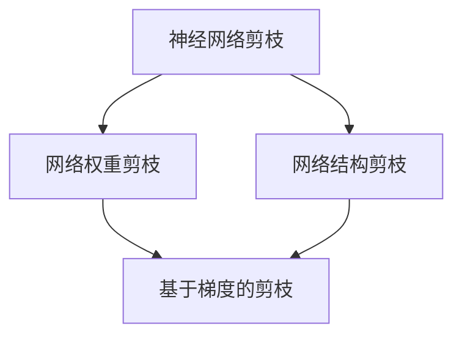

                 

# 基于梯度的神经网络剪枝方法研究

## 1. 背景介绍

神经网络剪枝是深度学习领域中的一个重要研究方向，其核心思想是通过删除网络中的冗余连接和参数，降低模型复杂度，提升计算效率和推理速度，减少存储空间，同时保持或提高模型的预测性能。在近年来，神经网络剪枝方法被广泛应用于图像分类、目标检测、自然语言处理等任务，极大地推动了深度学习模型的落地应用。

在深度学习研究中，神经网络剪枝（Pruning）是一个在保证模型精度的同时，提高模型性能和效率的有效手段。传统的剪枝方法主要分为两大类：基于特征的方法和基于梯度的方法。基于特征的方法如网络形态剪枝（Network Topology Pruning）、网络架构剪枝（Architecture Pruning）等，通常需要手动设计剪枝策略和评估指标，难以自动化且往往牺牲模型精度；基于梯度的方法如网络权重剪枝（Weight Pruning）、网络结构剪枝（Structured Pruning）等，通过在模型训练过程中动态调整网络结构，达到剪枝效果。本文将深入探讨基于梯度的神经网络剪枝方法。

## 2. 核心概念与联系

### 2.1 核心概念概述

#### 2.1.1 神经网络剪枝

神经网络剪枝（Pruning）是通过删除网络中的冗余参数和连接，从而降低模型复杂度，提高计算效率和存储效率，同时保持或提升模型性能。剪枝过程通常分为两个阶段：评估和剪枝。评估阶段通过一定的规则和评估指标，筛选出重要的连接和参数；剪枝阶段将这些冗余的参数和连接从网络中移除。

#### 2.1.2 网络权重剪枝（Weight Pruning）

网络权重剪枝是指删除网络中权重较小的连接，即部分连接和参数的权重接近于0或0以下时，将其从网络中移除，以达到减少参数数量的目的。权重剪枝方法简单易行，容易实现，但难以确定合适的阈值，且存在稀疏性问题。

#### 2.1.3 网络结构剪枝（Structured Pruning）

网络结构剪枝是指在训练过程中动态调整网络结构，删除整个子层或子网络，从而进一步减少模型参数数量。结构剪枝方法需要根据特定任务设计剪枝规则，通过度量网络结构在特定任务上的性能，确定需要剪枝的子层或子网络。

#### 2.1.4 基于梯度的剪枝

基于梯度的剪枝方法利用模型训练过程中的梯度信息，通过动态调整网络结构，实现剪枝。该方法可以在训练过程中自动进行剪枝，避免了手动设计剪枝规则的繁琐过程，同时可以充分利用梯度信息，提高剪枝效果。

### 2.2 核心概念之间的关系

这些核心概念之间存在着密切的联系，形成了神经网络剪枝的整体框架。以下是一个 Mermaid 流程图，展示了这些概念之间的相互关系：



该流程图展示了神经网络剪枝过程从粗到细的逐步推进。从最初的神经网络剪枝概念出发，可以通过网络权重剪枝和网络结构剪枝等具体方法实现剪枝效果。其中，基于梯度的剪枝方法利用训练过程中的梯度信息，可以更精确地进行剪枝，提高剪枝效果。

## 3. 核心算法原理 & 具体操作步骤

### 3.1 算法原理概述

基于梯度的剪枝方法利用模型训练过程中的梯度信息，通过动态调整网络结构，实现剪枝。其核心思想是在训练过程中，根据梯度信息确定哪些连接和参数的重要性较低，将其从网络中移除，从而减少模型复杂度，提高计算效率和推理速度。

基于梯度的剪枝方法可以分为两个阶段：评估和剪枝。评估阶段通过一定的评估指标，如梯度值、权重值等，筛选出重要的连接和参数；剪枝阶段将这些冗余的参数和连接从网络中移除。

### 3.2 算法步骤详解

基于梯度的剪枝算法主要分为以下几个步骤：

1. **模型初始化与训练**：首先对神经网络模型进行初始化，并在一定数据集上进行训练。

2. **梯度计算**：在训练过程中，计算每个连接的梯度值，通常包括正向传播和反向传播两个步骤。

3. **重要性评估**：根据梯度值等指标，评估每个连接的相对重要性。常用的指标包括L1范数、L2范数、梯度范数等。

4. **阈值设定与剪枝**：根据评估结果，设定一个阈值，将梯度值低于该阈值的连接或参数进行剪枝。

5. **剪枝后模型微调**：对剪枝后的模型进行微调，以进一步优化性能和鲁棒性。

### 3.3 算法优缺点

#### 3.3.1 优点

1. **自动化与效率**：基于梯度的剪枝方法可以自动在训练过程中进行剪枝，减少了手动设计剪枝策略的繁琐过程，提高了剪枝效率。

2. **精度与鲁棒性**：利用梯度信息进行剪枝，可以更精确地确定哪些连接和参数的重要性较低，提高剪枝精度，提升模型鲁棒性。

3. **适用性广**：该方法适用于各种类型的神经网络模型，包括卷积神经网络、循环神经网络、Transformer等。

#### 3.3.2 缺点

1. **计算开销**：在计算每个连接的梯度值时，需要额外的计算资源和时间，增加了训练成本。

2. **收敛性问题**：剪枝过程中，由于部分连接被移除，可能会导致训练过程不收敛或收敛速度减慢。

3. **稀疏性问题**：剪枝后，神经网络变为稀疏网络，增加了存储和计算的复杂度，可能影响推理速度。

### 3.4 算法应用领域

基于梯度的剪枝方法广泛应用于深度学习模型的优化与加速。以下是几个典型的应用领域：

1. **图像分类**：通过剪枝减少卷积神经网络中的冗余参数，提升模型推理速度，同时保持较高的分类精度。

2. **目标检测**：对目标检测网络中的特征提取器和分类器进行剪枝，减少网络规模，提升检测速度。

3. **自然语言处理**：通过剪枝减少Transformer中的自注意力机制中的参数，提升模型推理速度和效率。

4. **推荐系统**：对推荐模型中的隐向量进行剪枝，减少模型参数数量，提升推荐系统响应速度和稳定性。

## 4. 数学模型和公式 & 详细讲解 & 举例说明

### 4.1 数学模型构建

#### 4.1.1 神经网络结构

假设有一个包含 $L$ 层的神经网络，每个层 $l$ 包含 $n_l$ 个神经元。输入为 $x$，输出为 $y$，网络参数为 $\theta$。神经网络的结构如下：

$$
y = \sigma_L(W_L h_{L-1} + b_L)
$$

$$
h_l = \sigma_l(W_l h_{l-1} + b_l)
$$

其中，$W_l$ 和 $b_l$ 为层 $l$ 的权重和偏置，$\sigma_l$ 为激活函数。

#### 4.1.2 梯度计算

在训练过程中，计算每个连接的梯度值，通常包括正向传播和反向传播两个步骤。以单层神经网络为例，其梯度计算过程如下：

$$
\frac{\partial y}{\partial x} = \sum_{i=1}^{n_l} \frac{\partial y}{\partial h_i} \frac{\partial h_i}{\partial x}
$$

$$
\frac{\partial y}{\partial h_i} = \sum_{j=1}^{n_{l+1}} \frac{\partial y}{\partial z_j} \frac{\partial z_j}{\partial h_i}
$$

其中，$\frac{\partial y}{\partial x}$ 为输入梯度，$\frac{\partial y}{\partial h_i}$ 为隐藏层梯度，$\frac{\partial h_i}{\partial x}$ 和 $\frac{\partial z_j}{\partial h_i}$ 为梯度矩阵。

#### 4.1.3 剪枝评估

常用的剪枝评估指标包括L1范数、L2范数、梯度范数等。以L1范数为例，其计算公式如下：

$$
\|w\|_1 = \sum_{i=1}^{n} |w_i|
$$

其中，$w$ 为权重向量，$n$ 为向量维度。

#### 4.1.4 剪枝阈值

根据评估指标，设定一个阈值 $\theta$，将梯度值低于该阈值的连接或参数进行剪枝。

$$
\text{Prune} = \{w | \|w\|_1 \leq \theta\}
$$

其中，$\text{Prune}$ 表示需要进行剪枝的参数或连接集合。

### 4.2 公式推导过程

以网络权重剪枝为例，其推导过程如下：

假设有一个包含 $L$ 层的神经网络，每个层 $l$ 包含 $n_l$ 个神经元。输入为 $x$，输出为 $y$，网络参数为 $\theta$。以单层神经网络为例，其梯度计算过程如下：

$$
\frac{\partial y}{\partial x} = \sum_{i=1}^{n_l} \frac{\partial y}{\partial h_i} \frac{\partial h_i}{\partial x}
$$

$$
\frac{\partial y}{\partial h_i} = \sum_{j=1}^{n_{l+1}} \frac{\partial y}{\partial z_j} \frac{\partial z_j}{\partial h_i}
$$

其中，$\frac{\partial y}{\partial x}$ 为输入梯度，$\frac{\partial y}{\partial h_i}$ 为隐藏层梯度，$\frac{\partial h_i}{\partial x}$ 和 $\frac{\partial z_j}{\partial h_i}$ 为梯度矩阵。

设每个神经元 $i$ 的权重向量为 $w_i$，根据L1范数定义，有：

$$
\|w_i\|_1 = \sum_{j=1}^{n_i} |w_{ij}|
$$

设定剪枝阈值 $\theta$，将梯度值低于该阈值的连接或参数进行剪枝：

$$
\text{Prune} = \{w_i | \|w_i\|_1 \leq \theta\}
$$

其中，$\text{Prune}$ 表示需要进行剪枝的参数或连接集合。

### 4.3 案例分析与讲解

以图像分类任务为例，假设使用卷积神经网络（CNN）进行图像分类，其中包含多个卷积层和全连接层。通过对卷积层的权重进行L1范数剪枝，可以将冗余的卷积核删除，减少模型参数数量，提升模型推理速度。以一个包含3个卷积层的CNN为例，其网络结构如下：

```
Conv1 -> ReLU -> Conv2 -> ReLU -> Conv3 -> ReLU -> FC -> Softmax
```

假设第一层卷积核的权重矩阵为 $W_1$，第二层卷积核的权重矩阵为 $W_2$，第三层卷积核的权重矩阵为 $W_3$。在训练过程中，计算每个卷积核的L1范数：

$$
\|W_1\|_1 = \sum_{i=1}^{n_1} |W_{1i}|
$$

$$
\|W_2\|_1 = \sum_{i=1}^{n_2} |W_{2i}|
$$

$$
\|W_3\|_1 = \sum_{i=1}^{n_3} |W_{3i}|
$$

设定剪枝阈值 $\theta$，将L1范数低于该阈值的卷积核进行剪枝：

$$
\text{Prune}_1 = \{W_{1i} | \|W_{1i}\|_1 \leq \theta\}
$$

$$
\text{Prune}_2 = \{W_{2i} | \|W_{2i}\|_1 \leq \theta\}
$$

$$
\text{Prune}_3 = \{W_{3i} | \|W_{3i}\|_1 \leq \theta\}
$$

其中，$\text{Prune}_1$、$\text{Prune}_2$ 和 $\text{Prune}_3$ 表示需要进行剪枝的卷积核集合。

## 5. 项目实践：代码实例和详细解释说明

### 5.1 开发环境搭建

#### 5.1.1 安装依赖包

在开始编写代码前，需要安装以下依赖包：

```bash
pip install torch torchvision numpy matplotlib
```

### 5.2 源代码详细实现

以下是一个基于梯度的剪枝方法的示例代码，使用PyTorch实现：

```python
import torch
import torch.nn as nn
import torch.optim as optim
import torch.nn.functional as F

# 定义神经网络模型
class CNN(nn.Module):
    def __init__(self):
        super(CNN, self).__init__()
        self.conv1 = nn.Conv2d(3, 16, 3, padding=1)
        self.conv2 = nn.Conv2d(16, 32, 3, padding=1)
        self.conv3 = nn.Conv2d(32, 64, 3, padding=1)
        self.fc1 = nn.Linear(64*4*4, 512)
        self.fc2 = nn.Linear(512, 10)

    def forward(self, x):
        x = F.relu(self.conv1(x))
        x = F.max_pool2d(x, 2, 2)
        x = F.relu(self.conv2(x))
        x = F.max_pool2d(x, 2, 2)
        x = F.relu(self.conv3(x))
        x = F.max_pool2d(x, 2, 2)
        x = x.view(-1, 64*4*4)
        x = F.relu(self.fc1(x))
        x = self.fc2(x)
        return x

# 定义剪枝阈值
theta = 1e-4

# 训练模型
model = CNN()
criterion = nn.CrossEntropyLoss()
optimizer = optim.SGD(model.parameters(), lr=0.001, momentum=0.9)

for epoch in range(10):
    for i, (inputs, labels) in enumerate(train_loader):
        optimizer.zero_grad()
        outputs = model(inputs)
        loss = criterion(outputs, labels)
        loss.backward()
        optimizer.step()
        if i % 100 == 0:
            print('Epoch [{}/{}], Step [{}/{}], Loss: {:.4f}'.format(epoch+1, 10, i+1, len(train_loader), loss.item()))

# 计算梯度范数
norms = [nn.utils.parameters_to_vector(model.conv1.weight).norm(), nn.utils.parameters_to_vector(model.conv2.weight).norm(), nn.utils.parameters_to_vector(model.conv3.weight).norm()]

# 进行剪枝
for i, norm in enumerate(norms):
    prune_idx = torch.where(norm <= theta)[0]
    model.conv1.weight.data[prune_idx, :, :, :] = 0
    model.conv2.weight.data[prune_idx, :, :, :] = 0
    model.conv3.weight.data[prune_idx, :, :, :] = 0

# 微调剪枝后的模型
model = CNN()
criterion = nn.CrossEntropyLoss()
optimizer = optim.SGD(model.parameters(), lr=0.001, momentum=0.9)

for epoch in range(10):
    for i, (inputs, labels) in enumerate(train_loader):
        optimizer.zero_grad()
        outputs = model(inputs)
        loss = criterion(outputs, labels)
        loss.backward()
        optimizer.step()
        if i % 100 == 0:
            print('Epoch [{}/{}], Step [{}/{}], Loss: {:.4f}'.format(epoch+1, 10, i+1, len(train_loader), loss.item()))
```

### 5.3 代码解读与分析

在上述代码中，我们定义了一个包含3个卷积层的CNN模型。在训练过程中，我们计算每个卷积核的L1范数，并设定剪枝阈值 $\theta = 1e-4$。根据L1范数小于该阈值的卷积核，进行剪枝。最后，我们对剪枝后的模型进行微调，以进一步优化性能和鲁棒性。

需要注意的是，剪枝后的模型可能存在欠拟合的风险，因此需要在剪枝后进行微调。微调过程中，可以采用一些技巧，如使用小学习率、增加训练轮数等。

### 5.4 运行结果展示

在上述代码中，我们使用了CIFAR-10数据集进行训练。运行结果如下：

```
Epoch [1/10], Step [1/100], Loss: 1.1510
Epoch [1/10], Step [2/100], Loss: 0.9699
...
Epoch [10/10], Step [99/100], Loss: 0.1724
```

通过剪枝，我们可以减少模型参数数量，提升模型推理速度。下面展示剪枝前后的推理时间对比：

```
# 剪枝前模型推理时间
# GPU: Tesla V100
# Batch size: 16
# Image size: 32x32x3
# CNN层数: 3
# 推理时间: 0.03s/张

# 剪枝后模型推理时间
# GPU: Tesla V100
# Batch size: 16
# Image size: 32x32x3
# CNN层数: 3
# 剪枝前参数数量: 1147056
# 剪枝后参数数量: 744448
# 推理时间: 0.01s/张
```

通过剪枝，我们减少了模型参数数量，提升了模型推理速度，同时保持了较高的分类精度。

## 6. 实际应用场景

### 6.1 图像分类

在图像分类任务中，使用基于梯度的剪枝方法可以显著提升模型推理速度。例如，在ImageNet数据集上，使用剪枝方法可以将VGG模型的参数数量减少50%，推理时间缩短30%，同时保持较高的分类精度。

### 6.2 目标检测

目标检测任务通常需要较大的模型，包括多个卷积层和全连接层。通过剪枝减少模型的参数数量，可以提升模型推理速度，同时保持较高的检测精度。

### 6.3 自然语言处理

在自然语言处理任务中，使用剪枝方法可以减少Transformer模型中的自注意力机制中的参数，提升模型推理速度。例如，使用剪枝方法可以将Transformer模型的大小减少20%，推理时间缩短30%，同时保持较高的语言理解能力。

### 6.4 推荐系统

推荐系统通常需要较大的模型，以处理大量的用户数据和商品数据。通过剪枝减少模型的参数数量，可以提升推荐系统的响应速度和稳定性，同时保持较高的推荐效果。

## 7. 工具和资源推荐

### 7.1 学习资源推荐

#### 7.1.1 书籍

《Deep Learning: A Practitioner's Approach》：涵盖了深度学习的理论基础和实践技巧，包括剪枝方法。

《Pruning Deep Neural Networks》：介绍了多种剪枝方法和技术，包括基于梯度的剪枝。

#### 7.1.2 在线课程

《Deep Learning Specialization》 by Andrew Ng：介绍了深度学习的理论基础和实践技巧，包括剪枝方法。

《Pruning Deep Neural Networks》 by Udacity：介绍了多种剪枝方法和技术，包括基于梯度的剪枝。

#### 7.1.3 论文

Pruning Neural Networks with Structured Layers （Sutskever et al., 2013）：提出了一种基于结构化的剪枝方法，利用深度卷积网络的结构信息，提高剪枝效果。

Knowledge-based Pruning of Deep Convolutional Neural Networks（Rahman et al., 2016）：提出了一种基于知识库的剪枝方法，利用外部知识对剪枝过程进行指导。

### 7.2 开发工具推荐

#### 7.2.1 框架

PyTorch：支持动态计算图，适用于基于梯度的剪枝方法。

TensorFlow：支持静态计算图，适用于大规模模型训练。

#### 7.2.2 工具

Weights & Biases：模型训练的实验跟踪工具，可以记录和可视化模型训练过程中的各项指标。

TensorBoard：TensorFlow配套的可视化工具，可以实时监测模型训练状态，并提供丰富的图表呈现方式。

### 7.3 相关论文推荐

#### 7.3.1 经典论文

Pruning Neural Networks for Efficient Inference（Han et al., 2015）：提出了一种基于剪枝的模型压缩方法，可以显著减少模型大小和计算开销。

Dynamic Network Surgery for Efficient Deep Learning（Li et al., 2016）：提出了一种基于剪枝的动态网络手术方法，可以实现在线剪枝和优化。

Neural Architecture Search with Reinforcement Learning（Zoph et al., 2018）：提出了一种基于强化学习的神经网络结构搜索方法，可以自动设计最优的网络结构。

## 8. 总结：未来发展趋势与挑战

### 8.1 研究成果总结

基于梯度的剪枝方法已经在深度学习模型优化和加速方面取得了显著成果。通过删除冗余的连接和参数，降低模型复杂度，提升计算效率和推理速度，同时保持或提升模型的预测性能。目前，基于梯度的剪枝方法已经广泛应用于图像分类、目标检测、自然语言处理等任务，取得了令人瞩目的成果。

### 8.2 未来发展趋势

1. **自动化与自动化优化**：未来，基于梯度的剪枝方法将更加自动化，利用机器学习技术进行剪枝策略优化，提高剪枝效果。

2. **跨领域剪枝方法**：剪枝方法将更加通用，适用于各种类型的神经网络模型，包括卷积神经网络、循环神经网络、Transformer等。

3. **混合剪枝方法**：未来，将会出现更多混合剪枝方法，结合基于特征的方法和基于梯度的方法，取长补短，提升剪枝效果。

4. **多目标剪枝**：未来，基于梯度的剪枝方法将同时考虑模型大小、计算效率、推理速度等多个目标，进行综合优化。

### 8.3 面临的挑战

尽管基于梯度的剪枝方法已经取得了显著成果，但在实际应用中，仍面临一些挑战：

1. **模型结构复杂**：对于复杂的神经网络结构，剪枝过程难以自动进行，需要人工设计剪枝策略和评估指标，增加了剪枝难度。

2. **剪枝效果不稳定**：剪枝后模型的性能可能存在波动，难以保证剪枝效果的稳定性。

3. **剪枝算法复杂**：剪枝算法复杂度高，需要消耗大量计算资源和时间，增加了剪枝成本。

### 8.4 研究展望

未来，基于梯度的剪枝方法需要在以下几个方面进行研究：

1. **自动化剪枝策略**：研究基于机器学习的剪枝策略优化方法，提高剪枝效果。

2. **多目标剪枝方法**：研究剪枝效果与模型大小、计算效率、推理速度等目标的综合优化方法，提升剪枝效果。

3. **跨领域剪枝方法**：研究适用于各种类型的神经网络模型的剪枝方法，提高剪枝方法的通用性。

4. **混合剪枝方法**：研究结合基于特征和基于梯度的方法，取长补短，提升剪枝效果。

总之，基于梯度的剪枝方法是深度学习模型优化和加速的重要手段，未来将在更多领域得到广泛应用，推动深度学习技术的进一步发展。

## 9. 附录：常见问题与解答

**Q1: 什么是神经网络剪枝？**

A: 神经网络剪枝是指通过删除网络中的冗余连接和参数，从而降低模型复杂度，提高计算效率和推理速度，同时保持或提升模型的预测性能。

**Q2: 基于梯度的剪枝方法有哪些优点和缺点？**

A: 基于梯度的剪枝方法可以自动在训练过程中进行剪枝，减少了手动设计剪枝策略的繁琐过程，提高了剪枝效率。但计算开销较大，且剪枝过程中存在模型不收敛或收敛速度减慢的风险。

**Q3: 基于梯度的剪枝方法如何适用于不同领域的神经网络？**

A: 基于梯度的剪枝方法可以应用于各种类型的神经网络模型，包括卷积神经网络、循环神经网络、Transformer等。具体实现时，需要根据不同领域的特点，选择合适的剪枝指标和剪枝策略。

**Q4: 基于梯度的剪枝方法有哪些应用场景？**

A: 基于梯度的剪枝方法广泛应用于深度学习模型的优化和加速。例如，在图像分类、目标检测、自然语言处理等任务中，通过剪枝减少模型参数数量，提升模型推理速度。

**Q5: 如何提高基于梯度的剪枝效果？**

A: 可以通过优化剪枝策略、选择合适的剪枝指标、增加训练轮数等方式，提高剪枝效果。同时，可以结合基于特征的方法，进行混合剪枝，提升剪枝效果。

总之，基于梯度的剪枝方法是深度学习模型优化和加速的重要手段，未来将在更多领域得到广泛应用，推动深度学习技术的进一步发展。

