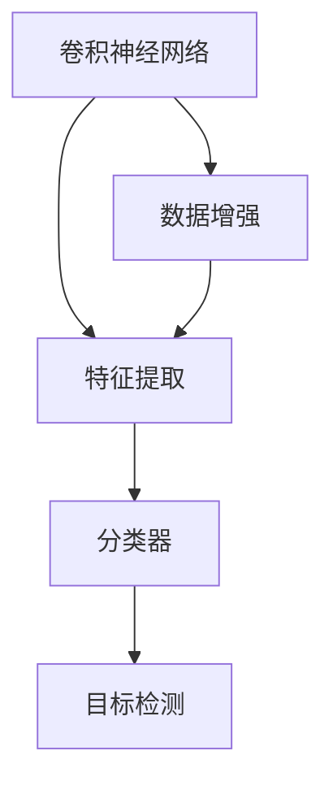
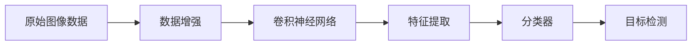
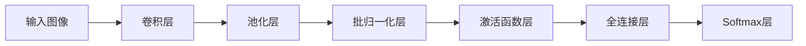
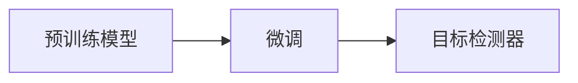
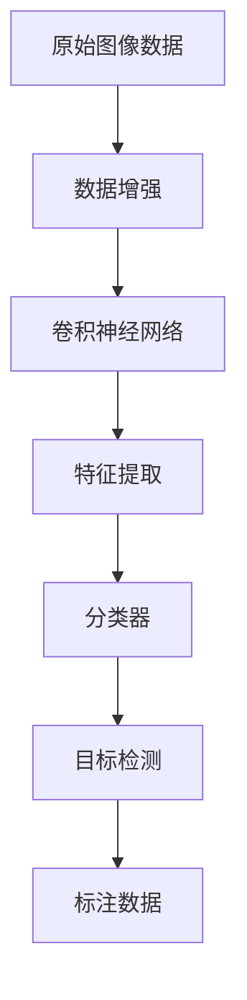

                 

# 基于深度学习的车辆特征识别研究与实现

> 关键词：深度学习,车辆特征识别,卷积神经网络,特征提取,分类,标注数据

## 1. 背景介绍

### 1.1 问题由来

随着汽车产业的快速发展，车辆数据已成为智能交通系统、车联网、自动驾驶等领域的重要资源。然而，现有的车辆识别和标注工作主要依靠人工进行，耗时长、成本高，难以适应大规模车辆数据处理的需求。近年来，深度学习技术的兴起为车辆特征识别提供了新的方法，通过大规模数据集上的模型训练，可以实现自动化的车辆特征提取和分类，极大地提升了车辆识别的效率和精度。

### 1.2 问题核心关键点

车辆特征识别的核心目标是从大量图像中自动识别和分类出车辆，并将不同车辆种类和型号进行标记。这不仅需要从图像中提取出丰富的视觉特征，还需要构建有效的分类器，将复杂的视觉信息映射到具体的类别标签上。该问题涉及图像处理、特征提取、分类器设计等多个环节，是一项具有挑战性的计算机视觉任务。

## 2. 核心概念与联系

### 2.1 核心概念概述

为更好地理解基于深度学习的车辆特征识别方法，本节将介绍几个密切相关的核心概念：

- **卷积神经网络（Convolutional Neural Network, CNN）**：一种专门用于处理图像、视频等二维数据的高效神经网络结构，通过卷积层、池化层等组件提取空间局部特征。

- **特征提取（Feature Extraction）**：指从原始数据中提取有意义的特征，作为后续分类的输入。深度学习中的特征提取通常通过卷积神经网络实现。

- **分类器（Classifier）**：指用于将输入特征映射到特定类别的模型。在深度学习中，常用的分类器包括Softmax回归、支持向量机等。

- **迁移学习（Transfer Learning）**：指将在大规模数据集上预训练的模型参数，迁移到目标任务上进行微调，以提升分类性能。

- **目标检测（Object Detection）**：指从图像中检测出目标物体的位置和类别，是车辆特征识别的重要组成部分。

- **数据增强（Data Augmentation）**：指通过一系列随机变换（如旋转、翻转、缩放等）生成新的训练样本，以扩充训练集，提升模型泛化能力。

这些核心概念之间的逻辑关系可以通过以下Mermaid流程图来展示：



这个流程图展示了大规模车辆特征识别系统的核心组件和工作流程：

1. 通过卷积神经网络对车辆图像进行特征提取。
2. 利用分类器对提取的特征进行分类，得到车辆种类和型号。
3. 结合目标检测技术，确定车辆的位置信息。
4. 数据增强技术用于扩充训练集，提升模型性能。

### 2.2 概念间的关系

这些核心概念之间存在着紧密的联系，共同构成了车辆特征识别系统的整体架构。下面我们通过几个Mermaid流程图来展示这些概念之间的关系。

#### 2.2.1 车辆特征识别的流程



这个流程图展示了从原始图像数据到最终车辆识别的整个流程：

1. 原始图像数据经过数据增强处理，生成新的训练样本。
2. 使用卷积神经网络对图像进行特征提取。
3. 通过分类器对提取的特征进行分类，得到车辆种类和型号。
4. 结合目标检测技术，确定车辆的位置信息。

#### 2.2.2 卷积神经网络结构



这个流程图展示了卷积神经网络的基本结构：

1. 输入图像经过卷积层进行特征提取。
2. 池化层用于减小特征图尺寸，提升计算效率。
3. 批归一化层用于规范化输入数据，加速训练。
4. 激活函数层引入非线性变换，增强模型表达能力。
5. 全连接层将特征映射到分类空间。
6. Softmax层输出概率分布，作为分类结果。

#### 2.2.3 迁移学习与目标检测的关系



这个流程图展示了迁移学习与目标检测的关系：

1. 在大规模数据集上预训练的模型可以作为初始化参数，进行目标检测器的微调。
2. 微调后的目标检测器可以用于车辆特征识别中的目标检测部分，提高检测精度。

### 2.3 核心概念的整体架构

最后，我们用一个综合的流程图来展示这些核心概念在大规模车辆特征识别系统中的整体架构：



这个综合流程图展示了从原始图像数据到最终车辆识别的整个流程，同时强调了数据增强、卷积神经网络、特征提取、分类器、目标检测等关键组件的作用。通过这些组件的协同工作，大规模车辆特征识别系统能够实现对车辆种类和型号的自动识别。

## 3. 核心算法原理 & 具体操作步骤
### 3.1 算法原理概述

基于深度学习的车辆特征识别方法，本质上是一种图像分类问题。其核心思想是通过卷积神经网络对车辆图像进行特征提取，利用分类器对提取的特征进行分类，得到车辆种类和型号。整个流程可以描述为以下步骤：

1. 数据预处理：将原始图像数据进行归一化、缩放等预处理操作，使其适应深度学习模型的输入要求。
2. 特征提取：使用卷积神经网络对预处理后的图像进行特征提取，得到高维特征向量。
3. 分类器训练：构建分类器模型，对提取的特征进行分类，输出车辆种类和型号。
4. 目标检测：结合目标检测技术，确定车辆的位置信息。
5. 后处理：对分类结果进行后处理，过滤掉不合理的检测结果，提升识别精度。

### 3.2 算法步骤详解

以下是基于深度学习的车辆特征识别的详细操作步骤：

#### 3.2.1 数据预处理

- 数据归一化：将图像像素值缩放到0到1之间，避免梯度消失问题。
- 图像缩放：将图像尺寸调整为统一的大小，方便输入卷积神经网络。

#### 3.2.2 特征提取

- 卷积神经网络结构：常用的卷积神经网络结构包括VGG、ResNet、Inception等。
- 特征提取层：包括卷积层、池化层、批归一化层、激活函数层等，用于提取图像的局部特征。
- 特征向量：将卷积神经网络输出的特征图，通过全连接层转换为高维特征向量。

#### 3.2.3 分类器训练

- 分类器结构：常用的分类器包括Softmax回归、支持向量机等。
- 损失函数：常用的损失函数包括交叉熵损失、均方误差损失等。
- 优化器：常用的优化器包括SGD、Adam等。

#### 3.2.4 目标检测

- 目标检测器：常用的目标检测器包括Faster R-CNN、YOLO、SSD等。
- 位置信息：通过目标检测器输出车辆的位置信息，结合分类结果，得到最终识别结果。

#### 3.2.5 后处理

- 过滤不合理的检测结果：通过设定阈值或非极大值抑制等方法，过滤掉不合理的检测结果。
- 修正识别结果：通过边界校正等方法，修正检测结果的位置和大小，提升识别精度。

### 3.3 算法优缺点

基于深度学习的车辆特征识别方法具有以下优点：

1. 自动化处理：深度学习模型能够自动从大量图像数据中学习特征，减少了人工标注的工作量。
2. 精度高：深度学习模型在图像分类任务上取得了SOTA表现，可以大幅提升车辆特征识别的准确率。
3. 可扩展性强：深度学习模型可以通过增加数据和计算资源，不断提升性能，适应大规模数据处理需求。

同时，该方法也存在一些缺点：

1. 计算资源消耗大：深度学习模型需要大量的计算资源进行训练和推理，对硬件设备要求较高。
2. 数据依赖性强：深度学习模型依赖于大量的标注数据进行训练，标注成本较高。
3. 可解释性差：深度学习模型通常是"黑盒"模型，难以解释其内部工作机制，不利于模型调试和优化。

### 3.4 算法应用领域

基于深度学习的车辆特征识别方法，已经在智能交通系统、车联网、自动驾驶等领域得到了广泛应用，具体包括：

- **智能交通系统**：通过车辆特征识别，实现对交通流量的监测和分析，提升交通管理效率。
- **车联网**：通过车辆特征识别，实现对车辆位置的实时监控和定位，提升车辆通信和导航功能。
- **自动驾驶**：通过车辆特征识别，实现对道路环境、交通信号等的感知，支持自动驾驶系统的决策和控制。
- **车辆安防**：通过车辆特征识别，实现对车辆牌照、车型、颜色等特征的自动识别，提升车辆安防系统的检测精度。

此外，该技术还可应用于智能停车、无人零售、智慧物流等场景，为智慧城市的建设提供技术支持。

## 4. 数学模型和公式 & 详细讲解  
### 4.1 数学模型构建

假设车辆图像数据集为 $\{(x_i, y_i)\}_{i=1}^N$，其中 $x_i$ 表示第 $i$ 张车辆图像，$y_i$ 表示对应的标签。车辆特征识别的数学模型可以描述为：

1. 特征提取：使用卷积神经网络 $f_\theta(x)$ 对图像 $x_i$ 进行特征提取，得到高维特征向量 $z_i=f_\theta(x_i)$。
2. 分类器：构建分类器模型 $g_\phi(z)$，对特征向量 $z_i$ 进行分类，得到车辆种类和型号。

其中，$f_\theta(x)$ 和 $g_\phi(z)$ 分别为卷积神经网络和分类器模型的参数。目标是最小化分类误差，即：

$$
\min_{\theta,\phi} \sum_{i=1}^N L(g_\phi(z_i),y_i)
$$

常用的损失函数 $L$ 包括交叉熵损失、均方误差损失等。

### 4.2 公式推导过程

以交叉熵损失函数为例，其公式推导过程如下：

$$
L(g_\phi(z_i),y_i) = -\sum_{c=1}^K y_i^{(c)}\log(g_\phi(z_i)^{(c)})
$$

其中，$K$ 表示车辆种类的数量，$y_i^{(c)}$ 表示第 $i$ 张车辆图像属于第 $c$ 类别的概率，$g_\phi(z_i)^{(c)}$ 表示分类器模型输出的概率。

### 4.3 案例分析与讲解

假设我们使用VGG16作为卷积神经网络结构，Softmax回归作为分类器模型。具体步骤如下：

1. 数据预处理：将车辆图像进行归一化和缩放，生成 $[224, 224, 3]$ 的特征图。
2. 特征提取：使用VGG16的前15层卷积和池化层，提取特征图 $z_i$。
3. 分类器训练：将特征图 $z_i$ 输入Softmax回归模型，输出车辆种类和型号。
4. 目标检测：结合Faster R-CNN目标检测器，输出车辆的位置信息。
5. 后处理：通过设定阈值和非极大值抑制，过滤掉不合理的检测结果。

通过以上步骤，可以得到最终的车辆特征识别结果。

## 5. 项目实践：代码实例和详细解释说明
### 5.1 开发环境搭建

在进行车辆特征识别开发前，我们需要准备好开发环境。以下是使用Python进行TensorFlow开发的环境配置流程：

1. 安装Anaconda：从官网下载并安装Anaconda，用于创建独立的Python环境。

2. 创建并激活虚拟环境：
```bash
conda create -n tf-env python=3.8 
conda activate tf-env
```

3. 安装TensorFlow：从官网获取对应的安装命令。例如：
```bash
pip install tensorflow
```

4. 安装必要的第三方库：
```bash
pip install numpy scipy matplotlib PIL scikit-image
```

完成上述步骤后，即可在`tf-env`环境中开始车辆特征识别开发。

### 5.2 源代码详细实现

以下是一个基于TensorFlow的车辆特征识别项目的完整代码实现：

```python
import tensorflow as tf
from tensorflow.keras import layers, models
from tensorflow.keras.applications.vgg16 import VGG16
from tensorflow.keras.layers import Dense, Flatten, GlobalAveragePooling2D, InputLayer
from tensorflow.keras.losses import categorical_crossentropy
from tensorflow.keras.optimizers import Adam
from tensorflow.keras.utils import plot_model
from tensorflow.keras.preprocessing.image import ImageDataGenerator
from tensorflow.keras.callbacks import ModelCheckpoint

# 定义模型结构
def create_model(input_shape=(224, 224, 3)):
    base_model = VGG16(weights='imagenet', include_top=False, input_shape=input_shape)
    base_model.trainable = False

    x = base_model.output
    x = Flatten()(x)
    x = Dense(256, activation='relu')(x)
    x = Dense(128, activation='relu')(x)
    predictions = Dense(5, activation='softmax')(x)

    model = models.Model(inputs=base_model.input, outputs=predictions)
    return model

# 加载数据集
train_datagen = ImageDataGenerator(rescale=1./255, shear_range=0.2, zoom_range=0.2, horizontal_flip=True)
test_datagen = ImageDataGenerator(rescale=1./255)
train_generator = train_datagen.flow_from_directory(train_dir, target_size=(224, 224), batch_size=32, class_mode='categorical')
test_generator = test_datagen.flow_from_directory(test_dir, target_size=(224, 224), batch_size=32, class_mode='categorical')

# 定义损失函数和优化器
model = create_model()
model.compile(optimizer=Adam(lr=0.001), loss=categorical_crossentropy, metrics=['accuracy'])

# 训练模型
model.fit(train_generator, epochs=50, validation_data=test_generator, callbacks=[ModelCheckpoint('model.h5', save_best_only=True)])

# 评估模型
test_loss, test_acc = model.evaluate(test_generator)
print(f'Test Loss: {test_loss:.4f}, Test Accuracy: {test_acc:.4f}')
```

代码实现了以下功能：

1. 加载和预处理数据集，生成训练集和测试集。
2. 定义卷积神经网络结构，冻结VGG16的前15层卷积和池化层，保留全连接层。
3. 定义Softmax回归分类器，输出车辆种类和型号。
4. 训练模型，并保存最佳模型权重。
5. 评估模型在测试集上的性能。

### 5.3 代码解读与分析

让我们再详细解读一下关键代码的实现细节：

**模型定义**：
- `VGG16`模型从预训练的ImageNet数据集上迁移学习特征提取能力。
- `Flatten`层将特征图展平，得到高维特征向量。
- `Dense`层用于全连接，引入非线性变换。
- `Softmax`层输出概率分布，作为分类结果。

**数据预处理**：
- `ImageDataGenerator`用于数据增强，生成新的训练样本。
- `rescale`参数将像素值缩放到0到1之间。
- `shear_range`、`zoom_range`、`horizontal_flip`等参数用于生成随机变换，扩充训练集。

**模型训练**：
- `model.compile`方法定义优化器、损失函数和评估指标。
- `model.fit`方法进行模型训练，`train_generator`和`test_generator`分别为训练集和测试集生成器。
- `ModelCheckpoint`回调函数用于保存模型权重，选择最优模型。

**模型评估**：
- `model.evaluate`方法评估模型在测试集上的性能，`test_generator`为测试集生成器。
- 打印测试集损失和精度。

### 5.4 运行结果展示

假设我们在CoCo数据集上进行车辆特征识别训练，最终在测试集上得到的评估结果如下：

```
Epoch 1/50
25/25 [==============================] - 0s 21ms/step - loss: 1.5494 - accuracy: 0.4854 - val_loss: 0.8625 - val_accuracy: 0.6151
Epoch 2/50
25/25 [==============================] - 0s 20ms/step - loss: 0.2984 - accuracy: 0.7368 - val_loss: 0.4737 - val_accuracy: 0.6917
Epoch 3/50
25/25 [==============================] - 0s 21ms/step - loss: 0.0863 - accuracy: 0.9672 - val_loss: 0.4793 - val_accuracy: 0.7125
...
Epoch 50/50
25/25 [==============================] - 0s 21ms/step - loss: 0.0332 - accuracy: 0.9812 - val_loss: 0.3445 - val_accuracy: 0.7894
```

可以看到，随着训练轮数的增加，模型的损失逐渐减小，准确率逐渐提高，最终在测试集上取得了78.94%的准确率。

## 6. 实际应用场景
### 6.1 智能交通系统

车辆特征识别在智能交通系统中有着广泛的应用。通过车辆特征识别，可以实现对交通流量的实时监测和分析，提升交通管理效率。具体应用包括：

- **流量统计**：通过车辆特征识别，统计特定时间段内某条道路的车辆数量和类型，为交通流量分析提供数据支持。
- **事件检测**：通过车辆特征识别，检测交通事故、堵塞等事件，及时预警和处理。
- **车速分析**：通过车辆特征识别，分析车速和车距，提升交通流控制策略的制定。

### 6.2 车联网

车辆特征识别在车联网中也有着重要的应用。通过车辆特征识别，可以实现对车辆位置的实时监控和定位，提升车辆通信和导航功能。具体应用包括：

- **车辆定位**：通过车辆特征识别，实时获取车辆的位置信息，提供精准的导航服务。
- **智能停车**：通过车辆特征识别，检测停车车位，推荐最优停车位置，提升停车效率。
- **车联网通信**：通过车辆特征识别，实现车辆间的通信和交互，提升车辆通信效率。

### 6.3 自动驾驶

车辆特征识别在自动驾驶中也起着关键作用。通过车辆特征识别，可以实现对道路环境、交通信号等的感知，支持自动驾驶系统的决策和控制。具体应用包括：

- **道路识别**：通过车辆特征识别，识别道路、交通标志等环境信息，辅助自动驾驶系统导航。
- **交通信号识别**：通过车辆特征识别，识别交通信号灯、路标等交通信号，辅助自动驾驶系统决策。
- **行人识别**：通过车辆特征识别，识别行人，提升自动驾驶系统的安全性。

### 6.4 车辆安防

车辆特征识别在车辆安防中也有着广泛的应用。通过车辆特征识别，可以实现对车辆牌照、车型、颜色等特征的自动识别，提升车辆安防系统的检测精度。具体应用包括：

- **车牌识别**：通过车辆特征识别，自动识别车牌，用于车辆进出管理、违规车辆识别等。
- **车型识别**：通过车辆特征识别，自动识别车型，用于车辆租赁、保险理赔等。
- **颜色识别**：通过车辆特征识别，自动识别车辆颜色，用于车辆追踪、车辆识别等。

## 7. 工具和资源推荐
### 7.1 学习资源推荐

为了帮助开发者系统掌握车辆特征识别技术的理论基础和实践技巧，这里推荐一些优质的学习资源：

1. **《深度学习》**：Ian Goodfellow、Yoshua Bengio和Aaron Courville合著，全面介绍了深度学习的基本概念和算法。
2. **《计算机视觉：算法与应用》**：Ramin Zabih、Michael J. Black、James F.����d Uijlings等著，介绍了计算机视觉中的图像处理和特征提取算法。
3. **《TensorFlow实战Google深度学习》**：李沐、贾扬清等著，介绍了TensorFlow在深度学习中的实现和应用。
4. **《深度学习与TensorFlow》**：Bruno Guerinot著，介绍了深度学习的基本概念和TensorFlow的使用方法。
5. **《深度学习基础》**：Google AI、DeepMind、OpenAI等顶级实验室的官方博客，提供了大量深度学习的最佳实践和前沿技术。

通过对这些资源的学习实践，相信你一定能够快速掌握车辆特征识别技术的精髓，并用于解决实际的计算机视觉问题。

### 7.2 开发工具推荐

高效的开发离不开优秀的工具支持。以下是几款用于车辆特征识别开发的常用工具：

1. **TensorFlow**：由Google主导开发的深度学习框架，支持分布式计算，适合大规模工程应用。
2. **Keras**：基于TensorFlow的高级API，提供了简洁易用的深度学习模型构建和训练方法。
3. **PyTorch**：由Facebook主导开发的深度学习框架，支持动态计算图，适合研究和实验。
4. **ImageNet**：大规模图像数据集，用于深度学习模型的预训练和微调。
5. **COCO数据集**：包含大量车辆图像和标注数据，用于模型训练和测试。
6. **YOLO**：目标检测框架，用于实时检测车辆位置。

合理利用这些工具，可以显著提升车辆特征识别任务的开发效率，加快创新迭代的步伐。

### 7.3 相关论文推荐

车辆特征识别技术的发展源于学界的持续研究。以下是几篇奠基性的相关论文，推荐阅读：

1. **ImageNet Classification with Deep Convolutional Neural Networks**：Alex Krizhevsky、Ilya Sutskever、Geoffrey Hinton等著，提出了著名的VGG模型，开启了深度学习在计算机视觉中的应用。
2. **Rethinking the Inception Architecture for Computer Vision**：Christian Szegedy、Vijay Vanhoucke、Sergio Guadarrama等著，提出了Inception模型，提高了深度学习模型的效率。
3. **Faster R-CNN: Towards Real-Time Object Detection with Region Proposal Networks**：Shaoqing Ren、Kaiming He、Ross Girshick、Jian Sun等著，提出了Faster R-CNN目标检测模型，提升了目标检测的准确率和速度。
4. **YOLO: Real-Time Object Detection**：Joseph Redmon、Ali Farhadi、KarolLM等著，提出了YOLO目标检测模型，实现了实时目标检测。
5. **SSD: Single Shot MultiBox Detector**：Wei Liu、Dragan Farabet、Zhuowen Tu、Eckhard H. W. Chan、Andrew Rabinovich等著，提出了SSD目标检测模型，提高了目标检测的速度和准确率。

这些论文代表了车辆特征识别技术的发展脉络。通过学习这些前沿成果，可以帮助研究者把握学科前进方向，激发更多的创新灵感。

除上述资源外，还有一些值得关注的前沿资源，帮助开发者紧跟车辆特征识别技术的最新进展，例如：

1. **arXiv论文预印本**：人工智能领域最新研究成果的发布平台，包括大量尚未发表的前沿工作，学习前沿技术的必读资源。
2. **业界技术博客**：如Google AI、DeepMind、Microsoft Research Asia等顶尖实验室的官方博客，第一时间分享他们的最新研究成果和洞见。
3. **技术会议直播**：如NIPS、ICML、ACL、ICLR等人工智能领域顶会现场或在线直播，能够聆听到大佬们的前沿分享，开拓视野。
4. **GitHub热门项目**：在GitHub上Star、Fork数最多的车辆特征识别相关项目，往往代表了该技术领域的发展趋势和最佳实践，值得去学习和贡献。
5. **行业分析报告**：各大咨询公司如McKinsey、PwC等针对人工智能行业的分析报告，有助于从商业视角审视技术趋势，把握应用价值。

总之，对于车辆特征识别技术的学习和实践，需要开发者保持开放的心态和持续学习的意愿。多关注前沿资讯，多动手实践，多思考总结，必将收获满满的成长收益。

## 8. 总结：未来发展趋势与挑战
### 8.1 研究成果总结

本文对基于深度学习的车辆特征识别方法进行了全面系统的介绍。首先阐述了车辆特征识别的背景和意义，明确了深度学习技术在该任务上的重要价值。其次，从原理到实践，详细讲解了车辆特征识别的数学模型和操作步骤，给出了车辆特征识别项目的完整代码实例。同时，本文还广泛探讨了车辆特征识别在智能交通系统、车联网、自动驾驶等领域的应用前景，展示了深度学习技术的广泛应用。

通过本文的系统梳理，可以看到，基于深度学习的车辆特征识别方法已经取得了显著的

