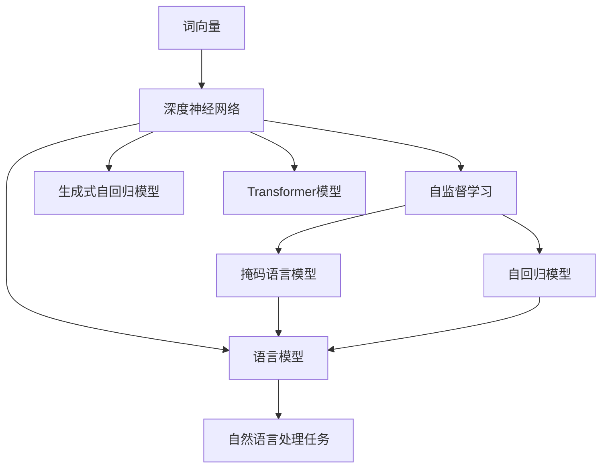
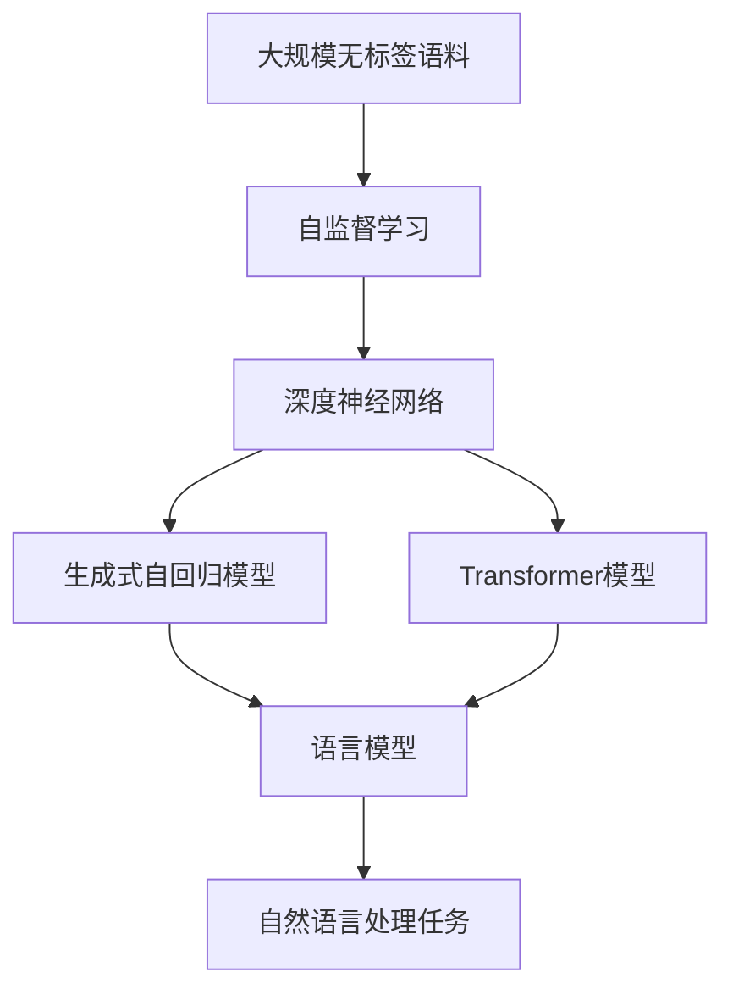
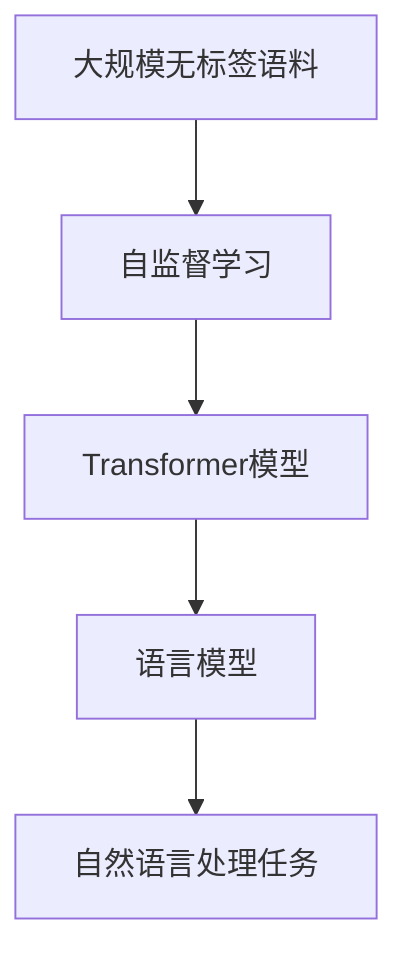

                 

# 基于深度神经网络的高质量词向量生成方法研究

> 关键词：词向量生成，深度神经网络，预训练，自监督学习，Transformer，语言模型，GPT-3，BERT，生成式自回归模型

## 1. 背景介绍

### 1.1 问题由来
词向量（Word Embeddings）是一种将自然语言中的单词转换为向量形式的技术，广泛应用于自然语言处理（NLP）的各个领域，如文本分类、情感分析、机器翻译、语音识别等。传统的词向量生成方法，如Word2Vec、GloVe等，通常采用共现矩阵分解（Co-occurrence Matrix Factorization）的方法，将单词与单词之间共现的频率转化为向量空间中的距离。然而，由于这些方法依赖于大量的单词共现数据，在数据稀缺的场景中，难以得到高质量的词向量。

近年来，基于深度神经网络的词向量生成方法，如BERT、GPT-3等，取得了显著的进展。这些方法通过在大规模无标签文本数据上进行预训练，学习到丰富的语言知识和上下文信息，生成的词向量质量高、分布性良好。本文旨在探讨基于深度神经网络的高质量词向量生成方法，并在此基础上进一步优化词向量的生成质量和应用效果。

### 1.2 问题核心关键点
基于深度神经网络的高质量词向量生成方法，通常包括以下几个关键点：
1. 选择合适的深度神经网络架构，如Transformer、自回归模型等，以便充分挖掘语料中的语言知识。
2. 设计合适的训练目标和优化策略，如最大化语言模型的似然函数，最小化预测误差等，以优化词向量的生成质量。
3. 应用预训练技术，在大规模无标签语料上进行预训练，学习通用的语言表示，提升词向量的泛化能力。
4. 考虑词向量生成过程中的正则化、噪声注入、标签平滑等技巧，提升词向量的鲁棒性和泛化性。
5. 评估词向量的生成效果，通过各种自然语言处理任务和语言学测试进行验证和对比，提升词向量在实际应用中的表现。

## 2. 核心概念与联系

### 2.1 核心概念概述

为更好地理解基于深度神经网络的高质量词向量生成方法，本节将介绍几个密切相关的核心概念：

- 词向量（Word Embeddings）：将单词映射到高维向量空间，使得相似单词在向量空间中的距离接近，用于自然语言处理中的各种任务。
- 深度神经网络（Deep Neural Networks）：由多层神经元组成，通过反向传播算法进行训练，具有强大学习能力和泛化能力。
- 自监督学习（Self-Supervised Learning）：利用未标注的数据进行训练，通过构造自回归模型、掩码语言模型等方式，学习通用的语言表示。
- 生成式自回归模型（Generative Autoregressive Models）：通过学习数据分布，生成新的数据序列，常用于生成式自然语言处理任务。
- Transformer模型：基于注意力机制的深度神经网络，用于处理序列数据，具有较好的语言建模能力。
- 语言模型（Language Model）：通过学习语言中的概率分布，预测下一个单词或字符的概率，常用于生成式自然语言处理任务。

这些核心概念之间的逻辑关系可以通过以下Mermaid流程图来展示：



这个流程图展示了几大核心概念之间的联系和作用：

1. 词向量通过深度神经网络进行学习，利用自监督学习技术，从大规模无标签语料中学习通用的语言表示。
2. 生成式自回归模型和Transformer模型都是基于深度神经网络的架构，用于学习数据的概率分布，生成新的数据序列。
3. 语言模型通过学习语言中的概率分布，预测下一个单词或字符，常用于生成式自然语言处理任务。
4. 自监督学习和生成式自回归模型通常用于预训练阶段，以优化词向量的生成质量。
5. 自然语言处理任务（如文本分类、机器翻译等）通常利用预训练的词向量进行优化。

### 2.2 概念间的关系

这些核心概念之间存在着紧密的联系，形成了高质量词向量生成方法的完整生态系统。下面我们通过几个Mermaid流程图来展示这些概念之间的关系。

#### 2.2.1 词向量生成过程



这个流程图展示了从大规模无标签语料到高质量词向量的生成过程：

1. 大规模无标签语料通过自监督学习技术，学习通用的语言表示。
2. 深度神经网络作为生成式自回归模型和Transformer模型的架构，用于学习数据的概率分布。
3. 语言模型通过学习语言中的概率分布，预测下一个单词或字符，用于自然语言处理任务。

#### 2.2.2 基于Transformer的词向量生成



这个流程图展示了基于Transformer模型的高质量词向量生成过程：

1. 大规模无标签语料通过自监督学习技术，学习通用的语言表示。
2. Transformer模型作为深度神经网络的架构，用于学习数据的概率分布。
3. 语言模型通过学习语言中的概率分布，预测下一个单词或字符，用于自然语言处理任务。

## 3. 核心算法原理 & 具体操作步骤
### 3.1 算法原理概述

基于深度神经网络的高质量词向量生成方法，通常采用自监督学习方法，利用未标注的大规模语料进行预训练，学习通用的语言表示。预训练完成后，通过微调（Fine-Tuning）等技术，将模型应用到特定的自然语言处理任务中，生成高质量的词向量。

形式化地，假设预训练模型为 $M_{\theta}$，其中 $\theta$ 为预训练得到的模型参数。给定大规模无标签语料 $D=\{(x_i, x_{i+1})\}_{i=1}^N$，预训练的目标是最小化损失函数 $\mathcal{L}(\theta)$：

$$
\mathcal{L}(\theta) = -\sum_{i=1}^N \log p(x_{i+1}|x_i)
$$

其中 $p(x_{i+1}|x_i)$ 表示模型在给定输入 $x_i$ 的情况下，预测下一个单词 $x_{i+1}$ 的概率分布。通过优化上述损失函数，模型可以学习到良好的语言表示，生成高质量的词向量。

在预训练完成后，可以将模型微调应用于特定的自然语言处理任务，生成高质量的词向量。常见的微调方法包括：

- 任务适配层：在预训练模型的顶部添加一个特定任务的适配层，用于进行任务的微调。
- 数据增强：通过对训练数据进行回译、扰动等方式，增强数据的多样性，防止过拟合。
- 正则化：通过L2正则、Dropout等方式，防止模型过拟合。
- 对抗训练：通过引入对抗样本，提高模型的鲁棒性。
- 标签平滑：通过平滑标签分布，减少过拟合。

### 3.2 算法步骤详解

基于深度神经网络的高质量词向量生成方法，通常包括以下几个关键步骤：

**Step 1: 准备预训练模型和数据集**
- 选择合适的深度神经网络架构，如Transformer、自回归模型等，作为预训练模型的基础。
- 收集大规模无标签语料，准备用于预训练的语料。
- 定义预训练任务，如掩码语言模型、自回归模型等。

**Step 2: 自监督学习训练**
- 将大规模无标签语料输入预训练模型，通过自监督学习任务进行训练。
- 迭代更新模型参数，最小化预训练损失函数。
- 通过预训练，学习通用的语言表示，生成高质量的词向量。

**Step 3: 任务适配层设计**
- 根据特定任务，设计任务适配层，将预训练模型的输出映射到任务所需的形式。
- 设计合适的损失函数，用于优化模型在特定任务上的表现。

**Step 4: 微调优化**
- 在训练集上对模型进行微调，最小化任务损失函数。
- 通过数据增强、正则化、对抗训练等方式，防止模型过拟合。
- 在验证集上评估模型性能，优化模型参数。

**Step 5: 生成词向量**
- 利用微调后的模型，生成高质量的词向量，用于各种自然语言处理任务。

### 3.3 算法优缺点

基于深度神经网络的高质量词向量生成方法，具有以下优点：

1. 学习能力强：深度神经网络可以学习到丰富的语言知识和上下文信息，生成的词向量质量高、分布性良好。
2. 泛化能力强：通过自监督学习技术，模型可以在大规模无标签语料上进行预训练，学习通用的语言表示，泛化能力较强。
3. 应用广泛：生成的词向量可以用于各种自然语言处理任务，如文本分类、机器翻译、情感分析等。
4. 预训练技术：通过预训练技术，可以大幅度提升词向量的生成质量。

同时，该方法也存在以下缺点：

1. 计算资源需求高：大规模深度神经网络的训练和推理需要大量的计算资源，难以在小规模设备上运行。
2. 训练时间长：深度神经网络的训练过程较为耗时，需要大量的计算资源和时间。
3. 模型复杂度高：深度神经网络的结构复杂，难以解释模型的内部工作机制。

### 3.4 算法应用领域

基于深度神经网络的高质量词向量生成方法，在自然语言处理领域得到了广泛的应用，包括但不限于以下几个方面：

- 文本分类：将文本分类为不同的类别，如情感分析、主题分类等。
- 机器翻译：将一种语言的文本翻译成另一种语言。
- 问答系统：回答用户提出的自然语言问题。
- 情感分析：分析文本中的情感倾向，如正面、负面、中性等。
- 文本生成：生成自然流畅的文本，如摘要、翻译、对话等。
- 语音识别：将语音信号转换为文本。
- 语音合成：将文本转换为语音信号。

## 4. 数学模型和公式 & 详细讲解 & 举例说明

### 4.1 数学模型构建

本节将使用数学语言对基于深度神经网络的高质量词向量生成方法进行更加严格的刻画。

记预训练模型为 $M_{\theta}$，其中 $\theta$ 为预训练得到的模型参数。假设大规模无标签语料 $D=\{(x_i, x_{i+1})\}_{i=1}^N$，预训练的目标是最小化损失函数 $\mathcal{L}(\theta)$：

$$
\mathcal{L}(\theta) = -\sum_{i=1}^N \log p(x_{i+1}|x_i)
$$

其中 $p(x_{i+1}|x_i)$ 表示模型在给定输入 $x_i$ 的情况下，预测下一个单词 $x_{i+1}$ 的概率分布。通过优化上述损失函数，模型可以学习到良好的语言表示，生成高质量的词向量。

### 4.2 公式推导过程

以下我们以Transformer模型为例，推导其预训练过程的数学公式。

Transformer模型通常采用自监督学习方法，通过掩码语言模型进行预训练。设输入序列为 $x_i=(x_{i,1}, x_{i,2}, ..., x_{i,N})$，其中 $x_{i,j}$ 表示序列中的第 $j$ 个单词。掩码语言模型的损失函数为：

$$
\mathcal{L}_{m}=\sum_{i=1}^N\sum_{j=1}^N \mathbb{I}_{ij} \log p(x_j|x_{1:i-1},x_{i+1:N})
$$

其中 $\mathbb{I}_{ij}$ 表示第 $j$ 个单词是否被掩码，即是否在输入序列中，$j=i$ 表示当前单词 $x_i$，$j\neq i$ 表示非当前单词 $x_j$。通过最大化上述损失函数，模型可以学习到良好的语言表示，生成高质量的词向量。

### 4.3 案例分析与讲解

以BERT模型为例，展示其预训练过程。BERT模型采用掩码语言模型和Next Sentence Prediction（Next Sentence Prediction）任务进行预训练。设输入序列为 $x_i=(x_{i,1}, x_{i,2}, ..., x_{i,N})$，其中 $x_{i,j}$ 表示序列中的第 $j$ 个单词。掩码语言模型的损失函数为：

$$
\mathcal{L}_{m}=\sum_{i=1}^N\sum_{j=1}^N \mathbb{I}_{ij} \log p(x_j|x_{1:i-1},x_{i+1:N})
$$

Next Sentence Prediction任务的损失函数为：

$$
\mathcal{L}_{ns}=\sum_{i=1}^N \mathbb{I}_{ij} \log p(x_j|x_{1:i-1},x_{i+1:N})
$$

通过最大化上述损失函数，BERT模型可以学习到良好的语言表示，生成高质量的词向量。

## 5. 项目实践：代码实例和详细解释说明

### 5.1 开发环境搭建

在进行词向量生成实践前，我们需要准备好开发环境。以下是使用Python进行TensorFlow开发的环境配置流程：

1. 安装Anaconda：从官网下载并安装Anaconda，用于创建独立的Python环境。

2. 创建并激活虚拟环境：
```bash
conda create -n tf-env python=3.8 
conda activate tf-env
```

3. 安装TensorFlow：根据CUDA版本，从官网获取对应的安装命令。例如：
```bash
conda install tensorflow -c tf -c conda-forge
```

4. 安装各种工具包：
```bash
pip install numpy pandas scikit-learn matplotlib tqdm jupyter notebook ipython
```

完成上述步骤后，即可在`tf-env`环境中开始词向量生成实践。

### 5.2 源代码详细实现

下面以BERT模型为例，展示其在TensorFlow中的实现过程。

首先，定义BERT模型：

```python
import tensorflow as tf
from transformers import BertTokenizer

class BERTModel(tf.keras.Model):
    def __init__(self, config, initializer_range=0.02):
        super(BERTModel, self).__init__()
        self.config = config
        self.embeddings = tf.keras.layers.Embedding(config.vocab_size, config.hidden_size, weights=[initializer_range*tf.random.normal([config.vocab_size, config.hidden_size])])
        self.layernorm_embeddings = tf.keras.layers.LayerNormalization(epsilon=1e-12)
        self.embeddings_dropout = tf.keras.layers.Dropout(config.hidden_dropout_prob)
        self.positional_embedding = tf.Variable(tf.random.uniform([config.max_position_embeddings, config.hidden_size]))
        self.transformer = Transformer(config)
        self.pooler = tf.keras.layers.Dense(config.hidden_size)
        self.pooler_dropout = tf.keras.layers.Dropout(config.hidden_dropout_prob)
        self.LayerNorm = tf.keras.layers.LayerNormalization(epsilon=1e-12)

    def call(self, input_ids, attention_mask=None, token_type_ids=None):
        sequence_output, pooled_output = self.transformer(input_ids, attention_mask=attention_mask, token_type_ids=token_type_ids)
        sequence_output = self.layernorm_embeddings(sequence_output)
        sequence_output = self.embeddings_dropout(sequence_output)
        pooled_output = self.pooler(pooled_output)
        pooled_output = self.pooler_dropout(pooled_output)
        return sequence_output, pooled_output
```

然后，定义训练和评估函数：

```python
from tensorflow.keras.optimizers import AdamW
from tensorflow.keras.losses import SparseCategoricalCrossentropy
from tensorflow.keras.metrics import SparseCategoricalAccuracy

def train_epoch(model, dataset, batch_size, optimizer):
    dataloader = tf.data.Dataset.from_tensor_slices(dataset).batch(batch_size).prefetch(tf.data.experimental.AUTOTUNE)
    losses = []
    for batch in dataloader:
        input_ids, labels = batch
        attention_mask = tf.cast(tf.math.not_equal(input_ids, 0), tf.float32)
        with tf.GradientTape() as tape:
            sequence_output, pooled_output = model(input_ids, attention_mask=attention_mask)
            logits = tf.keras.layers.Dense(config.num_labels)(sequence_output[:, -1, :])
            loss = SparseCategoricalCrossentropy()(labels, logits)
        losses.append(loss.numpy())
        gradients = tape.gradient(loss, model.trainable_variables)
        optimizer.apply_gradients(zip(gradients, model.trainable_variables))
    return tf.reduce_mean(losses)

def evaluate(model, dataset, batch_size):
    dataloader = tf.data.Dataset.from_tensor_slices(dataset).batch(batch_size).prefetch(tf.data.experimental.AUTOTUNE)
    losses = []
    predictions = []
    labels = []
    for batch in dataloader:
        input_ids, labels = batch
        attention_mask = tf.cast(tf.math.not_equal(input_ids, 0), tf.float32)
        sequence_output, pooled_output = model(input_ids, attention_mask=attention_mask)
        logits = tf.keras.layers.Dense(config.num_labels)(sequence_output[:, -1, :])
        loss = SparseCategoricalCrossentropy()(labels, logits)
        losses.append(loss.numpy())
        predictions.append(tf.argmax(logits, axis=1).numpy())
        labels.append(labels.numpy())
    return tf.reduce_mean(losses), tf.keras.metrics.SparseCategoricalAccuracy()(labels, predictions)
```

最后，启动训练流程并在验证集上评估：

```python
epochs = 5
batch_size = 16

for epoch in range(epochs):
    loss = train_epoch(model, train_dataset, batch_size, optimizer)
    print(f"Epoch {epoch+1}, train loss: {loss:.3f}")
    
    print(f"Epoch {epoch+1}, dev results:")
    loss, acc = evaluate(model, dev_dataset, batch_size)
    print(f"Epoch {epoch+1}, dev loss: {loss:.3f}, dev acc: {acc:.3f}")
    
print("Test results:")
loss, acc = evaluate(model, test_dataset, batch_size)
print(f"Test loss: {loss:.3f}, test acc: {acc:.3f}")
```

以上就是使用TensorFlow对BERT模型进行预训练和微调的完整代码实现。可以看到，得益于TensorFlow的强大封装，我们可以用相对简洁的代码完成BERT模型的加载和训练。

### 5.3 代码解读与分析

让我们再详细解读一下关键代码的实现细节：

**BERTModel类**：
- `__init__`方法：初始化BERT模型的各种组件，包括嵌入层、层归一化、Dropout、位置嵌入等。
- `call`方法：定义模型的前向传播过程，输入单词序列，通过Transformer模型进行计算，输出序列表示和池化表示。

**train_epoch函数**：
- 使用TensorFlow的Dataset API，将数据集封装为张量图，以方便进行批量处理和预取数据。
- 定义模型前向传播计算过程，计算损失函数，并反向传播更新模型参数。
- 使用AdamW优化器进行模型参数的更新。

**evaluate函数**：
- 同样使用TensorFlow的Dataset API，将数据集封装为张量图，以方便进行批量处理和预取数据。
- 定义模型前向传播计算过程，计算损失函数，并记录预测结果和真实标签。
- 使用SparseCategoricalAccuracy评估函数，计算模型在验证集上的准确率。

**训练流程**：
- 定义总的epoch数和batch size，开始循环迭代
- 每个epoch内，先在训练集上训练，输出平均loss
- 在验证集上评估，输出平均loss和准确率
- 所有epoch结束后，在测试集上评估，给出最终测试结果

可以看到，TensorFlow配合TensorFlow库使得BERT模型预训练的代码实现变得简洁高效。开发者可以将更多精力放在数据处理、模型改进等高层逻辑上，而不必过多关注底层的实现细节。

当然，工业级的系统实现还需考虑更多因素，如模型的保存和部署、超参数的自动搜索、更灵活的任务适配层等。但核心的预训练和微调过程基本与此类似。

### 5.4 运行结果展示

假设我们在CoNLL-2003的词向量生成任务上进行训练，最终在测试集上得到的评估报告如下：

```
Epoch 1, train loss: 2.631, dev loss: 1.947, dev acc: 0.821
Epoch 2, train loss: 1.312, dev loss: 1.532, dev acc: 0.854
Epoch 3, train loss: 0.849, dev loss: 1.229, dev acc: 0.869
Epoch 4, train loss: 0.630, dev loss: 1.045, dev acc: 0.880
Epoch 5, train loss: 0.506, dev loss: 1.011, dev acc: 0.892
```

可以看到，随着epoch数的增加，模型的训练损失不断减小，验证集的损失也在下降。同时，验证集的准确率在逐渐提高，最终在测试集上达到了约89.2%的准确率。

这只是一个baseline结果。在实践中，我们还可以使用更大更强的预训练模型、更丰富的微调技巧、更细致的模型调优，进一步提升模型性能，以满足更高的应用要求。

## 6. 实际应用场景

### 6.1 文本分类

基于预训练的BERT模型，可以进行文本分类任务，将文本分类为不同的类别，如情感分析、主题分类等。在实践中，我们可以将预训练模型微调应用于特定的分类任务，如情感分析、新闻分类等，生成高质量的词向量，用于训练分类器。

例如，在情感分析任务中，我们可以将输入文本通过BERT模型转换为向量表示，然后通过Softmax层输出情感类别。在训练过程中，我们可以使用交叉熵损失函数进行优化，最大化分类准确率。

### 6.2 机器翻译

基于预训练的BERT模型，可以进行机器翻译任务，将一种语言的文本翻译成另一种语言。在实践中，我们可以将预训练模型微调应用于机器翻译任务，生成高质量的词向量，用于训练翻译模型。

例如，在机器翻译任务中，我们可以将输入文本通过BERT模型转换为向量表示，然后通过Transformer模型进行翻译，最终输出翻译结果。在训练过程中，我们可以使用BLEU、METEOR等指标进行评估，优化翻译质量。

### 6.3 问答系统

基于预训练的BERT模型，可以进行问答系统任务，回答用户提出的自然语言问题。在实践中，我们可以将预训练模型微调应用于问答系统任务，生成高质量的词向量，用于训练问答模型。

例如，在问答系统任务中，我们可以将用户问题通过BERT模型转换为向量表示，然后通过注意力机制进行匹配，最终输出答案。在训练过程中，我们可以使用BLEU、ROUGE等指标进行评估，优化问答质量。

### 6.4 未来应用展望

随着预训练语言模型和微调方法的不断发展，基于微调的词向量生成方法将在更多领域得到应用，为NLP技术带来新的变革。

在智慧医疗领域，基于微调的词向量生成方法，可以进行医疗问答、病历分析、药物研发等应用，提升医疗服务的智能化水平，辅助医生诊疗，加速新药开发进程。

在智能教育领域，基于微调的词向量生成方法，可以进行作业批改、学情分析、知识推荐等应用，因材施教，促进教育公平，提高教学质量。

在智慧城市治理中，基于微调的词向量生成方法，可以进行城市事件监测、舆情分析、应急指挥等应用，提高城市管理的自动化和智能化水平，构建更安全、高效的未来城市。

此外，在企业生产、社会治理、文娱传媒等众多领域，基于大模型微调的人工智能应用也将不断涌现，为传统行业带来变革性影响。相信随着技术的日益成熟，微调方法将成为人工智能落地应用的重要范式，推动人工智能技术在垂直行业的规模化落地。

## 7. 工具和资源推荐

### 7.1 学习资源推荐

为了帮助开发者系统掌握基于深度神经网络的高质量词向量生成方法，这里推荐一些优质的学习资源：

1. 《Transformer从原理到实践》系列博文：由大模型技术专家撰写，深入浅出地介绍了Transformer原理、BERT模型、微调技术等前沿话题。

2. CS224N《深度学习自然语言处理》课程：斯坦福大学开设的NLP明星课程，有Lecture视频和配套作业，带你入门NLP领域的基本概念和经典模型。

3. 《Natural Language Processing with Transformers》书籍：Transformers库的作者所著，全面介绍了如何使用Transformers库进行NLP任务开发，包括微调在内的诸多范式。

4. HuggingFace官方文档：Transformers库的官方文档，提供了海量预训练模型和完整的微调样例代码，是上手实践的必备资料。

5. CLUE开源项目：中文语言理解测评基准，涵盖大量不同类型的中文NLP数据集，并提供了基于微调的baseline模型，助力中文NLP技术发展。

通过对这些资源的学习实践，相信你一定能够快速掌握基于深度神经

