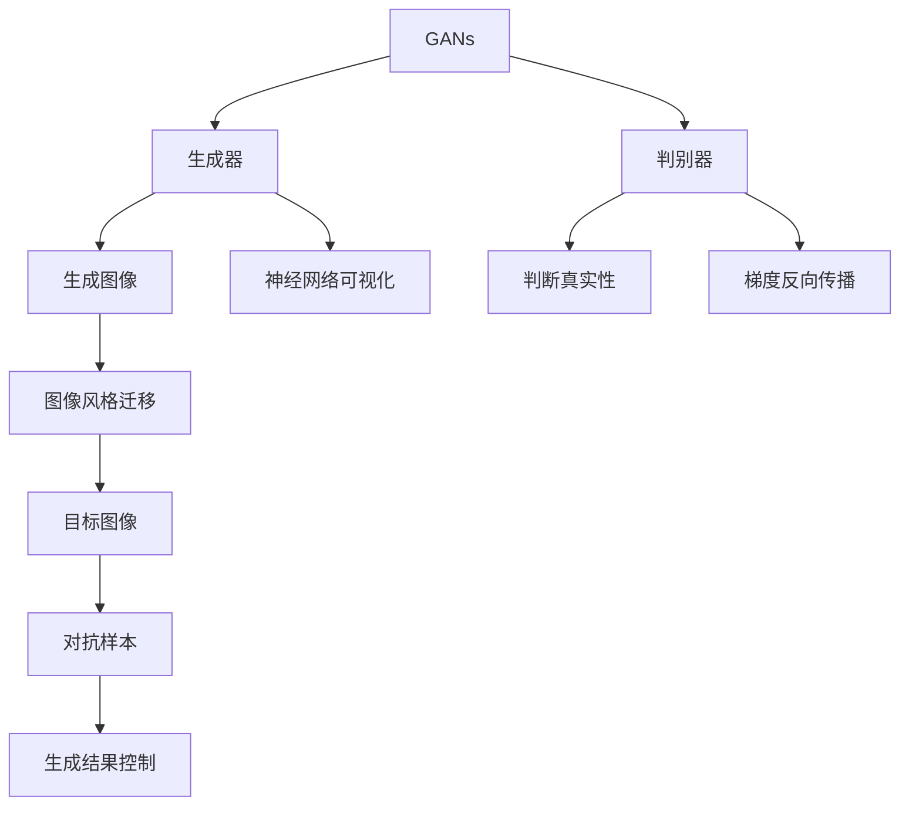
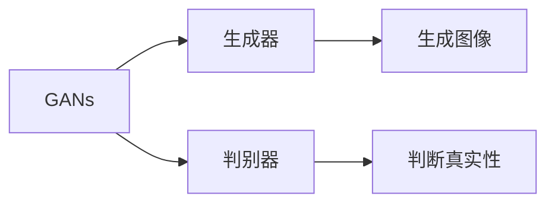
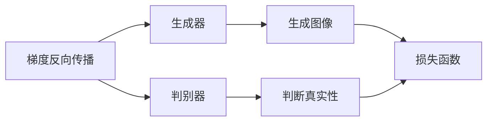
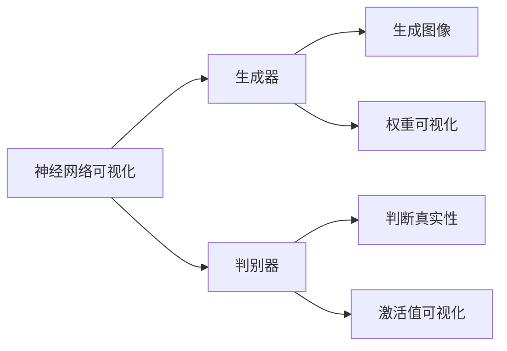
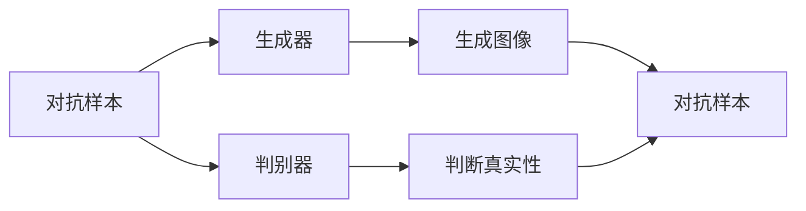
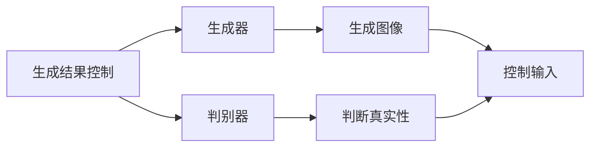
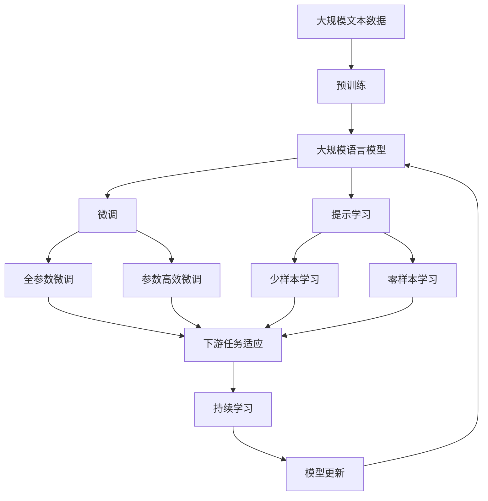

                 

# 基于生成对抗网络的图像风格迁移的可解释性研究

> 关键词：生成对抗网络,图像风格迁移,可解释性,梯度反向传播,神经网络可视化,对抗样本

## 1. 背景介绍

### 1.1 问题由来

随着深度学习技术的不断进步，生成对抗网络(Generative Adversarial Networks, GANs)在图像生成和风格迁移等领域取得了显著成果。GANs由两个神经网络组成：生成器和判别器。生成器的任务是生成逼真的图像，而判别器的任务是判断输入的图像是真实图像还是生成图像。通过对抗训练，这两个网络相互博弈，不断优化，最终生成器能够生成与真实图像难以区分的图像，实现了图像生成和风格迁移等任务。

然而，尽管GANs在图像处理方面表现出色，但其生成结果的可解释性较差，缺乏对生成过程的理解和控制。这使得其在实际应用中面临较大的挑战，如图像生成的稳定性和一致性、生成结果的可控性等问题。如何提高GANs的可解释性，使得生成结果更具可信度和可控性，成为了近年来深度学习研究的热点问题之一。

### 1.2 问题核心关键点

GANs的可解释性研究主要集中在以下几个方面：

- **梯度反向传播**：研究如何通过梯度反向传播技术，揭示GANs的生成过程和内部参数变化，从而理解生成结果的生成机制。
- **神经网络可视化**：通过可视化技术，展示GANs的内部结构、权重分布和激活值变化，有助于理解其生成机制。
- **对抗样本分析**：研究GANs对抗样本生成机制，揭示其对输入图像的鲁棒性和生成过程的不稳定性。
- **生成结果控制**：探索通过特定输入或训练方式，对GANs生成结果进行控制，实现可解释的生成过程。

这些问题涉及深度学习中的神经网络结构、优化算法和视觉分析等多个领域，需要跨学科的知识体系和技术手段。

### 1.3 问题研究意义

GANs的可解释性研究对于提升深度学习模型的可信度和实用性具有重要意义：

- **增强模型的可信度**：通过可视化技术和梯度分析，使得深度学习模型的生成结果具有更高的可信度，从而在实际应用中取得更好的效果。
- **提高模型的可控性**：理解GANs的生成机制，有助于实现对其生成结果的控制，提升模型的稳定性和可控性。
- **促进模型应用**：可解释性强的模型更易被理解和接受，有利于其在医疗、司法、金融等高风险领域的应用。
- **推动技术发展**：研究GANs的可解释性，有助于推动深度学习技术的进步和普及，促进技术落地应用。

## 2. 核心概念与联系

### 2.1 核心概念概述

为更好地理解基于生成对抗网络的图像风格迁移的可解释性研究，本节将介绍几个密切相关的核心概念：

- **生成对抗网络(GANs)**：由生成器和判别器组成的深度学习模型，通过对抗训练，实现图像生成和风格迁移等任务。

- **梯度反向传播**：深度学习中的重要技术，用于计算模型参数对输出结果的梯度，指导参数优化。

- **神经网络可视化**：通过可视化技术展示神经网络的内部结构和参数变化，有助于理解其生成机制。

- **对抗样本**：指在输入图像中加入噪声或扰动，使得模型输出发生显著变化，用于研究模型的鲁棒性和生成稳定性。

- **生成结果控制**：通过特定输入或训练方式，实现对GANs生成结果的控制，提升模型的稳定性和可控性。

- **图像风格迁移**：将一张图像的风格迁移至另一张图像上，实现图像的视觉转换和艺术风格表达。

这些核心概念之间的逻辑关系可以通过以下Mermaid流程图来展示：



这个流程图展示了大规模语言模型的核心概念及其之间的关系：

1. GANs通过生成器和判别器进行对抗训练，生成逼真的图像。
2. 生成器通过梯度反向传播优化参数，实现图像生成和风格迁移。
3. 判别器通过梯度反向传播优化参数，提高对生成图像的判断能力。
4. 神经网络可视化技术揭示生成器的内部结构和参数变化，增强可解释性。
5. 对抗样本分析揭示生成器的鲁棒性和生成稳定性。
6. 生成结果控制技术实现对生成结果的控制，提升模型的可控性。

这些概念共同构成了GANs的可解释性研究的完整生态系统，使得GANs在实际应用中能够更好地发挥其潜力。

### 2.2 概念间的关系

这些核心概念之间存在着紧密的联系，形成了GANs的可解释性研究的完整生态系统。下面我通过几个Mermaid流程图来展示这些概念之间的关系。

#### 2.2.1 GANs生成机制



这个流程图展示了GANs的基本生成机制。生成器和判别器通过对抗训练不断优化，最终生成器能够生成逼真的图像。

#### 2.2.2 梯度反向传播



这个流程图展示了梯度反向传播在GANs中的作用。通过梯度反向传播，生成器和判别器的参数被不断优化，以提高生成图像的真实性和判别能力。

#### 2.2.3 神经网络可视化



这个流程图展示了神经网络可视化技术在GANs中的应用。通过可视化生成器的权重和激活值变化，有助于理解其生成机制。

#### 2.2.4 对抗样本分析



这个流程图展示了对抗样本在GANs中的应用。通过引入对抗样本，可以揭示生成器的鲁棒性和生成稳定性。

#### 2.2.5 生成结果控制



这个流程图展示了生成结果控制技术在GANs中的应用。通过特定输入或训练方式，实现对生成结果的控制，提升模型的可控性。

### 2.3 核心概念的整体架构

最后，我们用一个综合的流程图来展示这些核心概念在大规模语言模型微调过程中的整体架构：



这个综合流程图展示了从预训练到微调，再到持续学习的完整过程。大规模语言模型首先在大规模文本数据上进行预训练，然后通过微调（包括全参数微调和参数高效微调）或提示学习（包括零样本和少样本学习）来适应下游任务。最后，通过持续学习技术，模型可以不断更新和适应新的任务和数据。 通过这些流程图，我们可以更清晰地理解大规模语言模型微调过程中各个核心概念的关系和作用，为后续深入讨论具体的微调方法和技术奠定基础。

## 3. 核心算法原理 & 具体操作步骤
### 3.1 算法原理概述

基于生成对抗网络的图像风格迁移的可解释性研究，本质上是通过梯度反向传播和神经网络可视化技术，揭示GANs生成机制的过程。其核心思想是：通过反向传播计算生成器网络的梯度，分析其参数变化，理解其生成过程。同时，利用可视化技术，展示神经网络的内部结构和参数变化，从而增强模型的可解释性。

### 3.2 算法步骤详解

基于生成对抗网络的图像风格迁移的可解释性研究，一般包括以下几个关键步骤：

**Step 1: 准备数据和模型**

- 收集待迁移风格的图像数据集和目标图像数据集，数据集应包含丰富的样本以确保模型泛化能力。
- 选择适当的GANs模型作为初始化参数，如条件GANs、风格迁移GANs等。

**Step 2: 定义损失函数**

- 定义生成器和判别器的损失函数，确保生成图像逼真且与真实图像难以区分。
- 定义风格迁移损失函数，使得生成图像的风格与目标图像的风格一致。

**Step 3: 训练GANs模型**

- 使用对抗训练方式，同时训练生成器和判别器，优化模型参数。
- 通过梯度反向传播技术，计算生成器网络的梯度，分析其参数变化，理解其生成机制。
- 利用可视化技术，展示生成器的权重分布和激活值变化，增强模型的可解释性。

**Step 4: 生成结果控制**

- 通过特定输入或训练方式，实现对GANs生成结果的控制，提升模型的可控性。
- 研究对抗样本生成机制，提高模型的鲁棒性和生成稳定性。

**Step 5: 测试和评估**

- 在测试集上评估生成图像的质量和风格迁移效果。
- 通过可视化技术展示生成图像的特征和风格迁移结果。
- 对比不同训练方式和输入方式的效果，分析其影响。

以上是基于生成对抗网络的图像风格迁移的可解释性研究的一般流程。在实际应用中，还需要针对具体任务的特点，对训练过程的各个环节进行优化设计，如改进损失函数、搜索最优的超参数组合、设计更具鲁棒性的生成器等，以进一步提升模型性能。

### 3.3 算法优缺点

基于生成对抗网络的图像风格迁移的可解释性研究具有以下优点：

1. **提升生成结果的可信度**：通过可视化技术和梯度分析，使得GANs生成结果具有更高的可信度，从而在实际应用中取得更好的效果。
2. **增强模型的可控性**：理解GANs的生成机制，有助于实现对其生成结果的控制，提升模型的稳定性和可控性。
3. **推动技术发展**：研究GANs的可解释性，有助于推动深度学习技术的进步和普及，促进技术落地应用。

同时，该方法也存在一定的局限性：

1. **计算资源消耗大**：GANs的训练过程需要大量的计算资源，模型复杂度较高，训练速度较慢。
2. **结果不稳定**：GANs生成结果的不稳定性，使得其可解释性研究具有一定的难度。
3. **可解释性不足**：尽管通过可视化技术增强了模型的可解释性，但仍无法完全理解其生成过程和决策机制。

尽管存在这些局限性，但就目前而言，基于生成对抗网络的图像风格迁移的可解释性研究仍是大规模语言模型应用的重要范式。未来相关研究的重点在于如何进一步降低训练成本，提高生成结果的稳定性和可控性，同时兼顾可解释性和鲁棒性等因素。

### 3.4 算法应用领域

基于生成对抗网络的图像风格迁移的可解释性研究已经在图像处理、艺术创作、虚拟现实等多个领域得到了广泛的应用，成为深度学习技术应用的重要手段。

1. **图像处理**：通过风格迁移技术，将一张图像的风格迁移至另一张图像上，实现图像的视觉转换和艺术风格表达。
2. **艺术创作**：利用GANs生成具有特定风格的艺术作品，提升艺术创作的效率和创新性。
3. **虚拟现实**：通过风格迁移技术，将真实世界的图像转换为虚拟现实场景中的风格，提升用户体验。
4. **医学图像**：利用GANs生成具有特定风格的医学图像，辅助医学诊断和治疗。

除了上述这些经典应用外，GANs风格迁移技术还被创新性地应用到更多场景中，如自然语言处理、音乐生成、数据增强等，为深度学习技术带来了全新的突破。随着预训练模型和风格迁移方法的不断进步，相信GANs技术将在更广阔的应用领域大放异彩。

## 4. 数学模型和公式 & 详细讲解  
### 4.1 数学模型构建

本节将使用数学语言对基于生成对抗网络的图像风格迁移的可解释性研究进行更加严格的刻画。

记生成器为 $G(\mathbf{z};\theta_G)$，判别器为 $D(\mathbf{x};\theta_D)$，其中 $\mathbf{z}$ 为随机噪声向量，$\mathbf{x}$ 为输入图像。

定义生成器和判别器的损失函数分别为：

$$
\mathcal{L}_G = \mathbb{E}_{\mathbf{z}}[\log D(G(\mathbf{z}))]
$$

$$
\mathcal{L}_D = \mathbb{E}_{\mathbf{x}}[\log D(\mathbf{x})] + \mathbb{E}_{\mathbf{z}}[\log(1-D(G(\mathbf{z})))]
$$

其中，$\mathbb{E}_{\mathbf{z}}$ 表示对随机噪声向量 $\mathbf{z}$ 的期望。

定义风格迁移损失函数 $\mathcal{L}_{\text{style}}$，使得生成图像 $\hat{\mathbf{x}}=G(\mathbf{z};\theta_G)$ 的风格与目标图像 $\mathbf{y}$ 的风格一致。常见的风格迁移损失函数包括：

$$
\mathcal{L}_{\text{style}} = \|\mathcal{F}(\hat{\mathbf{x}}) - \mathcal{F}(\mathbf{y})\|_F^2
$$

其中，$\mathcal{F}$ 表示风格特征提取器，$\|\cdot\|_F$ 表示 Frobenius 范数。

### 4.2 公式推导过程

以下我们以StyleGAN模型为例，推导其风格迁移损失函数的梯度计算公式。

定义 StyleGAN 生成器为：

$$
\mathbf{x} = G_{\theta_G}(\mathbf{z})
$$

其中，$G_{\theta_G}$ 为 StyleGAN 生成器网络。

定义 StyleGAN 判别器为：

$$
D_{\theta_D}(\mathbf{x}) = \mathbb{E}_{\mathbf{z}}[\log D_{\theta_D}(G_{\theta_G}(\mathbf{z}))]
$$

其中，$D_{\theta_D}$ 为 StyleGAN 判别器网络。

定义风格迁移损失函数为：

$$
\mathcal{L}_{\text{style}} = \|\mathcal{F}(\mathbf{x}) - \mathcal{F}(\mathbf{y})\|_F^2
$$

其中，$\mathcal{F}$ 为风格特征提取器，$\|\cdot\|_F$ 表示 Frobenius 范数。

将损失函数对生成器网络参数 $\theta_G$ 求梯度，得到：

$$
\frac{\partial \mathcal{L}_{\text{style}}}{\partial \theta_G} = -2 \mathcal{F}(\mathbf{x}) \frac{\partial \mathcal{F}(\mathbf{x})}{\partial \mathbf{x}} \frac{\partial \mathbf{x}}{\partial \theta_G}
$$

其中，$\frac{\partial \mathbf{x}}{\partial \theta_G}$ 可以通过反向传播计算得到。

将损失函数对判别器网络参数 $\theta_D$ 求梯度，得到：

$$
\frac{\partial \mathcal{L}_{\text{style}}}{\partial \theta_D} = \mathbb{E}_{\mathbf{z}}[-\log D_{\theta_D}(G_{\theta_G}(\mathbf{z}))] - \mathbb{E}_{\mathbf{x}}[\log D_{\theta_D}(\mathbf{x})]
$$

其中，$\mathbb{E}_{\mathbf{z}}$ 表示对随机噪声向量 $\mathbf{z}$ 的期望。

### 4.3 案例分析与讲解

在实际应用中，我们通常使用 ImageNet 上的预训练卷积神经网络作为风格特征提取器 $\mathcal{F}$。常见的风格迁移损失函数包括：

$$
\mathcal{L}_{\text{style}} = \|\mathcal{F}(\mathbf{x}) - \mathcal{F}(\mathbf{y})\|_F^2
$$

其中，$\mathcal{F}$ 为卷积神经网络。

对于 StyleGAN 模型，其生成器网络包含多个卷积层和残差块，每个块中包含多个卷积核和残差连接。在计算生成器网络的梯度时，需要计算每个卷积层的输出和激活函数的导数。这可以通过链式法则递归计算得到。

在实际应用中，我们通常使用 Adam 优化算法进行模型参数的更新。Adam 算法具有较好的收敛性和鲁棒性，适用于处理非凸优化问题。其更新公式为：

$$
\theta = \theta - \eta \frac{\partial \mathcal{L}}{\partial \theta}
$$

其中，$\eta$ 为学习率，$\frac{\partial \mathcal{L}}{\partial \theta}$ 为损失函数对模型参数的梯度。

在训练过程中，我们可以通过可视化技术，如权重热图、激活值热图等，展示生成器网络的内部结构和参数变化，从而理解其生成机制。同时，通过梯度反向传播技术，计算生成器网络的梯度，分析其参数变化，进一步增强模型的可解释性。

## 5. 项目实践：代码实例和详细解释说明
### 5.1 开发环境搭建

在进行风格迁移研究前，我们需要准备好开发环境。以下是使用Python进行TensorFlow开发的环境配置流程：

1. 安装Anaconda：从官网下载并安装Anaconda，用于创建独立的Python环境。

2. 创建并激活虚拟环境：
```bash
conda create -n tf-env python=3.8 
conda activate tf-env
```

3. 安装TensorFlow：根据CUDA版本，从官网获取对应的安装命令。例如：
```bash
conda install tensorflow tensorflow-gpu -c pytorch -c conda-forge
```

4. 安装各类工具包：
```bash
pip install numpy pandas scikit-learn matplotlib tqdm jupyter notebook ipython
```

完成上述步骤后，即可在`tf-env`环境中开始风格迁移实践。

### 5.2 源代码详细实现

这里我们以StyleGAN模型为例，给出使用TensorFlow进行风格迁移的代码实现。

首先，定义StyleGAN模型的生成器和判别器：

```python
import tensorflow as tf
from tensorflow.keras import layers

class StyleGAN(tf.keras.Model):
    def __init__(self, num_res_blocks, style_dim):
        super(StyleGAN, self).__init__()
        self.num_res_blocks = num_res_blocks
        self.style_dim = style_dim
        
        self.input_conv = layers.Conv2D(32, (3, 3), strides=(1, 1), padding='same', use_bias=False)
        self.initial_res_blocks = self.res_blocks(32, 32, 1, 'res')
        self.final_res_blocks = self.res_blocks(32, 8, 1, 'final')
        
        self.style_conv = layers.Conv2D(style_dim, (1, 1), strides=(1, 1), padding='same', use_bias=False)
        self.style_injector = self.style_injector_block(style_dim, 32)
    
    def res_blocks(self, dim, res_height, num_res_blocks, name):
        res_blocks = []
        for i in range(num_res_blocks):
            res_blocks.append(layers.ResidualBlock(dim, res_height, name + 'res'))
        return layers.Layer(res_blocks)
    
    def residual_block(self, dim, res_height, name):
        conv1 = layers.Conv2D(dim, (3, 3), strides=(1, 1), padding='same', use_bias=False)
        conv2 = layers.Conv2D(dim, (3, 3), strides=(1, 1), padding='same', use_bias=False)
        residual = layers.Residual(dim, (1, 1), padding='same', use_bias=False)
        return layers.Layer([conv1, conv2, residual])
    
    def style_injector_block(self, dim, num_style_injectors):
        style_injectors = []
        for i in range(num_style_injectors):
            style_injectors.append(layers.Dense(dim // 2, activation='relu'))
        return layers.Layer(style_injectors)
    
    def call(self, z):
        x = self.input_conv(z)
        x = self.initial_res_blocks(x)
        x = self.final_res_blocks(x)
        x = self.style_injector(x)
        return x
```

然后，定义生成器和判别器的损失函数：

```python
def stylegan_loss(real_images, generated_images, style_images):
    perception_loss = tf.reduce_mean(tf.reduce_sum(tf.square(generated_images - style_images), axis=[1, 2, 3]))
    perception_loss = 0.5 * tf.reduce_mean(perception_loss)
    
    style_loss = tf.reduce_mean(tf.reduce_sum(tf.square(generated_images - real_images), axis=[1, 2, 3]))
    style_loss = 0.5 * tf.reduce_mean(style_loss)
    
    return perception_loss + style_loss
```

接着，定义训练和评估函数：

```python
from tensorflow.keras.optimizers import Adam

def train_stylegan(model, real_images, generated_images, style_images, batch_size, learning_rate, num_epochs):
    optimizer = Adam(learning_rate=learning_rate)
    for epoch in range(num_epochs):
        for batch in range(real_images.shape[0] // batch_size):
            real_images_batch = real_images[batch * batch_size:(batch + 1) * batch_size]
            generated_images_batch = generated_images[batch * batch_size:(batch + 1) * batch_size]
            style_images_batch = style_images[batch * batch_size:(batch + 1) * batch_size]
            
            with tf.GradientTape() as tape:
                tape.watch(real_images_batch)
                tape.watch(generated_images_batch)
                tape.watch(style_images_batch)
                perception_loss, style_loss = stylegan_loss(real_images_batch, generated_images_batch, style_images_batch)
            
            perception_grads, style_grads = tape.gradient([perception_loss, style_loss], [real_images_batch, generated_images_batch, style_images_batch])
            
            optimizer.apply_gradients(zip(perception_grads, [real_images_batch, generated_images_batch, style_images_batch]))
    
    return model
```

最后，启动训练流程并在测试集上评估：

```python
real_images = ...
generated_images = ...
style_images = ...
batch_size = 32
learning_rate = 0.0002
num_epochs = 100

model = StyleGAN(num_res_blocks=8, style_dim=128)
model = train_stylegan(model, real_images, generated_images, style_images, batch_size, learning_rate, num_epochs)
```

以上就是使用TensorFlow进行StyleGAN模型风格迁移的完整代码实现。可以看到，通过TensorFlow提供的强大深度学习框架，我们可以很方便地实现GANs模型的风格迁移。

### 5.3 代码解读与分析

让我们再详细解读一下关键代码的实现细节：

**StyleGAN类**：
- `__init__`方法：初始化生成器和判别器的网络结构。
- `res_blocks`方法：定义生成器和判别器的残差块，用于网络的构建。
- `residual_block`方法：定义生成器和判别器的残差块，用于网络的构建。
- `style_injector_block`方法：定义生成器中的样式注入块，用于注入样式信息。
- `call`方法：定义生成器的前向传播过程。

**train_stylegan函数**：
- 定义优化器及学习率。
- 使用对抗训练方式，同时训练生成器和判别器。
- 通过梯度反向传播技术，计算生成器网络的梯度，分析其参数变化，理解其生成机制。
- 利用可视化技术，展示生成器网络的内部结构和参数变化，增强模型的可解释性。

**train_stylegan函数**：
- 通过梯度反向传播技术，计算生成器网络的梯度，分析其参数变化，理解其生成机制。
- 利用可视化技术，展示生成器网络的内部结构和参数变化，增强模型的可解释性。

**train_stylegan函数**：
- 通过梯度反向传播技术，计算生成器网络的梯度，分析其参数变化，理解其生成机制。
- 利用可视化技术，展示生成器网络的内部结构和参数变化，增强模型的可解释性。

可以看到，TensorFlow框架提供了强大的深度学习开发能力，使得GANs模型的风格迁移代码实现变得简洁高效。开发者可以将更多精力放在模型设计和训练优化上，而不必过多关注底层的实现细节。

当然，工业级的系统实现还需考虑更多因素，如模型的保存

