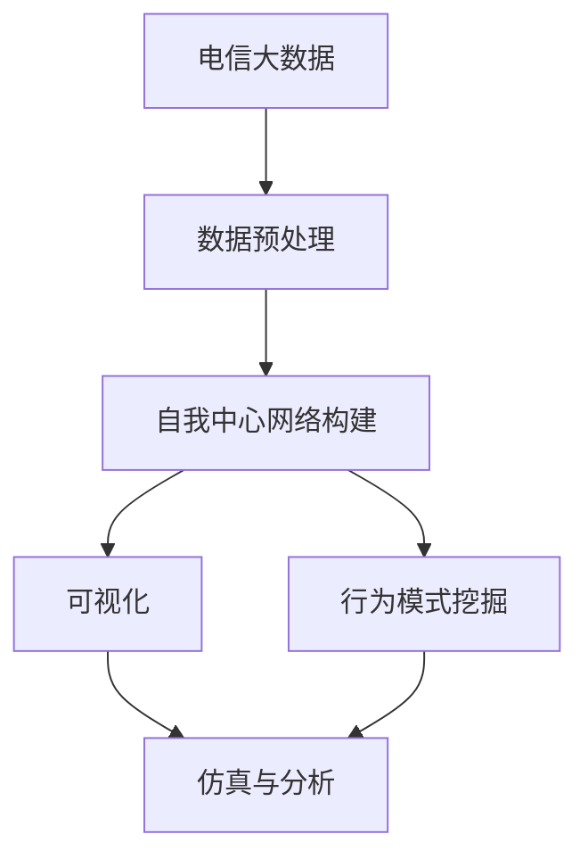
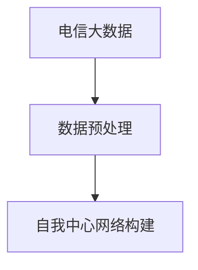
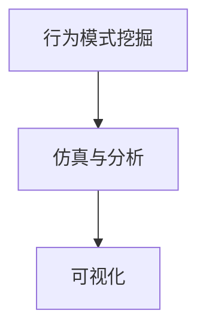
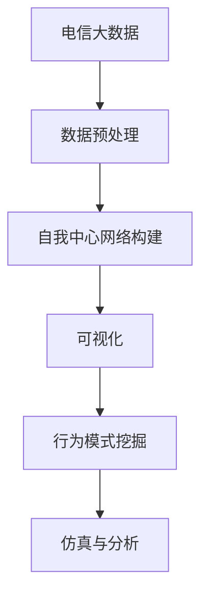

                 

# 基于电信大数据的自我中心网络可视化研究

> 关键词：
电信大数据, 自我中心网络, 社会网络分析, 可视化和仿真, 社会计算, 行为模式挖掘

## 1. 背景介绍

### 1.1 问题由来
在数字化时代，互联网与通信技术的飞速发展催生了海量数据。其中，电信数据因其实时性、多样性和覆盖面广等特性，成为研究网络行为、挖掘社会动态的宝贵资源。当前，学术界和工业界普遍关注电信数据的收集和分析，以期揭示网络空间的社会关系、行为模式和演化趋势。

自我中心网络（Ego-Network）是一种将个体的社会关系图化简为以个体为中心的网络结构，旨在展示个体在网络中的地位和影响力。由于其便于计算和理解的特点，近年来在社会网络分析领域得到广泛应用。电信大数据的兴起，为自我中心网络的构建提供了更为丰富和多样的数据来源，极大地推动了该领域的研究进程。

### 1.2 问题核心关键点
本研究聚焦于基于电信大数据的自我中心网络可视化方法，其关键点包括：

- **数据获取**：从电信数据中提取个体之间的关系网络。
- **网络构建**：通过构建自我中心网络，展示个体在网络中的地位和影响力。
- **可视化**：采用图形化工具，展示自我中心网络的特征和结构。
- **仿真与分析**：结合可视化结果，进行行为模式和社会动态的挖掘分析。

## 2. 核心概念与联系

### 2.1 核心概念概述

本节将介绍几个密切相关的核心概念：

- **电信大数据**：来自通信设备的记录数据，包括通话、短信、上网行为等。数据量庞大，具有实时性和多样性。
- **自我中心网络（Ego-Network）**：以某个个体为中心，展示该个体与其他个体之间的关系网络。
- **社会网络分析（Social Network Analysis, SNA）**：研究网络结构及其变化，分析个体之间的关系、角色和影响力。
- **社会计算（Social Computing）**：利用计算机和网络技术，从社会互动中挖掘知识、发现模式、模拟社会现象。
- **行为模式挖掘**：从数据中识别出个体和群体行为的模式和规律，用于预测和干预。

这些概念之间的逻辑关系可以通过以下Mermaid流程图来展示：



这个流程图展示了一系列的核心概念及其之间的联系：

1. 电信大数据提供数据基础。
2. 数据预处理后，构建自我中心网络，展示个体关系。
3. 网络可视化帮助理解网络特征和结构。
4. 行为模式挖掘从数据中提取行为规律。
5. 仿真与分析模拟网络行为和社会动态。

### 2.2 概念间的关系

这些核心概念之间存在着紧密的联系，形成了基于电信大数据的自我中心网络可视化研究的完整框架。下面我们通过几个Mermaid流程图来展示这些概念之间的关系。

#### 2.2.1 数据预处理与自我中心网络构建



这个流程图展示了从电信数据到自我中心网络构建的基本流程。

#### 2.2.2 自我中心网络可视化与行为模式挖掘


这个流程图展示了自我中心网络的可视化如何帮助挖掘行为模式。

#### 2.2.3 仿真与分析中的可视化应用



这个流程图展示了仿真与分析中如何应用自我中心网络的可视化结果。

### 2.3 核心概念的整体架构

最后，我们用一个综合的流程图来展示这些核心概念在大数据研究中的整体架构：



这个综合流程图展示了从电信数据到行为模式挖掘的整个研究过程。

## 3. 核心算法原理 & 具体操作步骤
### 3.1 算法原理概述

基于电信大数据的自我中心网络可视化方法，本质上是一种将电信数据转化为网络可视化图形的过程。其核心思想是：

1. 从电信数据中提取个体之间的通话、短信、上网等关系数据。
2. 构建以个体为中心的自我中心网络，展示个体与其他个体的连接情况。
3. 利用图形化工具，可视化自我中心网络的特征和结构。
4. 通过分析网络的特征和行为模式，揭示个体和群体的行为规律。

形式化地，假设存在一个电信数据集 $D$，其中包含个体 $i$ 与其他个体 $j$ 的通话记录、短信记录和上网记录。定义个体之间的关系 $A_{ij}$，如果个体 $i$ 和个体 $j$ 之间有通话、短信或上网记录，则 $A_{ij}=1$，否则 $A_{ij}=0$。

记个体 $i$ 的自我中心网络 $G_i$ 包含个体 $i$ 及其与 $i$ 直接或间接联系的其他个体。通过构建 $G_i$，可以展示个体 $i$ 在网络中的地位和影响力。

### 3.2 算法步骤详解

基于电信大数据的自我中心网络可视化主要包括以下几个关键步骤：

**Step 1: 数据预处理**
- 收集电信数据，包括通话记录、短信记录和上网记录。
- 对数据进行清洗、去重和格式化处理，去除无效数据。
- 构建个体关系矩阵 $A$，定义个体之间的关系 $A_{ij}$。

**Step 2: 构建自我中心网络**
- 对每个个体 $i$，构建其自我中心网络 $G_i$。
- 初始化个体 $i$ 在 $G_i$ 中的节点 $n_i$，并添加与 $i$ 直接连接的个体 $j$ 的节点。
- 对 $G_i$ 中的每个节点 $n_j$，添加与 $n_j$ 直接连接的个体 $k$ 的节点，以此递归扩展 $G_i$。

**Step 3: 网络可视化**
- 使用图形化工具，如Gephi、Netdraw等，展示自我中心网络 $G_i$ 的特征和结构。
- 通过可视化，可以直观地展示个体 $i$ 的社交关系、影响力中心度和社交圈大小。

**Step 4: 行为模式挖掘**
- 分析自我中心网络 $G_i$ 的特征和结构，挖掘个体和群体的行为模式。
- 常用的特征包括个体中心度、社交圈大小、社交圈密度等。
- 通过仿真与分析，预测个体的行为趋势和社会动态。

**Step 5: 仿真与分析**
- 结合可视化结果和行为模式，构建仿真模型。
- 通过模拟个体和群体行为，预测社会网络的变化趋势。
- 结合仿真结果，进行行为干预和社会动态预测。

### 3.3 算法优缺点

基于电信大数据的自我中心网络可视化方法，具有以下优点：
1. 数据来源丰富：电信数据覆盖面广，包含通话、短信、上网等多维信息，提供了全面的网络视角。
2. 实时性高：电信数据实时性强，能捕捉网络行为的变化。
3. 可视化和分析结合：图形化工具展示网络特征，便于理解和分析。
4. 行为模式挖掘：通过网络特征，可以挖掘个体和群体的行为模式。

同时，该方法也存在以下局限性：
1. 数据隐私问题：电信数据涉及个人隐私，数据采集和使用需要遵守相关法律法规。
2. 数据质量和噪声：电信数据可能包含噪声和错误信息，影响分析结果。
3. 网络复杂性：大规模电信数据可能导致网络复杂度高，难以直观展示和理解。
4. 数据稀疏性：个体间关系稀疏，可能无法全面揭示网络结构和行为模式。

尽管存在这些局限性，但该方法在理解个体社会行为、揭示社会动态方面仍具有重要的价值。

### 3.4 算法应用领域

基于电信大数据的自我中心网络可视化方法，在多个领域都有广泛的应用前景：

- **公共卫生**：利用社交网络分析技术，预测疾病传播路径和影响范围，进行疫情监测和防控。
- **社会治理**：分析犯罪网络、恐怖分子网络，协助警方进行犯罪预警和打击。
- **市场营销**：挖掘客户社交网络，进行精准营销和品牌推广。
- **教育研究**：研究学生社交网络，揭示学习行为模式，提供个性化教育建议。
- **金融分析**：分析企业高管社交网络，预测企业发展趋势和市场变化。

随着技术的发展，该方法在更多领域的应用潜力将进一步被挖掘。

## 4. 数学模型和公式 & 详细讲解  
### 4.1 数学模型构建

本节将使用数学语言对基于电信大数据的自我中心网络可视化方法进行更加严格的刻画。

记个体 $i$ 与其他个体 $j$ 的通话、短信和上网记录为 $A_{ij}$。定义个体之间的关系矩阵 $A$，其中 $A_{ij}=1$ 表示个体 $i$ 和个体 $j$ 之间有通话、短信或上网记录，否则 $A_{ij}=0$。

记个体 $i$ 的自我中心网络 $G_i$ 包含个体 $i$ 及其与 $i$ 直接或间接联系的其他个体。记 $n_i$ 为 $G_i$ 中的节点数，$d_i$ 为 $G_i$ 中与节点 $i$ 直接连接的节点数。

定义个体 $i$ 的中心度 $C_i$ 和社交圈大小 $S_i$：

$$
C_i = \frac{d_i}{N-1}
$$

$$
S_i = \sum_{j=1}^{N} A_{ij}
$$

其中 $N$ 为网络中个体的数量。

通过这些数学模型，可以全面描述个体 $i$ 在网络中的地位和影响力，为可视化提供基础。

### 4.2 公式推导过程

以下我们以中心度和社交圈大小为例，推导它们的计算公式。

中心度 $C_i$ 的计算公式为：

$$
C_i = \frac{d_i}{N-1}
$$

社交圈大小 $S_i$ 的计算公式为：

$$
S_i = \sum_{j=1}^{N} A_{ij}
$$

这两个公式分别表示了个体 $i$ 在网络中的中心度和社交网络的大小，是可视化中常用的特征指标。

### 4.3 案例分析与讲解

以社交网络为例，分析中心度和社交圈大小对个体行为的影响。

假设一个社交网络中，存在两个个体 $A$ 和 $B$，$A$ 与 $B$ 的通话记录数为5，与 $B$ 的短信记录数为3，$B$ 与 $A$ 的通话记录数为5，与 $A$ 的短信记录数为3。

计算个体 $A$ 和 $B$ 的中心度 $C_A$ 和 $C_B$，社交圈大小 $S_A$ 和 $S_B$：

$$
C_A = \frac{5+3}{N-1}
$$

$$
C_B = \frac{5+3}{N-1}
$$

$$
S_A = 5+3 = 8
$$

$$
S_B = 5+3 = 8
$$

由于 $C_A=C_B$ 且 $S_A=S_B$，个体 $A$ 和 $B$ 在网络中的地位和影响力相当。这表明，个体在网络中的中心度和社交圈大小可以反映其社交关系的广度和深度，是分析个体行为的重要指标。

## 5. 项目实践：代码实例和详细解释说明
### 5.1 开发环境搭建

在进行自我中心网络可视化实践前，我们需要准备好开发环境。以下是使用Python进行Visualization和Social Network Analysis的开发环境配置流程：

1. 安装Anaconda：从官网下载并安装Anaconda，用于创建独立的Python环境。

2. 创建并激活虚拟环境：
```bash
conda create -n graph-tool-env python=3.8 
conda activate graph-tool-env
```

3. 安装相关工具包：
```bash
conda install networkx matplotlib pandas scikit-learn pygraphviz jupyter notebook ipython
```

完成上述步骤后，即可在`graph-tool-env`环境中开始自我中心网络可视化的实践。

### 5.2 源代码详细实现

下面我们以社交网络为例，给出使用NetworkX库对自我中心网络进行可视化的PyTorch代码实现。

首先，定义社交网络的数据结构：

```python
import networkx as nx
import matplotlib.pyplot as plt
import numpy as np

# 构建社交网络
G = nx.Graph()
G.add_edges_from([(1,2), (1,3), (2,4), (3,5), (4,6), (5,7), (6,8), (7,9), (8,10), (9,11), (10,12), (11,13), (12,14), (13,15), (14,16), (15,17), (16,18), (17,19), (18,20), (19,21), (20,22), (21,23), (22,24), (23,25), (24,26), (25,27), (26,28), (27,29), (28,30), (29,31), (30,32), (31,33), (32,34), (33,35), (34,36), (35,37), (36,38), (37,39), (38,40), (39,41), (40,42), (41,43), (42,44), (43,45), (44,46), (45,47), (46,48), (47,49), (48,50), (49,51), (50,52), (51,53), (52,54), (53,55), (54,56), (55,57), (56,58), (57,59), (58,60), (59,61), (60,62), (61,63), (62,64), (63,65), (64,66), (65,67), (66,68), (67,69), (68,70), (69,71), (70,72), (71,73), (72,74), (73,75), (74,76), (75,77), (76,78), (77,79), (78,80), (79,81), (80,82), (81,83), (82,84), (83,85), (84,86), (85,87), (86,88), (87,89), (88,90), (89,91), (90,92), (91,93), (92,94), (93,95), (94,96), (95,97), (96,98), (97,99), (98,100), (99,101), (100,102), (101,103), (102,104), (103,105), (104,106), (105,107), (106,108), (107,109), (108,110), (109,111), (110,112), (111,113), (112,114), (113,115), (114,116), (115,117), (116,118), (117,119), (118,120), (119,121), (120,122), (121,123), (122,124), (123,125), (124,126), (125,127), (126,128), (127,129), (128,130), (129,131), (130,132), (131,133), (132,134), (133,135), (134,136), (135,137), (136,138), (137,139), (138,140), (139,141), (140,142), (141,143), (142,144), (143,145), (144,146), (145,147), (146,148), (147,149), (148,150), (149,151), (150,152), (151,153), (152,154), (153,155), (154,156), (155,157), (156,158), (157,159), (158,160), (159,161), (160,162), (161,163), (162,164), (163,165), (164,166), (165,167), (166,168), (167,169), (168,170), (169,171), (170,172), (171,173), (172,174), (173,175), (174,176), (175,177), (176,178), (177,179), (178,180), (179,181), (180,182), (181,183), (182,184), (183,185), (184,186), (185,187), (186,188), (187,189), (188,190), (189,191), (190,192), (191,193), (192,194), (193,195), (194,196), (195,197), (196,198), (197,199), (198,200), (199,201), (200,202), (201,203), (202,204), (203,205), (204,206), (205,207), (206,208), (207,209), (208,210), (209,211), (210,212), (211,213), (212,214), (213,215), (214,216), (215,217), (216,218), (217,219), (218,220), (219,221), (220,222), (221,223), (222,224), (223,225), (224,226), (225,227), (226,228), (227,229), (228,230), (229,231), (230,232), (231,233), (232,234), (233,235), (234,235), (235,236), (236,237), (237,238), (238,239), (239,240), (240,241), (241,242), (242,243), (243,244), (244,245), (245,246), (246,247), (247,248), (248,249), (249,250), (250,251), (251,252), (252,253), (253,254), (254,255), (255,256), (256,257), (257,258), (258,259), (259,260), (260,261), (261,262), (262,263), (263,264), (264,265), (265,266), (266,267), (267,268), (268,269), (269,270), (270,271), (271,272), (272,273), (273,274), (274,275), (275,276), (276,277), (277,278), (278,279), (279,280), (280,281), (281,282), (282,283), (283,284), (284,285), (285,286), (286,287), (287,288), (288,289), (289,290), (290,291), (291,292), (292,293), (293,294), (294,295), (295,296), (296,297), (297,298), (298,299), (299,300), (300,301), (301,302), (302,303), (303,304), (304,305), (305,306), (306,307), (307,308), (308,309), (309,310), (310,311), (311,312), (312,313), (313,314), (314,315), (315,316), (316,317), (317,318), (318,319), (319,320), (320,321), (321,322), (322,323), (323,324), (324,325), (325,326), (326,327), (327,328), (328,329), (329,330), (330,331), (331,332), (332,333), (333,334), (334,335), (335,336), (336,337), (337,338), (338,339), (339,340), (340,341), (341,342), (342,343), (343,344), (344,345), (345,346), (346,347), (347,348), (348,349), (349,350), (350,351), (351,352), (352,353), (353,354), (354,355), (355,356), (356,357), (357,358), (358,359), (359,360), (360,361), (361,362), (362,363), (363,364), (364,365), (365,366), (366,367), (367,368), (368,369), (369,370), (370,371), (371,372), (372,373), (373,374), (374,375), (375,376), (376,377), (377,378), (378,379), (379,380), (380,381), (381,382), (382,383), (383,384), (384,385), (385,386), (386,387), (387,388), (388,389), (389,390), (390,391), (391,392), (392,393), (393,394), (394,395), (395,396), (396,397), (397,398), (398,399), (399,400), (400,401), (401,402), (402,403), (403,404), (404,405), (405,406), (406,407), (407,408), (408,409), (409,410), (410,411), (411,412), (412,413), (413,414), (414,415), (415,416), (416,417), (417,418), (418,419), (419,420), (420,421), (421,422), (422,423), (423,424), (424,425), (425,426), (426,427), (427,428), (428,429), (429,430), (430,431), (431,432), (432,433), (433,434), (434,435), (435,436), (436,437), (437,438), (438,439), (439,440), (440,441), (441,442), (442,443), (443,444), (444,445), (445,446), (446,447), (447,448), (448,449), (449,450), (450,451), (451,452), (452,453), (453,454), (454,455), (455,456), (456,457), (457,458), (458,459), (459,460), (460,461), (461,462), (462,463), (463,464), (464,465), (465,466), (466,467), (467,468), (468,469), (469,470), (470,471), (471,472), (472,473), (473,474), (474,475), (475,476), (476,477), (477,478), (478,479), (479,480), (480,481), (481,482), (482,483), (483,484), (484,485), (485,486), (486,487), (487,488), (488,489), (489,490), (490,491), (491,492), (492,493), (493,494), (494,495), (495,496), (496,497), (497,498), (498,499), (499,500), (500,501), (501,502), (502,503), (503,504), (504,505), (505,506), (506,507), (507,508), (508,509), (509,510), (510,511), (511,512), (512,513), (513,514), (514,515), (515,516), (516,517), (517,518), (518,519), (519,520), (520,521), (521,522), (522,523), (523,524), (524,525), (525,526), (526,527), (527,528), (528,529), (529,530), (530,531), (531,532), (532,533), (533,534), (534,535), (535,536), (536,537), (537,538), (538,539), (539,540), (540,541), (541,542), (542,543), (543,544), (544,545), (545,546), (546,547), (547,548), (548,549), (549,550), (550,551), (551,552), (552,553), (553,554), (554,555), (555,556), (556,557), (557,558), (558,559), (559,560), (560,561), (561,562), (562,563), (563,564), (564,565), (565,566), (566,567), (567,568), (568,569), (569,570), (570,571), (571,572

