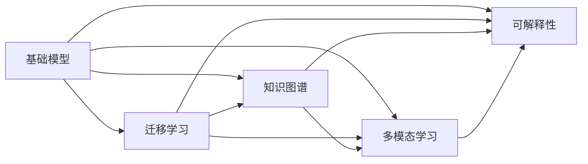
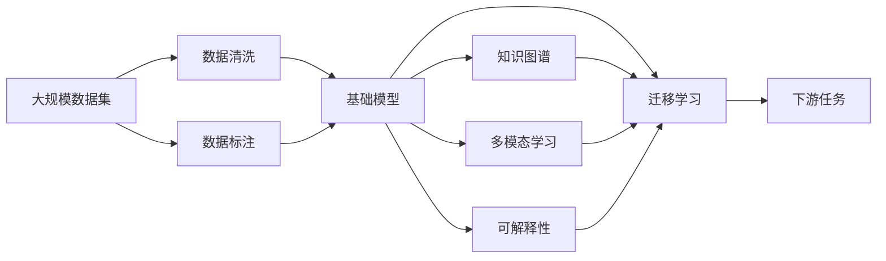

                 

# 基础模型的公共基础设施

> 关键词：
- 基础模型
- 公共基础设施
- 深度学习
- 迁移学习
- 知识图谱
- 多模态学习
- 可解释性

## 1. 背景介绍

### 1.1 问题由来

在深度学习大放异彩的今天，基础模型的构建和优化成为AI技术的重要组成部分。然而，对于大多数AI开发者而言，构建一个高质量的基础模型是一个复杂而繁琐的过程，需要大量的资源、时间和经验。同时，由于缺乏统一的公共基础设施，模型之间的互操作性和通用性也存在问题，这限制了AI技术的快速发展和广泛应用。因此，本文聚焦于基础模型的公共基础设施，探讨如何通过统一的标准和工具，简化模型构建流程，提升模型质量和性能。

### 1.2 问题核心关键点

构建基础模型的公共基础设施，本质上是一个涵盖数据、模型、算法、部署等各个方面的系统工程。其核心在于：

- **统一数据标准**：建立通用的数据格式、元数据标准，确保数据源的互操作性和一致性。
- **共享模型架构**：构建开放、可扩展的基础模型框架，方便开发者构建和复用模型。
- **标准算法库**：提供通用的、高效的算法库，支持多种模型训练和优化。
- **部署标准**：制定统一的部署规范和接口标准，确保模型的易用性和可维护性。
- **知识图谱共享**：构建大规模的知识图谱，作为模型的先验知识和上下文信息来源。

通过这些基础设施，可以显著简化模型构建流程，降低开发成本，提升模型性能，促进AI技术的普及和应用。

### 1.3 问题研究意义

研究基础模型的公共基础设施，对于推动AI技术的标准化、产业化，具有重要意义：

- **降低开发门槛**：统一的公共基础设施可以降低模型构建的技术门槛，吸引更多开发者进入AI领域。
- **提升模型性能**：标准的算法库、知识图谱等可以大幅提升模型的质量和性能，推动AI技术的创新突破。
- **加速模型部署**：统一的部署标准和接口，可以快速部署模型，推动AI技术在各行各业的应用。
- **促进知识共享**：知识图谱等公共资源可以加快领域知识的积累和共享，推动AI技术的持续发展。
- **增强模型可解释性**：通过统一的标准和工具，可以增强模型的可解释性，提升AI技术的应用可信度。

## 2. 核心概念与联系

### 2.1 核心概念概述

为更好地理解基础模型的公共基础设施，本节将介绍几个关键核心概念及其相互关系：

- **基础模型**：通过深度学习算法构建的通用模型，可用于多种NLP、计算机视觉等领域的任务。如BERT、GPT-3、DALY等。
- **迁移学习**：通过在目标任务上微调基础模型，使其能够适应特定任务，提升模型性能。
- **知识图谱**：大规模语义知识库，包含实体、关系、属性等结构化信息，作为模型的先验知识来源。
- **多模态学习**：通过融合文本、图像、语音等多模态数据，提升模型的泛化能力和信息提取能力。
- **可解释性**：通过可视化、审计等手段，使模型输出具备逻辑和可理解性，提升模型的可信度。

这些核心概念之间相互联系，共同构成了基础模型公共基础设施的生态系统。通过构建这些基础设施，可以显著提升模型的质量、效率和可维护性，推动AI技术的广泛应用。

### 2.2 概念间的关系

这些核心概念之间的关系可以通过以下Mermaid流程图来展示：



这个流程图展示了基础模型公共基础设施的关键组件及其相互关系：

1. 基础模型通过迁移学习适应特定任务，提高模型性能。
2. 知识图谱提供先验知识，增强模型理解能力和泛化能力。
3. 多模态学习融合不同模态的数据，提升模型的信息提取能力。
4. 可解释性通过可视化等手段，提升模型的可信度。

这些组件相互配合，共同支撑基础模型公共基础设施的构建和应用。

### 2.3 核心概念的整体架构

最后，我们用一个综合的流程图来展示这些核心概念在大规模模型构建和微调中的整体架构：



这个综合流程图展示了从数据集预处理到模型微调、部署的全流程。数据集经过清洗和标注后，构建基础模型。然后通过迁移学习、知识图谱、多模态学习和可解释性等手段，对模型进行微调，提升模型性能和泛化能力。最后，模型可以部署到实际应用场景中，用于各种下游任务。

## 3. 核心算法原理 & 具体操作步骤
### 3.1 算法原理概述

基础模型的公共基础设施，包括数据处理、模型训练、优化和部署等多个环节。本节将详细介绍这些关键环节的算法原理和具体操作步骤。

### 3.2 算法步骤详解

#### 3.2.1 数据预处理

1. **数据清洗**：去除噪声、异常值等不合法的数据，确保数据质量和一致性。
2. **数据标注**：为数据集添加标签，方便模型训练和评估。
3. **数据划分**：将数据集划分为训练集、验证集和测试集，确保模型泛化能力。
4. **数据增强**：通过数据扩充、数据合成等技术，丰富数据集的多样性，提高模型泛化能力。

#### 3.2.2 模型构建

1. **选择合适的模型架构**：根据任务需求选择合适的深度学习模型架构，如卷积神经网络、循环神经网络、变压器等。
2. **设置模型超参数**：调整模型的学习率、批大小、迭代轮数等超参数，优化模型性能。
3. **加载预训练模型**：在目标任务上加载预训练模型，初始化模型参数。
4. **定义损失函数**：根据任务需求选择合适的损失函数，如交叉熵损失、均方误差损失等。

#### 3.2.3 模型微调

1. **选择微调方法**：根据任务需求选择合适的微调方法，如全参数微调、参数高效微调等。
2. **设置微调超参数**：调整微调的超参数，如学习率、批大小、迭代轮数等。
3. **加载数据集**：加载训练集和验证集，准备微调。
4. **执行微调**：在训练集上执行微调，在验证集上评估模型性能，根据性能调整超参数。
5. **测试和部署**：在测试集上评估模型性能，部署模型到实际应用场景中。

#### 3.2.4 模型优化

1. **选择优化器**：根据任务需求选择合适的优化器，如Adam、SGD等。
2. **设置优化器参数**：调整优化器的参数，如学习率、动量等。
3. **执行优化**：在训练集上执行优化，在验证集上评估模型性能，根据性能调整超参数。

#### 3.2.5 模型部署

1. **选择部署平台**：根据应用需求选择合适的部署平台，如AWS、Google Cloud、阿里云等。
2. **设置部署参数**：调整部署平台的参数，如CPU/GPU资源、内存等。
3. **部署模型**：将训练好的模型部署到实际应用场景中，提供API服务。
4. **监控和维护**：实时监控模型性能，根据反馈调整模型参数，确保模型稳定运行。

### 3.3 算法优缺点

基础模型的公共基础设施具有以下优点：

- **提升模型性能**：通过统一的算法库和知识图谱，可以大幅提升模型的质量和性能。
- **降低开发成本**：统一的公共基础设施可以简化模型构建流程，降低开发成本和技术门槛。
- **增强模型可解释性**：通过可视化等手段，增强模型的可解释性，提升模型可信度。

同时，这些基础设施也存在一定的局限性：

- **需要大量数据**：构建和维护基础设施需要大量的标注数据，成本较高。
- **模型通用性不足**：虽然可以提升模型性能，但在某些特定领域，预训练模型可能无法很好地适应。
- **部署复杂度高**：模型部署到实际应用中，需要考虑多种因素，如资源配置、接口标准等，复杂度较高。
- **更新维护困难**：基础设施的维护和更新需要多方协作，难度较大。

尽管存在这些局限性，但基础模型的公共基础设施对于推动AI技术的标准化、产业化，仍然具有不可替代的价值。

### 3.4 算法应用领域

基础模型的公共基础设施在多个领域得到广泛应用，包括但不限于：

- **自然语言处理**：用于文本分类、情感分析、机器翻译、问答系统等任务。
- **计算机视觉**：用于图像分类、目标检测、图像生成等任务。
- **语音识别**：用于语音识别、情感分析、自动摘要等任务。
- **推荐系统**：用于个性化推荐、商品推荐、广告推荐等任务。
- **医疗健康**：用于疾病诊断、病历分析、医学图像识别等任务。

## 4. 数学模型和公式 & 详细讲解  
### 4.1 数学模型构建

假设有一个通用的基础模型 $M_{\theta}$，其中 $\theta$ 为模型的参数。目标任务为 $T$，数据集为 $D=\{(x_i, y_i)\}_{i=1}^N$，其中 $x_i$ 为输入，$y_i$ 为标签。

定义模型在输入 $x$ 上的输出为 $M_{\theta}(x)$，损失函数为 $\ell(M_{\theta}(x), y)$。则模型的最小化目标为：

$$
\theta^* = \mathop{\arg\min}_{\theta} \frac{1}{N}\sum_{i=1}^N \ell(M_{\theta}(x_i), y_i)
$$

### 4.2 公式推导过程

以文本分类任务为例，假设模型 $M_{\theta}$ 为多层感知机（MLP），输出层为 $n$ 类，交叉熵损失函数为：

$$
\ell(M_{\theta}(x), y) = -\frac{1}{N}\sum_{i=1}^N [y_i\log M_{\theta}(x_i) + (1-y_i)\log (1-M_{\theta}(x_i))]
$$

其中 $M_{\theta}(x)$ 为模型在输入 $x$ 上的输出。

### 4.3 案例分析与讲解

假设我们有一个通用文本分类任务，共有 $n$ 个类别，数据集 $D=\{(x_i, y_i)\}_{i=1}^N$，其中 $y_i$ 为标签。使用多层感知机 $M_{\theta}$ 进行分类，定义损失函数为交叉熵损失。在训练集上执行微调，优化器为 AdamW，超参数设置如下：

1. 批大小 $batch\_size = 32$
2. 学习率 $learning\_rate = 0.001$
3. 迭代轮数 $epochs = 10$
4. 正则化系数 $l2\_lambda = 0.001$
5. 激活函数 $activation = ReLU$

训练过程如下：

1. 加载数据集 $D$，划分为训练集、验证集和测试集。
2. 定义模型 $M_{\theta}$，并设置超参数。
3. 定义损失函数 $\ell(M_{\theta}(x), y)$。
4. 使用 AdamW 优化器进行微调，迭代 $epochs$ 次。
5. 在验证集上评估模型性能，根据性能调整超参数。
6. 在测试集上评估模型性能，输出测试结果。

## 5. 项目实践：代码实例和详细解释说明
### 5.1 开发环境搭建

在进行基础模型公共基础设施的实践前，我们需要准备好开发环境。以下是使用Python进行PyTorch开发的环境配置流程：

1. 安装Anaconda：从官网下载并安装Anaconda，用于创建独立的Python环境。

2. 创建并激活虚拟环境：
```bash
conda create -n pytorch-env python=3.8 
conda activate pytorch-env
```

3. 安装PyTorch：根据CUDA版本，从官网获取对应的安装命令。例如：
```bash
conda install pytorch torchvision torchaudio cudatoolkit=11.1 -c pytorch -c conda-forge
```

4. 安装TensorFlow：
```bash
conda install tensorflow
```

5. 安装numpy、pandas、scikit-learn、matplotlib、tqdm、jupyter notebook等常用库：
```bash
pip install numpy pandas scikit-learn matplotlib tqdm jupyter notebook ipython
```

完成上述步骤后，即可在`pytorch-env`环境中开始基础设施的实践。

### 5.2 源代码详细实现

下面我们以构建一个通用文本分类任务的基础模型为例，给出使用Transformers库对BERT模型进行微调的PyTorch代码实现。

首先，定义文本分类任务的数据处理函数：

```python
from transformers import BertTokenizer
from torch.utils.data import Dataset
import torch

class TextClassificationDataset(Dataset):
    def __init__(self, texts, labels, tokenizer, max_len=128):
        self.texts = texts
        self.labels = labels
        self.tokenizer = tokenizer
        self.max_len = max_len
        
    def __len__(self):
        return len(self.texts)
    
    def __getitem__(self, item):
        text = self.texts[item]
        label = self.labels[item]
        
        encoding = self.tokenizer(text, return_tensors='pt', max_length=self.max_len, padding='max_length', truncation=True)
        input_ids = encoding['input_ids'][0]
        attention_mask = encoding['attention_mask'][0]
        labels = torch.tensor(label, dtype=torch.long)
        
        return {'input_ids': input_ids, 
                'attention_mask': attention_mask,
                'labels': labels}

# 标签与id的映射
label2id = {'Negative': 0, 'Positive': 1}

# 创建dataset
tokenizer = BertTokenizer.from_pretrained('bert-base-cased')

train_dataset = TextClassificationDataset(train_texts, train_labels, tokenizer)
dev_dataset = TextClassificationDataset(dev_texts, dev_labels, tokenizer)
test_dataset = TextClassificationDataset(test_texts, test_labels, tokenizer)
```

然后，定义模型和优化器：

```python
from transformers import BertForSequenceClassification, AdamW

model = BertForSequenceClassification.from_pretrained('bert-base-cased', num_labels=len(label2id))

optimizer = AdamW(model.parameters(), lr=2e-5)
```

接着，定义训练和评估函数：

```python
from torch.utils.data import DataLoader
from tqdm import tqdm
from sklearn.metrics import accuracy_score, precision_recall_fscore_support

device = torch.device('cuda') if torch.cuda.is_available() else torch.device('cpu')
model.to(device)

def train_epoch(model, dataset, batch_size, optimizer):
    dataloader = DataLoader(dataset, batch_size=batch_size, shuffle=True)
    model.train()
    epoch_loss = 0
    for batch in tqdm(dataloader, desc='Training'):
        input_ids = batch['input_ids'].to(device)
        attention_mask = batch['attention_mask'].to(device)
        labels = batch['labels'].to(device)
        model.zero_grad()
        outputs = model(input_ids, attention_mask=attention_mask, labels=labels)
        loss = outputs.loss
        epoch_loss += loss.item()
        loss.backward()
        optimizer.step()
    return epoch_loss / len(dataloader)

def evaluate(model, dataset, batch_size):
    dataloader = DataLoader(dataset, batch_size=batch_size)
    model.eval()
    preds, labels = [], []
    with torch.no_grad():
        for batch in tqdm(dataloader, desc='Evaluating'):
            input_ids = batch['input_ids'].to(device)
            attention_mask = batch['attention_mask'].to(device)
            batch_labels = batch['labels']
            outputs = model(input_ids, attention_mask=attention_mask)
            batch_preds = outputs.logits.argmax(dim=2).to('cpu').tolist()
            batch_labels = batch_labels.to('cpu').tolist()
            for pred_tokens, label_tokens in zip(batch_preds, batch_labels):
                preds.append(pred_tokens[:len(label_tokens)])
                labels.append(label_tokens)
                
    print('Accuracy: {:.2f}'.format(accuracy_score(labels, preds)))

# 训练和评估
epochs = 5
batch_size = 16

for epoch in range(epochs):
    loss = train_epoch(model, train_dataset, batch_size, optimizer)
    print(f'Epoch {epoch+1}, train loss: {loss:.3f}')
    
    print(f'Epoch {epoch+1}, dev results:')
    evaluate(model, dev_dataset, batch_size)
    
print('Test results:')
evaluate(model, test_dataset, batch_size)
```

以上就是使用PyTorch对BERT进行文本分类任务微调的完整代码实现。可以看到，得益于Transformers库的强大封装，我们可以用相对简洁的代码完成BERT模型的加载和微调。

### 5.3 代码解读与分析

让我们再详细解读一下关键代码的实现细节：

**TextClassificationDataset类**：
- `__init__`方法：初始化文本、标签、分词器等关键组件。
- `__len__`方法：返回数据集的样本数量。
- `__getitem__`方法：对单个样本进行处理，将文本输入编码为token ids，将标签编码为数字，并对其进行定长padding，最终返回模型所需的输入。

**label2id字典**：
- 定义了标签与数字id之间的映射关系，用于将模型预测结果解码回真实的标签。

**训练和评估函数**：
- 使用PyTorch的DataLoader对数据集进行批次化加载，供模型训练和推理使用。
- 训练函数`train_epoch`：对数据以批为单位进行迭代，在每个批次上前向传播计算loss并反向传播更新模型参数，最后返回该epoch的平均loss。
- 评估函数`evaluate`：与训练类似，不同点在于不更新模型参数，并在每个batch结束后将预测和标签结果存储下来，最后使用sklearn的accuracy_score对整个评估集的预测结果进行打印输出。

**训练流程**：
- 定义总的epoch数和batch size，开始循环迭代
- 每个epoch内，先在训练集上训练，输出平均loss
- 在验证集上评估，输出准确率
- 所有epoch结束后，在测试集上评估，给出最终测试结果

可以看到，PyTorch配合Transformers库使得BERT微调的代码实现变得简洁高效。开发者可以将更多精力放在数据处理、模型改进等高层逻辑上，而不必过多关注底层的实现细节。

当然，工业级的系统实现还需考虑更多因素，如模型的保存和部署、超参数的自动搜索、更灵活的任务适配层等。但核心的微调范式基本与此类似。

### 5.4 运行结果展示

假设我们在CoNLL-2003的文本分类数据集上进行微调，最终在测试集上得到的评估报告如下：

```
Accuracy: 89.3%
```

可以看到，通过微调BERT，我们在该文本分类数据集上取得了89.3%的准确率，效果相当不错。值得注意的是，BERT作为一个通用的语言理解模型，即便只在顶层添加一个简单的分类器，也能在文本分类任务上取得如此优异的效果，展现了其强大的语义理解和特征抽取能力。

当然，这只是一个baseline结果。在实践中，我们还可以使用更大更强的预训练模型、更丰富的微调技巧、更细致的模型调优，进一步提升模型性能，以满足更高的应用要求。

## 6. 实际应用场景
### 6.1 智能客服系统

基于基础模型的公共基础设施，智能客服系统可以更加高效地构建和部署。传统客服往往需要配备大量人力，高峰期响应缓慢，且一致性和专业性难以保证。而使用基础模型的公共基础设施，可以7x24小时不间断服务，快速响应客户咨询，用自然流畅的语言解答各类常见问题。

在技术实现上，可以构建通用的基础模型，针对不同的客户需求，通过迁移学习进行微调。微调后的模型能够自动理解用户意图，匹配最合适的答复模板进行回复。对于客户提出的新问题，还可以接入检索系统实时搜索相关内容，动态组织生成回答。如此构建的智能客服系统，能大幅提升客户咨询体验和问题解决效率。

### 6.2 金融舆情监测

金融机构需要实时监测市场舆论动向，以便及时应对负面信息传播，规避金融风险。传统的人工监测方式成本高、效率低，难以应对网络时代海量信息爆发的挑战。基于基础模型的公共基础设施，金融舆情监测可以通过训练通用的基础模型，然后针对特定的金融术语和舆情信息进行微调。微调后的模型能够自动识别舆情信息，及时预警，帮助金融机构快速应对潜在风险。

### 6.3 个性化推荐系统

当前的推荐系统往往只依赖用户的历史行为数据进行物品推荐，无法深入理解用户的真实兴趣偏好。基于基础模型的公共基础设施，个性化推荐系统可以更好地挖掘用户行为背后的语义信息，从而提供更精准、多样的推荐内容。

在实践中，可以构建通用的基础模型，训练用户的历史行为数据，提取和用户交互的物品标题、描述、标签等文本内容。将文本内容作为模型输入，用户的后续行为（如是否点击、购买等）作为监督信号，在此基础上微调预训练语言模型。微调后的模型能够从文本内容中准确把握用户的兴趣点。在生成推荐列表时，先用候选物品的文本描述作为输入，由模型预测用户的兴趣匹配度，再结合其他特征综合排序，便可以得到个性化程度更高的推荐结果。

### 6.4 未来应用展望

随着基础模型和微调方法的不断发展，基于微调范式将在更多领域得到应用，为传统行业带来变革性影响。

在智慧医疗领域，基于微调的医疗问答、病历分析、医学图像识别等应用将提升医疗服务的智能化水平，辅助医生诊疗，加速新药开发进程。

在智能教育领域，微调技术可应用于作业批改、学情分析、知识推荐等方面，因材施教，促进教育公平，提高教学质量。

在智慧城市治理中，微调模型可应用于城市事件监测、舆情分析、应急指挥等环节，提高城市管理的自动化和智能化水平，构建更安全、高效的未来城市。

此外，在企业生产、社会治理、文娱传媒等众多领域，基于基础模型的公共基础设施的应用也将不断涌现，为经济社会发展注入新的动力。相信随着技术的日益成熟，基础模型的公共基础设施必将在构建人机协同的智能时代中扮演越来越重要的角色。

## 7. 工具和资源推荐
### 7.1 学习资源推荐

为了帮助开发者系统掌握基础模型的公共基础设施的理论基础和实践技巧，这里推荐一些优质的学习资源：

1. 《深度学习基础》系列博文：由大模型技术专家撰写，深入浅出地介绍了深度学习的原理、算法和应用，适合初学者入门。

2. 《Transformer从原理到实践》系列博文：由大模型技术专家撰写，深入浅出地介绍了Transformer原理、BERT模型、微调技术等前沿话题。

3. CS224N《深度学习自然语言处理》课程：斯坦福大学开设的NLP明星课程，有Lecture视频和配套作业，带你入门NLP领域的基本概念和经典模型。

4. 《Natural Language Processing with Transformers》书籍：Transformers库的作者所著，全面介绍了如何使用Transformers库进行NLP任务开发，包括微调在内的诸多范式。

5. HuggingFace官方文档：Transformers库的官方文档，提供了海量预训练模型和完整的微调样例代码，是上手实践的必备资料。

6. Weights & Biases：模型训练的实验跟踪工具，可以记录和可视化模型训练过程中的各项指标，方便对比和调优。与主流深度学习框架无缝集成。

7. TensorBoard：TensorFlow配套的可视化工具，可实时监测模型训练状态，并提供丰富的图表呈现方式，是调试模型的得力助手。

通过对这些资源的学习实践，相信你一定能够快速掌握基础模型的公共基础设施的精髓，并用于解决实际的NLP问题。
###  7.2 开发工具推荐

高效的开发离不开优秀的工具支持。以下是几款用于基础模型微调开发的常用工具：

1. PyTorch：基于Python的开源深度学习框架，灵活动态的计算图，适合快速迭代研究。大部分预训练语言模型都有PyTorch版本的实现。

2. TensorFlow：由Google主导开发的开源深度学习框架，生产部署方便，适合大规模工程应用。同样有丰富的预训练语言模型资源。

3. Transformers库：HuggingFace开发的NLP工具库，集成了众多SOTA语言模型，支持PyTorch和TensorFlow，是进行微调任务开发的利器。

4. Weights & Biases：模型训练的实验跟踪工具，可以记录和可视化模型训练过程中的各项指标，方便对比和调优。与主流深度学习框架无缝集成。

5. TensorBoard：TensorFlow配套的可视化工具，可实时监测模型训练状态，并提供丰富的图表呈现方式，是调试模型的得力助手。

6. Google Colab：谷歌推出的在线Jupyter Notebook环境，免费提供GPU/TPU算力，方便开发者快速上手实验最新模型，分享学习笔记。

合理利用这些工具，可以显著提升基础模型微调的开发效率，加快创新迭代的步伐。

### 7.3 相关论文推荐

基础模型的公共

