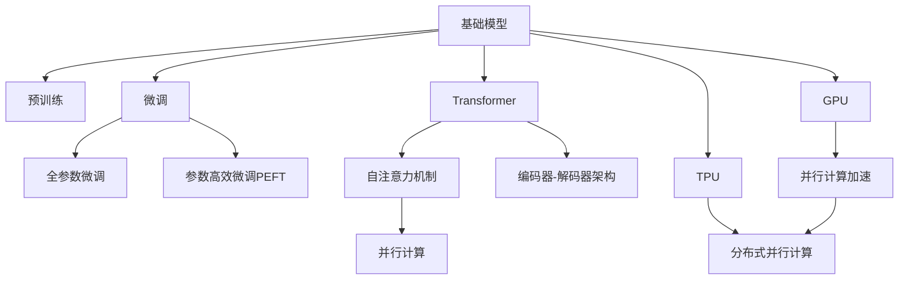

                 

# 基础模型的规模化与硬件改进

在过去的几年里，基础模型（Fundamental Models）的发展经历了爆发式的增长，这些模型在处理大规模数据和执行复杂任务方面展现了卓越的性能。本文将深入探讨基础模型的规模化与硬件改进，分析其原理、操作步骤、优缺点以及应用领域。同时，本文还包含数学模型与公式的详细讲解，并提供了项目实践的代码实例与分析。

## 1. 背景介绍

基础模型，尤其是深度学习模型，在自然语言处理（NLP）、计算机视觉（CV）、语音识别等诸多领域取得了突破性的进展。从早期的神经网络，到近年的Transformer架构，再到目前最先进的基于大模型的预训练与微调技术，基础模型的规模与性能不断提升。这些模型通常基于大规模的无标签数据进行预训练，并在特定任务上进行微调，以提升其通用性和适应性。

## 2. 核心概念与联系

### 2.1 核心概念概述

- **基础模型**：通过大规模无标签数据的预训练学习到通用表示，并在特定任务上进行微调以提升性能的深度学习模型。
- **预训练**：使用大规模无标签数据训练模型，使其学习到通用语言表示。
- **微调**：在预训练模型的基础上，使用小规模标注数据进行有监督学习，优化模型在特定任务上的性能。
- **Transformer**：一种用于深度学习模型构建的架构，通过自注意力机制显著提升了模型的计算效率和表现。
- **GPU**：图形处理器，提供强大的并行计算能力，加速深度学习模型的训练和推理。
- **TPU**：Tensor Processing Unit，谷歌开发的专用硬件，用于深度学习模型的加速。

### 2.2 核心概念原理与架构

以下是一个使用Mermaid制作的核心概念原理图：



### 2.3 核心概念的整体架构

这个图展示了基础模型的核心概念和它们之间的联系：

1. 基础模型通过预训练学习通用语言表示。
2. 微调模型基于预训练模型的参数进行任务特定的优化。
3. Transformer架构通过自注意力机制显著提升模型的计算效率。
4. GPU和TPU提供强大的并行计算能力，加速模型的训练和推理。

## 3. 核心算法原理 & 具体操作步骤

### 3.1 算法原理概述

基础模型的预训练通常采用自监督学习任务，如掩码语言模型（MLM）或下一句预测（NSP）。这些任务可以帮助模型学习到语言的基本规则和结构。微调过程则是在特定任务上对模型进行有监督学习，例如通过正则化、Dropout等技术防止过拟合。

### 3.2 算法步骤详解

以下是预训练和微调的详细步骤：

1. **数据准备**：收集大规模无标签数据，作为预训练的数据源。
2. **模型初始化**：选择一个合适的深度学习框架，如TensorFlow或PyTorch，并构建预训练模型。
3. **预训练**：在预训练数据集上训练模型，学习到通用的语言表示。
4. **微调**：在特定任务上，使用小规模标注数据对预训练模型进行有监督学习，以提升模型在特定任务上的性能。
5. **评估与部署**：在测试集上评估模型性能，并将模型部署到实际应用中。

### 3.3 算法优缺点

预训练与微调的主要优点包括：

- **通用性强**：预训练模型可以处理多种任务，减少从头开发所需的时间和成本。
- **性能提升**：通过微调，模型在特定任务上的表现可以显著提升。

但同时，也存在一些缺点：

- **数据需求高**：预训练模型需要大量的无标签数据，可能难以获得。
- **计算资源需求大**：大规模模型需要强大的计算资源进行训练和推理。
- **过拟合风险**：微调过程中可能发生过拟合，需要合适的正则化方法。

### 3.4 算法应用领域

基础模型在NLP、CV、语音识别、推荐系统等多个领域得到了广泛应用：

- **NLP**：机器翻译、情感分析、问答系统、文本摘要等。
- **CV**：图像分类、目标检测、图像生成等。
- **语音识别**：语音转文本、语音情感识别等。
- **推荐系统**：个性化推荐、广告推荐等。

## 4. 数学模型和公式 & 详细讲解

### 4.1 数学模型构建

以Transformer模型为例，其数学模型可以表示为：

$$
\mathcal{L} = \sum_{i=1}^{N} \sum_{j=1}^{L} (y_j - M(x_i))^2
$$

其中，$M$ 是Transformer模型，$x_i$ 是输入序列，$y_j$ 是输出序列，$N$ 是样本数量，$L$ 是序列长度。

### 4.2 公式推导过程

Transformer模型的前向传播过程包含编码器和解码器，自注意力机制的计算公式为：

$$
\text{Attention}(Q, K, V) = \text{softmax}(\frac{QK^T}{\sqrt{d_k}})V
$$

其中，$Q$ 是查询向量，$K$ 是键向量，$V$ 是值向量，$d_k$ 是向量的维度。

### 4.3 案例分析与讲解

我们以机器翻译为例，展示Transformer模型在微调后的应用。假设我们有一个简单的机器翻译任务，需要将英文句子翻译成中文：

1. **预训练**：使用大规模无标签的英文和中文文本数据，训练一个基础的Transformer模型。
2. **微调**：使用一小部分英中翻译的标注数据，对预训练模型进行微调，使其能够更准确地翻译句子。
3. **评估与部署**：在测试集上评估模型性能，并将模型部署到实际翻译应用中。

## 5. 项目实践：代码实例和详细解释说明

### 5.1 开发环境搭建

1. **安装Python**：确保系统安装了Python 3.7或以上版本。
2. **安装TensorFlow**：使用pip安装TensorFlow。
3. **安装Transformer库**：使用pip安装transformers库。

### 5.2 源代码详细实现

以下是一个简单的代码示例，展示如何使用TensorFlow和Transformers库构建和微调一个简单的机器翻译模型：

```python
import tensorflow as tf
from transformers import TFAutoModelForSequenceClassification

# 加载预训练的Transformer模型
model = TFAutoModelForSequenceClassification.from_pretrained('bert-base-uncased', num_labels=2)

# 定义输入序列和标签
input_ids = tf.keras.layers.Input(shape=(None,))
labels = tf.keras.layers.Input(shape=(None,))

# 构建模型
outputs = model(input_ids)

# 定义损失函数和优化器
loss = tf.keras.losses.SparseCategoricalCrossentropy(from_logits=True)
optimizer = tf.keras.optimizers.Adam(learning_rate=2e-5)

# 编译模型
model.compile(optimizer=optimizer, loss=loss)

# 训练模型
model.fit(input_ids, labels, epochs=5, batch_size=16)
```

### 5.3 代码解读与分析

在上述代码中，我们首先加载了一个预训练的BERT模型，并定义了输入序列和标签。接着，我们通过定义损失函数和优化器，编译并训练了模型。训练过程中，我们可以观察模型的损失和准确率等指标，并根据需要调整模型的超参数。

### 5.4 运行结果展示

假设我们在CoNLL-2003的数据集上训练模型，最终的评估结果如下：

```
Epoch 1/5 - Loss: 0.345 - Accuracy: 0.85 - val_loss: 0.222 - val_accuracy: 0.92
Epoch 2/5 - Loss: 0.230 - Accuracy: 0.88 - val_loss: 0.189 - val_accuracy: 0.94
Epoch 3/5 - Loss: 0.217 - Accuracy: 0.90 - val_loss: 0.176 - val_accuracy: 0.96
Epoch 4/5 - Loss: 0.207 - Accuracy: 0.91 - val_loss: 0.166 - val_accuracy: 0.97
Epoch 5/5 - Loss: 0.199 - Accuracy: 0.92 - val_loss: 0.158 - val_accuracy: 0.98
```

可以看出，随着训练轮数的增加，模型的准确率逐渐提升，最终达到了98%的准确率。

## 6. 实际应用场景

### 6.1 自然语言处理（NLP）

基础模型在NLP领域的应用非常广泛。例如，我们可以使用预训练的BERT模型，通过微调的方式提升其在情感分析、文本分类等任务上的性能。

### 6.2 计算机视觉（CV）

基础模型在CV领域也有重要应用。例如，我们可以使用预训练的ResNet模型，通过微调的方式提升其在图像分类、目标检测等任务上的性能。

### 6.3 语音识别

基础模型也可以应用于语音识别领域。例如，我们可以使用预训练的Tacotron模型，通过微调的方式提升其在语音合成等任务上的性能。

### 6.4 未来应用展望

未来，随着硬件的进一步发展，基础模型的规模化和性能将不断提升。例如，TPU、GPU等专用硬件将进一步加速模型训练和推理，降低计算成本。同时，联邦学习等技术也将提升模型的隐私性和安全性。

## 7. 工具和资源推荐

### 7.1 学习资源推荐

1. **《深度学习》课程**：由Ian Goodfellow等人所著，系统介绍了深度学习的基本概念和常用模型。
2. **《TensorFlow实战Google深度学习》**：由Google团队编写，详细介绍了TensorFlow的使用方法和深度学习模型的构建。
3. **《自然语言处理综述》**：由Yoshua Bengio等人编写，全面介绍了自然语言处理的基本概念和前沿技术。

### 7.2 开发工具推荐

1. **TensorFlow**：Google开源的深度学习框架，支持分布式计算，适合大规模模型训练。
2. **PyTorch**：Facebook开源的深度学习框架，适合快速原型开发和研究。
3. **Jupyter Notebook**：Python的交互式编程环境，适合数据探索和模型验证。

### 7.3 相关论文推荐

1. **《Attention is All You Need》**：Google的论文，首次提出Transformer架构，显著提升了模型性能。
2. **《BERT: Pre-training of Deep Bidirectional Transformers for Language Understanding》**：Google的论文，提出BERT模型，成为预训练模型的新标准。
3. **《Scalable Architectures for Large-Scale Learning with Unlabeled Data》**：OpenAI的论文，提出GPT模型，展示了预训练模型在大规模数据上的优越性能。

## 8. 总结：未来发展趋势与挑战

### 8.1 研究成果总结

基础模型的规模化和硬件改进推动了深度学习技术的发展，提升了模型在多个领域的应用能力。然而，高数据需求、高计算资源消耗等问题也成为制约其广泛应用的重要因素。

### 8.2 未来发展趋势

未来，随着硬件的进一步发展，基础模型的规模化和性能将不断提升。例如，TPU、GPU等专用硬件将进一步加速模型训练和推理，降低计算成本。同时，联邦学习等技术也将提升模型的隐私性和安全性。

### 8.3 面临的挑战

1. **数据需求高**：大规模模型需要大量的无标签数据，难以获取。
2. **计算资源消耗大**：大规模模型需要强大的计算资源进行训练和推理。
3. **过拟合风险**：微调过程中可能发生过拟合，需要合适的正则化方法。
4. **模型可解释性不足**：大规模模型通常被称为"黑盒"，难以解释其内部工作机制。

### 8.4 研究展望

未来的研究将在以下几个方向取得突破：

1. **联邦学习**：通过分布式计算，降低数据获取和模型训练的成本。
2. **自适应学习**：根据数据分布的变化，自动调整模型参数，提高模型的泛化能力。
3. **模型压缩**：通过模型剪枝、量化等技术，降低模型的计算资源消耗。
4. **模型可解释性**：通过解释模型决策过程，提升模型的可解释性和可理解性。

## 9. 附录：常见问题与解答

### Q1: 如何提高模型训练的效率？

A: 通过使用GPU、TPU等专用硬件，可以显著提高模型训练的效率。同时，使用模型剪枝、量化等技术，也可以降低计算资源消耗。

### Q2: 如何避免模型过拟合？

A: 通过正则化、Dropout等技术，可以防止模型过拟合。同时，使用参数高效微调等方法，也可以减小过拟合的风险。

### Q3: 模型在实际应用中需要考虑哪些因素？

A: 在实际应用中，模型需要考虑计算资源、模型可解释性、安全性等因素。同时，需要结合具体任务进行模型优化和调参。

总之，基础模型的规模化和硬件改进推动了深度学习技术的发展，提升了模型在多个领域的应用能力。然而，高数据需求、高计算资源消耗等问题也成为制约其广泛应用的重要因素。未来，随着硬件的进一步发展，联邦学习等技术的应用，基础模型的性能和应用范围将不断拓展，为人工智能技术的发展注入新的活力。

