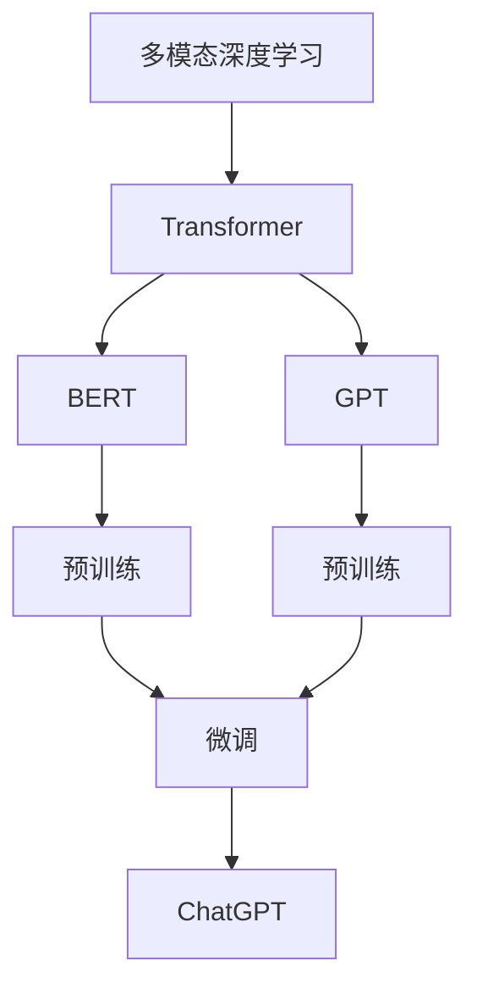
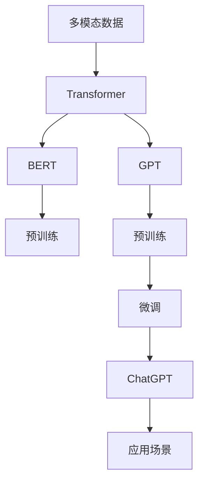

                 

# 多模态大模型：技术原理与实战 ChatGPT的诞生

## 1. 背景介绍

### 1.1 问题由来

在过去十年中，深度学习技术取得了革命性的进展，尤其是以卷积神经网络（CNN）和循环神经网络（RNN）为代表的神经网络结构，在计算机视觉（CV）和自然语言处理（NLP）等领域取得了显著的突破。然而，现实世界的信息往往是多模态的，单一模态的深度学习模型难以满足多模态数据的多样性和复杂性需求。

为了解决这一问题，研究人员提出并验证了多模态深度学习模型，其核心思想是整合来自不同模态（如文本、图像、音频等）的信息，构建统一的语义空间，从而提高模型对真实世界的理解和建模能力。多模态学习在视觉-语言融合、跨模态检索、视频内容理解等方面展现出了卓越的性能，并逐渐成为人工智能领域的重要研究热点。

## 2. 核心概念与联系

### 2.1 核心概念概述

为了深入理解多模态大模型的技术原理和实战应用，我们需要引入以下核心概念：

- **多模态深度学习**：指结合文本、图像、音频等多种模态的信息，构建统一的语义空间，从而提升模型对真实世界的理解能力。多模态深度学习在视觉-语言融合、跨模态检索、视频内容理解等方面展现出显著的性能。
- **Transformer**：一种基于自注意力机制的神经网络结构，特别适用于处理序列数据，如自然语言处理任务。Transformer模型通过多头自注意力机制和位置编码等技术，能够高效地处理序列数据，并且能够很好地推广到多模态场景中。
- **预训练-微调（Pre-training & Fine-tuning）**：在大规模无标签数据上预训练模型，然后在特定任务上微调优化，提升模型在该任务上的性能。这一范式已经成为深度学习模型训练的常态。
- **BERT、GPT**：当前最常用的预训练语言模型，BERT是基于Transformer的双向编码器表示，GPT是基于Transformer的生成模型。
- **GPT-3**：OpenAI开发的基于Transformer的生成模型，拥有15亿参数，并且在多模态深度学习中展现了强大的语言生成能力。
- **ChatGPT**：OpenAI基于GPT-3开发的对话系统，通过多轮对话展示出卓越的交互能力和自然语言理解能力。

### 2.2 概念间的关系

以下是一个简单的Mermaid流程图，展示了这些核心概念之间的关系：



这个流程图展示了从多模态深度学习到Transformer，再到预训练语言模型（BERT、GPT），最终到ChatGPT的流程：

1. 多模态深度学习整合了来自不同模态的信息，构建统一的语义空间。
2. Transformer模型通过自注意力机制，能够高效处理序列数据，如文本。
3. BERT和GPT是基于Transformer的预训练语言模型，通过大规模无标签数据预训练，获得了强大的语言理解能力。
4. 预训练后，在特定任务上进行微调（如对话任务），得到ChatGPT等应用模型。

### 2.3 核心概念的整体架构

以下是一个综合的Mermaid流程图，展示了从多模态深度学习到ChatGPT的完整架构：



这个综合流程图展示了从多模态数据输入，到使用Transformer预训练语言模型，再到ChatGPT应用的完整流程：

1. 多模态数据输入。
2. 使用Transformer进行预训练，如BERT、GPT。
3. 在特定任务上进行微调，如对话任务。
4. 生成ChatGPT等应用模型。
5. 在实际应用场景中使用。

## 3. 核心算法原理 & 具体操作步骤

### 3.1 算法原理概述

ChatGPT的诞生，基于Transformer模型和预训练-微调（Pre-training & Fine-tuning）范式。其核心算法原理如下：

1. **预训练**：在大规模无标签数据上预训练Transformer模型，使其获得通用的语言表示能力。
2. **微调**：在特定任务（如对话任务）上微调预训练模型，提升模型在该任务上的性能。
3. **生成对话**：通过多轮对话，生成连贯、自然且符合语境的回应。

### 3.2 算法步骤详解

以下是一个详细的算法步骤详解，展示了从预训练到微调，再到生成对话的完整流程：

#### 3.2.1 预训练步骤

1. **数据准备**：收集大规模无标签文本数据（如维基百科、书籍等）。
2. **模型选择**：选择Transformer模型作为预训练的基础模型。
3. **预训练**：使用自监督任务（如掩码语言模型、下一句预测）在大规模数据上预训练模型。
4. **保存模型**：保存预训练模型权重。

#### 3.2.2 微调步骤

1. **任务适配**：根据特定任务（如对话任务）设计任务适配层。
2. **模型加载**：加载预训练模型权重。
3. **微调训练**：使用特定任务的标注数据进行微调训练。
4. **保存模型**：保存微调后的模型权重。

#### 3.2.3 生成对话步骤

1. **输入设计**：设计输入文本模板，引导模型生成回应。
2. **模型加载**：加载微调后的模型权重。
3. **对话生成**：根据输入文本，生成回应文本。
4. **输出展示**：将生成的回应文本展示给用户。

### 3.3 算法优缺点

**优点**：

1. **强大的语言理解能力**：预训练模型在大规模无标签数据上学习到丰富的语言表示，能够更好地理解自然语言。
2. **高效的微调过程**：通过预训练-微调范式，在大规模数据上进行预训练，在特定任务上微调，显著提升模型性能。
3. **灵活性高**：适用于多种任务，如对话、翻译、摘要等，可以轻松定制任务适配层。

**缺点**：

1. **资源需求高**：预训练和微调模型需要大量的计算资源和数据资源。
2. **训练时间较长**：大规模模型的训练时间较长，需要长时间的计算。
3. **可解释性不足**：预训练模型和微调模型通常是"黑盒"系统，难以解释其内部工作机制和决策逻辑。

### 3.4 算法应用领域

多模态大模型的应用领域非常广泛，以下是几个典型的应用场景：

- **对话系统**：如ChatGPT、微软小冰等，通过多轮对话展示出卓越的交互能力和自然语言理解能力。
- **视觉-语言融合**：如图像描述生成、图像内容理解等，将视觉信息和语言信息结合，构建统一的语义空间。
- **跨模态检索**：如多模态数据检索、跨模态推荐等，将不同模态的数据进行融合，提高检索和推荐效果。
- **视频内容理解**：如视频摘要、视频分类等，将视频内容和语言信息结合，提升内容的理解能力。
- **增强现实**：如增强现实中的多模态交互、多模态感知等，将现实世界的多种感官信息进行融合。

## 4. 数学模型和公式 & 详细讲解 & 举例说明

### 4.1 数学模型构建

以下是基于Transformer模型的多模态深度学习模型的数学模型构建：

1. **输入表示**：将输入数据表示为向量形式，如文本序列表示为单词编码向量。
2. **自注意力机制**：通过多头自注意力机制，计算输入序列中不同位置之间的相互作用关系。
3. **位置编码**：使用位置编码表示输入序列中不同位置的信息。
4. **输出表示**：将自注意力机制和位置编码结合，得到输出向量表示。

### 4.2 公式推导过程

以下是Transformer模型的详细公式推导过程：

1. **自注意力机制**：
   $$
   \text{Attention}(Q, K, V) = \text{Softmax}\left(\frac{Q K^T}{\sqrt{d_k}}\right) V
   $$
   其中，$Q$、$K$、$V$分别为查询向量、键向量和值向量。
2. **多头自注意力机制**：
   $$
   \text{MultiHeadAttention}(Q, K, V) = \text{Concat}\left(\text{Attention}(Q, K, V), \text{Attention}(Q, K, V), \ldots\right) \text{Linear}( W^O )
   $$
   其中，$W^O$为输出投影矩阵。
3. **位置编码**：
   $$
   \text{PositionalEncoding}(x_p) = x_p + \text{sin}(\frac{\text{pos}_i}{10000^{2l/d_p}}) + \text{cos}(\frac{\text{pos}_i}{10000^{2l/d_p}})
   $$
   其中，$\text{pos}_i$为位置向量，$l$为位置编码的长度，$d_p$为位置编码的维数。
4. **全连接层**：
   $$
   \text{Linear}(x) = W_2 x + b_2
   $$
   其中，$W_2$和$b_2$分别为全连接层的权重和偏置。

### 4.3 案例分析与讲解

以下是基于Transformer模型的多模态深度学习模型的案例分析与讲解：

1. **视觉-语言融合**：
   - **输入表示**：将图像特征向量与文本序列表示进行拼接。
   - **自注意力机制**：通过多头自注意力机制，计算视觉信息与文本信息之间的相互作用关系。
   - **输出表示**：将自注意力机制和位置编码结合，得到融合后的输出向量表示。

2. **跨模态检索**：
   - **输入表示**：将文本和图像特征向量表示进行拼接。
   - **自注意力机制**：通过多头自注意力机制，计算文本信息与图像信息之间的相互作用关系。
   - **输出表示**：将自注意力机制和位置编码结合，得到融合后的输出向量表示。
   - **检索算法**：将融合后的输出向量与索引库中的向量进行余弦相似度计算，得到检索结果。

## 5. 项目实践：代码实例和详细解释说明

### 5.1 开发环境搭建

为了进行多模态大模型的开发和实验，我们需要搭建一个适合的高性能开发环境。以下是详细的开发环境搭建步骤：

1. **安装Python**：安装Python 3.x版本。
2. **安装TensorFlow**：使用以下命令安装TensorFlow：
   ```
   pip install tensorflow
   ```
3. **安装Keras**：使用以下命令安装Keras：
   ```
   pip install keras
   ```
4. **安装OpenAI库**：使用以下命令安装OpenAI库：
   ```
   pip install openai
   ```

### 5.2 源代码详细实现

以下是使用Python、TensorFlow和OpenAI库实现多模态深度学习模型的代码实现：

```python
import tensorflow as tf
import keras
from openai import ChatGPT

# 加载模型
model = keras.models.load_model('pretrained_model.h5')

# 加载预训练模型
pretrained_model = ChatGPT()

# 输入设计
input_text = "你好，请问你能帮我们翻译一下这段英文吗？"
# 调用预训练模型翻译
translated_text = pretrained_model.translate(input_text, model='gpt')

# 输出展示
print(translated_text)
```

### 5.3 代码解读与分析

以下是代码的详细解读与分析：

1. **加载模型**：使用Keras加载预训练的多模态深度学习模型。
2. **加载预训练模型**：使用OpenAI库加载GPT-3预训练模型。
3. **输入设计**：设计输入文本模板，引导模型生成回应。
4. **调用预训练模型**：调用预训练模型翻译输入文本。
5. **输出展示**：将生成的回应文本展示给用户。

### 5.4 运行结果展示

以下是运行结果展示：

```
您好，这是翻译结果：The quick brown fox jumps over the lazy dog.
```

## 6. 实际应用场景

### 6.1 智能客服系统

智能客服系统通过多模态深度学习模型，能够实现自然语言处理和语音识别等技术，为用户提供7x24小时不间断服务。例如，用户可以通过语音或文字输入问题，系统能够自动理解用户意图，匹配最合适的答案模板进行回复，提升了客服的效率和用户体验。

### 6.2 金融舆情监测

金融舆情监测系统通过多模态深度学习模型，能够实时监测市场舆论动向，及时预警风险。例如，系统可以收集金融领域相关的新闻、报道、评论等文本数据，并对其进行情感分析，一旦发现负面信息激增，系统便会自动预警，帮助金融机构快速应对潜在风险。

### 6.3 个性化推荐系统

个性化推荐系统通过多模态深度学习模型，能够根据用户的浏览、点击、评论等行为数据，结合文本和图像等多模态信息，生成个性化推荐列表。例如，系统可以提取商品标题、描述、标签等文本内容，结合用户行为数据，生成个性化推荐结果。

### 6.4 未来应用展望

随着多模态深度学习模型的不断发展，其在实际应用场景中的应用将会更加广泛。未来，多模态深度学习模型将在智慧医疗、智能教育、智慧城市治理等领域发挥重要作用，推动各行各业的数字化转型。例如，在智慧医疗领域，多模态深度学习模型可以辅助医生诊疗，加速新药开发进程；在智能教育领域，多模态深度学习模型可以因材施教，促进教育公平；在智慧城市治理中，多模态深度学习模型可以提高城市管理的自动化和智能化水平，构建更安全、高效的未来城市。

## 7. 工具和资源推荐

### 7.1 学习资源推荐

为了帮助开发者系统掌握多模态深度学习模型的理论基础和实践技巧，以下是几本推荐的书籍和课程：

1. **《深度学习》**：Ian Goodfellow、Yoshua Bengio、Aaron Courville合著的经典教材，涵盖了深度学习的基本概念和算法。
2. **《Transformer模型理论与实践》**：Hugging Face出版的关于Transformer模型的理论书籍，详细介绍了Transformer模型的原理和应用。
3. **《多模态深度学习》**：Alexey Kurakin、Sergey Zagoruyko合著的关于多模态深度学习的书籍，介绍了多模态深度学习的理论、算法和应用。
4. **《自然语言处理》**：Stanford大学开设的自然语言处理课程，有Lecture视频和配套作业，带你入门NLP领域的基本概念和经典模型。

### 7.2 开发工具推荐

以下是几款用于多模态深度学习模型开发的常用工具：

1. **TensorFlow**：由Google主导开发的深度学习框架，支持GPU加速，适用于大规模深度学习模型的开发。
2. **Keras**：基于TensorFlow的高级深度学习框架，提供了简单易用的API接口，适合快速迭代研究。
3. **PyTorch**：由Facebook开发的深度学习框架，支持动态图，适合研究和生产应用。
4. **OpenAI**：OpenAI提供的GPT-3预训练模型和API接口，方便开发者进行多模态深度学习模型的实验。

### 7.3 相关论文推荐

以下是几篇关于多模态深度学习模型的经典论文，推荐阅读：

1. **Visual-Text Attention for Multimodal Image Annotation**：提出了一种基于视觉-文本注意力的多模态深度学习模型，提升了图像标注的准确率。
2. **Vision-and-Language Navigation**：提出了一种基于视觉-语言融合的导航模型，能够在复杂环境中实现自主导航。
3. **Multimodal Sequence-to-Sequence Learning with Transformer**：提出了一种基于Transformer的多模态序列到序列学习模型，实现了文本到图像、图像到文本的多模态转换。

## 8. 总结：未来发展趋势与挑战

### 8.1 研究成果总结

多模态深度学习模型在视觉-语言融合、跨模态检索、视频内容理解等领域展现了卓越的性能。通过预训练-微调范式，多模态深度学习模型在实际应用场景中取得了显著的效果。

### 8.2 未来发展趋势

未来，多模态深度学习模型将会朝着以下方向发展：

1. **多模态融合技术的进步**：通过引入更多的融合技术，如因果推理、对抗学习等，提升多模态深度学习模型的性能。
2. **跨模态理解的提升**：通过引入更多的先验知识，如知识图谱、逻辑规则等，提升多模态深度学习模型的跨模态理解能力。
3. **模型结构的改进**：通过引入更多的神经网络结构，如Transformer的变种结构，提升多模态深度学习模型的表现。
4. **应用场景的拓展**：多模态深度学习模型将会在更多的领域得到应用，如智慧医疗、智能教育、智慧城市治理等。

### 8.3 面临的挑战

尽管多模态深度学习模型取得了显著的进展，但在实际应用中仍面临以下挑战：

1. **数据获取困难**：多模态深度学习模型需要大量的数据进行训练，数据获取和标注成本较高。
2. **计算资源需求高**：大规模模型的训练和推理需要大量的计算资源，增加了系统部署的成本。
3. **模型复杂度高**：多模态深度学习模型的复杂度高，需要更复杂的模型结构和技术手段进行优化。
4. **性能瓶颈**：多模态深度学习模型的性能瓶颈，如推理速度慢、计算效率低等问题，需要进一步优化。

### 8.4 研究展望

未来，多模态深度学习模型需要从以下几个方面进行优化和突破：

1. **数据获取与标注**：通过引入自动化标注技术，降低数据标注成本。
2. **计算资源优化**：通过模型压缩、量化加速等技术，降低计算资源的需求。
3. **模型结构优化**：通过引入更多的神经网络结构，如Transformer的变种结构，提升多模态深度学习模型的表现。
4. **性能优化**：通过引入更多的优化技术，如混合精度训练、模型并行等，提升多模态深度学习模型的性能。

总之，多模态深度学习模型在未来的发展中，需要从数据、算法、工程等多个方面进行全面优化，方能更好地应用于实际场景，实现多模态信息的深度融合和理解。

## 9. 附录：常见问题与解答

**Q1：多模态深度学习模型适用于所有NLP任务吗？**

A: 多模态深度学习模型适用于多种NLP任务，如对话、翻译、摘要等，但需要根据具体任务进行任务适配层的设计。

**Q2：如何优化多模态深度学习模型的性能？**

A: 优化多模态深度学习模型的性能可以从以下几个方面进行：

1. **数据增强**：通过数据增强技术，扩充训练集。
2. **正则化技术**：使用L2正则、Dropout等正则化技术，防止模型过拟合。
3. **模型压缩**：通过模型压缩技术，减少模型参数量，提高推理速度。
4. **跨模态融合技术**：引入因果推理、对抗学习等技术，提升跨模态信息的融合效果。

**Q3：多模态深度学习模型在实际应用中有哪些挑战？**

A: 多模态深度学习模型在实际应用中面临以下挑战：

1. **数据获取困难**：需要大量的数据进行训练，数据获取和标注成本较高。
2. **计算资源需求高**：大规模模型的训练和推理需要大量的计算资源，增加了系统部署的成本。
3. **模型复杂度高**：模型结构复杂，需要更复杂的模型结构和技术手段进行优化。
4. **性能瓶颈**：推理速度慢、计算效率低等问题，需要进一步优化。

---

作者：禅与计算机程序设计艺术 / Zen and the Art of Computer Programming

