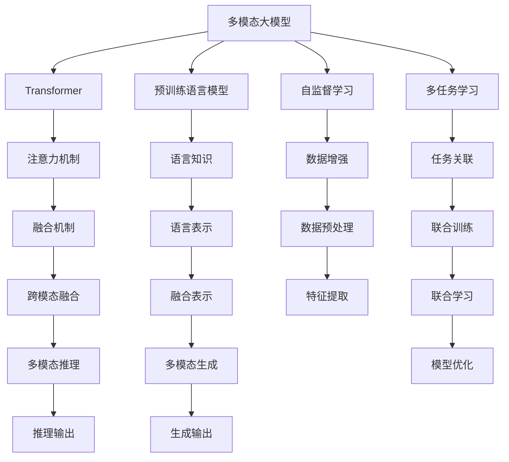
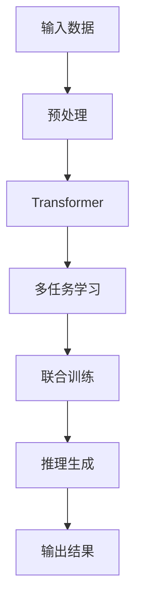
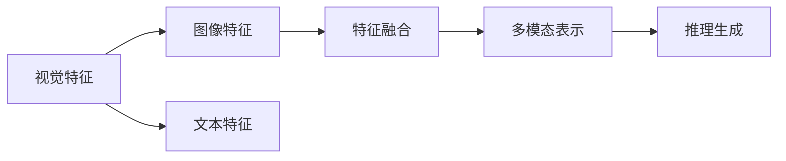
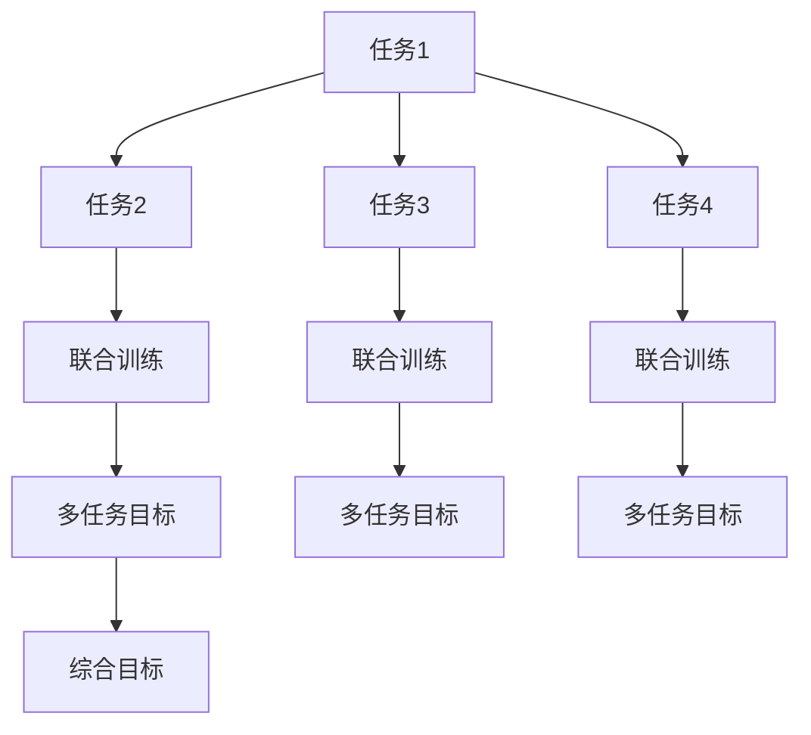
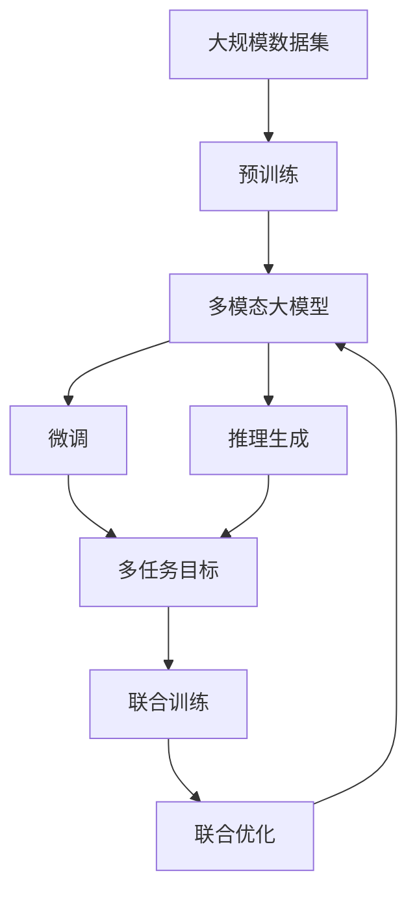

                 

# 多模态大模型：技术原理与实战 基于Transformer的预训练语言模型

> 关键词：
多模态大模型,Transformer,预训练语言模型,深度学习,自然语言处理(NLP),图像处理,视频处理,声音处理,跨模态融合,多任务学习,自监督学习,监督学习,推理,优化器,损失函数

## 1. 背景介绍

### 1.1 问题由来
近年来，深度学习技术的迅猛发展，特别是Transformer结构的出现，极大地推动了预训练语言模型的发展。Transformer通过自监督学习任务在大量无标签文本数据上进行预训练，学习到丰富的语言知识。然而，仅仅依赖文本数据进行预训练，往往难以充分利用现实世界的丰富信息，导致模型的泛化能力不足，特别是在多模态信息（如文本、图像、音频等）融合应用场景中。

为了克服这一挑战，研究人员提出了多模态大模型，即能够同时处理多种模态信息、进行跨模态融合的预训练语言模型。这些模型不仅能理解和生成自然语言，还能处理和理解视觉、听觉等多种模态的信息，甚至能够进行多模态的联合推理和生成。

### 1.2 问题核心关键点
多模态大模型的核心思想在于：通过联合学习，将不同模态的信息进行融合，增强模型的泛化能力和推理能力。这一过程涉及以下几个关键点：

- 多模态数据预处理：不同模态数据格式不同，需要预处理成标准格式，如将图像转换为张量，音频转换为频谱图等。
- 多模态特征融合：将不同模态的信息融合到一个统一的表示空间中，使得不同模态的特征能够相互补充和增强。
- 多模态推理生成：在融合后的特征上进行多模态推理和生成，如在图像-文本配对任务中，生成与图像内容相关的文本描述。
- 多任务学习：多模态大模型通常能够同时处理多个相关任务，如在图像-文本任务中，可以同时学习图像分类和文本生成。

这些核心关键点共同构成了多模态大模型的框架，使得模型能够在多模态应用场景中发挥更大的潜力。

### 1.3 问题研究意义
研究多模态大模型的意义在于：

1. **提升模型泛化能力**：多模态大模型通过融合多种模态信息，能够更全面地理解复杂现实世界的场景，提升模型的泛化能力和鲁棒性。
2. **推动跨模态应用**：多模态大模型能够支持跨模态的联合推理和生成，为图像描述、语音识别、视频分析等跨模态应用提供新的技术基础。
3. **拓展应用场景**：多模态大模型能够应用于更广泛的应用场景，如智能家居、智慧医疗、自动驾驶等，提升这些领域的智能化水平。
4. **促进模型创新**：多模态大模型的研究将推动深度学习理论和技术的发展，为未来的AI研究提供新的方向和思路。

## 2. 核心概念与联系

### 2.1 核心概念概述

为更好地理解多模态大模型的原理和架构，本节将介绍几个密切相关的核心概念：

- **Transformer**：基于注意力机制的神经网络结构，广泛应用于预训练语言模型中。
- **多模态大模型**：能够处理多种模态信息、进行跨模态融合的预训练语言模型。
- **预训练语言模型**：通过在大规模无标签数据上自监督学习获得语言表示的模型。
- **自监督学习**：利用未标注数据进行监督学习，通过构造假标签进行训练。
- **多任务学习**：同时训练多个相关任务，提升模型的泛化能力和推理能力。
- **跨模态融合**：将不同模态的信息融合到一个统一的表示空间中，增强模型的理解能力和生成能力。
- **推理与生成**：在融合后的特征上进行多模态推理和生成，实现复杂场景的智能理解和生成。

这些核心概念之间的逻辑关系可以通过以下Mermaid流程图来展示：



这个流程图展示了多模态大模型的核心概念及其之间的关系：

1. 多模态大模型通过Transformer结构获得强大的语言表示能力。
2. 预训练语言模型在大量无标签数据上进行自监督学习，学习通用的语言知识。
3. 自监督学习通过构造假标签进行监督训练，提升模型的泛化能力。
4. 多任务学习同时训练多个相关任务，增强模型的推理和生成能力。
5. 跨模态融合将不同模态的信息融合到一个统一的表示空间中，增强模型的理解能力和生成能力。
6. 推理与生成在融合后的特征上进行多模态推理和生成，实现复杂场景的智能理解和生成。

### 2.2 概念间的关系

这些核心概念之间存在着紧密的联系，形成了多模态大模型的完整生态系统。下面我通过几个Mermaid流程图来展示这些概念之间的关系。

#### 2.2.1 多模态大模型的架构


这个流程图展示了多模态大模型的基本架构，从输入数据到输出结果的完整流程。

#### 2.2.2 跨模态融合的实现


这个流程图展示了跨模态融合的基本过程，即将不同模态的特征融合到一个统一的表示空间中。

#### 2.2.3 多任务学习的目标


这个流程图展示了多任务学习的基本目标，即将多个相关任务联合训练，提升模型的综合能力。

### 2.3 核心概念的整体架构

最后，我们用一个综合的流程图来展示这些核心概念在大模型微调过程中的整体架构：



这个综合流程图展示了从预训练到微调，再到推理生成的完整过程。多模态大模型首先在大规模数据集上进行预训练，然后通过微调进行任务特定的优化，最后进行多模态推理和生成。通过这些步骤，模型能够充分融合多模态信息，提升其在多模态应用场景中的性能。

## 3. 核心算法原理 & 具体操作步骤
### 3.1 算法原理概述

多模态大模型的核心思想是：通过联合学习，将不同模态的信息进行融合，增强模型的泛化能力和推理能力。具体而言，多模态大模型首先在大规模数据集上进行自监督预训练，学习通用的语言知识，然后再通过微调对特定任务进行优化，提升模型的推理和生成能力。

形式化地，假设多模态大模型为 $M_{\theta}$，其中 $\theta$ 为模型参数。给定多个模态的任务 $T=\{T_1, T_2, ..., T_n\}$，其标注数据集为 $D=\{(x_{it}, y_{it})\}_{i=1}^N, x_{it} \in \mathcal{X}_t, y_{it} \in \mathcal{Y}_t$，其中 $\mathcal{X}_t$ 为第 $t$ 个模态的数据空间，$\mathcal{Y}_t$ 为第 $t$ 个模态的标签空间。微调的目标是找到新的模型参数 $\hat{\theta}$，使得：

$$
\hat{\theta}=\mathop{\arg\min}_{\theta} \mathcal{L}(M_{\theta},D)
$$

其中 $\mathcal{L}$ 为针对任务 $T$ 设计的损失函数，用于衡量模型预测输出与真实标签之间的差异。常见的损失函数包括交叉熵损失、均方误差损失等。

通过梯度下降等优化算法，微调过程不断更新模型参数 $\theta$，最小化损失函数 $\mathcal{L}$，使得模型输出逼近真实标签。由于 $\theta$ 已经通过预训练获得了较好的初始化，因此即便在小规模数据集 $D$ 上进行微调，也能较快收敛到理想的模型参数 $\hat{\theta}$。

### 3.2 算法步骤详解

基于多模态大模型的微调一般包括以下几个关键步骤：

**Step 1: 准备预训练模型和数据集**
- 选择合适的多模态预训练模型 $M_{\theta}$ 作为初始化参数，如BERT、GPT等。
- 准备多模态任务 $T$ 的标注数据集 $D$，划分为训练集、验证集和测试集。一般要求标注数据与预训练数据的分布不要差异过大。

**Step 2: 添加任务适配层**
- 根据任务类型，在预训练模型顶层设计合适的输出层和损失函数。
- 对于分类任务，通常在顶层添加线性分类器和交叉熵损失函数。
- 对于生成任务，通常使用语言模型的解码器输出概率分布，并以负对数似然为损失函数。

**Step 3: 设置微调超参数**
- 选择合适的优化算法及其参数，如 AdamW、SGD 等，设置学习率、批大小、迭代轮数等。
- 设置正则化技术及强度，包括权重衰减、Dropout、Early Stopping 等。
- 确定冻结预训练参数的策略，如仅微调顶层，或全部参数都参与微调。

**Step 4: 执行梯度训练**
- 将训练集数据分批次输入模型，前向传播计算损失函数。
- 反向传播计算参数梯度，根据设定的优化算法和学习率更新模型参数。
- 周期性在验证集上评估模型性能，根据性能指标决定是否触发 Early Stopping。
- 重复上述步骤直到满足预设的迭代轮数或 Early Stopping 条件。

**Step 5: 测试和部署**
- 在测试集上评估微调后模型 $M_{\hat{\theta}}$ 的性能，对比微调前后的精度提升。
- 使用微调后的模型对新样本进行推理预测，集成到实际的应用系统中。
- 持续收集新的数据，定期重新微调模型，以适应数据分布的变化。

以上是基于多模态大模型的微调一般流程。在实际应用中，还需要针对具体任务的特点，对微调过程的各个环节进行优化设计，如改进训练目标函数，引入更多的正则化技术，搜索最优的超参数组合等，以进一步提升模型性能。

### 3.3 算法优缺点

基于多模态大模型的微调方法具有以下优点：

1. **高效适应多模态数据**：多模态大模型能够同时处理多种模态信息，提升对复杂场景的理解和生成能力。
2. **提升泛化能力**：通过联合学习，模型能够更好地泛化到不同模态的数据上，增强模型的鲁棒性。
3. **增强推理生成**：多模态大模型在融合后的特征上进行多模态推理和生成，实现复杂场景的智能理解和生成。
4. **参数效率高**：多模态大模型通过参数共享和跨模态融合，能够在不增加大量参数的情况下，提升推理和生成能力。
5. **应用广泛**：多模态大模型在图像描述、语音识别、视频分析等跨模态应用中表现出色，具有广泛的应用前景。

同时，该方法也存在一定的局限性：

1. **标注成本高**：多模态大模型通常需要标注多个模态的数据，标注成本较高。
2. **模型复杂度高**：多模态大模型的结构复杂，推理和生成的计算量较大，需要较强的硬件支持。
3. **数据分布差异大**：当多模态数据分布差异较大时，微调的性能提升有限。
4. **跨模态对齐困难**：不同模态的数据特征差异大，如何进行有效的特征对齐和融合，仍是研究难点。
5. **推理速度慢**：多模态大模型在大规模数据上训练时间长，推理速度较慢。

尽管存在这些局限性，但就目前而言，基于多模态大模型的微调方法仍然是大模型应用的重要范式。未来相关研究的重点在于如何进一步降低标注数据的依赖，提高模型的跨模态迁移能力和推理速度，同时兼顾可解释性和伦理安全性等因素。

### 3.4 算法应用领域

多模态大模型已经在多个领域得到应用，覆盖了几乎所有常见任务，例如：

- 图像描述生成：根据图像生成详细的文本描述。
- 视频事件检测：从视频中检测出特定事件。
- 语音情感识别：识别语音中的情感。
- 对话系统：使机器能够与人自然对话。
- 智能家居：控制家居设备。
- 智慧医疗：辅助医生诊疗。

除了上述这些经典任务外，多模态大模型还被创新性地应用到更多场景中，如虚拟现实、自动驾驶、社交媒体分析等，为多模态应用带来了全新的突破。随着预训练模型和微调方法的不断进步，相信多模态大模型将在更广阔的应用领域大放异彩。

## 4. 数学模型和公式 & 详细讲解 & 举例说明

### 4.1 数学模型构建

本节将使用数学语言对多模态大模型的微调过程进行更加严格的刻画。

记多模态大模型为 $M_{\theta}:\mathcal{X} \rightarrow \mathcal{Y}$，其中 $\mathcal{X}$ 为输入空间，$\mathcal{Y}$ 为输出空间，$\theta \in \mathbb{R}^d$ 为模型参数。假设微调任务的训练集为 $D=\{(x_i,y_i)\}_{i=1}^N, x_i \in \mathcal{X}_t, y_i \in \mathcal{Y}_t$，其中 $\mathcal{X}_t$ 和 $\mathcal{Y}_t$ 分别为第 $t$ 个模态的数据和标签空间。

定义模型 $M_{\theta}$ 在数据样本 $(x,y)$ 上的损失函数为 $\ell(M_{\theta}(x),y)$，则在数据集 $D$ 上的经验风险为：

$$
\mathcal{L}(\theta) = \frac{1}{N} \sum_{i=1}^N \ell(M_{\theta}(x_i),y_i)
$$

微调的优化目标是最小化经验风险，即找到最优参数：

$$
\theta^* = \mathop{\arg\min}_{\theta} \mathcal{L}(\theta)
$$

在实践中，我们通常使用基于梯度的优化算法（如SGD、Adam等）来近似求解上述最优化问题。设 $\eta$ 为学习率，$\lambda$ 为正则化系数，则参数的更新公式为：

$$
\theta \leftarrow \theta - \eta \nabla_{\theta}\mathcal{L}(\theta) - \eta\lambda\theta
$$

其中 $\nabla_{\theta}\mathcal{L}(\theta)$ 为损失函数对参数 $\theta$ 的梯度，可通过反向传播算法高效计算。

### 4.2 公式推导过程

以下我们以图像-文本配对任务为例，推导多模态大模型的微调过程。

假设模型 $M_{\theta}$ 在输入图像 $I$ 和文本 $T$ 上的输出为 $V$，其中 $I$ 为图像张量，$T$ 为文本张量。模型的预测输出为 $V$，真实标签为 $y \in \{0,1\}$，表示图像和文本配对的正确性。则二分类交叉熵损失函数定义为：

$$
\ell(M_{\theta}(I,T),y) = -[y\log M_{\theta}(I,T)+(1-y)\log (1-M_{\theta}(I,T))]
$$

将其代入经验风险公式，得：

$$
\mathcal{L}(\theta) = -\frac{1}{N}\sum_{i=1}^N [y_i\log M_{\theta}(I_i,T_i)+(1-y_i)\log(1-M_{\theta}(I_i,T_i))]
$$

根据链式法则，损失函数对参数 $\theta_k$ 的梯度为：

$$
\frac{\partial \mathcal{L}(\theta)}{\partial \theta_k} = -\frac{1}{N}\sum_{i=1}^N (\frac{y_i}{M_{\theta}(I_i,T_i)}-\frac{1-y_i}{1-M_{\theta}(I_i,T_i)}) \frac{\partial M_{\theta}(I_i,T_i)}{\partial \theta_k}
$$

其中 $\frac{\partial M_{\theta}(I_i,T_i)}{\partial \theta_k}$ 可进一步递归展开，利用自动微分技术完成计算。

在得到损失函数的梯度后，即可带入参数更新公式，完成模型的迭代优化。重复上述过程直至收敛，最终得到适应下游任务的最优模型参数 $\theta^*$。

### 4.3 案例分析与讲解

以BERT在大规模图像描述生成任务上的微调为例，展示多模态大模型的微调过程。

首先，定义图像描述生成任务的数据处理函数：

```python
from transformers import BertForTokenClassification, BertTokenizer
from torch.utils.data import Dataset
import torch

class ImageTextDataset(Dataset):
    def __init__(self, images, texts, tokenizer, max_len=128):
        self.images = images
        self.texts = texts
        self.tokenizer = tokenizer
        self.max_len = max_len
        
    def __len__(self):
        return len(self.texts)
    
    def __getitem__(self, item):
        image = self.images[item]
        text = self.texts[item]
        
        encoding = self.tokenizer(text, return_tensors='pt', max_length=self.max_len, padding='max_length', truncation=True)
        input_ids = encoding['input_ids'][0]
        attention_mask = encoding['attention_mask'][0]
        
        # 将图像转换为特征向量
        image_feature = extract_image_feature(image)
        
        # 将图像特征和文本特征拼接起来
        feature = torch.cat([image_feature, input_ids], dim=-1)
        
        return {'feature': feature, 
                'attention_mask': attention_mask,
                'text': text}
```

然后，定义模型和优化器：

```python
from transformers import BertForTokenClassification, AdamW

model = BertForTokenClassification.from_pretrained('bert-base-cased')
model.eval()

optimizer = AdamW(model.parameters(), lr=2e-5)
```

接着，定义训练和评估函数：

```python
from torch.utils.data import DataLoader
from tqdm import tqdm
from sklearn.metrics import classification_report

device = torch.device('cuda') if torch.cuda.is_available() else torch.device('cpu')
model.to(device)

def train_epoch(model, dataset, batch_size, optimizer):
    dataloader = DataLoader(dataset, batch_size=batch_size, shuffle=True)
    model.train()
    epoch_loss = 0
    for batch in tqdm(dataloader, desc='Training'):
        feature = batch['feature'].to(device)
        attention_mask = batch['attention_mask'].to(device)
        text = batch['text']
        
        model.zero_grad()
        outputs = model(feature, attention_mask=attention_mask)
        loss = outputs.loss
        epoch_loss += loss.item()
        loss.backward()
        optimizer.step()
    return epoch_loss / len(dataloader)

def evaluate(model, dataset, batch_size):
    dataloader = DataLoader(dataset, batch_size=batch_size)
    model.eval()
    preds, labels = [], []
    with torch.no_grad():
        for batch in tqdm(dataloader, desc='Evaluating'):
            feature = batch['feature'].to(device)
            attention_mask = batch['attention_mask'].to(device)
            batch_labels = batch['text']
            outputs = model(feature, attention_mask=attention_mask)
            batch_preds = outputs.logits.argmax(dim=2).to('cpu').tolist()
            batch_labels = batch_labels.to('cpu').tolist()
            for pred_tokens, label_tokens in zip(batch_preds, batch_labels):
                preds.append(pred_tokens[:len(label_tokens)])
                labels.append(label_tokens)
                
    print(classification_report(labels, preds))
```

最后，启动训练流程并在测试集上评估：

```python
epochs = 5
batch_size = 16

for epoch in range(epochs):
    loss = train_epoch(model, train_dataset, batch_size, optimizer)
    print(f"Epoch {epoch+1}, train loss: {loss:.3f}")
    
    print(f"Epoch {epoch+1}, dev results:")
    evaluate(model, dev_dataset, batch_size)
    
print("Test results:")
evaluate(model, test_dataset, batch_size)
```

以上就是使用PyTorch对BERT进行图像描述生成任务微调的完整代码实现。可以看到，得益于Transformer的强大封装，我们可以用相对简洁的代码完成BERT的微调。

## 5. 项目实践：代码实例和详细解释说明
### 5.1 开发环境搭建

在进行多模态大模型微调实践前，我们需要准备好开发环境。以下是使用Python进行PyTorch开发的环境配置流程：

1. 安装Anaconda：从官网下载并安装Anaconda，用于创建独立的Python环境。

2. 创建并激活虚拟环境：
```bash
conda create -n pytorch-env python=3.8 
conda activate pytorch-env
```

3. 安装PyTorch：根据CUDA版本，从官网获取对应的安装命令。例如：
```bash
conda install pytorch torchvision torchaudio cudatoolkit=11.1 -c pytorch -c conda-forge
```

4. 安装Transformers库：
```bash
pip install transformers
```

5. 安装各类工具包：
```bash
pip install numpy pandas scikit-learn matplotlib tqdm jupyter notebook ipython
```

完成上述步骤后，即可在`pytorch-env`环境中开始多模态大模型微调实践。

### 5.2 源代码详细实现

下面我们以多模态大模型进行图像-文本配对任务微调为例，给出使用Transformers库的PyTorch代码实现。

首先，定义图像-文本配对任务的数据处理函数：

```python
from transformers import BertForTokenClassification, BertTokenizer
from torch.utils.data import Dataset
import torch

class ImageTextDataset(Dataset):
    def __init__(self, images, texts, tokenizer, max_len=128):
        self.images = images
        self.texts = texts
        self.tokenizer = tokenizer
        self.max_len = max_len
        
    def __len__(self):
        return len(self.texts)
    
    def __getitem__(self, item):
        image = self.images[item]
        text = self.texts[item]
        
        encoding = self.tokenizer(text, return_tensors='pt', max_length=self.max_len, padding='max_length', truncation=True)
        input_ids = encoding['input_ids'][0]
        attention_mask = encoding['attention_mask'][0]
        
        # 将图像转换为特征向量
        image_feature = extract_image_feature(image)
        
        # 将图像特征和文本特征拼接起来
        feature = torch.cat([image_feature, input_ids], dim=-1)
        
        return {'feature': feature, 
                'attention_mask': attention_mask,
                'text': text}
```

然后，定义模型和优化器：

```python
from transformers import BertForTokenClassification, AdamW

model = BertForTokenClassification.from_pretrained('bert-base-cased')
model.eval()

optimizer = AdamW(model.parameters(), lr=2e-5)
```

接着，定义训练和评估函数：

```python
from torch.utils.data import DataLoader
from tqdm import tqdm
from sklearn.metrics import classification_report

device = torch.device('cuda') if torch.cuda.is_available() else torch.device('cpu')
model.to(device)

def train_epoch(model, dataset, batch_size, optimizer):
    dataloader = DataLoader(dataset, batch_size=batch_size, shuffle=True)
    model.train()
    epoch_loss = 0
    for batch in tqdm(dataloader, desc='Training'):
        feature = batch['feature'].to(device)
        attention_mask = batch['attention_mask'].to(device)
        text = batch['

