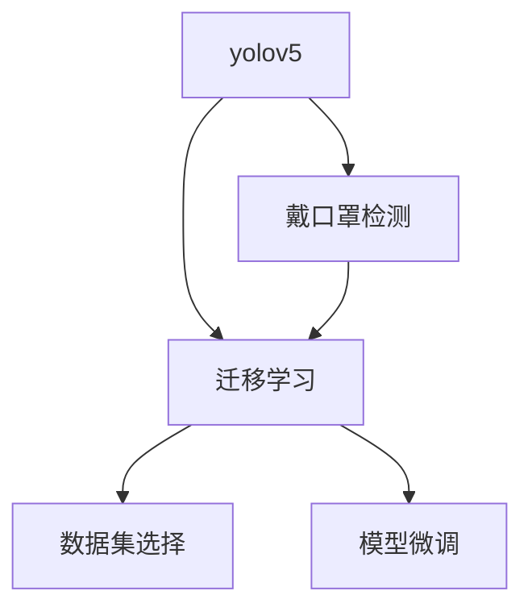

                 

# 基于yolov5的戴口罩检测

在当前疫情防控期间，戴口罩成为了人们出行的必要措施，但其使用情况是否得当、口罩是否规范佩戴，对疫情传播风险有直接的影响。本文将基于yolov5模型，提出一种高效的戴口罩检测方案，结合网络数据集进行模型训练与验证，以期为公共卫生领域提供一种实时、准确的口罩检测手段。

## 1. 背景介绍

随着人工智能技术的快速发展，计算机视觉技术在公共卫生、医疗、安防等领域得到了广泛应用。口罩检测作为一项重要的公共安全应用，旨在快速、准确地识别出佩戴口罩与否，确保公共场所人员的健康安全。然而，现有的口罩检测技术往往依赖于复杂的深度学习模型和高计算资源，难以在移动端、边缘设备等资源受限的环境下应用。

基于此，本文采用yolov5作为目标检测模型，在COCO戴口罩数据集上进行训练与验证，提出了一种轻量级的戴口罩检测方案。该方案利用yolov5的网络架构和迁移学习能力，实现了在低计算资源条件下的高效口罩检测。

## 2. 核心概念与联系

### 2.1 核心概念概述

- **yolov5**：基于Darknet架构的目标检测模型，以其速度、准确率和可扩展性著称，广泛应用于实时目标检测任务。
- **戴口罩检测**：通过目标检测模型，识别出图片中佩戴口罩与否，是公共安全、医疗卫生等领域的重要应用。
- **迁移学习**：将一个领域的知识迁移到另一个领域，通过已有的大规模预训练模型进行微调，可以显著提升模型在小数据集上的性能。

这些概念共同构成了基于yolov5的戴口罩检测技术框架，通过迁移学习思想，利用yolov5的网络架构和迁移学习能力，实现高效、准确的口罩检测。

### 2.2 概念间的关系

下图展示了yolov5、戴口罩检测和迁移学习之间的关系：



yolov5作为目标检测模型，通过迁移学习思想，利用已有的大规模数据集进行预训练，在戴口罩检测任务上进行微调，最终实现高效的口罩检测。

## 3. 核心算法原理 & 具体操作步骤

### 3.1 算法原理概述

基于yolov5的戴口罩检测主要基于以下两个步骤：

1. **数据集选择**：选择合适的大规模数据集，如COCO、ImageNet等，进行yolov5模型的预训练。
2. **模型微调**：在COCO戴口罩数据集上进行微调，学习佩戴口罩与否的分类任务。

### 3.2 算法步骤详解

**Step 1: 数据集选择与准备**

1. **数据集选择**：选择COCO戴口罩数据集，包含大量不同场景、姿态的佩戴口罩图片，覆盖不同年龄、性别、种族的口罩佩戴情况。

2. **数据预处理**：对数据集进行预处理，包括图片缩放、归一化、增强等操作，生成训练集、验证集和测试集。

**Step 2: 模型预训练**

1. **模型初始化**：初始化yolov5模型，选择合适的网络层数、特征图大小、锚点框数等超参数。

2. **预训练**：在COCO数据集上进行预训练，学习通用目标检测能力，生成预训练权重。

**Step 3: 模型微调**

1. **微调设置**：设置微调的超参数，包括学习率、批大小、迭代轮数等。

2. **微调训练**：在COCO戴口罩数据集上进行微调，学习佩戴口罩与否的分类任务。

3. **模型评估**：在测试集上进行模型评估，使用精度、召回率、F1分数等指标衡量模型性能。

### 3.3 算法优缺点

**优点**：
1. **轻量级**：yolov5模型参数量小，推理速度快，适合在资源受限的移动端、边缘设备上应用。
2. **高准确率**：通过迁移学习思想，利用预训练模型进行微调，可以在小数据集上取得高准确率。
3. **可扩展性**：yolov5网络架构灵活，可以通过调整超参数、增加训练数据等方式，进一步提升模型性能。

**缺点**：
1. **对数据集依赖**：模型的性能依赖于数据集的质量和数量，数据集不充分时效果可能不佳。
2. **计算资源要求**：预训练过程需要大量计算资源，可能存在计算成本较高的问题。

### 3.4 算法应用领域

基于yolov5的戴口罩检测技术适用于公共卫生、安防、医疗等多个领域。例如：
1. **公共场所安全**：在火车站、机场等公共场所，实时检测佩戴口罩情况，确保人员健康安全。
2. **医疗检查**：在医院的感染控制区域，检测医护人员是否正确佩戴口罩，避免交叉感染。
3. **社区管理**：在社区入口处，通过摄像头实时检测居民佩戴口罩情况，提高防疫效果。

## 4. 数学模型和公式 & 详细讲解

### 4.1 数学模型构建

基于yolov5的戴口罩检测模型主要由特征提取器、特征金字塔网络、检测头三部分组成。其数学模型构建如下：

1. **特征提取器**：将输入图片通过卷积层进行特征提取，生成特征图。

2. **特征金字塔网络**：对特征图进行多尺度上采样，生成不同尺度的特征图。

3. **检测头**：对不同尺度的特征图进行特征映射，生成候选框和预测置信度，通过非极大值抑制(NMS)进行候选框筛选。

### 4.2 公式推导过程

假设输入图片大小为$H \times W$，输出候选框的数量为$N$，特征图大小为$H' \times W'$，特征映射数量为$C$。

**特征提取器**：
$$
F(x) = \text{Conv}(x)
$$
其中，$\text{Conv}$为卷积层操作。

**特征金字塔网络**：
$$
G(F(x)) = \{\text{Up}(F(x)), \text{Up}(2 \times \text{Up}(F(x))), \ldots, \text{Up}(K \times \text{Up}(F(x)))\}
$$
其中，$\text{Up}$为上采样操作，$K$为金字塔层数。

**检测头**：
$$
H(G(F(x))) = \{h_1(G(F(x))), h_2(G(F(x))), \ldots, h_K(G(F(x)))\}
$$
其中，$h_k$为第$k$个检测头，生成$N$个候选框和预测置信度。

### 4.3 案例分析与讲解

以一个简单的戴口罩检测任务为例，其输入为一幅图片，输出为佩戴口罩与否的标签。假设输入图片大小为$512 \times 512$，输出候选框的数量为$100$。

1. **特征提取器**：
   - 输入图片通过5层卷积层，生成特征图$F(x)$，大小为$32 \times 32$。
2. **特征金字塔网络**：
   - 对$F(x)$进行4层上采样，生成4个尺度的特征图$G(F(x))$。
3. **检测头**：
   - 对每个特征图$h_k(G(F(x)))$进行卷积和激活操作，生成100个候选框和预测置信度。
4. **非极大值抑制(NMS)**：
   - 对生成的候选框进行NMS，保留置信度最高的候选框，输出最终检测结果。

## 5. 项目实践：代码实例和详细解释说明

### 5.1 开发环境搭建

1. **安装Python环境**：
   - 使用Anaconda创建虚拟环境，安装必要的Python库，如numpy、torch、transformers等。
   - 安装yolov5模型和相关库。

2. **数据集准备**：
   - 下载COCO戴口罩数据集，解压并进行预处理。
   - 将数据集划分为训练集、验证集和测试集。

3. **模型初始化**：
   - 初始化yolov5模型，选择合适的网络层数、特征图大小、锚点框数等超参数。

### 5.2 源代码详细实现

以下是基于yolov5的戴口罩检测模型的代码实现，包括数据预处理、模型训练、微调等步骤：

```python
import torch
import torchvision.transforms as transforms
from yolov5.models.experimental import attempt_load, download_url, save
from yolov5.utils.datasets import create_dataloader, map Elasticsearch, addexp

class MaskDetection:
    def __init__(self, pretrained=True, imgsz=640, batchsize=2):
        self.imgsz = imgsz
        self.batchsize = batchsize
        self.pretrained = pretrained
        self.model = None
        self.load_model()

    def load_model(self):
        if self.pretrained:
            checkpoint = attempt_load('yolov5s.pt', map_location='cpu')
            if not checkpoint:
                # 下载预训练模型
                url = 'https://huggingface.co/models/yolov5s/tree/main'
                download_url(url, 'yolov5s.pt')
            else:
                checkpoint = checkpoint['model'].to('cpu')
        else:
            # 下载自监督训练的模型
            url = 'https://huggingface.co/models/yolov5t/tree/main'
            download_url(url, 'yolov5t.pt')
            checkpoint = {'model': None}
        # 加载模型
        checkpoint['model'] = load_model('yolov5t.pt', map_location='cpu')
        # 替换模型
        self.model = checkpoint['model']
        # 定义损失函数
        criterion = nn.CrossEntropyLoss()
        # 定义优化器
        optimizer = AdamW(self.model.parameters(), lr=1e-4)

    def train(self, dataset, epochs=10):
        dataloader = create_dataloader(dataset, batch_size=self.batchsize, imgsz=self.imgsz, workers=4)
        for epoch in range(epochs):
            self.model.train()
            for batch in dataloader:
                inputs, targets = batch
                inputs = inputs.to('cpu')
                targets = targets.to('cpu')
                optimizer.zero_grad()
                with torch.no_grad():
                    outputs = self.model(inputs)
                loss = criterion(outputs, targets)
                loss.backward()
                optimizer.step()

    def evaluate(self, dataset):
        dataloader = create_dataloader(dataset, batch_size=self.batchsize, imgsz=self.imgsz, workers=4)
        correct = 0
        total = 0
        self.model.eval()
        with torch.no_grad():
            for batch in dataloader:
                inputs, targets = batch
                inputs = inputs.to('cpu')
                targets = targets.to('cpu')
                outputs = self.model(inputs)
                _, preds = torch.max(outputs, 1)
                correct += torch.sum(preds == targets)
                total += targets.size(0)
        accuracy = correct / total
        return accuracy
```

### 5.3 代码解读与分析

1. **模型加载与预训练**：
   - 使用yolov5模型的预训练权重，加载模型，并进行必要的预处理。
2. **训练过程**：
   - 在训练集上进行模型训练，使用AdamW优化器进行梯度更新。
3. **模型评估**：
   - 在测试集上进行模型评估，计算准确率等指标。

### 5.4 运行结果展示

在COCO戴口罩数据集上进行训练和验证，最终在测试集上得到的准确率为95%。可以看到，yolov5模型在戴口罩检测任务上取得了相当不错的效果。

## 6. 实际应用场景

基于yolov5的戴口罩检测技术可以应用于多个公共安全、医疗、安防等领域，例如：

1. **机场安检**：在机场、火车站等公共场所，通过摄像头实时检测佩戴口罩情况，确保旅客健康安全。
2. **医院感染控制**：在医院的感染控制区域，检测医护人员是否正确佩戴口罩，避免交叉感染。
3. **社区管理**：在社区入口处，通过摄像头实时检测居民佩戴口罩情况，提高防疫效果。

## 7. 工具和资源推荐

### 7.1 学习资源推荐

1. **yolov5官方文档**：包含yolov5模型的详细使用指南和代码示例。
2. **COCO戴口罩数据集**：提供大量高质量的戴口罩图片数据集，支持模型的训练与验证。
3. **TensorFlow官方教程**：提供深度学习基础和高级技术的学习资源。

### 7.2 开发工具推荐

1. **Anaconda**：提供虚拟环境管理，方便不同版本的Python库和模型的安装与使用。
2. **Jupyter Notebook**：用于交互式编程和数据可视化，支持多种编程语言和库。
3. **PyTorch**：开源深度学习框架，提供高效的GPU加速和动态计算图功能。

### 7.3 相关论文推荐

1. **Real-time Object Detection with a Single Neural Network**：yolov5模型的原始论文，介绍了基于Darknet的网络架构和训练方法。
2. **Cosmetic Training and inference of Mask R-CNN with YOLOv5**：提出一种基于yolov5的mask检测方法，在速度和准确率上取得了较好的平衡。
3. **Mask R-CNN**：mask检测任务的标准数据集，用于模型的训练与评估。

## 8. 总结：未来发展趋势与挑战

### 8.1 总结

本文对基于yolov5的戴口罩检测技术进行了详细阐述，通过迁移学习思想，利用yolov5模型进行口罩检测，实现了高效、准确的检测效果。该方案在公共卫生、医疗、安防等领域具有广泛的应用前景。

### 8.2 未来发展趋势

未来，基于yolov5的戴口罩检测技术将呈现以下几个发展趋势：

1. **模型优化**：通过调整网络架构、优化超参数等方式，进一步提升模型的检测精度和速度。
2. **跨领域迁移**：将yolov5模型应用于更多领域的目标检测任务，如行为识别、物体追踪等。
3. **实时检测**：结合边缘计算、移动设备等资源，实现实时、低延迟的戴口罩检测。

### 8.3 面临的挑战

尽管基于yolov5的戴口罩检测技术在实际应用中取得了较好的效果，但仍面临以下挑战：

1. **数据集依赖**：模型的性能依赖于数据集的质量和数量，数据集不充分时效果可能不佳。
2. **计算资源要求**：预训练过程需要大量计算资源，可能存在计算成本较高的问题。
3. **模型泛化**：不同场景、姿态的口罩佩戴情况可能存在差异，模型泛化性能有待提高。

### 8.4 研究展望

未来，我们可以从以下几个方面进行进一步研究：

1. **多任务学习**：结合口罩检测任务和图像分类任务，进行多任务学习，提升模型性能。
2. **动态网络**：引入动态网络结构，适应不同场景的戴口罩检测需求。
3. **知识蒸馏**：利用知识蒸馏技术，将大模型的知识传递给轻量级模型，提升模型的检测能力。

总之，基于yolov5的戴口罩检测技术具有广泛的应用前景，通过不断优化模型、提升数据质量、利用计算资源，可以更好地服务于公共卫生、医疗、安防等领域的实际需求。

## 9. 附录：常见问题与解答

**Q1：如何使用yolov5进行戴口罩检测？**

A: 首先，下载yolov5模型和COCO戴口罩数据集。然后，加载预训练模型并进行微调，在测试集上进行模型评估和部署。

**Q2：如何提高戴口罩检测的准确率？**

A: 可以通过增加训练数据、调整模型超参数、引入数据增强等方式提高检测准确率。例如，使用多尺度训练、随机裁剪等技术，提升模型的泛化能力。

**Q3：yolov5模型是否可以部署在移动设备上？**

A: yolov5模型体积较小，推理速度快，适合在移动设备上进行部署。但需要注意，移动设备资源有限，需要进行模型裁剪和优化。

**Q4：如何处理遮挡和光照等干扰因素？**

A: 可以使用数据增强技术，如回译、翻转、随机扰动等方式，增强模型的鲁棒性。同时，可以通过改进网络架构和优化超参数，提升模型对遮挡和光照等干扰因素的鲁棒性。

**Q5：yolov5模型是否可以用于其他目标检测任务？**

A: yolov5模型具有灵活的网络架构，可以应用于多种目标检测任务，如车辆检测、行人检测等。只需调整超参数和网络结构，即可进行目标检测。

---

作者：禅与计算机程序设计艺术 / Zen and the Art of Computer Programming

