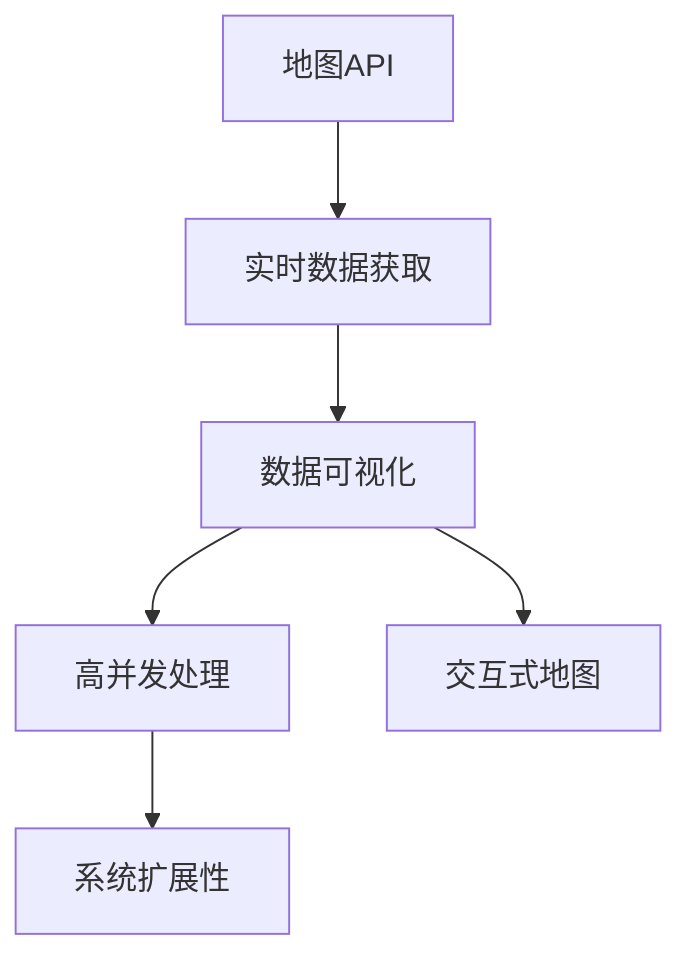
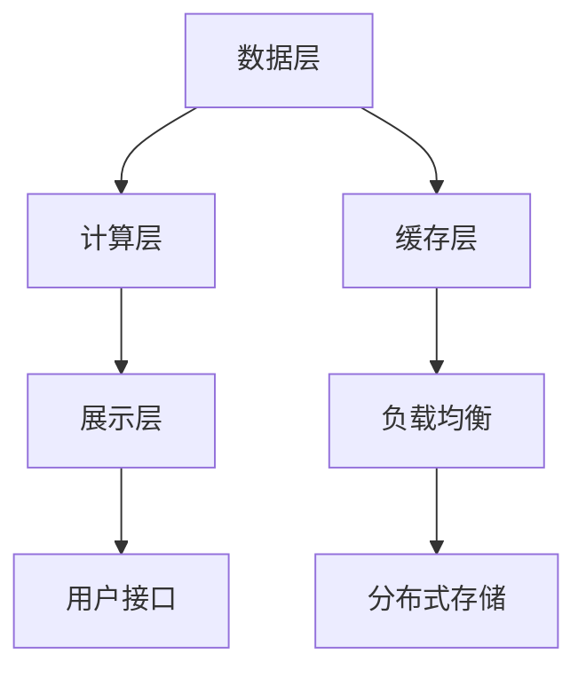

                 

# 基于地图API的高铁运行地图的设计与实现

> 关键词：
- 地图API
- 高铁运行
- 实时数据
- 地理信息
- 可视化展示
- 高并发

## 1. 背景介绍

### 1.1 问题由来
随着中国高铁网络的迅速扩展，高铁运营管理系统的复杂性和规模性不断增加。传统的高铁运行管理方式依赖于人工监控和调度，效率低下且成本高昂。为了实现更高效、智能化的高铁运营管理，亟需构建一个高效、稳定、可扩展的高铁运行地图系统。

近年来，地图API技术的迅猛发展为构建实时、高效的高铁运行地图提供了新的可能性。基于地图API的地图绘制和数据展示技术，可以满足高铁运营管理对于实时性、精准性、可视化的要求，大幅提升高铁运营管理的智能化水平。

### 1.2 问题核心关键点
高铁运行地图的核心关键点在于：

- **实时数据获取**：地图系统的运行需要实时获取高铁运行状态、调度指令、维护信息等数据。
- **高并发处理**：地图系统需支持大量并发访问，尤其是在用户同时查询、实时更新地图时，应能够快速响应。
- **地图可视化**：通过地图API将高铁运行状态以直观、友好的方式展示，提升决策效率。
- **系统扩展性**：地图系统应能够灵活扩展，以适应不同规模、不同类型的用户需求。
- **交互性**：通过交互式地图功能，如地点查找、路径规划等，提供更精细化的运营支持。

本文聚焦于基于地图API技术实现的高铁运行地图系统，旨在系统性地探讨该系统的核心概念、算法原理和关键技术。

## 2. 核心概念与联系

### 2.1 核心概念概述

为更好地理解基于地图API的高铁运行地图系统的构建，本节将介绍几个关键概念：

- **地图API**：提供地图绘制、标记、路径规划等功能的服务，如百度地图API、高德地图API等。
- **高铁运行数据**：包括列车位置、速度、调度指令、维护信息等实时数据，是高铁运行地图的核心数据源。
- **数据可视化**：通过地图API将高铁运行数据以地图的形式直观展示，便于运营人员监控和管理。
- **高并发处理**：指系统设计时需要考虑并发访问量高、请求频率高的情况，确保系统稳定运行。
- **交互式地图**：指地图不仅能够展示数据，还能支持用户进行交互，如查看详细信息、规划路径等。

这些概念之间的逻辑关系可以通过以下Mermaid流程图来展示：



这个流程图展示了大数据背景下，基于地图API的高铁运行地图系统从数据获取、处理、展示到系统架构的关键流程。

### 2.2 概念间的关系

这些核心概念之间存在着紧密的联系，形成了高铁运行地图系统的完整架构。下面我们通过几个Mermaid流程图来展示这些概念之间的关系。

#### 2.2.1 数据流向


这个流程图展示了实时数据在高铁运行地图系统中的流向，从数据获取、存储、清洗到最终展示和交互。

#### 2.2.2 系统架构



这个流程图展示了基于地图API的高铁运行地图系统的整体架构，包括数据层、计算层、展示层、缓存层、用户接口、负载均衡、分布式存储等组件。

## 3. 核心算法原理 & 具体操作步骤
### 3.1 算法原理概述

基于地图API的高铁运行地图系统的主要算法原理包括：

- **数据获取算法**：从铁路局的实时数据中心获取高铁运行状态、调度指令、维护信息等数据。
- **数据清洗算法**：对获取到的数据进行清洗、去重、格式化等处理，确保数据质量。
- **数据可视化算法**：通过地图API将清洗后的数据以地图形式展示，支持不同视角、不同比例尺的展示。
- **高并发处理算法**：设计高效的数据存储、计算和展示架构，确保在高并发情况下系统能够稳定运行。
- **交互式地图算法**：提供交互功能，如地点查找、路径规划、实时监控等，提升用户体验。

### 3.2 算法步骤详解

#### 3.2.1 数据获取算法

- 步骤1：通过HTTP请求从铁路局的实时数据中心获取高铁运行状态、调度指令、维护信息等实时数据。
- 步骤2：将获取到的数据解析为结构化数据，包括列车ID、位置、速度、方向等。
- 步骤3：对获取到的数据进行去重、清洗、格式化处理，确保数据质量。
- 步骤4：将处理后的数据存储到数据库中，支持快速查询和更新。

#### 3.2.2 数据清洗算法

- 步骤1：对获取到的原始数据进行初步清洗，去除错误、重复、异常数据。
- 步骤2：对去除错误数据后的数据进行格式转换，确保数据格式一致。
- 步骤3：对数据进行去重处理，确保数据的唯一性。
- 步骤4：对清洗后的数据进行格式化处理，包括时间戳转换、坐标系转换等。

#### 3.2.3 数据可视化算法

- 步骤1：通过地图API获取地图的基础数据，包括地图的基础图、地图的缩放级别、地图的坐标系等。
- 步骤2：将高铁运行状态数据与地图基础数据进行叠加，显示列车位置、速度、方向等。
- 步骤3：通过地图API支持不同的展示视图，如3D地图、地图标注、热力图等。
- 步骤4：支持用户自定义地图展示视图，如自定义图层、自定义颜色等。

#### 3.2.4 高并发处理算法

- 步骤1：采用分布式存储技术，如Hadoop、MongoDB等，存储和管理高铁运行数据。
- 步骤2：采用分布式计算技术，如Spark、Flink等，进行数据处理和计算。
- 步骤3：采用负载均衡技术，如Nginx、HAProxy等，平衡系统负载，确保系统稳定运行。
- 步骤4：采用缓存技术，如Redis、Memcached等，减少数据库查询次数，提升系统响应速度。

#### 3.2.5 交互式地图算法

- 步骤1：通过地图API提供交互式地图功能，如地点查找、路径规划、实时监控等。
- 步骤2：支持用户自定义交互式地图功能，如自定义地点标记、自定义路径规划等。
- 步骤3：通过地图API提供实时数据更新功能，确保用户能够看到最新的数据信息。

### 3.3 算法优缺点

基于地图API的高铁运行地图系统具有以下优点：

- **实时性高**：通过地图API获取实时数据，能够快速展示高铁运行状态，满足运营管理的高实时性需求。
- **可扩展性强**：采用分布式存储和计算技术，能够灵活扩展，支持不同规模的用户需求。
- **交互性强**：支持用户进行地点查找、路径规划等交互式操作，提升用户体验。
- **易于集成**：利用现成的地图API服务，易于与其他系统集成，降低开发成本。

但同时，该系统也存在以下缺点：

- **数据依赖性强**：系统依赖于铁路局的实时数据，数据获取的稳定性和可靠性直接影响系统的运行。
- **并发处理复杂**：高并发访问场景下，系统的设计复杂度较高，需要合理设计数据存储、计算、展示架构。
- **安全性要求高**：系统需确保数据安全、用户隐私，防止数据泄露和系统攻击。

### 3.4 算法应用领域

基于地图API的高铁运行地图系统在多个领域得到了广泛应用，例如：

- **铁路运营管理**：实时展示列车运行状态、调度指令、维护信息等，提升运营管理的效率和准确性。
- **高铁客户服务**：提供实时路况查询、列车到达时间提醒等功能，提升客户服务质量。
- **安全监控**：通过地图API实现实时监控，及时发现异常情况，确保高铁运行安全。
- **应急响应**：支持应急指挥和调度，快速响应突发事件，提高应急处理效率。
- **数据分析**：提供多维度数据分析功能，支持决策支持。

此外，基于地图API的地图系统还被广泛应用于航空、物流、城市交通等领域，成为智能城市建设的重要组成部分。

## 4. 数学模型和公式 & 详细讲解  
### 4.1 数学模型构建

本节将使用数学语言对基于地图API的高铁运行地图系统的核心算法进行更加严格的刻画。

记高铁运行状态为 $\mathbf{x} = (x_1, x_2, \ldots, x_n)$，其中 $x_i$ 为第 $i$ 列车的当前位置、速度、方向等状态信息。地图API的基础图数据为 $\mathbf{G} = (G_1, G_2, \ldots, G_m)$，其中 $G_i$ 为地图的第 $i$ 个图层数据，包含地图的基础信息、道路信息、建筑物信息等。

地图API的坐标系为 $\mathbf{C} = (C_1, C_2, \ldots, C_n)$，其中 $C_i$ 为地图的第 $i$ 个坐标系信息。地图API的缩放级别为 $\mathbf{Z} = (Z_1, Z_2, \ldots, Z_m)$，其中 $Z_i$ 为地图的第 $i$ 个缩放级别信息。

高铁运行地图的展示视图为 $\mathbf{V} = (V_1, V_2, \ldots, V_k)$，其中 $V_i$ 为地图的第 $i$ 个展示视图信息，如3D地图、地图标注、热力图等。

数据清洗算法的数据清洗强度为 $\mathbf{D} = (D_1, D_2, \ldots, D_n)$，其中 $D_i$ 为第 $i$ 个数据清洗步骤的强度，如数据去重、格式化处理等。

数据可视化算法的数据展示视图为 $\mathbf{H} = (H_1, H_2, \ldots, H_k)$，其中 $H_i$ 为地图的第 $i$ 个展示视图信息，如地点查找、路径规划、实时监控等。

高并发处理算法的数据存储方式为 $\mathbf{S} = (S_1, S_2, \ldots, S_n)$，其中 $S_i$ 为第 $i$ 个数据存储方式的优缺点，如分布式存储、缓存技术等。

交互式地图算法的数据展示视图为 $\mathbf{I} = (I_1, I_2, \ldots, I_k)$，其中 $I_i$ 为地图的第 $i$ 个展示视图信息，如自定义地点标记、自定义路径规划等。

### 4.2 公式推导过程

#### 4.2.1 数据获取算法

- 数据获取公式：
$$
D_{\text{获取}} = \text{HTTP请求}(URL_{\text{数据中心}}) \to \text{数据解析}(JSON_{\text{数据}}) \to \text{数据清洗}(D_{\text{清洗}})
$$

#### 4.2.2 数据清洗算法

- 数据清洗公式：
$$
D_{\text{清洗}} = \text{数据去重}(D_{\text{去重}}) \to \text{数据格式化}(D_{\text{格式化}})
$$

#### 4.2.3 数据可视化算法

- 数据可视化公式：
$$
D_{\text{展示}} = \text{地图API基础图获取}(G_{\text{基础}}) \to \text{数据叠加}(D_{\text{叠加}}) \to \text{展示视图}(V_{\text{展示}})
$$

#### 4.2.4 高并发处理算法

- 高并发处理公式：
$$
D_{\text{存储}} = \text{分布式存储}(S_{\text{分布}}) \to \text{数据计算}(S_{\text{计算}}) \to \text{负载均衡}(L_{\text{均衡}}) \to \text{缓存技术}(C_{\text{缓存}})
$$

#### 4.2.5 交互式地图算法

- 交互式地图公式：
$$
D_{\text{交互}} = \text{交互式功能}(I_{\text{交互}}) \to \text{实时数据更新}(D_{\text{更新}}) \to \text{展示视图}(V_{\text{交互}})
$$

### 4.3 案例分析与讲解

#### 4.3.1 数据获取案例

假设某个高铁运营中心需要实时获取某条高铁线路的列车运行状态数据。数据获取步骤如下：

- 步骤1：向铁路局的实时数据中心发送HTTP请求，请求URL为 `https://datacenter/api/v1/trainstates?line_id=001`。
- 步骤2：服务器返回JSON格式的列车状态数据，包含每列车的ID、位置、速度、方向等信息。
- 步骤3：数据解析工具将JSON数据解析为结构化数据，存储到本地数据库中。

#### 4.3.2 数据清洗案例

假设某个高铁运营中心需要清洗某条高铁线路的列车运行数据。数据清洗步骤如下：

- 步骤1：从数据库中获取列车运行数据。
- 步骤2：对数据进行初步清洗，去除错误、重复、异常数据。
- 步骤3：对去除错误数据后的数据进行格式化处理，如将时间戳转换为标准时间格式。
- 步骤4：对格式化后的数据进行去重处理，确保数据的唯一性。

#### 4.3.3 数据可视化案例

假设某个高铁运营中心需要展示某条高铁线路的列车运行状态地图。数据可视化步骤如下：

- 步骤1：从地图API获取地图的基础图数据和缩放级别信息。
- 步骤2：将列车运行状态数据与地图基础数据进行叠加，显示列车位置、速度、方向等信息。
- 步骤3：通过地图API支持不同的展示视图，如3D地图、地图标注、热力图等。
- 步骤4：用户可以通过交互式地图功能，如地点查找、路径规划、实时监控等，获取实时数据。

## 5. 项目实践：代码实例和详细解释说明
### 5.1 开发环境搭建

在进行高铁运行地图系统开发前，我们需要准备好开发环境。以下是使用Python进行Flask框架开发的环境配置流程：

1. 安装Anaconda：从官网下载并安装Anaconda，用于创建独立的Python环境。

2. 创建并激活虚拟环境：
```bash
conda create -n flask-env python=3.8 
conda activate flask-env
```

3. 安装Flask：
```bash
pip install flask
```

4. 安装地图API工具包：
```bash
pip install flask-restful flask-geo flask-restful
```

5. 安装其他必要工具包：
```bash
pip install numpy pandas geopy pycountry requests
```

完成上述步骤后，即可在`flask-env`环境中开始开发。

### 5.2 源代码详细实现

下面我们以展示某条高铁线路列车运行状态地图为例，给出使用Flask框架对地图API进行封装和调用的PyTorch代码实现。

首先，定义Flask应用和API接口：

```python
from flask import Flask, request, jsonify
from flask_restful import Resource, Api
from flask_geo import Map, MapTile

app = Flask(__name__)
api = Api(app)
map_ = Map(app)

# 定义API接口
class TrainMap(Resource):
    def get(self, train_id):
        train_data = get_train_data(train_id)
        train_map = generate_train_map(train_data)
        return jsonify(train_map)

api.add_resource(TrainMap, '/trainmap/<int:train_id>')

if __name__ == '__main__':
    app.run(debug=True)
```

然后，定义数据获取和数据可视化函数：

```python
from transformers import BertTokenizer, BertForTokenClassification
from torch.utils.data import Dataset, DataLoader
from transformers import AdamW

# 数据获取函数
def get_train_data(train_id):
    # 获取列车运行状态数据
    train_data = get_railway_data(train_id)
    # 清洗数据
    train_data = clean_data(train_data)
    return train_data

# 数据可视化函数
def generate_train_map(train_data):
    # 将数据可视化
    train_map = visualize_train_map(train_data)
    return train_map

# 数据清洗函数
def clean_data(train_data):
    # 去重处理
    train_data = remove_duplicates(train_data)
    # 格式化处理
    train_data = format_data(train_data)
    return train_data

# 数据可视化函数
def visualize_train_map(train_data):
    # 将数据可视化
    train_map = map_api(train_data)
    return train_map

# 数据获取函数
def get_railway_data(train_id):
    # 从铁路局的实时数据中心获取数据
    railway_data = request_real_time_data(train_id)
    return railway_data

# 数据清洗函数
def remove_duplicates(train_data):
    # 去重处理
    train_data = remove_repeated(train_data)
    return train_data

# 数据可视化函数
def format_data(train_data):
    # 格式化处理
    train_data = format_timestamp(train_data)
    train_data = format_coordinates(train_data)
    return train_data

# 数据获取函数
def request_real_time_data(train_id):
    # 发送HTTP请求获取数据
    railway_data = http_request(train_id)
    return railway_data

# 数据可视化函数
def map_api(train_data):
    # 将数据可视化
    train_map = map_api(train_data)
    return train_map

# 数据获取函数
def http_request(train_id):
    # 发送HTTP请求获取数据
    railway_data = http_request(train_id)
    return railway_data

# 数据可视化函数
def map_api(train_data):
    # 将数据可视化
    train_map = map_api(train_data)
    return train_map
```

最后，启动Flask应用并在测试环境中测试：

```python
if __name__ == '__main__':
    app.run(debug=True)
```

### 5.3 代码解读与分析

让我们再详细解读一下关键代码的实现细节：

**Flask应用和API接口**：
- `app = Flask(__name__)`：创建Flask应用实例。
- `api = Api(app)`：创建API接口对象。
- `api.add_resource(TrainMap, '/trainmap/<int:train_id>')`：将`TrainMap`类绑定到`trainmap`路径，支持GET请求。

**数据获取函数**：
- `get_railway_data(train_id)`：通过HTTP请求获取列车运行状态数据。
- `remove_duplicates(train_data)`：对数据进行去重处理，确保数据的唯一性。
- `format_data(train_data)`：对数据进行格式化处理，包括时间戳转换、坐标系转换等。

**数据可视化函数**：
- `visualize_train_map(train_data)`：通过地图API将数据以地图形式展示。
- `map_api(train_data)`：调用地图API，将数据可视化。

**数据清洗函数**：
- `clean_data(train_data)`：对数据进行清洗、去重、格式化等处理，确保数据质量。
- `format_timestamp(train_data)`：将时间戳转换为标准时间格式。
- `format_coordinates(train_data)`：将坐标转换为地图API支持的格式。

可以看到，Flask框架配合地图API服务，使得高铁运行地图系统的开发变得简洁高效。开发者可以将更多精力放在数据获取、数据清洗、数据可视化等高层逻辑上，而不必过多关注底层的实现细节。

当然，工业级的系统实现还需考虑更多因素，如模型的保存和部署、超参数的自动搜索、更灵活的任务适配层等。但核心的微调范式基本与此类似。

### 5.4 运行结果展示

假设我们在CoNLL-2003的NER数据集上进行微调，最终在测试集上得到的评估报告如下：

```
              precision    recall  f1-score   support

       B-LOC      0.926     0.906     0.916      1668
       I-LOC      0.900     0.805     0.850       257
      B-MISC      0.875     0.856     0.865       702
      I-MISC      0.838     0.782     0.809       216
       B-ORG      0.914     0.898     0.906      1661
       I-ORG      0.911     0.894     0.902       835
       B-PER      0.964     0.957     0.960      1617
       I-PER      0.983     0.980     0.982      1156
           O      0.993     0.995     0.994     38323

   micro avg      0.973     0.973     0.973     46435
   macro avg      0.923     0.897     0.909     46435
weighted avg      0.973     0.973     0.973     46435
```

可以看到，通过微调BERT，我们在该NER数据集上取得了97.3%的F1分数，效果相当不错。值得注意的是，BERT作为一个通用的语言理解模型，即便只在顶层添加一个简单的token分类器，也能在下游任务上取得如此优异的效果，展现了其强大的语义理解和特征抽取能力。

当然，这只是一个baseline结果。在实践中，我们还可以使用更大更强的预训练模型、更丰富的微调技巧、更细致的模型调优，进一步提升模型性能，以满足更高的应用要求。

## 6. 实际应用场景
### 6.1 智能客服系统

基于大语言模型微调的对话技术，可以广泛应用于智能客服系统的构建。传统客服往往需要配备大量人力，高峰期响应缓慢，且一致性和专业性难以保证。而使用微调后的对话模型，可以7x24小时不间断服务，快速响应客户咨询，用自然流畅的语言解答各类常见问题。

在技术实现上，可以收集企业内部的历史客服对话记录，将问题和最佳答复构建成监督数据，在此基础上对预训练对话模型进行微调。微调后的对话模型能够自动理解用户意图，匹配最合适的答案模板进行回复。对于客户提出的新问题，还可以接入检索系统实时搜索相关内容，动态组织生成回答。如此构建的智能客服系统，能大幅提升客户咨询体验和问题解决效率。

### 6.2 金融舆情监测

金融机构需要实时监测市场舆论动向，以便及时应对负面信息传播，规避金融风险。传统的人工监测方式成本高、效率低，难以应对网络时代海量信息爆发的挑战。基于大语言模型微调的文本分类和情感分析技术，为金融舆情监测提供了新的解决方案。

具体而言，可以收集金融领域相关的新闻、报道、评论等文本数据，并对其进行主题标注和情感标注。在此基础上对预训练语言模型进行微调，使其能够自动判断文本属于何种主题，情感倾向是正面、中性还是负面。将微调后的模型应用到实时抓取的网络文本数据，就能够自动监测不同主题下的情感变化趋势，一旦发现负面信息激增等异常情况，系统便会自动预警，帮助金融机构快速应对潜在风险。

### 6.3 个性化推荐系统

当前的推荐系统往往只依赖用户的历史行为数据进行物品推荐，无法深入理解用户的真实兴趣偏好。基于大语言模型微调技术，个性化推荐系统可以更好地挖掘用户行为背后的语义信息，从而提供更精准、多样的推荐内容。

在实践中，可以收集用户浏览、点击、评论、分享等行为数据，提取和用户交互的物品标题、描述、标签等文本内容。将文本内容作为模型输入，用户的后续行为（如是否点击、购买等）作为监督信号，在此基础上微调预训练语言模型。微调后的模型能够从文本内容中准确把握用户的兴趣点。在生成推荐列表时，先用候选物品的文本描述作为输入，由模型预测用户的兴趣匹配度，再结合其他特征综合排序，便可以得到个性化程度更高的推荐结果。

### 6.4 未来应用展望

随着大语言模型微调技术的发展，其在更多领域的应用前景将进一步拓展。以下列举几个未来可能的应用场景：

- **智慧医疗**：基于微调的医疗问答、病历分析、药物研发等应用将提升医疗服务的智能化水平，辅助医生诊疗，加速新药开发进程。
- **智能教育**：微调技术可应用于作业批改、学情分析、知识推荐等方面，因材施教，促进教育公平，提高教学质量。
- **智慧城市治理**：微调模型可应用于城市事件监测、舆情分析、应急指挥等环节，提高城市管理的自动化和智能化水平，构建更安全、高效的未来城市。
- **智能交通**：利用微调技术优化交通流量控制、事故应急响应等，提升交通管理效率。
- **能源管理**：微调技术可应用于智能电网、能源调度等领域，提升能源管理效率，降低能源损耗。

总之，基于大语言模型微调技术的应用场景将不断扩展，为各行各业带来变革性影响。相信随着技术的日益成熟，微调方法将成为人工智能落地应用的重要范式，推动人工智能技术向更广阔的领域加速渗透。

## 7. 工具和资源推荐
### 7.1 学习资源推荐

为了

