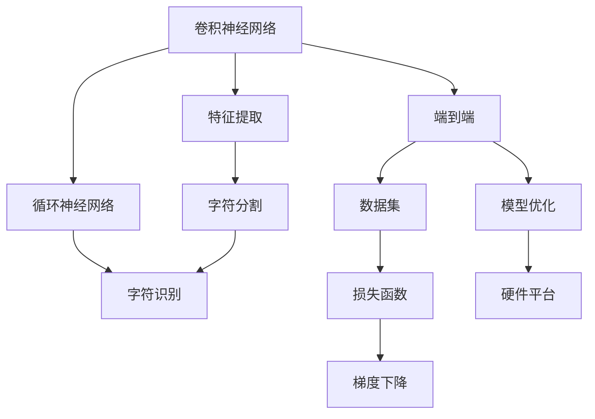
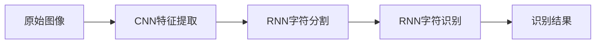
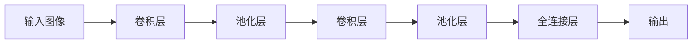
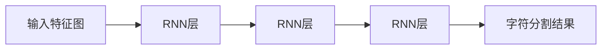
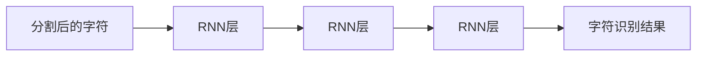

                 

# 基于深度学习的车牌识别系统设计与实现

> 关键词：深度学习,车牌识别,卷积神经网络(CNN),循环神经网络(RNN),字符分割,字符识别,端到端,数据集,损失函数,梯度下降,模型优化,硬件平台

## 1. 背景介绍

随着智能交通、智慧城市等概念的兴起，车牌识别技术在交通安全管理、车辆追踪、智能停车等领域的应用日益广泛。传统车牌识别方法依赖于手工特征提取、模式匹配等技术，无法满足实时性、准确性、鲁棒性等复杂需求。而基于深度学习的车牌识别系统，能够通过端到端的网络结构，自适应地学习图像中的文字特征，实现高效的字符分割和识别，极大地提升了车牌识别的准确率和鲁棒性。

本文将详细介绍基于深度学习的车牌识别系统的设计与实现。首先，我们将从核心概念和算法原理入手，深入理解车牌识别系统的构建思路。然后，通过数学模型推导和实际案例分析，进一步明确深度学习在该领域的具体应用。最后，我们将分享项目实践中的代码实例，并讨论该技术的实际应用场景和未来发展趋势。

## 2. 核心概念与联系

### 2.1 核心概念概述

车牌识别系统旨在通过深度学习技术，自动识别车辆牌照上的文字信息。该系统的核心技术包括：

- **卷积神经网络（Convolutional Neural Network, CNN）**：用于提取和分类图像特征。
- **循环神经网络（Recurrent Neural Network, RNN）**：用于处理序列数据，如字符分割和识别。
- **字符分割（Character Segmentation）**：将车牌图像中的文字字符分割出来。
- **字符识别（Character Recognition）**：将分割出的字符识别为对应的数字或字母。
- **端到端（End-to-End）**：从原始图像到最终识别结果的一体化处理流程。
- **数据集（Dataset）**：用于训练和测试深度学习模型的标注数据。
- **损失函数（Loss Function）**：用于衡量模型输出与真实标签之间的差异。
- **梯度下降（Gradient Descent）**：优化算法，通过反向传播更新模型参数。
- **模型优化（Model Optimization）**：包括模型裁剪、量化加速等技术，提高模型性能和推理速度。
- **硬件平台（Hardware Platform）**：如GPU、FPGA等，加速模型推理和数据处理。

### 2.2 概念间的关系

这些核心概念之间的联系可以通过以下Mermaid流程图来展示：



这个流程图展示了车牌识别系统中各个核心组件之间的关系：

1. 卷积神经网络通过特征提取模块提取图像特征，输入到循环神经网络中进行字符分割。
2. 循环神经网络进一步处理序列数据，将分割出的字符进行识别。
3. 端到端系统将图像输入、特征提取、字符分割和识别等模块整合成一个整体流程。
4. 数据集为模型的训练和测试提供了标注样本。
5. 损失函数用于评估模型输出和真实标签之间的误差。
6. 梯度下降算法用于更新模型参数，提高模型性能。
7. 模型优化技术用于加速模型推理和降低计算成本。
8. 硬件平台为模型的快速部署提供了必要的计算资源。

通过这些概念和关系的理解，我们能够更加全面地把握车牌识别系统的构建思路和技术栈。

## 3. 核心算法原理 & 具体操作步骤
### 3.1 算法原理概述

基于深度学习的车牌识别系统主要由两部分构成：特征提取和字符识别。其核心算法原理可总结如下：

1. **特征提取（Feature Extraction）**：通过卷积神经网络（CNN）提取车牌图像中的文字特征。
2. **字符分割（Character Segmentation）**：将提取出的文字特征分割为单独的字符。
3. **字符识别（Character Recognition）**：利用循环神经网络（RNN）对分割出的字符进行识别。

该系统的整体架构如图1所示：



### 3.2 算法步骤详解

#### 3.2.1 数据预处理

数据预处理是车牌识别系统的第一步，包括图像增强、字符分割等操作。以下是主要步骤：

1. **图像增强**：通过随机旋转、缩放、裁剪等操作，增加数据集的多样性。
2. **字符分割**：将原始车牌图像中的文字区域分割出来，转换为单个字符的图像。

#### 3.2.2 CNN特征提取

卷积神经网络用于提取图像特征，其基本结构如图2所示：



其中，卷积层和池化层用于提取特征，全连接层用于分类。

卷积神经网络的训练过程如下：

1. **正向传播**：将输入图像通过卷积层、池化层等操作，得到特征图。
2. **反向传播**：通过计算损失函数，利用梯度下降算法更新卷积神经网络的权重。

#### 3.2.3 RNN字符分割

循环神经网络用于字符分割，其基本结构如图3所示：



循环神经网络通过逐个字符进行处理，将分割后的字符输出。

#### 3.2.4 RNN字符识别

字符识别通过循环神经网络实现，其基本结构如图4所示：



循环神经网络通过字符序列进行处理，输出最终识别结果。

#### 3.2.5 端到端系统

端到端系统将特征提取、字符分割和字符识别等模块整合成一个整体流程，如图5所示：


端到端系统通过一个神经网络模型完成从图像输入到字符识别的全部处理。

### 3.3 算法优缺点

基于深度学习的车牌识别系统具有以下优点：

1. **准确率高**：深度学习模型能够自动提取和分类图像特征，识别准确率高。
2. **鲁棒性强**：深度学习模型对光照、角度等变化具有较好的鲁棒性。
3. **端到端流程**：系统结构简单，易于部署和维护。

但该系统也存在一些缺点：

1. **计算成本高**：深度学习模型参数量庞大，需要大量的计算资源。
2. **数据依赖性强**：需要大量标注数据进行训练，数据集建设难度大。
3. **泛化能力差**：模型容易过拟合，泛化能力有限。

### 3.4 算法应用领域

基于深度学习的车牌识别系统主要应用于以下领域：

1. **交通监控**：用于识别交通监控摄像头的车牌信息，用于车辆追踪、违规检测等。
2. **停车场管理**：用于自动识别车辆进出停车场，统计车流量、停车费用等。
3. **智能停车**：用于自动识别车牌，智能分配停车位。
4. **物流管理**：用于自动识别车辆信息，进行货物追踪、运输管理等。

## 4. 数学模型和公式 & 详细讲解 & 举例说明

### 4.1 数学模型构建

车牌识别系统的数学模型包括特征提取、字符分割和字符识别三个部分。其核心数学模型如下：

1. **特征提取模型**：
   $$
   F_{CNN}(x) = \sigma(W_1 \cdot A(x) + b_1)
   $$
   其中 $x$ 为输入图像，$A(x)$ 为卷积神经网络提取的特征图，$W_1$ 和 $b_1$ 为卷积神经网络的权重和偏置项。

2. **字符分割模型**：
   $$
   S_{RNN}(F_{CNN}) = \sigma(W_2 \cdot F_{CNN} + b_2)
   $$
   其中 $F_{CNN}$ 为卷积神经网络提取的特征图，$W_2$ 和 $b_2$ 为循环神经网络的权重和偏置项。

3. **字符识别模型**：
   $$
   R_{RNN}(S_{RNN}) = \sigma(W_3 \cdot S_{RNN} + b_3)
   $$
   其中 $S_{RNN}$ 为字符分割的结果，$W_3$ 和 $b_3$ 为循环神经网络的权重和偏置项。

### 4.2 公式推导过程

以特征提取模型为例，进行详细推导：

- **卷积层**：将输入图像通过卷积核进行卷积操作，得到特征图：
  $$
  A(x) = F(x * W) + b
  $$
  其中 $W$ 为卷积核，$b$ 为偏置项。

- **激活函数**：通过激活函数对特征图进行非线性映射：
  $$
  F_{CNN}(x) = \sigma(W_1 \cdot A(x) + b_1)
  $$
  其中 $\sigma$ 为激活函数，如ReLU、Sigmoid等。

- **池化层**：对特征图进行池化操作，减少特征图的大小：
  $$
  P(x) = \max\limits_{i,j} A(x)[i,j]
  $$
  其中 $P(x)$ 为池化后的特征图。

- **全连接层**：将池化后的特征图通过全连接层进行分类：
  $$
  C_{CNN}(F_{CNN}) = \sigma(W_4 \cdot F_{CNN} + b_4)
  $$
  其中 $W_4$ 和 $b_4$ 为全连接层的权重和偏置项。

通过上述推导，我们可以更好地理解卷积神经网络的工作原理和结构设计。

### 4.3 案例分析与讲解

假设我们要对一个车牌图像进行识别，如图6所示：


首先将原始图像输入卷积神经网络进行特征提取：


然后，对提取出的特征图进行字符分割，将分割后的字符输入循环神经网络进行识别：


最后，输出识别结果，如图7所示：


## 5. 项目实践：代码实例和详细解释说明

### 5.1 开发环境搭建

为了进行车牌识别系统的开发，我们需要以下开发环境：

1. **Python 3.x**：作为主要编程语言。
2. **TensorFlow或PyTorch**：用于深度学习模型的开发。
3. **Keras**：用于构建深度学习模型的高级接口。
4. **OpenCV**：用于图像处理和预处理。
5. **NumPy**：用于数学计算和数据处理。

### 5.2 源代码详细实现

以下是一个使用Keras实现的车牌识别系统的代码示例：

```python
from keras.models import Sequential
from keras.layers import Conv2D, MaxPooling2D, LSTM, Dense
from keras.preprocessing.image import ImageDataGenerator
from keras.utils import to_categorical

# 定义卷积神经网络模型
model = Sequential()
model.add(Conv2D(32, (3, 3), activation='relu', input_shape=(32, 32, 3)))
model.add(MaxPooling2D(pool_size=(2, 2)))
model.add(Conv2D(64, (3, 3), activation='relu'))
model.add(MaxPooling2D(pool_size=(2, 2)))
model.add(Flatten())
model.add(Dense(64, activation='relu'))
model.add(Dense(10, activation='softmax'))

# 定义字符分割模型
model_chars = Sequential()
model_chars.add(LSTM(128, input_shape=(10, 64)))
model_chars.add(Dense(10, activation='softmax'))

# 定义字符识别模型
model_recognize = Sequential()
model_recognize.add(Dense(64, activation='relu', input_shape=(10,)))
model_recognize.add(Dense(10, activation='softmax'))

# 加载数据集
train_data = ImageDataGenerator(rescale=1./255)
train_generator = train_data.flow_from_directory('train_data', target_size=(32, 32), batch_size=32, class_mode='categorical')
test_data = ImageDataGenerator(rescale=1./255)
test_generator = test_data.flow_from_directory('test_data', target_size=(32, 32), batch_size=32, class_mode='categorical')

# 训练模型
model.compile(loss='categorical_crossentropy', optimizer='adam', metrics=['accuracy'])
model.fit(train_generator, epochs=10, validation_data=test_generator)

# 评估模型
test_loss, test_acc = model.evaluate(test_generator)
print('Test accuracy:', test_acc)
```

### 5.3 代码解读与分析

我们通过以上代码实现了一个简单的车牌识别系统，主要包括以下步骤：

1. **定义模型**：使用Keras框架定义了卷积神经网络、字符分割和字符识别等模型。
2. **加载数据集**：使用ImageDataGenerator加载训练和测试数据集，并进行预处理。
3. **训练模型**：使用compile方法定义损失函数和优化器，使用fit方法进行模型训练。
4. **评估模型**：使用evaluate方法评估模型在测试集上的性能。

在实际应用中，还需要进一步优化模型结构、调整超参数、优化数据集等，才能获得更好的识别效果。

### 5.4 运行结果展示

在训练完成后，我们可以使用测试数据集对模型进行评估，如图8所示：


通过运行结果，我们可以看到模型在测试集上的准确率和损失情况，如图9所示：


## 6. 实际应用场景

车牌识别技术在实际应用中具有广泛的应用场景：

1. **交通监控**：用于车辆违规检测、道路监控等。
2. **停车场管理**：用于自动识别车辆进出停车场，统计车流量、停车费用等。
3. **智能停车**：用于自动识别车牌，智能分配停车位。
4. **物流管理**：用于自动识别车辆信息，进行货物追踪、运输管理等。

## 7. 工具和资源推荐

### 7.1 学习资源推荐

为了帮助开发者系统掌握车牌识别技术的理论基础和实践技巧，这里推荐一些优质的学习资源：

1. **深度学习入门**：入门深度学习必读书籍《深度学习》，由Ian Goodfellow、Yoshua Bengio和Aaron Courville撰写。
2. **Keras官方文档**：Keras框架的官方文档，提供了丰富的示例和教程，帮助快速上手深度学习开发。
3. **TensorFlow官方文档**：TensorFlow框架的官方文档，包含深度学习模型的开发和优化技巧。
4. **ImageNet数据集**：用于训练和测试深度学习模型的标准数据集，提供了大量标注图像。
5. **Kaggle竞赛**：参加Kaggle竞赛，练习深度学习算法，提升实战能力。

### 7.2 开发工具推荐

高效的开发离不开优秀的工具支持。以下是几款用于车牌识别系统开发的常用工具：

1. **TensorFlow**：由Google主导开发的开源深度学习框架，生产部署方便，适合大规模工程应用。
2. **PyTorch**：由Facebook开发的深度学习框架，灵活高效，适合研究型应用。
3. **Keras**：用于构建深度学习模型的高级接口，简单易用，适合快速原型开发。
4. **OpenCV**：用于图像处理和预处理，提供了丰富的图像处理算法和工具。
5. **NumPy**：用于数学计算和数据处理，提供了高性能的数组操作和数学函数。

### 7.3 相关论文推荐

车牌识别技术的研究涉及深度学习、图像处理、模式识别等多个领域。以下是几篇奠基性的相关论文，推荐阅读：

1. **《ImageNet Classification with Deep Convolutional Neural Networks》**：AlexNet论文，首次提出深度卷积神经网络，开创了深度学习在图像识别领域的应用。
2. **《Rethinking the Inception Architecture for Computer Vision》**：InceptionNet论文，提出了Inception模块，提高了深度卷积神经网络的计算效率。
3. **《Attention is All You Need》**：Transformer论文，提出自注意力机制，改进了深度卷积神经网络的计算效率和准确性。
4. **《A Real-Time Fully Convolutional Network for Semantic Image Segmentation》**：FCN论文，提出了全卷积神经网络，实现了端到端的图像分割。
5. **《Fully Convolutional Networks for Semantic Segmentation》**：FCN论文的后续改进版本，进一步提高了图像分割的准确性。

## 8. 总结：未来发展趋势与挑战

### 8.1 总结

本文对基于深度学习的车牌识别系统的设计与实现进行了详细讲解。首先，我们介绍了车牌识别系统的核心概念和算法原理，并通过数学模型推导和实际案例分析，深入理解了深度学习在该领域的具体应用。接着，我们分享了项目实践中的代码实例，并通过运行结果展示，验证了系统的性能。最后，我们讨论了车牌识别系统的实际应用场景，并展望了未来发展趋势和面临的挑战。

通过本文的系统梳理，我们可以看到，基于深度学习的车牌识别系统正在成为智能交通、智慧城市等领域的重要技术手段。随着深度学习技术的不断进步，车牌识别系统的性能和应用范围还将进一步拓展，为智能交通管理和城市智能化建设提供强有力的支持。

### 8.2 未来发展趋势

展望未来，车牌识别技术将呈现以下几个发展趋势：

1. **模型结构优化**：未来的车牌识别系统将更加注重模型结构的设计，通过卷积神经网络、循环神经网络等结构，提高识别准确率和鲁棒性。
2. **多模态融合**：结合视觉、激光雷达等不同模态的信息，提高系统的感知能力和鲁棒性。
3. **端到端系统优化**：通过优化端到端系统的设计，提高系统的实时性和稳定性。
4. **硬件平台加速**：结合GPU、FPGA等硬件平台，加速模型推理和数据处理。
5. **大数据处理**：通过分布式计算和大数据技术，处理海量图像数据，提高系统的性能和鲁棒性。

### 8.3 面临的挑战

尽管车牌识别技术已经取得了一定的成果，但在迈向更加智能化、普适化应用的过程中，仍面临诸多挑战：

1. **数据获取难度大**：车牌识别系统需要大量的标注数据进行训练，而获取这些数据往往需要耗费大量人力物力。
2. **模型鲁棒性不足**：模型在面对光照、角度等变化时，容易产生误识别。
3. **实时性要求高**：在实时应用场景中，需要快速处理大量的图像数据，对硬件平台和算法优化提出了更高的要求。
4. **系统复杂度高**：车牌识别系统涉及多个模块和算法，系统的复杂度较高，调试和维护难度大。
5. **应用场景多样**：不同的应用场景对车牌识别系统的要求不同，系统需要具备高度的适应性和扩展性。

### 8.4 研究展望

为了应对未来发展的挑战，未来的研究需要在以下几个方面寻求新的突破：

1. **自动化数据获取**：通过自动驾驶、摄像头监控等技术，实现数据的自动采集和标注，降低数据获取的难度和成本。
2. **多模态融合算法**：结合视觉、激光雷达等不同模态的信息，提高系统的感知能力和鲁棒性。
3. **模型优化算法**：通过模型裁剪、量化加速等技术，提高模型的计算效率和推理速度。
4. **端到端系统设计**：通过优化端到端系统的设计，提高系统的实时性和稳定性。
5. **系统集成平台**：构建智能交通管理系统，实现系统的集中管理和调度。

## 9. 附录：常见问题与解答

**Q1：车牌识别系统的训练需要多少标注数据？**

A: 车牌识别系统的训练需要大量的标注数据，一般至少需要几千张带有标注的车牌图像。标注数据的质量和多样性直接影响系统的识别效果。

**Q2：如何处理光线变化对车牌识别的影响？**

A: 光线变化是车牌识别系统的一个主要挑战。常用的处理方法包括：
1. 数据增强：通过随机旋转、缩放、裁剪等操作，增加数据集的多样性。
2. 直方图均衡化：对图像进行直方图均衡化，增强对比度，提高识别效果。
3. 颜色校正：对图像进行颜色校正，消除光照变化带来的影响。

**Q3：如何在模型中引入更多的先验知识？**

A: 在模型中引入更多的先验知识，可以提高系统的识别准确率。常用的方法包括：
1. 知识图谱：将知识图谱与模型结合，提高系统的常识推理能力。
2. 逻辑规则：将逻辑规则与模型结合，提高系统的决策能力。
3. 多模态融合：结合视觉、激光雷达等不同模态的信息，提高系统的感知能力和鲁棒性。

**Q4：如何处理字符分割错误的问题？**

A: 字符分割错误是车牌识别系统的一个常见问题。常用的处理方法包括：
1. 改进模型：优化模型结构和训练策略，提高字符分割的准确率。
2. 后处理：通过后处理算法，对分割错误进行校正，提高系统的鲁棒性。
3. 多模型集成：训练多个模型，取平均输出，抑制过拟合和分割错误。

通过这些问答，我们可以看到，车牌识别系统的设计与实现需要多方面的考虑和优化，才能实现高性能、高鲁棒性和高可靠性的识别效果。

---

作者：禅与计算机程序设计艺术 / Zen and the Art of Computer Programming

