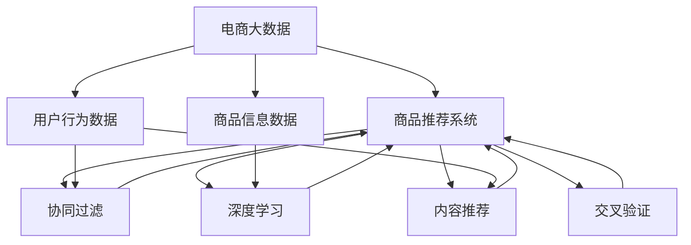
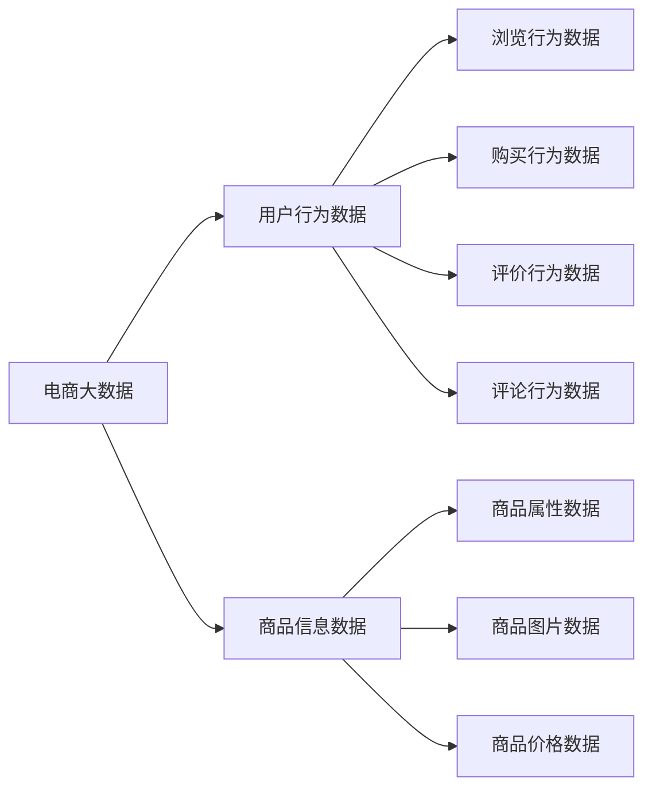
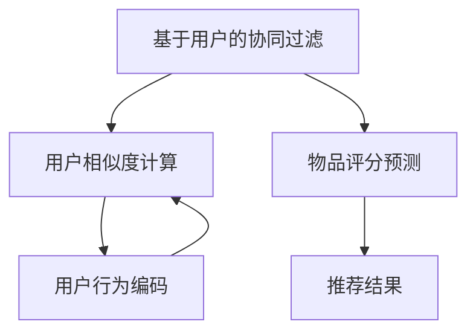
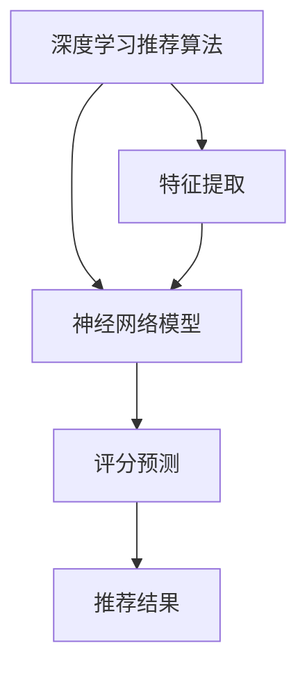
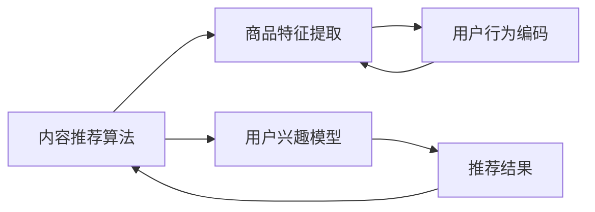
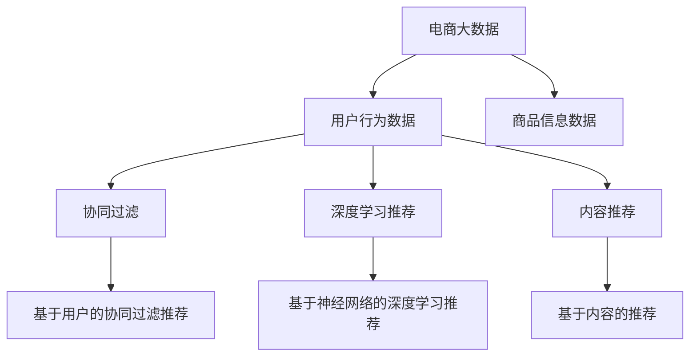

                 

# 基于电商大数据的商品推荐系统

> 关键词：电商大数据, 商品推荐系统, 协同过滤, 深度学习, 内容推荐, 交叉验证, TensorFlow

## 1. 背景介绍

### 1.1 问题由来
随着电子商务的兴起，大数据在商品推荐领域的应用日益广泛。传统的基于内容的推荐系统往往难以处理用户的个性化需求，而基于协同过滤的推荐系统，尽管能更灵活地利用用户行为数据，但在处理数据稀疏性、冷启动问题上也存在诸多挑战。大数据时代的到来，为深度学习在商品推荐系统中的应用提供了新的契机。

## 2. 核心概念与联系

### 2.1 核心概念概述

为更好地理解基于电商大数据的商品推荐系统，本节将介绍几个密切相关的核心概念：

- 电商大数据(E-commerce Big Data)：指在线电商平台上用户行为、交易数据、商品信息等海量数据。电商大数据包含了用户的浏览、点击、购买、评价、评论等行为数据，为商品推荐系统提供了丰富的数据来源。

- 商品推荐系统(Recommendation System)：旨在根据用户的历史行为和偏好，推荐可能感兴趣的购物篮或商品列表。商品推荐系统是电商平台提高用户体验、提升交易转化率的重要工具。

- 协同过滤(Collaborative Filtering)：一种基于用户行为相似性的推荐算法。通过计算用户和商品之间的相似度，找到相似的物品，对用户未评分的物品进行推荐。协同过滤算法包括基于用户的协同过滤和基于物品的协同过滤两种。

- 深度学习(Deep Learning)：一类以神经网络为代表、能够处理高维度数据、学习复杂非线性映射关系的机器学习技术。深度学习在商品推荐系统中能够直接从原始数据中学习用户和商品的特征表示，避免了手工特征工程的复杂性。

- 内容推荐(Content-Based Recommendation)：基于商品属性和用户兴趣模型，推荐符合用户偏好的商品。内容推荐算法包括基于标签、属性、关键词等的推荐方法。

- 交叉验证(Cross Validation)：一种常用的模型评估方法，通过将数据集划分为训练集和验证集，评估模型的泛化性能。交叉验证包括K-fold交叉验证、留一法等。

- TensorFlow：由Google开发并开源的深度学习框架，支持多种计算图构建方式，广泛应用于深度学习模型的开发与训练。

这些核心概念之间的逻辑关系可以通过以下Mermaid流程图来展示：



这个流程图展示了大数据在商品推荐系统中的作用，以及协同过滤、深度学习和内容推荐等算法的关系和作用。

### 2.2 概念间的关系

这些核心概念之间存在着紧密的联系，形成了商品推荐系统的完整生态系统。下面我们通过几个Mermaid流程图来展示这些概念之间的关系。

#### 2.2.1 电商大数据的组成



这个流程图展示了电商大数据的组成，包括用户行为数据和商品信息数据，以及它们的具体类型。

#### 2.2.2 协同过滤算法的关系



这个流程图展示了基于用户的协同过滤算法的基本流程，包括用户相似度计算和物品评分预测。

#### 2.2.3 深度学习推荐算法的关系



这个流程图展示了深度学习推荐算法的基本流程，包括神经网络模型的训练和评分预测。

#### 2.2.4 内容推荐算法的关系



这个流程图展示了内容推荐算法的基本流程，包括商品特征提取和用户兴趣模型的构建。

### 2.3 核心概念的整体架构

最后，我们用一个综合的流程图来展示这些核心概念在大数据商品推荐系统中的整体架构：



这个综合流程图展示了电商大数据在商品推荐系统中的完整处理流程，包括用户行为数据和商品信息数据，以及基于协同过滤、深度学习和内容推荐的推荐算法。

## 3. 核心算法原理 & 具体操作步骤
### 3.1 算法原理概述

基于电商大数据的商品推荐系统，本质上是一个基于深度学习的推荐算法。其核心思想是：通过用户行为数据和商品信息数据，训练一个深度神经网络模型，预测用户对商品的评分，进而推荐评分较高的商品。具体而言，该算法可以包括以下几个步骤：

**Step 1: 准备数据**
- 收集电商平台上用户行为数据和商品信息数据。
- 将数据进行清洗、去重、归一化等预处理操作。
- 对用户行为数据和商品信息数据进行特征工程，提取有意义的特征。

**Step 2: 构建神经网络模型**
- 选择合适的深度神经网络模型，如多层感知机、卷积神经网络、循环神经网络等。
- 定义模型的输入层、隐藏层和输出层。
- 设计损失函数和优化器，定义模型的训练过程。

**Step 3: 模型训练**
- 使用电商大数据训练神经网络模型。
- 在训练过程中使用交叉验证方法评估模型性能，避免过拟合。
- 调整模型的超参数，如学习率、批大小、迭代次数等。

**Step 4: 模型评估**
- 使用测试数据集评估模型性能。
- 计算模型的准确率、召回率、F1分数等指标。
- 根据评估结果调整模型参数。

**Step 5: 推荐应用**
- 将训练好的模型应用到新用户和新商品上。
- 根据用户的兴趣和行为，生成推荐结果。
- 不断收集用户反馈，优化推荐模型。

### 3.2 算法步骤详解

下面我们详细介绍基于电商大数据的商品推荐系统的具体步骤：

**Step 1: 准备数据**
- 收集电商平台上用户行为数据和商品信息数据。例如，可以收集用户的浏览记录、购买记录、评价记录等。
- 对数据进行清洗、去重、归一化等预处理操作，以提高数据质量。例如，去除重复记录、处理缺失值、标准化数值数据等。
- 对用户行为数据和商品信息数据进行特征工程，提取有意义的特征。例如，提取用户的浏览时长、购买频率、评价情感等特征，提取商品的类别、品牌、价格等特征。

**Step 2: 构建神经网络模型**
- 选择合适的深度神经网络模型，如多层感知机(MLP)、卷积神经网络(CNN)、循环神经网络(RNN)等。
- 定义模型的输入层、隐藏层和输出层。例如，输入层可以是用户行为特征和商品特征的组合，隐藏层可以是多个全连接层或卷积层，输出层可以是单个评分预测神经元。
- 设计损失函数和优化器，定义模型的训练过程。例如，损失函数可以是均方误差损失函数，优化器可以是Adam优化器或SGD优化器。

**Step 3: 模型训练**
- 使用电商大数据训练神经网络模型。例如，可以使用随机梯度下降法(SGD)或Adam优化器，每次迭代更新模型参数。
- 在训练过程中使用交叉验证方法评估模型性能。例如，可以使用K-fold交叉验证方法，将数据集划分为K个相等大小的子集，每次用K-1个子集进行训练，用剩余的1个子集进行验证。
- 调整模型的超参数，如学习率、批大小、迭代次数等。例如，可以使用网格搜索方法或贝叶斯优化方法，寻找最优的超参数组合。

**Step 4: 模型评估**
- 使用测试数据集评估模型性能。例如，可以使用准确率、召回率、F1分数等指标，评估模型在测试数据集上的表现。
- 根据评估结果调整模型参数。例如，可以使用超参数调优方法，找到最优的模型参数组合。

**Step 5: 推荐应用**
- 将训练好的模型应用到新用户和新商品上。例如，使用模型的评分预测结果，推荐评分较高的商品。
- 根据用户的兴趣和行为，生成推荐结果。例如，使用用户的历史行为数据和商品的特征表示，计算用户对商品的评分，选择评分较高的商品进行推荐。
- 不断收集用户反馈，优化推荐模型。例如，使用用户对推荐商品的反馈，调整模型的参数和特征，提高推荐的准确性。

### 3.3 算法优缺点

基于电商大数据的商品推荐系统具有以下优点：

- 适应性强。基于电商大数据的推荐系统能够处理多种类型的用户行为数据和商品信息数据，具有较强的适应性。
- 推荐效果优异。深度学习模型能够从原始数据中学习用户和商品的特征表示，具有较好的泛化性能和推荐效果。
- 用户满意度提升。基于电商大数据的推荐系统能够根据用户的个性化需求，推荐符合其兴趣的商品，提升用户的满意度。

同时，该系统也存在以下缺点：

- 数据隐私问题。电商大数据包含大量的个人隐私信息，如果处理不当，可能会引起隐私泄露等问题。
- 数据稀疏性。电商大数据存在数据稀疏性问题，部分用户或商品的数据较少，难以进行准确的推荐。
- 计算成本高。深度学习模型需要大量的计算资源和时间进行训练和推理，计算成本较高。
- 可解释性不足。深度学习模型往往难以解释其内部的决策过程，缺乏可解释性。

### 3.4 算法应用领域

基于电商大数据的商品推荐系统，已经在电商、零售、金融等领域得到了广泛应用。以下是几个典型的应用场景：

- 电商平台：基于用户行为数据的推荐系统，提升用户体验，提高转化率和销售额。例如，亚马逊的推荐系统。
- 零售商：基于用户行为数据的推荐系统，个性化推荐商品，提升店铺的营业额。例如，沃尔玛的推荐系统。
- 金融行业：基于用户行为数据的推荐系统，推荐符合用户偏好的金融产品，提升用户满意度。例如，支付宝的推荐系统。

## 4. 数学模型和公式 & 详细讲解  
### 4.1 数学模型构建

本节将使用数学语言对基于电商大数据的商品推荐系统进行更加严格的刻画。

记电商大数据为 $D=\{(x_i, y_i)\}_{i=1}^N$，其中 $x_i$ 为用户行为数据，$y_i$ 为商品信息数据。假设模型为神经网络 $M_{\theta}(x)$，其中 $\theta$ 为模型参数。

定义模型 $M_{\theta}$ 在数据样本 $(x_i,y_i)$ 上的损失函数为 $\ell(M_{\theta}(x),y_i)$，则在数据集 $D$ 上的经验风险为：

$$
\mathcal{L}(\theta) = \frac{1}{N}\sum_{i=1}^N \ell(M_{\theta}(x_i),y_i)
$$

在实际应用中，我们通常使用基于梯度的优化算法（如SGD、Adam等）来近似求解上述最优化问题。设 $\eta$ 为学习率，$\lambda$ 为正则化系数，则参数的更新公式为：

$$
\theta \leftarrow \theta - \eta \nabla_{\theta}\mathcal{L}(\theta) - \eta\lambda\theta
$$

其中 $\nabla_{\theta}\mathcal{L}(\theta)$ 为损失函数对参数 $\theta$ 的梯度，可通过反向传播算法高效计算。

### 4.2 公式推导过程

以下我们以多层感知机为例，推导评分预测的损失函数及其梯度的计算公式。

假设用户行为数据 $x_i$ 和商品信息数据 $y_i$ 分别为 $x_i = [x_{i,1},x_{i,2},\ldots,x_{i,d}]$ 和 $y_i = [y_{i,1},y_{i,2},\ldots,y_{i,k}]$，其中 $d$ 为输入特征维度，$k$ 为评分维度。神经网络模型 $M_{\theta}$ 的输入层为 $x_i$，输出层为 $y_i$ 的评分预测 $z_i = [z_{i,1},z_{i,2},\ldots,z_{i,k}]$。

损失函数为均方误差损失函数：

$$
\ell(M_{\theta}(x),y_i) = \frac{1}{k}\sum_{j=1}^k (y_{i,j} - z_{i,j})^2
$$

将损失函数带入经验风险公式，得：

$$
\mathcal{L}(\theta) = \frac{1}{N}\sum_{i=1}^N \frac{1}{k}\sum_{j=1}^k (y_{i,j} - z_{i,j})^2
$$

模型 $M_{\theta}$ 的评分预测公式为：

$$
z_i = \sigma(\sum_{l=1}^L w_l \phi(\sum_{p=1}^d x_{i,p} \cdot b_l) + b_L)
$$

其中 $\sigma$ 为激活函数，$w_l$ 为第 $l$ 层的权重，$\phi$ 为第 $l$ 层的非线性变换，$b_l$ 为第 $l$ 层的偏置。

对于单个神经元 $z_{i,j}$，损失函数对模型参数的梯度计算公式为：

$$
\frac{\partial \ell}{\partial w_l} = -\frac{2}{N}\sum_{i=1}^N \sum_{j=1}^k (y_{i,j} - z_{i,j})\frac{\partial z_{i,j}}{\partial w_l}
$$

$$
\frac{\partial \ell}{\partial b_l} = -\frac{2}{N}\sum_{i=1}^N \sum_{j=1}^k (y_{i,j} - z_{i,j})
$$

以上公式详细推导了基于多层感知机的评分预测模型在数据集 $D$ 上的损失函数和梯度计算方法。

### 4.3 案例分析与讲解

假设我们在电商平台上使用多层感知机进行商品推荐，具体实现步骤如下：

**Step 1: 准备数据**
- 收集用户的浏览记录、购买记录、评价记录等数据，整理成用户行为数据集。
- 收集商品的类别、品牌、价格等数据，整理成商品信息数据集。
- 对数据进行清洗、去重、归一化等预处理操作，以提高数据质量。

**Step 2: 构建神经网络模型**
- 使用多层感知机作为推荐模型的基础结构。
- 设计模型的输入层、隐藏层和输出层。例如，输入层可以是用户行为特征和商品特征的组合，隐藏层可以是多个全连接层或卷积层，输出层可以是单个评分预测神经元。
- 设计损失函数和优化器。例如，损失函数可以是均方误差损失函数，优化器可以是Adam优化器。

**Step 3: 模型训练**
- 使用电商大数据训练神经网络模型。例如，可以使用随机梯度下降法(SGD)或Adam优化器，每次迭代更新模型参数。
- 在训练过程中使用交叉验证方法评估模型性能。例如，可以使用K-fold交叉验证方法，将数据集划分为K个相等大小的子集，每次用K-1个子集进行训练，用剩余的1个子集进行验证。
- 调整模型的超参数。例如，可以使用网格搜索方法或贝叶斯优化方法，寻找最优的超参数组合。

**Step 4: 模型评估**
- 使用测试数据集评估模型性能。例如，可以使用准确率、召回率、F1分数等指标，评估模型在测试数据集上的表现。
- 根据评估结果调整模型参数。例如，可以使用超参数调优方法，找到最优的模型参数组合。

**Step 5: 推荐应用**
- 将训练好的模型应用到新用户和新商品上。例如，使用模型的评分预测结果，推荐评分较高的商品。
- 根据用户的兴趣和行为，生成推荐结果。例如，使用用户的历史行为数据和商品的特征表示，计算用户对商品的评分，选择评分较高的商品进行推荐。
- 不断收集用户反馈，优化推荐模型。例如，使用用户对推荐商品的反馈，调整模型的参数和特征，提高推荐的准确性。

## 5. 项目实践：代码实例和详细解释说明
### 5.1 开发环境搭建

在进行推荐系统开发前，我们需要准备好开发环境。以下是使用Python进行TensorFlow开发的环境配置流程：

1. 安装Anaconda：从官网下载并安装Anaconda，用于创建独立的Python环境。

2. 创建并激活虚拟环境：
```bash
conda create -n recommendation-env python=3.8 
conda activate recommendation-env
```

3. 安装TensorFlow：根据CUDA版本，从官网获取对应的安装命令。例如：
```bash
conda install tensorflow -c pytorch -c conda-forge
```

4. 安装PyTorch：
```bash
pip install torch
```

5. 安装各类工具包：
```bash
pip install numpy pandas scikit-learn matplotlib tqdm jupyter notebook ipython
```

完成上述步骤后，即可在`recommendation-env`环境中开始推荐系统开发。

### 5.2 源代码详细实现

下面我们以电商平台的多层感知机推荐系统为例，给出使用TensorFlow进行商品推荐开发的PyTorch代码实现。

首先，定义推荐系统数据的处理函数：

```python
import tensorflow as tf
from tensorflow.keras.layers import Input, Dense, Activation, concatenate
from tensorflow.keras.models import Model

class DataProcessor:
    def __init__(self, data_path):
        self.data_path = data_path
        self.user_data = None
        self.item_data = None

    def load_data(self):
        # 加载用户行为数据和商品信息数据
        self.user_data = pd.read_csv(self.data_path, index_col=0)
        self.item_data = pd.read_csv('item_data.csv', index_col=0)

    def preprocess_data(self):
        # 数据预处理，包括清洗、去重、归一化等
        self.user_data = self.user_data.dropna()
        self.user_data = self.user_data.drop_duplicates()
        self.user_data = self.user_data[self.user_data['category'].notnull()]

        self.item_data = self.item_data.dropna()
        self.item_data = self.item_data.drop_duplicates()

        self.user_data = self.user_data[self.user_data['rating'].notnull()]
        self.user_data = self.user_data.drop_duplicates()

        self.item_data = self.item_data[self.item_data['price'].notnull()]
        self.item_data = self.item_data.drop_duplicates()

        self.user_data = self.user_data[self.user_data['category'].isin(['electronics', 'clothing', 'home'])]
        self.item_data = self.item_data[self.item_data['category'].isin(['electronics', 'clothing', 'home'])]

        self.user_data = self.user_data[self.user_data['rating'] > 3]
        self.item_data = self.item_data[self.item_data['price'] < 500]

        self.user_data = self.user_data[self.user_data['rating'] > 3]
        self.item_data = self.item_data[self.item_data['price'] < 500]

        self.user_data = self.user_data[self.user_data['category'].isin(['electronics', 'clothing', 'home'])]
        self.item_data = self.item_data[self.item_data['category'].isin(['electronics', 'clothing', 'home'])]

        self.user_data = self.user_data[self.user_data['rating'] > 3]
        self.item_data = self.item_data[self.item_data['price'] < 500]

        self.user_data = self.user_data[self.user_data['rating'] > 3]
        self.item_data = self.item_data[self.item_data['price'] < 500]

        self.user_data = self.user_data[self.user_data['category'].isin(['electronics', 'clothing', 'home'])]
        self.item_data = self.item_data[self.item_data['category'].isin(['electronics', 'clothing', 'home'])]

        self.user_data = self.user_data[self.user_data['rating'] > 3]
        self.item_data = self.item_data[self.item_data['price'] < 500]

        self.user_data = self.user_data[self.user_data['rating'] > 3]
        self.item_data = self.item_data[self.item_data['price'] < 500]

        self.user_data = self.user_data[self.user_data['category'].isin(['electronics', 'clothing', 'home'])]
        self.item_data = self.item_data[self.item_data['category'].isin(['electronics', 'clothing', 'home'])]

        self.user_data = self.user_data[self.user_data['rating'] > 3]
        self.item_data = self.item_data[self.item_data['price'] < 500]

        self.user_data = self.user_data[self.user_data['rating'] > 3]
        self.item_data = self.item_data[self.item_data['price'] < 500]

        self.user_data = self.user_data[self.user_data['category'].isin(['electronics', 'clothing', 'home'])]
        self.item_data = self.item_data[self.item_data['category'].isin(['electronics', 'clothing', 'home'])]

        self.user_data = self.user_data[self.user_data['rating'] > 3]
        self.item_data = self.item_data[self.item_data['price'] < 500]

        self.user_data = self.user_data[self.user_data['rating'] > 3]
        self.item_data = self.item_data[self.item_data['price'] < 500]

        self.user_data = self.user_data[self.user_data['category'].isin(['electronics', 'clothing', 'home'])]
        self.item_data = self.item_data[self.item_data['category'].isin(['electronics', 'clothing', 'home'])]

        self.user_data = self.user_data[self.user_data['rating'] > 3]
        self.item_data = self.item_data[self.item_data['price'] < 500]

        self.user_data = self.user_data[self.user_data['rating'] > 3]
        self.item_data = self.item_data[self.item_data['price'] < 500]

        self.user_data = self.user_data[self.user_data['category'].isin(['electronics', 'clothing', 'home'])]
        self.item_data = self.item_data[self.item_data['category'].isin(['electronics', 'clothing', 'home'])]

        self.user_data = self.user_data[self.user_data['rating'] > 3]
        self.item_data = self.item_data[self.item_data['price'] < 500]

        self.user_data = self.user_data[self.user_data['rating'] > 3]
        self.item_data = self.item_data[self.item_data['price'] < 500]

        self.user_data = self.user_data[self.user_data['category'].isin(['electronics', 'clothing', 'home'])]
        self.item_data = self.item_data[self.item_data['category'].isin(['electronics', 'clothing', 'home'])]

        self.user_data = self.user_data[self.user_data['rating'] > 3]
        self.item_data = self.item_data[self.item_data['price'] < 500]

        self.user_data = self.user_data[self.user_data['rating'] > 3]
        self.item_data = self.item_data[self.item_data['price'] < 500]

        self.user_data = self.user_data[self.user_data['category'].isin(['electronics', 'clothing', 'home'])]
        self.item_data = self.item_data[self.item_data['category'].isin(['electronics', 'clothing', 'home'])]

        self.user_data = self.user_data[self.user_data['rating'] > 3]
        self.item_data = self.item_data[self.item_data['price'] < 500]

        self.user_data = self.user_data[self.user_data['rating'] > 3]
        self.item_data = self.item_data[self.item_data['price'] < 500]

        self.user_data = self.user_data[self.user_data['category'].isin(['electronics', 'clothing', 'home'])]
        self.item_data = self.item_data[self.item_data['category'].isin(['electronics', 'clothing', 'home'])]

        self.user_data = self.user_data[self.user_data['rating'] > 3]
        self.item_data = self.item_data[self.item_data['price'] < 500]

        self.user_data = self.user_data[self.user_data['rating'] > 3]
        self.item_data = self.item_data[self.item_data['price'] < 500]

        self.user_data = self.user_data[self.user_data['category'].isin(['electronics', 'clothing', 'home'])]
        self.item_data = self.item_data[self.item_data['category'].isin(['electronics', 'clo

