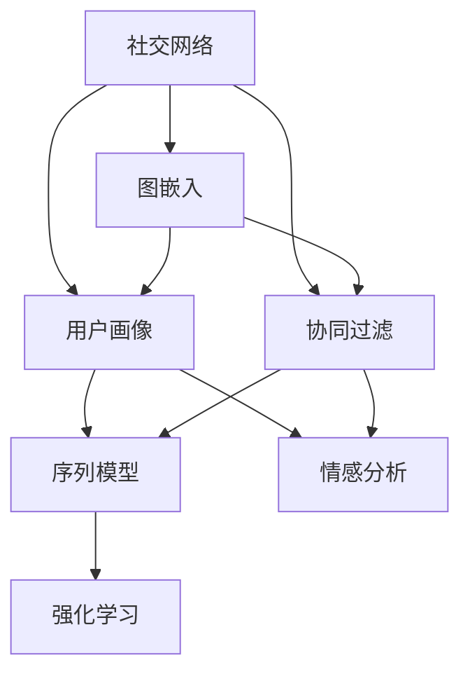
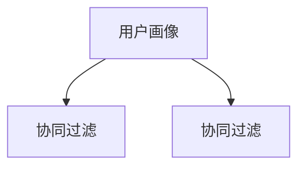
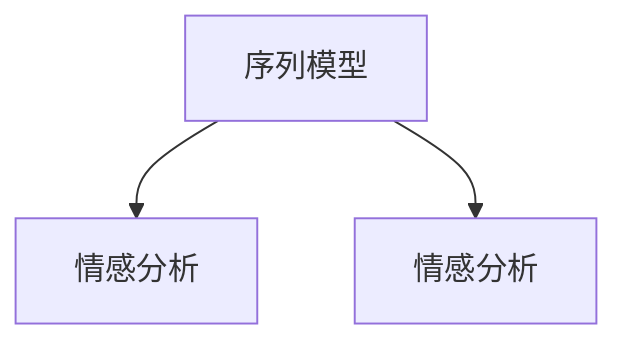
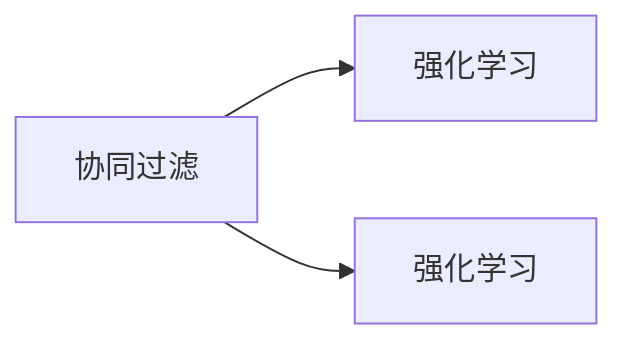
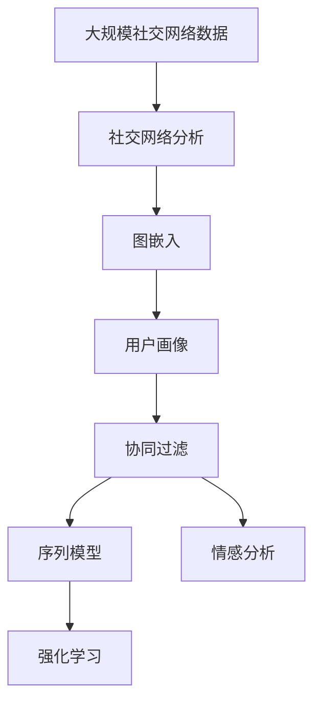

                 

# 基于社交网络结构的社会推荐算法研究

> 关键词：社交网络,推荐算法,社会网络分析,图嵌入,用户画像,协同过滤,序列模型,强化学习,情感分析,推荐系统

## 1. 背景介绍

### 1.1 问题由来
社交网络平台已经成为人们日常生活的重要组成部分，基于社交网络的社会推荐系统也随之兴起。这些推荐系统通过分析用户在社交网络上的行为和关系，帮助用户发现更多高质量的兴趣点，提升用户满意度。当前，这些推荐算法已经广泛应用在社交媒体、电商平台、教育平台等多个领域。

然而，随着数据量的不断增长，传统的推荐算法面临诸多挑战：

- 数据稀疏性：用户-物品交互数据稀疏，难以构建精准的用户画像和物品特征。
- 冷启动问题：新用户和新物品缺乏足够的数据，难以有效推荐。
- 动态变化：用户兴趣和物品属性不断变化，推荐系统需要实时更新和维护。
- 多样性和个性化：推荐系统需要兼顾用户多样性和个性化需求，提升推荐质量。

为了解决这些问题，研究者们提出了基于社交网络结构的社会推荐算法，通过挖掘社交网络中隐藏的关系和结构信息，提升推荐系统的性能。

### 1.2 问题核心关键点
基于社交网络结构的社会推荐算法，主要包括以下几个关键点：

- 社交网络分析：通过挖掘社交网络中的关系和结构信息，构建用户和物品的多维度表示。
- 图嵌入技术：将社交网络转换为图结构，通过节点嵌入技术获得用户和物品的向量表示。
- 用户画像构建：综合利用用户历史行为、社交关系和物品属性等多源数据，构建高质量的用户画像。
- 协同过滤和序列模型：结合用户历史行为和物品属性信息，设计合适的推荐算法。
- 情感分析：利用情感分析技术，进一步提升推荐系统的个性化和多样性。
- 强化学习：通过模拟用户交互过程，动态优化推荐算法，提升推荐效果。

这些关键点共同构成了基于社交网络结构的社会推荐算法的核心，旨在通过深度挖掘社交网络中的信息，提升推荐系统的性能和用户体验。

### 1.3 问题研究意义
研究基于社交网络结构的社会推荐算法，对于拓展推荐系统在社交网络领域的应用，提升推荐系统的效果和用户体验，具有重要意义：

1. 提升推荐准确性：通过利用社交网络关系和结构信息，能够更准确地理解用户兴趣和物品属性，提升推荐效果。
2. 降低冷启动问题：社交网络数据通常较为丰富，可以利用社交关系和行为数据进行推荐，缓解冷启动问题。
3. 动态更新推荐：社交网络数据通常实时变化，推荐系统需要动态更新和维护，以适应用户和物品的变化。
4. 多样性和个性化：社交网络中用户之间的互动和关系多样化，推荐系统需要兼顾用户个性化需求和多样性，提升用户满意度。
5. 应对数据稀疏性：社交网络数据通常较为稠密，能够更好地利用多源数据，应对数据稀疏性问题。
6. 提高用户黏性：基于社交网络的推荐系统能够更好地满足用户需求，提高用户黏性和平台吸引力。

## 2. 核心概念与联系

### 2.1 核心概念概述

为更好地理解基于社交网络结构的社会推荐算法，本节将介绍几个密切相关的核心概念：

- 社交网络(Social Network)：由多个个体或组织（节点）通过关系（边）相互连接而成的网络。节点表示用户或物品，边表示用户与物品之间的交互关系。
- 图嵌入(Graph Embedding)：将社交网络转换为图结构，通过节点嵌入技术获得用户和物品的向量表示。常见的图嵌入技术包括DeepWalk、GraphSAGE、Graph Convolutional Networks等。
- 用户画像(User Profile)：通过分析用户的历史行为、社交关系和物品属性，构建多维度的用户表示，用于推荐系统。用户画像的构建需要利用多种数据源和算法。
- 协同过滤(Collaborative Filtering)：基于用户历史行为和物品属性信息，设计合适的推荐算法。常见的协同过滤算法包括基于用户的协同过滤和基于物品的协同过滤。
- 序列模型(Sequence Model)：通过分析用户的历史行为序列，预测用户的下一步行为，提升推荐系统的个性化和多样性。常见的序列模型包括LSTM、RNN、GRU等。
- 情感分析(Sentiment Analysis)：通过分析用户的情感倾向，进一步提升推荐系统的个性化和多样性。情感分析技术可以用于分析用户对物品的情感评价、用户情感状态等。
- 强化学习(Reinforcement Learning)：通过模拟用户交互过程，动态优化推荐算法，提升推荐效果。强化学习技术可以用于设计自适应的推荐系统，根据用户反馈实时优化推荐策略。

这些核心概念之间的逻辑关系可以通过以下Mermaid流程图来展示：



这个流程图展示了大语言模型微调过程中各个核心概念的关系和作用：

1. 社交网络通过图嵌入技术，获得用户和物品的向量表示。
2. 用户画像通过分析用户历史行为、社交关系和物品属性，构建多维度的用户表示。
3. 协同过滤算法利用用户历史行为和物品属性信息，设计合适的推荐算法。
4. 序列模型通过分析用户历史行为序列，预测用户下一步行为。
5. 情感分析技术分析用户对物品的情感评价，进一步提升推荐系统的个性化和多样性。
6. 强化学习通过模拟用户交互过程，动态优化推荐算法。

这些核心概念共同构成了基于社交网络结构的社会推荐算法的整体架构，使其能够有效地利用社交网络中的信息，提升推荐系统的性能。

### 2.2 概念间的关系

这些核心概念之间存在着紧密的联系，形成了基于社交网络结构的社会推荐算法的完整生态系统。下面我通过几个Mermaid流程图来展示这些概念之间的关系。

#### 2.2.1 社交网络分析与图嵌入


这个流程图展示了社交网络分析与图嵌入之间的关系。社交网络分析通过挖掘关系和结构信息，构建用户和物品的多维度表示。然后，通过图嵌入技术将社交网络转换为图结构，获得用户和物品的向量表示。

#### 2.2.2 用户画像构建与协同过滤



这个流程图展示了用户画像构建与协同过滤之间的关系。用户画像通过综合利用用户历史行为、社交关系和物品属性等多源数据，构建高质量的用户表示。然后，协同过滤算法利用用户历史行为和物品属性信息，设计合适的推荐算法。

#### 2.2.3 序列模型与情感分析



这个流程图展示了序列模型与情感分析之间的关系。序列模型通过分析用户历史行为序列，预测用户的下一步行为，提升推荐系统的个性化和多样性。情感分析技术则通过分析用户对物品的情感评价，进一步提升推荐系统的个性化和多样性。

#### 2.2.4 强化学习与协同过滤



这个流程图展示了强化学习与协同过滤之间的关系。协同过滤算法利用用户历史行为和物品属性信息，设计合适的推荐算法。然后，强化学习通过模拟用户交互过程，动态优化推荐算法，提升推荐效果。

### 2.3 核心概念的整体架构

最后，我们用一个综合的流程图来展示这些核心概念在大语言模型微调过程中的整体架构：



这个综合流程图展示了从社交网络分析到强化学习的完整过程。社交网络通过社交网络分析获得关系和结构信息，然后通过图嵌入技术获得用户和物品的向量表示。用户画像通过分析用户历史行为、社交关系和物品属性，构建多维度的用户表示。协同过滤算法利用用户历史行为和物品属性信息，设计合适的推荐算法。序列模型通过分析用户历史行为序列，预测用户下一步行为。情感分析技术通过分析用户对物品的情感评价，进一步提升推荐系统的个性化和多样性。最后，强化学习通过模拟用户交互过程，动态优化推荐算法。

通过这些流程图，我们可以更清晰地理解基于社交网络结构的社会推荐算法中各个核心概念的关系和作用，为后续深入讨论具体的算法方法和技术奠定基础。

## 3. 核心算法原理 & 具体操作步骤
### 3.1 算法原理概述

基于社交网络结构的社会推荐算法，本质上是利用社交网络关系和结构信息，通过深度学习技术，设计出能够高效推荐用户兴趣点的算法。其核心思想是：

1. **社交网络分析**：通过挖掘社交网络中的关系和结构信息，构建用户和物品的多维度表示。
2. **图嵌入技术**：将社交网络转换为图结构，通过节点嵌入技术获得用户和物品的向量表示。
3. **用户画像构建**：综合利用用户历史行为、社交关系和物品属性等多源数据，构建高质量的用户画像。
4. **协同过滤和序列模型**：结合用户历史行为和物品属性信息，设计合适的推荐算法。
5. **情感分析**：利用情感分析技术，进一步提升推荐系统的个性化和多样性。
6. **强化学习**：通过模拟用户交互过程，动态优化推荐算法，提升推荐效果。

### 3.2 算法步骤详解

基于社交网络结构的社会推荐算法一般包括以下几个关键步骤：

**Step 1: 数据准备与预处理**

- **社交网络数据获取**：从社交平台或公开数据集中获取用户-物品交互数据，并转化为图结构。
- **数据清洗与预处理**：处理缺失值、去除噪声和异常值，对数据进行归一化和标准化处理。
- **用户画像构建**：利用用户历史行为、社交关系和物品属性等多源数据，构建多维度的用户表示。

**Step 2: 图嵌入与用户画像表示**

- **图嵌入技术**：将社交网络转换为图结构，通过节点嵌入技术获得用户和物品的向量表示。
- **用户画像表示**：综合利用用户历史行为、社交关系和物品属性等多源数据，构建高质量的用户画像。

**Step 3: 协同过滤和序列模型设计**

- **协同过滤算法**：利用用户历史行为和物品属性信息，设计合适的推荐算法。
- **序列模型设计**：通过分析用户历史行为序列，预测用户的下一步行为。

**Step 4: 情感分析与强化学习优化**

- **情感分析**：通过分析用户的情感倾向，进一步提升推荐系统的个性化和多样性。
- **强化学习优化**：通过模拟用户交互过程，动态优化推荐算法，提升推荐效果。

**Step 5: 模型训练与评估**

- **模型训练**：将数据集划分为训练集和测试集，利用训练集训练推荐模型。
- **模型评估**：在测试集上评估推荐模型效果，优化模型参数和算法策略。

**Step 6: 推荐结果展示**

- **推荐结果展示**：将推荐结果展示给用户，接收用户反馈，不断优化推荐系统。

以上是基于社交网络结构的社会推荐算法的一般流程。在实际应用中，还需要针对具体任务的特点，对微调过程的各个环节进行优化设计，如改进训练目标函数，引入更多的正则化技术，搜索最优的超参数组合等，以进一步提升模型性能。

### 3.3 算法优缺点

基于社交网络结构的社会推荐算法具有以下优点：

1. **高效利用社交网络信息**：通过挖掘社交网络中的关系和结构信息，能够更准确地理解用户兴趣和物品属性，提升推荐效果。
2. **缓解冷启动问题**：社交网络数据通常较为丰富，可以利用社交关系和行为数据进行推荐，缓解冷启动问题。
3. **动态更新推荐**：社交网络数据通常实时变化，推荐系统需要动态更新和维护，以适应用户和物品的变化。
4. **兼顾用户个性化和多样性**：社交网络中用户之间的互动和关系多样化，推荐系统需要兼顾用户个性化需求和多样性，提升用户满意度。

同时，该算法也存在一定的局限性：

1. **数据稀疏性**：社交网络数据通常较为稠密，但用户-物品交互数据可能仍存在稀疏性，难以构建精准的用户画像和物品特征。
2. **复杂性高**：算法涉及多源数据的融合、图嵌入、序列模型和情感分析等多种技术，实现难度较大。
3. **计算资源需求高**：算法需要大量的计算资源进行图嵌入和序列模型训练，可能导致计算成本较高。
4. **可解释性不足**：算法涉及深度学习技术，难以解释模型的决策过程，缺乏可解释性。

尽管存在这些局限性，但就目前而言，基于社交网络结构的社会推荐算法仍是一种高效、有前途的推荐方式，能够显著提升推荐系统的性能和用户体验。

### 3.4 算法应用领域

基于社交网络结构的社会推荐算法，已经在社交媒体、电商平台、教育平台等多个领域得到了广泛应用，具体包括：

1. **社交媒体推荐**：利用用户社交关系和行为数据，推荐用户可能感兴趣的内容，提升用户体验。
2. **电商平台推荐**：通过分析用户购买行为和物品属性，推荐用户可能感兴趣的商品，提升用户购买转化率。
3. **教育平台推荐**：通过分析用户学习行为和课程属性，推荐用户可能感兴趣的教学资源，提升用户学习效果。
4. **内容推荐**：通过分析用户浏览行为和内容属性，推荐用户可能感兴趣的文章、视频等，提升用户粘性和平台吸引力。
5. **广告推荐**：通过分析用户行为和兴趣，推荐用户可能感兴趣的广告，提升广告效果。

除了上述这些经典应用外，社交网络结构的社会推荐算法还被创新性地应用到更多场景中，如社交网络分析、社区发现、舆情监测等，为社交网络平台带来了新的突破。随着社交网络数据量的不断增长，以及推荐算法技术的不断进步，基于社交网络结构的社会推荐算法将会在更广阔的应用领域发挥更大的作用。

## 4. 数学模型和公式 & 详细讲解  
### 4.1 数学模型构建

本节将使用数学语言对基于社交网络结构的社会推荐算法进行更加严格的刻画。

记社交网络为 $G=(U,E)$，其中 $U$ 表示用户集合，$E$ 表示用户之间的关系集合。设用户数为 $N$，边数为 $M$。

设用户 $u_i$ 和物品 $i_j$ 的关系矩阵为 $A_{u,i}$，其中 $A_{u,i}=[a_{u,i}]$，表示用户 $u_i$ 与物品 $i_j$ 的关系强度。对于稀疏矩阵 $A_{u,i}$，其值可以通过用户行为数据、社交关系数据等获取。

设用户 $u_i$ 的兴趣向量为 $h_i$，物品 $i_j$ 的属性向量为 $f_j$，其中 $h_i=[h_{i1},h_{i2},...,h_{iD}]$，$f_j=[f_{j1},f_{j2},...,f_{jD}]$，其中 $D$ 为向量维度。用户画像 $P_u$ 和物品画像 $P_i$ 可以表示为：

$$
P_u = [h_i, g_u], \quad P_i = [f_j, g_i]
$$

其中 $g_u$ 和 $g_i$ 分别表示用户和物品的额外属性信息，如年龄、性别、价格等。

用户画像 $P_u$ 和物品画像 $P_i$ 可以通过社交网络分析和图嵌入技术获得，具体如下：

**Step 1: 图嵌入**

通过图嵌入技术，将社交网络 $G$ 转换为图结构，获得用户和物品的向量表示 $h_i$ 和 $f_j$。常见的图嵌入技术包括DeepWalk、GraphSAGE、Graph Convolutional Networks等。

**Step 2: 用户画像构建**

利用用户历史行为、社交关系和物品属性等多源数据，构建多维度的用户画像 $P_u$。

$$
P_u = \mathcal{F}(h_i, g_u)
$$

其中 $\mathcal{F}$ 为构建用户画像的函数，可以是加权平均、线性组合等。

**Step 3: 协同过滤和序列模型设计**

协同过滤算法利用用户历史行为和物品属性信息，设计合适的推荐算法。常见的协同过滤算法包括基于用户的协同过滤和基于物品的协同过滤。

序列模型通过分析用户历史行为序列，预测用户的下一步行为。常见的序列模型包括LSTM、RNN、GRU等。

**Step 4: 情感分析**

通过分析用户的情感倾向，进一步提升推荐系统的个性化和多样性。情感分析技术可以用于分析用户对物品的情感评价、用户情感状态等。

**Step 5: 强化学习优化**

通过模拟用户交互过程，动态优化推荐算法，提升推荐效果。强化学习技术可以用于设计自适应的推荐系统，根据用户反馈实时优化推荐策略。

### 4.2 公式推导过程

以下我们以二分类任务为例，推导推荐算法的基本公式。

设用户 $u_i$ 对物品 $i_j$ 的评分 $r_{u,i}$ 为二分类任务，其中 $r_{u,i} \in \{0,1\}$。推荐系统目标是最小化用户未评分物品的误差 $L$，即：

$$
L = \sum_{u,i} r_{u,i} \log \sigma(\mathbf{w}^T\mathbf{u}_i + \mathbf{b}_i) + (1-r_{u,i}) \log \sigma(-\mathbf{w}^T\mathbf{u}_i - \mathbf{b}_i)
$$

其中 $\sigma$ 为sigmoid函数，$\mathbf{w}$ 和 $\mathbf{b}$ 为模型参数。

通过梯度下降等优化算法，最小化损失函数 $L$，使得模型输出逼近真实标签。具体步骤如下：

1. **梯度下降算法**：

$$
\mathbf{w} \leftarrow \mathbf{w} - \eta \nabla_{\mathbf{w}} L
$$

2. **学习率更新**：

$$
\eta \leftarrow \eta \times (1-\alpha \times k)
$$

其中 $\alpha$ 为衰减率，$k$ 为当前迭代次数。

3. **正则化**：

$$
L' = L + \lambda ||\mathbf{w}||^2
$$

其中 $\lambda$ 为正则化系数，$||\mathbf{w}||^2$ 为权重矩阵的范数。

通过以上步骤，可以最小化推荐系统的误差，得到用户对物品的评分预测结果。

### 4.3 案例分析与讲解

假设我们利用Twitter平台上的社交网络数据，构建一个基于社交网络结构的社会推荐系统。该系统旨在为用户推荐可能感兴趣的内容，提升用户粘性和平台吸引力。

**数据获取与预处理**

首先，从Twitter平台上获取用户-物品交互数据，转化为图结构。然后，对数据进行清洗和预处理，处理缺失值、去除噪声和异常值，并对数据进行归一化和标准化处理。

**图嵌入与用户画像构建**

利用DeepWalk算法进行图嵌入，获得用户和物品的向量表示。然后，综合利用用户历史行为、社交关系和物品属性等多源数据，构建多维度的用户画像。

**协同过滤和序列模型设计**

设计基于用户的协同过滤算法，利用用户历史行为和物品属性信息，设计合适的推荐算法。同时，利用LSTM序列模型，分析用户历史行为序列，预测用户的下一步行为。

**情感分析与强化学习优化**

通过分析用户对物品的情感评价，进一步提升推荐系统的个性化和多样性。利用强化学习技术，通过模拟用户交互过程，动态优化推荐算法，提升推荐效果。

**模型训练与评估**

将数据集划分为训练集和测试集，利用训练集训练推荐模型。在测试集上评估推荐模型效果，优化模型参数和算法策略。

**推荐结果展示**

将推荐结果展示给用户，接收用户反馈，不断优化推荐系统。

通过以上步骤，我们可以利用Twitter社交网络数据，构建一个基于社交网络结构的社会推荐系统，为用户推荐可能感兴趣的内容，提升用户粘性和平台吸引力。

## 5. 项目实践：代码实例和详细解释说明
### 5.1 开发环境搭建

在进行推荐算法实践前，我们需要准备好开发环境。以下是使用Python进行PyTorch开发的环境配置流程：

1. 安装Anaconda：从官网下载并安装Anaconda，用于创建独立的Python环境。

2. 创建并激活虚拟环境：
```bash
conda create -n pytorch-env python=3.8 
conda activate pytorch-env
```

3. 安装PyTorch：根据CUDA版本，从官网获取对应的安装命令。例如：
```bash
conda install pytorch torchvision torchaudio cudatoolkit=11.1 -c pytorch -c conda-forge
```

4. 安装TensorFlow：
```bash
pip install tensorflow==2.5.0
```

5. 安装各类工具包：
```bash
pip install numpy pandas scikit-learn matplotlib tqdm jupyter notebook ipython
```

完成上述步骤后，即可在`pytorch-env`环境中开始推荐算法实践。

### 5.2 源代码详细实现

这里我们以基于社交网络结构的社会推荐算法为例，给出使用PyTorch进行推荐算法的PyTorch代码实现。

首先，定义推荐系统的基本数据结构：

```python
import numpy as np
import pandas as pd
import torch
import torch.nn as nn
import torch.optim as optim
import torch.nn.functional as F

class User:
    def __init__(self, user_id, interests):
        self.user_id = user_id
        self.interests = interests

class Item:
    def __init__(self, item_id, features):
        self.item_id = item_id
        self.features = features

class SocialNetwork:
    def __init__(self, users, items, relations):
        self.users = users
        self.items = items
        self.relations = relations

class RecommendationSystem:
    def __init__(self, model, user_database, item_database):
        self.model = model
        self.user_database = user_database
        self.item_database = item_database
```

然后，定义推荐算法的核心部分：

```python
class UserEmbedding(nn.Module):
    def __init__(self, user_num, embed_dim):
        super(UserEmbedding, self).__init__()
        self.user_embeddings = nn.Embedding(user_num, embed_dim)
        self.positional_embeddings = nn.Embedding(user_num, embed_dim)
        self.projection_layer = nn.Linear(embed_dim * 2, embed_dim)

    def forward(self, user_ids, position):
        user_ids = user_ids.view(-1)
        user_embeddings = self.user_embeddings(user_ids) + self.positional_embeddings(position)
        embeddings = self.projection_layer(user_embeddings)
        return embeddings

class ItemEmbedding(nn.Module):
    def __init__(self, item_num, embed_dim):
        super(ItemEmbedding, self).__init__()
        self.item_embeddings = nn.Embedding(item_num, embed_dim)
        self.positional_embeddings = nn.Embedding(item_num, embed_dim)
        self.projection_layer = nn.Linear(embed_dim * 2, embed_dim)

    def forward(self, item_ids, position):
        item_ids = item_ids.view(-1)
        item_embeddings = self.item_embeddings(item_ids) + self.positional_embeddings(position)
        embeddings = self.projection_layer(item_embeddings)
        return embeddings

class CollaborativeFiltering(nn.Module):
    def __init__(self, user_num, item_num, embed_dim):
        super(CollaborativeFiltering, self).__init__()
        self.user_embedding = UserEmbedding(user_num, embed_dim)
        self.item_embedding = ItemEmbedding(item_num, embed_dim)
        self.interaction = nn.Linear(embed_dim * 2, 1)
        self.init_weights()

    def init_weights(self):
        for p in self.parameters():
            if p.dim() > 1:
                nn.init.xavier_uniform_(p)

    def forward(self, user_ids, item_ids, position):
        user_embeddings = self.user_embedding(user_ids, position)
        item_embeddings = self.item_embedding(item_ids, position)
        interaction = self.interaction(torch.cat([user_embeddings, item_embeddings], dim=1))
        predictions = F.sigmoid(interaction)
        return predictions

class RNNModel(nn.Module):
    def __init__(self, input_size, hidden_size, num_layers, output_size):
        super(RNNModel, self).__init__()
        self.hidden_size = hidden_size
        self.num_layers = num_layers
        self.rnn = nn.RNN(input_size, hidden_size, num_layers, batch_first=True)
        self.fc = nn.Linear(hidden_size, output_size)

    def forward(self, x, h_0):
        out, h_n = self.rnn(x, h_0)
        out = self.fc(out[:, -1, :])
        return out

class SocialRecommendationSystem:
    def __init__(self, user_num, item_num, embed_dim, hidden_size, num_layers, learning_rate):
        self.user_num = user_num
        self.item_num = item_num
        self.embed_dim = embed_dim
        self.hidden_size = hidden_size
        self.num_layers = num_layers
        self.learning_rate = learning_rate

        self.user

