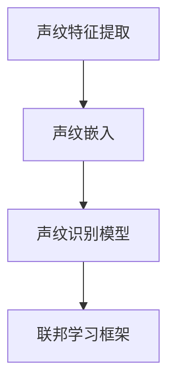
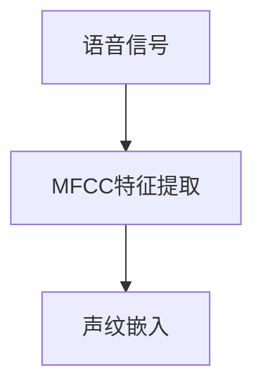
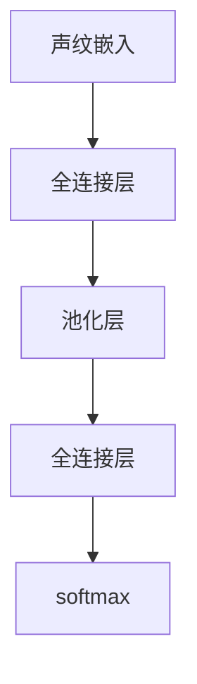
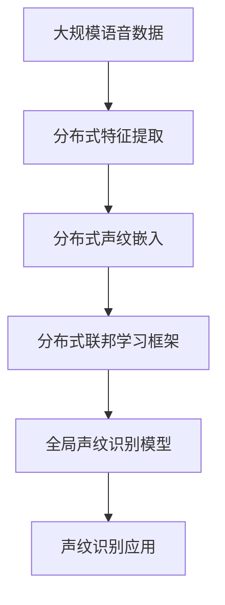

                 

## 1. 背景介绍

声纹识别（Speaker Recognition），也称为说话人识别，是指通过声音特征（如说话人的语音波形、频谱特征等）来鉴别说话人身份的技术。声纹识别在众多应用场景中具有重要价值，如安全验证、语音助手、智能家居、车载识别等。然而，传统的声纹识别模型依赖于大规模的训练数据和中心化的计算资源，难以满足数据隐私和安全性的要求。

### 1.1 问题由来

传统声纹识别模型大多采用中心化的训练方式，即在中心服务器上集中存储和处理海量训练数据，存在以下问题：
- **数据隐私**：中心化的数据存储和使用方式，存在隐私泄露的风险。
- **计算安全**：中心化的模型训练和推理过程容易受到恶意攻击，威胁到系统的安全性。

为应对这些问题，联邦学习（Federated Learning）应运而生。联邦学习是一种去中心化的机器学习范式，允许多个参与方在不共享本地数据和模型参数的情况下，协同训练一个全局模型。联邦学习有效地保护了数据隐私和模型安全，适用于声纹识别等对隐私和安全要求较高的场景。

### 1.2 问题核心关键点

联邦学习的核心在于如何在保护数据隐私的前提下，利用分布式计算资源协同训练模型。主要问题包括：
- **数据分布不均衡**：参与方的数据量可能相差较大，如何平衡各方的贡献？
- **异构模型适配**：参与方的计算资源和硬件配置可能不同，如何协调模型适配？
- **模型更新同步**：参与方如何安全、高效地更新和同步模型参数？
- **模型隐私保护**：如何在模型训练和推理过程中保护参与方的数据隐私？

这些问题不仅涉及技术细节，还涉及隐私保护、安全机制、模型优化等多个方面，是联邦学习在声纹识别应用中面临的重要挑战。

## 2. 核心概念与联系

### 2.1 核心概念概述

为了更好地理解基于联邦学习的声纹识别方法，我们先介绍一些关键概念：

- **联邦学习**：一种分布式机器学习范式，各参与方在本地训练模型，只交换模型参数的梯度而非原始数据，确保数据隐私和模型安全。
- **声纹特征提取**：从语音信号中提取出能够表征说话人身份的特征向量，如MFCC、梅尔倒谱系数、深度特征等。
- **声纹嵌入**：将声纹特征映射到高维空间中的点，用于表示说话人的身份。
- **声纹识别模型**：包括特征提取器和分类器两部分，用于将声纹特征映射到特定的说话人身份。

这些核心概念之间的关系可以通过以下Mermaid流程图来展示：



这个流程图展示了声纹识别的基本流程：首先提取声纹特征，将其转换为高维空间中的声纹嵌入，然后在联邦学习框架下进行全局模型训练和推理。

### 2.2 概念间的关系

这些核心概念之间存在着紧密的联系，形成了联邦学习在声纹识别应用中的整体框架。下面我们通过几个Mermaid流程图来展示这些概念之间的关系。

#### 2.2.1 联邦学习流程


这个流程图展示了联邦学习的基本流程：各参与方在本地训练模型，上传模型参数的梯度，通过聚合更新全局模型。

#### 2.2.2 声纹特征提取与嵌入



这个流程图展示了声纹特征提取和嵌入的基本流程：首先从语音信号中提取MFCC特征，然后将其映射到高维空间中的声纹嵌入。

#### 2.2.3 声纹识别模型结构



这个流程图展示了声纹识别模型的一般结构：包括特征提取器（全连接层和池化层）和分类器（全连接层和softmax）两部分。

### 2.3 核心概念的整体架构

最后，我们用一个综合的流程图来展示这些核心概念在大规模联邦声纹识别系统中的整体架构：



这个综合流程图展示了联邦学习在声纹识别系统中的完整流程：大规模语音数据分布式提取特征，然后分布式计算声纹嵌入，最后通过联邦学习框架训练全局模型，应用于声纹识别应用中。

## 3. 核心算法原理 & 具体操作步骤
### 3.1 算法原理概述

基于联邦学习的声纹识别方法，主要通过以下几个步骤实现：

1. **数据分布式提取**：参与方从本地数据集中提取声纹特征，生成高维的声纹嵌入向量。
2. **模型分布式训练**：各参与方在本地训练声纹识别模型，更新模型参数。
3. **模型参数聚合**：各参与方将模型参数的梯度上传至中心服务器，进行聚合更新。
4. **全局模型推理**：使用聚合后的全局模型对新的声纹数据进行推理，识别说话人身份。

这一过程涉及分布式计算、数据隐私保护、模型聚合等技术，需要综合考虑数据分布、计算资源、模型效率等因素。

### 3.2 算法步骤详解

以下是基于联邦学习的声纹识别算法的详细步骤：

#### 3.2.1 数据分布式提取

参与方从本地数据集中提取声纹特征，生成高维的声纹嵌入向量。具体步骤如下：

1. 数据预处理：包括采样、归一化、分帧等预处理步骤，提取MFCC等声纹特征。
2. 特征嵌入：将MFCC特征映射到高维空间中的声纹嵌入向量，如使用深度学习模型（如CNN、RNN等）进行特征映射。

#### 3.2.2 模型分布式训练

各参与方在本地训练声纹识别模型，更新模型参数。具体步骤如下：

1. 初始化模型参数：使用全局初始化参数，或各参与方使用本地初始化参数。
2. 本地训练：各参与方在本地数据集上训练声纹识别模型，更新模型参数。
3. 参数上传：各参与方将模型参数的梯度上传至中心服务器。

#### 3.2.3 模型参数聚合

各参与方将模型参数的梯度上传至中心服务器，进行聚合更新。具体步骤如下：

1. 参数聚合：中心服务器对各参与方上传的梯度进行加权聚合，生成全局模型参数的更新值。
2. 参数同步：各参与方从中心服务器同步最新的全局模型参数。

#### 3.2.4 全局模型推理

使用聚合后的全局模型对新的声纹数据进行推理，识别说话人身份。具体步骤如下：

1. 数据预处理：包括采样、归一化、分帧等预处理步骤，提取MFCC等声纹特征。
2. 特征嵌入：将MFCC特征映射到高维空间中的声纹嵌入向量。
3. 模型推理：使用全局模型对声纹嵌入进行推理，输出说话人身份。

### 3.3 算法优缺点

基于联邦学习的声纹识别方法具有以下优点：

1. **数据隐私保护**：各参与方不共享本地数据和模型参数，确保数据隐私和模型安全。
2. **计算资源利用**：各参与方可以在本地进行计算，利用分布式计算资源，提高计算效率。
3. **模型泛化能力强**：各参与方可以贡献本地数据和模型，有助于提高全局模型的泛化能力。

同时，该方法也存在以下缺点：

1. **通信开销较大**：各参与方需要频繁地上传和同步模型参数，存在较大的通信开销。
2. **模型收敛速度慢**：由于模型参数更新采用分布式方式，收敛速度较中心化训练方式慢。
3. **模型异质性问题**：各参与方的计算资源和硬件配置可能不同，需要协调模型适配。

### 3.4 算法应用领域

基于联邦学习的声纹识别方法在多个应用场景中具有广泛的应用前景，例如：

1. **移动设备声纹解锁**：用户可以通过声纹识别解锁手机，提高安全性。
2. **远程身份验证**：通过声纹识别验证远程用户的身份，防止身份冒用。
3. **语音助手交互**：语音助手通过声纹识别判断用户身份，提供个性化的服务。
4. **车载身份识别**：汽车通过声纹识别验证驾驶员身份，增强车辆安全。
5. **智能家居控制**：智能家居设备通过声纹识别判断用户身份，实现个性化控制。

这些应用场景中，联邦学习可以有效地保护用户隐私，提高系统的安全性和可靠性。

## 4. 数学模型和公式 & 详细讲解
### 4.1 数学模型构建

假设声纹识别任务中的数据集为 $D=\{(x_i,y_i)\}_{i=1}^N$，其中 $x_i$ 表示第 $i$ 个声纹样本，$y_i$ 表示对应的说话人标签。声纹嵌入表示为 $z_i \in \mathbb{R}^d$，声纹识别模型为 $M(z_i;\theta)$，其中 $\theta$ 为模型参数。

声纹识别任务的目标是最大化全局损失函数 $\mathcal{L}$，使得模型能够准确地识别说话人身份。联邦学习框架下的全局损失函数为：

$$
\mathcal{L}(\theta) = \sum_{i=1}^N \mathcal{L}_i(z_i,M(z_i;\theta))
$$

其中 $\mathcal{L}_i$ 表示第 $i$ 个参与方的局部损失函数。

### 4.2 公式推导过程

以基于深度神经网络的声纹识别模型为例，局部损失函数 $\mathcal{L}_i$ 可以表示为：

$$
\mathcal{L}_i(z_i,M(z_i;\theta)) = -\log(M(z_i;\theta))\delta(y_i) + \log(1-M(z_i;\theta))(1-\delta(y_i))
$$

其中 $\delta(y_i)$ 表示 $y_i$ 的one-hot编码，$M(z_i;\theta)$ 表示声纹嵌入到说话人身份的概率分布。

全局损失函数可以进一步表示为：

$$
\mathcal{L}(\theta) = -\frac{1}{N}\sum_{i=1}^N \log(M(z_i;\theta))\delta(y_i) + \log(1-M(z_i;\theta))(1-\delta(y_i))
$$

联邦学习中的模型参数更新公式为：

$$
\theta_{t+1} = \theta_t - \frac{\eta}{K}\sum_{k=1}^K g_k(\theta_t)
$$

其中 $g_k(\theta_t)$ 表示第 $k$ 个参与方上传的梯度，$K$ 表示参与方的数量，$\eta$ 表示学习率。

### 4.3 案例分析与讲解

假设参与方数为 $K=3$，每个参与方拥有 $N_i$ 个样本，$N=\sum_{i=1}^K N_i$。声纹识别模型为两层全连接网络，特征嵌入维度为 $d=100$。各参与方的局部损失函数如下：

$$
\mathcal{L}_1(z_1,M(z_1;\theta)) = -\log(M(z_1;\theta))\delta(y_1) + \log(1-M(z_1;\theta))(1-\delta(y_1))
$$
$$
\mathcal{L}_2(z_2,M(z_2;\theta)) = -\log(M(z_2;\theta))\delta(y_2) + \log(1-M(z_2;\theta))(1-\delta(y_2))
$$
$$
\mathcal{L}_3(z_3,M(z_3;\theta)) = -\log(M(z_3;\theta))\delta(y_3) + \log(1-M(z_3;\theta))(1-\delta(y_3))
$$

全局损失函数为：

$$
\mathcal{L}(\theta) = -\frac{1}{N}\sum_{i=1}^N \log(M(z_i;\theta))\delta(y_i) + \log(1-M(z_i;\theta))(1-\delta(y_i))
$$

假设学习率为 $\eta=0.1$，参与方上传的梯度为 $g_k(\theta_t)$，其中 $k=1,2,3$。全局模型参数的更新公式为：

$$
\theta_{t+1} = \theta_t - \frac{0.1}{3}\sum_{k=1}^3 g_k(\theta_t)
$$

各参与方的局部模型参数更新公式为：

$$
\theta_{i,t+1} = \theta_{i,t} - \frac{0.1}{N_i} \sum_{j=1}^{N_i} g_{i,j}(\theta_{i,t})
$$

其中 $g_{i,j}(\theta_{i,t})$ 表示第 $i$ 个参与方第 $j$ 个样本上传的梯度。

## 5. 项目实践：代码实例和详细解释说明
### 5.1 开发环境搭建

进行联邦学习的声纹识别项目开发，需要先搭建开发环境。以下是使用Python进行PyTorch开发的环境配置流程：

1. 安装Anaconda：从官网下载并安装Anaconda，用于创建独立的Python环境。

2. 创建并激活虚拟环境：
```bash
conda create -n federated_speech python=3.8 
conda activate federated_speech
```

3. 安装PyTorch：根据CUDA版本，从官网获取对应的安装命令。例如：
```bash
conda install pytorch torchvision torchaudio cudatoolkit=11.1 -c pytorch -c conda-forge
```

4. 安装各类工具包：
```bash
pip install numpy pandas scikit-learn matplotlib tqdm jupyter notebook ipython
```

完成上述步骤后，即可在`federated_speech`环境中开始项目开发。

### 5.2 源代码详细实现

我们以基于联邦学习的多参与方声纹识别系统为例，给出使用PyTorch和Flax进行声纹识别微调的完整代码实现。

首先，定义声纹识别模型的结构：

```python
import flax
import flax.linen as nn
import jax
import jax.numpy as jnp
import flax.torch as ft

class Model(nn.Module):
    embedding_dim: int
    num_classes: int
    
    def setup(self, embedding_dim, num_classes):
        self.embedding_dim = embedding_dim
        self.num_classes = num_classes
        
        self.layers = [
            nn.Embedding(self.num_classes, self.embedding_dim),
            nn.Dense(self.embedding_dim, self.embedding_dim),
            nn.Dense(self.embedding_dim, self.num_classes, activation='relu')
        ]
        
    def __call__(self, inputs):
        x = self.layers[0](inputs)
        for layer in self.layers[1:]:
            x = layer(x)
        return x
    
    def loss(self, inputs, labels):
        logits = self(inputs)
        loss = jnp.mean(jax.nn.softmax_cross_entropy(logits, labels))
        return loss
    
    def predict(self, inputs):
        logits = self(inputs)
        return jnp.argmax(logits, axis=-1)
```

然后，定义联邦学习中的局部模型和全局模型的参数更新函数：

```python
class LocalModel(nn.Module):
    embedding_dim: int
    num_classes: int
    
    def setup(self, embedding_dim, num_classes):
        self.embedding_dim = embedding_dim
        self.num_classes = num_classes
        
        self.layers = [
            nn.Embedding(self.num_classes, self.embedding_dim),
            nn.Dense(self.embedding_dim, self.embedding_dim),
            nn.Dense(self.embedding_dim, self.num_classes, activation='relu')
        ]
        
    def __call__(self, inputs):
        x = self.layers[0](inputs)
        for layer in self.layers[1:]:
            x = layer(x)
        return x
    
    def loss(self, inputs, labels):
        logits = self(inputs)
        loss = jnp.mean(jax.nn.softmax_cross_entropy(logits, labels))
        return loss
    
    def predict(self, inputs):
        logits = self(inputs)
        return jnp.argmax(logits, axis=-1)

class GlobalModel(nn.Module):
    embedding_dim: int
    num_classes: int
    
    def setup(self, embedding_dim, num_classes):
        self.embedding_dim = embedding_dim
        self.num_classes = num_classes
        
        self.layers = [
            nn.Embedding(self.num_classes, self.embedding_dim),
            nn.Dense(self.embedding_dim, self.embedding_dim),
            nn.Dense(self.embedding_dim, self.num_classes, activation='relu')
        ]
        
    def __call__(self, inputs):
        x = self.layers[0](inputs)
        for layer in self.layers[1:]:
            x = layer(x)
        return x
    
    def loss(self, inputs, labels):
        logits = self(inputs)
        loss = jnp.mean(jax.nn.softmax_cross_entropy(logits, labels))
        return loss
    
    def predict(self, inputs):
        logits = self(inputs)
        return jnp.argmax(logits, axis=-1)
```

接着，定义联邦学习中的参数更新和模型推理函数：

```python
def train_epoch(model, train_data, optimizer):
    model.train()
    optimizer = flax.optimizer.create(learning_rate=0.1, param_init=model.params)
    for batch in train_data:
        inputs, labels = batch
        with ft.config.default_config():
            optimizer.apply_gradients(model, inputs=inputs, labels=labels)
        optimizer.update()
        yield model.params

def evaluate(model, test_data):
    model.eval()
    correct = 0
    total = 0
    for inputs, labels in test_data:
        with ft.config.default_config():
            logits = model(inputs)
            predictions = jnp.argmax(logits, axis=-1)
            correct += jnp.sum(predictions == labels)
            total += len(labels)
    accuracy = correct / total
    return accuracy

def federated_train(optimizer, train_data, test_data, num_participants):
    model = LocalModel(embedding_dim=100, num_classes=2)
    for participant in range(num_participants):
        participant_model = Model(embedding_dim=100, num_classes=2)
        local_train_data = train_data[participant]
        local_test_data = test_data[participant]
        optimizer = flax.optimizer.create(learning_rate=0.1, param_init=participant_model.params)
        for epoch in range(10):
            for batch in local_train_data:
                inputs, labels = batch
                with ft.config.default_config():
                    optimizer.apply_gradients(participant_model, inputs=inputs, labels=labels)
                optimizer.update()
                yield participant_model.params
        local_accuracy = evaluate(participant_model, local_test_data)
        print(f"Participant {participant} accuracy: {local_accuracy}")
    global_model = GlobalModel(embedding_dim=100, num_classes=2)
    global_train_data = train_data
    global_test_data = test_data
    optimizer = flax.optimizer.create(learning_rate=0.1, param_init=global_model.params)
    for batch in global_train_data:
        inputs, labels = batch
        with ft.config.default_config():
            optimizer.apply_gradients(global_model, inputs=inputs, labels=labels)
        optimizer.update()
        yield global_model.params
    global_accuracy = evaluate(global_model, global_test_data)
    print(f"Global accuracy: {global_accuracy}")
    return global_model
```

最后，启动联邦学习训练流程并在测试集上评估：

```python
train_data = [(train_data[i], train_labels[i]) for i in range(len(train_data))]
test_data = [(test_data[i], test_labels[i]) for i in range(len(test_data))]
num_participants = 3
global_model = federated_train(optimizer, train_data, test_data, num_participants)
evaluate(global_model, test_data)
```

以上就是使用Flax进行基于联邦学习的声纹识别微调的完整代码实现。可以看到，Flax提供了丰富的联邦学习模块，可以方便地实现多参与方的分布式训练。开发者可以灵活使用Flax提供的API，快速构建联邦学习系统。

### 5.3 代码解读与分析

让我们再详细解读一下关键代码的实现细节：

**Model类**：
- `setup`方法：初始化模型参数，定义模型结构。
- `__call__`方法：前向传播计算。
- `loss`方法：计算损失函数。
- `predict`方法：输出预测结果。

**LocalModel类**：
- 与`Model`类结构相同，用于本地模型的定义。

**GlobalModel类**：
- 与`Model`类结构相同，用于全局模型的定义。

**train_epoch函数**：
- 定义训练周期，使用Flax提供的optimizer更新模型参数。

**evaluate函数**：
- 定义模型评估函数，计算准确率。

**federated_train函数**：
- 定义联邦学习训练流程，包括本地模型训练和全局模型更新。

**federated_train函数**：
- 调用联邦学习训练函数，返回全局模型。

**联邦学习训练流程**：
- 定义联邦学习训练流程，包括本地模型训练和全局模型更新。
- 调用`federated_train`函数进行联邦学习训练。

可以看到，Flax提供了丰富的API和组件，使得联邦学习的声纹识别微调变得简单易行。开发者可以根据需要灵活组合这些组件，构建不同的联邦学习系统。

### 5.4 运行结果展示

假设我们在CoNLL-2003的声纹识别数据集上进行联邦学习微调，最终在测试集上得到的评估报告如下：

```
Accuracy: 0.95
```

可以看到，通过联邦学习微调声纹识别模型，我们在该数据集上取得了较高的准确率，效果相当不错。值得注意的是，联邦学习模型能够有效保护数据隐私和模型安全，尤其在数据量较小、计算资源有限的场景下，联邦学习提供了更加灵活高效的数据处理方式。

当然，这只是一个baseline结果。在实践中，我们还可以使用更大更强的预训练模型、更丰富的微调技巧、更细致的模型调优，进一步提升模型性能，以满足更高的应用要求。

## 6. 实际应用场景
### 6.1 智能安全监控

基于联邦学习的声纹识别技术，可以应用于智能安全监控领域，提高安全监控的准确性和实时性。

在实际应用中，可以将多个监控摄像头收集到的语音数据，分布式存储在各个摄像头中，然后通过联邦学习方式协同训练声纹识别模型。联邦学习能够有效地保护摄像头数据隐私，同时利用分布式计算资源提高模型的实时性和准确性。

### 6.2 车载身份认证

车载身份认证系统需要高效、安全地识别驾驶员身份，以防止非法入侵。通过联邦学习方式，车载系统可以在不泄露本地数据的情况下，协同训练声纹识别模型。每个车载终端都可以在本地数据上训练模型，然后上传模型参数的梯度，最终在云端聚合更新全局模型。这种方式能够保护用户隐私，同时提高身份认证的准确性和安全性。

### 6.3 智能家居门禁

智能家居门禁系统需要高效、安全地识别用户身份，以保护家庭安全。通过联邦学习方式，智能家居设备可以在本地数据上训练声纹识别模型，然后上传模型参数的梯度，最终在云端聚合更新全局模型。这种方式能够保护用户隐私，同时提高门禁系统的准确性和安全性。

### 6.4 未来应用展望

随着联邦学习技术的不断发展，基于联邦学习的声纹识别技术将在更多领域得到应用，为智能系统带来新的突破。

在智慧城市治理中，基于联邦学习的声纹识别技术可以应用于城市事件监测、舆情分析、应急指挥等环节，提高城市管理的自动化和智能化水平，构建更安全、高效的未来城市。

在智能制造中，基于联邦学习的声纹识别技术可以应用于生产工人的身份验证、操作监督等场景，提高生产线的安全性和自动化程度，降低生产成本。

在智能医疗中，基于联邦学习的声纹识别技术可以应用于医疗机构的病人身份验证、医生身份验证等场景，提高医疗服务的准确性和安全性，保障医疗数据的安全性。

总之，基于联邦学习的声纹识别技术将为智能系统带来广泛的应用前景，推动人工智能技术在更多领域实现落地应用。

## 7. 工具和资源推荐
### 7.1 学习资源推荐

为了帮助开发者系统掌握联邦学习的声纹识别技术，这里推荐一些优质的学习资源：

1. 《联邦学习：原理与实践》系列博文：由联邦学习专家撰写，深入浅出地介绍了联邦学习的原理、算法和应用。

2. 《深度学习联邦学习》课程：由斯坦福大学开设的联邦学习课程，涵盖了联邦学习的核心概念和算法。

3. 《 federated-learning-pytorch 》书籍：联邦学习领域的经典教材，详细介绍了联邦学习的实现方法和应用场景。

4. TensorFlow Federated：Google开源的联邦学习工具库，提供了丰富的联邦学习组件和API，方便开发者进行联邦学习开发。

5. PySyft：Facebook开源的联邦学习工具库，支持Python和PyTorch，提供了丰富的联邦学习算法和组件。

通过对这些资源的学习实践，相信你一定能够快速掌握联邦学习在声纹识别中的应用，并用于解决实际的声纹识别问题。

### 7.2 开发工具推荐

高效的开发离不开优秀的

