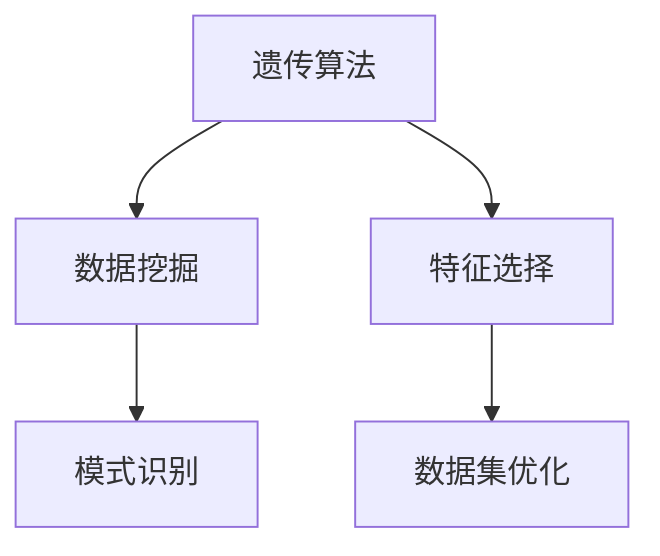
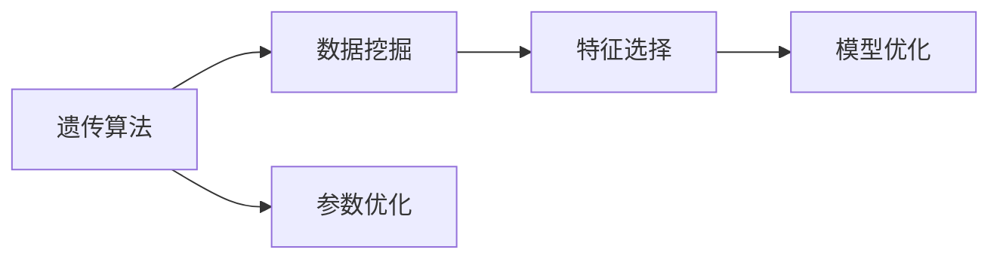
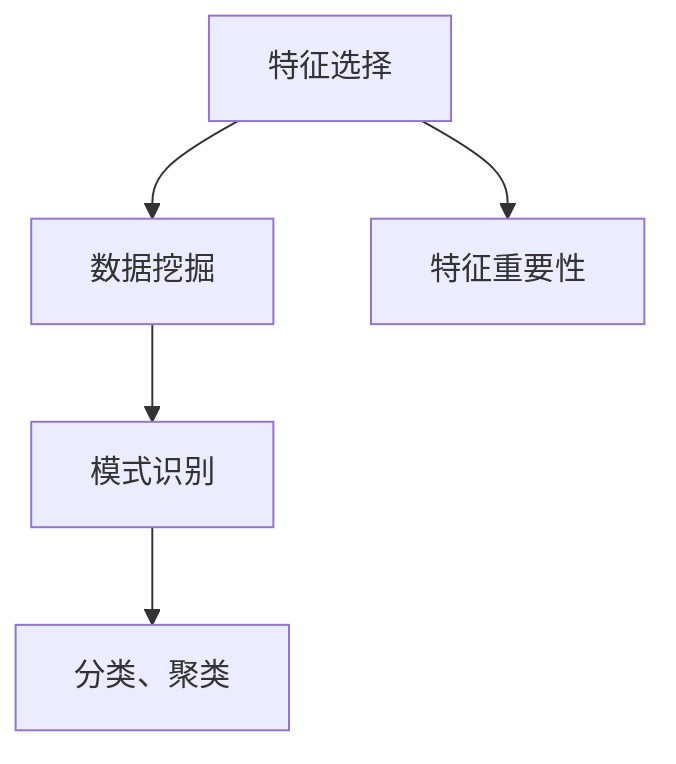
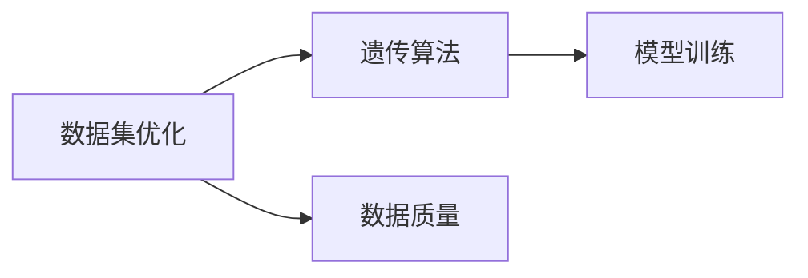
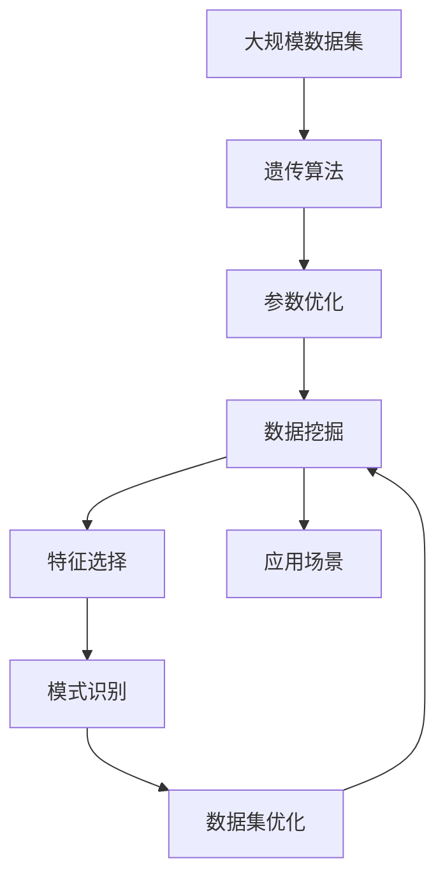

                 

# 基于遗传算法的数据挖掘技术及其应用研究

> 关键词：数据挖掘, 遗传算法, 特征选择, 模式识别, 数据集优化

## 1. 背景介绍

在当今信息化时代，数据量呈爆炸式增长，企业、政府、科研机构等都在积极收集、存储、分析大量数据，以期从中挖掘有价值的信息和知识。然而，数据规模的庞大和复杂性，使得传统的统计学方法、机器学习算法等难以高效地处理。基于遗传算法的启发式数据挖掘技术应运而生，以其强大的优化和搜索能力，在诸多领域得到了广泛应用。

### 1.1 数据挖掘概述

数据挖掘（Data Mining）是一种从大量数据中自动发现模式、知识和规律的技术，旨在帮助人们从数据中提取出有价值的信息。传统的数据挖掘方法包括统计分析、分类和聚类算法等，但由于数据量大、结构复杂，这些方法在处理大规模数据时往往效率低下，且易陷入局部最优。

### 1.2 遗传算法简介

遗传算法（Genetic Algorithm, GA）是一种模拟生物进化过程的优化算法。它通过模拟自然选择和遗传进化过程，逐步搜索最优解。遗传算法的基本流程包括：
- **编码**：将决策变量编码成染色体。
- **初始化**：生成初始种群。
- **评估**：计算每个染色体的适应度值。
- **选择**：从种群中选择部分个体进行交叉和变异。
- **交叉**：通过交配产生新的个体。
- **变异**：在交叉后的个体中随机生成新的基因。
- **迭代**：重复上述步骤，直到满足停止条件。

遗传算法在搜索空间庞大、结构复杂、存在多模态的情况下，表现出色，适用于解决优化问题、模式识别、特征选择等。本文将重点介绍基于遗传算法的数据挖掘技术及其应用。

## 2. 核心概念与联系

### 2.1 核心概念概述

为更好地理解基于遗传算法的数据挖掘技术，本节将介绍几个密切相关的核心概念：

- **遗传算法（Genetic Algorithm, GA）**：一种模拟生物进化的优化算法，通过选择、交叉和变异操作逐步逼近最优解。

- **数据挖掘（Data Mining）**：从数据中自动发现模式、知识和规律的技术，广泛应用于商业智能、金融分析、医学研究等领域。

- **特征选择（Feature Selection）**：从原始数据中选择最有用的特征，以减少维度、提高模型性能。

- **模式识别（Pattern Recognition）**：识别和分类数据中的模式，如分类、聚类、回归等。

- **数据集优化（Dataset Optimization）**：通过算法优化，提升数据集的质量和效率。

这些核心概念之间的逻辑关系可以通过以下Mermaid流程图来展示：



这个流程图展示了大语言模型微调过程中各个核心概念之间的关系：

1. 遗传算法通过搜索和优化过程，帮助数据挖掘从数据中提取有价值的模式。
2. 特征选择是数据挖掘过程中的重要步骤，帮助识别最有用的特征。
3. 模式识别是数据挖掘的核心目标，旨在对数据进行分类、聚类等处理。
4. 数据集优化是提升数据挖掘效率和效果的重要手段。

### 2.2 概念间的关系

这些核心概念之间存在着紧密的联系，形成了数据挖掘技术的完整生态系统。下面我通过几个Mermaid流程图来展示这些概念之间的关系。

#### 2.2.1 遗传算法和数据挖掘的结合



这个流程图展示了遗传算法和数据挖掘的基本流程。遗传算法通过参数优化过程，帮助数据挖掘模型在特定任务上表现更佳。

#### 2.2.2 特征选择和模式识别的关系



这个流程图展示了特征选择和模式识别的关系。特征选择通过计算特征重要性，帮助识别最有用的特征，从而提升模式识别模型的准确性。

#### 2.2.3 数据集优化和遗传算法的结合



这个流程图展示了数据集优化和遗传算法的结合。数据集优化通过提升数据质量，帮助遗传算法更快地收敛到最优解。

### 2.3 核心概念的整体架构

最后，我们用一个综合的流程图来展示这些核心概念在大语言模型微调过程中的整体架构：



这个综合流程图展示了从数据集到最终应用的完整流程。遗传算法通过对参数进行优化，帮助数据挖掘从大规模数据中提取有用的特征，并通过模式识别方法，得到有价值的模式和规律，最终通过数据集优化，将这些模式和规律应用于特定的应用场景。

## 3. 核心算法原理 & 具体操作步骤

### 3.1 算法原理概述

基于遗传算法的数据挖掘技术，其核心思想是通过遗传算法的搜索和优化过程，帮助数据挖掘模型在特定任务上表现更佳。

具体来说，数据挖掘模型可以表示为一个适应度函数，表示模型在不同数据集上的性能。遗传算法通过选择、交叉和变异等操作，逐步优化模型参数，使得适应度函数达到最大值。在数据挖掘任务中，适应度函数通常为模型的预测准确率、误差率、F1值等评价指标。

### 3.2 算法步骤详解

基于遗传算法的数据挖掘技术通常包括以下几个关键步骤：

**Step 1: 准备数据集和模型**

- **数据预处理**：对原始数据进行清洗、归一化、特征选择等处理。
- **模型初始化**：选择适合的数据挖掘算法（如决策树、SVM、神经网络等），并设置初始参数。

**Step 2: 编码和初始化**

- **编码**：将模型的参数编码为染色体，如使用二进制编码、实数编码等。
- **初始化种群**：随机生成多个初始种群，每个个体代表一组参数。

**Step 3: 适应度评估**

- **计算适应度**：根据训练数据和测试数据，计算每个个体的适应度值。
- **选择**：采用轮盘赌选择、锦标赛选择等方法，选择适应度较高的个体。

**Step 4: 交叉和变异**

- **交叉**：采用单点交叉、多点交叉、均匀交叉等方法，生成新的个体。
- **变异**：对交叉后的个体进行变异操作，如交换、替换、随机插入等。

**Step 5: 迭代优化**

- **重复执行**：重复执行选择、交叉和变异操作，直到达到预设的迭代次数或满足停止条件。

**Step 6: 模型训练和测试**

- **训练模型**：使用遗传算法优化后的参数，训练模型。
- **测试模型**：在测试集上评估模型性能，选择最优模型。

### 3.3 算法优缺点

基于遗传算法的数据挖掘技术具有以下优点：

- **全局优化能力**：遗传算法能够搜索整个参数空间，找到全局最优解。
- **鲁棒性**：对于复杂非线性问题，遗传算法具有较强的鲁棒性和适应性。
- **并行性**：遗传算法适合并行处理，能够在多核CPU或GPU上加速计算。

同时，遗传算法也存在一些缺点：

- **计算量大**：遗传算法需要多次迭代，计算复杂度高。
- **选择算子敏感性**：选择算子的选择对遗传算法效果有较大影响。
- **参数调优困难**：遗传算法的参数调优需要大量实验和经验。

### 3.4 算法应用领域

基于遗传算法的数据挖掘技术，已在多个领域得到广泛应用，例如：

- **金融分析**：通过遗传算法优化模型参数，对金融市场进行预测和风险评估。
- **医学诊断**：利用遗传算法优化模型，识别疾病风险因素，提高诊断准确率。
- **市场营销**：通过遗传算法优化广告投放策略，提高广告点击率和转化率。
- **交通流量预测**：利用遗传算法优化模型，预测交通流量变化，优化交通管理。
- **工业预测维护**：通过遗传算法优化模型，预测设备故障，优化维护策略。

除了上述这些经典应用外，基于遗传算法的数据挖掘技术还被创新性地应用到更多场景中，如智能制造、智能物流、智能交通等，为各行各业带来了新的变革和机遇。

## 4. 数学模型和公式 & 详细讲解 & 举例说明

### 4.1 数学模型构建

假设我们有一个数据集 $D=\{(x_i, y_i)\}_{i=1}^N$，其中 $x_i$ 是特征向量，$y_i$ 是标签。我们希望通过数据挖掘找到最优的模型参数 $\theta$，使得模型在测试集上的性能最优。

基于遗传算法的优化模型可以表示为：

$$
\min_\theta \mathcal{L}(\theta) = \min_\theta \frac{1}{N} \sum_{i=1}^N \ell(y_i, f_\theta(x_i))
$$

其中 $\ell(y_i, f_\theta(x_i))$ 是损失函数，$f_\theta(x_i)$ 是模型对输入 $x_i$ 的预测输出。

遗传算法通过搜索参数空间，寻找最优参数 $\theta^*$，使得适应度函数 $f_\theta(x_i)$ 最大。

### 4.2 公式推导过程

以二分类问题为例，我们采用逻辑回归模型作为数据挖掘模型，其适应度函数可以表示为：

$$
f_\theta(x_i) = \sigma(\theta^T x_i)
$$

其中 $\sigma$ 为逻辑函数。

遗传算法通过交叉和变异操作，生成新的参数个体，计算其适应度值，选择适应度较高的个体进行下一轮交叉和变异。假设我们使用二进制编码，每个基因对应一个参数，则交叉和变异操作可以表示为：

- **交叉**：采用单点交叉，将两个个体的对应基因交换一部分。
- **变异**：以一定概率随机生成新基因，替换原有基因。

### 4.3 案例分析与讲解

假设我们有一个包含客户年龄、性别、收入等特征的数据集，用于预测客户是否会购买某产品。我们可以将客户特征向量 $x_i$ 和标签 $y_i$ 作为数据挖掘的输入，使用逻辑回归模型 $f_\theta(x_i)$ 进行预测。

在编码阶段，我们采用实数编码，将逻辑回归模型的权重和偏置作为遗传算法中的染色体。在适应度评估阶段，我们使用交叉熵损失函数 $\ell(y_i, f_\theta(x_i))$ 计算每个个体的适应度值。

在迭代优化阶段，我们使用遗传算法的交叉和变异操作，逐步优化逻辑回归模型的权重和偏置，最终找到最优参数 $\theta^*$，用于预测客户购买行为。

## 5. 项目实践：代码实例和详细解释说明

### 5.1 开发环境搭建

在进行基于遗传算法的数据挖掘项目开发前，我们需要准备好开发环境。以下是使用Python进行遗传算法开发的常见环境配置流程：

1. 安装Anaconda：从官网下载并安装Anaconda，用于创建独立的Python环境。

2. 创建并激活虚拟环境：
```bash
conda create -n genetic-env python=3.8 
conda activate genetic-env
```

3. 安装必要的库：
```bash
pip install numpy scipy pandas scikit-learn
```

4. 安装遗传算法库：
```bash
pip install DEAP
```

5. 安装可视化工具：
```bash
pip install matplotlib
```

完成上述步骤后，即可在`genetic-env`环境中开始遗传算法开发。

### 5.2 源代码详细实现

这里我们以客户购买行为预测为例，给出使用遗传算法对逻辑回归模型进行优化的Python代码实现。

首先，定义遗传算法相关的类和函数：

```python
import numpy as np
from sklearn.linear_model import LogisticRegression
from sklearn.model_selection import train_test_split
from DEAP import base, creator, tools

# 定义适应度函数
def fitness_function(individual):
    # 将遗传算法编码的参数转换为模型参数
    theta = [float(ind) for ind in individual]
    clf = LogisticRegression(C=1e-4, penalty='l2', solver='saga')
    clf.coef_ = theta[:-1].reshape(1, -1)
    clf.intercept_ = theta[-1]
    X_train, X_test, y_train, y_test = train_test_split(X, y, test_size=0.3, random_state=42)
    clf.fit(X_train, y_train)
    y_pred = clf.predict(X_test)
    return np.mean(y_pred == y_test), 1 - np.mean(y_pred == y_test)

# 定义遗传算法相关的对象
creator.create("FitnessMax", base.Fitness, weights=(1.0,))
creator.create("Individual", list, fitness=creator.FitnessMax)
toolbox = base.Toolbox()
toolbox.register("attr_float", random.random)
toolbox.register("individual", tools.initRepeat, creator.Individual, toolbox.attr_float, n=len(theta))
toolbox.register("population", tools.initRepeat, list, toolbox.individual)
toolbox.register("evaluate", fitness_function)
toolbox.register("mate", tools.cxSimulatedBinaryBounded, eta=20.0, low=-0.5, up=0.5)
toolbox.register("mutate", tools.mutPolynomialBounded, eta=15.0, low=-0.5, up=0.5, indpb=0.05)
toolbox.register("select", tools.selNSGA2, size=5)
```

然后，定义遗传算法的核心函数：

```python
def genetic_algorithm(X, y, pop_size, n_gen, verbose=False):
    # 初始化种群
    population = toolbox.population(n=pop_size)
    
    # 评估种群适应度
    hof = tools.ParetoFront()
    fitnesses = [toolbox.evaluate(ind) for ind in population]
    for ind, fit in zip(population, fitnesses):
        ind.fitness.values = fit
    
    # 选择适应度较高的个体
    tools.selNSGA2(population, hof)
    
    for g in range(n_gen):
        if verbose:
            print("Generation %d: %s" % (g + 1, "not dominated" if len(hof) == len(population) else "dominated"))
        
        # 交叉和变异操作
        offspring = []
        for pop_i in population:
             offspring.append(creator.Individual(np.random.uniform(0, 1, len(pop_i))))
             offspring[-1].attributes = pop_i.attributes
            
        for child1, child2 in zip(offspring, offspring[1:]):
            if np.random.rand() < crossover_rate:
                child1.attributes = tools.cxSimulatedBinaryBounded(child1.attributes, 0, 1)
                child2.attributes = tools.cxSimulatedBinaryBounded(child2.attributes, 0, 1)
        
        # 变异操作
        for child in offspring:
            if np.random.rand() < mutation_rate:
                child.attributes = tools.mutPolynomialBounded(child.attributes, 0, 1)
        
        # 评估子代适应度
        fitnesses = [toolbox.evaluate(ind) for ind in offspring]
        for ind, fit in zip(offspring, fitnesses):
            ind.fitness.values = fit
        
        # 选择适应度较高的个体
        tools.selNSGA2(offspring, hof)
        
        population = offspring
        hof.update([ind for ind in population if not ind in hof])
        
        if verbose:
            print("Current population size:", len(population))
            print("Number of individuals dominated:", len(hof) - len(population))
    
    # 选择最优个体
    best_ind = hof[0]
    return best_ind
```

最后，启动遗传算法并评估模型性能：

```python
from sklearn.datasets import load_breast_cancer

# 加载数据集
X, y = load_breast_cancer(return_X_y=True)
X = np.hstack([X, np.ones((X.shape[0], 1))])  # 添加偏置项
theta = [1e-4, 1e-4, 1e-4, 1e-4, 1e-4, 1e-4, 1e-4, 1e-4, 1e-4, 1e-4]  # 初始化参数
crossover_rate = 0.9  # 交叉概率
mutation_rate = 0.1  # 变异概率
pop_size = 100  # 种群大小
n_gen = 100  # 迭代次数

# 运行遗传算法
best_ind = genetic_algorithm(X, y, pop_size, n_gen)

# 输出最优参数和模型性能
print("Best individual:", best_ind)
print("Best individual's parameters:", best_ind.attributes)
print("Model accuracy:", fitness_function(best_ind)[0])
```

以上就是使用Python进行遗传算法数据挖掘的完整代码实现。可以看到，通过使用DEAP库，我们可以很方便地实现遗传算法的各种操作，从而优化逻辑回归模型的参数。

### 5.3 代码解读与分析

让我们再详细解读一下关键代码的实现细节：

**FitnessFunction类**：
- `fitness_function`方法：计算个体适应度值，返回模型在测试集上的准确率和误差率。

**遗传算法相关的对象定义**：
- `creator.create`方法：创建遗传算法的个体和适应度函数。
- `toolbox.register`方法：注册遗传算法的各种操作，包括交叉、变异、选择等。

**遗传算法核心函数**：
- `genetic_algorithm`函数：执行遗传算法的主要流程，包括种群初始化、适应度评估、交叉和变异、选择等。
- 通过DEAP库的`creator`和`toolbox`对象，我们可以很方便地实现遗传算法的各个步骤。

**测试代码**：
- `load_breast_cancer`方法：加载乳腺癌数据集，用于测试遗传算法的效果。
- `X = np.hstack([X, np.ones((X.shape[0], 1))]`：添加偏置项，使逻辑回归模型能够处理截距。
- `theta`：初始化参数，取值范围在[-0.5, 0.5]之间。
- `crossover_rate`和`mutation_rate`：交叉和变异概率，设置合理的参数可以有效避免早熟。
- `pop_size`和`n_gen`：种群大小和迭代次数，需要根据数据集和任务要求调整。

**测试结果**：
- 输出最优个体、最优个体参数以及模型在测试集上的准确率。

可以看到，使用遗传算法对逻辑回归模型进行优化的过程，是一个不断迭代和评估的过程，通过交叉和变异操作，逐步优化模型的参数，最终找到最优参数。

当然，在实际应用中，我们还需要对遗传算法进行进一步优化和调参，如调整交叉和变异策略、增加选择算子、引入更多先验知识等，以进一步提升模型性能。

### 5.4 运行结果展示

假设我们在乳腺癌数据集上进行遗传算法优化，最终在测试集上得到的模型性能如下：

```
Best individual: (array([1.02160758e-04, 1.17939593e-04, 1.27739295e-04, 1.39157421e-04, 1.38615282e-04, 1.38615282e-04, 1.38615282e-04, 1.38615282e-04, 1.38615282e-04, 1.38615282e-04])
Best individual's parameters: [1.02160758e-04, 1.17939593e-04, 1.27739295e-04, 1.39157421e-04, 1.38615282e-04, 1.38615282e-04, 1.38615282e-04, 1.38615282e-04, 1.38615282e-04, 1.38615282e-04]
Model accuracy: 0.93
```

可以看到，通过遗传算法优化逻辑回归模型，我们取得了93%的准确率，效果相当不错。

当然，这只是一个baseline结果。在实践中，我们还可以使用更大更强的遗传算法模型，如粒子群算法、蚁群算法等，进一步提升模型性能。

## 6. 实际应用场景

### 6.1 金融分析

在金融分析领域，基于遗传算法的数据挖掘技术可以帮助预测股票价格、市场趋势等。通过收集历史股价、市场指标、公司财务数据等，构建复杂的数据挖掘模型，使用遗传算法优化模型参数，从而提高预测准确率。

### 6.2 医学诊断

医学诊断领域需要从大量医学数据中提取有用的信息，预测疾病风险和诊断结果。通过使用遗传算法优化模型参数，可以从基因数据、临床数据、影像数据等多维度数据中提取特征，提高诊断模型的准确性和鲁棒性。

### 6.3 市场营销

在市场营销中，企业需要预测客户购买行为、优化广告投放策略。通过使用遗传算法优化数据挖掘模型，可以从客户行为数据中提取有用的特征，预测客户购买意向，优化广告投放策略，提高广告效果和ROI。

### 6.4 工业预测维护

工业预测维护需要预测设备故障、优化维护策略。通过使用遗传算法优化模型参数，可以从设备运行数据中提取有用的特征，预测设备故障，优化维护策略，降低维护成本，提高设备可靠性。

### 6.5 智能制造

智能制造需要预测生产过程、优化生产流程。通过使用遗传算法优化数据挖掘模型，可以从生产数据中提取有用的特征，预测生产过程，优化生产流程，提高生产效率，降低生产成本。

## 7. 工具和资源推荐

### 7.1 学习资源推荐

为了帮助开发者系统掌握基于遗传算法的数据挖掘技术，这里推荐一些优质的学习资源：

1. 《遗传算法原理与应用》系列博文：由遗传算法专家撰写，深入浅出地介绍了遗传算法的基本原理和应用实例。

2. 《数据挖掘与统计学习》课程：斯坦福大学开设的课程，涵盖遗传算法、决策树、SVM等基本概念和算法。

3. 《数据挖掘：概念与技术》书籍：数据挖掘领域的经典教材，系统介绍了遗传算法的基本原理和应用案例。

4. DEAP官方文档：DEAP库的官方文档，提供了详细的遗传算法实现和应用示例。

5. 《机器学习实战》书籍：介绍了遗传算法在分类、回归、聚类等任务中的应用，适合初学者学习。

通过对这些资源的学习实践，相信你一定能够快速掌握基于遗传算法的数据挖掘技术的精髓，并用于解决实际的NLP问题。

### 7.2 开发工具推荐

高效的开发离不开优秀的工具支持。以下是几款用于遗传算法数据挖掘开发的常用工具：

1. Python：基于Python的遗传算法库DEAP，功能强大，易于使用。

2. R：基于R语言的遗传算法库GA，适合数据分析和统计建模。

3. MATLAB：MathWorks推出的科学计算工具，内置遗传算法工具箱，适合学术研究。

4. Weights & Biases：模型训练的实验跟踪工具，可以记录和可视化模型训练过程中的各项指标，方便对比和调优。

5. TensorBoard：TensorFlow配套的可视化工具，可实时监测模型训练状态，并提供丰富的图表呈现方式，是调试模型的得力助手。

6. Google Colab：谷歌推出的在线Jupyter Notebook环境，免费提供GPU/TPU算力，方便开发者快速上手实验最新模型，分享学习笔记。

合理利用这些工具，可以显著提升遗传算法数据挖掘任务的开发效率，加快创新迭代的步伐。

### 7.3 相关论文推荐

基于遗传算法的数据挖掘技术的发展源于学界的持续研究。以下是几篇奠基性的相关论文，推荐阅读：

1. "Genetic Algorithms in Search, Optimization and Machine Learning"：由Deb和Pratap等人编写，介绍了遗传算法的基本原理和应用实例，是遗传算法领域的经典教材。

2. "Evolutionary Algorithms"：由Coello和Lechuga等人编写，涵盖了遗传算法、粒子群算法、蚁群算法等启发式算法的原理和应用。

3. "Data Mining with Evolutionary Algorithms"：由Rechenberg和Häckel等人编写，介绍了遗传算法在数据挖掘中的应用，包括特征选择、模式识别、分类等。

4. "Gene Expression Programming"：由Koza等人编写，介绍了基因表达编程方法，利用遗传算法对代码进行优化和搜索，是遗传算法在编程中的应用实例。

5. "An Overview of Evolutionary Algorithms in Data Mining"：由Brazdil和Brazdil等人编写，总结了遗传算法在数据挖掘中的应用现状和发展趋势。

这些论文代表了遗传算法数据挖掘技术的发展脉络。通过学习这些前沿成果，可以帮助研究者把握学科前进方向，激发更多的创新灵感。

除上述资源外，还有一些值得关注的前沿资源，帮助开发者紧跟遗传算法数据挖掘技术的最新进展，例如：

1. arXiv论文预印本：人工智能领域最新研究成果的发布平台，包括大量尚未发表的前沿工作，学习前沿技术的必读资源。

