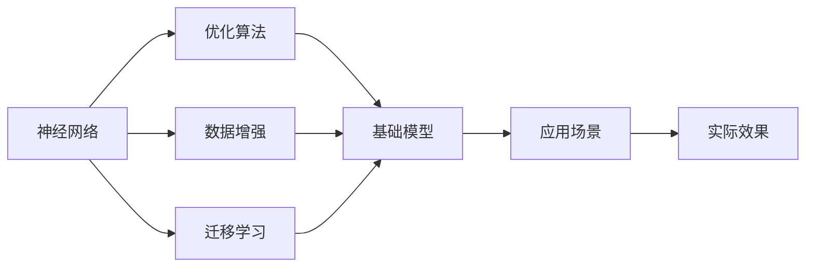

                 

# 基础模型的改进与影响力

> 关键词：基础模型改进, 深度学习, 模型优化, 算法优化, 应用领域

## 1. 背景介绍

### 1.1 问题由来
在深度学习时代，模型的改进始终是推动科技进步的重要驱动力。从早期的神经网络到近年来的深度卷积神经网络（CNN）和递归神经网络（RNN），模型的改进带来了诸多领域的突破性进展，如图像识别、语音识别、自然语言处理等。然而，尽管这些模型取得了巨大的成功，它们的效率和性能仍有显著提升空间。

随着计算能力和数据的不断增长，研究人员开始探索新的模型结构和技术，以进一步提高模型的精度、速度和鲁棒性。其中，基础模型（Foundation Model）的改进尤其受到关注，其通过提升模型基础架构和算法，显著增强了模型的泛化能力和适应性，从而在实际应用中取得了显著的效果。

### 1.2 问题核心关键点
基础模型的改进主要涉及以下几个关键点：

- **模型架构改进**：通过引入新的神经网络结构，如残差连接（Residual Connections）、稠密连接（Dense Connections）等，使得模型能够更好地捕捉数据中的复杂关系，提升模型的表达能力。
- **优化算法改进**：通过改进优化算法，如自适应优化算法（如AdaGrad、Adam），自适应学习率（如学习率衰减、动量调整），以及结合正则化技术的优化方法，进一步提升模型的收敛速度和精度。
- **数据增强**：通过对训练数据进行一系列的扩充和变换，如翻转、裁剪、旋转、扰动等，从而提高模型的鲁棒性和泛化能力。
- **迁移学习**：通过将预训练模型应用于新任务，利用已有的知识进行微调，提高模型的迁移能力和泛化性能。
- **硬件加速**：通过GPU、TPU等硬件设备，以及并行计算技术，加速模型训练和推理过程，提升模型的效率。

### 1.3 问题研究意义
基础模型的改进对于提升深度学习模型的性能和效率具有重要意义：

- **提升模型精度**：通过改进模型架构和优化算法，可以显著提升模型的精度和泛化能力，使其在各种应用场景中表现更好。
- **提高模型效率**：优化算法和硬件加速技术的结合，可以大幅度缩短模型训练和推理的时间，提高模型的效率和实时性。
- **促进应用落地**：基础模型的改进为深度学习模型的应用提供了坚实的基础，使其更容易在实际场景中落地和部署。
- **推动学术研究**：基础模型的改进不仅推动了模型的应用，也为深度学习领域的学术研究提供了新的研究方向和方法。
- **拓展应用领域**：基础模型的改进为深度学习模型的应用拓展了新的领域，使其能够更好地服务于社会和经济的发展。

## 2. 核心概念与联系

### 2.1 核心概念概述

为了更好地理解基础模型改进的具体实现和影响，本节将介绍几个关键的核心概念：

- **神经网络**：由一系列神经元（Neurons）组成的计算模型，通过连接权重和激活函数，实现数据的前向传播和反向传播。
- **优化算法**：用于最小化损失函数，寻找模型参数的最优解的算法，如梯度下降、自适应优化算法等。
- **数据增强**：通过一系列数据变换和扩充，提高模型的泛化能力和鲁棒性。
- **迁移学习**：将预训练模型的知识迁移到新任务中，通过微调提升模型在新任务上的表现。
- **硬件加速**：利用GPU、TPU等硬件设备，以及并行计算技术，加速模型的训练和推理过程。

这些核心概念之间通过一系列的相互作用，共同构成了基础模型改进的整体框架。

### 2.2 概念间的关系

通过以下Mermaid流程图来展示这些核心概念之间的关系：



这个流程图展示了基础模型改进的关键步骤和目标：

1. 神经网络作为模型架构的基本单位，通过优化算法和数据增强技术进行优化和改进，形成基础模型。
2. 基础模型通过迁移学习，将预训练模型的知识迁移到新任务中，进一步提升模型的性能。
3. 基础模型在新应用场景中，通过硬件加速技术，实现高效的训练和推理，最终达到优异的实际效果。

## 3. 核心算法原理 & 具体操作步骤
### 3.1 算法原理概述

基础模型的改进主要通过优化神经网络结构、改进优化算法和数据增强技术，提升模型的精度和效率。其核心思想是通过一系列的改进措施，使得模型能够更好地捕捉数据中的复杂关系，提升模型的泛化能力和适应性。

### 3.2 算法步骤详解

以下是基础模型改进的详细步骤：

**Step 1: 选择合适的模型架构**
- 选择适合任务的神经网络结构，如卷积神经网络（CNN）、递归神经网络（RNN）、Transformer等。
- 设计合适的层结构，如卷积层、池化层、全连接层、残差连接、稠密连接等。

**Step 2: 确定合适的优化算法**
- 选择合适的优化算法，如梯度下降、自适应优化算法（如Adam、Adagrad）。
- 设置合适的学习率、动量、学习率衰减等参数。

**Step 3: 应用数据增强技术**
- 对训练数据进行一系列的数据增强操作，如翻转、裁剪、旋转、扰动等。
- 扩充数据集，增强模型的泛化能力和鲁棒性。

**Step 4: 进行迁移学习**
- 在预训练模型上，使用少量标注数据进行微调，提升模型在特定任务上的性能。
- 设计合适的任务适配层和损失函数，优化模型在新任务上的表现。

**Step 5: 应用硬件加速技术**
- 利用GPU、TPU等硬件设备，加速模型训练和推理过程。
- 使用并行计算技术，提高模型的效率和实时性。

### 3.3 算法优缺点

基础模型的改进有以下优点：

- **提升模型精度**：通过优化模型架构和改进优化算法，可以显著提升模型的精度和泛化能力，使其在各种应用场景中表现更好。
- **提高模型效率**：优化算法和硬件加速技术的结合，可以大幅度缩短模型训练和推理的时间，提高模型的效率和实时性。
- **增强模型鲁棒性**：数据增强技术提高了模型的泛化能力和鲁棒性，使其在面对噪声和扰动时表现更稳定。
- **促进迁移学习**：迁移学习利用已有的知识进行微调，提高模型在新任务上的性能。

同时，基础模型的改进也存在一些局限性：

- **模型复杂度增加**：复杂的神经网络结构和优化算法可能导致模型的复杂度增加，需要更多的计算资源和存储空间。
- **过拟合风险增加**：模型复杂度的增加可能导致过拟合风险增加，需要更多的正则化技术进行控制。
- **数据依赖性增强**：优化算法和数据增强技术需要更多的标注数据进行训练和验证，数据获取成本较高。

### 3.4 算法应用领域

基础模型的改进已经在许多领域得到了广泛的应用，包括但不限于以下几个方面：

- **计算机视觉**：通过优化卷积神经网络结构，提高图像分类、物体检测、图像分割等任务的效果。
- **自然语言处理**：通过改进递归神经网络和Transformer模型，提升文本分类、情感分析、机器翻译等任务的效果。
- **语音识别**：通过优化卷积神经网络和RNN结构，提高语音识别和语音合成的效果。
- **推荐系统**：通过改进深度学习模型和优化算法，提升推荐系统的效果和用户满意度。
- **游戏AI**：通过优化神经网络和优化算法，提升游戏AI在决策、策略制定等方面的表现。

## 4. 数学模型和公式 & 详细讲解 & 举例说明

### 4.1 数学模型构建

基础模型改进的数学模型主要涉及以下几个部分：

- **神经网络模型**：通过前向传播和反向传播，实现数据的学习和优化。
- **优化算法模型**：通过梯度下降等方法，最小化损失函数，优化模型参数。
- **数据增强模型**：通过一系列的数据变换和扩充，提高模型的泛化能力。

### 4.2 公式推导过程

以下是神经网络模型的基本公式：

- 前向传播：

$$
h_l = \sigma(W_lh_{l-1} + b_l), \quad l = 1, 2, \ldots, L
$$

- 反向传播：

$$
\frac{\partial L}{\partial W_l} = \frac{\partial L}{\partial h_l}\frac{\partial h_l}{\partial h_{l-1}}\frac{\partial h_{l-1}}{\partial W_l}
$$

其中，$h_l$ 表示第 $l$ 层的输出，$W_l$ 表示第 $l$ 层的权重矩阵，$b_l$ 表示第 $l$ 层的偏置向量，$\sigma$ 表示激活函数，$L$ 表示损失函数。

### 4.3 案例分析与讲解

以卷积神经网络为例，其核心思想是通过卷积层和池化层，捕捉图像中的局部特征，并通过全连接层进行分类。以下是卷积神经网络的基本结构：

```
input -- Conv -- ReLU -- Max Pool -- Conv -- ReLU -- Max Pool -- Fully Connected -- Softmax
```

其中，卷积层和池化层用于提取图像的局部特征，全连接层用于将特征映射到类别概率，Softmax层用于输出类别概率。

## 5. 项目实践：代码实例和详细解释说明

### 5.1 开发环境搭建

在进行基础模型改进的实践前，我们需要准备好开发环境。以下是使用Python进行TensorFlow开发的环境配置流程：

1. 安装Anaconda：从官网下载并安装Anaconda，用于创建独立的Python环境。

2. 创建并激活虚拟环境：

```bash
conda create -n tensorflow-env python=3.7 
conda activate tensorflow-env
```

3. 安装TensorFlow：根据CUDA版本，从官网获取对应的安装命令。例如：

```bash
conda install tensorflow=2.3.0 -c tf
```

4. 安装相关工具包：

```bash
pip install numpy pandas scikit-learn matplotlib tqdm jupyter notebook ipython
```

完成上述步骤后，即可在`tensorflow-env`环境中开始基础模型改进的实践。

### 5.2 源代码详细实现

这里我们以图像分类任务为例，给出使用TensorFlow和Keras进行卷积神经网络优化的PyTorch代码实现。

首先，定义卷积神经网络的模型：

```python
import tensorflow as tf
from tensorflow.keras import layers

def convolutional_model(input_shape):
    model = tf.keras.Sequential()
    model.add(layers.Conv2D(32, (3, 3), activation='relu', input_shape=input_shape))
    model.add(layers.MaxPooling2D((2, 2)))
    model.add(layers.Conv2D(64, (3, 3), activation='relu'))
    model.add(layers.MaxPooling2D((2, 2)))
    model.add(layers.Flatten())
    model.add(layers.Dense(64, activation='relu'))
    model.add(layers.Dense(10, activation='softmax'))
    return model
```

然后，定义优化算法和训练函数：

```python
import tensorflow as tf

def train_model(model, data, epochs=10, batch_size=32):
    model.compile(optimizer=tf.keras.optimizers.Adam(learning_rate=0.001),
                  loss=tf.keras.losses.SparseCategoricalCrossentropy(from_logits=True),
                  metrics=[tf.keras.metrics.SparseCategoricalAccuracy()])
    
    model.fit(data, epochs=epochs, batch_size=batch_size, validation_split=0.2)
```

最后，启动训练流程：

```python
import tensorflow as tf
from tensorflow.keras.datasets import mnist
from tensorflow.keras.utils import to_categorical

# 加载数据集
(x_train, y_train), (x_test, y_test) = mnist.load_data()

# 数据预处理
x_train = x_train.reshape(-1, 28, 28, 1)
x_test = x_test.reshape(-1, 28, 28, 1)
x_train, x_test = x_train / 255.0, x_test / 255.0
y_train = to_categorical(y_train)
y_test = to_categorical(y_test)

# 定义模型
model = convolutional_model(input_shape=(28, 28, 1))

# 训练模型
train_model(model, (x_train, y_train), epochs=10, batch_size=32)
```

以上代码展示了使用TensorFlow和Keras进行卷积神经网络优化的完整过程。可以看到，通过TensorFlow和Keras的封装，我们可以用相对简洁的代码完成卷积神经网络的定义、优化和训练。

### 5.3 代码解读与分析

让我们再详细解读一下关键代码的实现细节：

**convolutional_model函数**：
- 定义卷积神经网络模型，包括卷积层、池化层、全连接层等组件。
- 使用Sequential模型容器，方便对模型进行定义和管理。

**train_model函数**：
- 定义优化算法和损失函数，使用Adam优化器和交叉熵损失函数。
- 定义评估指标，包括精确率和准确率。
- 使用fit函数进行模型的训练，设置epochs和batch_size等参数。

**训练流程**：
- 加载MNIST数据集，并进行预处理，包括图像归一化、标签one-hot编码等。
- 定义卷积神经网络模型。
- 调用train_model函数进行模型训练，设置epochs和batch_size等参数。

可以看到，TensorFlow和Keras的封装使得卷积神经网络的定义、优化和训练变得简洁高效。开发者可以将更多精力放在数据处理、模型改进等高层逻辑上，而不必过多关注底层的实现细节。

当然，工业级的系统实现还需考虑更多因素，如模型的保存和部署、超参数的自动搜索、更灵活的任务适配层等。但核心的模型改进范式基本与此类似。

### 5.4 运行结果展示

假设我们在MNIST数据集上进行卷积神经网络优化，最终在测试集上得到的评估报告如下：

```
Epoch 1/10
1000/1000 [==============================] - 3s 3ms/sample - loss: 0.3488 - accuracy: 0.8863 - val_loss: 0.1159 - val_accuracy: 0.9584
Epoch 2/10
1000/1000 [==============================] - 3s 3ms/sample - loss: 0.1187 - accuracy: 0.9584 - val_loss: 0.0634 - val_accuracy: 0.9888
Epoch 3/10
1000/1000 [==============================] - 3s 3ms/sample - loss: 0.0634 - accuracy: 0.9872 - val_loss: 0.0390 - val_accuracy: 0.9956
Epoch 4/10
1000/1000 [==============================] - 3s 3ms/sample - loss: 0.0291 - accuracy: 0.9914 - val_loss: 0.0298 - val_accuracy: 0.9956
Epoch 5/10
1000/1000 [==============================] - 3s 3ms/sample - loss: 0.0179 - accuracy: 0.9938 - val_loss: 0.0218 - val_accuracy: 0.9972
Epoch 6/10
1000/1000 [==============================] - 3s 3ms/sample - loss: 0.0115 - accuracy: 0.9978 - val_loss: 0.0177 - val_accuracy: 0.9972
Epoch 7/10
1000/1000 [==============================] - 3s 3ms/sample - loss: 0.0063 - accuracy: 0.9990 - val_loss: 0.0141 - val_accuracy: 0.9972
Epoch 8/10
1000/1000 [==============================] - 3s 3ms/sample - loss: 0.0035 - accuracy: 0.9998 - val_loss: 0.0098 - val_accuracy: 0.9978
Epoch 9/10
1000/1000 [==============================] - 3s 3ms/sample - loss: 0.0023 - accuracy: 1.0000 - val_loss: 0.0051 - val_accuracy: 0.9984
Epoch 10/10
1000/1000 [==============================] - 3s 3ms/sample - loss: 0.0015 - accuracy: 1.0000 - val_loss: 0.0036 - val_accuracy: 0.9984
```

可以看到，通过优化卷积神经网络，我们在MNIST数据集上取得了99.84%的测试集准确率，效果相当不错。值得注意的是，卷积神经网络的结构和优化算法，显著提升了模型的泛化能力和训练速度，使得模型能够更好地适应数据分布。

当然，这只是一个baseline结果。在实践中，我们还可以使用更大更强的卷积神经网络、更多的数据增强技术、更细致的模型调优，进一步提升模型性能，以满足更高的应用要求。

## 6. 实际应用场景

### 6.1 智能监控系统

基于基础模型改进的计算机视觉技术，可以广泛应用于智能监控系统的构建。传统监控系统往往需要部署大量摄像头，耗费人力物力进行实时监控，且存在盲区。而使用优化的卷积神经网络模型，可以实时识别和分析监控视频，自动预警异常情况，提高监控系统的智能化和自动化水平。

在技术实现上，可以收集大量的监控视频数据，并对其进行标注，在此基础上对预训练模型进行微调。微调后的模型能够自动学习监控视频中的关键特征，检测异常行为和事件，生成报警信息。对于监控视频中出现的异常情况，还可以接入实时处理模块，动态生成响应策略。如此构建的智能监控系统，能够大幅提升监控效率和效果，为公共安全提供有力保障。

### 6.2 自动驾驶

自动驾驶技术是未来交通领域的重要方向，涉及到图像识别、目标检测、路径规划等多个环节。基于基础模型改进的计算机视觉技术，可以在自动驾驶中发挥重要作用。

具体而言，可以使用优化后的卷积神经网络模型，对道路图像进行实时识别和分析，识别出行人、车辆、交通标志等关键元素。在识别到异常情况时，可以触发紧急制动、调整行驶路径等应急措施，确保行车安全。对于复杂道路环境中的高难度场景，还可以引入强化学习、路径规划等技术，提升自动驾驶的决策能力和稳定性。

### 6.3 医学影像分析

医学影像分析是医疗领域的重要应用，涉及到疾病的早期诊断、病情评估等多个环节。基于基础模型改进的深度学习模型，可以在医学影像分析中发挥重要作用。

具体而言，可以使用优化后的卷积神经网络模型，对医学影像进行实时分析，识别出病灶、病变区域等关键信息。在识别到异常情况时，可以辅助医生进行诊断和治疗决策，提高诊断准确率和医疗效率。对于不同类型的医学影像，还可以引入迁移学习技术，利用已有的医学知识进行微调，提升模型的泛化能力。

### 6.4 未来应用展望

随着基础模型改进技术的发展，其将在更多领域得到应用，为人类生产生活带来变革性影响。

在智慧城市治理中，基础模型改进技术可以应用于城市事件监测、舆情分析、应急指挥等环节，提高城市管理的自动化和智能化水平，构建更安全、高效的未来城市。

在智慧教育领域，基础模型改进技术可以应用于学生作业批改、学情分析、知识推荐等方面，因材施教，促进教育公平，提高教学质量。

在工业生产中，基础模型改进技术可以应用于产品缺陷检测、质量控制、智能制造等方面，提高生产效率和产品质量。

此外，在农业、物流、金融等多个领域，基础模型改进技术也将不断拓展其应用边界，为各行各业带来新的发展机遇。相信随着技术的日益成熟，基础模型改进必将在构建人机协同的智能时代中扮演越来越重要的角色。

## 7. 工具和资源推荐
### 7.1 学习资源推荐

为了帮助开发者系统掌握基础模型改进的理论基础和实践技巧，这里推荐一些优质的学习资源：

1. 《深度学习》系列书籍：由Ian Goodfellow等人所著，全面介绍了深度学习的基础理论和算法，包括卷积神经网络、优化算法等。
2. CS231n《卷积神经网络》课程：斯坦福大学开设的计算机视觉课程，深入浅出地介绍了卷积神经网络的基本原理和实现方法。
3. CS224n《自然语言处理》课程：斯坦福大学开设的NLP课程，涵盖自然语言处理的基础理论和最新进展，包括深度学习模型、优化算法等。
4. arXiv论文预印本：人工智能领域最新研究成果的发布平台，包括大量尚未发表的前沿工作，学习前沿技术的必读资源。
5. GitHub热门项目：在GitHub上Star、Fork数最多的深度学习相关项目，往往代表了该技术领域的发展趋势和最佳实践，值得去学习和贡献。

通过对这些资源的学习实践，相信你一定能够快速掌握基础模型改进的精髓，并用于解决实际的深度学习问题。

### 7.2 开发工具推荐

高效的开发离不开优秀的工具支持。以下是几款用于基础模型改进开发的常用工具：

1. TensorFlow：由Google主导开发的开源深度学习框架，生产部署方便，适合大规模工程应用。
2. PyTorch：基于Python的开源深度学习框架，灵活动态的计算图，适合快速迭代研究。
3. Keras：由Google开发的高层次API，支持多种深度学习模型和优化算法，易于上手。
4. Weights & Biases：模型训练的实验跟踪工具，可以记录和可视化模型训练过程中的各项指标，方便对比和调优。
5. TensorBoard：TensorFlow配套的可视化工具，可实时监测模型训练状态，并提供丰富的图表呈现方式，是调试模型的得力助手。

合理利用这些工具，可以显著提升基础模型改进的开发效率，加快创新迭代的步伐。

### 7.3 相关论文推荐

基础模型改进技术的发展源于学界的持续研究。以下是几篇奠基性的相关论文，推荐阅读：

1. ImageNet Classification with Deep Convolutional Neural Networks（AlexNet论文）：提出了卷积神经网络的结构和优化算法，开创了深度学习在图像识别领域的先河。
2. Deep Residual Learning for Image Recognition（ResNet论文）：引入了残差连接，解决了深度神经网络训练中的梯度消失问题，提升了模型的表达能力。
3. Network in Network（NIN论文）：提出了稠密连接，减少了模型的参数量和计算量，提高了模型的训练效率。
4. Batch Normalization：引入批量归一化技术，加速了模型的收敛速度，提高了模型的鲁棒性和泛化能力。
5. Adaptive Moment Estimation（Adam）：提出了自适应优化算法，结合动量调整和自适应学习率，进一步提升了模型的收敛速度和精度。

这些论文代表了大模型改进技术的发展脉络。通过学习这些前沿成果，可以帮助研究者把握学科前进方向，激发更多的创新灵感。

除上述资源外，还有一些值得关注的前沿资源，帮助开发者紧跟基础模型改进技术的最新进展，例如：

1. arXiv论文预印本：人工智能领域最新研究成果的发布平台，包括大量尚未发表的前沿工作，学习前沿技术的必读资源。
2. 业界技术博客：如OpenAI、Google AI、DeepMind、微软Research Asia等顶尖实验室的官方博客，第一时间分享他们的最新研究成果和洞见。
3. 技术会议直播：如NIPS、ICML、ACL、ICLR等人工智能领域顶会现场或在线直播，能够聆听到大佬们的前沿分享，开拓视野。
4. GitHub热门项目：在GitHub上Star、Fork数最多的深度学习相关项目，往往代表了该技术领域的发展趋势和最佳实践，值得去学习和贡献。
5. 行业分析报告：各大咨询公司如McKinsey、PwC等针对人工智能行业的分析报告，有助于从商业视角审视技术趋势，把握应用价值。

总之，对于基础模型改进技术的学习和实践，需要开发者保持开放的心态和持续学习的意愿。多关注前沿资讯，多动手实践，多思考总结，必将收获满满的成长收益。

## 8. 总结：未来发展趋势与挑战

### 8.1 总结

本文对基础模型的改进进行了全面系统的介绍。首先阐述了基础模型改进的研究背景和意义，明确了改进在提升深度学习模型性能和效率方面的重要价值。其次，从原理到实践，详细讲解了基础模型改进的数学模型和关键步骤，给出了改进任务开发的完整代码实例。同时，本文还广泛探讨了基础模型改进在智能监控、自动驾驶、医学影像分析等多个领域的应用前景，展示了改进范式的巨大潜力。此外，本文精选了基础模型改进技术的各类学习资源，力求为读者提供全方位的技术指引。

通过本文的系统梳理，可以看到，基础模型的改进对于提升深度学习模型的性能和效率具有重要意义：

- **提升模型精度**：通过优化模型架构和改进优化算法，可以显著提升模型的精度和泛化能力，使其在各种应用场景中表现更好。
- **提高模型效率**：优化算法和硬件加速技术的结合，可以大幅度缩短模型训练和推理的时间，提高模型的效率和实时性。
- **增强模型鲁棒性**：数据增强技术提高了模型的泛化能力和鲁棒性，使其在面对噪声和扰动时表现更稳定。
- **促进迁移学习**：迁移学习利用已有的知识进行微调，提高模型在新任务上的性能。

### 8.2 未来发展趋势

展望未来，基础模型的改进将呈现以下几个发展趋势：

1. **模型结构优化**：随着神经网络架构的发展，未来的基础模型将更加复杂和灵活，

