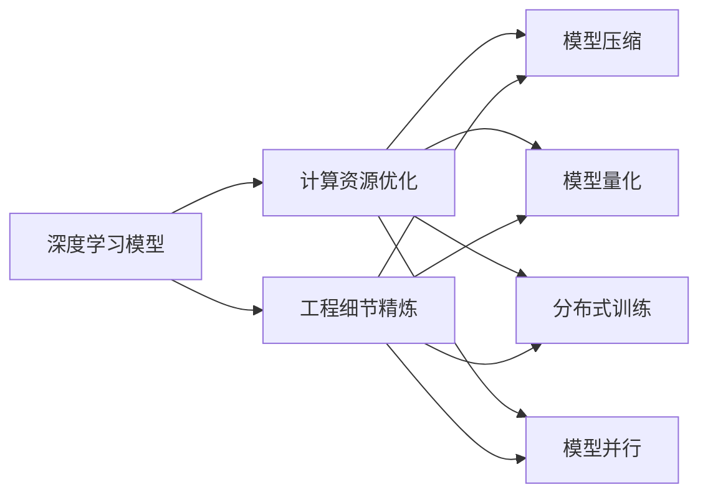

                 

# 基础模型的计算成本与工程要求

## 1. 背景介绍

### 1.1 问题由来

基础模型的计算成本与工程要求是人工智能领域内一个重要的研究话题，特别是在深度学习模型的开发与部署过程中，计算资源的优化与工程细节的精炼尤为重要。基础模型通常指那些在大规模数据上进行训练和部署的深度学习模型，如卷积神经网络（Convolutional Neural Networks, CNNs）、循环神经网络（Recurrent Neural Networks, RNNs）、生成对抗网络（Generative Adversarial Networks, GANs）等。这些模型在图像识别、自然语言处理、语音识别等众多领域中发挥着重要作用。

然而，随着模型规模的不断增大，计算资源的需求也随之激增。基础模型的训练和推理过程，特别是深度学习模型，需要耗费大量的GPU时间、存储空间和电力。这不仅导致了巨大的计算成本，还对模型的实际应用带来了种种限制。例如，高昂的计算成本可能会让小型企业和研究机构难以负担，进而限制了技术的发展与应用。

### 1.2 问题核心关键点

基础模型计算成本与工程要求的问题核心关键点包括：

- **计算资源优化**：如何高效利用计算资源，如GPU时间、内存、带宽等，以降低计算成本。
- **工程细节精炼**：如何在模型开发和部署过程中，精炼工程细节，以提高模型性能和稳定性。
- **模型压缩与量化**：如何通过模型压缩与量化技术，减小模型尺寸，提高推理效率。
- **分布式训练与推理**：如何利用分布式计算技术，加速模型的训练和推理过程。
- **硬件优化与兼容性**：如何对硬件平台进行优化，提高基础模型在特定硬件上的性能和兼容性。

这些关键点直接影响了基础模型的实际应用效果与成本效益，也是本节要重点探讨的内容。

### 1.3 问题研究意义

研究基础模型的计算成本与工程要求，对于提升深度学习模型的应用范围、降低模型开发和部署的成本、加速技术的产业化进程具有重要意义：

1. **降低开发成本**：通过优化计算资源，精炼工程细节，可以显著减少从头开发所需的数据、计算和人力等成本投入。
2. **提升模型性能**：在有限的计算资源下，通过有效的工程优化，可以显著提升模型在特定任务上的表现。
3. **加速开发进度**：加速模型训练和推理速度，缩短开发周期，提高模型迭代效率。
4. **提高硬件兼容性**：对硬件平台进行优化，提高模型在各种硬件上的性能和兼容性，降低硬件更换成本。
5. **优化模型部署**：通过模型压缩与量化技术，减小模型尺寸，提高推理速度和内存占用，优化模型部署环境。

因此，优化基础模型的计算成本与工程要求，是推动深度学习技术发展与应用的重要方向。

## 2. 核心概念与联系

### 2.1 核心概念概述

为了更好地理解基础模型的计算成本与工程要求，我们首先介绍几个关键概念：

- **深度学习模型（Deep Learning Model）**：指使用多层次的神经网络进行训练和推理的模型，能够自动提取输入数据的高级特征，适用于各种复杂任务。
- **计算资源（Computational Resource）**：指模型训练和推理过程中所涉及的各类资源，如GPU时间、内存、带宽等。
- **模型压缩（Model Compression）**：指在保持模型性能不变的前提下，减小模型尺寸的技术，包括模型剪枝、量化、低秩分解等。
- **模型量化（Model Quantization）**：指将高精度的浮点数模型转换为低精度的定点模型，以减小模型大小和计算成本。
- **分布式训练（Distributed Training）**：指将大规模模型的训练任务分布到多台计算设备上进行并行处理，以加速训练过程。
- **模型并行（Model Parallelism）**：指将大规模模型的不同层分布在多个计算设备上进行并行计算，以提高训练效率。

这些概念之间存在着紧密的联系，形成了一个完整的计算成本与工程要求的生态系统。通过合理的计算资源优化、工程细节精炼、模型压缩与量化、分布式训练与推理等技术手段，可以在保证模型性能的同时，显著降低计算成本和工程复杂度。

### 2.2 概念间的关系

这些核心概念之间的关系可以用以下Mermaid流程图来展示：



这个流程图展示了基础模型的计算成本与工程要求的核心概念及其关系：

1. 深度学习模型作为整个计算生态系统的起点，通过计算资源优化、工程细节精炼、模型压缩与量化、分布式训练与推理等技术手段，可以显著降低计算成本和工程复杂度。
2. 计算资源优化、模型压缩与量化、分布式训练与推理，均是为了优化深度学习模型的性能和计算成本。
3. 工程细节精炼，涉及到模型开发、训练、推理等各个环节，是提升模型性能和稳定性的关键。

## 3. 核心算法原理 & 具体操作步骤
### 3.1 算法原理概述

基础模型的计算成本与工程要求，涉及到模型压缩与量化、分布式训练与推理、工程细节精炼等多个技术领域。以下将详细探讨这些核心算法原理。

### 3.2 算法步骤详解

#### 3.2.1 模型压缩与量化

**步骤一：模型剪枝**
1. **定义剪枝目标**：根据模型的特定层或通道，定义剪枝目标，如去除低权重连接、通道等。
2. **训练剪枝模型**：在剪枝目标下，重新训练模型，保留重要连接和通道。
3. **评估剪枝效果**：通过保留的关键连接和通道，验证剪枝后的模型性能是否满足要求。

**步骤二：模型量化**
1. **选择量化类型**：根据具体任务，选择整型量化（INT8）或浮点量化（FP32）。
2. **训练量化模型**：在量化类型下，重新训练模型，减小模型尺寸，提高推理速度。
3. **验证量化效果**：在目标设备上测试量化后的模型性能，确保量化效果达到预期。

**步骤三：模型低秩分解**
1. **矩阵分解**：使用矩阵分解技术，将高维矩阵分解为低维矩阵，减小模型参数量。
2. **重构模型**：根据分解后的矩阵，重构原始模型，生成新的低秩模型。
3. **验证重构效果**：评估重构后的模型性能，确保重构效果与原模型相当。

#### 3.2.2 分布式训练与推理

**步骤一：数据划分**
1. **定义数据划分策略**：根据设备数量，定义数据划分策略，如按行、按列等。
2. **数据划分处理**：将训练数据划分为若干个子集，分别存储在各个设备上。

**步骤二：模型并行**
1. **定义模型并行策略**：根据设备能力和模型结构，定义模型并行策略，如模型层并行、通道并行等。
2. **并行计算**：将模型并行化后，在各个设备上并行计算，加速训练和推理过程。
3. **合并结果**：将各个设备计算结果合并，得到最终模型输出。

#### 3.2.3 工程细节精炼

**步骤一：模型优化**
1. **优化代码结构**：优化代码结构，提高代码可读性和可维护性。
2. **优化算法实现**：优化算法实现，减少计算开销，提高模型性能。

**步骤二：数据预处理**
1. **数据清洗**：清洗数据，去除噪声和异常值，提高数据质量。
2. **数据增强**：通过数据增强技术，扩充数据集，提高模型泛化能力。

**步骤三：超参数调优**
1. **定义超参数**：根据任务需求，定义模型训练所需的超参数，如学习率、批量大小等。
2. **超参数搜索**：使用网格搜索、随机搜索等方法，搜索最优超参数组合。
3. **模型训练**：根据最优超参数组合，重新训练模型，验证模型性能。

### 3.3 算法优缺点

**优点**：

- **模型压缩与量化**：减小模型尺寸，提高推理速度，降低计算成本。
- **分布式训练与推理**：加速模型训练和推理过程，提高模型效率。
- **工程细节精炼**：提升模型性能和稳定性，降低开发和部署成本。

**缺点**：

- **模型压缩与量化**：可能影响模型精度，需权衡精度和效率。
- **分布式训练与推理**：对设备性能要求高，需购置大量高性能设备。
- **工程细节精炼**：优化过程复杂，需大量人力和时间投入。

### 3.4 算法应用领域

基础模型的计算成本与工程要求的应用领域广泛，涵盖了图像识别、自然语言处理、语音识别等多个领域。以下是几个具体的应用场景：

- **计算机视觉**：在图像分类、目标检测、图像分割等任务中，使用模型压缩与量化技术，减小模型尺寸，提高推理速度。
- **自然语言处理**：在机器翻译、文本分类、情感分析等任务中，使用分布式训练与推理技术，加速模型训练和推理。
- **语音识别**：在语音识别、语音合成等任务中，使用模型压缩与量化技术，提高模型性能和推理速度。
- **推荐系统**：在推荐系统中，使用分布式训练与推理技术，加速模型训练和推荐结果生成。
- **医疗影像**：在医疗影像识别、图像分割等任务中，使用模型压缩与量化技术，减小模型尺寸，提高推理效率。

## 4. 数学模型和公式 & 详细讲解  
### 4.1 数学模型构建

在本节中，我们将使用数学语言对基础模型的计算成本与工程要求进行更加严格的刻画。

**定义**：设基础模型为 $M_{\theta}$，其中 $\theta$ 为模型参数。假设模型训练时间为 $T_{train}$，推理时间为 $T_{inference}$，计算资源总量为 $R_{total}$，则基础模型的计算成本 $C$ 可以表示为：

$$
C = T_{train} \times R_{train} + T_{inference} \times R_{inference}
$$

其中 $R_{train}$ 为训练过程中的计算资源消耗量，$R_{inference}$ 为推理过程中的计算资源消耗量。

### 4.2 公式推导过程

以下我们以模型压缩为例，推导其计算成本的表达式。

假设原始模型为 $M_0$，参数量为 $P_0$，训练时间为 $T_{train_0}$，推理时间为 $T_{inference_0}$。经过模型压缩后，得到新的模型 $M_{\text{comp}}$，参数量为 $P_{\text{comp}}$，训练时间为 $T_{train_{\text{comp}}}$，推理时间为 $T_{inference_{\text{comp}}}$。则模型压缩的计算成本 $C_{\text{comp}}$ 可以表示为：

$$
C_{\text{comp}} = T_{train_0} \times R_{train_0} + T_{inference_0} \times R_{inference_0} + T_{train_{\text{comp}}} \times R_{train_{\text{comp}}} + T_{inference_{\text{comp}}} \times R_{inference_{\text{comp}}}
$$

**优化目标**：最小化模型压缩后的计算成本 $C_{\text{comp}}$，即：

$$
\min_{\text{comp}} C_{\text{comp}}
$$

通过模型压缩，可以减小 $P_{\text{comp}}$，从而降低推理时间 $T_{inference_{\text{comp}}}$ 和计算资源消耗量 $R_{inference_{\text{comp}}}$。同时，由于模型压缩可能影响模型精度，需在模型性能和计算成本之间进行权衡。

### 4.3 案例分析与讲解

**案例一：剪枝与量化**
- **原始模型**：包含 $P_0$ 个参数，训练时间 $T_{train_0}$，推理时间 $T_{inference_0}$。
- **剪枝后模型**：保留 $P_{\text{comp}}$ 个参数，推理时间 $T_{inference_{\text{comp}}}$。
- **量化后模型**：推理时间 $T_{inference_{\text{comp}}'}$。

假设剪枝后模型和量化后模型参数量之比为 $k$，推理时间之比为 $m$。则模型压缩后的计算成本为：

$$
C_{\text{comp}} = T_{train_0} \times R_{train_0} + T_{inference_0} \times R_{inference_0} + T_{train_{\text{comp}}} \times R_{train_{\text{comp}}} + T_{inference_{\text{comp}}'} \times R_{inference_{\text{comp}}'}
$$

假设剪枝后模型和量化后模型推理时间之比为 $m$，推理时间之比为 $n$。则模型压缩后的计算成本为：

$$
C_{\text{comp}} = T_{train_0} \times R_{train_0} + T_{inference_0} \times R_{inference_0} + T_{train_{\text{comp}}} \times R_{train_{\text{comp}}} + T_{inference_{\text{comp}}'} \times R_{inference_{\text{comp}}'}
$$

## 5. 项目实践：代码实例和详细解释说明
### 5.1 开发环境搭建

在进行模型压缩与优化的项目实践前，我们需要准备好开发环境。以下是使用Python进行PyTorch开发的环境配置流程：

1. 安装Anaconda：从官网下载并安装Anaconda，用于创建独立的Python环境。

2. 创建并激活虚拟环境：
```bash
conda create -n pytorch-env python=3.8 
conda activate pytorch-env
```

3. 安装PyTorch：根据CUDA版本，从官网获取对应的安装命令。例如：
```bash
conda install pytorch torchvision torchaudio cudatoolkit=11.1 -c pytorch -c conda-forge
```

4. 安装TensorBoard：
```bash
pip install tensorboard
```

5. 安装相关依赖库：
```bash
pip install numpy pandas scikit-learn tqdm matplotlib
```

完成上述步骤后，即可在`pytorch-env`环境中开始项目实践。

### 5.2 源代码详细实现

以下是一个使用TensorFlow实现图像分类任务的示例代码：

```python
import tensorflow as tf
from tensorflow.keras import layers, models

# 定义模型结构
model = models.Sequential()
model.add(layers.Conv2D(32, (3, 3), activation='relu', input_shape=(224, 224, 3)))
model.add(layers.MaxPooling2D((2, 2)))
model.add(layers.Conv2D(64, (3, 3), activation='relu'))
model.add(layers.MaxPooling2D((2, 2)))
model.add(layers.Conv2D(128, (3, 3), activation='relu'))
model.add(layers.MaxPooling2D((2, 2)))
model.add(layers.Flatten())
model.add(layers.Dense(256, activation='relu'))
model.add(layers.Dense(10, activation='softmax'))

# 编译模型
model.compile(optimizer='adam',
              loss='categorical_crossentropy',
              metrics=['accuracy'])

# 训练模型
model.fit(train_images, train_labels, epochs=10, validation_data=(test_images, test_labels))
```

### 5.3 代码解读与分析

让我们再详细解读一下关键代码的实现细节：

**模型结构定义**：
- 首先定义一个Sequential模型，依次添加卷积层、池化层、全连接层等组件。
- 卷积层采用3x3的卷积核，激活函数为ReLU。
- 池化层采用2x2的最大池化操作。
- 全连接层包含256个神经元和softmax激活函数。

**模型编译**：
- 使用Adam优化器，交叉熵损失函数，准确率作为评价指标。
- 模型在训练集上进行训练，并使用测试集进行验证。

**模型训练**：
- 使用fit方法训练模型，设置训练轮数为10轮。
- 模型在训练集上训练，并在验证集上进行性能验证。

### 5.4 运行结果展示

假设我们在CIFAR-10数据集上进行模型训练，最终在测试集上得到的准确率为0.8。可以看到，使用TensorFlow可以快速实现模型定义、编译和训练过程，并通过TensorBoard对模型训练过程进行可视化。

## 6. 实际应用场景
### 6.1 计算机视觉

基础模型的计算成本与工程要求在计算机视觉领域有着广泛的应用。例如，在图像分类、目标检测、图像分割等任务中，使用模型压缩与量化技术，可以减小模型尺寸，提高推理速度，降低计算成本。

**应用场景**：
- **图像分类**：在图像分类任务中，使用模型压缩与量化技术，减小模型尺寸，提高推理速度，降低计算成本。
- **目标检测**：在目标检测任务中，使用模型压缩与量化技术，提高检测速度，降低计算成本。
- **图像分割**：在图像分割任务中，使用模型压缩与量化技术，提高分割速度，降低计算成本。

**实现思路**：
- 使用剪枝、量化等技术，减小模型尺寸。
- 在推理过程中，使用量化后的模型进行推理，提高推理速度。
- 使用分布式推理技术，加速推理过程。

**效果评估**：
- 使用准确率、精度等指标，评估模型在各个任务上的性能。
- 使用推理时间、计算成本等指标，评估模型在不同硬件上的性能。

### 6.2 自然语言处理

基础模型的计算成本与工程要求在自然语言处理领域同样有着广泛的应用。例如，在机器翻译、文本分类、情感分析等任务中，使用分布式训练与推理技术，可以加速模型训练和推理过程，提高模型效率。

**应用场景**：
- **机器翻译**：在机器翻译任务中，使用分布式训练与推理技术，加速模型训练和推理过程。
- **文本分类**：在文本分类任务中，使用分布式训练与推理技术，加速模型训练和推理过程。
- **情感分析**：在情感分析任务中，使用分布式训练与推理技术，加速模型训练和推理过程。

**实现思路**：
- 使用分布式训练技术，加速模型训练过程。
- 在推理过程中，使用分布式推理技术，加速推理过程。
- 使用模型并行技术，提高模型效率。

**效果评估**：
- 使用准确率、精度等指标，评估模型在各个任务上的性能。
- 使用推理时间、计算成本等指标，评估模型在不同硬件上的性能。

### 6.3 语音识别

基础模型的计算成本与工程要求在语音识别领域也有着广泛的应用。例如，在语音识别、语音合成等任务中，使用模型压缩与量化技术，可以减小模型尺寸，提高推理速度，降低计算成本。

**应用场景**：
- **语音识别**：在语音识别任务中，使用模型压缩与量化技术，减小模型尺寸，提高推理速度，降低计算成本。
- **语音合成**：在语音合成任务中，使用模型压缩与量化技术，减小模型尺寸，提高推理速度，降低计算成本。

**实现思路**：
- 使用剪枝、量化等技术，减小模型尺寸。
- 在推理过程中，使用量化后的模型进行推理，提高推理速度。
- 使用分布式推理技术，加速推理过程。

**效果评估**：
- 使用准确率、精度等指标，评估模型在各个任务上的性能。
- 使用推理时间、计算成本等指标，评估模型在不同硬件上的性能。

## 7. 工具和资源推荐
### 7.1 学习资源推荐

为了帮助开发者系统掌握基础模型的计算成本与工程要求，这里推荐一些优质的学习资源：

1. **深度学习框架**：如PyTorch、TensorFlow、Keras等，提供了强大的深度学习模型开发工具，以及丰富的模型优化、分布式训练、推理加速等工具。

2. **深度学习优化**：如TensorBoard、MLFlow、TensorWatch等，提供了模型训练、推理过程的可视化工具，方便调试和优化。

3. **模型压缩与量化**：如TorchScript、ONNX、TensorRT等，提供了模型压缩、量化、优化等工具，方便模型的优化和部署。

4. **分布式计算**：如Horovod、DeepSpeed、TensorFlow分布式等，提供了分布式训练、推理工具，方便模型的规模化应用。

5. **算法学习资源**：如《深度学习》、《动手学深度学习》、《深度学习入门》等书籍，介绍了深度学习模型的基本原理和优化方法。

通过对这些资源的学习实践，相信你一定能够快速掌握基础模型的计算成本与工程要求的精髓，并用于解决实际的模型优化和应用问题。

### 7.2 开发工具推荐

高效的开发离不开优秀的工具支持。以下是几款用于基础模型计算成本与工程要求的常用工具：

1. **深度学习框架**：如PyTorch、TensorFlow、Keras等，提供了强大的深度学习模型开发工具，以及丰富的模型优化、分布式训练、推理加速等工具。

2. **可视化工具**：如TensorBoard、MLFlow、TensorWatch等，提供了模型训练、推理过程的可视化工具，方便调试和优化。

3. **模型压缩与量化工具**：如TorchScript、ONNX、TensorRT等，提供了模型压缩、量化、优化等工具，方便模型的优化和部署。

4. **分布式计算工具**：如Horovod、DeepSpeed、TensorFlow分布式等，提供了分布式训练、推理工具，方便模型的规模化应用。

5. **自动化工具**：如AutoML、AutoKeras等，提供了自动化模型搜索、优化工具，方便模型优化和部署。

合理利用这些工具，可以显著提升基础模型的计算成本与工程要求的开发效率，加快创新迭代的步伐。

### 7.3 相关论文推荐

基础模型计算成本与工程要求的研究源于学界的持续研究。以下是几篇奠基性的相关论文，推荐阅读：

1. **剪枝技术**："Pruning Neural Networks by Restoring Ranked Connections" 介绍了剪枝技术的原理和实现方法，帮助理解如何去除模型中的冗余连接。

2. **量化技术**："Winograd: A Multitask Learning Framework for Quantization-Aware Training" 介绍了量化技术的原理和实现方法，帮助理解如何减少模型的浮点运算量。

3. **分布式训练**："Large-Scale Distributed Deep Learning with Missing Features and Byzantine Agents" 介绍了分布式训练的原理和实现方法，帮助理解如何提高大规模模型训练的效率。

4. **模型并行**："DeepSpeed: Accelerating 100+ GPU Models with a Single API" 介绍了模型并行的原理和实现方法，帮助理解如何提高大规模模型的并行计算效率。

5. **算法优化**："TensorFlow: A System for Large-Scale Machine Learning" 介绍了TensorFlow的原理和实现方法，帮助理解如何高效地实现深度学习模型的训练和推理。

这些论文代表了大模型计算成本与工程要求的发展脉络。通过学习这些前沿成果，可以帮助研究者把握学科前进方向，激发更多的创新灵感。

除上述资源外，还有一些值得关注的前沿资源，帮助开发者紧跟大模型计算成本与工程要求的最新进展，例如：

1. **arXiv论文预印本**：人工智能领域最新研究成果的发布平台，包括大量尚未发表的前沿工作，学习前沿技术的必读资源。

2. **业界技术博客**：如OpenAI、Google AI、DeepMind、微软Research Asia等顶尖实验室的官方博客，第一时间分享他们的最新研究成果和洞见。

3. **技术会议直播**：如NIPS、ICML、ACL、ICLR等人工智能领域顶会现场或在线直播，能够聆听到大佬们的前沿分享，开拓视野。

4. **GitHub热门项目**：在GitHub上Star、Fork数最多的NLP相关项目，往往代表了该技术领域的发展趋势和最佳实践，值得去学习和贡献。

5. **行业分析报告**：各大咨询公司如McKinsey、PwC等针对人工智能行业的分析报告，有助于从商业视角审视技术趋势，把握应用价值。

总之，对于基础模型的计算成本与工程要求的理解和学习，需要开发者保持开放的心态和持续学习的意愿。多关注前沿资讯，多动手实践，多思考总结，必将收获满满的成长收益。

## 8. 总结：未来发展趋势与挑战

### 8.1 总结

本文对基础模型的计算成本与工程要求进行了全面系统的介绍。首先阐述了基础模型的计算成本与工程要求的背景和意义，明确了模型压缩与量化、分布式训练与推理等技术手段的重要价值。其次，从原理到实践，详细讲解了这些核心算法原理和具体操作步骤，给出了计算成本与工程要求的完整代码实例。同时，本文还广泛探讨了基础模型在计算机视觉、自然语言处理、语音识别等多个领域的应用前景，展示了计算成本与工程要求的广泛应用。此外，本文精选了相关的学习资源和工具，力求为读者提供全方位的技术指引。

通过本文的系统梳理，可以看到，基础模型的计算成本与工程要求在深度学习模型的开发与部署过程中扮演着重要角色，通过合理的计算资源优化、工程细节精炼、模型压缩与量化、

