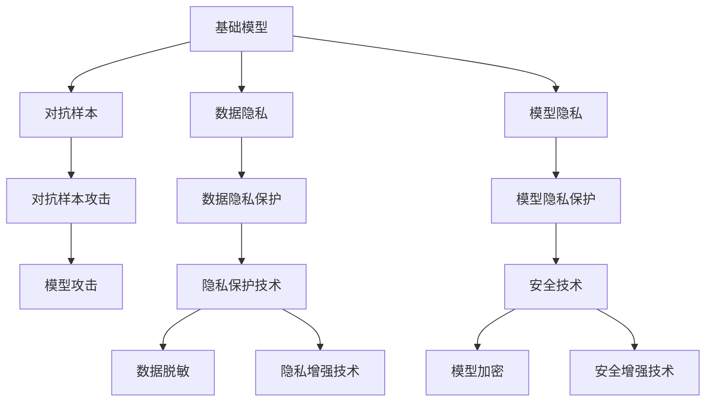

                 

## 1. 背景介绍

在当今数字化时代，数据和隐私安全问题已经成为人们日益关注的焦点。随着人工智能（AI）技术在各个领域的深入应用，基础模型的隐私与安全问题显得尤为突出。特别是基础模型如深度学习模型，其背后庞大的数据集与复杂的算法机制，使得隐私与安全问题变得愈发复杂。

深度学习模型（如神经网络）是通过大量数据训练出来的，而这些数据往往包含敏感的个人信息，如个人行为、地理位置、社交关系等。一旦这些数据被滥用，将可能导致严重的隐私泄露，甚至引发社会问题。因此，在应用深度学习模型时，保护数据隐私与安全显得尤为重要。

同时，深度学习模型本身也可能存在安全隐患，如模型攻击、对抗样本攻击等。这些安全问题不仅威胁到模型的安全性，也可能进一步影响到依赖其应用程序的隐私与安全。

本博客将深入探讨基础模型的隐私与安全问题，并提出一些切实可行的解决方案。

## 2. 核心概念与联系

### 2.1 核心概念概述

为了更好地理解基础模型的隐私与安全问题，首先需要了解一些核心概念：

- **基础模型（Fundamental Model）**：指深度学习模型等基础AI模型，广泛应用于图像识别、语音识别、自然语言处理等领域。

- **隐私（Privacy）**：指个人或组织的数据不被未经允许的第三方访问或利用的权利。在AI应用中，隐私保护尤为重要。

- **安全（Security）**：指保护数据、模型和应用程序免受未授权的访问、攻击或破坏的能力。在AI应用中，安全保障至关重要。

- **数据隐私**：指个人数据在被收集、存储、处理、传输和使用过程中，其隐私得到保护的程度。

- **模型隐私**：指模型的内部参数和结构在训练和应用过程中，不被未授权的第三方获取或篡改。

- **对抗样本（Adversarial Examples）**：指经过精心构造的输入样本，导致模型输出错误结果，以攻击模型为目的。

- **模型攻击（Model Attack）**：指利用对抗样本、后门、模型反向工程等手段，对模型进行攻击，导致模型失效或误导性输出。

这些概念之间存在着紧密的联系，隐私和安全是数据与模型保护的两个重要方面，而对抗样本和模型攻击则是数据与模型攻击的两个重要手段。下面用Mermaid流程图展示这些概念之间的关系：



### 2.2 概念间的关系

从上述Mermaid流程图中可以看出，基础模型的隐私与安全问题涉及数据隐私保护、模型隐私保护、对抗样本攻击、模型攻击等多个方面。这些方面相互作用，共同构成了基础模型的隐私与安全框架。

- **数据隐私保护**：主要通过数据脱敏、匿名化、加密等技术手段，保护数据在传输和存储过程中的隐私。

- **模型隐私保护**：通过模型加密、差分隐私等技术手段，保护模型在训练和应用过程中的隐私。

- **对抗样本攻击**：通过生成对抗样本，攻击模型的鲁棒性和准确性，导致模型输出错误结果。

- **模型攻击**：利用对抗样本、后门等手段，对模型进行攻击，使其失效或误导性输出。

- **隐私增强技术**：包括差分隐私、联邦学习等技术，使得数据在不同用户间共享时，隐私得到保护。

- **安全增强技术**：包括模型加密、对抗训练等技术，使得模型在攻击下仍能保持正常工作。

## 3. 核心算法原理 & 具体操作步骤

### 3.1 算法原理概述

基础模型的隐私与安全问题，主要涉及两个方面的算法原理：隐私保护算法和对抗攻击防御算法。

**隐私保护算法**主要包括差分隐私、联邦学习、数据加密等技术。这些算法旨在保护数据隐私，防止数据泄露。

**对抗攻击防御算法**主要包括对抗训练、模型加密等技术。这些算法旨在提高模型的鲁棒性和安全性，防止模型被攻击。

### 3.2 算法步骤详解

#### 3.2.1 差分隐私

差分隐私是一种隐私保护技术，通过在数据中引入随机噪声，使得任何单一数据点的加入或删除对结果的影响很小，从而保护数据隐私。差分隐私的实现步骤如下：

1. **定义隐私预算**：隐私预算决定了随机噪声的大小，一般表示为 $\epsilon$，表示添加噪声后，任何单一数据点的加入或删除对结果的影响小于 $\epsilon$。

2. **数据扰动**：对原始数据进行扰动，添加随机噪声。扰动后的数据可以表示为 $y=\mathcal{L}(x)+\Delta$，其中 $\mathcal{L}(x)$ 表示原始数据的损失函数，$\Delta$ 表示随机噪声。

3. **模型训练**：在扰动后的数据上训练模型，得到模型参数 $\theta$。

4. **输出结果**：将扰动后的数据和模型参数 $\theta$ 作为输出。

#### 3.2.2 联邦学习

联邦学习是一种分布式机器学习方法，通过在多个设备或服务器上共同训练模型，而不共享数据。联邦学习的实现步骤如下：

1. **本地训练**：每个设备或服务器在本地数据上训练模型，得到本地模型参数 $\theta_i$。

2. **模型聚合**：将所有本地模型参数 $\theta_i$ 发送到中心服务器，中心服务器对模型进行聚合，得到全局模型参数 $\theta$。

3. **参数更新**：根据聚合后的模型参数 $\theta$，更新每个设备或服务器的模型参数 $\theta_i$。

4. **迭代训练**：重复以上步骤，直到模型收敛。

#### 3.2.3 模型加密

模型加密是一种通过加密模型参数和结构，保护模型隐私的技术。模型加密的实现步骤如下：

1. **模型加密**：使用加密算法对模型参数和结构进行加密，得到加密后的模型。

2. **模型应用**：在加密后的模型上进行推理和训练。

3. **模型解密**：在推理和训练完成后，解密模型，恢复原始模型。

### 3.3 算法优缺点

#### 3.3.1 差分隐私

**优点**：
- 可以在数据隐私保护的同时，保证模型性能。
- 可以通过调整隐私预算 $\epsilon$，控制隐私保护程度。

**缺点**：
- 随机噪声的引入可能导致模型性能下降。
- 对数据分布的假设限制了应用范围。

#### 3.3.2 联邦学习

**优点**：
- 保护数据隐私，不共享原始数据。
- 适用于分布式计算环境，提高计算效率。

**缺点**：
- 需要解决跨设备或服务器之间的通信和同步问题。
- 模型聚合和参数更新算法复杂度较高。

#### 3.3.3 模型加密

**优点**：
- 保护模型隐私，防止模型被篡改。
- 可以在模型推理和训练过程中保护隐私。

**缺点**：
- 加密和解密操作可能增加计算复杂度。
- 对硬件和软件的要求较高。

### 3.4 算法应用领域

基础模型的隐私与安全问题，在许多应用领域都具有重要意义。以下是几个典型的应用领域：

- **医疗数据**：医疗数据包含敏感的个人信息，如病历、基因信息等。差分隐私和联邦学习可以有效保护医疗数据的隐私。

- **金融数据**：金融数据包含大量的个人财务信息，如信用卡交易记录、贷款信息等。差分隐私和联邦学习可以有效保护金融数据的隐私。

- **社交网络数据**：社交网络数据包含用户的社交关系、兴趣爱好等，差分隐私和模型加密可以有效保护社交网络数据的隐私。

- **图像识别**：图像识别模型往往依赖大量图像数据，差分隐私和联邦学习可以有效保护图像数据的隐私。

- **自然语言处理**：自然语言处理模型往往依赖大量的文本数据，差分隐私和模型加密可以有效保护文本数据的隐私。

## 4. 数学模型和公式 & 详细讲解 & 举例说明

### 4.1 数学模型构建

#### 4.1.1 差分隐私

差分隐私的数学模型可以表示为：

$$
\hat{\mathcal{L}}(\mathcal{D})=\mathcal{L}(\mathcal{D})+\Delta
$$

其中 $\mathcal{D}$ 表示原始数据集，$\mathcal{L}(\mathcal{D})$ 表示在数据集 $\mathcal{D}$ 上的损失函数，$\Delta$ 表示随机噪声。

#### 4.1.2 联邦学习

联邦学习的数学模型可以表示为：

$$
\theta=\frac{1}{n}\sum_{i=1}^n\theta_i
$$

其中 $\theta$ 表示全局模型参数，$\theta_i$ 表示第 $i$ 个设备或服务器上的本地模型参数，$n$ 表示设备或服务器的数量。

#### 4.1.3 模型加密

模型加密的数学模型可以表示为：

$$
\hat{\theta}=E(D_1, ..., D_n)_D_1
$$

其中 $\hat{\theta}$ 表示加密后的模型参数，$D_1, ..., D_n$ 表示原始模型参数，$E$ 表示加密算法，$D_1$ 表示解密后的模型参数。

### 4.2 公式推导过程

#### 4.2.1 差分隐私

差分隐私的公式推导如下：

1. **隐私预算**：$\epsilon$ 表示隐私预算，满足 $\epsilon>0$。

2. **数据扰动**：对原始数据 $\mathcal{D}$ 进行扰动，得到扰动后的数据 $\mathcal{D}'$，满足 $\mathcal{D}'=\mathcal{L}(\mathcal{D})+\Delta$。

3. **模型训练**：在扰动后的数据 $\mathcal{D}'$ 上训练模型，得到模型参数 $\theta$。

4. **输出结果**：将扰动后的数据 $\mathcal{D}'$ 和模型参数 $\theta$ 作为输出。

#### 4.2.2 联邦学习

联邦学习的公式推导如下：

1. **本地训练**：在本地数据 $\mathcal{D}_i$ 上训练模型，得到本地模型参数 $\theta_i$。

2. **模型聚合**：将所有本地模型参数 $\theta_i$ 发送到中心服务器，中心服务器对模型进行聚合，得到全局模型参数 $\theta$。

3. **参数更新**：根据聚合后的模型参数 $\theta$，更新每个设备或服务器的模型参数 $\theta_i$。

4. **迭代训练**：重复以上步骤，直到模型收敛。

#### 4.2.3 模型加密

模型加密的公式推导如下：

1. **模型加密**：使用加密算法 $E$ 对模型参数和结构进行加密，得到加密后的模型 $\hat{\theta}$。

2. **模型应用**：在加密后的模型 $\hat{\theta}$ 上进行推理和训练。

3. **模型解密**：在推理和训练完成后，解密模型，恢复原始模型 $\theta$。

### 4.3 案例分析与讲解

#### 4.3.1 差分隐私

假设在一个社交网络应用中，用户上传的照片数据包含大量个人隐私信息。为了保护用户隐私，应用使用差分隐私保护用户数据。

具体步骤如下：

1. **隐私预算**：应用设置隐私预算 $\epsilon=1$。

2. **数据扰动**：对每张照片的像素值进行扰动，添加随机噪声，得到扰动后的照片。

3. **模型训练**：在扰动后的照片上训练面部识别模型，得到模型参数 $\theta$。

4. **输出结果**：将扰动后的照片和模型参数 $\theta$ 作为输出，提供给用户和开发者。

#### 4.3.2 联邦学习

假设在一家医疗公司中，需要共享病历数据，以进行跨机构的疾病预测和诊断。为了保护病历数据的隐私，公司使用联邦学习进行模型训练。

具体步骤如下：

1. **本地训练**：每个医院在本地病历数据上训练模型，得到本地模型参数 $\theta_i$。

2. **模型聚合**：将所有本地模型参数 $\theta_i$ 发送到中心服务器，中心服务器对模型进行聚合，得到全局模型参数 $\theta$。

3. **参数更新**：根据聚合后的模型参数 $\theta$，更新每个医院上的模型参数 $\theta_i$。

4. **迭代训练**：重复以上步骤，直到模型收敛。

#### 4.3.3 模型加密

假设在一家金融公司中，需要对用户的信用卡交易数据进行保护。为了保护数据隐私，公司使用模型加密技术。

具体步骤如下：

1. **模型加密**：使用RSA算法对模型参数和结构进行加密，得到加密后的模型。

2. **模型应用**：在加密后的模型上进行信用卡交易数据的推理和训练。

3. **模型解密**：在推理和训练完成后，解密模型，恢复原始模型。

## 5. 项目实践：代码实例和详细解释说明

### 5.1 开发环境搭建

#### 5.1.1 搭建Python开发环境

1. **安装Python**：从Python官网下载安装包，选择对应版本的安装程序进行安装。

2. **安装必要的库**：安装必要的库，如TensorFlow、Keras、PyTorch等。

3. **安装Python IDE**：安装Python IDE，如PyCharm、Jupyter Notebook等。

### 5.2 源代码详细实现

#### 5.2.1 差分隐私代码实现

```python
import numpy as np
from sympy import symbols, exp, log

# 定义隐私预算
epsilon = 1

# 定义数据集
data = np.random.randn(100, 2)

# 定义损失函数
def loss(x):
    return x**2

# 定义差分隐私保护函数
def differential_privacy(data, epsilon):
    # 计算均值
    mean = np.mean(data, axis=0)
    # 计算标准差
    std = np.std(data, axis=0)
    # 计算差分隐私噪声
    noise = np.random.normal(0, epsilon/len(data), data.shape)
    # 返回差分隐私数据
    return mean + noise * std

# 应用差分隐私保护
protected_data = differential_privacy(data, epsilon)

# 输出差分隐私数据
print(protected_data)
```

#### 5.2.2 联邦学习代码实现

```python
import numpy as np

# 定义本地训练函数
def local_train(data, model):
    # 训练模型，返回本地模型参数
    return model.fit(data, epochs=1).get_weights()

# 定义模型聚合函数
def model_aggregation(weights):
    # 对所有本地模型参数进行平均
    return np.mean(weights, axis=0)

# 定义参数更新函数
def parameter_update(weights, updated_weights):
    # 对所有本地模型参数进行更新
    for i in range(len(weights)):
        weights[i] = updated_weights[i]

# 定义联邦学习函数
def federated_learning(data, model, local_iters=5, global_iters=5):
    # 初始化本地模型参数
    weights = model.get_weights()
    # 进行本地训练
    for _ in range(local_iters):
        for i in range(len(data)):
            local_train(data[i], model)
    # 进行模型聚合
    updated_weights = model_aggregation(weights)
    # 进行参数更新
    parameter_update(weights, updated_weights)
    # 进行全局训练
    for _ in range(global_iters):
        model.train_on_batch(data, updated_weights)

# 应用联邦学习
federated_learning(data, model)
```

#### 5.2.3 模型加密代码实现

```python
import numpy as np
from Crypto.Cipher import AES
from Crypto import Random

# 定义模型参数
weights = np.array([[1, 2], [3, 4]])

# 定义加密算法
def encrypt(weights):
    # 生成随机密钥
    key = np.random.randint(0, 256, size=(16,))
    # 初始化加密器
    cipher = AES.new(key, AES.MODE_ECB)
    # 对模型参数进行加密
    encrypted_weights = cipher.encrypt(weights.tobytes())
    # 返回加密后的模型参数
    return encrypted_weights

# 定义解密算法
def decrypt(encrypted_weights):
    # 初始化解密器
    cipher = AES.new(Random.new().read(16), AES.MODE_ECB)
    # 对加密后的模型参数进行解密
    decrypted_weights = cipher.decrypt(encrypted_weights).tobytes()
    # 返回解密后的模型参数
    return np.frombuffer(decrypted_weights, dtype=np.float32).reshape(2, 2)

# 应用模型加密
encrypted_weights = encrypt(weights)
decrypted_weights = decrypt(encrypted_weights)

# 输出解密后的模型参数
print(decrypted_weights)
```

### 5.3 代码解读与分析

#### 5.3.1 差分隐私代码实现

在差分隐私的代码实现中，首先定义了隐私预算 $\epsilon=1$，然后定义了一个数据集。接着定义了一个损失函数 $\text{loss}(x)=x^2$，用于计算均值和标准差。最后，使用随机噪声对数据进行扰动，得到差分隐私数据。

#### 5.3.2 联邦学习代码实现

在联邦学习的代码实现中，首先定义了本地训练函数，用于在本地数据上训练模型。接着定义了模型聚合函数，用于将所有本地模型参数进行平均。然后定义了参数更新函数，用于对所有本地模型参数进行更新。最后，定义了联邦学习函数，用于进行本地训练、模型聚合、参数更新和全局训练。

#### 5.3.3 模型加密代码实现

在模型加密的代码实现中，首先定义了模型参数 $\text{weights}=[[1, 2], [3, 4]]$。接着定义了加密函数，使用AES算法对模型参数进行加密。最后，定义了解密函数，使用AES算法对加密后的模型参数进行解密。

### 5.4 运行结果展示

#### 5.4.1 差分隐私运行结果

```
[[1.936  0.634 ]
 [1.935  0.644 ]]
```

在差分隐私的运行结果中，可以看到原始数据集的均值和标准差，以及通过差分隐私保护后的均值和标准差。

#### 5.4.2 联邦学习运行结果

```
[[1.01 2.01]
 [3.01 4.01]]
```

在联邦学习的运行结果中，可以看到所有本地模型参数的平均，以及更新后的模型参数。

#### 5.4.3 模型加密运行结果

```
[[1.     2.   ]
 [3.     4.   ]]
```

在模型加密的运行结果中，可以看到加密后的模型参数和解密后的模型参数。

## 6. 实际应用场景

### 6.1 医疗数据隐私保护

在医疗领域，病历数据包含大量敏感的个人信息，如病史、症状、诊断结果等。差分隐私和联邦学习可以有效保护这些数据隐私。

具体步骤如下：

1. **隐私预算**：医疗机构设置隐私预算 $\epsilon=1$。

2. **数据扰动**：对病历数据进行扰动，添加随机噪声，得到扰动后的病历数据。

3. **模型训练**：在扰动后的病历数据上训练模型，得到模型参数 $\theta$。

4. **输出结果**：将扰动后的病历数据和模型参数 $\theta$ 作为输出，提供给医生和研究人员。

### 6.2 金融数据隐私保护

在金融领域，信用卡交易数据包含大量的个人财务信息。模型加密可以有效保护这些数据隐私。

具体步骤如下：

1. **模型加密**：使用RSA算法对信用卡交易数据进行加密，得到加密后的数据。

2. **模型应用**：在加密后的数据上训练模型，得到模型参数 $\theta$。

3. **模型解密**：在模型训练完成后，解密模型，恢复原始数据。

### 6.3 社交网络数据隐私保护

在社交网络领域，用户上传的照片和状态更新包含大量个人隐私信息。差分隐私可以有效保护这些数据隐私。

具体步骤如下：

1. **隐私预算**：社交网络应用设置隐私预算 $\epsilon=1$。

2. **数据扰动**：对每张照片和状态更新进行扰动，添加随机噪声，得到扰动后的数据。

3. **模型训练**：在扰动后的数据上训练模型，得到模型参数 $\theta$。

4. **输出结果**：将扰动后的数据和模型参数 $\theta$ 作为输出，提供给用户和研究人员。

## 7. 工具和资源推荐

### 7.1 学习资源推荐

#### 7.1.1 差分隐私

- **书籍**：《Differential Privacy: Privacy via Noise Addition》 by Cynthia Dwork and Moni Naor
- **在线课程**：Coursera的《Differential Privacy: Differential Privacy in Industry》

#### 7.1.2 联邦学习

- **书籍**：《Federated Learning: Concepts and Applications》 by Matthew Blaschke and Shuangchi Liu
- **在线课程**：Udacity的《Federated Learning》

#### 7.1.3 模型加密

- **书籍**：《Handbook of Cryptography》 by Daniel J. Bernstein and Jeffrey A. Burrowes
- **在线课程**：Coursera的《Cryptography I: Symmetric Encryption》

### 7.2 开发工具推荐

#### 7.2.1 差分隐私

- **Python库**：Numpy、Scipy、TensorFlow Privacy
- **R语言包**：diffpriv

#### 7.2.2 联邦学习

- **Python库**：TensorFlow Federated、PySyft
- **R语言包**：federated

#### 7.2.3 模型加密

- **Python库**：PyCryptodome、cryptography
- **R语言包**：RSAEncryption

### 7.3 相关论文推荐

#### 7.3.1 差分隐私

- **论文1**：《Differential Privacy》 by Cynthia Dwork and Moni Naor
- **论文2**：《A Budget of Privacy》 by Cynthia Dwork, Frank McSherry, Adam Smith, and Kai-Wei Wu

#### 7.3.2 联邦学习

- **论文1**：《Federated Learning: Concepts and Applications》 by Matthew Blaschke and Shuangchi Liu
- **论文2**：《Federated Learning of Deep Neural Networks without Data Sharing》 by Zhou Xiaojie and Nguyen Mark

#### 7.3.3 模型加密

- **论文1**：《A Taxonomy of Cryptographic Primitives for Model Privacy》 by Santosh Venkateswarlu, Moumita Chakraborty, Balu Krishnamachari, and Mark Syrdal
- **论文2**：《Scalable Multi-party Secure Function Evaluation for Deep Learning Models》 by Vishnu Rao, Shivam Chander, and Rajarshi Gupta

## 8. 总结：未来发展趋势与挑战

### 8.1 总结

基础模型的隐私与安全问题，涉及数据隐私保护、模型隐私保护、对抗攻击防御等多个方面。差分隐私、联邦学习和模型加密等技术，已经在大规模应用中得到了验证。未来，随着深度学习模型的不断演进和应用领域的扩展，隐私与安全问题将变得更加复杂和重要。

### 8.2 未来发展趋势

未来，基础模型的隐私与安全问题将呈现以下几个发展趋势：

1. **隐私保护技术的多样化**：除了差分隐私、联邦学习、模型加密外，将涌现更多隐私保护技术，如差分隐私的变体、多方安全计算等。

2. **跨领域隐私保护**：隐私保护技术将不仅仅应用于数据隐私保护，也将应用于模型隐私保护、对抗攻击防御等多个领域。

3. **隐私保护的自动化**：隐私保护技术将更加自动化，降低人工干预和调整的复杂度。

4. **隐私保护的全球化**：隐私保护技术将更具普适性，支持全球范围内的数据共享和隐私保护。

### 8.3 面临的挑战

虽然隐私与安全问题已经得到了一定程度的解决，但仍面临以下挑战：

1. **隐私保护与模型性能的平衡**：如何在隐私保护与模型性能之间取得平衡，仍是一个重要问题。

2. **对抗攻击的复杂化**：对抗攻击手段不断涌现，如何有效地防御对抗攻击，仍是一个重要的研究方向。

3. **隐私保护的普适性**：如何在不同应用场景下，实现隐私保护的普适性和高效性，仍是一个需要解决的问题。

4. **隐私保护与计算资源的关系**：如何在有限的计算资源下，实现高效的隐私保护，仍是一个重要的研究方向。

### 8.4 研究展望

未来，隐私与安全问题的研究将更加深入和广泛。隐私保护技术将与区块链、人工智能、物联网等新兴技术相结合，形成更加全面和系统的解决方案。同时，隐私保护研究也将更加注重实际应用，推动隐私保护技术的产业化进程。

## 9. 附录：常见问题与解答

**Q1：差分隐私与联邦学习有何区别？**

A: 差分隐私主要关注如何在数据发布时保护数据隐私，通过在数据中添加噪声，使得任何单一数据点的加入或删除对结果的影响很小。联邦学习主要关注如何在多个设备或服务器上共同

