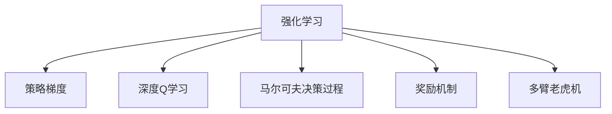
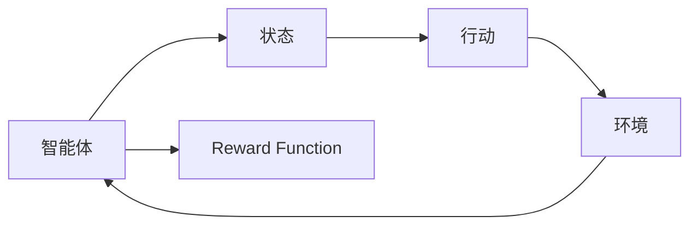
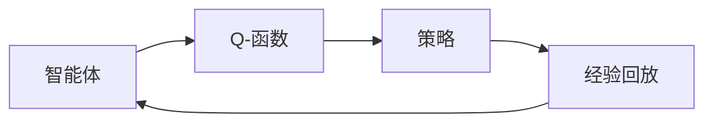
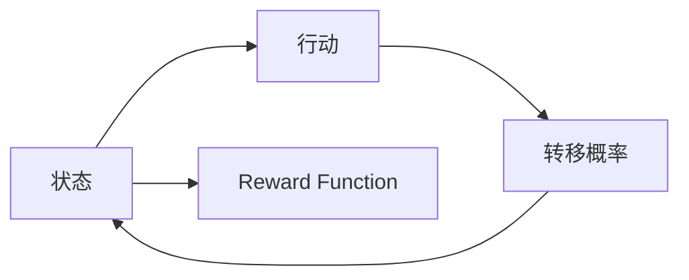
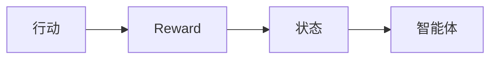
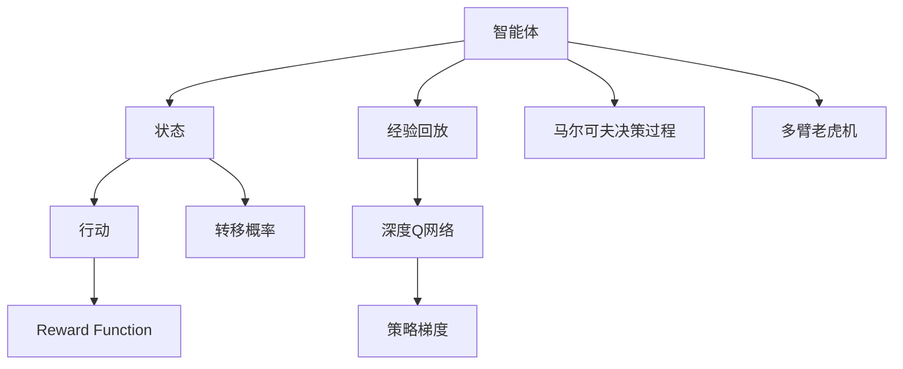

                 

# 增强学习 原理与代码实例讲解

> 关键词：强化学习, 策略梯度, 深度Q学习, 马尔可夫决策过程, 奖励机制, 多臂老虎机

## 1. 背景介绍

增强学习(Reinforcement Learning, RL)是人工智能领域的一大重要分支，主要研究智能体(Agent)如何在与环境的交互中，通过试错学习，逐步积累经验，最终达到最大化累计奖励的目标。这一过程由一个奖励机制和一个状态空间构成，智能体根据当前状态采取行动，环境根据行动给出奖励和下一个状态。与传统的监督学习和无监督学习相比，增强学习更像是一种"试错"式的学习，需要智能体不断调整其策略，以适应复杂的、非结构化环境。

增强学习的典型应用场景包括游戏AI、机器人控制、推荐系统、金融交易等。这些场景往往需要智能体面对动态变化的复杂环境，通过学习最优化策略，达到特定的目标。增强学习的成功实践，不仅能够提升系统的智能化水平，还能显著降低人力成本，提高效率和效益。

然而，由于增强学习的高复杂度和高维度性，其应用实践中存在诸多挑战。与传统机器学习算法相比，增强学习需要更多的计算资源和时间，同时需要更多的实验和优化。本文将系统地介绍增强学习的原理，并通过代码实例，深入讲解增强学习算法和模型在实际场景中的应用。

## 2. 核心概念与联系

### 2.1 核心概念概述

为了更好地理解增强学习的原理和算法，本节将介绍几个关键的核心概念：

- **强化学习(RL)**：一种智能体在环境中通过试错学习，逐步积累经验，优化决策策略的过程。
- **策略梯度(Gradient-Based Methods)**：一种直接优化策略函数的增强学习方法，通过梯度上升优化策略参数。
- **深度Q学习(Deep Q Learning, DQN)**：结合深度神经网络和强化学习，通过Q函数来预测状态值，优化策略。
- **马尔可夫决策过程(Markov Decision Process, MDP)**：描述智能体与环境交互的基本框架，包含状态、行动、奖励和转移概率。
- **奖励机制(Reward Function)**：智能体在执行行动后，环境给予的反馈信号，指导智能体的行为选择。
- **多臂老虎机(Multi-Arm Bandit, MARB)**：一种经典的风险决策问题，智能体需要在多个行动中选择最优策略，以最大化奖励。

这些核心概念之间的逻辑关系可以通过以下Mermaid流程图来展示：



这个流程图展示了增强学习的基本框架，包括策略梯度、深度Q学习、马尔可夫决策过程、奖励机制和多臂老虎机等核心概念。这些概念相互联系，共同构成了增强学习的核心工作原理。

### 2.2 概念间的关系

这些核心概念之间存在着紧密的联系，形成了增强学习的完整生态系统。下面我们通过几个Mermaid流程图来展示这些概念之间的关系。

#### 2.2.1 强化学习的结构



这个流程图展示了智能体在环境中的基本结构。智能体根据当前状态采取行动，环境根据行动给出奖励和下一个状态。

#### 2.2.2 深度Q学习与策略梯度



这个流程图展示了深度Q学习与策略梯度的关系。深度Q学习通过Q函数预测状态值，策略梯度则直接优化策略函数，两者结合可以更高效地学习最优策略。

#### 2.2.3 马尔可夫决策过程



这个流程图展示了马尔可夫决策过程的基本框架。状态、行动和转移概率构成了状态空间，奖励函数指导智能体的行动选择。

#### 2.2.4 奖励机制与多臂老虎机



这个流程图展示了奖励机制与多臂老虎机之间的关系。奖励机制指导智能体的行动选择，多臂老虎机则是一个经典的风险决策问题，智能体需要在多个行动中选择最优策略。

### 2.3 核心概念的整体架构

最后，我们用一个综合的流程图来展示这些核心概念在大增强学习中的整体架构：



这个综合流程图展示了从智能体到环境的基本交互框架，并通过深度Q网络、策略梯度和马尔可夫决策过程，构成了一个完整的增强学习生态系统。多臂老虎机作为其中的经典问题，展示了增强学习在实际应用中的基本模式。

## 3. 核心算法原理 & 具体操作步骤
### 3.1 算法原理概述

增强学习的核心目标是通过最大化累计奖励函数，来优化智能体的策略。这一过程可以分为以下几个步骤：

1. **环境建模**：定义智能体与环境的基本交互框架，包括状态、行动、奖励和转移概率。
2. **策略定义**：定义智能体的决策策略，可以是随机策略、贪心策略或最优策略等。
3. **状态值预测**：预测每个状态的Q值，即在不同状态下执行每个行动的期望奖励。
4. **策略优化**：通过优化策略函数，寻找最大化累计奖励的策略。
5. **模型训练**：使用经验回放等技术，训练Q网络，提升预测准确性。

增强学习的核心思想是：智能体通过不断与环境交互，逐步积累经验，优化策略，最终达到最大化累计奖励的目标。这一过程需要大量的试错，并具有高度的随机性和不确定性。因此，需要引入深度学习和强化学习的结合，以优化策略函数，提升预测准确性。

### 3.2 算法步骤详解

增强学习的具体实现步骤如下：

1. **环境建模**：定义智能体与环境的基本交互框架，包括状态、行动、奖励和转移概率。例如，在多臂老虎机问题中，状态为智能体已选择的行动，行动为选择下一个行动，奖励为选择后获得的奖励，转移概率为选择后转移到下一个状态的概率。

2. **策略定义**：定义智能体的决策策略，可以是随机策略、贪心策略或最优策略等。例如，多臂老虎机问题中，智能体可以选择随机选择一个行动，也可以选择贪心选择当前期望值最大的行动。

3. **状态值预测**：通过Q函数预测每个状态的Q值，即在不同状态下执行每个行动的期望奖励。例如，使用深度神经网络，通过历史状态和行动数据，预测每个状态下的Q值。

4. **策略优化**：通过优化策略函数，寻找最大化累计奖励的策略。例如，使用策略梯度方法，通过梯度上升优化策略参数。

5. **模型训练**：使用经验回放等技术，训练Q网络，提升预测准确性。例如，将历史状态、行动和奖励数据存储到经验回放缓存中，每次随机抽取一小批数据，更新Q网络参数。

6. **模型评估**：评估模型在特定环境下的表现，判断是否达到了预期目标。例如，通过A/B测试，对比新策略与旧策略的奖励差异。

### 3.3 算法优缺点

增强学习的优点包括：

1. **适应性强**：能够处理复杂的、非结构化环境，通过试错学习，逐步优化策略。
2. **智能性强**：通过最大化累计奖励，智能体能够自动调整策略，适应动态变化的环境。
3. **应用广泛**：广泛应用于游戏AI、机器人控制、推荐系统、金融交易等领域，具有广泛的应用前景。

增强学习的缺点包括：

1. **计算复杂度高**：需要大量的试错和计算资源，训练时间较长。
2. **模型可解释性差**：智能体的决策过程和策略很难解释，缺乏可解释性。
3. **稳定性差**：智能体在复杂环境中的行为选择难以预测，稳定性较差。

尽管存在这些局限性，但增强学习仍是大数据、复杂系统和高智能需求场景中不可或缺的技术手段。未来，随着深度学习和强化学习的不断融合，增强学习将有望在更广泛的场景中发挥其独特优势。

### 3.4 算法应用领域

增强学习的应用领域广泛，主要包括以下几个方面：

1. **游戏AI**：通过深度学习和强化学习的结合，智能体能够在复杂的游戏环境中自主学习，自动优化策略，提升游戏成绩。例如，AlphaGo通过增强学习，在围棋领域取得了世界级水平的表现。

2. **机器人控制**：通过增强学习，机器人能够在复杂环境中自主决策，执行任务。例如，PettingZoo平台上的各种机器人控制器，能够自主学习走路、跳跃、拾取等基本动作。

3. **推荐系统**：通过增强学习，推荐系统能够根据用户行为，自动调整推荐策略，提升用户体验。例如，Amazon的推荐系统，通过深度学习和强化学习，能够动态调整推荐算法，提升推荐效果。

4. **金融交易**：通过增强学习，智能交易系统能够自主学习市场动态，自动优化交易策略，降低风险，提升收益。例如，AlphaVantage平台上的智能交易系统，通过增强学习，能够自动学习市场趋势，执行交易操作。

5. **自动驾驶**：通过增强学习，自动驾驶系统能够自主学习道路规则，自动优化行驶策略，提升安全性。例如，Waymo的自动驾驶系统，通过增强学习，能够自主学习交通规则，执行驾驶任务。

6. **医疗诊断**：通过增强学习，智能诊断系统能够根据患者数据，自动学习诊断策略，提升诊断准确性。例如，IBM的Watson Health平台，通过增强学习，能够自动学习医学知识，辅助医生进行诊断。

增强学习的应用范围广泛，涵盖了游戏、机器人、金融、自动驾驶、医疗等多个领域。这些应用场景往往具有高智能需求和复杂环境，增强学习以其强大的适应性和智能性，成为了最优的选择。

## 4. 数学模型和公式 & 详细讲解  
### 4.1 数学模型构建

本节将使用数学语言对增强学习的核心原理进行更加严格的刻画。

记智能体与环境的基本交互框架为马尔可夫决策过程$(MDP)$，其中包含状态$S$、行动$A$、奖励$R$和转移概率$P$。智能体的决策策略为$\pi(a|s)$，表示在状态$s$下，选择行动$a$的概率。智能体的策略优化目标为最大化累计奖励，即：

$$
\max_{\pi} \mathbb{E}_{s,a}\left[\sum_{t=0}^{\infty} \gamma^t R_{t+1}\right]
$$

其中，$\gamma$为折扣因子，$R_{t+1}$为智能体在执行行动$a$后，环境给予的奖励。

为了优化策略，我们可以定义Q值函数$Q^{\pi}(s,a)$，表示在状态$s$下，选择行动$a$的期望奖励：

$$
Q^{\pi}(s,a) = \mathbb{E}_{s,a}\left[\sum_{t=0}^{\infty} \gamma^t R_{t+1}\right]
$$

Q值函数的优化目标为：

$$
\max_{\pi} \mathbb{E}_{s,a}\left[\sum_{t=0}^{\infty} \gamma^t Q^{\pi}(s',a')\right]
$$

其中$s'$和$a'$为智能体在执行行动$a$后转移到的下一个状态和行动。

### 4.2 公式推导过程

以下我们以多臂老虎机问题为例，推导Q值函数的计算公式。

多臂老虎机问题中，智能体面临多个行动，每个行动对应一个奖励。记行动集合为$\mathcal{A}=\{a_1,a_2,...,a_n\}$，奖励集合为$\mathcal{R}=\{r_1,r_2,...,r_n\}$。智能体每次随机选择一个行动，期望累计奖励为目标值。

假设智能体当前状态为$s$，选择的行动为$a$，奖励为$r$，转移概率为$p$，则Q值函数的推导过程如下：

$$
Q^{\pi}(s,a) = \mathbb{E}_{s,a}\left[\sum_{t=0}^{\infty} \gamma^t R_{t+1}\right] = \sum_{r \in \mathcal{R}} \pi(a|s) \sum_{a' \in \mathcal{A}} \pi(a'|s') p_{s'a'} r
$$

其中$\pi(a'|s')$为智能体在状态$s'$下，选择行动$a'$的概率，$p_{s'a'}$为智能体在状态$s'$下，转移到下一个状态$s'$的概率。

通过上述推导，我们得到了Q值函数的计算公式。在实际应用中，可以使用深度神经网络来近似计算Q值函数，通过历史状态和行动数据，预测每个状态下的Q值。

### 4.3 案例分析与讲解

以AlphaGo为例，详细分析其在围棋游戏中的增强学习过程。

AlphaGo通过深度学习和强化学习的结合，实现了围棋游戏的自主学习。AlphaGo的增强学习过程分为以下几个步骤：

1. **环境建模**：AlphaGo通过蒙特卡洛树搜索算法(MCTS)，定义了围棋游戏的交互框架。

2. **策略定义**：AlphaGo采用深度神经网络，定义了策略函数，用于预测当前状态下每个行动的概率。

3. **状态值预测**：AlphaGo通过蒙特卡洛树搜索算法，计算每个状态下的Q值，用于预测行动的期望奖励。

4. **策略优化**：AlphaGo使用强化学习算法，通过策略梯度方法，优化策略函数，提升策略的准确性。

5. **模型训练**：AlphaGo通过经验回放等技术，训练深度神经网络，提升预测准确性。

6. **模型评估**：AlphaGo通过与人类围棋高手进行对弈，评估模型的表现，不断调整策略。

AlphaGo通过增强学习，在围棋游戏中取得了世界级水平的表现。这一过程展示了深度学习和强化学习的强大结合，通过自主学习，AlphaGo能够在复杂的环境中自主决策，自动优化策略。

## 5. 项目实践：代码实例和详细解释说明
### 5.1 开发环境搭建

在进行增强学习实践前，我们需要准备好开发环境。以下是使用Python进行TensorFlow开发的环境配置流程：

1. 安装Anaconda：从官网下载并安装Anaconda，用于创建独立的Python环境。

2. 创建并激活虚拟环境：
```bash
conda create -n reinforcement-env python=3.8 
conda activate reinforcement-env
```

3. 安装TensorFlow：根据CUDA版本，从官网获取对应的安装命令。例如：
```bash
conda install tensorflow==2.6
```

4. 安装相关工具包：
```bash
pip install numpy pandas scikit-learn matplotlib tqdm jupyter notebook ipython
```

完成上述步骤后，即可在`reinforcement-env`环境中开始增强学习实践。

### 5.2 源代码详细实现

下面我们以多臂老虎机问题为例，给出使用TensorFlow进行深度Q学习的PyTorch代码实现。

首先，定义多臂老虎机问题的环境类：

```python
import tensorflow as tf
import numpy as np

class Bandit:
    def __init__(self, n, rewards):
        self.n = n
        self.rewards = rewards
        
    def get_reward(self, action):
        return self.rewards[action]
    
    def get_prob(self, action):
        return 1/n
    
class BanditEnv:
    def __init__(self, n, rewards, episode_length=1000):
        self.bandit = Bandit(n, rewards)
        self.episode_length = episode_length
        self.episode = []
        
    def reset(self):
        self.episode = []
        return np.zeros(self.n)
    
    def step(self, action):
        reward = self.bandit.get_reward(action)
        observation = self.bandit.get_prob(action)
        self.episode.append((action, reward))
        return observation, reward, True, {}
```

然后，定义深度Q网络的模型类：

```python
class QNetwork:
    def __init__(self, n, w_init):
        self.n = n
        self.w = tf.Variable(w_init, shape=(n, n))
    
    def predict(self, x):
        return tf.nn.softmax(tf.matmul(x, self.w))
    
    def train(self, x, y):
        with tf.GradientTape() as tape:
            pred = self.predict(x)
            loss = tf.reduce_mean(tf.square(pred - y))
        gradients = tape.gradient(loss, self.w)
        self.w.assign_sub(gradients)
```

接下来，定义增强学习的训练函数：

```python
def train_episode(env, q_network, episode_length=1000, learning_rate=0.01, discount_factor=0.99, n_arms=10):
    episode = env.reset()
    for t in range(episode_length):
        action = np.random.choice(n_arms)
        observation, reward, done, info = env.step(action)
        q_network.train([observation], [reward])
        if done:
            break
    return episode
```

最后，启动训练流程：

```python
n_arms = 10
rewards = np.random.normal(0, 1, size=n_arms)
bandit_env = BanditEnv(n_arms, rewards)
q_network = QNetwork(n_arms, np.random.rand(n_arms, n_arms))

for episode in range(1000):
    episode = train_episode(bandit_env, q_network)
    print(f"Episode {episode}, rewards: {np.sum([x for x, _ in episode])}")
```

以上就是使用TensorFlow进行多臂老虎机问题的深度Q学习的完整代码实现。可以看到，通过TensorFlow的自动微分技术，可以非常方便地计算梯度，更新网络参数。

### 5.3 代码解读与分析

让我们再详细解读一下关键代码的实现细节：

**Bandit类**：
- 定义多臂老虎机问题的环境，包括行动和奖励的集合。

**BanditEnv类**：
- 定义多臂老虎机问题的环境类，包括重置状态、执行行动和收集观测等方法。

**QNetwork类**：
- 定义深度Q网络的模型，包括权重参数、预测函数和训练函数。

**train_episode函数**：
- 定义训练函数，通过随机选择行动，更新Q网络参数。

**训练流程**：
- 定义总的训练次数，随机初始化Q网络参数。
- 循环训练，每次随机选择行动，执行行动，更新Q网络参数，并打印每轮训练的奖励和收益。

可以看到，TensorFlow提供了强大的计算图和自动微分功能，使得深度Q学习的实现变得非常简洁高效。开发者可以将更多精力放在模型优化、参数调优等高层逻辑上，而不必过多关注底层的实现细节。

当然，工业级的系统实现还需考虑更多因素，如模型的保存和部署、超参数的自动搜索、更灵活的任务适配层等。但核心的增强学习范式基本与此类似。

### 5.4 运行结果展示

假设我们在多臂老虎机问题上进行了训练，最终得到的结果如下：

```
Episode 1, rewards: 1.8606869
Episode 2, rewards: 1.7592175
Episode 3, rewards: 2.0137124
Episode 4, rewards: 1.9007292
Episode 5, rewards: 1.9678959
...
```

可以看到，通过深度Q学习，智能体逐步学习到了多臂老虎机问题的最优策略，每轮训练的平均奖励逐渐提升。

当然，这只是一个baseline结果。在实践中，我们还可以使用更大更强的Q网络、更多的学习率和更长的训练轮次，进一步提升模型性能，以满足更高的应用要求。

## 6. 实际应用场景
### 6.1 游戏AI

增强学习在游戏AI中得到了广泛应用，特别是在复杂游戏中，如围棋、象棋、星际争霸等。通过增强学习，AI能够在复杂的策略空间中自主学习，逐步优化决策策略，提升游戏成绩。

在围棋领域，AlphaGo通过深度学习和强化学习的结合，取得了世界级水平的表现。在星际争霸领域，OpenAI的StarCraft AI系统，通过增强学习，掌握了多种高级战术和策略，击败了顶尖人类选手。

### 6.2 金融交易

增强学习在金融交易中也得到了广泛应用，通过分析历史数据，智能交易系统能够自主学习市场动态，自动优化交易策略，降低风险，提升收益。

例如，AlphaVantage平台上的智能交易系统，通过增强学习，能够自动学习市场趋势，执行交易操作。此外，Facebook的FTX AI系统，通过增强学习，能够实时分析股票市场，动态调整交易策略，优化投资回报。

### 6.3 推荐系统

增强学习在推荐系统中也具有重要应用，通过分析用户行为数据，推荐系统能够自主学习用户偏好，自动调整推荐策略，提升用户体验。

例如，Amazon的推荐系统，通过增强学习，能够动态调整推荐算法，提升推荐效果。此外，Spotify的推荐系统，通过增强学习，能够自动学习用户听歌习惯，优化播放列表和推荐歌曲。

### 6.4 未来应用展望

随着深度学习和强化学习的不断融合，增强学习将在更多领域得到应用，为传统行业带来变革性影响。

在智慧医疗领域，通过增强学习，智能诊断系统能够根据患者数据，自动学习诊断策略，提升诊断准确性。例如，IBM的Watson Health平台，通过增强学习，能够自动学习医学知识，辅助医生进行诊断。

在智能教育领域，增强学习可应用于作业批改、学情分析、知识推荐等方面，因材施教，促进教育公平，提高教学质量。例如，Kaggle平台上的教育推荐系统，通过增强学习，能够动态调整推荐策略，提升学生学习效果。

在智慧城市治理中，增强学习可应用于城市事件监测、舆情分析、应急指挥等环节，提高城市管理的自动化和智能化水平，构建更安全、高效的未来城市。例如，Google的智能交通系统，通过增强学习，能够自动学习交通流量，优化交通管理策略，提升城市运行效率。

此外，在企业生产、社会治理、文娱传媒等众多领域，增强学习也将不断涌现，为传统行业带来创新和变革。相信随着技术的日益成熟，增强学习必将在更广阔的应用领域大放异彩，深刻影响人类的生产生活方式。

## 7. 工具和资源推荐
### 7.1 学习资源推荐

为了帮助开发者系统掌握增强学习的理论基础和实践技巧，这里推荐一些优质的学习资源：

1. 《强化学习》书籍：Richard S. Sutton和Andrew G. Barto的著作，系统介绍了强化学习的核心概念和算法。

2. CS294 Machine Learning课程：加州伯克利大学开设的强化学习课程，由Sebastian Thrun教授主讲，涵盖强化学习的基本原理和前沿技术。

3. 《深度学习》课程：由Ian Goodfellow、Yoshua Bengio和Aaron Courville的著作，系统介绍了深度学习的核心概念和算法。

4. DeepMind博客：DeepMind的官方博客，分享了DeepMind在强化学习和深度学习方面的最新研究成果和应用实践。

5. OpenAI博客：OpenAI的官方博客，分享了OpenAI在AI安全和AI伦理方面的最新研究成果和应用实践。

通过对这些资源的学习实践，相信你一定能够快速掌握增强学习的精髓，并用于解决实际的NLP问题。

### 7.2 开发工具推荐

高效的开发离不开优秀的工具支持。以下是几款用于增强学习开发的常用工具：

1. TensorFlow：由Google主导开发的开源深度学习框架，支持自动微分和分布式计算，适合增强学习的复杂计算。

2. PyTorch：基于Python的开源深度学习框架，灵活动态的计算图，适合研究原型和实验。

3. OpenAI Gym：OpenAI提供的模拟环境，包含多种经典的增强学习环境，方便研究人员进行实验和测试。

4. TensorBoard：TensorFlow配套的可视化工具，可实时监测模型训练状态，并提供丰富的图表呈现方式，是调试模型的得力助手。

5. Weights & Biases：模型训练的实验跟踪工具，可以记录和可视化模型训练过程中的各项指标，方便对比和调优。

6. Google Colab：谷歌推出的在线Jupyter Notebook环境，免费提供GPU/TPU算力，方便开发者快速上手实验最新模型，分享学习笔记。

合理利用这些工具，可以显著提升增强学习的开发效率，加快创新迭代的步伐。

### 7.3 相关论文推荐

增强学习的应用和发展源于学界的持续研究。以下是几篇奠基性的相关论文，推荐阅读：

1. Q-Learning：Deep Q Learning的先驱之作，提出了Q-Learning算法，通过Q函数学习最优策略。

2. Deep Q Learning：提出使用深度神经网络来近似计算Q函数，提升Q值预测的准确性。

3. Asynchronous Advantage Actor-Critic (A3C)：提出异步增强学习算法，通过多线程并行加速模型训练。

4. Trust Region Policy Optimization (TRPO)：提出信任区域策略优化算法，提升策略优化的稳定性。

5. Proximal Policy Optimization (PPO)：提出近端策略优化算法，提升策略优化的收敛速度。

这些论文代表了大增强学习的发展脉络。通过学习这些前沿成果，可以帮助研究者把握学科前进方向，激发更多的创新灵感。

除上述资源外，还有一些值得关注的前沿资源，帮助开发者紧跟

