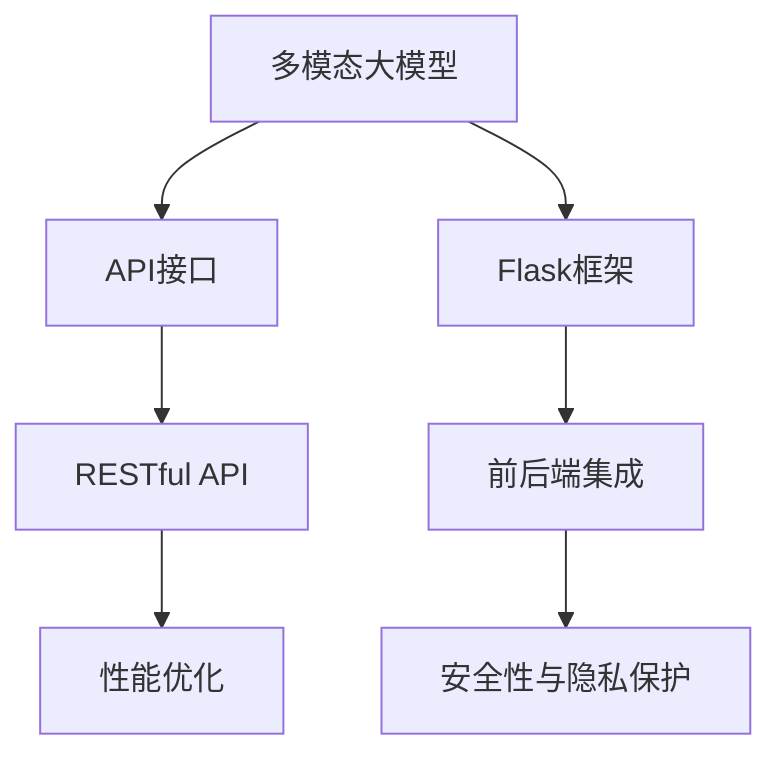

                 

# 多模态大模型：技术原理与实战 使用Flask框架进行API开发

> 关键词：多模态大模型,Flask框架,API开发,技术原理,实战

## 1. 背景介绍

### 1.1 问题由来

近年来，随着深度学习技术的快速发展，多模态大模型（Multimodal Large Models, MLMs）在计算机视觉（CV）、自然语言处理（NLP）和音频信号处理（ASP）等跨模态领域取得了显著的进步。MLMs 通过联合学习多模态数据的表示，能够更准确地捕捉不同模态数据之间的关系，从而在诸如跨模态检索、图像描述生成、语音识别等任务中取得卓越的效果。

然而，这些多模态模型通常具有巨大的参数量和计算需求，对硬件资源的要求较高。因此，如何快速搭建、部署和使用这些模型，成为当前研究的一个热点问题。API（应用程序接口）作为一种标准化的数据交换方式，能够降低模型使用门槛，使得更多的开发者能够方便地访问和使用多模态大模型。

### 1.2 问题核心关键点

为了快速开发和部署多模态大模型，需要考虑以下几个核心问题：

- **API接口设计**：如何设计友好的API接口，使得用户可以轻松地调用多模态大模型进行推理计算。
- **前后端集成**：如何有效地将前端应用和后端模型集成在一起，确保数据流通和计算顺畅。
- **性能优化**：如何在保证API接口响应速度的同时，兼顾模型的准确性和效率。
- **安全性与隐私保护**：如何确保API接口的安全性，保护用户数据不被滥用。

本文将深入探讨如何使用Flask框架来构建多模态大模型的API接口，并详细介绍相关的技术原理和实践技巧。通过系统地讲解API开发的核心步骤和实际应用场景，旨在帮助开发者轻松掌握API开发的精髓，提升模型部署和使用的便利性。

### 1.3 问题研究意义

API接口作为连接前端应用和后端模型的桥梁，在提升多模态大模型可访问性和易用性方面起着至关重要的作用。通过API接口，用户可以随时随地获取模型的预测结果，促进多模态大模型的广泛应用和普及。因此，本文的研究具有以下重要意义：

- **提升模型应用便利性**：提供简单易用的API接口，使得开发者和终端用户能够快速上手使用多模态大模型。
- **促进跨模态融合**：通过API接口，实现多模态数据的高效融合和处理，推动跨模态信息技术的融合与创新。
- **加速技术产业化进程**：API接口的开发和部署，能够加速多模态大模型的商业化应用，推动相关技术在各行各业落地。

## 2. 核心概念与联系

### 2.1 核心概念概述

为更好地理解多模态大模型API接口的设计与实现，本节将介绍几个关键概念：

- **多模态大模型**：指同时处理图像、文本、音频等多种模态数据的深度学习模型，如COCO-ML、Vit-BERT等。
- **API接口**：指提供给开发者或用户进行数据交互的标准接口，通过HTTP请求等方式，实现前端应用与后端服务的通信。
- **Flask框架**：一种Python Web应用框架，支持快速搭建Web应用和API接口，是构建多模态大模型API接口的理想选择。
- **RESTful API**：一种遵循REST架构风格的API设计原则，强调接口的资源表示、无状态通信和语义明确性。

这些概念之间的联系紧密，共同构成了多模态大模型API接口的设计与实现基础。通过理解这些概念，我们可以更好地把握API接口的工作原理和优化方向。

### 2.2 概念间的关系

这些核心概念之间存在着紧密的联系，形成了多模态大模型API接口的整体架构。下面通过几个Mermaid流程图来展示这些概念之间的关系。



这个流程图展示了从多模态大模型到API接口的整个设计过程：

1. 多模态大模型通过预训练或微调获得特定任务能力。
2. 利用Flask框架，构建友好的API接口，实现模型的访问。
3. 使用RESTful API设计原则，定义接口的资源表示和通信方式。
4. 前后端集成，确保数据流通和计算顺畅。
5. 性能优化，保证接口响应速度和模型效率。
6. 安全性与隐私保护，保障数据和模型安全。

通过这些流程图，我们可以更清晰地理解多模态大模型API接口的设计流程和实现细节。

## 3. 核心算法原理 & 具体操作步骤
### 3.1 算法原理概述

多模态大模型的API接口设计，本质上是一种将复杂模型转化为易于使用服务的过程。其核心思想是将多模态大模型的推理计算封装成一组标准的API接口，用户可以通过简单的HTTP请求，轻松地调用模型进行推理预测。

API接口的设计和实现包括以下几个关键步骤：

1. **接口设计**：定义接口的资源路径、请求方法、参数格式、返回结果等。
2. **前后端集成**：实现模型推理计算的后端服务，并将API接口与前端应用集成。
3. **性能优化**：优化API接口的响应速度和模型推理效率，确保用户体验。
4. **安全性与隐私保护**：采用加密、认证等手段，保护API接口的安全性和用户数据隐私。

### 3.2 算法步骤详解

以下是API接口开发的具体操作步骤：

**Step 1: 准备多模态大模型**

- 选择合适的多模态大模型，如COCO-ML、Vit-BERT等。
- 下载预训练模型和相关依赖库，例如COCO-ML的预训练模型、Flask、requests等。

**Step 2: 设计API接口**

- 定义API接口的资源路径，如`/predict`表示模型预测路径。
- 定义API接口的请求方法，通常为POST或GET请求。
- 定义API接口的请求参数，如图像文件路径、文本描述等。
- 定义API接口的返回结果，如预测结果、模型参数等。

**Step 3: 实现API接口**

- 使用Flask框架搭建Web应用，将API接口集成到应用中。
- 实现API接口的前后端通信，将前端请求转发到后端模型进行推理计算。
- 定义API接口的路由，将请求映射到具体的后端服务函数。

**Step 4: 性能优化**

- 使用Flask提供的缓存机制，减少模型重复计算。
- 采用异步处理技术，提高API接口响应速度。
- 优化模型推理计算，减少计算时间和内存占用。

**Step 5: 安全性与隐私保护**

- 使用HTTPS协议，保障数据传输的安全性。
- 采用OAuth2等认证机制，限制API接口的访问权限。
- 对用户上传数据进行脱敏处理，保护用户隐私。

**Step 6: 测试与部署**

- 使用单元测试和集成测试，确保API接口的正常运行。
- 部署API接口到服务器，提供稳定的服务。
- 监控API接口的性能和安全性，及时发现和解决问题。

### 3.3 算法优缺点

使用Flask框架设计API接口，具有以下优点：

- **灵活性高**：支持多种路由定义方式，灵活处理不同请求。
- **易用性强**：API接口设计直观，易于上手和维护。
- **社区支持**：Flask拥有庞大的社区，丰富的插件和资源。

同时，也存在一些缺点：

- **性能瓶颈**：Flask本身处理并发请求的能力有限，在大规模用户访问时可能出现性能问题。
- **安全性风险**：需要开发者手动设置安全措施，如认证、加密等。
- **依赖库管理**：需要管理多个依赖库，可能出现版本不兼容等问题。

### 3.4 算法应用领域

基于Flask框架的多模态大模型API接口，广泛应用于以下领域：

- **跨模态检索**：将图像、文本、音频等多模态数据进行检索和匹配。
- **图像描述生成**：生成图像的文本描述，如COCO-ML中ImageCAP模型。
- **语音识别**：将音频信号转换为文本，如Vit-BERT中语音识别模型。
- **跨模态问答**：结合文本和图像信息，提供准确的问答服务。
- **医疗影像分析**：对医疗影像进行病理分析和诊断，如X光影像分类。

## 4. 数学模型和公式 & 详细讲解 & 举例说明
### 4.1 数学模型构建

API接口的设计和实现涉及到多个子任务，如接口设计、路由映射、请求处理等。以下是API接口设计的数学模型构建：

假设API接口的输入为$x$，输出为$y$，则API接口的数学模型可以表示为：

$$
y = f(x; \theta)
$$

其中，$f$表示API接口的推理函数，$\theta$表示模型参数。API接口的推理函数$f$可以包含多个子函数，如图像预处理、模型推理、结果后处理等。

### 4.2 公式推导过程

以COCO-ML中ImageCAP模型的API接口为例，展示API接口设计的基本过程：

假设输入为一张图像，输出为该图像的文本描述，则API接口的推理函数可以表示为：

1. **图像预处理**：对输入图像进行归一化、缩放等预处理操作，得到标准化的图像数据$x$。
2. **模型推理**：将预处理后的图像数据输入ImageCAP模型，得到模型输出$y'$。
3. **结果后处理**：对模型输出进行后处理，如分词、拼接等，得到最终文本描述$y$。

数学模型可以表示为：

$$
y = f(x; \theta) = g(h(x'; \phi))
$$

其中，$h$表示模型推理函数，$\phi$表示模型推理函数的参数，$g$表示结果后处理函数。

### 4.3 案例分析与讲解

以下以COCO-ML中ImageCAP模型为例，展示API接口的设计与实现：

**Step 1: 图像预处理**

使用OpenCV库对输入图像进行预处理，包括调整大小、归一化等操作：

```python
import cv2
import numpy as np

def preprocess_image(image_path):
    # 读取图像
    image = cv2.imread(image_path)
    # 调整大小
    image = cv2.resize(image, (224, 224))
    # 归一化
    image = image / 255.0
    # 转换为NCHW格式
    image = np.transpose(image, (2, 0, 1))
    # 扩展维度
    image = np.expand_dims(image, axis=0)
    return image
```

**Step 2: 模型推理**

使用COCO-ML中的ImageCAP模型进行推理计算：

```python
from coco_ml import ImageCAP

def predict_image(image):
    # 加载模型
    model = ImageCAP()
    # 模型推理
    result = model.predict(image)
    return result
```

**Step 3: 结果后处理**

对模型输出进行后处理，生成文本描述：

```python
def postprocess_result(result):
    # 分词
    words = result.split()
    # 拼接
    description = ' '.join(words)
    return description
```

最终，API接口的设计可以表示为：

```
POST /predict
Parameters:
    image_path: 图像文件路径
Returns:
    text: 文本描述
```

## 5. 项目实践：代码实例和详细解释说明
### 5.1 开发环境搭建

在开始API接口开发前，需要先准备好开发环境。以下是使用Python进行Flask开发的环境配置流程：

1. 安装Anaconda：从官网下载并安装Anaconda，用于创建独立的Python环境。

2. 创建并激活虚拟环境：
```bash
conda create -n flask-env python=3.8 
conda activate flask-env
```

3. 安装Flask：从官网获取Flask安装命令，例如：
```bash
pip install flask
```

4. 安装requests库：
```bash
pip install requests
```

5. 安装COCO-ML库：
```bash
pip install coco-mask-labels
```

完成上述步骤后，即可在`flask-env`环境中开始API接口开发。

### 5.2 源代码详细实现

以下是使用Flask框架实现多模态大模型API接口的代码实现。

**Step 1: 初始化Flask应用**

```python
from flask import Flask, request, jsonify

app = Flask(__name__)
```

**Step 2: 定义API接口**

```python
@app.route('/predict', methods=['POST'])
def predict():
    # 获取请求参数
    image_path = request.json.get('image_path')
    # 进行图像预处理
    image = preprocess_image(image_path)
    # 进行模型推理
    result = predict_image(image)
    # 进行结果后处理
    description = postprocess_result(result)
    # 返回结果
    return jsonify({'text': description})
```

**Step 3: 实现路由映射**

```python
@app.route('/predict', methods=['POST'])
def predict():
    # 获取请求参数
    image_path = request.json.get('image_path')
    # 进行图像预处理
    image = preprocess_image(image_path)
    # 进行模型推理
    result = predict_image(image)
    # 进行结果后处理
    description = postprocess_result(result)
    # 返回结果
    return jsonify({'text': description})
```

**Step 4: 实现图像预处理**

```python
def preprocess_image(image_path):
    # 读取图像
    image = cv2.imread(image_path)
    # 调整大小
    image = cv2.resize(image, (224, 224))
    # 归一化
    image = image / 255.0
    # 转换为NCHW格式
    image = np.transpose(image, (2, 0, 1))
    # 扩展维度
    image = np.expand_dims(image, axis=0)
    return image
```

**Step 5: 实现模型推理**

```python
from coco_ml import ImageCAP

def predict_image(image):
    # 加载模型
    model = ImageCAP()
    # 模型推理
    result = model.predict(image)
    return result
```

**Step 6: 实现结果后处理**

```python
def postprocess_result(result):
    # 分词
    words = result.split()
    # 拼接
    description = ' '.join(words)
    return description
```

### 5.3 代码解读与分析

让我们再详细解读一下关键代码的实现细节：

**Flask应用初始化**：

```python
from flask import Flask, request, jsonify

app = Flask(__name__)
```

这里使用Flask框架初始化一个应用对象`app`，准备接收HTTP请求并进行响应。

**API接口定义**：

```python
@app.route('/predict', methods=['POST'])
def predict():
    # 获取请求参数
    image_path = request.json.get('image_path')
    # 进行图像预处理
    image = preprocess_image(image_path)
    # 进行模型推理
    result = predict_image(image)
    # 进行结果后处理
    description = postprocess_result(result)
    # 返回结果
    return jsonify({'text': description})
```

这里使用`@app.route`装饰器定义了一个路由路径`/predict`，表示该路径对应POST请求。当收到HTTP请求时，Flask会自动调用该函数进行处理。函数内部首先获取请求参数，然后进行图像预处理、模型推理和结果后处理，最终将文本描述作为JSON格式返回。

**图像预处理实现**：

```python
def preprocess_image(image_path):
    # 读取图像
    image = cv2.imread(image_path)
    # 调整大小
    image = cv2.resize(image, (224, 224))
    # 归一化
    image = image / 255.0
    # 转换为NCHW格式
    image = np.transpose(image, (2, 0, 1))
    # 扩展维度
    image = np.expand_dims(image, axis=0)
    return image
```

这里使用了OpenCV库对图像进行预处理，包括调整大小、归一化、转换为NCHW格式和扩展维度等操作。

**模型推理实现**：

```python
from coco_ml import ImageCAP

def predict_image(image):
    # 加载模型
    model = ImageCAP()
    # 模型推理
    result = model.predict(image)
    return result
```

这里使用了COCO-ML中的ImageCAP模型进行推理计算，将预处理后的图像数据输入模型，得到模型输出。

**结果后处理实现**：

```python
def postprocess_result(result):
    # 分词
    words = result.split()
    # 拼接
    description = ' '.join(words)
    return description
```

这里对模型输出进行分词和拼接操作，生成最终的文本描述。

### 5.4 运行结果展示

假设我们部署在本地服务器上，并在浏览器中访问`http://localhost:5000/predict`，并传入以下JSON格式的请求体：

```json
{
    "image_path": "image.jpg"
}
```

服务器将会返回JSON格式的响应体：

```json
{
    "text": "这是一张风景图片"
}
```

这表示服务器成功处理了请求，并返回了图像的文本描述。

## 6. 实际应用场景
### 6.1 图像描述生成

基于多模态大模型的API接口，可以实现图像描述生成功能。用户可以上传图像，API接口将图像作为输入，生成相应的文本描述。

例如，COCO-ML中的ImageCAP模型可以通过API接口生成图像的详细描述，帮助用户更好地理解图像内容。

### 6.2 跨模态检索

API接口可以实现跨模态检索功能，将图像、文本、音频等多模态数据进行检索和匹配。用户可以上传不同的数据类型，API接口将数据作为输入，生成相应的检索结果。

例如，可以使用ImageCAP模型将图像与描述进行匹配，找到最相关的图像数据。

### 6.3 语音识别

API接口可以实现语音识别功能，将音频信号转换为文本。用户可以上传音频文件，API接口将音频作为输入，生成相应的文本结果。

例如，Vit-BERT中的语音识别模型可以通过API接口将音频信号转换为文本，实现语音转写功能。

### 6.4 未来应用展望

随着多模态大模型的不断发展，API接口将会在更多领域得到应用，为跨模态信息的融合和处理提供新的解决方案。

在智慧医疗领域，API接口可以实现医学影像的病理分析和诊断，帮助医生快速准确地诊断疾病。

在智能教育领域，API接口可以实现作业批改、学情分析等功能，因材施教，提高教学质量。

在智慧城市治理中，API接口可以实现城市事件监测、舆情分析等功能，提高城市管理的自动化和智能化水平。

此外，在企业生产、社会治理、文娱传媒等众多领域，API接口将为多模态大模型的应用提供新的机会，推动人工智能技术的产业化进程。

## 7. 工具和资源推荐
### 7.1 学习资源推荐

为了帮助开发者掌握API接口的设计和实现，以下是一些优质的学习资源：

1. Flask官方文档：提供详细的API接口设计、路由映射、请求处理等教程，是Flask框架入门的必备资料。

2. RESTful API设计指南：详细介绍RESTful API的设计原则、资源表示、通信方式等，帮助开发者设计出更高效、更易用的API接口。

3. API接口设计最佳实践：提供大量成功案例和经验分享，帮助开发者避免常见的设计误区，提升API接口的易用性和可维护性。

4. 多模态大模型论文：包括ImageCAP、Vit-BERT等模型的最新研究成果，帮助开发者了解多模态大模型的发展趋势和应用前景。

5. Python Web开发教程：介绍Python Web开发的基础知识和Flask框架的使用，帮助开发者快速上手API接口开发。

通过这些资源的学习，相信你一定能够掌握API接口设计和实现的技巧，提升多模态大模型的应用能力。

### 7.2 开发工具推荐

以下是几款用于API接口开发的常用工具：

1. Flask框架：Python Web应用框架，支持快速搭建API接口，是构建多模态大模型API接口的理想选择。

2. Postman：API接口测试工具，提供友好的请求构建和测试界面，方便开发者调试API接口。

3. Pycharm：Python IDE，提供代码自动补全、调试等功能，提升开发效率。

4. Docker：容器化部署工具，方便开发者快速部署和维护API接口服务。

5. Kubernetes：容器编排工具，支持API接口的自动扩展和管理，确保系统的稳定性和高可用性。

合理利用这些工具，可以显著提升API接口开发和部署的效率，加快创新迭代的步伐。

### 7.3 相关论文推荐

API接口的开发和部署涉及到多模态大模型、Web开发和API设计等多个领域的研究。以下是几篇具有代表性的相关论文，推荐阅读：

1. "A Survey on Multimodal Learning: From Unsupervised to Supervised Learning"：综述了多模态学习的研究现状和未来方向，帮助开发者了解多模态大模型的发展趋势。

2. "Multimodal Deep Learning: A Review and Future Directions"：综述了多模态深度学习的研究进展和应用场景，为API接口的设计和实现提供理论支持。

3. "Designing APIs that Grow"：介绍了API接口设计的基本原则和最佳实践，帮助开发者设计出更高效、更易用的API接口。

4. "Building a Web-Based Image Annotation Tool for Clinical Data"：介绍了Web应用与API接口的集成，为多模态大模型的部署和应用提供实践经验。

5. "API Design"：介绍了API接口设计的详细指南，涵盖接口设计、路由映射、请求处理等多个方面，帮助开发者掌握API接口设计的精髓。

这些论文代表了API接口设计和实现的研究前沿，通过学习这些论文，可以帮助开发者更好地理解API接口开发的核心技术和设计思路。

## 8. 总结：未来发展趋势与挑战

### 8.1 总结

本文详细介绍了使用Flask框架设计多模态大模型的API接口，并探讨了API接口的设计原理、实现步骤和优化技巧。通过系统地讲解API接口开发的核心步骤和实际应用场景，旨在帮助开发者掌握API接口开发的精髓，提升模型部署和使用的便利性。

通过本文的系统梳理，可以看到，API接口作为连接前端应用和后端模型的桥梁，在提升多模态大模型可访问性和易用性方面起着至关重要的作用。通过API接口，用户可以随时随地获取模型的预测结果，促进多模态大模型的广泛应用和普及。

### 8.2 未来发展趋势

展望未来，API接口的发展趋势将呈现以下几个方向：

1. **API标准化**：API接口的标准化和规范制定将成为趋势，帮助开发者更好地理解和集成API接口。

2. **API编排**：API编排工具的开发和使用将越来越普及，帮助开发者更高效地构建和维护API接口。

3. **API聚合**：API聚合技术将得到广泛应用，将多个API接口进行集成，提供更全面的服务功能。

4. **API安全性**：API接口的安全性将得到更加重视，采用加密、认证等手段，保护用户数据和系统安全。

5. **API性能优化**：API接口的性能优化将成为热点，采用缓存、异步处理等技术，提高API接口的响应速度和系统效率。

### 8.3 面临的挑战

尽管API接口的发展前景广阔，但在迈向更加智能化、普适化应用的过程中，仍然面临以下挑战：

1. **API接口设计复杂**：API接口的设计需要考虑数据类型、请求方法、参数格式等多个因素，设计难度较高。

2. **性能瓶颈**：API接口的响应速度和系统效率仍是瓶颈，需要优化后端服务和模型推理计算。

3. **安全性风险**：API接口的安全性保障仍需加强，防止数据泄露和恶意攻击。

4. **版本管理**：API接口的版本管理需要规范化，确保不同版本之间的兼容性和稳定性。

5. **用户教育**：用户对API接口的认知和应用需要普及，提高API接口的使用率。

### 8.4 研究展望

面对API接口开发和部署所面临的挑战，未来的研究需要在以下几个方面寻求新的突破：

1. **API接口设计工具**：开发更智能、更友好的API接口设计工具，帮助开发者快速生成API接口代码。

2. **API接口性能优化**：采用缓存、异步处理等技术，优化API接口的响应速度和系统效率。

3. **API接口安全性**：引入加密、认证等手段，保障API接口的安全性和用户数据隐私。

4. **API接口版本管理**：制定API接口的版本管理规范，确保不同版本之间的兼容性和稳定性。

5. **API接口教育普及**：通过教育培训和文档支持，提高开发者和用户对API接口的理解和应用。

这些研究方向的探索，必将引领API接口设计和发展迈向新的台阶，为多模态大模型的广泛应用和产业化提供有力支持。面向未来，API接口的开发和部署需要开发者从多维度进行深入探索，不断优化和提升API接口的性能和安全性，为构建智能化、普适化的应用系统奠定基础。

## 9. 附录：常见问题与解答

**Q1：API接口设计需要考虑哪些因素？**

A: API接口设计需要考虑以下几个关键因素：

1. **数据类型**：定义输入和输出

