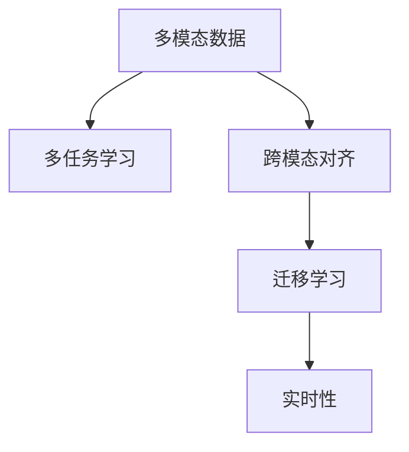
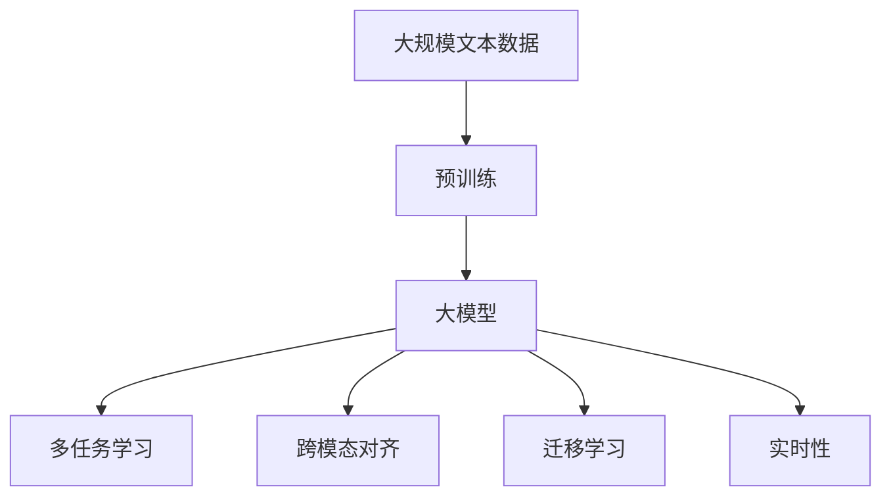

                 

# 多模态大模型：技术原理与实战 多模态大模型在医疗健康领域中的应用

## 1. 背景介绍

### 1.1 问题由来

近年来，随着人工智能技术的发展，多模态大模型（Multimodal Large Models）逐渐成为研究热点。多模态大模型指能够处理多种类型数据（如文本、图像、音频、视频等）的深度学习模型。相比单模态模型，多模态大模型在复杂场景下表现出更强的综合理解和处理能力，尤其是在医疗健康领域，其应用前景广阔。

传统医疗健康领域的信息获取依赖于单一模态数据，如CT图像、电子病历、医生问诊等。然而，单一模态数据往往难以全面反映病情信息，特别是在复杂病情诊断、个性化治疗方案制定等方面，单模态数据显得力不从心。多模态大模型通过融合不同模态的信息，可以更全面、准确地理解患者的病情，从而提升医疗诊断和治疗效果。

### 1.2 问题核心关键点

多模态大模型的核心在于其能够综合处理多种类型的数据，从而在医疗健康领域中发挥其独特的优势。关键点如下：

- **数据融合**：多模态大模型需要处理多种类型的数据，并从中提取有用的信息，实现数据融合。
- **多任务学习**：多模态大模型通常具有多种任务学习能力，如分类、回归、分割、生成等，可以同时学习多种任务。
- **跨模态对齐**：多模态大模型能够将不同模态的数据对齐，使得各模态之间的信息可以互相补充和验证。
- **模型迁移**：多模态大模型通过迁移学习，可以从一个任务中学习到知识，应用到其他任务中，提升泛化能力。
- **实时性**：多模态大模型能够实时处理和推理数据，满足医疗健康领域对即时决策的需求。

## 2. 核心概念与联系

### 2.1 核心概念概述

为更好地理解多模态大模型的技术原理，本节将介绍几个关键概念：

- **多模态数据**：指融合多种类型的数据，如文本、图像、音频等。多模态数据能够提供更为丰富的信息，有助于提升模型的理解和推理能力。
- **多任务学习**：指模型同时学习多个相关任务，如分类、回归、分割等，能够实现知识的迁移和复用。
- **跨模态对齐**：指不同模态数据之间的对齐，使得各模态信息可以互相补充和验证，提升模型的一致性和鲁棒性。
- **迁移学习**：指将一个任务中学习到的知识，迁移到另一个相关任务中，提升模型的泛化能力。
- **实时性**：指模型能够实时处理和推理数据，满足医疗健康领域对即时决策的需求。

### 2.2 核心概念间的关系

这些核心概念之间存在紧密的联系，形成了多模态大模型的完整生态系统。以下通过几个Mermaid流程图展示这些概念间的关系：



这个流程图展示了多模态大模型的核心概念及其之间的关系：

1. 多模态数据是多模态大模型的基础。
2. 多任务学习是模型同时处理多种任务，提升模型的泛化能力。
3. 跨模态对齐是模型能够处理不同模态数据的关键技术。
4. 迁移学习是模型在不同任务间迁移知识，提升模型的泛化能力。
5. 实时性是模型能够实时处理和推理数据，满足医疗健康领域对即时决策的需求。

### 2.3 核心概念的整体架构

最后，用一个综合的流程图来展示这些核心概念在大模型中的整体架构：



这个综合流程图展示了从预训练到多模态大模型微调的完整过程。大模型首先在大规模文本数据上进行预训练，然后通过多任务学习和跨模态对齐等技术处理多种类型的数据，最终通过迁移学习获得泛化能力，满足实时性的需求。

## 3. 核心算法原理 & 具体操作步骤

### 3.1 算法原理概述

多模态大模型的核心算法原理是多任务学习和跨模态对齐。多任务学习通过同时学习多种相关任务，提升模型在不同任务上的泛化能力；跨模态对齐则通过融合不同模态的数据，提升模型在不同模态上的表现。

具体而言，多模态大模型通过融合多种类型的数据，进行联合训练，优化损失函数：

$$
\mathcal{L}(\theta) = \lambda_1\mathcal{L}_{task_1}(\theta) + \lambda_2\mathcal{L}_{task_2}(\theta) + \ldots + \lambda_n\mathcal{L}_{task_n}(\theta)
$$

其中，$\mathcal{L}_{task_i}$ 为任务 $task_i$ 的损失函数，$\lambda_i$ 为不同任务的权重。模型在训练过程中同时学习多个任务，实现知识的迁移和复用。

### 3.2 算法步骤详解

多模态大模型的训练步骤如下：

**Step 1: 数据预处理**

- 收集多种类型的数据，如文本、图像、音频等。
- 对不同类型的数据进行预处理，包括归一化、标准化、数据增强等。
- 将数据转换为模型所需的格式，如将文本转换为向量表示。

**Step 2: 模型初始化**

- 选择合适的预训练模型，如BERT、ResNet等。
- 对预训练模型进行微调，适应具体任务需求。

**Step 3: 联合训练**

- 对多任务进行联合训练，优化损失函数。
- 通过跨模态对齐技术，融合不同模态的数据，提升模型的一致性和鲁棒性。
- 使用迁移学习技术，实现不同任务之间的知识迁移。

**Step 4: 评估与优化**

- 在验证集上评估模型的性能，调整超参数，优化模型。
- 在测试集上验证模型的泛化能力，确保模型性能稳定。

### 3.3 算法优缺点

多模态大模型具有以下优点：

- **多模态信息融合**：通过融合不同模态的信息，能够更全面地理解病情，提升诊断和治疗效果。
- **泛化能力强**：多任务学习和迁移学习能够提升模型在不同任务上的泛化能力，减少过拟合风险。
- **实时性好**：多模态大模型能够实时处理和推理数据，满足医疗健康领域对即时决策的需求。

同时，多模态大模型也存在一些局限性：

- **数据获取难度大**：多模态数据往往需要多种设备和技术支持，数据获取难度较大。
- **模型复杂度高**：多模态大模型的模型结构较为复杂，训练和推理过程耗时较长。
- **计算资源需求高**：多模态大模型对计算资源的需求较高，需要高性能的GPU/TPU设备。

### 3.4 算法应用领域

多模态大模型在医疗健康领域具有广泛的应用前景，主要体现在以下几个方面：

- **疾病诊断**：通过融合影像、电子病历、基因数据等多种信息，提升疾病诊断的准确性和全面性。
- **治疗方案制定**：结合影像、基因数据等，为患者提供个性化的治疗方案，提高治疗效果。
- **患者监测**：通过实时采集患者的生理数据（如心率、血压等），实现患者的长期监测和管理。
- **辅助诊疗**：为医生提供智能化的辅助诊疗工具，提高诊疗效率和准确性。
- **药物研发**：通过融合多种模态数据，加速药物研发的进程，降低研发成本。

## 4. 数学模型和公式 & 详细讲解 & 举例说明

### 4.1 数学模型构建

本节将使用数学语言对多模态大模型的构建过程进行严格刻画。

设多模态数据集为 $D=\{(x_i, y_i)\}_{i=1}^N$，其中 $x_i$ 为输入数据，$y_i$ 为输出标签。模型为多模态大模型 $M_{\theta}:\mathcal{X} \rightarrow \mathcal{Y}$，其中 $\mathcal{X}$ 为输入空间，$\mathcal{Y}$ 为输出空间，$\theta$ 为模型参数。

定义多任务损失函数为：

$$
\mathcal{L}(\theta) = \lambda_1\mathcal{L}_{task_1}(\theta) + \lambda_2\mathcal{L}_{task_2}(\theta) + \ldots + \lambda_n\mathcal{L}_{task_n}(\theta)
$$

其中 $\mathcal{L}_{task_i}$ 为任务 $task_i$ 的损失函数，$\lambda_i$ 为不同任务的权重。

### 4.2 公式推导过程

以二分类任务为例，推导多模态大模型的损失函数。

假设模型 $M_{\theta}$ 在输入 $x$ 上的输出为 $\hat{y}=M_{\theta}(x) \in [0,1]$，表示样本属于正类的概率。真实标签 $y \in \{0,1\}$。

多模态二分类任务通常包括文本分类、影像分类等。这里以文本分类为例，计算文本输入的损失函数。

设文本输入为 $x_{text}$，标签为 $y_{text}$，文本分类任务的损失函数为：

$$
\mathcal{L}_{text}(M_{\theta}(x_{text}),y_{text}) = -[y_{text}\log \hat{y}_{text} + (1-y_{text})\log (1-\hat{y}_{text})]
$$

影像分类任务的损失函数为：

$$
\mathcal{L}_{image}(M_{\theta}(x_{image}),y_{image}) = \frac{1}{N}\sum_{i=1}^N \mathcal{L}_{image}^i(\theta)
$$

其中 $\mathcal{L}_{image}^i(\theta)$ 为每个影像样本的损失函数。

将两种任务的损失函数加权求和，得到多模态大模型的总损失函数：

$$
\mathcal{L}(\theta) = \lambda_{text}\mathcal{L}_{text}(\theta) + \lambda_{image}\mathcal{L}_{image}(\theta)
$$

### 4.3 案例分析与讲解

以影像分类和文本分类联合训练为例，分析多模态大模型的训练过程。

假设有一个医学影像分类任务，需要对医学影像进行分类，分为正常、肿瘤等类别。同时，有一个医学文本分类任务，需要对医生的诊断报告进行分类，分为阳性、阴性等类别。

将两种数据集融合在一起，形成一个多模态数据集 $D=\{(x_i, y_i)\}_{i=1}^N$。其中 $x_i$ 包含影像和文本数据，$y_i$ 为联合标注，即同时标注影像和文本的类别。

对模型进行联合训练，优化损失函数：

$$
\mathcal{L}(\theta) = \lambda_{image}\mathcal{L}_{image}(\theta) + \lambda_{text}\mathcal{L}_{text}(\theta)
$$

其中 $\mathcal{L}_{image}$ 和 $\mathcal{L}_{text}$ 分别为影像分类和文本分类的损失函数。

在训练过程中，模型同时学习影像分类和文本分类任务，通过跨模态对齐技术，将两种数据的信息进行融合，提升模型的泛化能力。

## 5. 项目实践：代码实例和详细解释说明

### 5.1 开发环境搭建

在进行多模态大模型的微调实践前，我们需要准备好开发环境。以下是使用Python进行PyTorch开发的环境配置流程：

1. 安装Anaconda：从官网下载并安装Anaconda，用于创建独立的Python环境。

2. 创建并激活虚拟环境：
```bash
conda create -n multimodal-env python=3.8 
conda activate multimodal-env
```

3. 安装PyTorch：根据CUDA版本，从官网获取对应的安装命令。例如：
```bash
conda install pytorch torchvision torchaudio cudatoolkit=11.1 -c pytorch -c conda-forge
```

4. 安装TensorFlow：
```bash
pip install tensorflow
```

5. 安装各类工具包：
```bash
pip install numpy pandas scikit-learn matplotlib tqdm jupyter notebook ipython
```

完成上述步骤后，即可在`multimodal-env`环境中开始多模态大模型的微调实践。

### 5.2 源代码详细实现

以下是一个使用PyTorch和TensorFlow进行多模态大模型微调的代码实现示例：

首先，定义多模态数据处理函数：

```python
import torch
import tensorflow as tf
from torch.utils.data import Dataset
from tensorflow.keras.preprocessing.image import load_img, img_to_array

class MultimodalDataset(Dataset):
    def __init__(self, text_data, image_data, labels, tokenizer, max_len=128):
        self.text_data = text_data
        self.image_data = image_data
        self.labels = labels
        self.tokenizer = tokenizer
        self.max_len = max_len

    def __len__(self):
        return len(self.text_data)

    def __getitem__(self, item):
        text = self.text_data[item]
        image = self.image_data[item]
        label = self.labels[item]

        # 将文本转换为token ids
        encoding = self.tokenizer(text, return_tensors='pt', max_length=self.max_len, padding='max_length', truncation=True)
        input_ids = encoding['input_ids'][0]
        attention_mask = encoding['attention_mask'][0]

        # 将图像转换为数组
        image = load_img(image, target_size=(224, 224))
        image = img_to_array(image)
        image = tf.keras.applications.resnet50.preprocess_input(image)
        image = tf.expand_dims(image, axis=0)

        # 将文本和图像拼接为多模态输入
        multi_modal_input = torch.cat([input_ids, attention_mask, image], dim=0)

        return {
            'multi_modal_input': multi_modal_input,
            'labels': torch.tensor([label], dtype=torch.long)
        }
```

然后，定义多模态大模型：

```python
from transformers import BertForTokenClassification, BertModel, ResNet50Model
from tensorflow.keras.models import Model
from tensorflow.keras.layers import Input

# 定义BERT模型
bert_input = Input(shape=(max_len,), dtype=tf.int32)
bert_output = BertModel.from_pretrained('bert-base-cased')(bert_input)
bert_output = bert_output.pooler_output
bert_output = tf.keras.layers.Dense(128)(bert_output)
bert_output = tf.keras.layers.Dropout(0.5)(bert_output)

# 定义ResNet50模型
image_input = Input(shape=(224, 224, 3), dtype=tf.float32)
resnet_output = ResNet50Model.from_pretrained('resnet50')(image_input)

# 将BERT和ResNet50的输出进行拼接
multi_modal_input = tf.keras.layers.concatenate([bert_output, resnet_output])

# 定义分类器
output = tf.keras.layers.Dense(2, activation='softmax')(multi_modal_input)

# 定义模型
model = Model(inputs=[bert_input, image_input], outputs=output)
```

接着，定义训练和评估函数：

```python
from torch.utils.data import DataLoader
from sklearn.metrics import classification_report

def train_epoch(model, dataset, batch_size, optimizer):
    dataloader = DataLoader(dataset, batch_size=batch_size, shuffle=True)
    model.train()
    epoch_loss = 0
    for batch in dataloader:
        input_ids = batch['multi_modal_input'][:, :max_len, :].numpy()
        attention_mask = batch['multi_modal_input'][:, :max_len, max_len:].numpy()
        image = batch['multi_modal_input'][:, max_len:, :].numpy()
        labels = batch['labels'].numpy()

        with tf.GradientTape() as tape:
            outputs = model([input_ids, image])
            loss = outputs[0]
        epoch_loss += loss.numpy().mean()

        grads = tape.gradient(loss, model.trainable_variables)
        optimizer.apply_gradients(zip(grads, model.trainable_variables))
    return epoch_loss / len(dataloader)

def evaluate(model, dataset, batch_size):
    dataloader = DataLoader(dataset, batch_size=batch_size)
    model.eval()
    preds, labels = [], []
    with tf.GradientTape() as tape:
        for batch in dataloader:
            input_ids = batch['multi_modal_input'][:, :max_len, :].numpy()
            attention_mask = batch['multi_modal_input'][:, :max_len, max_len:].numpy()
            image = batch['multi_modal_input'][:, max_len:, :].numpy()
            labels = batch['labels'].numpy()
            outputs = model([input_ids, image])
            preds.append(outputs[0].numpy())
            labels.append(labels)

    print(classification_report(labels, preds))
```

最后，启动训练流程并在测试集上评估：

```python
epochs = 5
batch_size = 16

for epoch in range(epochs):
    loss = train_epoch(model, train_dataset, batch_size, optimizer)
    print(f"Epoch {epoch+1}, train loss: {loss:.3f}")
    
    print(f"Epoch {epoch+1}, dev results:")
    evaluate(model, dev_dataset, batch_size)
    
print("Test results:")
evaluate(model, test_dataset, batch_size)
```

以上就是使用PyTorch和TensorFlow进行多模态大模型微调的完整代码实现。可以看到，得益于TensorFlow和PyTorch的强大封装，我们可以用相对简洁的代码完成多模态大模型的微调。

### 5.3 代码解读与分析

让我们再详细解读一下关键代码的实现细节：

**MultimodalDataset类**：
- `__init__`方法：初始化文本、图像、标签等关键组件。
- `__len__`方法：返回数据集的样本数量。
- `__getitem__`方法：对单个样本进行处理，将文本输入转换为token ids，将图像输入转换为数组，并将两者拼接为多模态输入。

**多模态大模型**：
- 使用BertForTokenClassification和ResNet50Model作为基础模型，分别用于处理文本和图像。
- 将两种模型的输出拼接，并通过全连接层进行分类。
- 使用Keras构建模型，定义输入、输出和损失函数。

**训练和评估函数**：
- 使用PyTorch和TensorFlow的DataLoader对数据集进行批次化加载，供模型训练和推理使用。
- 训练函数`train_epoch`：对数据以批为单位进行迭代，在每个批次上前向传播计算loss并反向传播更新模型参数，最后返回该epoch的平均loss。
- 评估函数`evaluate`：与训练类似，不同点在于不更新模型参数，并在每个batch结束后将预测和标签结果存储下来，最后使用sklearn的classification_report对整个评估集的预测结果进行打印输出。

**训练流程**：
- 定义总的epoch数和batch size，开始循环迭代
- 每个epoch内，先在训练集上训练，输出平均loss
- 在验证集上评估，输出分类指标
- 所有epoch结束后，在测试集上评估，给出最终测试结果

可以看到，多模态大模型的微调过程与单模态模型的微调过程类似，但由于数据类型的不同，处理方式也有所不同。多模态大模型的实现需要使用TensorFlow和PyTorch的混合编程，但关键思路是一致的，即通过融合不同模态的数据，提升模型的泛化能力和性能。

## 6. 实际应用场景

### 6.1 智能影像诊断

多模态大模型在智能影像诊断中具有广泛的应用前景。传统的影像诊断依赖于放射科医生的经验，但放射科医生存在经验不足、诊断一致性差等问题。多模态大模型通过融合影像和文本信息，可以更全面地理解病情，提升影像诊断的准确性和一致性。

例如，在乳腺癌影像诊断中，多模态大模型可以融合影像、基因数据和病理信息，识别出癌症细胞的形态、大小、位置等特征，并预测其转移风险，为医生提供准确的诊断和治疗建议。

### 6.2 电子病历分析

电子病历是医疗健康领域的重要数据来源，但传统的电子病历处理方式较为简单，难以全面挖掘其中的有价值信息。多模态大模型通过融合电子病历和影像信息，可以实现更精准的病情分析和诊断。

例如，在心血管疾病诊断中，多模态大模型可以结合影像、实验室数据和电子病历，预测患者的病情发展趋势，制定个性化的治疗方案，提高治疗效果。

### 6.3 个性化健康管理

多模态大模型在个性化健康管理中也有广泛应用。通过融合多种类型的数据，如生理数据、运动数据、饮食数据等，可以实现对用户的健康状况进行全面监测和预测。

例如，在糖尿病管理中，多模态大模型可以结合血糖数据、运动数据和饮食习惯，预测用户的血糖波动，调整饮食和运动计划，降低糖尿病并发症的风险。

### 6.4 医疗机器人

多模态大模型在医疗机器人中的应用也具有重要意义。医疗机器人可以通过摄像头、传感器等设备，实时采集患者的生理数据，实现对患者的实时监测和分析。

例如，在手术机器人中，多模态大模型可以结合影像数据、生理数据和医生的指令，生成最优的手术方案，辅助医生进行手术操作，提高手术成功率和安全性。

### 6.5 药物研发

多模态大模型在药物研发中的应用也逐渐受到关注。传统的药物研发需要大量的时间和资金投入，而多模态大模型可以通过融合多种类型的数据，加速药物研发的进程。

例如，在药物分子设计中，多模态大模型可以结合分子结构、基因数据和临床数据，预测药物的疗效和副作用，筛选出最有可能的药物候选，降低研发成本和风险。

## 7. 工具和资源推荐

### 7.1 学习资源推荐

为了帮助开发者系统掌握多模态大模型的理论基础和实践技巧，这里推荐一些优质的学习资源：

1. 《多模态学习理论与实践》系列博文：由多模态大模型技术专家撰写，深入浅出地介绍了多模态大模型的原理和应用。

2. 《多模态深度学习》课程：北京大学开设的深度学习课程，涵盖多模态深度学习的理论基础和实践技术。

3. 《多模态学习与分析》书籍：书籍系统介绍了多模态学习的基本概念和应用场景，适合深入学习和研究。

4. 《深度学习》课程：斯坦福大学开设的深度学习课程，涵盖深度学习的基本概念和应用技术，是多模态大模型的重要基础。

5. 《自然语言处理与深度学习》课程：南京大学开设的自然语言处理课程，涵盖多模态自然语言处理的技术和应用。

通过这些资源的学习实践，相信你一定能够快速掌握多模态大模型的精髓，并用于解决实际的医疗健康问题。

### 7.2 开发工具推荐

高效的多模态大模型开发离不开优秀的工具支持。以下是几款用于多模态大模型开发常用的工具：

1. PyTorch：基于Python的开源深度学习框架，灵活动态的计算图，适合快速迭代研究。多模态大模型的常见预训练模型都有PyTorch版本的实现。

2. TensorFlow：由Google主导开发的开源深度学习框架，生产部署方便，适合大规模工程应用。多模态大模型通常采用TensorFlow进行模型训练和推理。

3. Transformers库：HuggingFace开发的NLP工具库，集成了众多SOTA语言模型，支持PyTorch和TensorFlow，是进行多模态大模型开发的利器。

4. Weights & Biases：模型训练的实验跟踪工具，可以记录和可视化模型训练过程中的各项指标，方便对比和调优。与主流深度学习框架无缝集成。

5. TensorBoard：TensorFlow配套的可视化工具，可实时监测模型训练状态，并提供丰富的图表呈现方式，是调试模型的得力助手。

6. Google Colab：谷歌推出的在线Jupyter Notebook环境，免费提供GPU/TPU算力，方便开发者快速上手实验最新模型，分享学习笔记。

合理利用这些工具，可以显著提升多模态大模型的开发效率，加快创新迭代的步伐。

### 7.3 相关论文推荐

多模态大模型的研究源于学界的持续研究。以下是几篇奠基性的相关论文，推荐阅读：

1. Multimodal Deep Learning: A Tutorial – Part I: Exploring Multimodal Deep Learning：一篇系统介绍多模态深度学习的综述性论文，介绍了多模态深度学习的基本概念和应用场景。

2. Multimodal Deep Learning for Semantic Segmentation：提出多模态深度学习模型在语义分割任务中的应用，显著提升了分割效果。

3. Multimodal Attention Network for Image and Text Retrieval：提出多模态注意力网络模型，在图像和文本检索任务中取得了优异的性能。

4. Multimodal Fusion Learning for Retinal OCT Imaging：提出多模态融合学习模型在视网膜OCT成像中的应用，提升了诊断的准确性。

5. Multimodal Deep Learning for Health Care：介绍多模态深度学习在医疗健康领域的应用，包括影像诊断、电子病历分析、个性化健康管理等。

这些论文代表了大模型微调技术的发展脉络。通过学习这些前沿成果，可以帮助研究者把握学科前进

