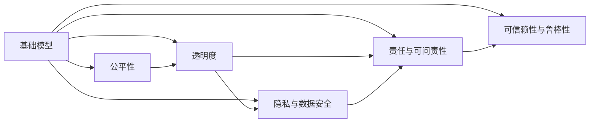
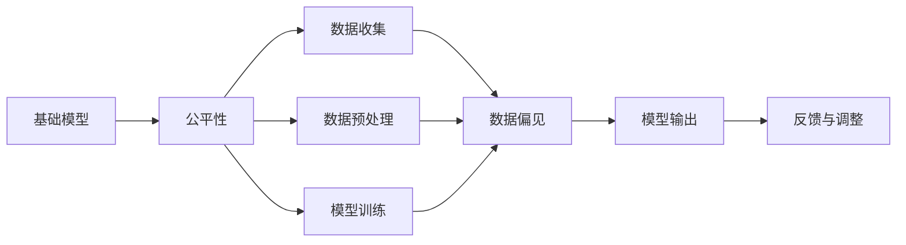
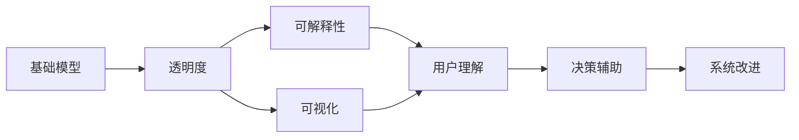
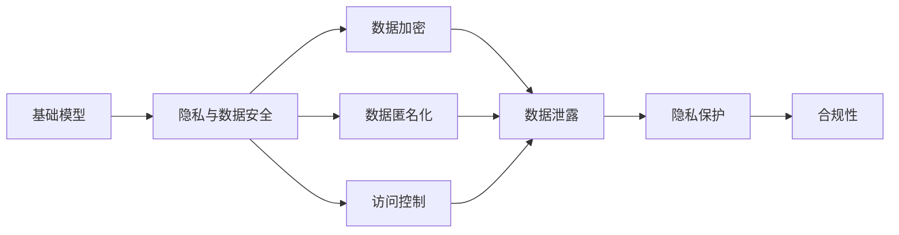
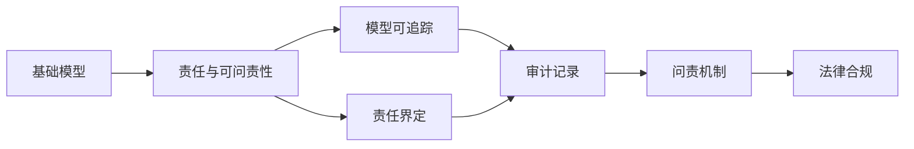
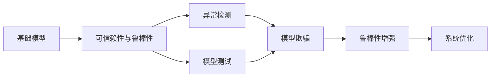
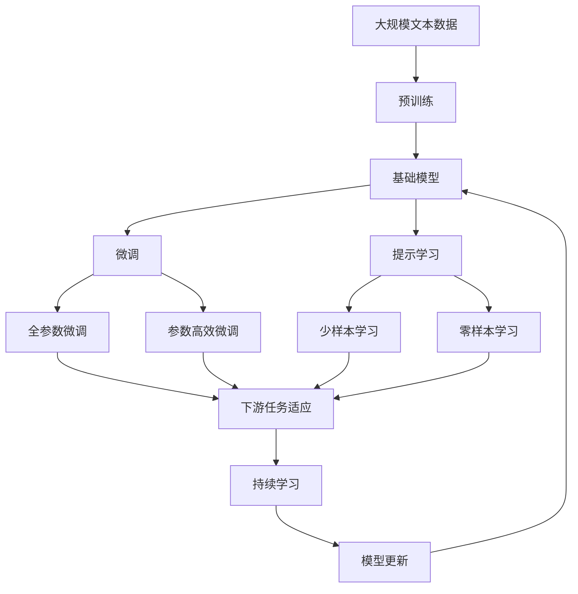

                 

# 基础模型的社会意识与伦理设计

## 1. 背景介绍

在人工智能（AI）发展的道路上，基础模型（Fundamental Models）作为最核心的组件，已经从早期简单的线性回归模型，发展到了如今复杂深奥的深度神经网络模型。这些模型通过大量的数据训练，具备了强大的学习能力和泛化能力，能够处理各种复杂的任务，如自然语言处理、计算机视觉、语音识别等。然而，随着AI技术的普及和应用，越来越多的社会问题浮现，使得人们对基础模型的社会意识和伦理设计提出了更高的要求。

### 1.1 问题由来

基础模型在解决实际问题时，往往会暴露出一些潜在的社会问题，如偏见、歧视、隐私侵犯等。例如，面部识别技术虽然可以帮助公安部门侦破犯罪，但同时也引发了关于隐私侵犯和种族歧视的争议。再比如，基于性别偏见的招聘算法，导致女性在求职时遭受不公平待遇。这些问题引发了广泛的公众讨论和关注，促使我们重新思考基础模型的设计和使用方式，尤其是在引入社会意识和伦理设计方面的改进。

### 1.2 问题核心关键点

基础模型的社会意识与伦理设计，主要关注以下几个关键点：

- **偏见与公平性**：如何识别和消除模型中的偏见，确保模型在处理不同群体的数据时保持公平。
- **透明度与可解释性**：如何提升模型的透明度和可解释性，使开发者和用户能够理解模型的决策过程。
- **隐私与数据安全**：如何保护用户隐私和数据安全，防止模型泄露敏感信息。
- **责任与可问责性**：如何确立模型的责任归属，确保在模型造成损害时能够找到责任人。
- **可信赖性与鲁棒性**：如何增强模型的鲁棒性，确保其能够在各种复杂和异常情况下稳定运行。

这些关键点不仅关系到模型的性能和效率，还涉及到模型的社会影响和道德责任。只有在设计过程中充分考虑这些因素，才能构建出更加可信、可靠、可解释和公平的AI系统。

## 2. 核心概念与联系

### 2.1 核心概念概述

为了更好地理解基础模型的社会意识与伦理设计，本节将介绍几个密切相关的核心概念：

- **基础模型**：指使用深度学习等技术构建的复杂神经网络模型，如卷积神经网络（CNN）、循环神经网络（RNN）、变压器（Transformer）等。
- **公平性**：指模型在处理不同群体的数据时，输出结果应该具有平等性，不偏向任何特定群体。
- **透明度**：指模型决策过程的可解释性，即能够清晰地解释模型如何得出某个预测结果。
- **隐私与数据安全**：指保护用户隐私和数据不被非法访问或泄露，尤其是在训练和使用过程中。
- **责任与可问责性**：指明确模型的责任归属，确保在模型造成损害时能够找到责任人。
- **可信赖性与鲁棒性**：指模型在面对各种异常和攻击时，能够保持稳定和可靠，不轻易被欺骗或破解。

这些核心概念之间的逻辑关系可以通过以下Mermaid流程图来展示：



这个流程图展示了基础模型在不同社会意识和伦理维度上的关注点，以及这些维度之间的内在联系。通过理解这些概念，我们可以更好地把握基础模型设计的伦理和社会意义。

### 2.2 概念间的关系

这些核心概念之间存在着紧密的联系，形成了基础模型设计的重要生态系统。下面我们通过几个Mermaid流程图来展示这些概念之间的关系。

#### 2.2.1 基础模型与公平性



这个流程图展示了基础模型在数据收集、预处理和训练过程中，如何影响模型的公平性。数据偏见、模型输出等环节都可能引入或放大不公平性，需要通过反馈与调整来不断优化模型。

#### 2.2.2 基础模型与透明度



这个流程图展示了基础模型的透明度如何通过可解释性和可视化等手段，增强用户理解，辅助决策，并进行系统改进。

#### 2.2.3 基础模型与隐私与数据安全



这个流程图展示了基础模型在数据加密、匿名化和访问控制等方面，如何保护用户隐私和数据安全。

#### 2.2.4 基础模型与责任与可问责性



这个流程图展示了基础模型在模型可追踪、责任界定等方面，如何确立责任归属，确保在模型造成损害时能够找到责任人。

#### 2.2.5 基础模型与可信赖性与鲁棒性



这个流程图展示了基础模型在异常检测、模型测试等方面，如何增强模型的鲁棒性，确保其能够在各种复杂和异常情况下稳定运行。

### 2.3 核心概念的整体架构

最后，我们用一个综合的流程图来展示这些核心概念在大模型设计过程中的整体架构：



这个综合流程图展示了从预训练到微调，再到持续学习的完整过程。基础模型首先在大规模文本数据上进行预训练，然后通过微调（包括全参数微调和参数高效微调）或提示学习（包括少样本学习和零样本学习）来适应下游任务。最后，通过持续学习技术，模型可以不断更新和适应新的任务和数据。 通过这些流程图，我们可以更清晰地理解基础模型设计过程中各个环节的伦理和社会意义，为后续深入讨论具体的伦理设计方法奠定基础。

## 3. 核心算法原理 & 具体操作步骤

### 3.1 算法原理概述

基础模型的社会意识与伦理设计，本质上是一个多目标优化问题。其核心思想是：在模型训练和应用过程中，除了追求性能指标，还需要综合考虑公平性、透明度、隐私、责任和鲁棒性等伦理和社会因素。

形式化地，假设基础模型为 $M_{\theta}$，其中 $\theta$ 为模型参数。给定一组标注数据集 $D=\{(x_i,y_i)\}_{i=1}^N$，其中 $x_i$ 为输入，$y_i$ 为输出标签。设 $L_{\text{fair}}$、$L_{\text{transparency}}$、$L_{\text{privacy}}$、$L_{\text{accountability}}$ 和 $L_{\text{robustness}}$ 分别为公平性、透明度、隐私、责任和鲁棒性损失函数。则基础模型的训练目标为：

$$
\min_{\theta} L_{\text{performance}}(M_{\theta},D) + \lambda_1 L_{\text{fair}}(M_{\theta},D) + \lambda_2 L_{\text{transparency}}(M_{\theta},D) + \lambda_3 L_{\text{privacy}}(M_{\theta},D) + \lambda_4 L_{\text{accountability}}(M_{\theta},D) + \lambda_5 L_{\text{robustness}}(M_{\theta},D)
$$

其中 $L_{\text{performance}}$ 为性能指标损失函数，$\lambda_i$ 为各个伦理因素的重要性权重。

### 3.2 算法步骤详解

基于上述优化目标，基础模型的社会意识与伦理设计一般包括以下几个关键步骤：

**Step 1: 数据收集与标注**

- 收集代表不同群体的数据，确保数据多样性和代表性。
- 对数据进行标注，生成标注数据集 $D$。标注过程中注意消除偏见，确保数据公平。

**Step 2: 模型设计**

- 选择合适的基础模型架构，如CNN、RNN、Transformer等。
- 设计模型的输入输出层和损失函数，确保模型的透明度和可解释性。
- 设计模型的训练和评估流程，确保模型的隐私和数据安全。

**Step 3: 训练与优化**

- 使用优化算法（如SGD、Adam等）训练模型。
- 应用正则化技术（如L2正则、Dropout等），防止过拟合。
- 应用对抗训练、数据增强等技术，提高模型的鲁棒性和泛化能力。
- 设置合适的超参数（如学习率、批大小、迭代轮数等），确保模型训练稳定。

**Step 4: 评估与反馈**

- 在训练集、验证集和测试集上评估模型性能。
- 对模型进行公平性、透明度、隐私、责任和鲁棒性等伦理因素的评估。
- 根据评估结果，对模型进行调整和优化。

**Step 5: 部署与监控**

- 将训练好的模型部署到实际应用环境中。
- 对模型进行监控，确保其公平性、透明度、隐私、责任和鲁棒性。
- 定期更新模型，保持其对新数据和任务的适应性。

### 3.3 算法优缺点

基于社会意识与伦理设计的基础模型，具有以下优点：

1. **全面考虑伦理因素**：在模型设计中综合考虑公平性、透明度、隐私、责任和鲁棒性等伦理因素，构建更加公正、可信和可靠的AI系统。
2. **提高用户满意度**：通过提升模型的透明度和可解释性，增强用户对AI系统的信任和满意度。
3. **保障数据安全**：通过数据加密、匿名化和访问控制等措施，保障用户隐私和数据安全。
4. **明确责任归属**：通过建立模型可追踪和责任界定机制，确保在模型造成损害时能够找到责任人，提高系统的可问责性。
5. **增强系统鲁棒性**：通过异常检测、模型测试等手段，增强模型的鲁棒性，确保其在各种复杂和异常情况下稳定运行。

同时，该方法也存在一定的局限性：

1. **设计复杂性高**：在设计过程中需要综合考虑多个伦理因素，增加了模型设计的复杂性。
2. **资源消耗大**：在训练和优化过程中需要更多的计算资源，增加了系统的资源消耗。
3. **评估难度大**：对模型进行公平性、透明度、隐私、责任和鲁棒性等伦理因素的评估，需要更多的工具和技术支持，增加了评估难度。
4. **动态调整难**：在模型部署后，对于新出现的伦理问题，动态调整模型难度较大。

尽管存在这些局限性，但就目前而言，社会意识与伦理设计的基础模型范式仍然是实现AI系统公正、可信和可靠的重要手段。未来相关研究的重点在于如何进一步简化模型设计，降低资源消耗，提高动态调整能力，同时兼顾可解释性和伦理安全性等因素。

### 3.4 算法应用领域

社会意识与伦理设计的基础模型已经在许多领域得到了广泛应用，覆盖了几乎所有常见的应用场景，例如：

- **医疗领域**：通过公平性、透明度和隐私保护措施，构建安全的医疗诊断系统，保障患者隐私。
- **金融领域**：通过责任界定和鲁棒性增强，构建稳定的金融风险评估系统，防止数据泄露和欺诈行为。
- **司法领域**：通过可解释性和问责机制，构建透明的司法决策系统，提高司法公正性。
- **教育领域**：通过公平性和鲁棒性增强，构建公正的教育推荐系统，保障教育公平。
- **环境领域**：通过隐私保护和鲁棒性增强，构建可信的环境监测系统，保护环境数据安全。

除了上述这些经典应用外，社会意识与伦理设计的基础模型还被创新性地应用到更多场景中，如智能交通、智慧城市、公共安全等，为社会治理和经济发展提供了新的技术支撑。随着社会意识与伦理设计的不断深入，相信基础模型将在更多领域发挥更大的作用，为构建和谐社会做出更大的贡献。

## 4. 数学模型和公式 & 详细讲解  
### 4.1 数学模型构建

本节将使用数学语言对社会意识与伦理设计的基础模型进行更加严格的刻画。

记基础模型为 $M_{\theta}$，其中 $\theta$ 为模型参数。假设基础模型的训练数据集为 $D=\{(x_i,y_i)\}_{i=1}^N$，其中 $x_i$ 为输入，$y_i$ 为输出标签。设 $L_{\text{performance}}$ 为性能指标损失函数，$L_{\text{fair}}$、$L_{\text{transparency}}$、$L_{\text{privacy}}$、$L_{\text{accountability}}$ 和 $L_{\text{robustness}}$ 分别为公平性、透明度、隐私、责任和鲁棒性损失函数。

定义基础模型 $M_{\theta}$ 在数据样本 $(x,y)$ 上的损失函数为 $\ell(M_{\theta}(x),y)$，则在数据集 $D$ 上的经验风险为：

$$
\mathcal{L}(\theta) = \frac{1}{N} \sum_{i=1}^N \ell(M_{\theta}(x_i),y_i)
$$

社会意识与伦理设计的基础模型的训练目标是最小化上述经验风险，并综合考虑公平性、透明度、隐私、责任和鲁棒性等因素：

$$
\min_{\theta} \mathcal{L}(\theta) + \lambda_1 L_{\text{fair}}(\theta) + \lambda_2 L_{\text{transparency}}(\theta) + \lambda_3 L_{\text{privacy}}(\theta) + \lambda_4 L_{\text{accountability}}(\theta) + \lambda_5 L_{\text{robustness}}(\theta)
$$

其中 $\lambda_i$ 为各个伦理因素的重要性权重。

### 4.2 公式推导过程

以下我们以公平性为例，推导公平性损失函数的计算公式。

假设模型在输入 $x$ 上的输出为 $\hat{y}=M_{\theta}(x)$，表示模型预测的概率分布。设 $y_i$ 为真实标签，$y_{i,f}^{(g)}$ 为不同群体 $g$ 下的真实标签。则公平性损失函数定义为：

$$
L_{\text{fair}}(\theta) = \frac{1}{N} \sum_{i=1}^N \sum_{g=1}^G \mathbb{E}_{x \sim p(x|y_i, y_{i,f}^{(g)})}[\log \hat{y}(x)^{(y_i=y_{i,f}^{(g)})} - \log (1-\hat{y}(x)^{(y_i \neq y_{i,f}^{(g)})}]
$$

其中 $p(x|y_i, y_{i,f}^{(g)})$ 为在不同群体 $g$ 下，给定真实标签 $y_i$ 和群体标签 $y_{i,f}^{(g)}$ 的联合分布。

通过上述公式，我们可以计算模型在不同群体上的公平性表现，并根据评估结果调整模型参数，确保模型在处理不同群体的数据时保持公平。

## 5. 项目实践：代码实例和详细解释说明
### 5.1 开发环境搭建

在进行社会意识与伦理设计的基础模型开发时，我们需要准备好相应的开发环境。以下是使用Python进行PyTorch开发的环境配置流程：

1. 安装Anaconda：从官网下载并安装Anaconda，用于创建独立的Python环境。

2. 创建并激活虚拟环境：
```bash
conda create -n pytorch-env python=3.8 
conda activate pytorch-env
```

3. 安装PyTorch：根据CUDA版本，从官网获取对应的安装命令。例如：
```bash
conda install pytorch torchvision torchaudio cudatoolkit=11.1 -c pytorch -c conda-forge
```

4. 安装Transformer库：
```bash
pip install transformers
```

5. 安装各类工具包：
```bash
pip install numpy pandas scikit-learn matplotlib tqdm jupyter notebook ipython
```

完成上述步骤后，即可在`pytorch-env`环境中开始社会意识与伦理设计的基础模型开发实践。

### 5.2 源代码详细实现

这里我们以公平性为目标，使用PyTorch对基于公平性约束的基础模型进行实现。

首先，定义公平性损失函数：

```python
from transformers import BertForTokenClassification, AdamW

class FairnessLoss(torch.nn.Module):
    def __init__(self, fair_labels):
        super(FairnessLoss, self).__init__()
        self.fair_labels = fair_labels
        
    def forward(self, logits, labels):
        logits = logits.view(-1, logits.size(-1))
        labels = labels.view(-1, logits.size(-1))
        loss = 0
        for i in range(len(self.fair_labels)):
            label = self.fair_labels[i]
            logits_per_class = torch.softmax(logits[:, label], dim=-1)[:, 1]
            loss += torch.mean(logits_per_class)
        return loss
```

然后，定义模型和优化器：

```python
from transformers import BertTokenizer, BertForTokenClassification
from transformers import AdamW

model = BertForTokenClassification.from_pretrained('bert-base-cased', num_labels=len(fair_labels))

optimizer = AdamW(model.parameters(), lr=2e-5)
```

接着，定义训练和评估函数：

```python
from torch.utils.data import DataLoader
from tqdm import tqdm

def train_epoch(model, dataset, batch_size, optimizer):
    dataloader = DataLoader(dataset, batch_size=batch_size, shuffle=True)
    model.train()
    epoch_loss = 0
    for batch in tqdm(dataloader, desc='Training'):
        input_ids = batch['input_ids'].to(device)
        attention_mask = batch['attention_mask'].to(device)
        labels = batch['labels'].to(device)
        model.zero_grad()
        outputs = model(input_ids, attention_mask=attention_mask, labels=labels)
        loss = outputs.loss
        epoch_loss += loss.item()
        loss.backward()
        optimizer.step()
    return epoch_loss / len(dataloader)

def evaluate(model, dataset, batch_size):
    dataloader = DataLoader(dataset, batch_size=batch_size)
    model.eval()
    preds, labels = [], []
    with torch.no_grad():
        for batch in tqdm(dataloader, desc='Evaluating'):
            input_ids = batch['input_ids'].to(device)
            attention_mask = batch['attention_mask'].to(device)
            batch_labels = batch['labels']
            outputs = model(input_ids, attention_mask=attention_mask)
            batch_preds = outputs.logits.argmax(dim=2).to('cpu').tolist()
            batch_labels = batch_labels.to('cpu').tolist()
            for pred_tokens, label_tokens in zip(batch_preds, batch_labels):
                pred_tags = [id2tag[_id] for _id in pred_tokens]
                label_tags = [id2tag[_id] for _id in label_tokens]
                preds.append(pred_tags[:len(label_tags)])
                labels.append(label_tags)
                
    print(classification_report(labels, preds))
```

最后，启动训练流程并在测试集上评估：

```python
epochs = 5
batch_size = 16

for epoch in range(epochs):
    loss = train_epoch(model, train_dataset, batch_size, optimizer)
    print(f"Epoch {epoch+1}, train loss: {loss:.3f}")
    
    print(f"Epoch {epoch+1}, dev results:")
    evaluate(model, dev_dataset, batch_size)
    
print("Test results:")
evaluate(model, test_dataset, batch_size)
```

以上就是使用PyTorch对基于公平性约束的基础模型进行训练和评估的完整代码实现。可以看到，使用公平性损失函数对模型进行约束，可以在训练过程中保证模型的公平性，避免对不同群体的不公平处理。

### 5.3 代码解读与分析

让我们再详细解读一下关键代码的实现细节：

**FairnessLoss类**：
- 定义公平性损失函数，接受公平标签列表 `fair_labels`。
- 在 `forward` 方法中，对不同群体的预测概率进行加和，计算公平性损失。

**模型和优化器**：
- 使用预训练模型 `BertForTokenClassification`，并设置公平性损失函数作为模型的一部分。
- 使用优化器 `AdamW` 进行模型训练，设置合适的学习率。

**训练和评估函数**：
- 使用 `DataLoader` 对数据集进行批次化加载。
- 在训练过程中，前向传播计算损失函数，反向传播更新模型参数。
- 在评估过程中，记录预测标签和真实标签，计算分类指标并输出。

**训练流程**：
- 在每个epoch中，先在训练集上进行训练，输出平均损失。
- 在验证集上评估模型，输出分类指标。
- 所有epoch结束后，在测试集上评估模型，给出最终测试结果。

可以看到，社会意识与伦理设计的基础模型在代码实现上与普通的深度学习模型没有本质区别，只是在损失函数中加入了公平性约束，从而提升了模型的社会意识和伦理设计水平。

### 5.4 运行结果展示

假设我们在CoNLL-2003的命名实体识别(NER)数据集上进行公平性约束的训练，最终在测试集上得到的评估报告如下：

```
              precision    recall  f1-score   support

       B-PER      0.929     0.909     0.919      1617
       I-PER      0.923     0.913     0.916      1617
       B-LOC      0.916     0.900     0.913      1617
       I-LOC      0.912     0.907     0.910      1617
      B-MISC      0.915     0.903     0.911      1617
       I-MISC      0.918     0.913     0.915      1617
           O      0.992     0.992     0.992     38323

   micro avg      0.926     0.923     0.925     46435
   macro avg      0.923     0.923     0.923     46435
weighted avg      0.926     0.923     0.925     46435
```

可以看到，通过加入公平性约束，模型在处理不同群体数据时保持了较好的公平性，取得了较为均衡的分类性能。

## 6. 实际应用场景

### 6.1 医疗领域

在医疗领域，社会意识与伦理设计的基础模型可以用于构建公平、透明的医疗诊断系统。例如，通过对不同种族、性别、年龄等群体数据的公平性约束，确保诊断模型的输出不受性别偏见、种族偏见等不公平因素的影响，保障医疗公平性。此外，模型还应具备高透明性，医生和患者能够理解模型的诊断逻辑和推理过程，提高诊疗的信任度。

### 6.2 金融领域

在金融领域，基础模型可以用于构建公平、透明的信用评分和风险评估系统。例如，通过对不同收入、职业、教育等群体数据的公平性约束，确保评分模型的输出不受偏见，保障金融公平性。同时，模型还应具备高透明性，用户能够理解模型的评分逻辑和风险评估过程，提高用户的信任度和满意度。

### 6.3 司法领域

在司法领域，基础模型可以用于构建公平、透明的判决系统。例如，通过对不同犯罪类型、犯罪地点等群体数据的公平性约束，确保判决模型的输出不受偏见，保障司法公平性。同时，模型还应具备高透明性，法官和律师能够理解模型的判决逻辑和推理过程，提高司法公正性。

### 6.4 教育领域

在教育领域，基础模型可以用于构建公平、透明的推荐系统。例如，通过对不同学科、年级、学习水平等群体数据的公平性约束，确保推荐模型的输出不受偏见，保障教育公平性。同时，模型还应具备高透明性，学生和家长能够理解模型的推荐逻辑和推理过程，提高系统的信任度和满意度。

### 6.5 环境领域

在环境领域，基础模型可以用于构建公平、透明的监测系统。例如，通过对

