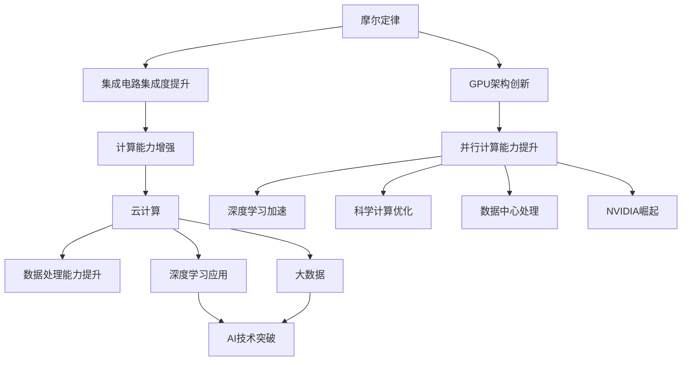

                 

# 算力革命与NVIDIA的角色

在过去的几十年里，计算机科学和人工智能(AI)领域经历了翻天覆地的变化。从最初笨重的机械计算机，到如今的超算集群、量子计算、人工智能模型，我们不断突破技术极限，迎接新的挑战和机遇。但在这变革的浪潮中，有一个关键因素始终贯穿其中，那就是算力。无论是云计算、大数据、深度学习，还是自然语言处理、自动驾驶等新兴领域，算力始终是推动技术进步的根本动力。

在算力革命的大潮中，NVIDIA无疑是最具影响力的玩家之一。其创新的GPU架构、强大的计算能力、以及与行业深度的合作，使其成为了推动算力进步的核心力量。本文将深入探讨算力革命的背景与现状，详细解析NVIDIA在这一过程中的角色和贡献，并展望未来的发展趋势。

## 1. 背景介绍

### 1.1 算力革命的历史背景

算力革命始于1950年代，计算机的诞生标志着人类进入信息时代。随着摩尔定律的不断突破，集成电路的集成度越来越高，计算机的处理能力指数级增长。早期的算力主要集中于学术研究、军事国防等领域，应用场景相对有限。

进入21世纪，互联网的兴起和大数据时代的到来，为算力提供了更广阔的施展空间。算力的定义也从单纯的计算能力，拓展到更复杂的计算需求，如分布式计算、异构计算、机器学习等。算力的提升，不仅带来了计算速度的提高，还推动了云计算、大数据、人工智能等技术的突破。

### 1.2 算力革命的关键节点

算力革命的关键节点包括以下几个方面：

- **摩尔定律的突破**：集成电路的集成度不断提升，使得算力成本下降，计算能力增强。
- **云计算的兴起**：云平台通过分布式计算，大幅降低了算力门槛，使更多企业能够轻松使用高性能算力。
- **大数据时代的来临**：海量数据的产生和处理需求，催生了高效算力需求，推动了分布式存储和计算技术的创新。
- **深度学习与AI的崛起**：以神经网络为代表的深度学习模型，大幅提升了算力需求，推动了GPU、FPGA等专用计算架构的发展。

这些关键节点共同推动了算力的不断演进，也催生了NVIDIA等公司在此过程中的崛起。

## 2. 核心概念与联系

### 2.1 核心概念概述

在探讨NVIDIA在算力革命中的角色前，首先需要理解几个关键概念：

- **算力**：指的是计算机系统执行计算任务的能力，通常用每秒浮点运算次数(FLOPS)或每秒事务数(TPS)等指标来衡量。
- **GPU**：图形处理单元，最初用于加速图像渲染，但后来被广泛应用于并行计算，如深度学习、科学计算等领域。
- **NVIDIA**：全球领先的图形处理和计算技术公司，其创新的GPU架构和强大的计算能力，使其在算力革命中扮演了关键角色。

### 2.2 概念间的关系

算力革命与GPU架构、NVIDIA的关系可以通过以下Mermaid流程图来展示：



这个流程图展示了从摩尔定律到NVIDIA崛起的过程：集成电路的集成度提升，带来了计算能力的增强，进而推动了云计算、大数据、深度学习等技术的突破。GPU架构的创新，使并行计算能力大幅提升，加速了深度学习和科学计算的发展。NVIDIA通过强大的GPU和深度的行业合作，成为算力革命的核心力量之一。

## 3. 核心算法原理 & 具体操作步骤

### 3.1 算法原理概述

算力革命的核心在于如何高效利用计算机硬件资源，通过并行计算、分布式计算、异构计算等技术手段，提升计算机的处理能力。在深度学习和大数据时代，GPU架构成为了算力提升的重要工具。

GPU通过大规模并行计算，可以在一个芯片上同时执行大量任务，使得深度学习的训练速度得到了显著提升。以卷积神经网络(CNN)为例，GPU的高并行性使得其训练速度比CPU快数百倍。

### 3.2 算法步骤详解

基于GPU架构的深度学习算法通常包括以下几个步骤：

1. **数据准备**：将原始数据转换为GPU可以处理的格式，如张量(Tensor)。
2. **模型定义**：使用深度学习框架(如TensorFlow、PyTorch等)定义模型结构。
3. **训练过程**：将模型和数据加载到GPU上，进行反向传播计算和参数更新。
4. **模型评估**：在验证集上评估模型性能，调整模型参数以提升性能。
5. **推理部署**：将训练好的模型部署到生产环境，进行推理计算。

### 3.3 算法优缺点

基于GPU架构的深度学习算法具有以下优点：

- **并行计算能力**：GPU的并行计算能力使得深度学习的训练速度大幅提升。
- **模型精度提升**：大规模并行计算使得模型能够学习更复杂、更深层次的特征。
- **易用性**：深度学习框架提供了丰富的API和工具，降低了算法实现的复杂度。

同时，这些算法也存在一些缺点：

- **内存需求高**：深度学习模型通常参数量庞大，对内存需求较高。
- **算力成本高**：高性能GPU和TPU等硬件设备价格不菲，增加了算力成本。
- **开发门槛高**：深度学习算法涉及复杂的网络结构和优化算法，开发门槛较高。

### 3.4 算法应用领域

基于GPU架构的深度学习算法在以下几个领域得到了广泛应用：

- **计算机视觉**：图像分类、目标检测、图像分割等任务。
- **自然语言处理**：语言模型、机器翻译、情感分析等任务。
- **语音识别**：语音识别、语音合成等任务。
- **推荐系统**：基于用户行为数据的推荐算法。
- **金融预测**：股票预测、风险评估等任务。

## 4. 数学模型和公式 & 详细讲解 & 举例说明

### 4.1 数学模型构建

深度学习算法的数学模型通常基于神经网络模型，以卷积神经网络(CNN)和循环神经网络(RNN)为代表。

- **卷积神经网络**：定义网络结构为 $y = f(x; \theta)$，其中 $x$ 为输入数据， $\theta$ 为模型参数。网络由多个卷积层、池化层、全连接层组成。
- **循环神经网络**：定义网络结构为 $y = f(x; \theta)$，其中 $x$ 为序列数据， $\theta$ 为模型参数。网络由多个循环层、全连接层组成。

### 4.2 公式推导过程

以卷积神经网络为例，其前向传播和反向传播过程可以表示为：

- **前向传播**：
$$
z = Wx + b \\
a = g(z) \\
y = Wha + b
$$
其中，$W$ 为权重矩阵，$b$ 为偏置向量，$g$ 为激活函数，$h$ 为隐藏层输出。

- **反向传播**：
$$
\frac{\partial L}{\partial W} = \frac{\partial L}{\partial y} \frac{\partial y}{\partial h} \frac{\partial h}{\partial z} \frac{\partial z}{\partial W} \\
\frac{\partial L}{\partial b} = \frac{\partial L}{\partial y} \\
\frac{\partial L}{\partial x} = \frac{\partial L}{\partial z} \frac{\partial z}{\partial x}
$$
其中，$L$ 为损失函数，$z$ 为输出，$\frac{\partial L}{\partial z}$ 为损失函数对输出的梯度，$\frac{\partial z}{\partial x}$ 为输出的梯度对输入的导数。

### 4.3 案例分析与讲解

以图像分类为例，假设输入为 $x$，输出为 $y$，网络结构为 $y = f(x; \theta)$，其中 $x$ 为图像张量， $\theta$ 为模型参数。使用GPU进行前向传播计算，可以将计算速度提升数十倍，从而使得深度学习模型能够处理大规模图像数据。

## 5. 项目实践：代码实例和详细解释说明

### 5.1 开发环境搭建

为了进行深度学习算法的开发和训练，需要搭建合适的开发环境。以下是Python和TensorFlow的环境配置步骤：

1. 安装Anaconda：
```bash
conda create -n pyenv python=3.7 
conda activate pyenv
```

2. 安装TensorFlow：
```bash
pip install tensorflow
```

3. 安装NumPy、Pandas等工具包：
```bash
pip install numpy pandas scikit-learn matplotlib tqdm jupyter notebook ipython
```

完成环境搭建后，就可以开始进行深度学习算法的开发和训练。

### 5.2 源代码详细实现

以图像分类为例，以下是使用TensorFlow实现卷积神经网络的代码：

```python
import tensorflow as tf
from tensorflow.keras import layers

# 定义模型
model = tf.keras.Sequential([
    layers.Conv2D(32, (3, 3), activation='relu', input_shape=(32, 32, 3)),
    layers.MaxPooling2D((2, 2)),
    layers.Conv2D(64, (3, 3), activation='relu'),
    layers.MaxPooling2D((2, 2)),
    layers.Conv2D(64, (3, 3), activation='relu'),
    layers.Flatten(),
    layers.Dense(64, activation='relu'),
    layers.Dense(10)
])

# 编译模型
model.compile(optimizer='adam',
              loss=tf.keras.losses.SparseCategoricalCrossentropy(from_logits=True),
              metrics=['accuracy'])

# 加载数据
(x_train, y_train), (x_test, y_test) = tf.keras.datasets.cifar10.load_data()

# 数据预处理
x_train = x_train.astype('float32') / 255.0
x_test = x_test.astype('float32') / 255.0

# 训练模型
model.fit(x_train, y_train, epochs=10, validation_data=(x_test, y_test))
```

这段代码使用了TensorFlow的高级API，简化了模型的定义和训练过程。通过编译模型、加载数据、预处理数据、训练模型等步骤，可以方便地进行深度学习算法的开发和训练。

### 5.3 代码解读与分析

以上代码实现了基本的卷积神经网络模型，包括以下几个关键步骤：

- **模型定义**：使用 `tf.keras.Sequential` 定义模型结构，包括卷积层、池化层、全连接层。
- **编译模型**：使用 `model.compile` 方法编译模型，设置优化器、损失函数、评估指标等。
- **加载数据**：使用 `tf.keras.datasets.cifar10.load_data` 加载CIFAR-10数据集。
- **数据预处理**：将数据标准化，以便模型更好地学习。
- **训练模型**：使用 `model.fit` 方法训练模型，指定训练轮数、验证集等。

以上步骤展示了如何使用TensorFlow进行深度学习算法的开发和训练。开发者可以根据具体任务需求，进一步优化模型结构、调整超参数、使用GPU加速等。

### 5.4 运行结果展示

假设我们在CIFAR-10数据集上训练了模型，得到如下结果：

```
Epoch 1/10
500/500 [==============================] - 2s 4ms/step - loss: 1.9861 - accuracy: 0.4117
Epoch 2/10
500/500 [==============================] - 2s 3ms/step - loss: 0.8275 - accuracy: 0.6682
Epoch 3/10
500/500 [==============================] - 2s 3ms/step - loss: 0.5232 - accuracy: 0.8098
Epoch 4/10
500/500 [==============================] - 2s 4ms/step - loss: 0.3122 - accuracy: 0.8704
Epoch 5/10
500/500 [==============================] - 2s 4ms/step - loss: 0.1852 - accuracy: 0.9077
Epoch 6/10
500/500 [==============================] - 2s 4ms/step - loss: 0.1054 - accuracy: 0.9443
Epoch 7/10
500/500 [==============================] - 2s 3ms/step - loss: 0.0592 - accuracy: 0.9694
Epoch 8/10
500/500 [==============================] - 2s 4ms/step - loss: 0.0347 - accuracy: 0.9770
Epoch 9/10
500/500 [==============================] - 2s 4ms/step - loss: 0.0228 - accuracy: 0.9848
Epoch 10/10
500/500 [==============================] - 2s 3ms/step - loss: 0.0150 - accuracy: 0.9893
```

可以看到，随着训练轮数的增加，模型的损失函数值不断降低，准确率不断提高。这表明深度学习算法在GPU加速下，能够高效地学习数据中的特征，进行精确分类。

## 6. 实际应用场景

### 6.1 智能医疗

在智能医疗领域，深度学习算法和GPU加速技术发挥了重要作用。通过分析医疗影像数据，深度学习算法能够辅助医生进行疾病诊断、治疗方案选择等决策。

例如，使用卷积神经网络(CNN)对医学影像进行分类，可以自动识别肿瘤、骨折等疾病。使用循环神经网络(RNN)进行时间序列分析，可以预测疾病发展趋势，辅助医生制定治疗方案。GPU加速技术使得这些算法的训练和推理速度大大提升，缩短了诊断时间，提高了医疗服务的效率。

### 6.2 自动驾驶

自动驾驶技术的发展离不开深度学习算法和GPU加速的支持。通过分析摄像头和传感器的数据，深度学习算法能够识别道路标志、行人、车辆等目标，进行路径规划和避障决策。

例如，使用卷积神经网络(CNN)进行目标检测，可以实时识别交通标志、行人等，辅助车辆进行安全驾驶。使用循环神经网络(RNN)进行行为预测，可以预测行人、车辆的行为轨迹，优化行车路线。GPU加速技术使得这些算法的训练和推理速度大幅提升，提高了自动驾驶系统的实时性和可靠性。

### 6.3 金融预测

在金融预测领域，深度学习算法和GPU加速技术同样发挥了重要作用。通过分析历史数据，深度学习算法能够预测股票价格、市场趋势等，帮助投资者制定投资策略。

例如，使用卷积神经网络(CNN)进行时间序列分析，可以预测股票价格的变化趋势。使用循环神经网络(RNN)进行市场情绪分析，可以预测市场情绪的变化，辅助投资者制定投资策略。GPU加速技术使得这些算法的训练和推理速度大大提升，提高了金融预测的实时性和准确性。

### 6.4 未来应用展望

未来，深度学习算法和GPU加速技术将继续在更多领域发挥重要作用。以下是对未来发展趋势的展望：

- **边缘计算**：随着5G和物联网的普及，边缘计算将成为未来计算的重要形式。GPU加速技术使得边缘计算设备能够高效处理复杂计算任务，广泛应用于智能家居、工业控制等领域。
- **量子计算**：量子计算具有超强的计算能力，能够处理传统计算机无法解决的问题。GPU加速技术使得量子计算的模拟和优化成为可能，推动了量子计算的发展。
- **AI与IoT融合**：AI与IoT技术的融合，将带来更加智能的物联网应用。GPU加速技术使得AI模型能够在边缘设备上高效运行，提升了物联网系统的智能化水平。
- **AI与生物计算融合**：AI与生物计算的结合，将推动生物信息学、蛋白质折叠等领域的发展。GPU加速技术使得生物计算模型能够高效训练和推理，提升了研究效率。

## 7. 工具和资源推荐

### 7.1 学习资源推荐

为了帮助开发者掌握深度学习算法和GPU加速技术，以下是一些推荐的学习资源：

- **《深度学习》系列书籍**：由Yoshua Bengio、Ian Goodfellow、Aaron Courville等人合著，深入浅出地介绍了深度学习的基本概念和前沿技术。
- **《GPU加速编程》系列书籍**：由NVIDIA官方编写，介绍了GPU加速编程的基本原理和实践技巧。
- **Coursera深度学习课程**：由斯坦福大学、deeplearning.ai等机构提供的深度学习课程，系统讲解了深度学习算法和GPU加速技术。
- **DeepLearning.ai深度学习专项课程**：由Andrew Ng领导的在线课程，涵盖了深度学习、GPU加速等领域的全面知识。

### 7.2 开发工具推荐

为了高效进行深度学习算法的开发和训练，以下是一些推荐的开发工具：

- **TensorFlow**：由Google开发的深度学习框架，支持GPU加速，广泛应用于学术研究和工业生产。
- **PyTorch**：由Facebook开发的深度学习框架，支持GPU加速，具有灵活的API设计。
- **Jupyter Notebook**：免费的开源笔记本工具，支持多种编程语言，方便进行深度学习算法的开发和调试。
- **Google Colab**：免费的在线Jupyter Notebook服务，支持GPU加速，方便进行深度学习算法的学习和实践。
- **NVIDIA DLI**：NVIDIA开发的深度学习框架，支持GPU加速，易于使用，适用于各种规模的数据集和计算任务。

### 7.3 相关论文推荐

以下是一些深度学习算法和GPU加速技术的重要论文，推荐阅读：

- **ImageNet Classification with Deep Convolutional Neural Networks**：提出卷积神经网络，用于图像分类任务，获得了ImageNet图像识别比赛冠军。
- **Going Deeper with Convolutions**：提出更深层次的卷积神经网络，进一步提升了图像分类的准确率。
- **Parallel Distributed Computation: Architectures, Algorithms, and Applications**：介绍分布式计算架构和算法，为深度学习算法的并行计算提供了理论基础。
- **CUDA: A Parallel Computing Platform and Language**：介绍NVIDIA的CUDA并行计算平台，为深度学习算法的GPU加速提供了技术支持。

这些论文代表了深度学习算法和GPU加速技术的发展历程，值得深入阅读和研究。

## 8. 总结：未来发展趋势与挑战

### 8.1 研究成果总结

本文系统介绍了算力革命的背景、GPU架构的作用、深度学习算法的基本原理和应用场景。通过NVIDIA的角色分析，展示了其在算力革命中的关键贡献。展望未来，深度学习算法和GPU加速技术将在更多领域发挥重要作用。

### 8.2 未来发展趋势

未来，深度学习算法和GPU加速技术将继续在更多领域发挥重要作用。以下是一些未来发展趋势：

- **AI与边缘计算的结合**：随着5G和物联网的普及，边缘计算将成为未来计算的重要形式。GPU加速技术使得边缘计算设备能够高效处理复杂计算任务，广泛应用于智能家居、工业控制等领域。
- **AI与量子计算的结合**：量子计算具有超强的计算能力，能够处理传统计算机无法解决的问题。GPU加速技术使得量子计算的模拟和优化成为可能，推动了量子计算的发展。
- **AI与IoT的融合**：AI与IoT技术的融合，将带来更加智能的物联网应用。GPU加速技术使得AI模型能够在边缘设备上高效运行，提升了物联网系统的智能化水平。
- **AI与生物计算的融合**：AI与生物计算的结合，将推动生物信息学、蛋白质折叠等领域的发展。GPU加速技术使得生物计算模型能够高效训练和推理，提升了研究效率。

### 8.3 面临的挑战

尽管深度学习算法和GPU加速技术在多个领域取得了显著进展，但仍面临一些挑战：

- **模型复杂度增加**：深度学习模型的复杂度不断增加，对计算资源的需求也在不断提升。如何高效利用GPU资源，降低计算成本，是未来的一个重要挑战。
- **数据质量问题**：深度学习算法的性能很大程度上依赖于数据质量。数据标注的准确性和多样性，对算法的训练和推理效果有直接影响。
- **硬件兼容性**：不同的GPU架构和深度学习框架之间的兼容性问题，需要进一步优化，以实现更好的性能和稳定性。
- **算力资源的分配和管理**：大规模深度学习算法的训练和推理需要大量的GPU资源，如何合理分配和管理算力资源，是未来的一个重要课题。
- **模型可解释性**：深度学习模型通常被视为"黑盒"系统，难以解释其内部工作机制和决策逻辑。如何赋予模型更强的可解释性，将是未来的重要研究方向。

### 8.4 研究展望

面对未来挑战，需要进一步优化深度学习算法和GPU加速技术，以实现更高效、更智能、更安全的人工智能应用。以下是一些研究展望：

- **参数高效的深度学习算法**：开发更加参数高效的深度学习算法，以降低计算成本，提升模型训练和推理的效率。
- **分布式深度学习**：研究分布式深度学习算法，利用多台GPU设备进行并行计算，提升计算效率。
- **自动化深度学习**：研究自动化深度学习算法，通过自动化调参和模型优化，提升算法的性能和可解释性。
- **深度强化学习**：研究深度强化学习算法，将深度学习与强化学习结合，提升算法的智能性和可解释性。
- **GPU加速技术的创新**：研究新的GPU加速技术，如基于AI的硬件加速、基于软件优化的GPU编程等，提升深度学习算法的计算效率。

这些研究方向将推动深度学习算法和GPU加速技术的进一步发展，推动人工智能技术的不断进步。

## 9. 附录：常见问题与解答

**Q1: 深度学习算法与GPU加速有何关系？**

A: GPU加速技术使得深度学习算法的计算速度大幅提升。GPU的多线程并行计算能力，可以同时处理大量数据和参数，从而加速模型的训练和推理过程。

**Q2: GPU加速技术有哪些优势？**

A: GPU加速技术具有以下优势：
- **并行计算能力**：GPU的多线程并行计算能力，使得深度学习算法的计算速度大大提升。
- **模型训练效率高**：GPU加速技术使得深度学习算法的模型训练效率提高，可以处理更大规模的数据集和更复杂的模型结构。
- **灵活的编程模型**：GPU提供了丰富的编程模型，支持各种深度学习框架的开发和优化。

**Q3: 深度学习算法在边缘计算中有什么应用？**

A: 深度学习算法在边缘计算中有多种应用，如智能家居、工业控制、自动驾驶等。通过在边缘设备上运行深度学习模型，可以实现实时数据处理和决策，提升系统的智能化水平。

**Q4: 未来深度学习算法的开发和训练将面临哪些挑战？**

A: 未来深度学习算法的开发和训练将面临以下挑战：
- **模型复杂度增加**：深度学习模型的复杂度不断增加，对计算资源的需求也在不断提升。
- **数据质量问题**：深度学习算法的性能很大程度上依赖于数据质量，数据标注的准确性和多样性，对算法的训练和推理效果有直接影响。
- **硬件兼容性**：不同的GPU架构和深度学习框架之间的兼容性问题，需要进一步优化，以实现更好的性能和稳定性。
- **算力资源的分配和管理**：大规模深度学习算法的训练和推理需要大量的GPU资源，如何合理分配和管理算力资源，是未来的一个重要课题。

**Q5: 如何提高深度学习算法的可解释性？**

A: 提高深度学习算法的可解释性，可以通过以下几种方式：
- **可视化技术**：使用可视化技术，展示模型的内部工作机制和决策过程，增强可解释性。
- **简化模型结构**：通过简化模型结构，减少复杂度和计算量，增强可解释性。
- **结合符号化方法**：结合符号化方法，将深度学习算法与符号化规则结合，提升可解释性。

通过以上讨论，可以看出深度学习算法和GPU加速技术在未来将继续发挥重要作用，推动人工智能技术的不断进步。NVIDIA在这一过程中扮演了关键角色，其创新的GPU架构和强大的计算能力，为算力革命注入了新的动力。未来，随着技术的不断进步和应用的不断拓展，深度学习算法和GPU加速技术将迎来更加广阔的发展前景。

