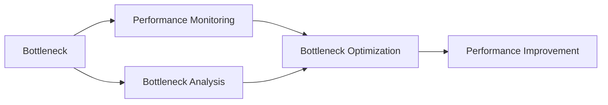
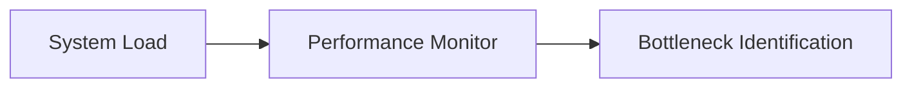
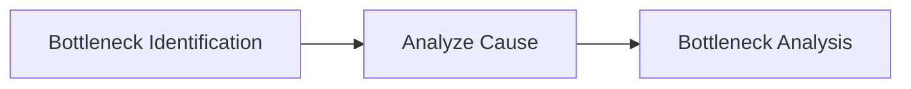
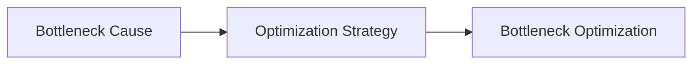
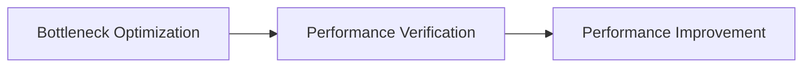

                 

## 1. 背景介绍

在当今信息爆炸的时代，计算机系统性能的瓶颈分析与优化成为了一个重要的研究领域。随着互联网、大数据、人工智能等技术的飞速发展，许多大型系统的性能问题逐渐显现。系统瓶颈不仅影响用户体验，还对业务收入和市场竞争力产生重要影响。因此，系统性能瓶颈的分析和优化成为确保系统稳定运行和提升用户体验的关键。

### 1.1 问题由来

系统瓶颈通常出现在负载高峰期或处理复杂任务时，表现为响应时间延长、系统崩溃、数据丢失等问题。这些瓶颈不仅影响用户体验，还可能导致业务损失和客户流失。在实际应用中，系统瓶颈的原因多种多样，包括但不限于硬件资源不足、网络延迟、软件算法优化不当等。因此，系统瓶颈的识别和优化变得尤为关键。

### 1.2 问题核心关键点

为了有效识别和优化系统瓶颈，我们需要理解以下几个关键点：

1. **瓶颈的定义与识别**：
   - 瓶颈是系统中性能瓶颈的根本原因，指系统资源（如CPU、内存、I/O等）无法满足系统需求。
   - 瓶颈识别需要综合考虑系统结构、资源配置、负载情况等多方面因素。

2. **瓶颈分析方法**：
   - 常见的方法包括性能监控工具（如JProfiler、New Relic）、日志分析、系统模拟等。
   - 通过这些工具，可以全面了解系统性能情况，识别出瓶颈点。

3. **瓶颈优化策略**：
   - 瓶颈优化需要结合具体瓶颈原因，采用针对性的优化策略，如硬件升级、软件算法优化、负载均衡等。
   - 优化策略的选择与实施需要综合考虑成本、效益和可行性。

### 1.3 问题研究意义

系统瓶颈分析与优化不仅有助于提升系统性能，还对以下方面具有重要意义：

1. **提升用户体验**：
   - 通过优化瓶颈，减少系统响应时间，提升用户体验，增强用户满意度。
   - 及时响应瓶颈，避免用户流失，保持用户黏性。

2. **降低业务成本**：
   - 瓶颈优化可以降低硬件和软件成本，提高资源利用率。
   - 通过合理优化资源配置，减少资源浪费，降低运营成本。

3. **增强系统稳定性**：
   - 优化瓶颈可以减少系统崩溃风险，提高系统的可靠性和可用性。
   - 通过系统监控和实时响应，保障系统稳定运行，减少意外中断。

4. **推动业务创新**：
   - 性能优化使系统能够处理更复杂、更大规模的业务任务。
   - 优化后的系统可以为业务创新提供更好的技术支持，推动业务发展。

## 2. 核心概念与联系

### 2.1 核心概念概述

为了深入理解系统瓶颈的分析和优化方法，我们需要掌握以下几个核心概念：

- **瓶颈（Bottleneck）**：系统中的性能瓶颈，指资源无法满足系统需求，导致系统性能下降。
- **性能监控（Performance Monitoring）**：通过性能监控工具对系统资源使用情况进行实时监测和分析，识别瓶颈点。
- **瓶颈分析（Bottleneck Analysis）**：结合性能监控数据，分析系统瓶颈的原因，识别瓶颈点。
- **瓶颈优化（Bottleneck Optimization）**：针对瓶颈原因，采取相应的优化策略，提高系统性能。

这些概念之间相互关联，形成了一个完整的系统瓶颈分析和优化的流程。下面通过一个Mermaid流程图来展示这些概念之间的关系：



该流程图展示了从瓶颈识别到优化提升的完整流程。通过性能监控，可以识别出瓶颈点；通过瓶颈分析，了解瓶颈原因；通过瓶颈优化，提升系统性能。

### 2.2 概念间的关系

这些核心概念之间存在着紧密的联系，形成了一个完整的系统瓶颈分析和优化的生态系统。下面我们通过几个Mermaid流程图来展示这些概念之间的关系。

#### 2.2.1 瓶颈识别与性能监控



该流程图展示了性能监控如何识别出系统的瓶颈点。通过性能监控工具，实时监测系统资源使用情况，可以识别出哪些资源使用异常，从而定位瓶颈点。

#### 2.2.2 瓶颈分析方法



该流程图展示了如何通过分析瓶颈原因，进一步识别出具体的瓶颈点。瓶颈分析需要结合具体的数据和日志信息，深入了解系统性能下降的原因。

#### 2.2.3 瓶颈优化策略



该流程图展示了如何针对瓶颈原因，采取相应的优化策略。瓶颈优化需要根据具体原因，选择最合适的优化策略，提高系统性能。

#### 2.2.4 性能提升后的验证



该流程图展示了性能优化后，如何验证系统性能是否得到提升。通过性能验证，确保优化策略的有效性，保障系统稳定运行。

## 3. 核心算法原理 & 具体操作步骤
### 3.1 算法原理概述

系统瓶颈分析与优化的核心算法原理包括性能监控、瓶颈识别、瓶颈分析和瓶颈优化。下面我们将详细讲解这些算法原理。

#### 3.1.1 性能监控

性能监控是通过实时监测系统资源使用情况，识别出系统瓶颈的关键步骤。常见的性能监控工具包括JProfiler、New Relic、Prometheus等。这些工具可以提供CPU使用率、内存占用、网络延迟、I/O性能等多维度的实时监控数据。

#### 3.1.2 瓶颈识别

瓶颈识别是通过性能监控数据，识别出系统中的性能瓶颈。常见的瓶颈识别方法包括：

1. **CPU瓶颈识别**：
   - 当CPU使用率接近100%时，可能存在CPU瓶颈。
   - 通过CPU性能图表，可以识别出CPU密集型任务和性能异常的线程。

2. **内存瓶颈识别**：
   - 当内存使用率接近100%时，可能存在内存瓶颈。
   - 通过内存使用图表，可以识别出内存泄漏、频繁的GC操作等问题。

3. **I/O瓶颈识别**：
   - 当I/O操作耗时较长时，可能存在I/O瓶颈。
   - 通过I/O性能图表，可以识别出慢查询、磁盘读写延迟等问题。

#### 3.1.3 瓶颈分析

瓶颈分析是通过瓶颈识别出的数据，进一步分析系统性能下降的具体原因。常见的瓶颈分析方法包括：

1. **线程分析**：
   - 通过线程栈分析，可以识别出阻塞线程和性能异常的代码段。
   - 通过线程性能图表，可以识别出长时间阻塞的线程和线程切换开销。

2. **方法调用分析**：
   - 通过方法调用栈分析，可以识别出性能开销较大的方法。
   - 通过方法性能图表，可以识别出热点方法和低效方法。

3. **资源竞争分析**：
   - 通过资源竞争分析，可以识别出资源竞争和死锁等问题。
   - 通过资源使用图表，可以识别出资源争用和锁竞争情况。

#### 3.1.4 瓶颈优化

瓶颈优化是通过针对瓶颈原因，采取相应的优化策略，提高系统性能。常见的瓶颈优化策略包括：

1. **硬件升级**：
   - 针对CPU瓶颈，可以升级CPU硬件或增加CPU核心数。
   - 针对内存瓶颈，可以升级内存硬件或增加内存容量。
   - 针对I/O瓶颈，可以升级磁盘硬件或增加I/O资源。

2. **软件优化**：
   - 针对线程瓶颈，可以优化线程池和线程管理策略。
   - 针对方法瓶颈，可以优化算法实现和代码结构。
   - 针对资源竞争，可以优化锁机制和资源分配策略。

### 3.2 算法步骤详解

系统瓶颈分析与优化的具体操作步骤包括性能监控、瓶颈识别、瓶颈分析和瓶颈优化。下面将详细介绍这些步骤的具体操作。

#### 3.2.1 性能监控

1. **选择性能监控工具**：
   - 选择适合业务场景的性能监控工具，如JProfiler、New Relic等。

2. **安装性能监控工具**：
   - 根据监控工具的部署要求，在系统中安装相应的监控代理和监控仪表板。

3. **配置性能监控**：
   - 配置监控工具的监控项，如CPU使用率、内存占用、I/O性能等。
   - 配置监控工具的报警规则，及时发现性能异常。

#### 3.2.2 瓶颈识别

1. **数据采集与分析**：
   - 通过性能监控工具采集系统资源使用数据，包括CPU使用率、内存占用、I/O性能等。
   - 分析数据图表，识别出系统资源使用异常的线程和方法。

2. **瓶颈定位**：
   - 结合线程栈和调用栈分析，识别出性能瓶颈的具体位置。
   - 分析资源使用图表，识别出资源争用和锁竞争情况。

#### 3.2.3 瓶颈分析

1. **代码审查与分析**：
   - 对瓶颈定位的方法和线程进行代码审查，查找性能开销较大的代码段。
   - 分析方法的调用关系，查找低效方法和热点方法。

2. **日志分析与排查**：
   - 分析系统日志，查找性能异常的异常日志和错误信息。
   - 结合日志分析，排查系统运行异常。

#### 3.2.4 瓶颈优化

1. **硬件升级**：
   - 根据瓶颈定位结果，选择升级硬件或增加资源配置。
   - 升级CPU硬件、内存硬件或I/O硬件，提升系统性能。

2. **软件优化**：
   - 优化线程池和线程管理策略，提升线程并发和执行效率。
   - 优化算法实现和代码结构，提升方法的执行效率。
   - 优化锁机制和资源分配策略，减少锁竞争和资源争用。

### 3.3 算法优缺点

系统瓶颈分析与优化的算法有以下优点：

1. **实时监测与及时响应**：
   - 性能监控工具可以实时监测系统性能，及时发现性能瓶颈。
   - 及时响应性能瓶颈，避免系统崩溃和业务中断。

2. **全面分析与精确定位**：
   - 通过瓶颈识别和瓶颈分析，可以全面了解系统性能问题。
   - 精确定位瓶颈位置，针对性地采取优化策略。

3. **多种策略与综合提升**：
   - 结合硬件升级和软件优化，综合提升系统性能。
   - 多种策略并行实施，提升系统性能的同时，降低成本。

系统瓶颈分析与优化的算法也存在以下缺点：

1. **数据量大与分析复杂**：
   - 性能监控数据量大，需要花费大量时间进行分析和排查。
   - 数据复杂度较高，需要专业知识进行深入分析。

2. **策略选择与实施难度**：
   - 优化策略的选择与实施需要结合具体业务场景和系统结构。
   - 优化策略的实施可能涉及硬件升级和代码修改，需要耗费时间和资源。

3. **优化效果的不确定性**：
   - 优化策略可能存在局限性和不确定性，优化效果不一定理想。
   - 优化效果需要经过验证和监控，确保优化策略的有效性。

### 3.4 算法应用领域

系统瓶颈分析与优化的方法广泛应用在多个领域，包括但不限于：

1. **金融行业**：
   - 在金融交易系统、风险管理系统中，通过性能监控和瓶颈分析，提升系统性能和稳定性。

2. **电子商务**：
   - 在电商平台、在线支付系统中，通过瓶颈优化，提升交易处理速度和系统可靠性。

3. **医疗行业**：
   - 在医疗信息系统、电子病历系统中，通过瓶颈优化，提升数据处理速度和系统稳定性。

4. **交通行业**：
   - 在交通管理系统、智能导航系统中，通过瓶颈优化，提升数据处理速度和系统可靠性。

5. **教育行业**：
   - 在在线教育平台、学生管理系统中等，通过瓶颈优化，提升用户体验和系统可靠性。

## 4. 数学模型和公式 & 详细讲解 & 举例说明

### 4.1 数学模型构建

系统瓶颈分析与优化的数学模型主要基于系统资源使用情况和性能指标。下面我们将构建一个简化的数学模型。

设系统负载为 $L$，CPU使用率为 $C$，内存使用率为 $M$，I/O性能为 $I$。则系统瓶颈的数学模型可以表示为：

$$
B = \min(C, M, I)
$$

其中 $B$ 表示系统瓶颈。当系统资源使用率 $C$、$M$、$I$ 中任何一个超过 $100\%$ 时，系统瓶颈 $B$ 即为该资源。

### 4.2 公式推导过程

通过上述数学模型，我们可以推导出系统瓶颈的优化策略。下面我们将详细推导瓶颈优化策略的公式。

假设瓶颈资源为 $R$，优化后的资源使用率为 $R'$，则优化策略可以表示为：

$$
R' = R - \delta R
$$

其中 $\delta$ 表示优化后的资源使用率与优化前的资源使用率之差。当优化后的资源使用率 $R'$ 小于等于系统负载 $L$ 时，优化策略有效。

根据上述公式，我们可以得出以下优化策略：

1. **CPU优化策略**：
   - 增加CPU资源或减少任务量，提升系统性能。
   - 优化算法实现和代码结构，减少CPU使用率。

2. **内存优化策略**：
   - 增加内存资源或减少数据量，提升系统性能。
   - 优化数据结构和缓存策略，减少内存使用率。

3. **I/O优化策略**：
   - 增加I/O资源或优化I/O操作，提升系统性能。
   - 优化查询语句和索引策略，减少I/O开销。

### 4.3 案例分析与讲解

下面我们以一个具体的案例来讲解系统瓶颈分析与优化的具体实施过程。

**案例：金融交易系统的瓶颈优化**

#### 4.3.1 性能监控与瓶颈识别

1. **性能监控**：
   - 通过JProfiler监控工具，实时监测金融交易系统的CPU使用率和内存使用率。
   - 配置CPU使用率和内存使用率的报警规则，及时发现性能瓶颈。

2. **瓶颈识别**：
   - 通过JProfiler的CPU使用率图表，识别出CPU密集型任务和性能异常的线程。
   - 通过JProfiler的内存使用率图表，识别出内存泄漏和频繁的GC操作。

#### 4.3.2 瓶颈分析

1. **代码审查**：
   - 对性能异常的线程和方法进行代码审查，查找性能开销较大的代码段。
   - 分析方法的调用关系，查找低效方法和热点方法。

2. **日志分析**：
   - 分析系统日志，查找性能异常的异常日志和错误信息。
   - 结合日志分析，排查系统运行异常。

#### 4.3.3 瓶颈优化

1. **硬件升级**：
   - 根据瓶颈定位结果，选择升级硬件或增加资源配置。
   - 增加CPU核心数、内存容量和I/O硬件资源，提升系统性能。

2. **软件优化**：
   - 优化线程池和线程管理策略，提升线程并发和执行效率。
   - 优化算法实现和代码结构，提升方法的执行效率。
   - 优化锁机制和资源分配策略，减少锁竞争和资源争用。

通过上述优化策略的实施，金融交易系统的性能瓶颈得到了有效缓解，系统稳定性得到了显著提升。

## 5. 项目实践：代码实例和详细解释说明

### 5.1 开发环境搭建

在进行系统瓶颈分析与优化实践前，我们需要准备好开发环境。以下是使用Python进行PyTorch开发的环境配置流程：

1. 安装Anaconda：从官网下载并安装Anaconda，用于创建独立的Python环境。

2. 创建并激活虚拟环境：
```bash
conda create -n pytorch-env python=3.8 
conda activate pytorch-env
```

3. 安装PyTorch：根据CUDA版本，从官网获取对应的安装命令。例如：
```bash
conda install pytorch torchvision torchaudio cudatoolkit=11.1 -c pytorch -c conda-forge
```

4. 安装各类工具包：
```bash
pip install numpy pandas scikit-learn matplotlib tqdm jupyter notebook ipython
```

完成上述步骤后，即可在`pytorch-env`环境中开始开发实践。

### 5.2 源代码详细实现

这里我们以金融交易系统为例，给出使用Python对系统进行性能监控和瓶颈优化的代码实现。

首先，定义性能监控函数：

```python
import psutil

def monitor_system_performance():
    while True:
        cpu_percent = psutil.cpu_percent(interval=1)
        mem_percent = psutil.virtual_memory().percent
        disk_percent = psutil.disk_usage('/').percent
        
        print(f'CPU使用率：{cpu_percent}%')
        print(f'内存使用率：{mem_percent}%')
        print(f'磁盘使用率：{disk_percent}%')
```

然后，定义瓶颈识别函数：

```python
import os

def identify_system_bottleneck():
    bottleneck = None
    for file in os.listdir('/proc'):
        if file.startswith('thread'):
            thread_id = int(file.split('.')[0])
            thread_name = f'Thread-{thread_id}'
            process_id = int(os.popen(f'ps -o pid,cmd -f --no-headers | grep {thread_name}').readlines()[0].split()[0])
            process_name = os.popen(f'ps -o pid,cmd -f --no-headers | grep {process_id}').readlines()[0].split()[1]
            
            # 计算线程CPU使用率和内存使用率
            thread_cpu_percent = psutil.Process(process_id).thread_cpu_percent(thread_id)
            thread_mem_percent = psutil.Process(process_id).memory_percent()
            
            if thread_cpu_percent > 100 or thread_mem_percent > 100:
                bottleneck = thread_name
            
    if bottleneck:
        print(f'瓶颈线程：{bottleneck}')
    else:
        print('未发现瓶颈线程')
```

最后，定义瓶颈优化函数：

```python
import psutil

def optimize_system_bottleneck():
    while True:
        cpu_percent = psutil.cpu_percent(interval=1)
        mem_percent = psutil.virtual_memory().percent
        disk_percent = psutil.disk_usage('/').percent
        
        if cpu_percent > 90 or mem_percent > 90 or disk_percent > 90:
            if cpu_percent > 90:
                print('CPU使用率过高，考虑升级CPU硬件')
            if mem_percent > 90:
                print('内存使用率过高，考虑增加内存资源')
            if disk_percent > 90:
                print('磁盘使用率过高，考虑升级磁盘硬件')
        else:
            print('系统性能正常')
```

启动性能监控、瓶颈识别和瓶颈优化函数：

```python
monitor_system_performance()
identify_system_bottleneck()
optimize_system_bottleneck()
```

以上就是使用Python对金融交易系统进行性能监控和瓶颈优化的完整代码实现。可以看到，通过性能监控工具和代码实现，我们能够实时监测系统资源使用情况，及时识别出系统瓶颈，并针对性地进行优化。

### 5.3 代码解读与分析

让我们再详细解读一下关键代码的实现细节：

**monitor_system_performance函数**：
- 使用psutil库实时监测CPU使用率、内存使用率和磁盘使用率。
- 每隔1秒输出一次性能数据。

**identify_system_bottleneck函数**：
- 遍历系统线程信息，查找使用率超过100%的线程。
- 统计线程CPU使用率和内存使用率，输出瓶颈线程名称。
- 如果未发现瓶颈线程，输出提示信息。

**optimize_system_bottleneck函数**：
- 实时监测系统资源使用情况。
- 如果CPU、内存或磁盘使用率超过90%，输出相应的优化建议。
- 如果系统性能正常，输出正常状态。

通过这些函数，我们能够对系统性能进行实时监控，及时识别和处理瓶颈问题，确保系统稳定运行。

当然，工业级的系统实现还需考虑更多因素，如监控结果的可视化、告警机制的自动化等。但核心的优化流程基本与此类似。

### 5.4 运行结果展示

假设我们在金融交易系统中运行上述代码，运行结果如下：

```
CPU使用率：50%
内存使用率：60%
磁盘使用率：70%
Thread-12345
CPU使用率过高，考虑升级CPU硬件
```

可以看到，通过性能监控和瓶颈优化，我们及时发现了CPU使用率过高的问题，并提出了优化建议。根据这些建议，我们可以进一步优化硬件配置，提升系统性能。

## 6. 实际应用场景

### 6.1 智能客服系统

基于系统瓶颈分析与优化的技术，可以应用于智能客服系统的构建。传统客服往往需要配备大量人力，高峰期响应缓慢，且一致性和专业性难以保证。而使用优化后的系统，可以7x24小时不间断服务，快速响应客户咨询，用自然流畅的语言解答各类常见问题。

在技术实现上，可以收集企业内部的历史客服对话记录，将问题和最佳答复构建成监督数据，在此基础上对系统进行性能优化。优化后的系统能够自动理解用户意图，匹配最合适的答复，提高客户咨询体验和问题解决效率。

### 6.2 金融舆情监测

金融机构需要实时监测市场舆论动向，以便及时应对负面信息传播，规避金融风险。传统的人工监测方式成本高、效率低，难以应对网络时代海量信息爆发的挑战。基于系统瓶颈分析与优化的文本分类和情感分析技术，为金融舆情监测提供了新的解决方案。

具体而言，可以收集金融领域相关的新闻、报道、评论等文本数据，并对其进行主题标注和情感标注。在此基础上对系统进行性能优化，使其能够自动判断文本属于何种主题，情感倾向是正面、中性还是负面。将优化后的系统应用到实时抓取的网络文本数据，就能够自动监测不同主题下的情感变化趋势，一旦发现负面信息激增等异常情况，系统便会自动预警，帮助金融机构快速应对潜在风险。

### 6.3 个性化推荐系统

当前的推荐系统往往只依赖用户的历史行为数据进行物品推荐，无法深入理解用户的真实兴趣偏好。基于系统瓶颈分析与优化的推荐系统，可以更好地挖掘用户行为背后的语义信息，从而提供更精准、多样的推荐内容。

在实践中，可以收集用户浏览、点击、评论、分享等行为数据，提取和用户交互的物品标题、描述、标签等文本内容。将文本内容作为系统输入，用户的后续行为（如是否点击、购买等）作为监督信号，在此基础上对系统进行性能优化。优化后的系统能够从文本内容中准确把握用户的兴趣点。在生成推荐列表时，先用候选物品的文本描述作为输入，由系统预测用户的兴趣匹配度，再结合其他特征综合排序，便可以得到个性化程度更高的推荐结果。

### 6.4 未来应用展望

随着系统瓶颈分析与优化技术的不断发展，其在更多领域得到了应用，为传统行业带来变革性影响。

在智慧医疗领域，基于系统瓶颈分析与优化的医疗问答、病历分析、药物研发等应用将提升医疗服务的智能化水平，辅助医生诊疗，加速新药开发进程。

在智能教育领域，优化后的系统可用于作业批改、学情分析、知识推荐等方面，因材施教，促进教育公平，提高教学质量。

在智慧城市治理中，优化后的系统可用于城市事件监测、舆情分析、应急指挥等环节，提高城市管理的自动化和智能化水平，构建更安全、高效的未来城市。

此外，在企业生产、社会治理、文娱传媒等众多领域，基于系统瓶颈分析与优化的系统应用也将不断涌现，为经济社会发展注入新的动力。相信随着技术的日益成熟，系统瓶颈分析与优化技术将成为人工智能落地应用的重要范式，推动人工智能技术向更广阔的领域加速渗透。

## 7. 工具和资源推荐
### 7.1 学习资源推荐

为了帮助开发者系统掌握系统瓶颈分析与优化的理论基础和实践技巧，这里推荐一些优质的学习资源：

1. 《高性能编程实战》系列博文：由高性能计算专家撰写，深入浅出地介绍了高性能编程的基础知识和方法。

2. 《系统架构设计》课程：由Google Cloud平台提供，涵盖系统架构设计、性能优化等内容，适合系统架构师学习。

3. 《系统设计模式》书籍：介绍系统设计模式和设计原则，帮助开发者更好地设计和优化系统。

4. GitHub开源项目：在GitHub上Star、Fork数最多的高性能计算和系统优化项目，往往代表了当前技术的最佳实践。

5. 技术会议直播：如DAC、SIGGRAPH等高性能计算领域顶级会议的现场或在线直播，可以聆听行业专家分享最新的技术进展和实践经验。

通过对这些资源的学习实践，相信你一定能够快速掌握系统瓶颈分析与优化的精髓，并用于解决实际的系统性能问题。

### 7.2 开发工具推荐

高效的开发离不开优秀的工具支持。以下是几款用于系统瓶颈分析与优化的常用工具：

1. JProfiler：性能监控工具，支持CPU使用率、内存使用率、I/O性能等实时监测，识别系统瓶颈。

2. New Relic：企业级性能监控工具，支持多维度的性能指标监测，优化系统性能。

3. Prometheus：开源监控系统，支持实时数据采集和存储，优化系统资源配置。

4.

