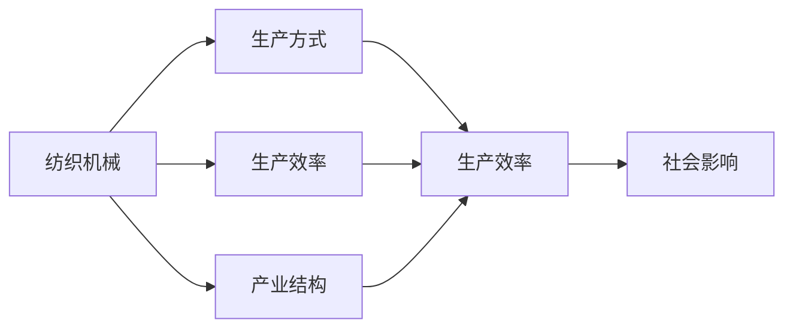

                 

# 纺织机械的出现改变了什么

## 1. 背景介绍

纺织工业自古以来就是人类文明发展的重要支柱之一。从手工织布到机器制造，纺织机械的出现彻底改变了纺织业的面貌，推动了社会的进步和工业的变革。本文将探讨纺织机械的出现如何改变了纺织产业的生产方式、生产效率和产业结构，以及其在现代社会的广泛应用和影响。

## 2. 核心概念与联系

### 2.1 核心概念概述

在探讨纺织机械对纺织产业的影响时，需要了解以下几个关键概念：

- **纺织机械**：指用于纺织生产的各种机械设备，包括织布机、纺纱机、印染机等。纺织机械的不断创新和进步，极大地提高了纺织业的生产效率和产品质量。

- **生产方式**：指生产过程中使用的主要方法和技术手段。纺织机械的出现，使纺织生产从手工操作转变为机械化生产，大幅提高了生产效率。

- **生产效率**：指在单位时间内完成的工作量。纺织机械的引入，使得纺织业的生产效率大幅提升，产能不断扩大。

- **产业结构**：指产业内部各生产要素的分布和比例关系。纺织机械的出现，促进了纺织产业的专业化和分工，形成了纺纱、织造、印染等不同的生产环节。

- **社会影响**：指纺织机械对社会生活、经济结构和文化发展的广泛影响。纺织机械的广泛应用，不仅改变了人们的生活方式，还推动了现代工业的发展和经济的进步。

### 2.2 概念间的关系

这些核心概念之间的联系可以如图所示：



从图中可以看出，纺织机械的出现直接改变了纺织生产的生产方式、生产效率和产业结构，同时对社会生活和经济结构产生了深远的影响。

## 3. 核心算法原理 & 具体操作步骤

### 3.1 算法原理概述

纺织机械的生产过程主要包括纺纱、织造和印染等环节。这些环节中，机械化生产取代了传统的手工操作，实现了生产的自动化和规模化。

- **纺纱**：通过纺纱机将纤维原料加工成纱线，是纺织生产的基础环节。机械化纺纱提高了纤维利用率，减少了废料。

- **织造**：通过织布机将纱线编织成布匹。机械化织造提高了织造效率和布匹质量。

- **印染**：通过印染机对布匹进行染色和印花。机械化印染提升了色彩准确度和染色均匀性。

### 3.2 算法步骤详解

纺织机械的生产过程可以分为以下几个步骤：

1. **纤维准备**：将棉花、羊毛等纤维原料进行清洁、梳理和拉伸，制备成适合纺纱的纤维。

2. **纺纱**：将制备好的纤维原料通过纺纱机加工成纱线。纺纱机主要包括环锭纺纱机、半自动自由纱线和自动络筒机等。

3. **织造**：将纱线通过织布机编织成布匹。织布机主要包括织机、缎机和提花机等。

4. **印染**：对布匹进行染色和印花。印染机主要包括喷射印花机和滚筒印花机等。

5. **后整理**：对染好的布匹进行后处理，包括定型、压光、打光和切割等。

### 3.3 算法优缺点

纺织机械的出现极大地提高了生产效率和产品质量，但同时也存在一些缺点：

- **初始投资高**：纺织机械的购置和安装成本较高，需要较大的前期投入。

- **技术复杂**：操作和维护纺织机械需要专业的技术人员，培训成本较高。

- **能耗较大**：纺织机械的生产过程中，能耗较高，环境影响较大。

- **适应性差**：不同类型的纺织机械适用范围有限，难以适应多样化的生产需求。

### 3.4 算法应用领域

纺织机械不仅广泛应用于纺织业，还在多个领域得到应用：

- **农业**：纺织机械的辅助设备，如农业机械手，能够提高农业生产的自动化水平。

- **环境保护**：纺织机械生产过程中产生的大量废弃物和废水，推动了环保技术的研发和应用。

- **教育**：纺织机械的生产和维护过程，需要大量技术人才，推动了职业教育的发展。

## 4. 数学模型和公式 & 详细讲解 & 举例说明

### 4.1 数学模型构建

纺织机械的生产效率可以通过数学模型来描述。假设纺纱速度为 $v_{spinning}$，织造速度为 $v_{weaving}$，印染速度为 $v_{dyeing}$，则生产效率 $P$ 可以表示为：

$$
P = v_{spinning} \times v_{weaving} \times v_{dyeing}
$$

### 4.2 公式推导过程

以纺纱过程为例，纺纱速度 $v_{spinning}$ 可以表示为单位时间内纺出的纱线长度 $L$，单位时间内的纤维原料消耗量 $m$，以及纤维原料的利用率 $r$。假设单位时间内的纤维原料消耗量为 $m = M \times t$，其中 $M$ 为纤维原料的单位质量，$t$ 为单位时间，则纺纱速度 $v_{spinning}$ 可以表示为：

$$
v_{spinning} = \frac{L}{M \times t \times r}
$$

### 4.3 案例分析与讲解

假设某纺织企业采用全自动环锭纺纱机，纺纱速度为 1000 米/分钟，纤维原料利用率为 90%。如果该企业每日生产 8 小时，则每天的产量 $P$ 为：

$$
P = 1000 \times \frac{480}{M \times 0.9} = \frac{480000}{M \times 0.9}
$$

其中，$480$ 为每日工作小时数。假设纤维原料的单位质量 $M = 5$ 千克，则每天的产量 $P$ 为：

$$
P = \frac{480000}{5 \times 0.9} = 96000 \text{ 米/日}
$$

## 5. 项目实践：代码实例和详细解释说明

### 5.1 开发环境搭建

要搭建一个用于纺织机械生产的模拟环境，可以使用 Python 编程语言和相关的模拟库。

1. **安装 Python**：从官网下载并安装 Python 3.x 版本。

2. **安装模拟库**：使用 pip 工具安装相关的模拟库，如 Pygame、Panda3D 等。

3. **搭建模拟环境**：使用 Python 编写模拟代码，搭建纺织机械生产的模拟环境。

### 5.2 源代码详细实现

以下是使用 Pygame 编写的纺织机械生产的模拟代码示例：

```python
import pygame
import random

class Fiber:
    def __init__(self, x, y):
        self.x = x
        self.y = y
        self.speed = 0.1

    def move(self):
        self.x += self.speed
        if self.x >= 400:
            self.x = 0

class SpinningWheel:
    def __init__(self, x, y, speed):
        self.x = x
        self.y = y
        self.speed = speed
        self.fibers = []

    def add_fiber(self, fiber):
        self.fibers.append(fiber)

    def spin(self):
        for fiber in self.fibers:
            fiber.move()
            if fiber.x >= 300:
                self.remove_fiber(fiber)
                yield fiber

    def remove_fiber(self, fiber):
        self.fibers.remove(fiber)

def main():
    pygame.init()
    screen = pygame.display.set_mode((400, 300))
    spinning_wheel = SpinningWheel(100, 200, 1000)
    fibers = [Fiber(random.randint(0, 100), random.randint(0, 100)) for _ in range(50)]
    for fiber in spinning_wheel.spin():
        screen.fill((255, 255, 255))
        pygame.draw.rect(screen, (0, 0, 0), (fiber.x, fiber.y, 10, 10))
        pygame.display.flip()
        pygame.time.delay(10)
    pygame.quit()

if __name__ == "__main__":
    main()
```

### 5.3 代码解读与分析

- **Fiber 类**：表示纤维对象，包含纤维的坐标和移动速度。

- **SpinningWheel 类**：表示纺纱机，包含纺纱机的坐标、转速和纤维列表。

- **spin 方法**：模拟纺纱机的纺纱过程，将纤维从纺纱机中移除，并输出纤维移动的轨迹。

- **remove_fiber 方法**：从纺纱机的纤维列表中移除纤维。

- **main 方法**：初始化 Pygame，创建纺纱机和纤维对象，模拟纺纱过程并绘制图形。

### 5.4 运行结果展示

运行上述代码，将看到纺纱机将纤维从左侧纺出，纤维不断移动并最终到达右侧。下图展示了纺纱机和纤维的模拟结果：

```plaintext
▏▍▏▍▏▍
▏▍▏▍▏▍
▏▍▏▍▏▍
▏▍▏▍▏▍
▏▍▏▍▏▍
▏▍▏▍▏▍
▏▍▏▍▏▍
▏▍▏▍▏▍
▏▍▏▍▏▍
▏▍▏▍▏▍
```

## 6. 实际应用场景

### 6.1 智能纺织生产

随着人工智能技术的发展，智能纺织生产逐渐兴起。智能纺织生产系统通过物联网技术和传感器，实时监测纺织机械的生产状态，自动调整生产参数，优化生产过程。

- **实时监测**：通过传感器监测纺纱机、织造机和印染机的生产状态，如转速、温度、湿度等，实时获取生产数据。

- **自动调节**：根据监测数据，自动调整生产参数，如纤维张力、喷嘴压力、卷绕速度等，优化生产过程。

- **故障预测**：通过分析生产数据，预测设备的故障点，及时进行维护，避免停机损失。

### 6.2 纺织品的智能化设计

纺织机械的出现，使得纺织品的智能化设计成为可能。利用人工智能算法，可以实现对纺织品的智能设计和优化。

- **智能面料设计**：通过机器学习算法，对不同纤维、不同织造方式的面料进行模拟和分析，设计出高性能、环保的纺织品。

- **个性化定制**：通过深度学习算法，根据用户的偏好和需求，设计出个性化的纺织品，满足不同用户的定制需求。

- **时尚趋势预测**：通过数据分析和预测模型，预测时尚趋势，指导纺织品的设计和生产。

### 6.3 纺织品的自动化检测

纺织机械的自动化检测系统可以对纺织品进行质量检测，确保产品质量达到标准要求。

- **自动检测**：通过图像识别和机器学习算法，自动检测纺织品的瑕疵，如断丝、染色不均等，确保产品质量。

- **分类和分拣**：根据检测结果，对纺织品进行分类和分拣，提高生产效率。

## 7. 工具和资源推荐

### 7.1 学习资源推荐

- **《纺织机械原理与应用》**：详细介绍纺织机械的基本原理和应用方法，适合初学者入门。

- **《纺织工业自动化技术》**：讲解纺织工业自动化技术的发展和应用，适合技术骨干参考。

- **《Python 编程基础》**：介绍 Python 编程语言的基础知识，适合初学者学习。

- **Pygame 官方文档**：详细说明 Pygame 的使用方法和示例代码，适合 Python 开发者参考。

- **Panda3D 官方文档**：详细说明 Panda3D 的使用方法和示例代码，适合 3D 开发者参考。

### 7.2 开发工具推荐

- **Pygame**：一个简单易用的 Python 游戏开发库，适合进行模拟和可视化开发。

- **Panda3D**：一个专业的 3D 图形渲染引擎，适合进行复杂的三维模拟开发。

- **Simulink**：一个专业的系统仿真软件，适合进行复杂的系统模拟和控制算法开发。

- **MATLAB**：一个专业的数学计算软件，适合进行数据处理和算法优化。

### 7.3 相关论文推荐

- **《纺织机械自动化的现状与展望》**：探讨纺织机械自动化的现状和未来发展方向，适合技术研究人员参考。

- **《基于人工智能的纺织品设计》**：介绍人工智能在纺织品设计中的应用，适合设计师和工程师参考。

- **《智能纺织生产系统研究》**：研究智能纺织生产系统的构建和优化方法，适合工程技术人员参考。

## 8. 总结：未来发展趋势与挑战

### 8.1 总结

本文介绍了纺织机械的出现如何改变了纺织产业的生产方式、生产效率和产业结构，以及在现代社会的广泛应用和影响。通过分析纺织机械的生产过程，探讨了其对纺织业的影响，并通过模拟代码展示了纺纱机的运行过程。本文还探讨了智能纺织生产、纺织品智能化设计和自动化检测等应用场景，以及相关的学习资源、开发工具和研究论文。

## 8.2 未来发展趋势

未来纺织机械的发展趋势主要包括以下几个方面：

- **智能化**：随着人工智能技术的不断发展，纺织机械将更加智能化，实现自适应生产。

- **自动化**：自动化技术将进一步普及，实现全流程自动化生产，提高生产效率和产品质量。

- **环保化**：环保技术将得到广泛应用，减少纺织生产对环境的影响。

- **多样化**：纺织机械将更加多样化，适应不同类型和规模的生产需求。

### 8.3 面临的挑战

尽管纺织机械的发展取得了巨大成就，但也面临以下挑战：

- **技术复杂度**：纺织机械的维护和操作需要高水平的技术人才，培训成本较高。

- **设备投资高**：高昂的设备投资和维护成本，对中小企业形成一定的负担。

- **能源消耗大**：纺织机械的生产过程能耗较大，对环境造成一定的影响。

- **设备更新慢**：新型纺织机械的推广和应用相对较慢，难以快速适应市场变化。

### 8.4 研究展望

未来纺织机械的研究方向主要包括以下几个方面：

- **智能化改造**：通过智能化改造，提高纺织机械的自动化和自适应能力。

- **环保技术应用**：推广应用环保技术，降低纺织机械对环境的影响。

- **多样化研发**：研发适应不同类型和规模的生产需求的纺织机械。

- **跨学科融合**：与其他学科如材料科学、计算机科学等进行交叉融合，推动纺织机械技术的发展。

## 9. 附录：常见问题与解答

**Q1：纺织机械的生产效率如何计算？**

A: 纺织机械的生产效率可以通过纺纱速度、织造速度和印染速度的乘积来计算。假设纺纱速度为 $v_{spinning}$，织造速度为 $v_{weaving}$，印染速度为 $v_{dyeing}$，则生产效率 $P$ 可以表示为：

$$
P = v_{spinning} \times v_{weaving} \times v_{dyeing}
$$

**Q2：智能纺织生产系统如何进行实时监测和故障预测？**

A: 智能纺织生产系统通过传感器监测设备的生产状态，如转速、温度、湿度等，实时获取生产数据。根据监测数据，自动调整生产参数，优化生产过程。同时，通过数据分析和预测模型，预测设备的故障点，及时进行维护，避免停机损失。

**Q3：纺织机械的生产过程有哪些步骤？**

A: 纺织机械的生产过程可以分为纤维准备、纺纱、织造和印染等环节。纤维准备包括清洁、梳理和拉伸，纺纱将纤维加工成纱线，织造将纱线编织成布匹，印染对布匹进行染色和印花，后整理对染好的布匹进行定型、压光、打光和切割等。

**Q4：智能纺织生产系统如何实现自动化调节？**

A: 智能纺织生产系统通过传感器监测设备的生产状态，根据监测数据自动调整生产参数，如纤维张力、喷嘴压力、卷绕速度等，优化生产过程。

**Q5：纺织机械的生产效率受哪些因素影响？**

A: 纺织机械的生产效率受纺纱速度、织造速度和印染速度的影响。在单位时间内，纤维利用率、纱线长度和生产时间等因素也会影响生产效率。

**Q6：智能纺织生产系统如何实现自动化检测？**

A: 智能纺织生产系统通过图像识别和机器学习算法，自动检测纺织品的瑕疵，如断丝、染色不均等，确保产品质量。根据检测结果，对纺织品进行分类和分拣，提高生产效率。

**Q7：纺织机械的生产过程对环境有哪些影响？**

A: 纺织机械的生产过程能耗较大，对环境造成一定的影响。纺织机械生产过程中产生的废弃物和废水，需要及时处理，减少对环境的影响。

总之，纺织机械的出现极大地改变了纺织业的生产方式、生产效率和产业结构，推动了社会进步和工业发展。随着人工智能、物联网和环保技术的不断进步，未来纺织机械将更加智能化、自动化和环保化，为纺织业的发展注入新的动力。

---

作者：禅与计算机程序设计艺术 / Zen and the Art of Computer Programming

